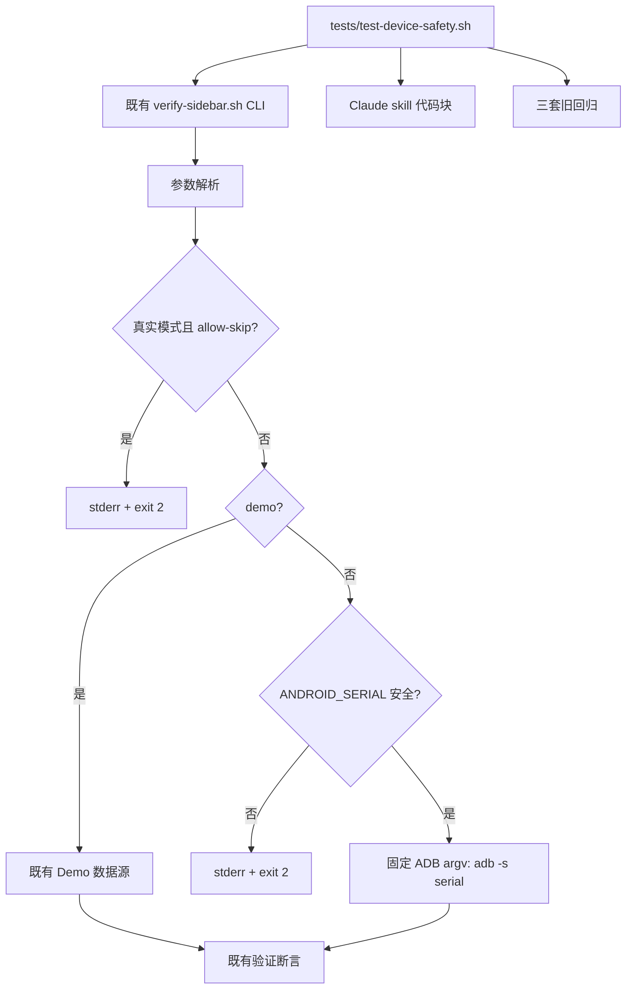
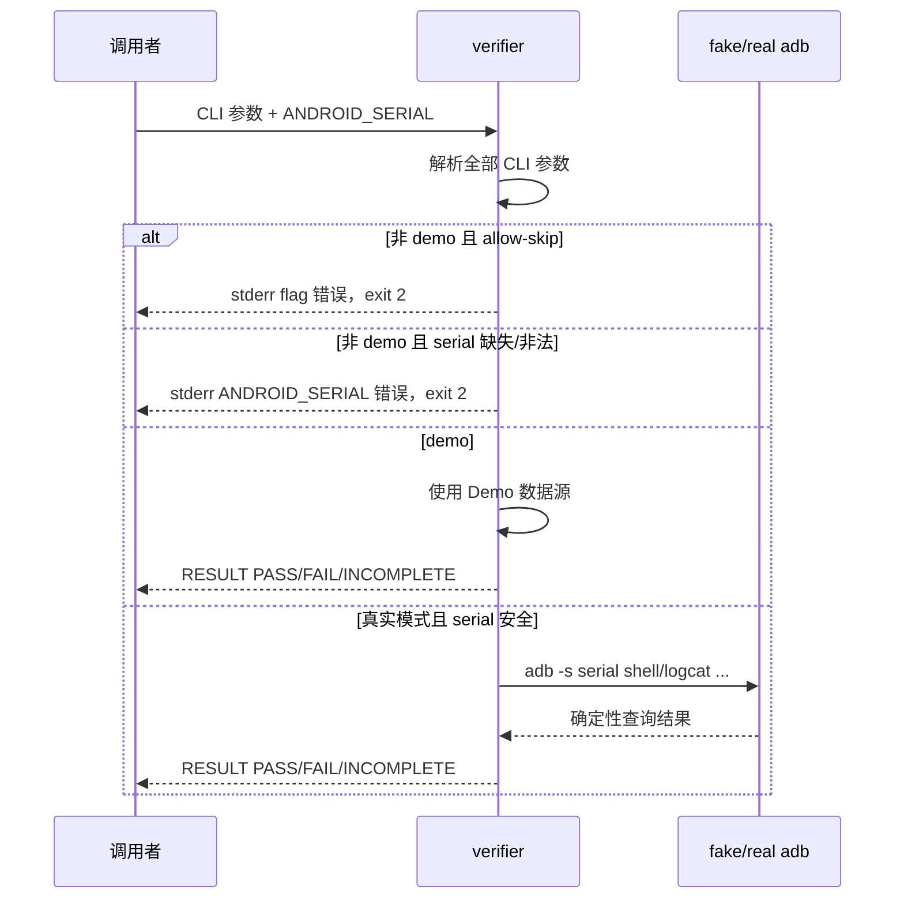
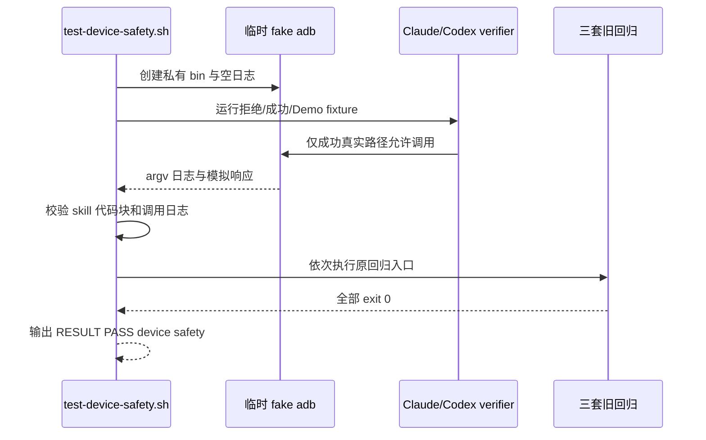

# 2026-08-31-01-device-safety 设计

## 1. 概述

在两个既有 verifier 的参数解析与设备调用之间加入 fail-closed 前置层，并用一份根级离线回归锁定 serial、SKIP 和 Claude 部署文档的设备选择约束。

- 选择在两个 verifier 内就地执行相同顺序的前置检查：先拒绝真实模式 `--allow-skip`，再校验真实模式 `ANDROID_SERIAL`；这样在后续公共 dispatcher 尚未落地时即可关闭风险。放弃本 spec 提前抽公共库，因为那会侵入 `05/06/09` 的边界并扩大回滚面。
- 选择将安全 serial 保存为单个 Bash 变量，并通过数组形式 `ADB=(adb -s "$serial")` 传递给 Claude verifier；这样每个参数保持分离且所有查询天然复用同一目标。放弃依赖 adb 的隐式 `ANDROID_SERIAL` 选择，因为它无法从命令日志证明目标，也容易被调用环境覆盖。
- 选择新增独立 `tests/test-device-safety.sh`，同时只对 Claude 旧回归中受目标固定影响的 fake ADB fixture 做兼容调整；这样新契约有单一可执行判据且三套旧入口继续回归。放弃把全部新矩阵塞入某一客户端旧套件，因为这会隐藏跨 Claude/Codex 的共同安全契约。

## 2. 需求映射

| 组件 | 实现的需求 |
|---|---|
| Claude verifier 前置层与 ADB adapter | R1, R2, R4, R5, R7 |
| Codex verifier flag 前置层 | R4, R5, R7 |
| Claude 真机流程 skill 代码块 | R3 |
| 根级 device-safety 隔离回归 | R1, R2, R3, R4, R5, R6, R7 |
| Claude 旧回归兼容 fixture | R6, R7 |

## 3. 架构

实现仍位于三个现有 Demo 的兼容边界内：不新增运行时公共依赖，不改变 verifier 路径或 CLI 参数集合。Shell 实现以 Bash 3.2 及以上和仓库现有的 `awk`、`grep`、`sed`、`mktemp` 为下限；不引入网络、第三方包或真实 ADB。后续 `09-verifier-adapters` 可以用公共 dispatcher 替换内部实现，但必须保留这里锁定的前置顺序和外部行为。

## 4. 组件与接口

### Claude verifier 前置层与 ADB adapter

- 职责：解析完参数后先判定 flag 组合，再校验 serial，并让真实模式的 `shell`、`logcat` 都通过同一固定 argv 调用。
- 对外接口：`claude-code/features/dev-sidebar/verify-sidebar.sh [--demo] [--allow-skip] [--since <epoch-seconds>]`
- 依赖：Bash；真实模式依赖外部 `adb`，Demo 模式不依赖 adb。
- 内部约束：`--allow-skip` 的真实模式错误必须发生在读取/校验 serial 之前；仅在非 Demo 且 serial 通过 `^[A-Za-z0-9][A-Za-z0-9._:-]*$` 后构造 `ADB=(adb -s "$serial")`。

### Codex verifier flag 前置层

- 职责：在现有 serial 校验前拒绝真实模式 `--allow-skip`，不改变既有 Demo SKIP 或真实验证逻辑。
- 对外接口：`codex/features/dev-sidebar/verify-sidebar.sh [--demo] [--allow-skip] [--since EPOCH] [--help]`
- 依赖：Bash、现有 verifier 逻辑。

### Claude 真机流程 skill 代码块

- 职责：使复制执行的 services.jar 部署和 sepolicy 真机验证片段都先完成显式 serial 校验，再使用固定目标执行每条 ADB 命令。
- 对外接口：`device_serial="${ANDROID_SERIAL-}"`；安全格式为 `^[A-Za-z0-9][A-Za-z0-9._:-]*$`；设备命令前缀为 `adb -s "$device_serial"`。
- 依赖：Bash 代码块、调用环境显式提供的 `ANDROID_SERIAL`。

### 根级 device-safety 隔离回归

- 职责：以私有 fake ADB 对两个 verifier 和两个 skill 做行为/静态取证，最后运行三套旧回归。
- 对外接口：`tests/test-device-safety.sh —— 无参数；全部通过时退出 0 且 stdout 末行为 RESULT PASS  device safety，任一断言失败时退出非零`
- 依赖：Bash、`mktemp`、`awk`、`grep`、`sed`，以及仓库内两个 verifier、两个 skill 和三套旧回归入口。
- 隔离规则：脚本创建只含 fake `adb` 的临时 `bin` 并将它置于 `PATH` 首位；所有真实模式 fixture 都显式使用该 `PATH`，fake ADB 将 argv 写入私有日志并返回确定性响应。

### Claude 旧回归兼容 fixture

- 职责：让既有整数 logcat baseline 测试显式设置安全 serial，并使其 fake adb 接受且检查 `-s <serial>` 前缀。
- 对外接口：无新增接口；`bash ./claude-code/features/.harness/tests/test-harness.sh` 保持原入口和成功语义。
- 依赖：Claude verifier 的固定 ADB argv。

## 5. 数据模型

不适用：本 spec 不创建持久化状态、schema 或跨进程会话。运行时只有当前进程内的 `demo/allow-skip/serial` 标量、固定 ADB argv，以及测试临时目录内的追加式 fake ADB 调用日志；测试退出时通过 trap 删除临时目录。

## 6. 数据流

### 真实 verifier 前置顺序

### 隔离测试取证

## 7. 错误处理

| 错误场景 | 恢复策略 | 校验位置 | 日志 | 用户可见 |
|---|---|---|---|---|
| 非 Demo 使用 `--allow-skip` | 立即终止，不读设备、不调用 ADB | 两个 verifier 参数解析之后、serial 校验之前 | 不写 ADB 日志 | stderr 含 `--allow-skip requires --demo`，exit 2 |
| Claude 真实模式 serial 缺失或非法 | 立即终止，不调用 ADB | Claude verifier 构造 ADB argv 前 | 不写 ADB 日志 | stderr 含 `ANDROID_SERIAL`，exit 2 |
| 合法 serial 下 ADB 查询失败 | 沿用 verifier 现有 FAIL/INCOMPLETE 语义，本 spec 不增加重试 | 既有查询/断言处 | fake ADB 记录含固定 `-s serial` 的 argv | 既有结果末行和非零退出码 |
| Demo 应用缺失且显式允许 SKIP | 保留探索路径，不触碰 ADB | 既有 package 断言与汇总处 | 无 ADB 日志 | 至少一行 `SKIP  `，末行 `RESULT PASS (SKIP allowed)`，exit 0 |
| skill 代码块缺少完整校验或出现裸 ADB | 离线测试失败，不执行代码块 | 根级测试的静态代码块检查 | stderr 指出文件和缺失约束 | test 脚本非零退出 |
| fake ADB 收到无 `-s`、错误 serial 或未知命令 | fake 命令返回非零并使 fixture 失败 | 临时 fake adb | 记录原始分离 argv | test 脚本非零退出 |
| 任一旧回归失败 | 停止成功汇总并返回失败 | 根级测试末段 | 保留旧回归自身输出 | 不输出成功末行，exit 非零 |

## 8. 测试策略

| 层 | 测什么 | 用什么工具 |
|---|---|---|
| 单元 | Claude serial 正反字符边界；两个入口四种 flag/serial 优先级组合；Demo 应用缺失 SKIP；skill 每个真机代码块的取值、完整 regex、固定变量和 ADB 前缀 | `tests/test-device-safety.sh` 内的 Bash 断言、临时 fake `adb`、`awk/grep/sed` 静态检查 |
| 集成 | Claude 两个合法 serial 的完整真实模式流程，证明所有 `shell/logcat` 调用固定目标且末行为 PASS | 同一根级测试通过私有 `PATH` 启动原 verifier 入口并核对追加式 argv 日志 |
| 端到端 | 新安全回归与 Claude、Codex、common 三套旧回归全部成功；两个 verifier 路径仍可执行 | `bash ./tests/test-device-safety.sh`；该脚本内部依次调用三套旧回归，并以精确成功末行收口 |
| 性能 | 不适用：只增加常数次字符串校验；PLAN 明确不为未实测时序设性能指标 | 不执行性能测试 |

所有设备相关测试均以私有 fake ADB 运行；不调用系统 adb server，不执行 AOSP build、CVD、网络或发布操作。实现完成后另跑 `bash -n` 覆盖本 spec 修改的 shell 文件，并运行 `git diff --check` 作为格式卫生检查。

## 文件清单

| 文件 | 创建/修改 | 职责（一句话） |
|---|---|---|
| `claude-code/features/dev-sidebar/verify-sidebar.sh` | 修改 | 增加 flag/serial 前置校验并固定全部真实 ADB 调用目标。 |
| `codex/features/dev-sidebar/verify-sidebar.sh` | 修改 | 在 serial 校验前拒绝真实模式 `--allow-skip`。 |
| `claude-code/features/.harness/skills/build-services-jar/SKILL.md` | 修改 | 将 services.jar 真机部署片段改为先校验 serial、后固定目标。 |
| `claude-code/features/.harness/skills/build-sepolicy/SKILL.md` | 修改 | 将 sepolicy 真机验证片段改为先校验 serial、后固定目标。 |
| `claude-code/features/.harness/tests/test-harness.sh` | 修改 | 使受影响的旧 fake ADB fixture 显式验证固定 serial。 |
| `tests/test-device-safety.sh` | 创建 | 提供本 spec 的跨入口离线安全验收与旧回归聚合入口。 |
