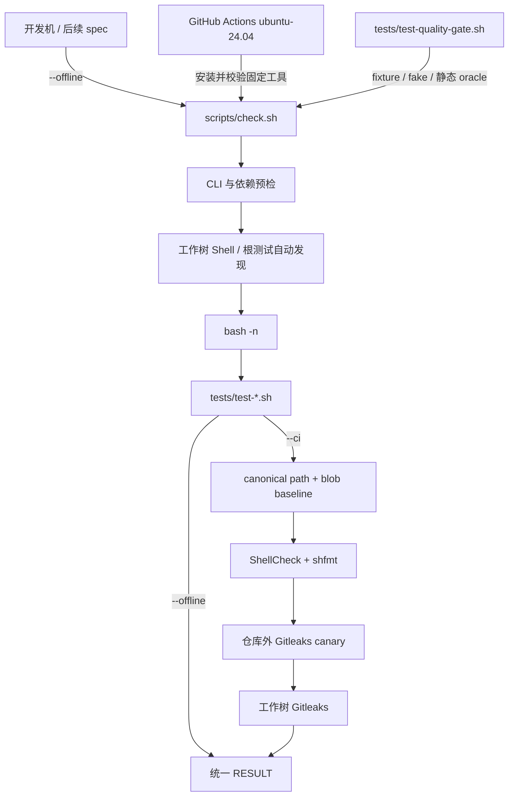
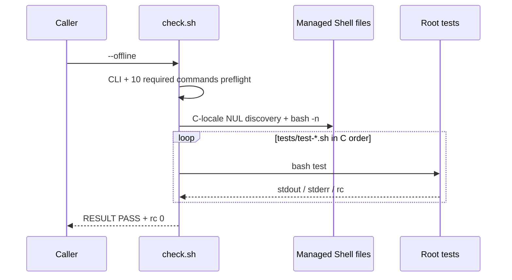
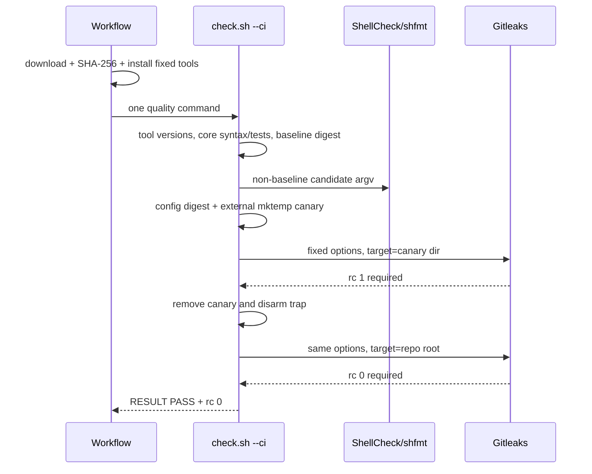

# 2026-09-01-02-offline-quality-gate 设计

## 概述

方案是在仓库根新增单一 Bash gate：`--offline` 只做依赖预检、全工作树 Shell 语法和根测试，`--ci` 在同一核心之后追加由 immutable blob baseline 约束的增量静态检查与真实 Gitleaks 扫描；GitHub Actions 只负责安装经摘要校验的固定工具并调用该 gate。

关键决策：

1. 选择“工作树自动发现 + C locale + fail-fast”，使后续规格新增根测试无需修改 gate；放弃硬编码测试清单，因为它会让 provider 回滚和新测试注册重新耦合到 02。
2. 选择锚点提交的 canonical 30 行 `path + blob` baseline，只豁免完全未变化的历史 Shell；放弃一次性格式化旧脚本，因为它会超过 400 行预算并越过后续 spec 的文件所有权，也放弃路径级豁免，因为同路径变化可绕过检查。
3. 选择固定两行 Gitleaks config、摘要校验和每次 CI 的仓库外真实 canary；放弃只用 fake 或任意仓库 config，因为空规则、环境覆盖和全局 allowlist 都能制造假绿。

## 需求映射

| 组件 | 实现的需求 |
|---|---|
| 根质量 gate `scripts/check.sh` | R1, R2, R3, R4, R5, R6 |
| canonical Shell baseline + Gitleaks config | R6 |
| GitHub Actions workflow | R7 |
| coverage 矩阵 | R8 |
| gate contract 回归 | R1, R2, R3, R4, R5, R6, R7, R8, R9 |

## 架构



Gate 是唯一行为入口；workflow 不复制检查逻辑。离线层只依赖 requirements 列出的基础命令，不查找三个可选工具。CI 层固定 ShellCheck 0.11.0、shfmt 3.14.0、Gitleaks 8.30.1。文件发现从仓库绝对根执行，排除 `.git/.spec`，只取普通文件，不跟随软链，所有列表用 NUL 分隔并以 `LC_ALL=C sort -z` 排序，避免空格或换行路径破坏边界。

## 组件与接口

### 根质量 gate

- 职责：解析唯一 mode，完成分层预检、发现、语法、根测试，以及 CI 增量静态/秘密检查；任何失败都禁止打印总成功行。
- 对外接口：scripts/check.sh --offline|--ci —— 成功时退出 0 且 stdout 末行为 RESULT PASS  aosp-harness offline quality gate；参数/依赖/工具预检错误返回 2，语法/测试/静态/秘密检查失败返回 1，失败时不得输出该成功末行
- 依赖：Bash、Git、Python 3、ripgrep、requirements 列出的基础命令；CI mode 再依赖三个精确版本工具、baseline 和 config。
- 内部边界：`quality_list_shell_files` 只向 stdout 写 NUL 分隔相对路径；`quality_run_core` 只做 syntax + root tests；`quality_run_ci` 只接收 core 成功后的文件集合，不复刻 core。

### 已消费的 device-safety 回归

- 职责：作为首个自动发现的 provider test，继续聚合三套 legacy 回归。
- 对外接口：tests/test-device-safety.sh —— 无参数；全部通过时退出 0 且 stdout 末行为 RESULT PASS  device safety，任一断言失败时退出非零
- 依赖：由根 gate 提供可诊断的基础依赖环境；其私有 fake ADB 隔离保持不变。

### canonical baseline 与 Gitleaks config

- 职责：baseline 仅记录锚点 30 个 Shell blob；config 仅继承 Gitleaks 8.30.1 默认规则。二者均由 gate 内置完整 SHA-256 验证。
- 对外接口：`scripts/shell-quality-baseline.tsv` 每行 `path<TAB>40-hex-git-blob`；`.gitleaks.toml` 字节精确为 `[extend]\nuseDefault = true\n`。
- 依赖：baseline 运行时不读取锚点对象；当前文件用 `git hash-object` 与固定 pair 比较。

### CI workflow

- 职责：在三个触发器上下载固定 x86_64/amd64 资产，逐个校验 SHA-256并安装为 `$RUNNER_TEMP/aosp-harness-quality/bin/{shellcheck,shfmt,gitleaks}`；安装 step 把该绝对目录追加到 `$GITHUB_PATH`，独立 quality step 因而能从 PATH 找到三者并唯一一次调用 gate 的 CI mode。
- 对外接口：`.github/workflows/quality.yml`，触发 `push|pull_request|workflow_dispatch`，runner `ubuntu-24.04`。
- 依赖：`actions/checkout`、curl/tar/install/sha256sum，以及以下唯一 artifact-to-executable 映射；检查行为仅来自 `scripts/check.sh --ci`。

| 下载资产 | SHA-256 | 安装来源 | 安装目标 |
|---|---|---|---|
| `shellcheck-v0.11.0.linux.x86_64.tar.xz` | `8c3be12b05d5c177a04c29e3c78ce89ac86f1595681cab149b65b97c4e227198` | 解包后的 `shellcheck-v0.11.0/shellcheck` | `bin/shellcheck` |
| `shfmt_v3.14.0_linux_amd64` | `fe42021c7272ef2d67ea36cbc3031683c625d0badec733ef3a57b567246a0b66` | 下载文件本身 | `bin/shfmt` |
| `gitleaks_8.30.1_linux_x64.tar.gz` | `551f6fc83ea457d62a0d98237cbad105af8d557003051f41f3e7ca7b3f2470eb` | 解包后的 `gitleaks` | `bin/gitleaks` |

三个目标统一由 `install -m 0755` 写入。安装 step 使用 shell `set -euo pipefail`，只有三份摘要、解包和安装全成功后才写 `$GITHUB_PATH`；任一步失败都不会进入 quality step。

### Coverage 矩阵

- 职责：把每个现存根测试一一映射到规格、保护行为、离线边界和 active 状态。
- 对外接口：`tests/COVERAGE.md` 的五列表格 `Test | Specs/requirements | Protected behavior | Offline boundary | Status`。
- 依赖：根测试文件集合；不存储数字覆盖率。

### Gate contract 回归

- 职责：用表驱动 fixture/fake 对 R1-R9 做可失败验证，并在被根 gate 嵌套执行时用 `QUALITY_GATE_NESTED=1` 只返回 child marker，避免自递归；外层测试仍完整执行。
- 对外接口：`tests/test-quality-gate.sh` 无参数；成功退出 `0` 且末行精确为 `RESULT PASS  offline quality gate contract`。
- 依赖：复制 gate/baseline/config 到 `mktemp` Git fixture；不联网、不调用真实三个 CI 工具。

## 数据模型

### Baseline TSV

```text
<repo-relative-path>\t<40-lowercase-hex-git-blob>\n
```

- 固定 30 行、C-locale 严格递增、路径和 blob 均唯一；整个文件摘要固定为 requirements 的 `62211b...a5f`。
- Gate 先验摘要；摘要不符直接返回 `2`。摘要通过后，当前文件只有 exact pair 命中才豁免，否则进入 ShellCheck/shfmt candidate 数组。
- 不提供“更新 baseline”命令；变更需新的 PLAN/DECISIONS 裁定，避免实现期自授权。

### Gitleaks config 与 canary

- Config 恰好两行 `[extend]` / `useDefault = true`，摘要固定为 requirements 的 `27630a...d76e`，不接受 repo/env 的第二配置来源。
- Canary 目录由 `mktemp -d` 创建在仓库外；`canary.txt` 的内容由片段 `AKIA` 与 `ABCDEFGHIJKLMNOP` 在运行时拼成 `aws_access_key_id = <两段连接值>`。该 20 字符值已用 Gitleaks 8.30.1 默认规则验证能产生精确退出码 `1`，完整值不在任一被跟踪单段中出现。
- 两次 Gitleaks 调用的固定 options/config 完全相同，唯一差异是最后 target：先 canary 目录，后仓库绝对根。

### Coverage Markdown

每个自动发现的根测试必须对应一行，五列非空，状态仅 `active`。Contract test 解析 Markdown 行，不把标题分隔行计为数据。

## 数据流

### Offline 主流程



任一 syntax/test 失败立即返回 `1`；测试的双流由子进程直接继承，gate 不捕获或改写。任何 preflight 失败发生在 discovery/syntax/test 之前并返回 `2`。

### CI 增量检查与秘密扫描



Canary 清理由 trap 保底，并在工作树扫描前显式完成；因此最终扫描不会包含 canary。canary 返回 `0` 或非 `1` 表示规则/config 自检无效，归类协议错误 `2`；工作树扫描非零归类检查失败 `1`。

## 错误处理

| 错误场景 | 恢复策略 | 校验位置 | 日志 | 用户可见 |
|---|---|---|---|---|
| 无/未知/额外参数 | 不执行任何检查 | CLI parser | stderr usage | rc `2`，无总 PASS |
| Offline 必需命令缺失 | fail-fast | core preflight | stderr 含命令名 | rc `2` |
| CI 工具缺失/版本错 | fail-fast，syntax/test 为零调用 | CI preflight | stderr 含实际/期望版本 | rc `2` |
| Shell 语法错误 | 首错即停 | `bash -n` 循环 | `bash -n` 原始 stderr | rc `1` |
| 根测试失败 | 原样双流，停止后续测试 | test loop | 测试原始 stdout/stderr | rc `1` |
| Baseline 摘要或格式错 | 不运行静态或秘密扫描 | static phase 前的 baseline validation | stderr 指明 baseline | rc `2` |
| ShellCheck/shfmt finding | 不继续秘密扫描 | CI static phase | 工具原始输出 | rc `1` |
| Gitleaks config 摘要或格式错 | core/static 已完成且不回滚；不运行 canary 或工作树 Gitleaks | static phase 后的 config validation | stderr 指明 config | rc `2` |
| Canary 未精确返回 `1` | trap 清理 canary，不扫工作树 | Gitleaks self-test | stderr 指明 canary contract | rc `2` |
| 工作树 Gitleaks 非零 | 已清理 canary，直接失败 | final secret phase | redacted 工具输出 | rc `1` |
| Workflow 下载/摘要/安装失败 | shell `set -e` 停止，不调用 gate | CI install step | Actions step log | workflow failure |

## 测试策略

| 层 | 测什么 | 用什么工具 |
|---|---|---|
| 单元/contract | CLI 三错误、10 个依赖、6 个工具预检、managed discovery/syntax、排序/双流/短路、baseline/config mutations、静态 argv、两次 Gitleaks 调用 | `tests/test-quality-gate.sh` 的 `mktemp` Git fixture、表驱动 fake/poison；发现 fixture 必含空格路径、实际 LF 路径、指向仓库外非法脚本的 symlink，并由 fake-sort 证明宿主 locale 被覆盖为 `LC_ALL=C`；≤200 行 |
| 集成 | 真正根 gate 自动运行 device-safety 与 gate contract；CURRENT_FEATURE 前后 hash 不变 | `QUALITY_GATE_NESTED=1 bash ./scripts/check.sh --offline`，外层 contract 检查 child marker 与 poison 日志 |
| CI 静态 | 固定版本真实 ShellCheck/shfmt；真实 Gitleaks canary 与工作树扫描；workflow contract | `./scripts/check.sh --ci`，workflow/COVERAGE 静态 oracle |
| 端到端 | 默认离线质量入口的精确末行、退出码、无真实外部调用 | `bash ./scripts/check.sh --offline` + poison PATH + `GIT_ALLOW_PROTOCOL=file` |
| 性能 | 不适用：PLAN 未设性能指标；只要求有限的本地离线门禁，不把墙钟时间写成硬阈值。 | 不适用 |

测试脚本按 fixture/helper、表驱动 case 数据、少量复合断言三层组织；不得把多个独立判据压成不可定位的一行。若实现报告的六文件总 diff 超过 400 行，必须回 PLAN 拆片，不以压缩可读性换预算。

## 文件清单

| 文件 | 创建/修改 | 职责（一句话） | 行预算 |
|---|---|---|---:|
| `scripts/check.sh` | 创建 | 根级 offline/CI gate 与唯一结果协议 | 105 |
| `scripts/shell-quality-baseline.tsv` | 创建 | 锚点提交的 canonical 30 个历史 Shell blob | 30 |
| `.gitleaks.toml` | 创建 | 固定继承 Gitleaks 默认规则 | 2 |
| `.github/workflows/quality.yml` | 创建 | 固定工具安装、摘要校验和单次 CI gate | 42 |
| `tests/COVERAGE.md` | 创建 | 根测试需求映射与离线边界矩阵 | 8 |
| `tests/test-quality-gate.sh` | 创建 | R1-R9 离线 contract 与 workflow/doc oracle | 200 |

总计 6 个非生成文件、最多 387 行，给 PLAN 的 400 行硬门保留 13 行余量；文件职责和预算在 tasks 中不得扩大。
