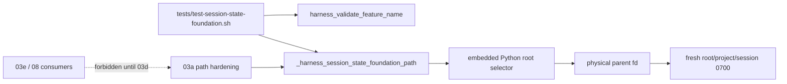
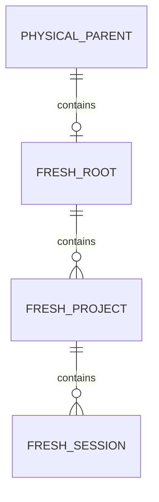
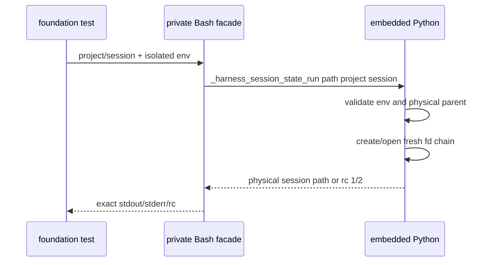

# 03-session-state-safety foundation 设计

## 1. 概述

本片只发布已完整闭合的`harness_validate_feature_name`；四级根选择和fresh fd链保留为`_harness_session_state_foundation_path`与`_harness_session_state_run path`，供紧随其后的03a实现/测试扩展。当前实现task 1.1/1.2已有独立diff review；task 1.3只负责移除半安全public facade、封闭两个private签名和测试，review PASS后由controller生成manifest。

- 选择：只公开已完整验证的validate；原因是existing-object hardening尚未完成；放弃现在公开path，避免consumer误用半安全能力。
- 选择：保留两个下划线private export给03a；原因是复用已审root/fd foundation且可独立验收；放弃提前设置marker或把private函数描述成稳定public API。
- 选择：03–03d各自独占模块，03d才聚合发布capability；原因是满足400行/P5和独立回滚；放弃继续叠改单一provider/test或用1400行例外。

## 2. 需求映射

| 组件 | 需求 |
|---|---|
| Bash C-locale predicate/public validate | R1, R3 |
| 私有 Bash facade + embedded Python root/fd foundation | R2, R3 |
| root foundation test 与 review manifest | R4, R5, R6 |

## 3. 架构

`session-state-foundation.sh` source 时只定义 Bash 函数。public surface 只有 validate；private foundation 可在测试中创建 fresh 目录，但没有 capability marker、coverage active 行或 public path 名，因此 consumer 不得探测/调用它。03a–03d 必须写入各自独立模块；最终 `session-state.sh` aggregator 只有在全部模块及预期私有函数存在后才可发布 marker 与五API。

## 4. 组件与接口

### Public validate

- 接口：`harness_validate_feature_name <name> —— 合法返回0且双流空；arity/非法名称返回2，stderr为 error: invalid feature name 加LF`
- 实现：`_harness_component_is_safe` 在 `LC_ALL=C` 下判 1..128 字节与完整 ASCII regex。

### Private root foundation

- 接口：`_harness_session_state_foundation_path <project-id> <session-id> —— 仅03a实现/测试可调用；Bash facade自身在分派前做exact arity与C-locale两个ID校验；fresh fixture成功输出physical absolute path，unsafe 2，operation 1`
- dispatcher：`_harness_session_state_run path <project-id> <session-id>`同样是03a可见的私有export；Bash入口在启动Python前只允许exact `path`、exact arity并独立复用C-locale predicate校验两个ID，arity/op/ID/安全错2，OS错1，成功path+LF/0，所有错误stdout空且stderr按requirements固定映射。
- 选择：所有nonempty候选先拒绝相对路径、ASCII control和完整`.`/`..`组件；`HARNESS_STATE_ROOT` set时取exact且额外拒绝`/`，empty fail closed；否则`XDG_RUNTIME_DIR` set后拼固定leaf，empty fail closed；否则非空`TMPDIR`拼leaf，empty/unset回退`/tmp`。HARNESS的existing parent、XDG/TMP/default的existing base必须strict physicalize，缺失按unsafe映射。
- 路径：从strict physical existing parent fd开始，对root leaf/project/session逐层执行fd-relative `mkdirat`（Python `os.mkdir(..., dir_fd=...)`，只在缺失时）、`openat(O_RDONLY|O_DIRECTORY|O_NOFOLLOW|O_CLOEXEC)`；本调用新建的inode在open后`fchmod(0700)`，既有inode不chmod，并始终从刚持有的child fd继续下一层。成功path由physical parent与三个安全组件拼成。
- 明确缺口：既有受管对象的 type/EUID/mode/name-fd identity 不在本片保证内，所以函数必须保持下划线私有名。

### Review manifest

- owner：controller。
- 路径：review-package 外 `work/2026-09-01-03-session-state-safety/review-manifest.tsv`。
- schema：`seq<TAB>task<TAB>base<TAB>head<TAB>reviewer<TAB>final-status`，任务1.1–1.3各一行；seq等于物理行号，task依次为1.1–1.3，SHA为40hex，首base/末head绑定review package，status只允许PASS且相邻提交连续。

## 5. 数据模型

这些目录在本片只是 03a 的构建基础，不代表 public session-state capability。测试使用唯一 project/session，默认 `/tmp` 根调用前若存在则只清本次条目，绝不删除预存 root。

## 6. 数据流

## 7. 错误处理

| 场景 | rc | stderr | 副作用 |
|---|---:|---|---|
| validate arity/name非法 | 2 | `error: invalid feature name` | 零 |
| 两private export arity/ID、dispatcher op、env危险 | 2 | `error: unsafe session state\n` | 零 |
| override parent/base缺失 | 2 | `error: unsafe session state\n` | 不创建缺失parent/base |
| 其他普通OS错误 | 1 | `error: session state operation failed\n` | 不触碰调用前对象 |
| fresh mkdir/open/fchmod失败 | 1 | `error: session state operation failed\n` | 只允许本调用已创建的空条目由测试清理 |

低层 Python 不打印；dispatcher 唯一映射双流。source 期间不启动 Python。

## 8. 测试策略

- 名称：文件级 `cmp` 比较双流 bytes，覆盖完整合法/非法表和 C locale。
- source：marker初始unset；在绑定cwd/目标的fixture对目录清单、inode、size、sentinel文件内容和目标不存在做前后比较，并对预置export sentinel变量的`declare -p`做逐字比较；source rc0/双流空且provider-copy mutation必须被抓住。
- roots：HARNESS/XDG/TMP/default 成功/危险矩阵；inventory 证明零创建和低优先级 untouched。
- private exports：同一表驱动分别调用facade与dispatcher，覆盖合法path+LF/0、provider-copy注入EIO的固定operation/1、arity/两个ID/dispatcher op的固定unsafe/2，所有case文件级比较双流。
- isolation：fresh root/project/session 逐层验证 `! -L`、目录类型、EUID、0700；两项目×两会话唯一。
- default root：调用前记录存在性/inode，只清本次唯一 project/session；预存 root 始终保留。
- surface：validate与两个private exports逐个存在；循环逐名证明四个未完成public API不存在，并证明`HARNESS_SESSION_STATE_PROVIDER_VERSION`未设置；成功末行改为foundation专属摘要。
- review：task1.3进入实现前按当前373行预留27行，若完整oracle预计或实际超出立即回PLAN而不压缩语义；manifest机械校验三任务链，最终exact 2 files/400 lines与clean worktree。

## 文件清单

| 文件 | 创建/修改 | 职责 | 硬门目标 |
|---|---|---|---:|
| `common/.harness/lib/session-state-foundation.sh` | 创建 | public validate + private root/fd foundation | 在总量内调剂 |
| `tests/test-session-state-foundation.sh` | 创建 | foundation API/环境/副作用回归 | 在总量内调剂 |

合计：2 个非生成文件，BASE..HEAD exact package ≤400 行。

`review-manifest.tsv`位于`.spec/work`证据目录，不进入实现review package；03a从最终private signature继续且仍不发布public path，只有03d aggregator确认全部模块完整后才定义状态public API与capability marker。
