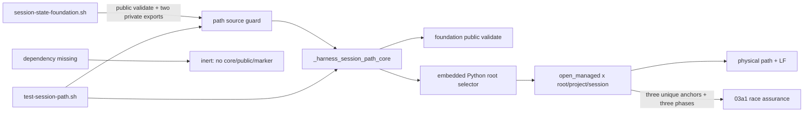
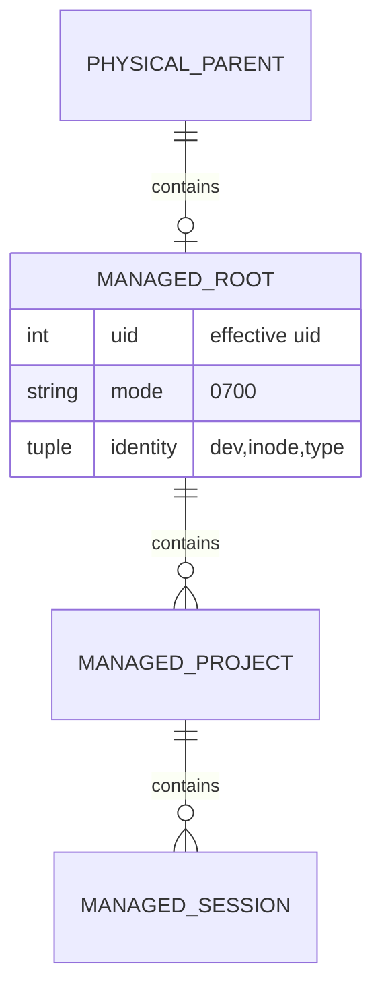
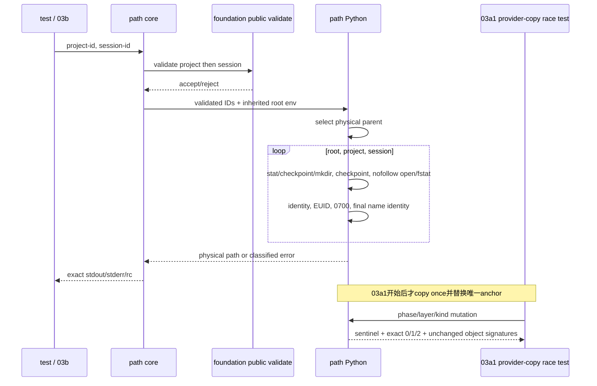

# 03a-session-path-safety 设计

## 1. 概述

本片新增独占 `session-state-path.sh` 和 `test-session-path.sh`，不修改已验收 foundation。path module 在 source 时只检查 foundation 的一个 public validate 与两个 private path export；齐全时定义 `_harness_session_path_core`，任一缺席时静默 inert。core 先实际调用 public validate 校验两个 ID，再运行 embedded Python，在单次 fd 链内完成根选择、创建、existing-object 校验和 physical path 输出。

支持边界固定为 Linux kernel >=3.15、glibc >=2.28、Bash >=5.0、Python >=3.8；其他平台不在本片声称范围内。

- 生产 core 复用 foundation public `harness_validate_feature_name` 和结果协议，但不调用只返回字符串的 foundation path facade。facade 返回时 fd 已关闭，事后 harden 无法保护后续副作用。
- path module 内重建与 foundation 行为等价的根选择，一次持有 parent/root/project/session fd 直到结果确定。03a 文件 owner 禁止修改 foundation，现有跨模块签名也不能传递 fd。
- 单一 managed helper 统一 fresh、EEXIST winner 和 existing 对象。创建权限只依赖 `umask 077` 与 `mkdir(0700)`，此后只验证而不 chmod；mkdir 返回后 name 可能已指向替换 inode，任何事后 chmod 都可能修改竞争者对象。

## 2. 需求映射

| 组件 | 需求 |
|---|---|
| source capability guard / inert branch | R1, R2 |
| Bash core + foundation public validate | R1, R3 |
| Python root selector / managed fd chain | R3, R4 |
| multi-phase checkpoint、identity、owner、EIO markers | R4, R5 |
| present/inert/static/anchor test + format/manifest gate | R6, R7 |

## 3. 架构

消费的三个签名严格是：

- `harness_validate_feature_name <name>`
- `_harness_session_state_foundation_path <project-id> <session-id>`
- `_harness_session_state_run path <project-id> <session-id>`

foundation facade 与 run export 是 source compatibility guard，但 core 不调用它们。测试证明三个依赖任一缺席时 inert，全部存在时 core 真正调用 public validate。

03a1直接消费 `_harness_session_path_core <project-id> <session-id>` 与三个生产文本唯一的anchor：`HARNESS_TEST_MARKER_MANAGED_BEFORE_OPEN` checkpoint必须实际以`before_mkdir`、`after_eexist`、`before_open`调用，另两个是`HARNESS_TEST_MARKER_EXPECTED_EUID`和`HARNESS_TEST_MARKER_OS_ERROR`。03a1只复制provider测试，不修改或source时消费anchor。

## 4. 组件与接口

### Source guard

- 前置：`declare -F` 同时命中 `harness_validate_feature_name`、`_harness_session_state_foundation_path`、`_harness_session_state_run`。
- present：只定义 `_harness_session_path_core`，source rc `0`、双流空。
- absent/partial：source rc `0`、双流空，不定义 core/public/marker。
- 两分支都不执行 Python，不展开 HARNESS/XDG/TMP 值，不改写 foundation 函数或 caller 变量。

### Private path core

`_harness_session_path_core <project-id> <session-id>`

1. exact arity 不是 `2` 时直接 unsafe/`2`，不读未定义位置参数。
2. 顺序调用 `harness_validate_feature_name "$1" >/dev/null 2>&1` 与 `harness_validate_feature_name "$2" >/dev/null 2>&1`；任一拒绝时在 Python 前返回 core 自身的 unsafe/`2`。
3. 在 subshell设 `umask 077` 并调用 embedded Python。成功唯一 stdout 为 physical absolute session path+LF、stderr 空、rc `0`。
4. `UnsafeState` 唯一映射空 stdout/`error: unsafe session state\n`/`2`；`OperationFailure` 与普通 `OSError` 唯一映射空 stdout/`error: session state operation failed\n`/`1`。

### Root selector

- HARNESS set：精确路径；empty、relative、control、dot-component、`/`拒绝；strict resolve existing parent，leaf 作受管 root。
- HARNESS unset 且 XDG set：empty/危险拒绝；strict resolve base，root leaf=`aosp-harness-$EUID`。
- 两者 unset：TMP nonempty 时 strict resolve 它，TMP empty/unset 使用 `/tmp`，root leaf同上。
- 候选一旦选中不读低优先级路径；输出使用 resolved physical parent/base。

### Managed directory helper

`open_managed(parent_fd, name) -> child_fd`

1. 定义生产 no-op `_managed_checkpoint(phase, parent_fd, name, made)`；函数体内唯一出现 `HARNESS_TEST_MARKER_MANAGED_BEFORE_OPEN`。正常逻辑在 `before_mkdir`、`after_eexist`、`before_open` 三个 phase 调用它。
2. 先 `stat(name, follow_symlinks=False)`。missing 时 checkpoint(`before_mkdir`, made=False)，再尝试 `mkdir(0700, dir_fd=parent_fd)`；成功后立即 name stat并记 `made=True`。
3. `FileExistsError` catch 先执行可观测 catch sentinel，再 checkpoint(`after_eexist`, made=False)并重取 name stat；winner 消失映射 operation/`1`，不重试创建。
4. name stat 已取得后 checkpoint(`before_open`, 当前 made)，再拒绝链接/非目录；随后 `openat(O_RDONLY|O_DIRECTORY|O_NOFOLLOW|O_CLOEXEC)` 与 `fstat`，比较 before↔fd dev/inode/type。open 的 `ELOOP|ENOTDIR`（含 stat→open 换入链接/非目录）映射 unsafe/`2`，`ENOENT` 等消失竞争映射 operation/`1`。
5. 在 helper 内唯一 `HARNESS_TEST_MARKER_EXPECTED_EUID` 后得到 expected EUID；fresh、EEXIST winner、existing 一律只校验 fd owner 与精确 `0700`，绝不 chmod。
6. 再取 after name stat，比较 after↔fd dev/inode/type。任一 identity/type/owner/mode 不符映射 unsafe/`2`。
7. 从 physical parent fd 开始，对 root leaf、project、session 三次调用，只从刚持有的 child fd 继续；`finally` 逆序关闭全部 fd。

### Error与03a1测试锚点

- `HARNESS_TEST_MARKER_MANAGED_BEFORE_OPEN`：只位于 no-op checkpoint 函数体且生产文本精确一次；copy replacement 按 `phase`/`name`/`made` 命中目标层，可真实介入 mkdir 前、EEXIST catch 后与 open 前。
- `HARNESS_TEST_MARKER_EXPECTED_EUID`：生产文本精确一次；copy replacement 依 `name` 只改目标层 expected EUID。
- `HARNESS_TEST_MARKER_OS_ERROR`：生产文本精确一次，位于首个 Python fd 操作前；copy 抛真实 `OSError(errno.EIO)`。
- marker 都是供03a1复制生产文本后替换的测试锚点；生产逻辑不读取 test-only env。03a只检查anchor/phase的唯一性与位置结构，不执行任何anchor-driven provider-copy动态注入；roots-static可保留不替换这三个anchor的确定性post-mkdir disappearance错误分类probe。

## 5. 数据模型

三层使用同一不变量：安全单组件 name、nofollow directory fd、EUID owner、精确 `0700`、name stat 与 fd 的 dev/inode/type一致。path module 不创建 feature snapshot，不定义 public capability。

## 6. 数据流

## 7. 错误处理

| 阶段/错误 | 分类 | rc | 副作用 |
|---|---|---:|---|
| Bash arity/public validate reject | unsafe | 2 | Python 未启动，inventory 不变 |
| 危险根、parent/base 缺席 | unsafe | 2 | 不创建 parent/base |
| existing/EEXIST winner link、non-dir、wrong owner/mode | unsafe | 2 | 不 chmod，不创建后层 |
| before/after name stat 与 fd identity 不一致 | unsafe | 2 | 不跟随 victim |
| EEXIST winner 重取时消失 | operation | 1 | 不重试或创建新 winner |
| mkdir/open/fstat/final-stat 普通 OS 错 | operation | 1 | 关闭本调用 fd，不回滚他人 winner |
| success | success | 0 | 仅安全三层存在 |

Python 不输出中间诊断；顶层 catch 只输出 requirements 的两个固定 stderr。刚创建的本调用空目录在后续 operation 失败时不 prune；remove/prune 属于 03d，验收只要求 victim 与不安全层零变化。

## 8. 测试策略

- source：present 与三个 missing-dependency fixture 都比较 rc/双流、HARNESS/XDG/TMP `declare -p`、仍存在的 foundation 函数、core/public/marker 和 inventory；`--dependency-absent` 专门跑 inert fixture。
- validate：包装 public validate，log project/session 两参数并拒绝合法 session；PATH 内 fake `python3` 调用数必须为零，断言 unsafe/`2` 与 inventory 不变。
- roots：HARNESS/XDG/TMP/default 四成功输出，HARNESS 成功时低优先级 untouched，symlink parent 输出 physical path；危险/缺席表逐字节 unsafe/`2`。
- managed：同根两 project×两 session和全部 type/EUID/0700/nonlink；root/project/session 各自软链接、文件、wrong-mode 静态表。
- structure：用`grep -Fo | wc -l`证明三个anchor各精确一次；从embedded Python文本中按函数边界提取`open_managed`函数体，并证明`before_mkdir`/`after_eexist`/`before_open`在全文件及该函数体内各精确一次，防止调用被移入dead/unrelated代码；provider不含`fchmod`。本片不接受`--case mutations`，不执行anchor-driven provider-copy。
- dynamic boundary：root/project/session全部anchor-driven existing swap、wrong EUID、EEXIST safe/unsafe/disappearing、mkdir-success replacement、checkpoint-driven mkdir/post-mkdir/open/final-stat消失、真实EIO，以及sentinel/catch/made/victim完整签名，统一由03a1的单一data-driven driver验收；03a1通过前没有consumer。03a保留的非anchor post-mkdir probe只证明普通OS错分类，不替代03a1 race oracle。
- surface/regression：四 public state API 与 marker absent；foundation files BASE..HEAD 不变；path 摘要唯一，foundation test和offline gate通过。
- dispatcher：真实foundation缺席时default与`--dependency-absent`都进入all-missing inert；foundation存在时default只按顺序执行source-validate、roots-static。每个子进程stdout用含单一摘要和末尾LF的期望文件`cmp`，stderr为空且rc为0，避免command substitution吞掉末尾LF。
- size/review：执行HEAD `fad7bf384d9d8807f1f268649bc8ed19e10cf4b0` 的只读round2 prototype已包含managed函数体位置self-disproof、真实foundation文件缺席default/flag与可运行03a1三层共享driver。03a实测provider114+test278=`392/400`；03a1 prototype `269/400`实跑19个case，完整37-case只需增加18个data rows/calls。权威证据是`work/2026-09-01-03a-session-path-safety/v5.5-round2-sizing-report.md`。controller维护六列连续manifest，并先断言shfmt `v3.14.0`、ShellCheck `0.11.0`版本，再对exact两文件运行固定argv。

## 9. 文件清单

| 文件 | 创建/修改 | 职责 | 目标 |
|---|---|---|---:|
| `common/.harness/lib/session-state-path.sh` | 创建 | source guard、private core、root/managed fd hardening | 114行当前实测 |
| `tests/test-session-path.sh` | 创建 | present/inert、root/static/anchor/dispatcher 回归 | 278行round2实测 |

BASE..HEAD硬门不超过400；最终必须同时通过pinned shfmt 3.14.0无diff与ShellCheck 0.11.0 warning门。`.spec`下prototype、sizing、brief、report、review package和manifest不进入实现diff。
