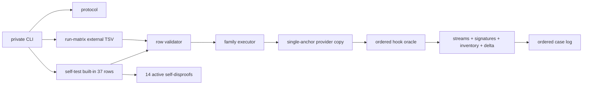
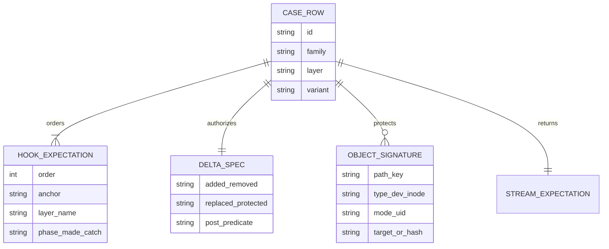
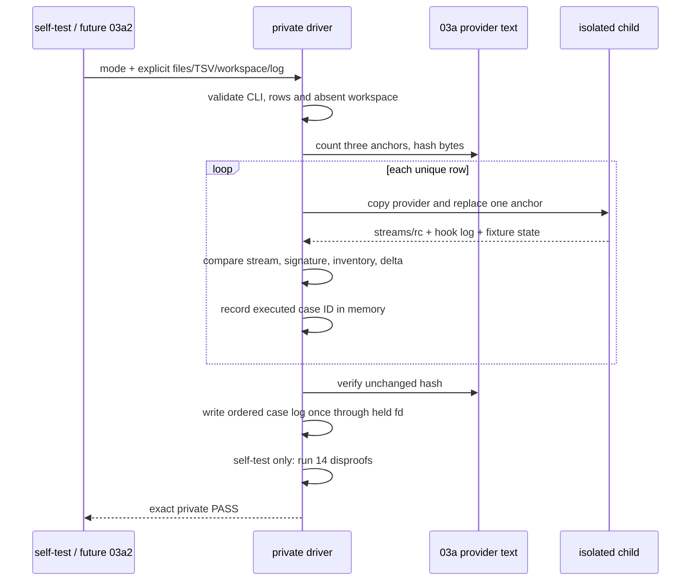

# 03a1-session-path-race-assurance 设计（PLAN v5.6 private driver）

## 1. 概述

本片只交付`tests/lib/session-path-race-driver.py`。它是测试专用private CLI，不在`scripts/check.sh` 的root `tests/test-*.sh`发现集内，不发布Python/shell runtime API、环境marker或session-state capability。

设计将原411行单shell边界切为两片：03a1拥有复杂但共享的race executor/oracle/self-test，未来03a2只拥有默认shell入口、37-row外部生成和inert dispatcher。Round7完整可执行原型补齐workspace/log物理隔离后为400/400，`protocol`、self-test 37/37、14项active self-disproof、外TSV合法子集/完整matrix与full/depth-1均PASS。

支持边界沿用03a：Linux kernel >=3.15、glibc >=2.28、Bash >=5.0、Python >=3.8；只用Python标准库。

## 2. 需求映射

| 组件 | 实现的需求 |
|---|---|
| CLI dispatcher + exact streams | R1, R2 |
| TSV/workspace/case-log validator | R2, R3 |
| internal/external 37-row matrix | R3, R4 |
| provider single-anchor copier + hook oracle | R1, R4, R5 |
| object signature/inventory/delta oracle | R4, R6 |
| 14-item active self-disproof | R7 |
| full/depth-1/size/review/order gates | R8, R9 |

## 3. 架构

03a1消费的确切上游是：

`session-path-delivery-v1 —— common/.harness/lib/session-state-path.sh中的_harness_session_path_core <project-id> <session-id>与三个生产文本唯一anchor；core成功path+LF/0、OS错1、安全/协议错2`

本片产出逐字为：

`session-path-race-driver-v1 —— tests/lib/session-path-race-driver.py提供protocol、self-test与run-matrix私有CLI，self-test固定输出RESULT PASS  session path race driver；无运行时API`

03a1不读取未来03a2文件。03a2只通过CLI subprocess消费driver，不import其内部实现；因此没有反向边或循环依赖。

## 4. 组件与接口

### CLI dispatcher

| 命令 | 成功stdout | stderr | 成功rc |
|---|---|---|---:|
| `protocol` | `session-path-race-driver-v1\n` | 空 | 0 |
| `self-test FOUNDATION PROVIDER` | `RESULT PASS  session path race driver\n` | 空 | 0 |
| `run-matrix FOUNDATION PROVIDER ABSENT_WORKSPACE CASE_TSV CASE_LOG` | `RESULT PASS  session path race driver\n` | 空 | 0 |

`protocol`在arity校验后立即返回，不stat/read foundation、provider、entrypoint或matrix。unknown mode/arity/extra返2。row、fixture、oracle或subprocess失败返1。失败诊断只写stderr，不打印private PASS。

### Row validator与case log

`run-matrix`按行解析至少一行的四列`id<TAB>family<TAB>layer<TAB>variant`，拒绝NUL、空/多列、重复ID、未知token和非法family/layer/variant组合，不将任何列解释为代码或表达式。合法组合固定为：`swap`×三layer×`safe-dir|link|file`；`eexist`×三layer×`safe|unsafe|disappear`；`wrong-euid|mkdir-replace|mkdir-failure|post-mkdir-disappear|open-disappear|final-stat-disappear`各×三layer×`N/A`；`real-eio`只允许`N/A/N/A`。canonical ID对`real-eio`为同token，variant为`N/A`时为`<family>-<layer>`，其余为`<family>-<layer>-<variant>`；driver机械推导并逐字比较，不接受任意label。`run-matrix`接受任意合法唯一非空子集，只执行输入rows；完整37-row外部集合由未来03a2拥有。

path preflight在任何mkdir、log写或child前完成：workspace与log经Python `Path`词法解析后必须是absolute path；raw `.`别名由`Path`折叠为等价路径，但仍保留`..`的路径与relative path拒绝。从filesystem root到`ABSENT_WORKSPACE.parent`的每层都已是物理存在的非symlink directory，workspace leaf必须不存在，driver只用`parents=False`以0700创建该leaf。`CASE_LOG`必须是workspace的直接子项且不存在；driver以`O_CREAT|O_EXCL|O_NOFOLLOW`、0600创建并在全过程只通过持有fd写入。这使provider/foundation/TSV直连或symlink/hardlink、既有log和缺失parent都在0 case前失败，不能“先改坏provider再因hash失败”。workspace只保存provider copy、capture、sentinel和对象fixture。

driver先在内存中记录实际通过全部stream/hook/object oracle的case ID，核对与输入集合精确相等后，再按TSV输入顺序以持有fd一次写入`CASE_LOG`；任何重复、缺失或多余都在log内容写入前失败。

### Provider copy与hook协议

每个child先使用matrix开始前读取的provider bytes，并计数三个marker-bearing line，各必须精确一次；再只对row选中的line做一次replacement，并逐字证明copy等于`source.replace(line, replacement, 1)`。不替换普通生产needle。全部case/oracle后、写入CASE_LOG或打印PASS前，driver重读生产provider并要求SHA-256与matrix开始前相同。

| Anchor | 精确字段 | 适用family |
|---|---|---|
| MANAGED | `layer/name/phase/made/catch` | swap、EEXIST、mkdir replacement/failure、三类disappearance |
| EXPECTED_EUID | `layer/name/N/A/made/0` | 三层wrong EUID |
| OS_ERROR | `N/A/N/A/N/A/N/A/N/A` | layer-independent EIO |

EEXIST有两个严格有序expectation：`before_mkdir/made=false/catch=0`制造winner，生产mkdir真实进入`FileExistsError`后命中`after_eexist/made=false/catch=1`。mkdir failure在`before_mkdir`安装一次性真实`os.mkdir` failure；final-stat disappearance在`before_open`安装一次性`os.stat` wrapper，只在open/fstat后的name stat删除并抛ENOENT。

### Family executor与stream oracle

`self-test`按固定顺序内建37 rows：swap9、wrong-EUID3、EEXIST9、mkdir-replacement3、mkdir-failure3、post-mkdir3、open-disappear3、final-stat3、EIO1。`run-matrix`使用同一validator/executor，不有第二份case body。

subprocess的stdout/stderr/rc相互独立地capture并逐字比较，不规定capture媒介：

- success：physical session path+LF / stderr空 / 0；
- unsafe：stdout空 / `error: unsafe session state\n` / 2；
- operation：stdout空 / `error: session state operation failed\n` / 1。

### Signature、inventory与delta

`signature(path)`包含path key、lstat type/dev/inode/mode/uid；symlink追加readlink target，regular file追加内容SHA-256。inventory只遍历case scoped root，对relative-path的filesystem bytes做canonical排序，等价于C locale；walk的目录运行时枚举顺序不能传播到结果。每个row只提供`added/removed/replaced/protected/post_predicate`，executor从before inventory机械推导唯一expected after，再与actual逐字比较。用逆序创建的非字典序名称fixture反证canonical结果与创建/walk顺序无关。

| family | 允许delta | 必须保持/后置断言 |
|---|---|---|
| existing swap | 移除`target/**`旧key，新增`target.old/**`重键key，只替换`target` | subtree按相对suffix签名不变；replacement inode不同，link指向`.old`，无后续层 |
| wrong EUID | 无 | before完整不变，无后续层 |
| EEXIST safe | 新增target至session缺失suffix | 新目录均EUID/0700/nonlink，原parent不变 |
| EEXIST unsafe | 只新增target | target保持注入的不安全签名，无后续层 |
| EEXIST disappearing | 无 | before inventory/signature完整不变 |
| mkdir replacement | 新增`target.old`并只替换`target` | rename前runtime original完整签名与`.old`逐字相同，replacement不chmod/跟随 |
| mkdir failure / post-mkdir disappearance | 无 | before inventory/signature完整不变 |
| open / final-stat disappearance | 只移除`target` | parent及目标外对象不变，无后续层 |
| EIO | 无 | before inventory/signature完整不变 |

### Active self-disproof

`self-test`在打印摘要前依次主动破坏protected signature、unexpected inventory、allowed changed paths、readlink target、file hash、mode、inode、EEXIST second hook、marker count、sentinel、phase、made、catch、case invocation。每项必须捕获预期`AssertionError`并记录精确名称；最后逐字比较14项有序列表。未失败、异常类型/顺序不符或少任一项均不打印PASS。

## 5. 数据模型

无持久化数据；唯一运行期状态是row、hook expectation、delta和fixture对象签名。

## 6. 数据流

`self-test`的rows在driver内部构造；`run-matrix`的rows来自显式TSV。两者从validator开始使用同一数据流、executor和oracle。fixture由临时workspace生命周期管理，不写production provider。

## 7. 错误处理

| 场景 | 处理 | 可观察结果 |
|---|---|---|
| unknown mode / arity / extra args | CLI misuse | rc2，无PASS |
| foundation/provider缺席或不可读 | execution failure | rc1，无PASS |
| workspace已存在/创建失败 | fixture failure | rc1，无PASS |
| TSV列、token、ID或组合非法 | row failure | rc1，无case或无总PASS |
| anchor缺席/重复或copy字节不符 | fail fast | rc1，当前case不运行 |
| stream/hook/signature/inventory/delta不符 | case failure | rc1，诊断指向case/oracle |
| self-disproof未真实失败 | self-test failure | rc1，无private PASS |
| size/depth-1/manifest/03a zero-diff失败 | controller拒绝验收 | 不启动03a2 |

driver不实现inert PASS：它不在默认发现内，只在03a依赖齐全的accepted HEAD上验收。provider/driver/foundation/core缺席时默认root test的inert语义由未来03a2独占。

## 8. 测试策略

| 层 | 测什么 | 命令/证据 |
|---|---|---|
| protocol | 精确token、不读依赖、misuse rc2 | `python3 ... protocol`与空/多参数 |
| self-test | 37/37、九类、hook/stream/object oracle、14项自反证 | requirements主验证命令 |
| external matrix | four-column TSV、合法组合、case-log顺序、非法row/workspace/log | `run-matrix` fixture |
| syntax | Python源码可compile，无仓库污染 | 内存compile或临时pycache |
| regression | foundation/path tests与provider hash | 03/03a既有命令 |
| checkout | accepted HEAD full与true file-URL depth-1的protocol/self-test | 两个新checkout，不查固定SHA |
| discovery | private driver不被root gate自动调用 | `bash ./scripts/check.sh --offline` |
| review | exact1/400、03/03a zero-diff、manifest连续、clean | Git + spec scripts |

Round7 final已支付上述承重路径：driver 400/400，self-test、非37子集与完整run-matrix全PASS，7类workspace/log alias在0 case前拒绝且provider hash不变，full 99 commits/depth-1 1 commit均有独立protocol/self-test证据。实现不得通过删减delta、14 self-disproof或放松精确stream换取行数。

## 9. 文件清单

| 文件 | 创建/修改 | 职责（一句话） | 目标 |
|---|---|---|---:|
| `tests/lib/session-path-race-driver.py` | 创建 | private CLI、37-case共享executor/oracle/self-test | round7 400，硬门400 |

`.spec`下requirements/design/tasks、prototype、report、review与manifest不进入实现diff。03/foundation、03a provider/core test、03a2 entrypoint及后序任何文件都不属于本片。
