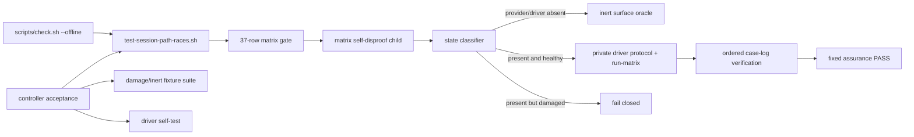
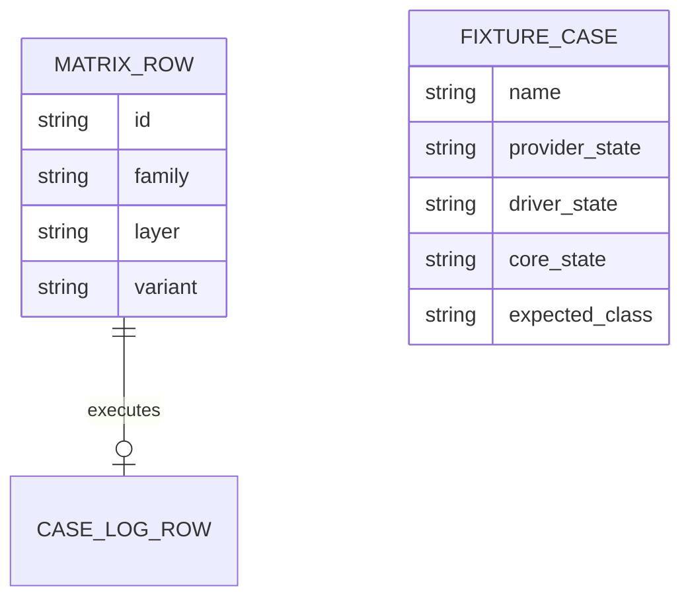
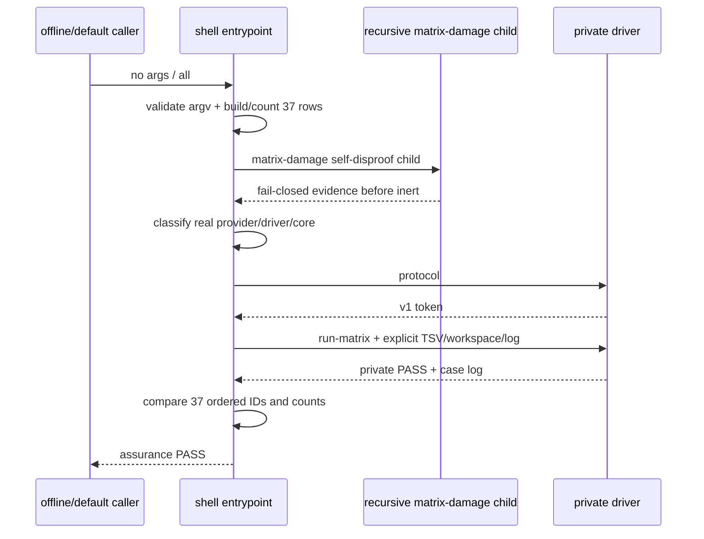

# 03a2-session-path-race-matrix 设计

## 1. 概述

本片只创建`tests/test-session-path-races.sh`。它是root offline gate默认发现的Bash测试入口，拥有37-row四列matrix、依赖状态优先级和driver调用/复核；复杂race executor、对象oracle与14项自反证继续由已验收`tests/lib/session-path-race-driver.py`独占。

关键决定：入口只对driver调用一次`protocol`和一次`run-matrix`，绝不调用`self-test`；controller在入口之外独立验收self-test，避免默认/offline重复执行74 case。入口先验证参数和自身matrix，再按provider anchors、driver type/protocol、foundation/core的固定顺序区分fail-closed与inert。生产入口只为matrix duplicate内建一个provider缺席的递归child self-disproof；其余provider/driver/core损坏组合由`.spec` controller在隔离candidate root复跑，不新增skip-fixture环境seam。

技术边界沿用仓库：Linux、Bash >=5.0、Python >=3.8；入口只使用Bash、Python driver及现有基础文本工具。最终实现必须经shfmt 3.14.0与ShellCheck 0.11.0，单文件不超过400行。

## 2. 需求映射

| 组件 | 实现的需求 |
|---|---|
| argv/root/temp dispatcher | R1, R3 |
| canonical matrix builder + self-damage gate | R2, R10 |
| provider/driver/core state classifier | R4, R5, R7 |
| driver capture + case-log verifier | R6 |
| matrix self-disproof child + controller damage fixture suite | R3, R4, R5, R7 |
| checkout/tool/rollback/review controller gates | R8, R9, R10 |

## 3. 架构

消费签名逐字为：

`session-path-delivery-v1的private path core与三个唯一anchor；session-path-race-driver-v1的protocol/self-test/run-matrix私有CLI`

产出签名逐字为：

`session-path-race-matrix-v1 —— tests/test-session-path-races.sh提供默认发现的37-row入口、依赖缺席inert与固定RESULT PASS  session path race assurance摘要；无运行时API`

03a2不import driver内部实现。03b运行时仍直接消费03a core；它只把03a2 dependency-present accepted evidence当作启动前门，因此没有运行时循环依赖。

## 4. 组件与接口

### Public test CLI

| argv | 含义 | 成功摘要 |
|---|---|---|
| 无参数 | default actual dependency state | `RESULT PASS  session path race assurance\n` |
| `all` | 与无参数逐字相同 | 同上 |
| `--dependency-absent` | 验证规定inert surface | 同上 |

unknown、extra或flag带值为rc1、stdout无PASS。成功必须rc0、stderr空、stdout只有一行固定摘要。

入口通过`BASH_SOURCE[0]`的physical directory定位repo root，固定依赖路径为foundation、provider、同目录`lib/session-path-race-driver.py`。所有临时对象位于单个`mktemp -d` owner下，并用trap只清理该owner。

### Canonical matrix builder

每次运行先生成以下连续块：swap 9、wrong-euid 3、eexist 9、mkdir-replace 3、mkdir-failure 3、post-mkdir-disappear 3、open-disappear 3、final-stat-disappear 3、real-eio 1。写完立即验证：37行、第一列37唯一ID、第二列按连续块统计为`9/3/9/3/3/3/3/3/1`。计数只用C locale数据，不接受排序后掩盖原始块乱序。

私有child fixture通过test-only `HARNESS_TEST_MATRIX_DAMAGE`追加重复EIO；parent把entrypoint复制到provider缺席的隔离root并只对该child设置变量，要求rc1、stdout 0B、无摘要。这是matrix优先于inert的主动反证。该变量不是运行时API/capability，正常/default调用必须unset；controller另行证明外部损坏值只会使测试fail closed。

### State classifier

固定优先级如下：

1. argv合法且matrix gate、自损坏child均通过；
2. provider物理缺席：inert；
3. provider存在：三个anchor逐个要求文本精确一次，否则fail closed；
4. driver物理缺席：inert；driver symlink/非普通文件：fail closed；
5. 捕获driver `protocol`的rc/stdout/stderr，必须是0、精确token、空stderr，否则fail closed；
6. 显式flag、foundation物理缺席或source后core不可用：inert；
7. 其余dependency-present状态进入run-matrix。

`inert_surface()`在新Bash进程中unset marker/core/public functions；只在provider存在时source provider，并要求core、四public API与marker全部缺席。inert不创建driver workspace/case log，不执行case。

### Driver adapter

`capture_driver()`把stdout与stderr写到不同临时文件并保存rc，不能使用会把stderr泄漏到入口的裸command substitution。protocol要求0/精确28B/0B。dependency-present分支只调用一次：

`python3 DRIVER run-matrix FOUNDATION PROVIDER ABSENT_WORKSPACE CASE_TSV CASE_LOG`

要求rc0、stdout精确38B、stderr 0B。随后入口用TSV第一列生成expected log并`cmp`实际CASE_LOG，再验证37行、37唯一ID及九类计数。fake driver fixture写argv log，parent逐字要求两行只为`protocol`、`run-matrix`，且没有`self-test`。

### Controller damage fixture suite

生产entrypoint只内建matrix duplicate的递归self-disproof，不把全部损坏driver/provider fixture塞入默认运行。`.spec`下的prototype/controller与任务验收资产在隔离candidate root复制或替换最小foundation/provider/driver，表驱动覆盖provider absent；三个anchor各missing/duplicate与foundation/core/flag组合；driver absent/symlink/directory/protocol/syntax/rc/stderr/summary/log；foundation absent/core unavailable/flag；matrix duplicate。每行声明期望`inert-pass`或`fail-closed`、driver argv和case count。fixture Python与controller不进入implementation diff，最终独立review必须复跑同一矩阵。

## 5. 数据模型

无持久化数据。运行期只有以下临时记录：

CASE_TSV与CASE_LOG都在owner temp下；成功只通过逐字比较建立关系，退出后无状态保留。

## 6. 数据流

controller acceptance另行先后运行driver protocol、driver self-test、entrypoint、offline；self-test不是上图入口内部的一部分。

## 7. 错误处理

| 错误场景 | 恢复策略 | 校验位置 | 日志 | 用户可见 |
|---|---|---|---|---|
| argv或matrix损坏 | fail closed，不读依赖 | argv/matrix gate | stderr单行`FAIL` | rc1，stdout无PASS |
| provider或driver物理缺席 | 规定回滚inert | state classifier + inert surface | 无 | rc0，唯一固定摘要 |
| provider anchor损坏 | fail closed，不进入driver/core | anchor gate | stderr单行`FAIL` | rc1，stdout无PASS |
| driver symlink/nonregular/protocol/语法/rc损坏 | fail closed，不执行case | driver type/protocol capture | stderr单行`FAIL` | rc1，stdout无PASS |
| foundation/core不可用或显式flag | 规定dependency inert | core gate + inert surface | 无 | rc0，唯一固定摘要 |
| run-matrix rc/双流/summary错误 | fail closed，不接受partial log | driver result capture | stderr单行`FAIL` | rc1，stdout无PASS |
| case-log缺失/重复/额外/乱序 | fail closed，不解除03b门 | post-driver log gate | stderr单行`FAIL` | rc1，stdout无PASS |
| acceptance size/depth/manifest失败 | controller拒绝合入并保持03b缺席 | acceptance controller | `.spec` evidence/report | 无发布产出 |

## 8. 测试策略

| 层 | 测什么 | 命令/工具 |
|---|---|---|
| CLI | no-arg/all/flag/unknown/extra及精确摘要 | entrypoint child capture |
| matrix | 37/37、九类连续计数、damage优先 | TSV/cut/uniq/cmp与duplicate child |
| dependency | provider/anchor/driver/foundation/core优先级与inert surface | controller-owned isolated fixture table |
| adapter | exact protocol/run-matrix argv、独立双流与case log | fake driver argv log + real driver |
| rollback | 删除本entrypoint后driver self-test与offline仍绿且发现次数0 | 隔离candidate checkout |
| regression | driver protocol/self-test、03、03a、offline | requirements列出的主命令 |
| compatibility | full与真实file-URL depth-1 | 两个clean checkout |
| static | 唯一entrypoint格式/静态/语法 | shfmt 3.14.0、ShellCheck 0.11.0、bash -n固定argv |
| review | exact1/400、六列manifest、03b缺席 | Git + manifest/order gate |

每个checkout在测试前后比较当前tracked provider/driver SHA-256，不查询历史commit。root offline自动发现只匹配`tests/test-*.sh`，因此新增entrypoint被发现而private driver仍不被直接发现。

## 9. 文件清单

| 文件 | 创建/修改 | 职责（一句话） | 目标 |
|---|---|---|---:|
| `tests/test-session-path-races.sh` | 创建 | 默认37-row matrix、依赖分类、driver调用与matrix self-disproof | prototype实测137，硬门400 |

扩展可执行prototype实测entrypoint为137/400、临时候选exact1/137；dependency-present、18个anchor组合、driver损坏、inert、工具、rollback及full/depth-1均PASS，证据位于`work/2026-09-02-03a2-session-path-race-matrix/`。requirements/design/tasks、fixture controller、prototype、evidence、review与manifest只位于`.spec`，不进入implementation diff。03/03a/03a1及03b文件均不属于本片。
