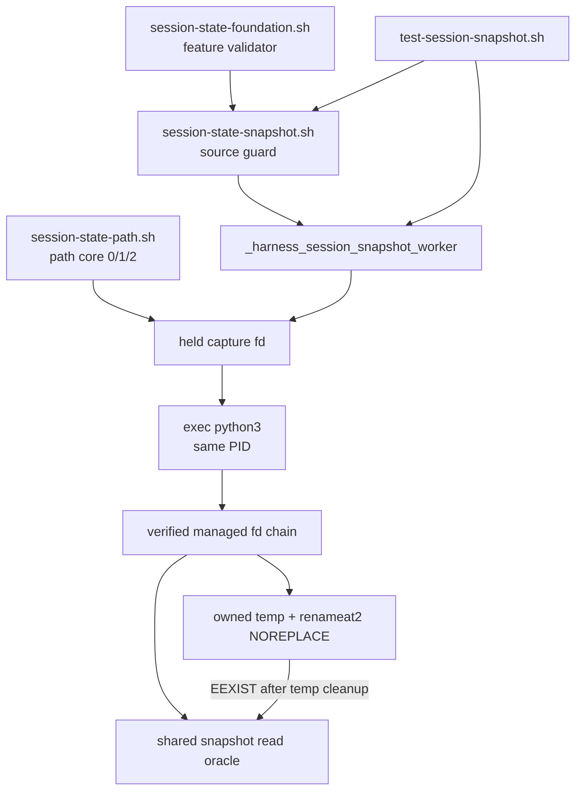
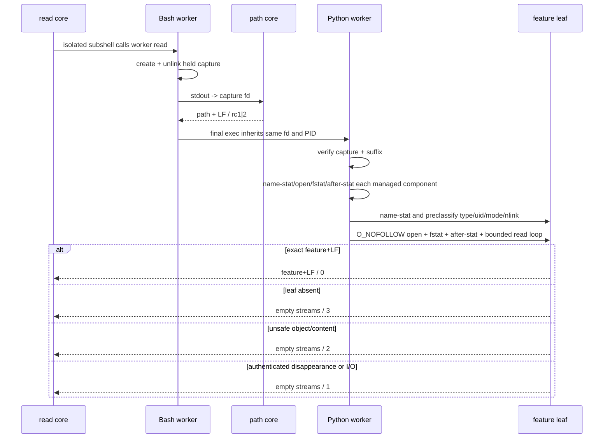

# 2026-09-02-03b-session-snapshot-safety 设计

## 概述

在既有 foundation/path 私有层之上增加一个 spawn-only Bash→Python snapshot worker：Bash 用已unlink的held fd认证path core输出，Python重新打开并验证managed目录链，以`renameat2(RENAME_NOREPLACE)`首次发布固定leaf `feature`，并为write child提供首信号锁存和owned-temp清理。

- 选择“Bash负责source/arity/capture，单个最终exec Python负责fd链、snapshot和cleanup”，因为03c必须能background同一worker并拿到真实Python PID；放弃外层Bash等待Python和由03c复制publish算法，两者分别会造成PID错位和双实现漂移。
- 选择“读取与EEXIST winner共用一个verified-open oracle、发布只用`RENAME_NOREPLACE`”，因为所有路径必须共享type/owner/mode/nlink/identity/content判据且绝不覆盖winner；放弃普通rename、link/unlink组合与ENOSYS降级，它们无法同时保持create-once和可证伪边界。
- 选择“03b只交付静态/真实竞态基础测试和八个无副作用anchor，完整provider-copy动态矩阵留给03b1”，因为补齐信号线性化后的runnable sizing为exact2 400/400；放弃把assurance塞进本片，也不弱化03b1对03c的顺序门。

## 需求映射

| 组件 | 实现的需求 |
|---|---|
| source guard与三个私有函数surface | R1, R7 |
| held capture与spawn-only worker | R2, R4, R7 |
| Python managed-fd链与snapshot read oracle | R2, R3, R5, R6 |
| create-once publish与write signal cleanup | R4, R5, R6 |
| 默认基础测试与结构anchors | R1, R2, R3, R4, R5, R6, R7 |
| controller验收、回滚与顺序门 | R8, R9 |

## 架构



运行时只新增一个可source的私有模块，不设置capability marker，也不发布public API。source层依赖Bash现有函数；active worker要求Linux、Bash 4.4+、Python 3.8+和支持`dir_fd`/`O_NOFOLLOW`的POSIX文件接口，publish还要求libc导出Linux `renameat2`。缺symbol或内核`ENOSYS`是明确OS错误，不做跨平台降级。所有测试anchor只是生产文本中的exact-once无副作用点，生产模块不读取测试环境变量；03b1只能复制provider后替换anchor。

## 组件与接口

### 既有直接依赖

- 职责：验证feature组件并产生经03a/03a2验收的physical session path。
- 消费接口：`session-foundation-v1的harness_validate_feature_name <name>；session-path-delivery-v1的_harness_session_path_core <project-id> <session-id>成功path+LF/0或OS错1或安全协议错2；session-path-race-matrix-v1的03a2 accepted ledger中dependency-present 37/37与九类全PASS门（无运行时API）`
- 依赖：`common/.harness/lib/session-state-foundation.sh`、`common/.harness/lib/session-state-path.sh`及03a2 ledger证据；本片不修改它们。

### Snapshot source guard与core wrappers

- 职责：source时做双依赖fail-inert；active时只留下worker/write/read三个私有函数，core wrapper在隔离subshell中调用worker。
- 产出接口：`session-snapshot-core-v2 —— spawn-only _harness_session_snapshot_worker write|read ...、signal-aware _harness_session_snapshot_write_core <project-id> <session-id> <feature>与_harness_session_snapshot_read_core <project-id> <session-id>的私有协议 plus tests/test-session-snapshot.sh基础摘要及03b1 anchors；无public API/provider marker`
- 精确调用：`_harness_session_snapshot_worker write <project-id> <session-id> <feature>`、`_harness_session_snapshot_worker read <project-id> <session-id>`、`_harness_session_snapshot_write_core <project-id> <session-id> <feature>`、`_harness_session_snapshot_read_core <project-id> <session-id>`。
- 依赖：上述直接依赖；worker在capture前拒绝错误arity/op及非法write feature，write/read core不承担额外状态。

### Held capture与Python dispatch

- 职责：以umask077 exclusive创建capture、持有读写fd后unlink名字，把path core stdout定向到该fd，再以最后一步`exec python3`继承同一fd；Python只经fstat/lseek/read消费capture。
- 内部接口：`dispatch(op, path_fd, project, session, feature) -> 0|1|2|3`；write另可由首信号产生`129|130|143`。
- 依赖：path core `0|1|2`协议；capture必须regular/current-EUID/0600/nlink0，输入最多4096 bytes且exact一个结尾LF。

### Managed/snapshot oracle与publisher

- 职责：从physical parent开始逐层name-stat→open/fstat→after-stat验证root/project/session；对leaf提供唯一read oracle与create-once publisher。
- 内部接口：`read_snapshot(session_fd) -> feature`或`Missing/Unsafe/Failed`；`publish(session_fd, feature) -> 0|3`或异常；异常统一在Python顶层映射退出码。
- 依赖：当前EUID、managed 0700、snapshot 0600/nlink1、Linux `renameat2(..., RENAME_NOREPLACE)`；不按已认证对象pathname reopen，不follow link，不移除winner。
- 资源规则：任何可中断close前先把owned fd转移到局部变量并清空ownership；统一`close_all`收集OSError/私有中断并继续尝试全部后续fd，temp cleanup用嵌套finally保证close失败后仍尝试unlink；全部cleanup后若`first_signal`已锁存则它优先于cleanup错误。rename syscall是ownership线性化点：未提交仍拥有temp，已提交即只拥有winner，旧temp名ENOENT绝不能触发winner回滚。

### 默认基础测试

- 职责：实现`bash ./tests/test-session-snapshot.sh`的active/inert/CLI/双流/攻击/并发/signal/anchor oracle，并保持唯一成功摘要。
- 对外接口：无参数或`all`运行自动active/inert分流，唯一`--dependency-absent`强制inert；成功逐字输出`RESULT PASS  session snapshot safety\n`。
- 依赖：生产模块、既有foundation/path、固定shfmt 3.14.0、ShellCheck 0.11.0及系统`bash/python3/git/rg/find/stat/sha256sum`。

## 数据模型

不新增schema或跨进程数据库。持久状态只有既有session目录下的固定leaf：

| 对象 | 名称/生命周期 | 安全属性 | 内容 |
|---|---|---|---|
| capture输入 | `${TMPDIR:-/tmp}/snapshot-path.*`，open后立即unlink，exec继承fd，进程退出关闭 | current-EUID、0600、nlink0、regular | exact physical session path + LF，最大4096 bytes |
| managed目录 | physical parent下root/project/session，生命周期由path core创建 | current-EUID、0700、directory、每步身份稳定 | 只作为fd锚点 |
| publish temp | session内`.snapshot-`+32 hex，只归本次write所有，发布或失败后名字消失 | current-EUID、0600、nlink1、regular | validated feature + LF |
| winner snapshot | session内固定`feature`，首次NO_REPLACE发布后不可覆盖 | current-EUID、0600、nlink1、regular、verified identity | `^[A-Za-z0-9][A-Za-z0-9._-]{0,127}\n$` |

状态转换固定为`leaf missing → owned temp → winner`；rename成功的syscall线性化点即把ownership从temp转为winner，即使信号先于Python清空temp变量到达，finally也只能对已不存在的旧名容忍ENOENT、不得unlink winner。EEXIST先`owned temp → absent`，再读独立winner并映射same/different/unsafe/disappear。任何错误都不能产生“替换既有winner”转换。`first_signal`初始为空，首个handler在任何其他可重入操作前一次性写入；后续handler看到非空只返回，cleanup完成后始终以该值映射退出码。

## 数据流

### 首次write与EEXIST

```mermaid
sequenceDiagram
  participant B as Bash worker
  participant P as path core
  participant Y as Python same PID
  participant D as session dirfd
  B->>B: validate arity/feature; create+unlink capture
  B->>P: stdout -> held capture fd
  P-->>B: physical path + LF / rc1|2
  B->>Y: exec(op, fd, project, session, feature)
  Y->>Y: install write signal handlers
  Y->>D: reopen verified managed fd chain
  Y->>D: verified read feature
  alt leaf missing
    Y->>D: create/write/close owned .snapshot-*
    Y->>D: renameat2 NOREPLACE
    alt publish success
      D-->>Y: rc0; temp becomes winner
    else EEXIST
      Y->>D: unlink owned temp
      Y->>D: full verified winner read
      D-->>Y: same rc0 / different rc3 / unsafe rc2 / disappear rc1
    end
  else safe winner exists
    D-->>Y: same rc0 / different rc3
  end
```

### verified read与失败分类



### write signal cleanup

```mermaid
sequenceDiagram
  participant F as future 03c facade
  participant W as Python write worker
  participant D as session dirfd
  F->>W: background spawn-only worker; PID remains stable after exec
  W->>W: install HUP/INT/TERM handlers before .snapshot-* creation
  W->>D: create and own temp
  W->>W: transfer fd ownership before interruptible close
  alt signal before rename commit
    F->>W: first signal
    W->>W: latch first_signal before any reentrant action
    F->>W: second signal during ignore installation returns only
    W->>W: ignore all three and raise private interrupt
    W->>D: finally attempts close/unlink despite cleanup errors
    W-->>F: no winner; 128 + first_signal
  else signal after rename syscall committed
    W->>D: renameat2 success makes temp name the winner
    F->>W: signal before Python clears old temp ownership
    W->>D: finally sees old temp name ENOENT; never removes winner
    W-->>F: winner preserved; 128 + first_signal
  end
```

## 错误处理

| 错误场景 | 恢复策略 | 校验位置 | 日志 | 用户可见 |
|---|---|---|---|---|
| source依赖缺席 | 静默inert，不定义snapshot/public surface | Bash source guard | 无 | source 0、双流空 |
| worker op/arity或write feature非法 | capture前拒绝且零state副作用 | Bash worker guard/validator | 无 | 双流空、2 |
| path core失败 | 原样透传1或2，不启动Python | held capture调用点 | 无 | 双流空、1或2 |
| capture格式/属性/后缀错 | fail closed | `path_from_fd`/`open_session` | 无 | 双流空、2；真实fd I/O为1 |
| managed link/type/owner/mode/identity错 | 不继续到leaf、不清攻击对象 | `open_dir`三阶段验证 | 无 | 双流空、2 |
| authenticated managed对象消失或真实I/O | 关闭已持有fds | `open_dir`异常映射与dispatch finally | 无 | 双流空、1 |
| leaf缺席read | 不创建leaf/temp | `read_snapshot`初次name-stat | 无 | 双流空、3 |
| snapshot属性/身份/内容错 | 不follow、不修改winner/victim | shared read oracle | 无 | 双流空、2 |
| safe snapshot在stat后消失/真实read I/O | 关闭fd，不改namespace | shared read oracle | 无 | 双流空、1 |
| renameat2缺symbol、ENOSYS或其他非EEXIST | 无fallback，finally清owned temp | `publish_errno`/`publish` | 无 | 双流空、1 |
| renameat2 EEXIST | 先清owned temp，再完整读取winner | `publish` EEXIST分支 | 无 | same 0 / different 3 / unsafe 2 / disappear 1 |
| write收到HUP/INT/TERM | handler先一次性锁存首信号，后续重入只返回；close前转移ownership，`close_all`继续全部fd且嵌套finally仍unlink，最终锁存信号优先于cleanup错 | Python handler、owned-fd close、dispatch close与publish finally | 无 | 双流空、129/130/143 |
| 信号跨越rename线性化点 | syscall未成功则清temp/无winner；已成功则旧temp名ENOENT且winner保留 | provider-copy pre/post-success oracle | 无 | 两者均返回锁存信号码，namespace按commit状态决定 |
| read收到信号 | 不建立本片信号返回契约，遵循进程默认行为 | 超出read协议 | 无 | 不纳入`0|1|2|3`保证 |

## 测试策略

| 层 | 测什么 | 用什么工具 |
|---|---|---|
| 单元/结构 | 四态source零副作用与exact function/export inventory；worker arity、feature、capture 0600/nlink0/pathname absent/fd消费；八anchor exact-once、无fallback | `bash`隔离shell、`declare`、`export -p`、`rg`、`stat`、`od` |
| 集成 | first/read/same/different；managed三层static/disappear与suffix；snapshot对象和九类内容；同/异值两波并发完整winner/tree delta；TEMP barrier后的真实Python PID和首TERM锁存 | `bash ./tests/test-session-snapshot.sh`、临时目录、`find/stat/sha256sum/ps/kill` |
| assurance sizing | held capture重建、managed/snapshot mutation、wrong-owner、short-read、EIO、symbol/ENOSYS、EEXIST全分支、HUP/INT/TERM，以及post-close、ignore安装期第二信号、signal+cleanup-close-error的五次close、rename post-success窗口；只证明03b1可实施，不替代未来门禁 | prototype `snapshot-assurance-r1.sh`、provider copy、固定shfmt/ShellCheck；308/400、240项 |
| 端到端/兼容 | candidate、完整历史checkout、真实depth-1 clone分别跑snapshot默认与offline；tracked上游hash不变；clean rollback commit删除exact两文件后03a/03a1/03a2/offline仍绿 | `bash ./scripts/check.sh --offline`、`git clone --depth 1 file://...`、`git diff/status/hash-object` |
| 静态与收敛 | exact2、numstat≤400、固定工具版本、shfmt/ShellCheck/bash-n/diff-check、六列manifest连续且全PASS、03b1/03c资产顺序查缺 | shfmt 3.14.0、ShellCheck 0.11.0、`bash -n`、Git/awk/rg controller命令 |
| 性能 | 不适用：本片不设吞吐/延迟SLO；bounded read、有限fd链和六writer竞态用于资源/终止性验收，不冒充benchmark | `timeout`只作为测试防挂死 |

测试必须将stdout/stderr落文件后按字节比较，禁止用会吞尾随LF的command substitution验证成功流。默认真实provider缺席与`--dependency-absent`都只跑inert surface；只有dependency-present active证据可解除03b验收门。03b1和03c的spec/ref/worktree/BASE/dispatch在R9条件前必须全部缺席。

## 文件清单

| 文件 | 创建/修改 | 职责（一句话） |
|---|---|---|
| `common/.harness/lib/session-state-snapshot.sh` | 创建 | source-inert的spawn-only snapshot worker、held capture、verified read、create-once publish与write child cleanup |
| `tests/test-session-snapshot.sh` | 创建 | 默认发现的active/inert基础安全、竞态、信号、结构及固定摘要验收 |

验收资产（不纳入源码文件清单）：本spec的requirements/design/tasks/ledger与review报告；prototype runtime/base code `a708ce6f0979c6644292b58b4a7b0d4afcdf821d`、assurance `cbdbdde0e1e3ff4ceb2dc0279b1db83127a0ea9e`、evidence `9f0dfbc5bca35df8fe9ea9ba249050a8aa4547fd`；执行期task briefs、red/green报告、六列review manifest、candidate/full/depth-1/rollback日志和accepted HEAD证据。实现门③通过前不创建implementation worktree或固定execution BASE，03b accepted ledger前不创建03b1，03b1完整active ledger前不创建03c。
