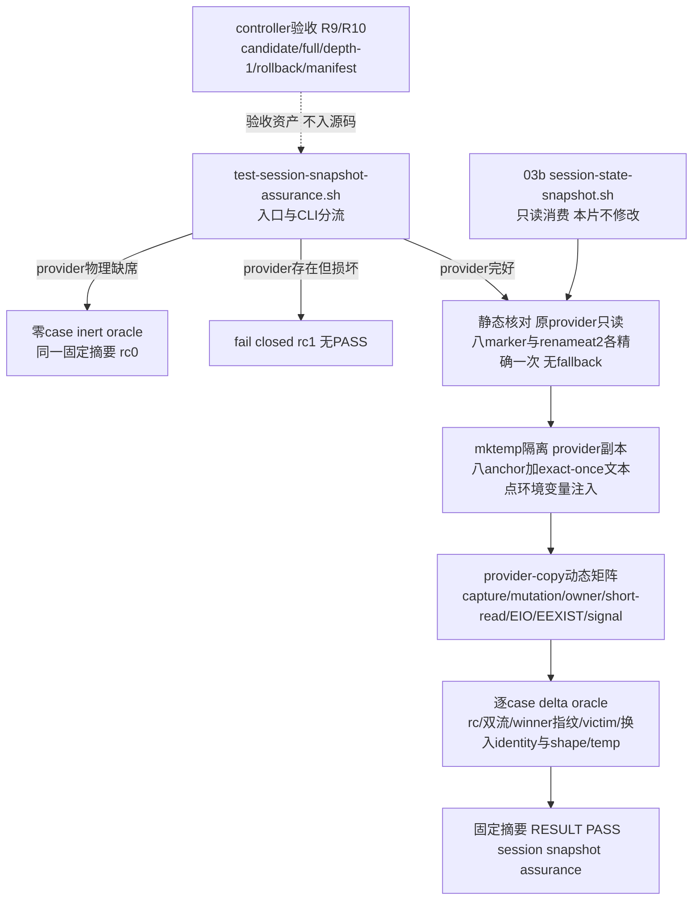

# 2026-09-02-03b1-session-snapshot-assurance 设计

## 概述

只新增一个默认发现、shfmt-clean 的 `tests/test-session-snapshot-assurance.sh`：不改 03b provider，把它复制到 `mktemp` 隔离目录后在八个无副作用 anchor 及若干 exact-once 非 anchor 文本点注入攻击，穷举 held capture/managed/snapshot mutation、wrong-owner、short-read、EIO、publish seam 与 child signal 窗口的全部动态分支，成功唯一输出 `RESULT PASS  session snapshot assurance`。

- 选择“provider-copy + 环境变量注入，原 provider 只读消费”，因为 03b 已验收的模块不能被本片触碰，而攻击点必须落在 stat→open、publish、signal handler 等生产文本内部；放弃给 provider 加测试钩子参数（污染已验收接口）和在测试里重写 worker 算法（双实现漂移，证的不是同一份代码）。注入集不止八个 marker anchor：R3 的静态核对只针对八 marker 与 `renameat2`，而动态矩阵还在 short-read chunk、cleanup-close、post-close 信号、latch-second、caught barrier、unlink errno 记录等 exact-once 非 anchor 文本点做逐字替换，这些点不进入 R3 的 marker 计数。
- 选择“inert 与 fail-closed 严格分流：provider 物理缺席时三种调用走同一零 active case inert oracle 并以同一固定摘要 rc0；存在但损坏（类型/symlink/`bash -n`/source/三 export/anchor 或 `renameat2` 次数错）一律 rc1 无 PASS”，因为 inert PASS 不得充当本片验收证据，损坏 provider 伪装成 inert 会让 fail-closed 场景静默通过；放弃把损坏并入 inert 摘要。
- 选择“原样整合 prototype 的 308 行 active 矩阵，剩余约 92 行只用于 inert 分流、CLI 解析、fail-closed 七类检查、固定摘要与计数、controller 面向的结构注释，以及 rename 已提交窗口的 unlink errno 记录注入点（注入替换与一行 oracle 核对合计约 8 行），承诺 execution diff exact1 且 numstat ≤400”，因为 runnable prototype `cbdbdde0e1e3ff4ceb2dc0279b1db83127a0ea9e` 已在当前 main 固定格式实跑 rc0、240 项断言、308/400 行；放弃把 R9/R10 的 candidate/full/depth-1/rollback/manifest 逻辑塞进测试文件（它们属 controller 验收资产，进文件必超 400 行且无法机械验收）。

## 需求映射

| 组件 | 实现的需求 |
|---|---|
| 入口与 CLI 分流 | R1, R2 |
| inert/fail-closed oracle | R2 |
| provider-copy 注入与静态核对 | R3 |
| held capture 同名重建用例 | R4 |
| managed/snapshot stat→open mutation 矩阵 | R5 |
| wrong-owner/short-read/EIO 用例 | R6 |
| publish seam（symbol/ENOSYS/EEXIST 四态）矩阵 | R7 |
| child signal 四窗口矩阵 | R8 |
| controller 验收（candidate/full/depth-1/offline/manifest/exact1） | R9 |
| controller 回滚与 03c 顺序门 | R10 |

## 架构



本片运行时零新增：唯一的源码产出是测试文件本身，不设置 capability marker、不发布运行时 API、不修改 `common/` 与任何前序测试。测试入口依赖 Bash（固定 shfmt `v3.14.0` 格式化验收）、系统 `python3`（worker 进程与注入文本生成）、以及 `rg/find/stat/sha256sum/ps/kill/od/git/mktemp`；选这些是因为 03b worker 本体就是 Bash→Python spawn-only 结构，注入文本替换必须与 worker 内的 Python 源码逐字对齐，而 delta oracle 需要的 dev/inode/uid/mode/nlink/size/hash 指纹只能由 `stat`/`sha256sum` 机械给出。注入替换分两层：八个 marker anchor 由 R3 静态核对精确一次后注入；short-read chunk、cleanup-close、post-close 信号、unlink errno 记录等攻击点落在非 anchor 的 exact-once 生产文本上，替换时同样要求原文精确一次，但不计入 marker 结构核对。全部 provider 副本与 state root 位于单个 `mktemp -d` 隔离目录（`TMPDIR` 同步指向它），`trap EXIT` 清理，不触碰真实 `${TMPDIR:-/tmp}` 之外的状态。

## 组件与接口

### assurance 入口与 CLI 分流

- 职责：从自身路径解析 repo root，只接受无参数、`all` 或唯一 `--dependency-absent`，按 provider 物理状态分流到 inert/fail-closed/active 三条路径之一。
- 对外接口（产出，与 frontmatter 逐字一致）：`session-snapshot-assurance-v1 —— tests/test-session-snapshot-assurance.sh默认发现入口、provider-copy完整矩阵与固定摘要`RESULT PASS  session snapshot assurance`；无运行时API/provider marker`
- 精确调用面：`bash ./tests/test-session-snapshot-assurance.sh`、`bash ./tests/test-session-snapshot-assurance.sh all`、`bash ./tests/test-session-snapshot-assurance.sh --dependency-absent`；active 与 inert 成功时 stdout 逐字 `RESULT PASS  session snapshot assurance\n`、stderr 空、rc0；unknown 参数、extra 参数、flag 带值均 rc1 且不打印 PASS。
- 依赖：`common/.harness/lib/session-state-snapshot.sh` 的物理路径与 03b accepted HEAD；`bash/rg/stat/sha256sum/mktemp`。

### 消费契约（03b snapshot core，本片只读）

- 职责：提供被复制的 provider 文本、spawn-only worker 与 write/read core 私有协议、八个确定性测试 anchor。
- 消费接口（与 frontmatter 逐字一致）：`session-snapshot-core-v2的spawn-only _harness_session_snapshot_worker write|read ...、signal-aware write/read core私有协议与八个确定性测试anchor；tests/test-session-snapshot.sh基础测试dependency-present PASS证据（无运行时API）`
- 精确调用：`_harness_session_snapshot_worker write <project-id> <session-id> <feature>`、`_harness_session_snapshot_worker read <project-id> <session-id>`、`_harness_session_snapshot_write_core <project-id> <session-id> <feature>`、`_harness_session_snapshot_read_core <project-id> <session-id>`；八个 anchor 为 `HARNESS_TEST_MARKER_CAPTURE_READY`、`HARNESS_TEST_MARKER_SNAPSHOT_MANAGED_BEFORE_OPEN`、`HARNESS_TEST_MARKER_MANAGED_EXPECTED_EUID`、`HARNESS_TEST_MARKER_SNAPSHOT_EXPECTED_EUID`、`HARNESS_TEST_MARKER_SNAPSHOT_BEFORE_OPEN`、`HARNESS_TEST_MARKER_TEMP_BEFORE_PUBLISH`、`HARNESS_TEST_MARKER_PUBLISH_RESULT` 与 `HARNESS_TEST_MARKER_OS_ERROR`，它们都不是 capability marker。
- 依赖：03b accepted ledger；本片不设置 `HARNESS_SESSION_STATE_PROVIDER_VERSION`。

### inert/fail-closed oracle

- 职责：provider 物理缺席时，无参数、`all`、`--dependency-absent` 三种调用走同一零 active case 流程并以同一固定摘要逐字 rc0；provider 存在但损坏时统一 fail closed。
- 内部接口：`run_inert() -> 0`（唯一输出固定摘要）；fail-closed 检查点各自直接 `exit 1`，不打印 PASS。
- fail-closed 触发条件（存在即拒）：路径非普通文件、是 symlink、`bash -n` 语法失败、source 返回非零、source 后 `_harness_session_snapshot_worker`/`_harness_session_snapshot_write_core`/`_harness_session_snapshot_read_core` 三个 export 任一缺席、任一 anchor 非精确一次、`renameat2` 调用非精确一次。
- 依赖：入口分流结果；inert 摘要不得作为本片验收证据，只保证回滚兼容。

### provider-copy 注入与静态核对

- 职责：在 active 分支把原 provider 复制到 `mktemp` 隔离副本，注入前对原文件静态核对，注入只发生在副本上，运行前后原 provider SHA-256 不变。
- 内部接口：`verify_provider_static <path> -> 0|1`（八 marker 各精确一次、`renameat2` 精确一次、无 `os.replace(`/`os.link(`/`os.rename(` publish fallback）；`inject_copy <src> <dst> -> 0`（逐字锚点替换，每处替换要求原文出现且仅出现一次，否则注入自身失败 rc1）。
- 注入机制：副本内的攻击代码由 `ASSURANCE_*` 环境变量按 case 驱动（capture 重建路径、managed/snapshot 换入动作与层、owner 偏移、EIO 开关、publish 动作、barrier/caught 文件、cleanup close 日志等），与 runnable prototype 的注入集一一对应。
- 依赖：原 provider 文本、mktemp 隔离目录、python3（替换脚本）。

### 动态矩阵（capture/managed/snapshot/owner/short-read/EIO）

- 职责：逐项反证 R4–R6 的动态分支，每行核对 rc、双流与完整状态 delta。
- 用例集：held capture 同名重建 1 组（发布落 canonical session path、重建文件内容逐字节等于攻击者写入、无 temp 残留）；managed 三层（state/project/session）×（link/inode/missing）×（read/write）= 18 行；snapshot leaf ×（link/inode/missing）×（read/write）= 6 行；wrong-owner（managed/snapshot expected-EUID）×（read/write）= 4 行 rc2；强制一字节 short read 1 行 rc0 且 stdout hex 精确 `feature`+LF；真实 EIO 既有 read 与 fresh write 2 行 rc1 双流空。
- delta oracle：每行核对被移原 winner 完整指纹（dev/inode/uid/mode/nlink/size/sha256）不变、victim 不变、换入对象的注入 identity 与精确 shape（link 目标/dir 属性/file 属性+hash/absent）、owned temp 计数为 0。
- 依赖：provider-copy 注入、`_harness_session_snapshot_{read,write}_core`。

### publish seam 矩阵

- 职责：覆盖 R7 的 libc symbol 缺失、`ENOSYS` 与确定性 `EEXIST` 全分支。
- 用例集：`symbol`/`enosys` 各 rc1 且无任何 fallback；`EEXIST` 后 same/different/unsafe/disappear 分别 rc 0/3/2/1 且全部双流空；same/different 必须在进入 winner 首次 name-stat 前证明 owned temp 已清（注入点主动拒绝残留 `.snapshot-*`），返回后核对完整 winner 指纹；unsafe/disappear 核对注入 identity 与精确 shape；所有分支 victim 不变、无 temp 残留。
- 依赖：`HARNESS_TEST_MARKER_PUBLISH_RESULT` 与 `HARNESS_TEST_MARKER_OS_ERROR` 注入、write core。

### child signal 窗口矩阵

- 职责：覆盖 R8 的 HUP/INT/TERM 锁存与四个确定性信号线性化窗口。
- 用例集：三行真实信号——spawn-only background worker，`TEMP_BEFORE_PUBLISH` barrier 后向 `ps` 证实为 Python 的 PID 送达首信号，rc 恰为 129/130/143，无 winner，owned temp 清零，ignore 安装期第二信号只返回且不改首信号码；四行 provider-copy 窗口——post-close 信号、signal+cleanup-close-error（owned temp/session/三层 ancestor 共五次 close 尝试，锁存信号码优先于 cleanup 错误）、rename 未提交窗口无 winner、rename 已提交窗口 winner 保持完整指纹且旧 temp 名只得到 `ENOENT`、已提交 winner 绝不回滚。
- 旧 temp 名 ENOENT 的机械 oracle：新增一个 exact-once 非 anchor 文本注入点，逐字替换 finally 中 owned temp 的 unlink 调用点；设置 `ASSURANCE_UNLINK_LOG` 时副本把该次 unlink 的结果（`success` 或具体 errno 名）追加到日志文件，替换同样要求原文精确一次、否则注入自身 rc1。rename 已提交窗口行核对日志唯一一行恰为 `ENOENT`——first_signal 锁存后任何非 ENOENT 的 unlink 错误（或 unlink 意外成功删到真实对象）都会使该行 FAIL，而不是被 finally 静默吞掉。该注入替换与一行日志核对合计约 8 行，计入剩余约 92 行的整合预算。
- 依赖：spawn-only worker（PID 在 exec 后不变）、`TEMP_BEFORE_PUBLISH`/`PUBLISH_RESULT`/close 注入点、`ps/kill`。

### controller 验收与顺序门（验收资产，不进入源码文件）

- 职责：执行 R9/R10 的机器核对，全部证据入 ledger 后才允许 03c 启动。
- 验收动作：candidate、完整历史 checkout、真实 `git clone --depth 1 file://...` 分别运行默认入口与 `bash ./scripts/check.sh --offline`，offline 发现本入口恰好一次，depth-1 commit-count=1 且 shallow marker 非空；每个 checkout 的六 tracked 上游文件（`common/.harness/lib/session-state-foundation.sh`、`common/.harness/lib/session-state-path.sh`、`tests/lib/session-path-race-driver.py`、`tests/test-session-path-races.sh`、`common/.harness/lib/session-state-snapshot.sh`、`tests/test-session-snapshot.sh`）SHA-256 测试前后不变且 clean；逐字验证 shfmt `v3.14.0` 与 ShellCheck version field `0.11.0` 后只对 exact 单文件运行 `shfmt -d -i 2 -ci -bn`、`shellcheck -x --severity=warning`、`bash -n`；execution BASE 到 accepted HEAD exact 只新增 `tests/test-session-snapshot-assurance.sh`、numstat 总和 ≤400、六列 manifest 与 tasks 一一对应、首尾/相邻连续、reviewer 非空且全 PASS、`git diff --check` 与 worktree clean 通过；从 accepted HEAD 建隔离临时分支提交 exact 只删除本入口的 rollback commit，clean checkout 中 03b 基础测试与 offline 全绿、本入口发现 0 次；03c 的 spec 目录/分支/worktree/ledger BASE 或 dispatch 记录在条件满足前以 `test ! -e`、`git show-ref --verify --quiet` 反值、`git worktree list --porcelain` 与 `rg` 机械查缺席。
- 依赖：本片 accepted HEAD、dependency-present 完整矩阵、exact1/400 与全 PASS manifest 入 ledger；inert PASS 不解除该门。

## 数据模型

不适用：本片不新增持久化状态、schema 或跨进程数据库。测试 fixture 只有 `mktemp` 隔离目录内的 provider 副本、state root 与 attacker 文件，复用 03b 数据模型的 capture/managed/temp/winner 四对象及其安全属性（capture nlink0 0600、managed 0700、temp `.snapshot-*` 0600、winner 固定 leaf 0600 nlink1），case 结束由 `trap EXIT` 整体销毁；oracle 只比较指纹与 inventory delta，不产生任何留存状态。

## 数据流

### 入口分流与 provider-copy 注入

```mermaid
sequenceDiagram
  participant U as 调用方(controller/offline/用户)
  participant E as assurance入口
  participant B as 原provider(只读)
  participant C as mktemp副本
  U->>E: 无参数 / all / --dependency-absent
  E->>E: 解析repo root; 拒绝unknown/extra/flag带值(rc1无PASS)
  alt provider物理缺席
    E-->>U: 零active case inert; RESULT PASS  session snapshot assurance / rc0
  else provider存在但损坏
    E->>B: 类型/symlink/bash -n/source/三export/anchor/renameat2次数
    E-->>U: fail closed rc1 无PASS
  else provider完好
    E->>B: 静态核对八marker各一次/renameat2一次/无fallback; 记录SHA-256
    E->>C: 复制并逐字注入八anchor与exact-once文本点(每处替换要求精确一次)
    E->>C: 执行完整动态矩阵与delta oracle
    E->>B: 复核SHA-256不变
    E-->>U: RESULT PASS  session snapshot assurance / rc0 / stderr空
  end
```

### managed stat→open mutation 单行 oracle

```mermaid
sequenceDiagram
  participant T as 测试driver
  participant W as provider副本worker
  participant D as managed目录链
  T->>W: prepare: write alpha 建立合法winner
  T->>T: 记录winner/victim完整指纹
  T->>W: 设ASSURANCE_MANAGED=link|inode|missing, ASSURANCE_LAYER=state|project|session
  W->>D: name-stat通过该层
  W->>D: SNAPSHOT_MANAGED_BEFORE_OPEN anchor: 换入symlink/different-inode或删除
  W->>D: open/fstat/after-stat 重新验证该层
  alt link或different-inode
    D-->>T: 双流空 / rc2; 不follow换入对象
  else 认证后消失
    D-->>T: 双流空 / rc1
  end
  T->>T: 核对被移原winner指纹不变/victim不变/换入identity与精确shape/temp=0
```

### child signal barrier 与锁存窗口

```mermaid
sequenceDiagram
  participant T as 测试driver
  participant W as spawn-only worker(同一PID)
  participant D as session dirfd
  T->>W: background worker write; 设barrier/caught文件
  W->>W: 安装HUP/INT/TERM handler后建owned temp
  W->>D: TEMP_BEFORE_PUBLISH anchor: 落barrier并等待
  T->>T: 等到barrier; ps证实该PID为Python; temp计数=1
  T->>W: 首信号 HUP/INT/TERM
  W->>W: handler一次性锁存first_signal
  T->>W: ignore安装期第二信号
  W->>W: 非空锁存只返回, 不改首信号码
  W->>D: finally清owned temp; cleanup错误不覆盖锁存码
  W-->>T: rc=128+首信号(129/130/143); 无winner; temp清零
  T->>T: 另四行核对post-close/五次close/rename未提交/已提交窗口
  T->>T: 已提交窗口另核unlink日志唯一一行恰为ENOENT
```

## 错误处理

| 错误场景 | 恢复策略 | 校验位置 | 日志 | 用户可见 |
|---|---|---|---|---|
| CLI unknown/extra/flag带值 | 拒绝且不进入任何分支 | 入口参数解析 | 无 | rc1、无 PASS |
| provider 物理缺席 | 三种调用同一零 case inert oracle | 入口分流 | 无 | 固定摘要、rc0 |
| provider 非普通文件/是 symlink | fail closed，不 source 不复制 | 入口 fail-closed 检查 | 无 | rc1、无 PASS |
| provider `bash -n` 失败/source 非零/三 export 缺席 | fail closed | 入口 fail-closed 检查 | 无 | rc1、无 PASS |
| 任一 anchor 或 `renameat2` 非精确一次/存在 rename/link fallback | fail closed，注入前终止 | 静态核对 | 无 | rc1、无 PASS |
| 注入锚点替换非精确一次 | 注入自身失败，矩阵不执行 | `inject_copy` | 无 | rc1、无 PASS |
| 真实 EIO（OS_ERROR anchor） | worker 原语义：既有 read 与 fresh write 均 rc1，不改 winner/victim/temp | EIO 两行 delta oracle | 无 | 双流空、rc1；矩阵 PASS 依赖该分类 |
| ENOENT 窗口（managed/snapshot 认证后消失、EEXIST disappear） | 关闭已持有 fd，不改 namespace | mutation/EEXIST 行 rc 与 shape 核对 | 无 | 双流空、rc1 |
| EEXIST same/different/unsafe/disappear | temp 先清再读 winner；分别 rc 0/3/2/1 | publish seam 行；same/different 在 winner 首次 name-stat 前拒残留 temp | 无 | 双流空、对应 rc |
| `renameat2` 缺 symbol/ENOSYS | 无 fallback，清 owned temp | publish seam 行 rc1 与 temp=0 | 无 | 双流空、rc1 |
| write child 收 HUP/INT/TERM | handler 一次性锁存首信号；ignore 期第二信号只返回；finally 五次 close 尝试后锁存码优先于 cleanup 错误 | 信号窗口矩阵 rc/close 日志/temp 核对 | 无 | 双流空、129/130/143 |
| rename 已提交后信号 | 旧 temp 名只容忍 `ENOENT`，winner 完整指纹保留且绝不回滚 | 已提交窗口 winner 指纹与 shape 核对 + unlink errno 注入日志（唯一一行恰为 `ENOENT`，非 ENOENT 吞错即 FAIL） | unlink errno 日志到 mktemp 文件 | 锁存信号码、winner 不变 |
| wrong-owner（无特权 expected-EUID 失败） | 拒绝 follow，winner/temp 不变 | owner 四行 rc2 与 delta | 无 | 双流空、rc2 |
| 强制一字节 short read | 循环读满仍逐字节产出精确 `feature`+LF | stdout hex 精确比较 | 无 | rc0、stdout hex 精确 |
| 任一 case 失败 | 累计 failures，末行不打印 PASS | 统一 check/run_rc 计数器 | 失败详情到 stderr | rc1、无 PASS |

## 测试策略

| 层 | 测什么 | 用什么工具 |
|---|---|---|
| 单元/结构 | CLI 四态（无参数/all/--dependency-absent 接受，unknown/extra/flag带值 rc1 无 PASS）；原 provider 八 marker 与 `renameat2` 各精确一次、无 `os.replace/link/rename` fallback；运行前后原 provider SHA-256 不变；副本与 state root 均在 `mktemp` 隔离目录 | `bash` 隔离 shell、`rg`、`stat`、`sha256sum`、`mktemp` |
| 集成（动态矩阵，本片主体） | R4–R8 全组合：capture 同名重建；managed 三层×link/inode/missing×read/write 18 行；snapshot leaf×link/inode/missing×read/write 6 行；wrong-owner 4 行；short-read 1 行（stdout hex 精确）；EIO 2 行；symbol/ENOSYS/EEXIST 四态 6 行；child 信号 3 行真实信号 + 4 行 provider-copy 窗口；每行核对 rc、双流、winner 完整指纹、victim、换入 identity/shape、temp=0 | `bash ./tests/test-session-snapshot-assurance.sh`（主验证命令）、python3 注入、`ps/kill/od/find/stat/sha256sum` |
| inert/fail-closed | provider 物理缺席时三种调用同一零 case 流程、同一固定摘要逐字 rc0；七类损坏（非普通文件/symlink/`bash -n`/source/三 export/anchor 次数/`renameat2` 次数）逐一 fail closed rc1 无 PASS；inert 摘要不计入本片验收证据 | 同上入口 + `--dependency-absent`、损坏 fixture 目录 |
| 端到端/收敛（controller 验收资产） | candidate、完整历史 checkout、真实 `git clone --depth 1 file://...` 分别跑默认入口与 `bash ./scripts/check.sh --offline`，offline 发现本入口恰好一次，depth-1 commit-count=1 且 shallow marker 非空；六 tracked 上游文件 SHA-256 测试前后不变且 clean；隔离 rollback commit exact 只删本入口后 03b 基础测试与 offline 全绿、本入口发现 0 次；03c 四类资产机械查缺席 | `git clone --depth 1 file://...`、`git worktree/status/diff/show-ref`、`bash ./scripts/check.sh --offline`、`rg` |
| 静态与 sizing | 固定版本断言后只对 exact 单文件 `shfmt -d -i 2 -ci -bn`、`shellcheck -x --severity=warning`、`bash -n`；execution BASE..HEAD exact 只新增本入口、numstat 总和 ≤400；六列 manifest 机械验证；`git diff --check` 与 clean 通过 | shfmt `v3.14.0`、ShellCheck `0.11.0`、`bash -n`、Git/awk controller 命令 |
| 性能 | 不适用：本片不设吞吐/延迟 SLO；信号 barrier 用短轮询等待，`timeout` 仅作测试防挂死，不冒充 benchmark | `timeout` |

sizing 承诺：runnable prototype `cbdbdde0e1e3ff4ceb2dc0279b1db83127a0ea9e` 的 active 矩阵以固定格式实测 308/400 行、实跑 rc0、240 项断言；剩余约 92 行只整合 inert/fail-closed 分流（含 fail-closed 七类检查的逐类 fixture）、CLI 解析、固定摘要与 failures/checks 计数、repo root 解析、controller 面向的结构注释，以及 rename 已提交窗口的 unlink errno 记录注入点（约 8 行），不新增其他动态用例。承诺 execution diff exact1（只新增 `tests/test-session-snapshot-assurance.sh`）且 `git diff --numstat` 总和 ≤400。stdout/stderr 一律落文件后按字节比较，禁止用吞尾随 LF 的 command substitution 验证成功流。sizing 证据为 `cbdbdde0e1e3ff4ceb2dc0279b1db83127a0ea9e:.spec/2026-08-31-aosp-harness-refactor/work/2026-09-02-03b-session-snapshot-safety/prototype/round3-assurance-sizing-evidence.md`；其中 293 行/236 项是修复旧 close 顺序 mutant 之前的早期测量，现行口径以 requirements 与 PLAN v5.7 确认的 308/400 行、240 项断言为准。

## 文件清单

| 文件 | 创建/修改 | 职责（一句话） |
|---|---|---|
| `tests/test-session-snapshot-assurance.sh` | 创建 | 默认发现的 shfmt-clean assurance 入口：CLI/inert/fail-closed 分流与 provider-copy 八 anchor 注入的 capture/mutation/publish/signal 完整动态矩阵及固定摘要 |

验收资产（不纳入源码文件清单）：红阶段证据（失败双流 mutant 与 old-order close mutant 的 rc1/无 PASS 自反证记录）、逐 task review 报告、六列 review manifest、candidate/full/depth-1/rollback 运行日志、accepted HEAD 与 ledger execution BASE 证据；sizing 依据 prototype `cbdbdde0e1e3ff4ceb2dc0279b1db83127a0ea9e`（308/400 行、240 项断言）与 `cbdbdde0e1e3ff4ceb2dc0279b1db83127a0ea9e:.spec/2026-08-31-aosp-harness-refactor/work/2026-09-02-03b-session-snapshot-safety/prototype/round3-assurance-sizing-evidence.md`（其中 293/236 为修复旧 close 顺序前的早期测量，现行口径 308/400）。门③通过前不创建 implementation worktree 或固定 execution BASE；dependency-present 完整矩阵、exact1/400 与全 PASS manifest 入 ledger 前不创建 03c 的 spec 目录/分支/worktree/BASE/dispatch 记录。
