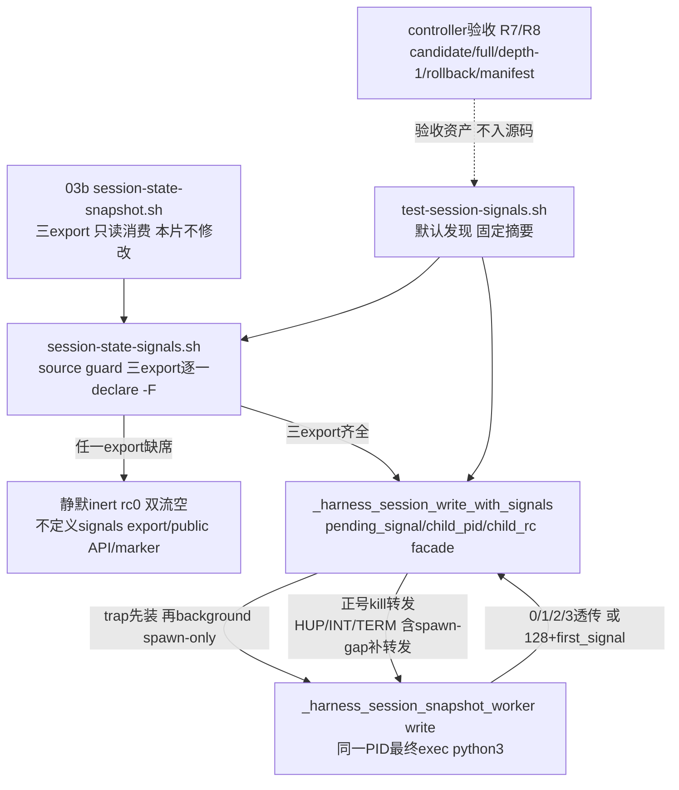

# 2026-09-03-03c-session-write-interrupts 设计

## 概述

只新增 source-inert 的私有模块 `common/.harness/lib/session-state-signals.sh` 与默认发现、shfmt-clean 的 `tests/test-session-signals.sh`：在已由 03b/03b1 验收的 signal-aware spawn-only worker 上组合一个 Bash `pending_signal/child_pid/child_rc` 信号转发 facade，交付唯一私有 export `_harness_session_write_with_signals <project-id> <session-id> <feature>`，常规 0/1/2/3 透传、HUP/INT/TERM 恰为 129/130/143；owned temp、publish 提交点与 child 信号 handler 全部留在 03b worker 内，本片不复制、不修改 snapshot 模块。

- 选择“facade 只用 bash 内建 `kill` 向 child 的单一正 PID 转发，child 不放入独立 pgroup”，因为 worker 是 spawn-only 单进程结构（background 后最终 `exec python3`、PID 稳定、Python 侧不 fork 也无孙进程），“child PID 及其 process-group 中由本调用产生的部分”恰好等于这一个 PID，正号转发即完整覆盖 R4 的转发义务，且转发目标永远不含 facade 自身（facade 与调用方同组，正 PID 不可能打回自身）；放弃 `setsid` 把 child 移入独立 pgroup（仓库 grep 零先例、引入新的运行时外部依赖、spawn-only 单进程下零收益）与负 PID 组转发（非 job-control shell 中 child 与 facade、测试 driver/controller 同一 process group，`kill -SIG -- -pgid` 会同时命中 facade 自身——trap 重入或在 wait/rc 映射前被杀——以及父 shell，违反双流纪律并可能杀死调用方）。
- 选择“trap 先于 spawn 安装、spawn 后立即补转发，并在 facade 自有模块内放两个 exact-once 无副作用 anchor（`HARNESS_TEST_MARKER_SIGNALS_BEFORE_SPAWN`/`HARNESS_TEST_MARKER_SIGNALS_AFTER_WAIT`）”，因为 spawn-gap（trap 已装、`child_pid` 未赋值）收到的信号只能先锁存 `pending_signal`、spawn 后补转发才不会丢；测试在自有模块的 mktemp 副本上于 anchor 处同步注入 `kill`，把 spawn-gap 与“child 已 reap 后”两个窗口锁死为确定性用例；放弃修改 03b worker 增加钩子（R3 与超出范围明文禁止）和裸竞态时序测试（不可机械验收）。
- 选择“source 守卫逐一 `declare -F` 验证 `_harness_session_snapshot_worker`/`_harness_session_snapshot_write_core`/`_harness_session_snapshot_read_core` 三个 export，任一缺席则静默 inert”，与 03b 的 inert 语义同构、与 R1/R2 明文一致；放弃只验 worker 一个 export（违反 R1，且 03d 的 aggregator 顺序链以三 export 齐备为前提）。

## 需求映射

| 组件 | 实现的需求 |
|---|---|
| signals source guard 与 inert 契约 | R1, R2 |
| signals facade（状态机/补转发/锁存/转发） | R3, R4, R5 |
| 默认发现测试 `tests/test-session-signals.sh` | R6 |
| controller 验收（candidate/full/depth-1/offline/manifest/exact2） | R7 |
| controller 独立回滚与 03d 顺序门 | R8 |

## 架构



运行时零新增依赖：facade 只用 bash 内建 `trap`/`kill`（正 PID）/`wait`/`declare`，不调用任何外部命令，不读写文件，不复制 temp/publish 逻辑。process-group 语义界定为两条确定性路径的合取：信号组投递（终端 Ctrl-C、supervisor `kill -- -pgid`）时内核把信号直送同组的 child，facade trap 再补一次正号转发——child 的 Python handler 与 facade 锁存都是 first-signal-wins 幂等，重复投递无害；信号只打 facade 单 PID 时由 trap 转发到 child。facade 永远不使用负 PID，因此转发在任何 shell 模式下都不可能命中自身组。`setsid` 只允许出现在测试侧：group 行需要把 facade-under-test 隔离到自己的 session/pgroup 才能安全地 `kill -- -pgid`，当前环境实测 util-linux `setsid` 2.39.3 可用且离线；`set -m` 方案实测会向 stderr 泄漏 `[1]+ Terminated` job 通知（破坏双流空 oracle）并改变 worker 的 pgroup 语义，放弃。生产模块沿用 03b 锚点纪律：facade 的两个 anchor 是 exact-once 无副作用 `: #` 行，生产不读取任何测试环境变量，注入只发生在测试的 mktemp 副本上。

## 组件与接口

### signals source guard 与 inert 契约

- 职责：source 时逐一 `declare -F` 验证三个 snapshot export；任一缺席则整段 guard 不成立，source 静默返回 0、双流空，不定义 signals export、四个状态 public API（`harness_session_path`/`harness_session_write`/`harness_session_read`/`harness_session_remove`）与 `HARNESS_SESSION_STATE_PROVIDER_VERSION`，不读写文件、不覆写依赖。
- 对外接口：无（guard 是模块顶层结构，非函数）；inert 时 export inventory 与 source 前逐字一致。
- 依赖：03b 模块已 source 后的函数表；缺席场景下零依赖。

### signals facade（状态机/补转发/锁存/转发）

- 职责：以 `pending_signal/child_pid/child_rc` 三 local 状态机 background spawn-only worker，先装 trap 再 spawn，spawn-gap 补转发，first-signal-wins 锁存，wait 被 trap 中断时重 wait 至 reap，最终把首信号映射为恰 129/130/143，常规 rc 0/1/2/3 透传且全程双流空。
- 对外接口（产出，与 frontmatter 逐字一致）：`session-signals-facade-v1 —— 唯一私有export _harness_session_write_with_signals <project-id> <session-id> <feature>（常规沿用snapshot write的0|1|2|3，HUP/INT/TERM返回129|130|143）plus tests/test-session-signals.sh默认发现测试固定摘要`RESULT PASS  session write interrupts`；无public API/provider marker`
- 精确调用：`_harness_session_write_with_signals <project-id> <session-id> <feature>`；arity/feature 校验完全委托 worker（非法输入由 worker 在 capture 前返回 2、双流空）。
- 内部结构（唯一 export，不新增辅助函数）：三条 inline trap 各自 `[[ -n $pending_signal ]] || { pending_signal=<SIG>; [[ -n $child_pid ]] && kill -<SIG> "$child_pid" 2>/dev/null; }`；`: # HARNESS_TEST_MARKER_SIGNALS_BEFORE_SPAWN` 位于 trap 安装与 spawn 之间、`: # HARNESS_TEST_MARKER_SIGNALS_AFTER_WAIT` 位于 wait 循环与 trap 摘除之间；wait 循环 `wait "$child_pid"` 后若 rc>128 且 `kill -0 "$child_pid"` 成立则重 wait，否则取为 `child_rc`；摘除 trap 后 `pending_signal` 非空按 HUP/INT/TERM 返回 129/130/143，否则 `return "$child_rc"`。
- 依赖：`_harness_session_snapshot_worker` 的 spawn-only 语义（最终 exec python3、PID 稳定、worker write 双流空、首信号锁存 128+first_signal、owned temp 自清）。

### 消费契约（03b snapshot core，本片只读）

- 职责：提供 spawn-only worker、signal-aware write/read core 私有协议与 03b1 验收门；本片只组合、不修改。
- 消费接口（与 frontmatter 逐字一致）：`session-snapshot-core-v2的spawn-only _harness_session_snapshot_worker write|read ...与signal-aware _harness_session_snapshot_write_core/_harness_session_snapshot_read_core私有协议（worker write双流空0|1|2|3|129|130|143，worker read成功feature+LF/0、失败双流空1|2|3，最终exec Python且PID稳定）；session-snapshot-assurance-v1的03b1 accepted ledger中dependency-present完整矩阵checks=241与全PASS门（无运行时API）`
- 精确调用：facade 只 background 调用 `_harness_session_snapshot_worker write <project-id> <session-id> <feature>`（不经 write_core——core 外包一层 subshell 会造成 PID 错位）；write_core/read_core 只作为 source guard 的存在性检查对象。
- 依赖：03b 与 03b1 accepted ledger；本片不设置 `HARNESS_SESSION_STATE_PROVIDER_VERSION`，read 路径不新增信号契约。

### 默认发现测试

- 职责：实现 `bash ./tests/test-session-signals.sh` 的 CLI 分流、inert 三 fixture、常规透传行、facade/group/spawn-gap 信号矩阵与固定摘要。
- 对外接口：无参数或 `all` 运行 active/inert 自动分流，唯一 `--dependency-absent` 强制 inert；成功 stdout 逐字 `RESULT PASS  session write interrupts\n`、stderr 空、rc0；unknown 参数、extra 参数、flag 带值均 rc1 且不打印 PASS。
- 依赖：生产 signals 模块、03b 模块、既有 foundation/path、固定 shfmt `v3.14.0`/ShellCheck `0.11.0`，以及 `bash/python3/rg/find/stat/sha256sum/ps/kill/mktemp/git` 与测试侧 `setsid`。

### controller 验收与 03d 顺序门（验收资产，不进入源码文件）

- 职责：执行 R7/R8 的机器核对，全部证据入 ledger 后才允许创建 03d 的任何资产。
- 验收动作：candidate、完整历史 checkout、真实 `git clone --depth 1 file://...` 分别运行默认 signals 测试与 `bash ./scripts/check.sh --offline`，offline 发现本入口恰好一次，depth-1 commit-count=1 且 shallow marker 非空；每个 checkout 的上游七 tracked 文件（`common/.harness/lib/session-state-foundation.sh`、`common/.harness/lib/session-state-path.sh`、`tests/lib/session-path-race-driver.py`、`tests/test-session-path-races.sh`、`common/.harness/lib/session-state-snapshot.sh`、`tests/test-session-snapshot.sh`、`tests/test-session-snapshot-assurance.sh`）SHA-256 测试前后不变且 clean；逐字验证 shfmt `v3.14.0` 与 ShellCheck version field `0.11.0` 后只对本片 exact 两文件运行 `shfmt -d -i 2 -ci -bn`、`shellcheck -x --severity=warning`、`bash -n`；execution BASE 到 accepted HEAD exact 只新增 `common/.harness/lib/session-state-signals.sh` 与 `tests/test-session-signals.sh`、numstat 总和 ≤400、六列 review manifest 与 tasks 一一对应、首尾/相邻连续、reviewer 非空且全 PASS、`git diff --check` 与 worktree clean 通过；从 accepted HEAD 建隔离临时分支提交 exact 只删除本片两文件的 rollback commit，clean checkout 中 03b 基础测试、03b1 assurance 入口与 offline 全绿、本入口发现 0 次；03d 的 spec 目录/分支/worktree/ledger BASE 或 dispatch 记录按 R8 以 `ls -d` 缺席、`git show-ref` 零匹配、`git worktree list --porcelain` 零匹配与 `rg` 零匹配机械查缺席。
- 依赖：本片 accepted HEAD、dependency-present active 证据、exact2/400 与全 PASS manifest 入 ledger；inert PASS 不作为本片验收证据，也不解除该顺序门。

## 数据模型

不适用：本片不新增持久化状态、schema 或跨进程数据库；winner/temp/managed 的数据模型与安全属性全部沿用 03b，facade 不触碰文件系统。facade 内部只有单次调用生命周期内的内存状态机（bash local，return 即销毁）：

| 变量 | 初始 | 转换 | 读取点 |
|---|---|---|---|
| `pending_signal` | 空 | 首个 trap 一次性写入 `HUP`/`INT`/`TERM`（first-signal-wins，此后 trap 只返回不改值） | spawn 后补转发判定；最终 rc 映射（HUP→129、INT→130、TERM→143） |
| `child_pid` | 空 | spawn 行后写入 `$!`，此后不变 | trap 转发目标；wait/kill -0 对象 |
| `child_rc` | 空 | wait 真正 reap 后写入真实退出码；被 trap 中断的 wait（rc>128 且 child 仍存活）不写入，重 wait | `pending_signal` 为空时原样 `return` |

转换不变量：`pending_signal` 单调（空→一个值，不再变）；信号码优先于 `child_rc` 与任何 cleanup/wait 异常；三变量不跨调用留存。

## 数据流

### 常规透传与 trap 安装/摘除时序

```mermaid
sequenceDiagram
  participant C as 调用方
  participant F as signals facade
  participant W as spawn-only worker(同一PID)
  C->>F: _harness_session_write_with_signals p s f
  F->>F: local三状态置空; 安装HUP/INT/TERM trap
  F->>F: BEFORE_SPAWN anchor(生产为无副作用:)
  F->>W: background spawn; child_pid=$!
  F->>F: pending_signal非空则立即补转发(spawn-gap)
  F->>W: wait循环; trap中断且kill -0存活则重wait
  W-->>F: 真实退出码 0/1/2/3 或128+first_signal
  F->>F: AFTER_WAIT anchor; 摘除trap
  alt pending_signal为空
    F-->>C: child_rc透传; 双流空
  else 已锁存首信号
    F-->>C: 恰为129/130/143; 双流空
  end
```

### 运行中信号与 process-group 投递

```mermaid
sequenceDiagram
  participant T as 信号源(终端/supervisor/测试driver)
  participant F as facade trap
  participant W as Python child(与facade同组)
  T->>F: 首信号 HUP/INT/TERM(只打facade单PID)
  F->>F: first-signal-wins锁存pending_signal
  F->>W: kill -SIG "$child_pid"(正号单PID 永不含自身)
  W->>W: handler一次性锁存first_signal并ignore三种; finally清owned temp
  T->>F: 第二信号(不同种)
  F->>F: 锁存非空只返回; 不改码 不再转发
  W-->>F: 128+first_signal
  F-->>T: 恰为129/130/143; 无winner; owned temp清零
  Note over T,W: group投递时内核同组直送child; facade补转发幂等无害; facade从不负PID转发
```

### spawn-gap 补转发与已退出后窗口（probe 副本确定性注入）

```mermaid
sequenceDiagram
  participant T as 测试driver
  participant F as facade(probe副本)
  participant W as worker child
  T->>F: BEFORE_SPAWN注入点同步kill -SIG facade(窗口锁死)
  F->>F: trap锁存pending_signal; child_pid仍空 不转发
  F->>W: spawn; child_pid=$!
  F->>W: pending非空 立即补转发
  W->>W: handler安装前默认终止或锁存清理; barrier保证无补转发则挂起
  W-->>F: 128+首信号
  F-->>T: 恰为129/130/143; 无winner; temp=0
  T->>F: 另一行 AFTER_WAIT注入点kill(child已reap)
  F->>F: 锁存; 转发目标不存在 kill静默失败
  F-->>T: 恰为129/130/143; wait/cleanup不遮蔽信号码
```

## 错误处理

| 错误场景 | 恢复策略 | 校验位置 | 日志 | 用户可见 |
|---|---|---|---|---|
| source 时三 export 任一缺席 | 静默 inert，不定义 signals/public surface/marker | source guard | 无 | source rc0、双流空 |
| CLI unknown/extra/flag 带值 | 拒绝且不进入任何分支 | 测试入口参数解析 | 无 | rc1、无 PASS |
| 真实 provider 缺席或 `--dependency-absent` | 三种调用走同一零 active case inert surface | 测试入口依赖探测 | 无 | 固定摘要、rc0 |
| write arity/feature 非法 | 完全委托 worker 在 capture 前拒绝，零 state 副作用 | worker guard/validator 透传 | 无 | 双流空、rc2 |
| 常规首次/同值/OS错/安全错/异值 | worker 协议原样透传，facade 不加码不改流 | 常规透传行 rc/双流核对 | 无 | 双流空、0/1/2/3 |
| spawn-gap 收到信号 | 锁存后 spawn 立即补转发 | spawn-gap 行 rc/winner/temp 核对（barrier 保证无补转发则挂起即 FAIL） | 无 | 恰 129/130/143 |
| 运行中收到信号 | 锁存并向 child 正 PID 转发；child handler 自清 owned temp | facade 三行与 group 三行 rc/指纹/temp 核对 | 无 | 双流空、恰 129/130/143 |
| 第二信号 | facade 锁存非空只返回不改码；child ignore 期重入只返回 | 每信号行附带第二信号核对锁存 rc | 无 | 仍为首信号码 |
| child 已 reap 后收到信号 | 锁存；`kill` 目标不存在静默失败；信号码不被 wait/cleanup 遮蔽 | AFTER_WAIT 注入行 rc 核对 | 无 | 恰 129/130/143 |
| wait 被 trap 中断（rc>128 但 child 未 reap） | `kill -0` 存活判定为真则重 wait，真实 `child_rc` 不被中断值遮蔽 | wait 循环；信号矩阵 rc 核对 | 无 | 不受影响 |
| group 投递（内核同组直送 child） | child 与 facade 双侧幂等锁存，补转发重复无害 | group 三行（setsid 隔离 pgroup） | 无 | 恰 129/130/143 |
| 外部只打 child 单 PID（facade 未收信号） | `pending_signal` 为空，`child_rc` 即 128+信号码原样透传 | 透传语义（worker 协议） | 无 | 恰 129/130/143 |
| 任一 case 失败 | 累计 failures，末行不打印 PASS | 统一 check/failures 计数器 | 失败详情到 stderr | rc1、无 PASS |

## 测试策略

| 层 | 测什么 | 用什么工具 |
|---|---|---|
| 单元/结构 | CLI 四态（无参数/all 接受，unknown/extra/flag 带值 rc1 无 PASS）；三 export 各自缺席的 inert fixture 逐字比较 rc/双流/export inventory/四 public API/marker 全缺席；齐全 fixture 恰好新增唯一 export；facade 双 anchor 各 exact-once；生产文本无 `renameat2`/`.snapshot-` 等 temp/publish 逻辑副本；测试前后 snapshot 模块 SHA-256 不变 | `bash` 隔离 shell、`declare`、`export -p`、`rg`、`sha256sum`、`mktemp` |
| 集成（信号矩阵，本片主体） | 常规 0/1/2/3 透传行（双流空）；facade HUP/INT/TERM × 到达窗口：运行中（snapshot probe 副本 barrier 持有 owned temp、`ps -o comm=` 证实该 PID 为 python3 后送信号，照 03b 先例）、spawn-gap（facade probe 副本 BEFORE_SPAWN 同步注入）、已退出后（AFTER_WAIT 同步注入），每行附第二不同信号核对锁存；process-group HUP/INT/TERM 三行（`setsid --wait` 隔离 pgroup，inner 写 PID 文件，`kill -SIG -- -pgid`）；每行核对恰 129/130/143、无 winner、owned temp=0、winner 指纹不变 | `bash ./tests/test-session-signals.sh`（主验证命令）、python3 注入、`ps/kill/find/stat/sha256sum`、测试侧 `setsid` |
| inert | 真实 snapshot provider 缺席与 `--dependency-absent` 均走同一零 active case surface、同一固定摘要逐字 rc0；inert 摘要不计入本片验收证据 | 同上入口 + `--dependency-absent`、隔离 fixture shell |
| 端到端/收敛（controller 验收资产） | candidate、完整历史 checkout、真实 `git clone --depth 1 file://...` 分别跑默认入口与 `bash ./scripts/check.sh --offline`，offline 发现本入口恰好一次，depth-1 commit-count=1 且 shallow marker 非空；上游七 tracked 文件 SHA-256 测试前后不变且 clean；隔离 rollback commit exact 只删本片两文件后 03b 基础测试、03b1 assurance 入口与 offline 全绿、本入口发现 0 次；03d 四类资产机械查缺席 | `git clone --depth 1 file://...`、`git worktree/status/diff/show-ref`、`bash ./scripts/check.sh --offline`、`rg`、`ls -d` |
| 静态与 sizing | 固定版本断言后只对 exact 两文件 `shfmt -d -i 2 -ci -bn`、`shellcheck -x --severity=warning`、`bash -n`；execution BASE..HEAD exact 只新增本片两文件、numstat 总和 ≤400；六列 manifest 机械验证；`git diff --check` 与 clean 通过 | shfmt `v3.14.0`、ShellCheck `0.11.0`、`bash -n`、Git/awk controller 命令 |
| 性能 | 不适用：本片不设吞吐/延迟 SLO；barrier 用短轮询等待，`timeout` 仅作测试防挂死（spawn-gap 行若无补转发会挂起，由 timeout 判 FAIL），不冒充 benchmark | `timeout` |

sizing 承诺：execution diff exact2 且 `git diff --numstat` 总和 ≤400。行数预算分解：`common/.harness/lib/session-state-signals.sh` ≤45 行（shebang 与三 export 守卫 ~6、facade locals 与三条 inline trap ~5、spawn/补转发/双 anchor ~6、wait 循环 ~7、trap 摘除与 129/130/143 映射 ~8、结构注释 ~13）；`tests/test-session-signals.sh` ≤345 行（CLI 与 repo/tmp 引导 ~18、inert 三 fixture 加齐全 fixture ~28、依赖探测与 inert 摘要 ~6、双 probe 副本注入 ~30（复用 03b barrier/caught 替换文本，另加 facade 双 anchor 注入）、helper ~36、常规透传行 ~14、三模式信号 runner ~60、矩阵调用 ~20、第二信号核对 ~8、CLI 自调用 ~10、SHA-256 与结构核对 ~10、摘要与计数 ~6、结构注释 ~99）；合计 ≤390，保留 ≥10 行余量。stdout/stderr 一律落文件后按字节比较，禁止用吞尾随 LF 的 command substitution 验证成功流。facade 本体极小（无外部命令、无分支矩阵），不需要 runnable prototype 作为 sizing 依据；预算按上述分解机械核对。

## 文件清单

| 文件 | 创建/修改 | 职责（一句话） |
|---|---|---|
| `common/.harness/lib/session-state-signals.sh` | 创建 | source-inert 的信号转发 facade：三 export 守卫、`pending_signal/child_pid/child_rc` 状态机、spawn-gap 补转发与 first-signal-wins 锁存的唯一私有 export |
| `tests/test-session-signals.sh` | 创建 | 默认发现的 shfmt-clean 入口：CLI/inert 分流、三 export 缺席 fixture、常规透传与 facade/group/spawn-gap 信号矩阵及固定摘要 |

验收资产（不纳入源码文件清单）：红阶段证据（facade 无补转发 mutant 与锁存被第二信号覆盖 mutant 的 rc1/无 PASS 自反证记录）、逐 task review 报告、六列 review manifest、candidate/full/depth-1/rollback 运行日志、accepted HEAD 与 ledger execution BASE 证据。门③通过前不创建 implementation worktree 或固定 execution BASE；dependency-present active 证据、exact2/400 与全 PASS manifest 入 ledger 前不创建 03d 的 spec 目录/分支/worktree/BASE/dispatch 记录。
