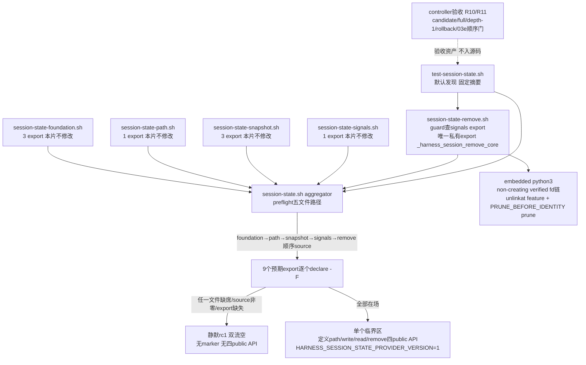

# 2026-09-03-03d-session-remove-prune 设计

## 概述

只新增四个文件：source-inert 的私有 remove 模块、thin 组合的最终 aggregator、默认发现集成测试与独占 coverage fragment。remove 交付 `_harness_session_remove_core <project-id> <session-id>`：non-creating verified 删除 feature 规则文件后，以 held parent/child fd identity 核对（`PRUNE_BEFORE_IDENTITY`）自底向上 prune 安全的空 session/project/root；aggregator 先验五模块文件路径、按 foundation→path→snapshot→signals→remove 唯一顺序 source、逐个点名 9 个预期 export，全部在场才在单个临界区内定义四个状态 public API 并设置 `HARNESS_SESSION_STATE_PROVIDER_VERSION=1`，任一缺失静默 rc1、双流空、partial capability 物理不可能。

- 选择“remove 自带 embedded python3 的 non-creating verified fd 链，不复用 `_harness_session_path_core`”，因为 path core 对 root/project/session 缺失层级一律执行 fresh mkdir（creating），仅 physical parent/base 缺失经 strict resolve fail closed 映射 unsafe/rc2，而 R3/R4 要求 non-creating 且目标缺失幂等 0，两者语义不可调和；root 选择与 verified open 的安全判据（physical parent、nofollow dir fd、EUID、0700、before/fstat/after identity）逐条沿用 path/snapshot 同源词汇，非新造机制。放弃“先调 path core 拿路径再删”（creating，违反 R3 的 non-creating）与“纯 bash 实现”（bash 无 dir_fd 相对的 unlinkat/rmdir/fstat 原语；foundation/path/snapshot 均以 embedded python3 为先例，remove 除 python3 外零外部命令，不需要 snapshot 的 mktemp/rm）。
- 选择“prune 用 `os.rmdir(name, dir_fd=parent_fd)`，每层执行 `PRUNE_BEFORE_IDENTITY`（held child fd 的 fstat 与 parent fd 下 name 重取 stat 的 dev/inode/type 三方核对）后自底向上 session→project→root，ENOENT/ENOTEMPTY 即幂等成功停止，EIO 及其他 OS 错归 rc1”，因为 DECISIONS 2026-09-01 03 design review B1 已裁定 Linux 无法把 rmdir 原子绑定到已持有 inode，最终检查前的确定性替换必须 fail closed（rc2），检查后窗口不承诺保护；实测（mktemp 内 python3）确认 dir_fd 相对 rmdir、ENOTEMPTY/ENOENT 语义与 identity 核对全部如预期。放弃“rename-away 再删”与递归删除（会删他项，违反 R4），也放弃更强宣称（B1 已判不可实现）。
- 选择“aggregator 的全部检查（五文件路径存在且可读→按唯一顺序逐个 source 并核 rc0→9 个 export 逐个 `declare -F`）完成后，才进入一个纯函数定义+marker 赋值的临界区”，因为每个模块的 source guard 都以前序模块 export 为激活条件，source 顺序只有这一条能全部激活；临界区内只有不可能失败的函数定义语句，故不存在“定义了部分 API”的执行路径，partial capability 物理不可能而非测试凑出来的。放弃边 source 边定义（中间态暴露 partial API）与只验文件存在或只验 marker（source 非零、guard inert 造成 export 缺失时会假阳性发布）。

## 需求映射

| 组件 | 实现的需求 |
|---|---|
| remove source guard 与 inert 契约 | R1, R2 |
| remove core（non-creating verified remove + PRUNE_BEFORE_IDENTITY prune） | R3, R4 |
| aggregator preflight/source/export guard | R5, R6 |
| aggregator thin 发布面与 marker | R7 |
| 默认发现测试 `tests/test-session-state.sh` | R8 |
| 独占 coverage fragment `tests/coverage.d/03d-session-state.md` | R9 |
| controller 验收（candidate/full/depth-1/offline/manifest/exact4） | R10 |
| controller 独立回滚与 03e 顺序门 | R11 |

## 架构



分层与边界：本片处于 03→03a→03b→03c 私有模块链的末端，是把五个已验收模块组合为 `session-state-provider-v1` 的唯一发布点；03e/08 consumer 只认 marker+五 API 的合取，任一 missing-module 状态走 legacy。技术栈沿用既有链且不加新下限：Bash 4.4+（`declare -F`、关联数组均不需要）、Linux + Python 3.8+（`dir_fd` 相对 `os.unlink`/`os.rmdir`/`os.stat(follow_symlinks=False)`/`os.fstat`，与 path/snapshot 同一 syscall 族）；aggregator 与 remove 的 bash 层只用内建，remove 的唯一外部进程是 embedded python3（同 03/03a/03b 先例），不引入 mktemp/rm/setsid。生产模块不读取任何测试环境变量；`PRUNE_BEFORE_IDENTITY` 与 OS 错注入点是生产文本中的 exact-once 无副作用 `pass  # ...` checkpoint（03a/03b anchor 先例），注入只发生在测试的 provider 副本上。

## 组件与接口

### remove source guard 与 inert 契约

- 职责：source 时 `declare -F _harness_session_write_with_signals` 单一检查；缺席则整段 guard 不成立，source 静默返回 0、双流空，不定义 remove export、四个状态 public API 与 `HARNESS_SESSION_STATE_PROVIDER_VERSION`，不读写文件、不覆写依赖。
- 对外接口：无（guard 是模块顶层结构，非函数）；inert 时 export inventory 与 source 前逐字一致。active 时恰好新增唯一私有 export，不多不少。
- 依赖：03c signals 模块已 source 后的函数表；缺席场景下零依赖。

### remove core（non-creating verified remove + prune）

- 职责：校验两个 ID 为安全单组件后，以 non-creating verified fd 链定位 session 目录，verified 删除 feature 规则文件，再以 held parent/child fd identity 核对自底向上 prune 安全的空 session/project/root 层级。
- 对外接口（私有 export，与 frontmatter 产出逐字一致的名字与参数表）：`_harness_session_remove_core <project-id> <session-id>`；rc 契约：成功或目标缺失 0、普通 OS 错（含 remove 路径真实 EIO）1、协议/安全错 2；不存在 rc3 分支；stdout 恒空；stderr 精确为 rc1 `error: session state operation failed\n`、rc2 `error: unsafe session state\n`（03 round 2 错误表）。
- 内部结构（bash 包装 + embedded python3，唯一 export，不新增辅助函数）：bash 层做 exact arity 与 `_harness_component_is_safe` 双 ID 校验（失败 rc2 + 固定 stderr）、`umask 077` 后 heredoc python3；python 侧复刻 path 同源 root 选择（`HARNESS_STATE_ROOT` exact 且拒 `/`、否则 `XDG_RUNTIME_DIR`/非空 `TMPDIR`/`/tmp` 拼 `aosp-harness-<euid>`，physical parent 必须 strict resolve 存在），随后 non-creating 打开 root/project/session 链——每层 `stat(name, dir_fd, follow_symlinks=False)`→拒绝非目录/链接→`open(O_RDONLY|O_DIRECTORY|O_NOFOLLOW|O_CLOEXEC)`+`fstat`→`after stat`，三方 dev/inode/type 一致且 EUID/0700 校验通过才继续；任一层 ENOENT 直接幂等 0（不创建、不报错），链接/非目录/owner/mode/identity 不符 rc2。feature 删除：`stat("feature", dir_fd=session_fd, follow_symlinks=False)` 验 regular/EUID/0600/nlink1 后 `os.unlink("feature", dir_fd=session_fd)`；ENOENT 幂等继续 prune，unsafe 对象 rc2 且不删。prune 循环：对 (project_fd, session_fd, session)、(root_fd, project_fd, project)、(parent_fd, root_fd, root_leaf) 三步，每步在 `PRUNE_BEFORE_IDENTITY` checkpoint 后重取 `stat(name, dir_fd=parent_fd, follow_symlinks=False)` 并与 held child fd 的 `fstat` 核 dev/inode/type，一致才 `os.rmdir(name, dir_fd=parent_fd)`；ENOENT/ENOTEMPTY 视为幂等成功并停止继续向上，identity 不符 rc2，EIO 及其他 OSError rc1；永不触碰 physical parent 本身，finally 逆序关闭全部 fd。
- 依赖：`_harness_component_is_safe`（经 foundation 公开面已在场）与 DECISIONS B1 收窄；不调用 `_harness_session_path_core`（creating 语义不合）。

### aggregator preflight/source/export guard

- 职责：先验证五个模块文件路径（`common/.harness/lib/` 下 foundation/path/snapshot/signals/remove 五文件均 `[[ -f && -r ]]`，路径常量由 `BASH_SOURCE` 定位），再按 foundation→path→snapshot→signals→remove 顺序逐个 source 并核 rc0，随后逐个点名核对 9 个预期 export：`harness_validate_feature_name`、`_harness_session_state_run`、`_harness_session_state_foundation_path`、`_harness_session_path_core`、`_harness_session_snapshot_worker`、`_harness_session_snapshot_write_core`、`_harness_session_snapshot_read_core`、`_harness_session_write_with_signals`、`_harness_session_remove_core`（均 `declare -F`）。
- 对外接口：无；任一文件缺席/不可读、source 非零或 export 缺失时 `return 1 2>/dev/null || exit 1`，静默、双流空，不设置 marker、不定义四个状态 public API（此时 foundation 的 `harness_validate_feature_name` 可能已单独存在，但不代表完整 capability）。
- 依赖：五个模块文件的物理在场与其各自 source guard 语义；source 顺序唯一是因为每个模块 guard 以前序 export 为激活条件，其他任何顺序必然留下 inert 模块并被 export 点名检查抓住。

### aggregator thin 发布面与 marker

- 职责：全部检查通过后，在单个临界区内定义四个转接函数并设置 marker；不复制任何模块内部逻辑。
- 对外接口（产出，与 frontmatter 逐字一致）：`session-state-provider-v1 —— common/.harness/lib/session-state.sh aggregator在foundation/path/snapshot/signals/remove五模块及预期export完整时设置HARNESS_SESSION_STATE_PROVIDER_VERSION=1并发布完整五public API（harness_validate_feature_name <name>；harness_session_state_path <project-id> <session-id>；harness_session_state_write <project-id> <session-id> <feature>；harness_session_state_read <project-id> <session-id>；harness_session_state_remove <project-id> <session-id>；成功0、OS错1、协议/安全错2、write异值冲突与read缺失3、remove缺失幂等0、write信号129|130|143）plus tests/test-session-state.sh固定摘要`RESULT PASS  session state`与独占tests/coverage.d/03d-session-state.md fragment`
- 精确调用：`harness_session_state_path` 转接 `_harness_session_path_core "$@"`；`harness_session_state_write` 转接 `_harness_session_write_with_signals "$@"`；`harness_session_state_read` 转接 `_harness_session_snapshot_read_core "$@"`；`harness_session_state_remove` 转接 `_harness_session_remove_core "$@"`；四函数体各仅一行转接，rc/双流契约原样沿用被转接方。`harness_validate_feature_name <name>` 不由 aggregator 重定义，继续由 foundation 单独提供。
- 依赖：guard 组件的全部肯定结论；临界区内只有函数定义与 `HARNESS_SESSION_STATE_PROVIDER_VERSION=1` 赋值，无任何可失败语句。

### 消费契约（03c 及前序，本片只读）

- 消费接口（与 frontmatter 逐字一致）：`session-signals-facade-v1的唯一私有export _harness_session_write_with_signals <project-id> <session-id> <feature>（常规沿用snapshot write的0|1|2|3双流空，HUP/INT/TERM恰129|130|143）；session-foundation-v1、session-path-delivery-v1、session-snapshot-core-v2的既有public/private export（harness_validate_feature_name、_harness_session_state_run、_harness_session_state_foundation_path、_harness_session_path_core、_harness_session_snapshot_worker、_harness_session_snapshot_write_core、_harness_session_snapshot_read_core，供aggregator thin转接）；03c accepted ledger中的03d启动门（dependency-present active证据、exact2/400、full/depth-1/rollback与顺序门证据，无其他运行时API）`
- 依赖：上游九 tracked 文件与 03c accepted ledger；本片不修改它们，不新增信号契约。

### 默认发现测试

- 职责：实现 `bash ./tests/test-session-state.sh` 的 CLI 分流、remove 矩阵、aggregator 发布面、六类 inert fixture 与固定摘要。
- 对外接口：无参数或 `all` 自动 active/inert 分流；唯一 `--dependency-absent` 强制 inert；唯一 `--session-provider-fixture <missing-foundation|missing-path|missing-snapshot|missing-signals|missing-remove>` 复现对应 missing-module inert surface；成功 stdout 逐字 `RESULT PASS  session state\n`、stderr 空、rc0；unknown 参数、extra 参数、flag 带值均 rc1 且不打印 PASS。
- 依赖：本片 remove 模块与 aggregator、上游四模块、固定 shfmt `v3.14.0`/ShellCheck `0.11.0`，以及 `bash/python3/rg/find/stat/sha256sum/mktemp/git`。

### 独占 coverage fragment

- 职责：`tests/coverage.d/03d-session-state.md` 登记本片 session-state capability 的需求到测试映射（R1–R9 到测试用例区段的表），为 03d 独占；不修改 02 的 `tests/COVERAGE.md`。
- 对外接口：无运行时接口；纯文档资产，进入 exact4 文件清单与 numstat 预算。

### controller 验收与 03e 顺序门（验收资产，不进入源码文件）

- 职责：执行 R10/R11 的机器核对，全部证据入 ledger 后才允许创建 03e 的任何资产。
- 验收动作：candidate、完整历史 checkout、真实 `git clone --depth 1 file://...` 分别运行默认 session-state 测试与 `bash ./scripts/check.sh --offline`，offline 发现本入口恰好一次，depth-1 commit-count=1 且 shallow marker 非空；每个 checkout 的上游九 tracked 文件 SHA-256 测试前后不变且 clean；逐字验证 shfmt `v3.14.0` 与 ShellCheck version field `0.11.0` 后只对本片 exact 四文件中三个 shell 文件运行 `shfmt -d -i 2 -ci -bn`、`shellcheck -x --severity=warning`、`bash -n`；execution BASE 到 accepted HEAD exact 只新增本片四文件、numstat 总和 ≤400、六列 review manifest 与 tasks 一一对应、首尾/相邻连续、reviewer 非空且全 PASS、`git diff --check` 与 worktree clean 通过；从 accepted HEAD 建隔离临时分支提交 exact 只删除本片四文件的 rollback commit，clean checkout 中 03b 基础测试、03b1 assurance 入口、03c signals 入口与 offline 全绿、本入口发现 0 次；03e 的 spec 目录/分支/worktree/ledger BASE 或 dispatch 记录按 R11 以 `ls -d` 缺席、`git show-ref` 零匹配、`git worktree list --porcelain` 零匹配与 `rg` 零匹配机械查缺席（requirements/design/tasks 文档允许出现 NEXT 全名，禁令只针对 ledger/dispatch/execution-base 三类记录）。
- 依赖：本片 accepted HEAD、dependency-present active 证据、exact4/400 与全 PASS manifest 入 ledger；inert PASS 不作为本片验收证据，也不解除该顺序门。

## 数据模型

不新增 schema 或跨进程数据库。本片只在既有 session 状态树上执行删除转换，对象安全属性全部沿用 path/snapshot 判据：

| 对象 | 位置/生命周期 | 安全属性（删除前 verified） | 本片允许的转换 |
|---|---|---|---|
| feature 规则文件 | session 目录内固定 leaf `feature` | regular、current-EUID、0600、nlink1、nofollow stat 与 identity 一致 | present → absent（unlinkat）；missing 幂等 0 |
| session 目录 | project 下安全单组件 | directory、current-EUID、0700、held fd 与 name re-stat dev/inode/type 一致（`PRUNE_BEFORE_IDENTITY`） | 空 → absent（rmdir）；非空/缺失幂等停止 |
| project 目录 | root 下安全单组件 | 同上 | 同上 |
| root 目录 | physical parent 下 `aosp-harness-<euid>` 或 HARNESS 根 leaf | 同上 | 同上；physical parent 本身永不删除 |

状态转换不变量：任何转换只删除经 identity 核对的空目录或 verified feature 文件；并发写入者留下的非空目录使 prune 停止且保持 rc0；不存在“删除非空目录/其他条目”的转换；检查前被替换（identity 不符）一律 fail closed rc2 且不执行该层 rmdir。

## 数据流

### feature 存在时的 remove + 全层 prune（happy path）

```mermaid
sequenceDiagram
  participant C as 调用方
  participant B as remove bash包装
  participant Y as embedded python3
  participant D as held fd链(parent/root/project/session)
  C->>B: _harness_session_remove_core p s
  B->>B: exact arity + 双ID安全单组件校验(失败rc2)
  B->>Y: umask 077; heredoc python3 p s
  Y->>D: root选择; non-creating verified打开三层(ENOENT幂等0)
  Y->>D: stat feature 验regular/EUID/0600/nlink1
  Y->>D: unlinkat feature(ENOENT幂等继续)
  loop session → project → root
    Y->>Y: PRUNE_BEFORE_IDENTITY: name re-stat vs held child fstat(dev/inode/type)
    alt identity一致
      Y->>D: os.rmdir(name, dir_fd=parent_fd)
    else identity不符
      Y-->>C: rc2 + error: unsafe session state(不执行该层rmdir)
    end
  end
  Y-->>B: 0(全部prune或ENOENT/ENOTEMPTY停止)
  B-->>C: rc0; stdout恒空; stderr空
```

### feature 缺失幂等与并发非空停止

```mermaid
sequenceDiagram
  participant C as 调用方
  participant Y as embedded python3
  participant D as held fd链
  participant W as 并发写入者
  C->>Y: remove p s(feature本不存在)
  Y->>D: verified链在场; stat feature -> ENOENT(幂等 继续prune)
  Y->>D: PRUNE_BEFORE_IDENTITY通过; rmdir session 成功
  W->>D: 在project下创建其他session条目
  Y->>D: PRUNE_BEFORE_IDENTITY通过; rmdir project -> ENOTEMPTY
  Y-->>C: rc0; 他项零删除; 不再向上尝试root
  Note over Y,D: ENOENT同样幂等停止; 两层级结果namespace inventory前后只差被删的空目录
```

### aggregator 组合与 fail-closed

```mermaid
sequenceDiagram
  participant S as consumer shell
  participant A as session-state.sh
  participant M as 五模块文件
  S->>A: source aggregator
  A->>M: preflight: 五文件 [[ -f && -r ]]
  A->>M: 按foundation→path→snapshot→signals→remove顺序source 逐个核rc0
  A->>A: 9个预期export逐个declare -F
  alt 任一文件缺席/source非零/export缺失
    A-->>S: return 1; 双流空; marker未设置; 四public API未定义(validate可单独存在)
  else 全部在场
    A->>A: 临界区: 定义path/write/read/remove四转接 + marker=1
    A-->>S: return 0; 完整五API与marker同生同灭
  end
```

## 错误处理

| 错误场景 | 恢复策略 | 校验位置 | 日志 | 用户可见 |
|---|---|---|---|---|
| source remove 时 signals export 缺席 | 静默 inert，不定义 remove/public surface/marker | remove source guard | 无 | source rc0、双流空 |
| remove arity 错或 ID 非安全单组件 | 拒绝，零文件副作用 | bash 包装入口 | 无 | rc2、`error: unsafe session state\n` |
| root 选择危险/parent 缺失 | fail closed，不创建 | python root selector | 无 | rc2、固定 stderr |
| 链上任一层 ENOENT | 目标缺失幂等，不创建不报错 | non-creating open | 无 | rc0、双流空 |
| 链上链接/非目录/wrong owner/mode/identity | 不继续、不删攻击对象 | 三层 verified open | 无 | rc2、固定 stderr |
| feature 缺失但目录安全 | 幂等并继续 prune 空层级 | feature stat ENOENT | 无 | rc0、双流空 |
| feature 为 unsafe 对象 | 不删，fail closed | feature stat verify | 无 | rc2、固定 stderr |
| PRUNE_BEFORE_IDENTITY 核对不符 | 不执行该层 rmdir，fail closed | prune 每层 checkpoint | 无 | rc2、固定 stderr |
| prune 遇 ENOENT/ENOTEMPTY（含并发非空） | 幂等成功并停止向上，不删他项 | rmdir errno 分类 | 无 | rc0、双流空 |
| 真实 EIO 或其他 OSError | 关闭已持有 fd，映射普通 OS 错 | unlinkat/rmdir/stat 异常映射 | 无 | rc1、`error: session state operation failed\n` |
| aggregator 五文件任一缺席/不可读 | 不 source，静默失败 | preflight 路径检查 | 无 | rc1、双流空 |
| 任一模块 source 非零或 9 export 缺一 | 不进入临界区，missing-module 走 legacy | source rc 与 `declare -F` 点名 | 无 | rc1、双流空、marker/API 缺席 |
| CLI unknown/extra/flag 带值 | 拒绝且不进入任何分支 | 测试入口参数解析 | 无 | rc1、无 PASS |
| 真实依赖缺席或 `--dependency-absent` | 与隔离 fixture 同一零 active case inert surface | 测试入口依赖探测 | 无 | 固定摘要、rc0 |
| 任一 case 失败 | 累计 failures，末行不打印 PASS | 统一 check/failures 计数器 | 失败详情到 stderr | rc1、无 PASS |

## 测试策略

| 层 | 测什么 | 用什么工具 |
|---|---|---|
| 单元/结构 | CLI 四态（无参数/all 接受，unknown/extra/flag 带值 rc1 无 PASS）；remove 模块 source 功能 fixture（signals export 在场）rc0、双流空、export inventory 恰好新增 `_harness_session_remove_core` 一名；signals export 缺席 fixture 逐字比较 rc/双流、export inventory、四 public API 与 marker 全缺席；`PRUNE_BEFORE_IDENTITY` 与 OS 错注入 anchor 各 exact-once；aggregator 生产文本 rg 证明无模块内部逻辑副本（无 root selector/rmdir/renameat2/heredoc python 片段）、四转接函数体各仅一行；测试前后上游九 tracked 文件 SHA-256 不变 | `bash` 隔离 shell、`declare`、`export -p`、`rg`、`sha256sum`、`mktemp` |
| 集成（remove 矩阵 + aggregator 发布面，本片主体） | remove：feature 存在删除并自底向上 prune 空 session/project/root（namespace inventory 前后比较只差被删空目录）；feature 缺失幂等 0 且安全目录存在时仍 prune 空层级；并发非空目录仍成功且不删他项（前后完整 namespace inventory 逐字比较）；rc 表逐字——合法 0/双流空、unsafe ID 与 unsafe 对象 rc2 固定 stderr、provider 副本在 OS 错 anchor 注入 EIO 得 rc1 固定 stderr、不存在 rc3 分支（rg 证明生产文本无 rc3 映射）；`PRUNE_BEFORE_IDENTITY` 攻击行：provider 副本在 checkpoint 处把待 prune 空目录换入同名新空目录，必须 rc2 且新旧目录均保留。aggregator：五 public API 逐个 `declare -F` 存在、marker 精确为 `1`、四个转接行为等价（path 成功 path+LF/0、write/read/remove 各取一例透传 rc/双流）、validate 由 foundation 提供 | `bash ./tests/test-session-state.sh`（主验证命令）、python3 注入、`find/stat/sha256sum/mktemp` |
| inert fixture（六类） | `--session-provider-fixture` 五值：mktemp 内复制 lib 树并移除对应模块文件，source 其中 aggregator 必须 rc1、双流空、marker 未设置、完整五 API predicate 为 false，且预置的同名家哨兵函数不被当作 capability（consumer 忽略任何已加载前序函数）；aggregator 缺席 fixture（本片自愿加严，PLAN.md:221 将该覆盖划给 03e/08）：lib 树无 `session-state.sh`，source 尝试返回非零、marker 未设置、五 API predicate 为 false，不断言双流空；真实依赖缺席时默认/all 与 `--dependency-absent` 运行同一零 active case inert surface、同一固定摘要 | 同上入口 + `--dependency-absent` / `--session-provider-fixture`、隔离 fixture shell |
| mutant 自反证（红证据） | 需要，双 mutant，与 03c 同构：(a) 删除 `PRUNE_BEFORE_IDENTITY` 核对的 mutant 在换入攻击行必须 rc1/无 PASS（换入目录被误删或 rc 不符即被抓）；(b) feature 缺失时不 prune 的 mutant 在幂等 prune 行必须 rc1/无 PASS（空层级残留 oracle FAIL）。不另设 aggregator mutant：partial-capability 不可能性由临界区结构核对（rg 文本顺序）加六类 inert fixture 机械覆盖，mutant 不新增信息。红阶段证据文件以路径独占一行、零尾随字符格式记录（照 03c 报告契约） | provider 副本 mutant、`bash`、红证据记录 |
| 端到端/收敛（controller 验收资产） | candidate、完整历史 checkout、真实 `git clone --depth 1 file://...` 分别跑默认入口与 `bash ./scripts/check.sh --offline`，offline 发现本入口恰好一次，depth-1 commit-count=1 且 shallow marker 非空；上游九 tracked 文件 SHA-256 测试前后不变且 clean；隔离 rollback commit exact 只删本片四文件后 03b 基础测试、03b1 assurance 入口、03c signals 入口与 offline 全绿、本入口发现 0 次；03e 五类资产按 R11 机械查缺席 | `git clone --depth 1 file://...`、`git worktree/status/diff/show-ref`、`bash ./scripts/check.sh --offline`、`rg`、`ls -d` |
| 静态与 sizing | 固定版本断言后只对 exact 四文件中三个 shell 文件 `shfmt -d -i 2 -ci -bn`、`shellcheck -x --severity=warning`、`bash -n`；execution BASE..HEAD exact 只新增本片四文件、numstat 总和 ≤400；六列 manifest 机械验证；`git diff --check` 与 clean 通过 | shfmt `v3.14.0`、ShellCheck `0.11.0`、`bash -n`、Git/awk controller 命令 |
| 性能 | 不适用：本片不设吞吐/延迟 SLO；prune 为常数级三层 rmdir，`timeout` 仅作测试防挂死兜底，不冒充 benchmark | `timeout` |

测试必须将 stdout/stderr 落文件后按字节比较，禁止用会吞尾随 LF 的 command substitution 验证成功流；成功唯一摘要为 `RESULT PASS  session state\n`。只有 dependency-present active 证据计入本片验收并解除 03e 顺序门；inert PASS 不计入。

sizing 承诺：execution diff exact4 且 `git diff --numstat` 总和 ≤400。这是**纯分解预算**，无 runnable prototype；分解依据是同构实际尺寸（path 模块 114 行含 creating 分支，remove 去掉 mkdir/EEXIST 分支、加上 unlink+prune 循环；03c 模块 45 行为零 python 下限）。行数预算分解：`common/.harness/lib/session-state-remove.sh` ≤110 行（shebang/guard ~8、bash 包装 ~12、python root selector ~25、non-creating verified open ~22、feature unlink ~10、prune 循环+identity ~20、dispatch/异常映射 ~8、结构注释 ~5）；`common/.harness/lib/session-state.sh` ≤50 行（preflight ~10、五 source ~10、9 export 点名 ~12、临界区四转接+marker ~12、结构注释 ~6）；`tests/test-session-state.sh` ≤205 行（CLI 与引导 ~18、remove 矩阵 ~70、aggregator 发布面 ~30、六类 fixture 表驱动循环 ~35、helper ~25、SHA/结构核对 ~12、摘要 ~6、结构注释 ~9）；`tests/coverage.d/03d-session-state.md` ≤25 行；合计 ≤390，保留 ≥10 行余量。若 tasks 或执行期预计/实际超出，立即回 PLAN 拆片（备选：把 remove 动态攻击行拆为独立 assurance 片），不压缩任何 oracle 语义。

## 文件清单

| 文件 | 创建/修改 | 职责（一句话） |
|---|---|---|
| `common/.harness/lib/session-state-remove.sh` | 创建 | source-inert 的 remove 模块：signals export 单检查 guard 与唯一私有 export `_harness_session_remove_core`（non-creating verified remove + PRUNE_BEFORE_IDENTITY 自底向上 prune） |
| `common/.harness/lib/session-state.sh` | 创建 | 最终 aggregator：preflight 五文件、唯一顺序 source、点名 9 export，全部在场才在临界区发布四 public API 与 provider marker |
| `tests/test-session-state.sh` | 创建 | 默认发现的 shfmt-clean 入口：CLI 分流、remove 矩阵、aggregator 发布面、六类 inert fixture 与固定摘要 |
| `tests/coverage.d/03d-session-state.md` | 创建 | 03d 独占 coverage fragment：登记本片需求到测试映射，不触碰 `tests/COVERAGE.md` |

验收资产（不纳入源码文件清单）：红阶段证据（无 PRUNE_BEFORE_IDENTITY 核对 mutant 与 feature 缺失不 prune mutant 的 rc1/无 PASS 自反证记录，路径独占一行零尾随字符）、逐 task review 报告、六列 review manifest、candidate/full/depth-1/rollback 运行日志、accepted HEAD 与 ledger execution BASE 证据、03e 五类资产缺席的机械核对记录。门③通过前不创建 implementation worktree 或固定 execution BASE；dependency-present active 证据、exact4/400 与全 PASS manifest 入 ledger 前不创建 03e 的 spec 目录/分支/worktree/BASE/dispatch 记录。
