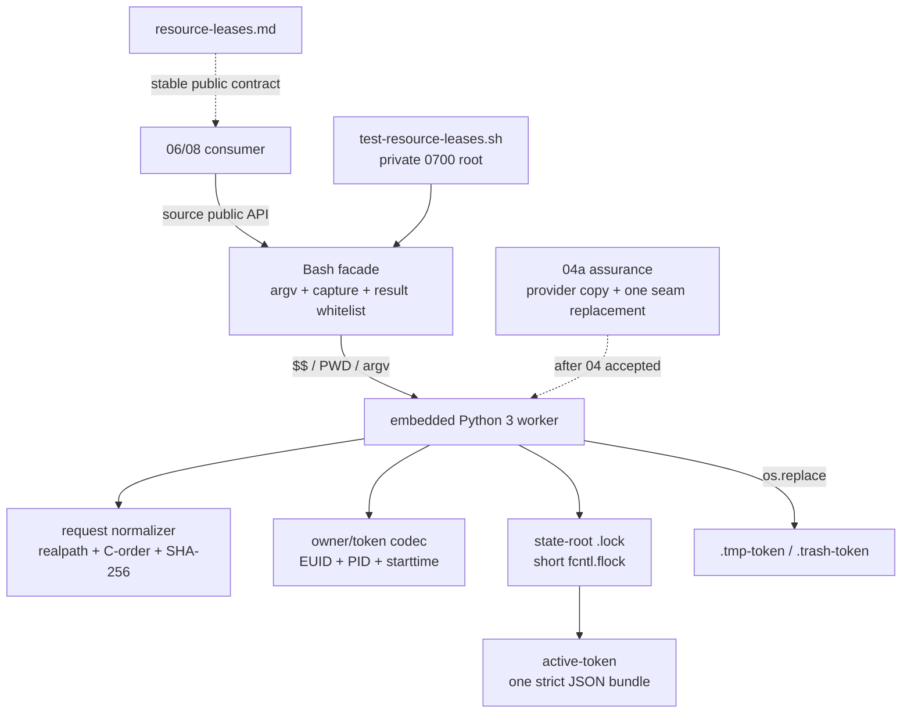

# 2026-09-04-04-runtime-resource-leases 设计

## 概述

在单个 Bash 库内以两个公开函数包装 embedded Python worker：facade 捕获并白名单验证 worker 的私有结果；worker 在 EUID 私有状态根内用短时 `flock` 串行化状态变更，以单个 active bundle record 的原子 rename 作 publish/unpublish 线性化点，持有期不持全局锁。

- 选择「捕获/校验结果的 Bash facade + 单文件 embedded Python 3 worker」，因为 Python 标准库直接提供 `fcntl.flock`、`time.monotonic`、`os.replace`、SHA-256、base64 与严格 JSON，Bash 又能把损坏 Python 的任意 rc/双流收敛到稳定 public 协议。放弃直接透传 worker（工具损坏会泄漏输出/退出码）与纯 Bash `mkdir` 多锁（组合回滚复杂）。
- 选择「一个 request 对应一个 bundle record，协调锁只在扫描/发布/撤销时持有」，因为单文件 rename 给出唯一 publish/unpublish 点，observer 只能看到完整 bundle 或看不到。放弃逐键长期锁（存在部分获取窗口）和持有期全局大锁（不相交资源也被串行）。
- 选择「owner=`EUID+$$+/proc starttime`、token绑定 owner/session/request-hash/nonce、生产文本唯一私有 no-op seam」，因为 command substitution 中 `$$` 不变且 starttime 可识别 PID 复用，04a 又能只复制 provider 并替换一个稳定 anchor。放弃 `BASHPID`/仅PID、未绑定元数据的随机 token，以及由环境直接激活生产 seam。

## 需求映射

| 组件 | 实现的需求 |
|---|---|
| Bash public facade 与 source surface | R1, R4, R5, R6 |
| request normalizer 与 owner/token codec | R2, R3, R4, R5, R6 |
| state root、coordination lock 与 bundle store | R3, R4, R5, R6, R7 |
| 唯一私有 no-op seam | R9 |
| `docs/resource-leases.md` | R8 |
| `tests/test-resource-leases.sh` | R1, R2, R3, R4, R5, R6, R7, R8, R9 |
| controller 静态/checkout/rollback/NEXT 门 | R10 |

## 架构



边界：facade 负责公开签名、Python 版本探针、私有 capture、结果 shape 白名单和固定 public 输出；worker 是唯一持久状态 owner，request/owner/token/store 都是内部实现。06/08 只依赖两个函数与协议文档，不解析 JSON、状态路径或 seam，并且必须再等待 04a dependency-present 证据。本片不 source session provider、不调用 ADB/CVD/build、不提供 adapter。

技术下限：Linux `/proc`、Bash 4.4+、Python 3.8+ 标准库。workspace 规范化用 Python 3.8 已支持的 `pathlib.Path.resolve(strict=True)`；非 Linux、旧 Python 或 `/proc` 不可安全读取时按 R5 rc2，不降级为 PID-only owner。

## 组件与接口

### 消费契约（frontmatter `消费`，逐字）

`scripts/check.sh --offline|--ci 的根测试自动发现约定：本片产出默认可执行的 tests/test-resource-leases.sh，由 gate 按 LC_ALL=C 字典序发现；成功时 scripts/check.sh --offline 退出 0 且 stdout 末行为 RESULT PASS  aosp-harness offline quality gate。本片不调用 check.sh 作为独立判据，也不修改 02 的 tests/COVERAGE.md。`

### 产出契约（frontmatter `产出`，逐字）

`resource-leases-v1 —— source common/.harness/lib/resource-leases.sh 后 declare 可见 harness_lease_acquire <session-id> <wait-seconds> <request-tsv> 与 harness_lease_release <lease-token>；request-tsv 为至少一行的普通文件，每行 domain<TAB>canonical_id<TAB>mode；workspace canonical_id 以调用时 PWD 解析后的 realpath 绝对路径为键，android canonical_id 为安全单组件 android-instance-id（不是 serial 或 CVD name）；任意不同逻辑 owner 对同一 domain+canonical_id 的任意合法 mode 都互斥；逻辑 owner 为 EUID+$$+进程起始标识，请求按 C locale 规范化后取 SHA-256；acquire 成功 stdout 唯一 token+LF、release 成功双流空；两者 0 成功、2 协议/所有者/状态或 I/O 错、3 占用/超时；配套完整协议 docs/resource-leases.md 与 tests/test-resource-leases.sh 固定摘要 RESULT PASS  resource leases`

### Bash public facade

- 职责：source 时只新增 `harness_lease_acquire`、`harness_lease_release` 两个 `harness_*` public function；校验 argv 与 Python>=3.8，用 `mktemp -d` 文件捕获 worker 双流/rc，并在写入前验证 capture 是绝对路径、匹配本次模板长度/前缀、EUID 自有、0700、空且非软链的真目录。acquire rc0 只用 Bash builtin 一次读取完整 capture，拒绝 NUL 并接受 stderr空与32-byte lower-hex token+LF（不调用外部 `wc`），release rc0只接受双流空；只有 acquire 可接受 worker rc3，其他 rc/shape 一律转 public rc2。`mktemp`/`rm`/`rmdir` 的私有诊断均静默，清理只点名删除 capture 内的 `out`/`err` 再 `rmdir`，不递归删除 helper 返回路径；失败统一转固定 public rc2。worker 已 publish 后的任意 facade 校验或清理失败，按已捕获 token 调内部 release 撤销 active。
- 对外接口：`harness_lease_acquire <session-id> <wait-seconds> <request-tsv>`；`harness_lease_release <lease-token>`。
- 依赖：Bash `$$`、`python3`、`mktemp/rm/rmdir`。capture 清理后才输出；public token stdout 写失败时，以同 owner 内部 release 回收刚发布 bundle 再返回 rc2。worker 在状态变更前 `fstat` fd1/2，关闭输出通道时不得 publish；facade 在打开可消失的 capture 路径前先重定向 stderr，shell 自身诊断也不得泄漏。

### request normalizer 与 owner/token codec

- 职责：binary 读取普通 request 文件，验证非空/末LF/无空行CR NUL/恰三列/四组合法pair；新 request 的 workspace 以传入PWD做 strict realpath，拒绝结果中的控制字节，android验安全单组件；按domain+canonical-id的C字节序排序、拒绝重复key、重序列化并取SHA-256。stored request 不重新访问可能已消失的 workspace，而是要求其 workspace 字节为绝对、`normpath` 后逐字不变且非双斜杠起始，再重做 pair/排序/唯一性/逐字节 canonical/hash 校验；因此 `/ws/../ws`、`/ws/.`、重复斜杠等自洽伪记录仍 fail closed。owner从`/proc/<$$>/stat`最后`)`之后取field22 starttime；token是规范JSON `[owner,session,hash,nonce]` 的SHA-256前32hex。
- 对外接口：无；内部值为 `(canonical-bytes, request-hash, key-set)` 与 `[EUID,PID,starttime]`。
- 依赖：Python filesystem `surrogateescape`、procfs、`secrets.token_hex(16)`、SHA-256；canonical bytes 不经过 shell 文本变量。

### state root、bundle store 与协调状态机

- 职责：状态根取非空 `HARNESS_RESOURCE_LEASE_ROOT`，否则 `${XDG_RUNTIME_DIR:-/tmp}/aosp-harness-resource-leases-$EUID`；仅接受绝对、非软链、EUID自有0700真目录。`.lock` 用 `O_NOFOLLOW` 打开并验regular/EUID/0600。每次持短 exclusive flock：先严格恢复合法 tombstone、解析全部active并拒绝全局key重叠，再清 stale，最后执行重入/冲突/publish 或 release/unpublish。
- 对外接口：沿用两个 public function 的 `0|2|3` 和固定双流；状态目录不是 API。
- 依赖：单个 `.tmp-* -> active-<token>` rename 是 bundle publish；`active-* -> .trash-*` rename 是 unpublish，随后 unlink。wait用`time.monotonic()` deadline、每次释放flock后最多sleep 50ms，并在deadline到达时做最后一次无sleep尝试。

### 04a 私有测试 seam

- 职责：embedded Python 保留恰一处 `HARNESS_RESOURCE_LEASE_TEST_SEAM` anchor 与默认只返回原值的 `test_seam(point, value=None)`。生产 provider 不读取 fault 环境变量。04a 在临时副本中逐字替换 anchor+默认函数，为root/lock/clock/publish/unpublish/cleanup注入确定性返回值或I/O错。
- 对外接口：无；不属于`resource-leases-v1`，06/08不可调用或探测。
- 依赖：04a先断言anchor恰一处；provider缺席时inert PASS，存在但类型/anchor/source/API/协议损坏时fail closed。

### 协议文档、基础测试与 controller

- 职责：`docs/resource-leases.md` 独立记载 R8 public contract；`tests/test-resource-leases.sh` 交付 R9 代表性基础合同，完整主动反证不塞回本片；controller 执行 R10 固定工具、candidate/full/depth-1/offline/rollback 与04a五类NEXT缺席门。
- 对外接口：`bash ./tests/test-resource-leases.sh`；成功 stdout逐字`RESULT PASS  resource leases\n`、stderr空、rc0。
- 依赖：Bash/Python/Git/coreutils，固定 shfmt `v3.14.0`、ShellCheck version field `0.11.0`。

## 数据模型

active bundle 是 ASCII JSON regular file，schema 严格恰七键，多/少/重复键均 rc2：

| 键 | 形状 | 不变量 |
|---|---|---|
| `version` | integer `1` | bool或其他值拒绝 |
| `token` | 32 lower-hex | 等于`sha256(JSON([owner,session,hash,nonce]))[:32]`且文件名匹配 |
| `nonce` | 32 lower-hex | 每次新publish生成 |
| `owner` | `[EUID, PID, starttime]` | 精确类型/范围；EUID匹配；PID/starttime判live/stale |
| `session` | 安全单组件字符串 | release与token重算均使用 |
| `request` | canonical bytes的strict base64 | 解码后恰三列+LF、合法pair、排序唯一且重序列化相等 |
| `hash` | 64 lower-hex | 等于decoded request的SHA-256 |

状态转移：`absent -> .tmp -> active` 只在参数和全局状态验证完成且无冲突时发生；`.tmp -> active` 是publish。`active -> .trash -> absent` 只在完整绑定验证或owner可靠判stale后发生；`active -> .trash` 是unpublish。unpublish后unlink失败返回2，租约已逻辑失效；下次受锁操作先严格验证并重试清理 tombstone。未发布temp清理失败仍不被识别为active。

## 数据流

### acquire 与 public 结果收敛

```mermaid
sequenceDiagram
  participant C as caller
  participant F as Bash facade
  participant W as Python worker
  participant L as short flock
  participant S as bundle store
  C->>F: acquire(session,wait,request)
  F->>W: capture acquire($$,PWD,argv)
  W->>W: normalize; owner; deadline
  W->>L: exclusive lock
  W->>S: recover tombstone; strict scan; stale cleanup
  alt exact owner/session/hash reentry
    S-->>W: existing token / 0
  else same-owner overlap
    S-->>W: operation failure / 2
  else other live-owner overlap
    W->>L: unlock; bounded retry or 3
  else free
    W->>S: fsync temp; rename active (publish)
    S-->>W: new token / 0
  end
  W-->>F: captured rc/stdout/stderr
  F->>F: whitelist shape; cleanup capture
  F-->>C: canonical public result
```

### release、stale 与 tombstone

```mermaid
sequenceDiagram
  participant C as caller
  participant W as worker under flock
  participant S as bundle store
  C->>W: release($$, token)
  W->>S: strict scan all active
  W->>W: recompute request hash/token; compare owner
  alt missing/corrupt/foreign
    W-->>C: fixed rc2; active unchanged
  else valid release or proven stale
    W->>S: active -> trash (unpublish whole bundle)
    W->>S: unlink tombstone
    alt unlink fails
      W-->>C: rc2; logically inactive tombstone retained
    else cleaned
      W-->>C: release empty/0 or stale cleanup continues
    end
  end
```

## 错误处理

| 错误场景 | 恢复策略 | 校验位置 | 日志 | 用户可见 |
|---|---|---|---|---|
| argv/session/wait/request/domain-mode/realpath/control-byte非法 | publish前终止 | facade + normalizer | 无 | rc2，stdout空，stderr固定operation-failed |
| Python/procfs/clock/root/lock/I/O不可安全使用 | fail closed，不做降级 | facade/owner/store | 无 | 同上 |
| worker任意rc/双流/shape不符合action白名单 | 丢弃私有输出 | facade capture validator | 无 | rc2固定双流，不透传worker字节/rc |
| `mktemp`失败/伪成功、capture 路径消失或 `rm/rmdir` 失败 | 写入前拒绝不匹配模板/owner/mode/空目录约束的返回路径；静默helper与shell输出；若worker已publish则按捕获token内部release，状态根不得留active | facade capture lifecycle | 无 | rc2固定双流；不可用的`rm`可留下状态根外私有capture诊断残留 |
| root或lock相对/软链/非regular/异owner/错误mode | 不扫描或改写状态 | root preflight | 无 | rc2固定双流 |
| active JSON/schema/base64/hash/token/owner/filename/global overlap损坏 | 全局fail closed，不当作stale | locked scan | 无 | rc2固定双流 |
| 同owner非完整重入 | 立即拒绝，不等待自己 | conflict matrix | 无 | rc2固定双流 |
| 异owner存活且key相交 | 放短锁后轮询至deadline | conflict matrix | 无 | 耗尽rc3，stderr固定unavailable |
| stale/PID reuse | 完整验证后整体unpublish再获取 | procfs + store | 无 | cleanup失败rc2，否则对调用方透明 |
| temp write/fsync/publish replace失败 | best-effort清未发布temp，永不当active | publish path | 无 | rc2固定双流 |
| publish后public token写失败 | 同owner内部release刚发布token | facade final output | 无 | rc2；不得留下active/tmp/trash |
| release unpublish replace失败 | 保留原active，不报告释放 | remove pre-linearization | 无 | rc2固定双流 |
| unpublish后unlink失败 | 保留已验证trash，下次锁操作重试 | cleanup path | 无 | rc2；租约已逻辑失效 |
| test unknown/extra/flag带值 | 矩阵前拒绝 | test CLI | 无 | rc1，无PASS摘要 |

## 测试策略

| 层 | 范围 | 工具/判据 |
|---|---|---|
| 04基础合同 | source后全部`harness_*`恰两API且marker缺席；33-byte token framing、逆序完整重入、换session self-overlap、异owner占用、不相交、死owner stale、空request、非法stored request、tombstone恢复、版本探针后恶意worker、完整顶层inventory allowlist；default/all/extra/library-absent | `tests/test-resource-leases.sh`、私有0700根、capture文件逐字比较；source/unknown/inventory-failure/framing四个定点mutant证明oracle非假绿 |
| 04a完整assurance（后序独占） | control/root、同owner子/超/部分重叠、反向bundle barrier、PID reuse、monotonic最终尝试、全record字段/filename/nonregular/global overlap/存量非规范workspace、flock/open/write/fsync/publish+unpublish replace/unlink、伪`python3`/`mktemp`/`rm`、closed output、双adapter与mutants | 本片`prototypes/assurance/tests/test-resource-leases-assurance.sh`仅作04a sizing证据；最终文件由04a创建，不纳入本片源码清单/验收 |
| 协议文档 | R8签名、schema、root、owner、hash、矩阵、等待/stale/release/错误表与实现常量对应 | `rg -F`结构核对 + 基础行为 |
| checkout/rollback | candidate/full/depth-1默认+offline发现恰1；rollback后03e/offline绿且本入口0；04a五类真实资产缺席 | Bash/Git、真实`git clone --depth 1 file://...`、隔离rollback branch |
| 静态/sizing | fixed shfmt/ShellCheck/bash-n；exact3 name-only与numstat≤400；manifest连续PASS；diff-check/clean | shfmt3.14.0、ShellCheck0.11.0、Git/awk |
| 性能 | 无吞吐SLO；只保证wait有界且不卡死 | monotonic deadline + 宽容outer timeout；精确并发时钟反证在04a |

public framing 一律落 capture 文件后按字节比较。基础测试最终先校验 `find` 成功，再检查完整顶层 allowlist：除可选持久 `.lock` 外不得存在任何已知或未知资产。

### Runnable fixed-format sizing prototype

本 spec 的 `prototypes/` 与终交付三路径同构：

| 原型文件 | fixed-shfmt 后行数 | 证明点 |
|---|---:|---|
| `prototypes/common/.harness/lib/resource-leases.sh` | 336 | facade收敛/输出回滚、normalizer、strict record/global overlap、owner/token、flock、publish/unpublish、wait/stale/tombstone与唯一no-op seam |
| `prototypes/docs/resource-leases.md` | 7 | 不反读requirements即可消费的完整public contract骨架 |
| `prototypes/tests/test-resource-leases.sh` | 57 | R9基础合同、framing、恶意worker、完整inventory与固定摘要 |
| **合计** | **400 / 400** | **exact3零余量；tasks机械复制同构blob，不临时扩机制** |

固定 shfmt逐字`v3.14.0`、ShellCheck version field `0.11.0`；两shell的shfmt diff无输出，ShellCheck warning级与bash-n均rc0；基础default/all逐字PASS，extra rc1无摘要；四个基础mutant均rc1且无PASS。

04a sizing原型`prototypes/assurance/tests/test-resource-leases-assurance.sh`为fixed-shfmt exact1=`398/400`，default/all/`--dependency-absent`逐字PASS、extra rc1；只替换唯一seam，并以overlap/unpublish/bundle/adapter四类mutant自反证。它是验收资产，不得复制进本片最终三文件。若任务落地使04核心超过400，必须回流PLAN，不从生产机制或R9基础oracle删行。

## 文件清单

| 文件 | 创建/修改 | 职责（一句话） |
|---|---|---|
| `common/.harness/lib/resource-leases.sh` | 创建 | 两个Bash public API与embedded worker，实现结果收敛、规范化、owner/token、bundle原子性、wait/stale/release |
| `docs/resource-leases.md` | 创建 | 让06/08无需反读内部spec即可消费的完整resource-leases-v1协议 |
| `tests/test-resource-leases.sh` | 创建 | 默认发现的代表性基础合同、public framing/worker收敛/inventory oracle与固定PASS摘要 |

验收资产（不纳入源码文件清单）：门③core三文件与04a单文件sizing prototypes、固定工具/运行/mutant日志；逐task red/green/review证据、六列review manifest、candidate/full/depth-1/offline/rollback/04a NEXT缺席门日志、accepted HEAD/execution BASE记录。
