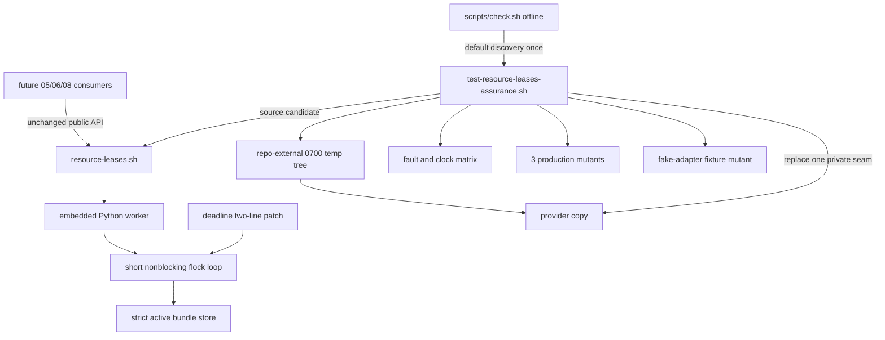
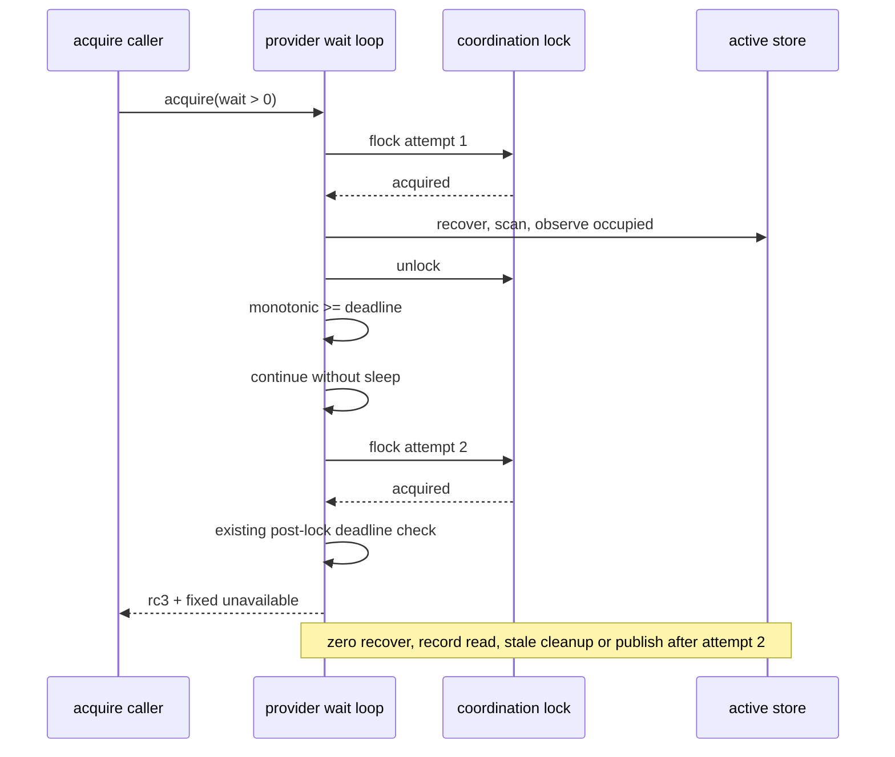
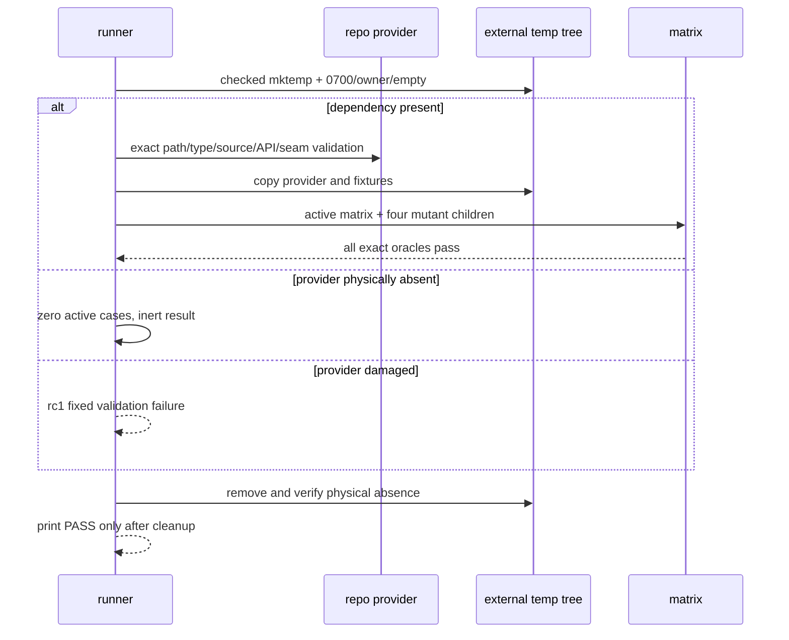

# 2026-09-04-04a-runtime-resource-lease-assurance 设计

## 概述

以一个相邻控制流修复和一个默认发现的 Bash assurance 入口交付 `resource-lease-assurance-v1`：provider 在扫描后首次发现 deadline 到达时进入最后一轮无 sleep 锁尝试；assurance 在 repo 外临时树内用唯一 seam、真实并发和语义 mutant 穷举租约安全边界。

- 选择只替换 provider deadline 分支的相邻两行，因为既有锁后 deadline 检查已经位于 tombstone 恢复、active record 读取和 publish 之前；让扫描后到期路径 `continue` 即可复用该检查。放弃新增状态、重写等待循环或新公开 API，因为它们扩大已验收 04 的行为面。
- 选择单个 396 行、顶层默认发现的 assurance 脚本，内部复制 provider 并只替换唯一 `HARNESS_RESOURCE_LEASE_TEST_SEAM`，因为故障矩阵必须确定、可离线运行且不能修改 tracked 文件。放弃把矩阵塞回 04 基础测试、直接修改生产 provider 注入故障或拆成额外 helper，避免越过 exact2/400 和独立回滚边界。
- 选择“真实运行 + 专属失败标签 + mutant 自反证”的 oracle：每个承重 fixture 显式收口，每个 production mutant 先证明唯一预期 diff 和 source 健康。放弃只看最终 PASS、接受任意 `FAIL` 或删 no-op seam 的伪变异，因为这些路径已在 requirements review 中被实证可假绿。

## 需求映射

| 组件 | 实现的需求 |
|---|---|
| provider deadline 相邻修复 | R1, R2 |
| assurance CLI、provider route 与 inert/damaged surface | R3 |
| request/root/self-overlap 矩阵 | R4 |
| live holder、barrier 与 adapter 矩阵 | R5 |
| strict record、PID reuse 与 stale 矩阵 | R6 |
| helper、capture、identity 与 I/O fault 矩阵 | R7 |
| fixture 生命周期、唯一 seam 与四类 mutant 自反证 | R8 |
| controller 静态、candidate/full/depth-1 与 manifest 门 | R9 |
| rollback 与 05/06/08 顺序门 | R10 |

## 架构



边界保持在两个源码文件内。provider 继续拥有既有两个 public Bash 函数、状态格式、错误双流和唯一私有 no-op seam；本片只改变扫描后到期分支，不改变锁后到期检查。assurance 是测试消费者，不发布运行时函数、marker、adapter 或持久数据，也不调用真实 ADB/CVD/build/network。05/06/08 只在本片 dependency-present 验收证据入库后解除门禁。

技术栈沿用 04：Linux、Bash 4.4+、Python 3.8+、Git/coreutils；静态门固定 shfmt `v3.14.0` 与 ShellCheck version field `0.11.0`。并发场景只使用本机进程、文件和 `flock`，所有可变状态位于 `/tmp/aosp-harness-lease-assurance.XXXXXX` 且在 PASS 前删除。

## 组件与接口

### 消费契约（frontmatter `消费`，逐字）

`resource-leases-v1：common/.harness/lib/resource-leases.sh 的 harness_lease_acquire <session-id> <wait-seconds> <request-tsv>、harness_lease_release <lease-token>、唯一 HARNESS_RESOURCE_LEASE_TEST_SEAM anchor、0|2|3 双流协议，以及 tests/test-resource-leases.sh 的 dependency-present PASS 证据`

### 产出契约（frontmatter `产出`，逐字）

`resource-lease-assurance-v1：provider 保持原 public API/状态格式但闭合 deadline 到达后的最后一次无 sleep 锁尝试；新增 tests/test-resource-leases-assurance.sh 默认发现入口，dependency-present 成功唯一输出 RESULT PASS  resource lease assurance；不新增运行时 API 或 capability marker`

### provider deadline 相邻修复

- 职责：把扫描后的 `not occupied|wait=0|deadline` 合并退出拆成 `not occupied|wait=0` 退出与 `deadline` 立即 `continue`；下一轮无 sleep 执行第二次 `flock`，拿锁后由既有检查返回 3。
- 对外接口：`harness_lease_acquire <session-id> <wait-seconds> <request-tsv>`；`harness_lease_release <lease-token>`，签名、`0|2|3` 双流和状态格式均不变。
- 依赖：既有 `time.monotonic()`、短非阻塞 `fcntl.flock` 循环与锁后 deadline 检查；不新增依赖。

### assurance CLI 与 provider route

- 职责：只接受无参数、`all`、`--dependency-absent`；从顶层 `tests/` 解析 repo root，dependency-present 时在进入矩阵前确认默认 provider 是 repo 内精确路径上的普通非 symlink 文件。内部 absent surface 使用同构 `tests/`/`common/` 布局并显式清除 provider override；damaged provider 七类均 fail closed。
- 对外接口：`bash ./tests/test-resource-leases-assurance.sh [all|--dependency-absent]`；active 或 inert 成功均为 rc0、stdout 逐字 `RESULT PASS  resource lease assurance\n`、stderr 空，invalid CLI 为 rc1 双流空，damaged provider 为 rc1、stdout 空、stderr 逐字 `FAIL provider validation\n`。
- 依赖：Bash、`mktemp/find/stat/sha256sum/cmp` 与 candidate provider；`HARNESS_ASSURANCE_*` 只用于脚本递归 fixture，不是运行时 capability marker。

### fixture 与 fault matrix

- 职责：在自有临时树创建 request/root/state/record/helper/并发 fixture，复制 provider 后把唯一 seam 改为 fault/mutation/clock 实现；验证输入、record、等待、I/O、输出、tombstone、PID reuse、bundle barrier 与 adapter 行为。每次创建、改写和清理都有即时专属失败；holder/waiter/clock readiness 写失败令 child 非零并由父级 startup 标签收口。
- 对外接口：无运行时接口；内部 `invoke <label> <wanted-rc> <stream-shape> <command...>` 对每个 case 逐字检查 rc/stdout/stderr。
- 依赖：repo 外 EUID 自有 0700 临时树、既有唯一 seam、独立 Bash child 与 Python 标准库。tracked provider/docs/base test 只读并在前后比较 SHA-256。

### mutant self-proof

- 职责：构造 overlap 检查、真实 unpublish `os.replace(path, trash)` 状态转换、bundle 完整规范化三类 production mutant，以及 provider 文本不变的 fake-adapter key-selection fixture mutant。production mutant 必须先断言 anchor 恰一次、只替换该 anchor并通过 provider source 健康检查；child 只能命中对应专属失败标签。
- 对外接口：无；四个内部结果依次为 `FAIL stored overlap rc=0`、`FAIL disjoint release rc=2`、`FAIL same owner subset rc=0`、`FAIL adapter command count`，且 stdout 空、无 PASS。
- 依赖：candidate provider 副本、Python 精确文本替换、`provider_state` 与递归 child。

### controller 验收与顺序门

- 职责：检查 exact2/400、固定静态工具、review manifest、candidate/full/depth-1/offline/clean；在隔离 rollback checkout 恢复 provider 两行并删除 assurance，验证前序回归与本入口发现数为 0；在 accepted 证据前检查 05 五类资产物理缺席。
- 对外接口：`bash ./scripts/check.sh --offline` 与 Git 验收命令；不进入最终源码。
- 依赖：Git、隔离临时 checkout、固定工具目录和 spec ledger。

## 数据模型

生产数据模型不新增字段：继续消费 04 的 strict active bundle JSON、`.lock`、`.tmp-*` 与 `.trash-*` 状态机；deadline 修复只改变循环控制流，不改变持久 schema、token、owner 或 request canonicalization。

assurance 的测试态只存在于一次运行的临时树：

| 测试态 | 形状 | 不变量 |
|---|---|---|
| 顶层临时树 | `/tmp/aosp-harness-lease-assurance.XXXXXX` | repo 外、EUID 自有、0700、普通空目录；PASS 前物理删除 |
| request fixture | 普通 TSV 文件或刻意损坏对象 | 每个 case 单独构造，构造失败不得进入目标 oracle |
| state root | EUID 自有 0700 目录 | 每场重置；结束只允许可选 `.lock` |
| provider fault copy | candidate 加唯一 seam replacement | candidate hash不变；可静默 source |
| production mutant copy | candidate 的唯一语义 anchor replacement | anchor 恰一次、只有预期 diff、可静默 source |
| adapter fixture mutant | 与 candidate byte-identical 的 provider | 只改 request instance ID，不伪称 production mutation |
| capture files | `out`、`err`、token、marker、seam log | 逐字/逐字节判断，不能只看退出码 |

## 数据流

### deadline 最后一轮锁尝试



### assurance active、absent 与 damaged route



### mutant self-proof

```mermaid
sequenceDiagram
  participant A as assurance parent
  participant M as mutant provider
  participant C as recursive child
  A->>M: assert one anchor, replace once
  A->>M: bash-n + seam count + silent source/API
  A->>C: run full matrix with mutant
  C-->>A: nonzero + empty stdout + dedicated FAIL line
  A->>A: exact cmp; reject validation or unrelated failure
```

## 错误处理

| 错误场景 | 恢复策略 | 校验位置 | 日志 | 用户可见 |
|---|---|---|---|---|
| scan 后 deadline 到达 | 无 sleep 进入最后一次 flock；锁后立刻拒绝 | provider wait loop | 无 | rc3 + fixed unavailable |
| wait=0 或无竞争 | 保持既有单次尝试/正常 publish | provider wait loop | 无 | 既有 `0|3` 协议 |
| assurance invalid CLI | fixture 前拒绝 | CLI parser | 无 | rc1，双流空 |
| provider 物理缺席 | 零 active case inert | route classifier | 无 | rc0，固定摘要 |
| provider 类型/语法/source/API/seam 损坏 | fail closed，不运行 active matrix | `provider_state` | 无 | rc1，固定 validation FAIL |
| `mktemp` 失败或属性不符 | 不创建后续 fixture | temp preflight | 无 | rc1，专属 FAIL |
| 失败路径 cleanup 失败 | 保留原失败语义并强制最终 rc1 | EXIT trap | cleanup FAIL | 无 PASS |
| 成功路径 cleanup 失败/仍存在 | 撤销 PASS，停止输出摘要 | `pass()` precondition | cleanup FAIL | rc1，stdout 空 |
| fixture/marker/adapter 改写失败 | 立即终止；child marker失败映射到父startup标签 | 每个构造点和父存活循环 | 专属 FAIL | rc1，无 PASS |
| injected I/O/helper/output/identity 错误 | 要求 provider 收敛既有 rc2 且检查 inventory/victim | `invoke` + state oracle | case label | 固定 operation-failed |
| mutant 构造损坏或 source 失败 | 在递归 child 前拒绝 | unique replace + `provider_state` | mutant health FAIL | rc1，无 PASS |
| mutant 未被杀死或错因失败 | 拒绝总 PASS | child rc + exact stderr cmp | mutant专属标签 | rc1，无 PASS |
| tracked hash或repo外边界变化 | 拒绝总 PASS，不修改 candidate | final hash/path oracle | tracked/path FAIL | rc1，无 PASS |

## 测试策略

| 层 | 范围 | 工具/判据 |
|---|---|---|
| 控制流单元 | deadline到期后恰两次flock、第二次前无sleep、锁后零record/stale/publish；wait=0与无竞争不回归 | 唯一 seam 的 monotonic/flock 日志、固定 rc3 双流、state inventory |
| 输入与状态集成 | R4 的 TSV/root/self-overlap 全矩阵；R6 的 duplicate/noncanonical/global overlap/nonregular/全部字段/PID reuse | `invoke`逐case核`0|2|3`及token/空/固定错误双流，结束核完整 inventory |
| 并发集成 | live holder同/异mode、positive timeout、反向bundle barrier、双adapter同instance ID | 独立 Bash进程、readiness marker、visible record解码、命令计数与有界等待 |
| 故障与 mutation | helper/capture/closed-output、root/lock identity、flock/open/write/fsync/replace/unpublish/unlink；三production mutant+一fixture mutant | provider副本唯一seam、精确mutation、source健康、专属stderr与空stdout |
| CLI/surface | 六种CLI；真实absent三入口；七类damaged provider；default/all必须先证明active route | capture文件逐字比较与运行时长/route guard，不以摘要单独证明active |
| 端到端 | candidate、完整历史checkout、真实depth-1 clone的默认入口与offline；自动发现恰一次 | `bash ./tests/test-resource-leases-assurance.sh`、`bash ./scripts/check.sh --offline`、Git shallow marker |
| 回滚/顺序 | rollback exact两文件后04基础、03e lifecycle、offline绿且入口0；05五类资产在验收前缺席 | 隔离rollback branch、Git name-only/numstat、路径/ref/worktree/ledger/dispatch检查 |
| 静态/sizing | provider `2/2`、assurance `396/0`、总churn400；manifest连续PASS；clean/diff-check | shfmt3.14.0、ShellCheck0.11.0、`bash -n`、Git/awk |
| 性能 | 不设吞吐SLO；只证明正值等待有界、到期不额外sleep | monotonic确定性clock + 外层宽容timeout |

### Runnable fixed-format prototype evidence

| 原型文件 | fixed-shfmt 后行数/差异 | 已证明 |
|---|---:|---|
| `prototypes/common/.harness/lib/resource-leases.sh` | 相对accepted provider `2/2` | deadline相邻修复，public surface/状态格式/seam不变 |
| `prototypes/tests/test-resource-leases-assurance.sh` | `396/0` | default/all真实active约30秒、dependency-absent、七damaged surface、完整矩阵和四mutant均PASS |
| **合计** | **`2+2+396=400/400`** | **exact2边界可实施** |

固定 shfmt/ShellCheck/bash-n与四项规格检查全绿。额外生命周期 fault probe 证明：顶层`mktemp`失败为rc1/空stdout/专属错误；成功前cleanup失败为rc1/空stdout/无PASS。熔断融合 reviewer 已独立复核 route、readiness、cleanup和四个专属 mutant oracle为PASS（0/0/0）。

验收资产（不纳入源码文件清单）：`prototypes/`、requirements三轮及熔断融合报告、固定工具与故障日志、逐任务red/green/review证据、六列review manifest、candidate/full/depth-1/offline/rollback/NEXT门日志、accepted HEAD与execution BASE记录。

## 文件清单

| 文件 | 创建/修改 | 职责（一句话） |
|---|---|---|
| `common/.harness/lib/resource-leases.sh` | 修改 | 以deadline相邻两行保证扫描后到期路径执行最后一次无sleep锁尝试，并复用锁后安全拒绝 |
| `tests/test-resource-leases-assurance.sh` | 创建 | 默认发现的完整输入/状态/I/O/并发/等待/adapter/mutant assurance 与固定摘要 |
