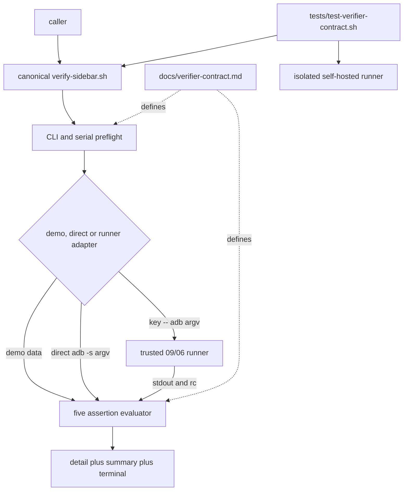
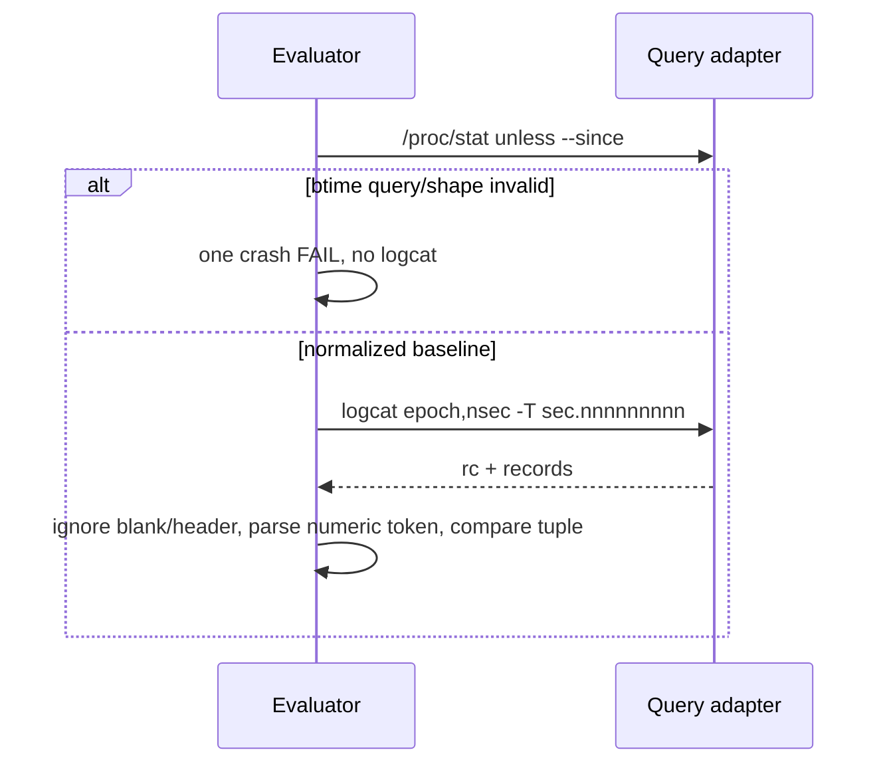

# 2026-09-04-05-verifier-contract 设计

## 概述

新增一个与三个旧 verifier 路径物理分离的 canonical CLI，由极薄 Bash 启动器 `exec python3 - "$@"` 承载 Python 3.8 标准库实现；同片新增完整契约文档和代表性基础隔离测试，三文件 runnable fixed-format core 原型实测 371/400 行并输出固定 PASS。完整矩阵由不改本片文件的后序 05a assurance 独占。

关键决策：

1. 选择新增 `common/.harness/bin/verify-sidebar.sh`，而不是修改任一旧入口。这样 09 可只消费、不改 provider，05 回滚是物理缺席，09 的 fallback/adapter hunk 不会被覆盖；放弃在 05 直接对齐三入口和在 09 再次改 common 的方案。
2. 选择 Bash 稳定路径加内嵌 Python 3.8：Bash 只保证现有调用形态，Python 用标准库完成无溢出的 epoch/nsec 比较、严格 regex、分离 argv 和查询 rc；放弃纯 Bash 的大整数/多行解析与额外 `.py` 文件，前者更难审且易受算术溢出影响，后者会扩大回滚面。
3. 选择同一 bytes 解析器消费 demo 数据、直接 `adb -s` 或 private runner stdout；query adapter 只替换取数方式。runner 以`query-key --`加完整分离ADB argv调用，stdout捕获、stderr继承、rc保留，使09可绑定06而无需改provider；未设置时维持direct与stderr抑制。放弃整进程runtime包装，因为它无法恢复逐query stderr/超时语义。
4. 依据round1的真实368/400弱oracle证据，把代表性base test留在05，把全grammar/CLI/argv/case-manifest/mutant矩阵拆到05a exact1。放弃向余32行压缩完整矩阵，避免以宽松断言换预算。

## 需求映射

| 组件 | 实现的需求 |
|---|---|
| CLI parser 与 serial preflight | R1、R7、R10 |
| direct/private-runner query adapter 与五断言 evaluator | R2、R3、R4、R6、R10 |
| result aggregator | R2、R5、R10 |
| contract 文档 | R1、R4、R5、R6、R8 |
| base contract test | R1、R2、R3、R5–R10 |
| 后序05a assurance边界 | R3、R4、R7–R10 |
| controller sizing/checkout/rollback gates | R8、R9、R10 |

## 架构



分层只有三层：入口/前置层不产生 query 副作用；query 层返回 `(rc, bytes)` 而不解释业务；evaluator/aggregator 层按 R4 表产生恰五个状态和一个终态。技术下限为 Bash 4.3、Python 3.8、GNU coreutils 与现有 Android `adb` CLI；运行时只使用 Python 标准库 `os/re/stat/subprocess/sys`。09 把本文件当 physical provider，不解析内容或覆写它，并只把已验证的私有seam绑定到可信06 adapter。

## 组件与接口

### Canonical verifier provider

- 职责：解析稳定 CLI、执行六条查询、结算五项断言并输出固定协议。
- 对外接口：`verifier-contract-v1：docs/verifier-contract.md；canonical physical provider common/.harness/bin/verify-sidebar.sh [--demo] [--since <epoch[.nsec]>] [--allow-skip]；private HARNESS_VERIFIER_QUERY_RUNNER=<absolute-euid-owned-regular-executable> 接收 <query-key> -- adb -s <serial> <argv...> 并传回 stdout/stderr/rc；五项断言、受控末行与退出码 0|1|2；tests/test-verifier-contract.sh 默认发现基础入口`
- 依赖：Python 3.8 标准库；真实模式依赖 `adb -s <validated-serial>`；不依赖 04 lease runtime。

入口实现保持单文件：shebang 后 `exec python3 - "$@"`，quoted heredoc 防 shell 展开；Python 从 `sys.argv[1:]` 读分离参数。`query(key, value_key, default, argv)` 在demo读取命名fixture；direct real用`subprocess.run(["adb", "-s", serial] + argv, stdout=PIPE, stderr=DEVNULL)`；runner real先由preflight核绝对路径、lstat普通非symlink、EUID owner与X_OK，再执行`[runner, key, "--", "adb", "-s", serial] + argv`，捕获stdout、继承stderr且保留rc。所有路径均`shell=False`。runner是组合seam而非auth边界，因为调用者本就控制PATH；09只能传入自身可信adapter。runner缺席回direct、provider缺席由09 fallback，两者不混淆。

### Base contract test

- 职责：在 repo 外 0700 fixture 中证明逐字demo/real成功主链、default/explicit baseline、六/五条runner argv、stderr/rc及代表性CLI/serial/runner preflight；完整grammar矩阵由05a独占。
- 对外接口：`bash ./tests/test-verifier-contract.sh`；成功唯一 stdout 为 `RESULT PASS  verifier contract\n`、stderr 空、退出 0。
- 依赖：canonical provider、Bash、`mktemp/stat/grep/cmp`；测试入口自身的runner分支记录argv并注入stdout/stderr/rc，避免第四个源码文件。

### 05a assurance boundary

- 职责：后序单文件穷举R3/R4/CLI/runner/bytes边界、完整case manifest和四类mutant，不修改05 exact3。
- 对外接口：`tests/test-verifier-contract-assurance.sh`；dependency-present成功唯一摘要`RESULT PASS  verifier contract assurance`。
- 依赖：本片provider/doc/base test物理齐全；缺provider时inert，partial/damaged fail closed。其active证据入ledger前06/09均不得启动。

### Contract document

- 职责：给 09 与人类调用者提供 CLI/判定表/结果码单一真相源。
- 对外接口：`docs/verifier-contract.md` 的 `Verifier contract v1`。
- 依赖：requirements R1–R6；不引用未来 dispatcher 内部路径。

### 上游消费

- 消费：`02 的根级离线门禁 bash ./scripts/check.sh --offline 及 tests/test-*.sh 默认发现约定；resource-lease-assurance-v1：provider 保持原 public API/状态格式且其 dependency-present active、exact2/400、full/depth-1/rollback 与全 PASS manifest 顺序门证据已入库（无运行时 API）`
- 用法：测试文件名进入 02 字典序发现；04a 只作为 controller 启动顺序证据，不在运行时 source 或调用。

## 数据模型

没有持久化数据。单次进程内只有以下值：

| 值 | 形状 | 生命周期/约束 |
|---|---|---|
| parsed options | `demo: bool, allow_skip: bool, since: str|null, serial: str, runner: str|null` | preflight 后只读；非法在 query 前 rc2 |
| query result | `rc: nonnegative int, stdout: bytes` | 一条查询一次消费；direct抑制stderr、runner继承stderr，signal转`128+signal` |
| runner | `absolute path|null` | real preflight后只读；key固定六值，`--`后传完整ADB argv |
| epoch | `(integer seconds, integer nanoseconds)` | 0–9 位输入规范化为九位，tuple 精确比较 |
| assertion result | 五个 `(PASS|FAIL|SKIP, detail)` | 固定顺序 boot/system/crash/service/package |
| aggregate | 三个 0..5 计数 | 和必须为5，FAIL优先于SKIP |

## 数据流

```mermaid
sequenceDiagram
  participant C as Caller
  participant P as Preflight
  participant Q as Query adapter
  participant R as Optional runner
  participant E as Evaluator
  C->>P: separated CLI args
  alt invalid args, real allow-skip, unsafe serial or runner
    P-->>C: stderr category + rc2, zero query
  else valid
    loop boot, system, crash, service, package
      P->>Q: key + separated adb argv
      opt private runner configured
        Q->>R: key + -- + adb argv
        R-->>Q: stdout bytes + rc; stderr inherited
      end
      Q-->>E: rc + stdout bytes
      E-->>P: one PASS/FAIL/SKIP detail
    end
    P-->>C: five details + summary + terminal/rc
  end
```



## 错误处理

| 错误场景 | 恢复策略 | 校验位置 | 日志 | 用户可见 |
|---|---|---|---|---|
| CLI重复/缺值/未知/help组合 | 不执行查询，立即结束 | parser | usage 到stderr | rc2 |
| real allow-skip、serial或runner非法 | 不执行query，立即结束 | preflight | 固定类别到stderr | rc2 |
| runner通过预检后启动失败 | 该query按126失败并继续五项聚合 | query边界 | 固定runner execution诊断 | 最终rc1 |
| 任一查询非零 | 继续结算其他逻辑项 | query/evaluator边界 | 对应`FAIL  ... query failed` | 最终rc1 |
| btime零/多/畸形 | crash项FAIL且不调logcat | crash evaluator | `crash baseline parse failed` | 最终rc1 |
| 输出grammar畸形 | 该项parse FAIL，不降级为业务缺失 | R4 evaluator | 对应parse detail | 最终rc1 |
| 合法package缺失 | 只记SKIP | package evaluator | package missing detail | strict rc2或demo探索rc0 |
| fixture/static/预算/cleanup失败 | 测试不打印固定PASS并非零退出 | contract test/controller | 首个专属FAIL | rc1/门禁阻断 |

## 测试策略

| 层 | 测什么 | 用什么工具 |
|---|---|---|
| 单元 | provider内bytes grammar、epoch tuple、五项聚合；base只取代表路径，05a再逐格穷举 | 内嵌Python实现、后序05a表驱动调用 |
| 集成 | demo零query；real runner六/五查询stdout/stderr/rc、调用顺序和统一`-s`；preflight零调用 | repo外0700 `mktemp`、test自带runner、argv log |
| 端到端 | candidate/full/depth-1的contract+offline；exact rollback的01/02/04/04a与三旧入口回归 | Bash、`git clone --depth 1 file://`、controller脚本 |
| 性能 | 不适用：本片无性能SLO；只禁止真实设备与网络，运行时长记原始证据但不作验收阈值 | `/usr/bin/time`可选记录，不进入成败判据 |

门③ runnable core prototype 位于 `prototypes/`：fixed shfmt v3.14.0（`-i 2 -ci -bn`）、ShellCheck 0.11.0 warning、`bash -n`均通过；base test唯一输出固定PASS。三文件为provider 202行、doc 67行、test 102行，总churn 371/400；SHA-256依次为provider `56f696401ccf53db4c81aa47bcce1d61081639eace5cdba983aecf8af396500d`、doc `d22c977c4d361a7ad7a949db33e6d93e73a7564752d9374cd9fa7be4bb3c2634`、test `2c5b3b096cae5c2494b533afe108b3eb6386368d844345c5f03a362df7742160`。完整assurance由PLAN v6.1的05a门③另以runnable exact1≤400证明。

## 文件清单

| 文件 | 创建/修改 | 职责（一句话） |
|---|---|---|
| `common/.harness/bin/verify-sidebar.sh` | 创建 | 独立canonical physical provider与稳定CLI |
| `docs/verifier-contract.md` | 创建 | 五断言、CLI与终态协议单一文档 |
| `tests/test-verifier-contract.sh` | 创建 | 默认发现的代表性隔离base contract |

验收资产（不纳入源码文件清单）：`prototypes/common/.harness/bin/verify-sidebar.sh`、`prototypes/docs/verifier-contract.md`、`prototypes/tests/test-verifier-contract.sh`，以及 `reviews/` 下门③独立审查报告。execution BASE 到 accepted HEAD 必须exact上述三源码文件，prototype/review/ledger只随spec文档提交，不计入source diff。
