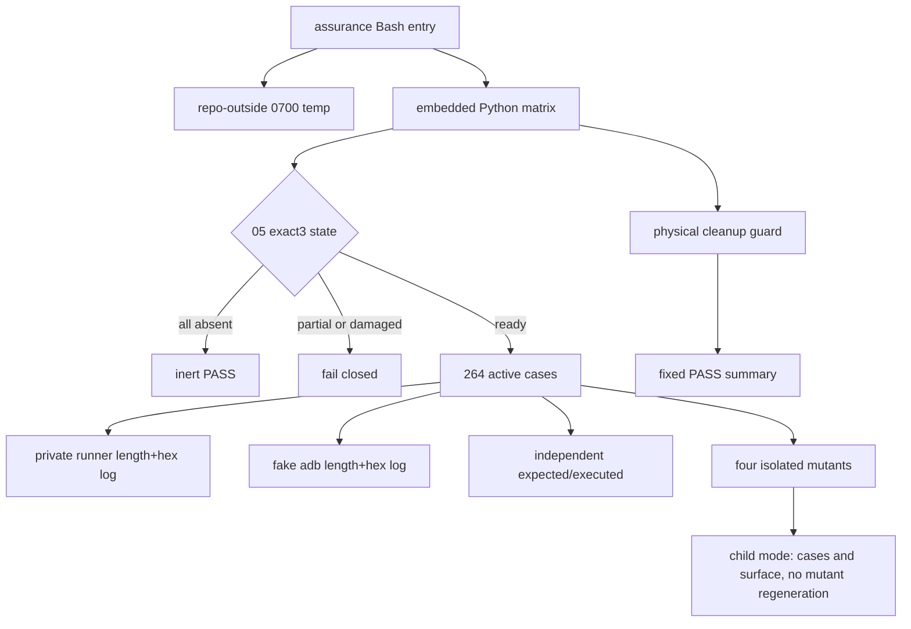
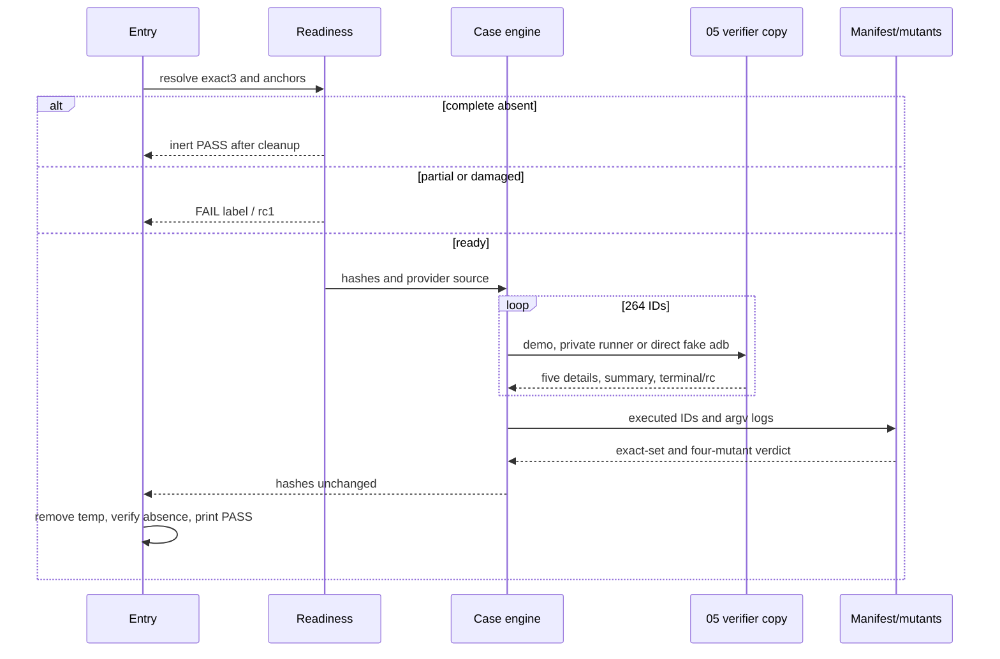
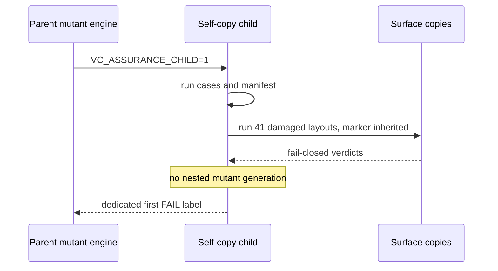

# 2026-09-05-05a-verifier-contract-assurance 设计

## 概述

把已实跑的331行prototype机械交付为唯一源码文件：Bash只负责0700 temp与可靠EXIT cleanup，内嵌Python负责readiness、264-case table、长度+hex transport log、surface与mutant oracle。

关键决策：

1. 选择单文件Bash+quoted Python heredoc，复用05的Python bytes语义且满足exact1/400；放弃拆helper文件，避免扩大回滚和consumer边界。
2. 选择独立`EXPECTED_TEXT`和执行table/loops形成manifest，不从执行代码生成expectation；放弃只计case数量，避免删case后同源假绿。
3. 选择repo外layout copy验证absent/damaged/mutant，tracked 05 exact3只读并前后hash；self-mutant以`VC_ASSURANCE_CHILD=1`继续case/surface但停止再生mutant，放弃隐式Python-global child状态和递归审计歧义。

## 需求映射

| 组件 | 实现的需求 |
|---|---|
| Bash lifecycle wrapper | R1、R8、R10 |
| readiness与surface router | R2、R4、R8 |
| runner/direct transport oracle | R3–R5 |
| grammar/aggregate case engine | R3、R5–R7 |
| independent manifest | R3、R6、R10 |
| four-mutant engine | R8、R10 |
| controller checkout/rollback gates | R1、R9、R10 |

## 架构

技术下限为Bash 4.3、Python 3.8标准库和GNU coreutils；静态版本固定shfmt v3.14.0、ShellCheck 0.11.0。入口不需要网络、真实adb或第三方Python包。

## 组件与接口

### Verifier assurance entry

- 职责：执行readiness、active/inert/damaged、transport、grammar、manifest、mutant与cleanup oracle。
- 对外接口：`verifier-contract-assurance-v1：只新增 tests/test-verifier-contract-assurance.sh；dependency-present完整矩阵成功唯一输出 RESULT PASS  verifier contract assurance；不新增运行时API`
- 依赖：`verifier-contract-v1：docs/verifier-contract.md；canonical physical provider common/.harness/bin/verify-sidebar.sh [--demo] [--since <epoch[.nsec]>] [--allow-skip]；private HARNESS_VERIFIER_QUERY_RUNNER=<absolute-euid-owned-regular-executable> 接收 <query-key> -- adb -s <serial> <argv...> 并传回 stdout/stderr/rc；五项断言、受控末行与退出码 0|1|2；tests/test-verifier-contract.sh 默认发现基础入口`

CLI只接受无参数、`all`或`--dependency-absent`。default/all在present布局调用同一`main()` active分支；absence flag只允许exact3全缺席。成功唯一stdout为固定摘要，失败stdout不得含该摘要、stderr首行为`FAIL <label>`、rc1。

### Case engine

- 职责：table和紧凑loop执行264个稳定ID，生成实际manifest并与独立expectation集合比较。
- 对外接口：无运行时接口；只在assurance进程内使用。
- 依赖：05 provider/doc/base test只读copy、Python`ast/re/subprocess/pathlib/hashlib`。

runner脚本按调用创建递增JSON，字段为`key`、`argc`和`argv:[[byte_length,hex],...]`；direct fake adb使用同一codec。case engine从固定query args计算expected argv，逐字比较五detail、summary、terminal和双流。

### Surface与mutant engine

- 职责：构造41种complete-absent/partial/type/symlink/syntax/anchor/CLI布局，以及四个只改repo外copy的mutant。
- 对外接口：无。
- 依赖：readiness固定anchors、独立manifest、guarded success summary。

## 数据模型

无持久化数据。临时模型如下：

| 值 | 形状 | 约束 |
|---|---|---|
| case ID | ASCII token | 264个，expected/executed集合唯一且相等 |
| query config | JSON | 六key到hex bytes、fail/signal/diagnostic与log路径 |
| argv record | JSON | key、argc、每参数byte length+hex，可无歧义复原 |
| result oracle | 五status/detail + summary + terminal/rc | detail顺序固定，summary和为5 |
| dependency hashes | 三个SHA-256 bytes | active前后相等 |
| child marker | `VC_ASSURANCE_CHILD=1` | 只禁止mutant再生，不跳case/manifest/surface |

## 数据流

## 错误处理

| 错误场景 | 恢复策略 | 校验位置 | 日志 | 用户可见 |
|---|---|---|---|---|
| invalid own CLI | 不进入active | `main()`入口 | `FAIL args` | rc1，无PASS |
| partial/damaged dependency | fail closed | readiness/surface | 专属`FAIL` label | rc1 |
| case/argv/result不符 | 停止矩阵并cleanup | case engine | case ID label | rc1 |
| expected/executed漂移 | 拒绝成功 | manifest末门 | `FAIL mutant-case-manifest` | rc1 |
| mutant存活或错标签 | 拒绝成功 | mutant parent | mutant label | rc1 |
| self-copy递归 | child marker只停再生 | mutant child | `VC_ASSURANCE_CHILD=1` | 不泄漏为外部接口 |
| cleanup失败 | 覆盖原rc为1 | Bash trap/Python cleanup | `FAIL cleanup` | rc1，无PASS |

## 测试策略

| 层 | 测什么 | 用什么工具 |
|---|---|---|
| 单元 | grammar各格、epoch、terminal、argv codec | table/loop + Python bytes |
| 集成 | private runner/direct、readiness/surface、manifest、四mutant | repo外0700 layout copy |
| 端到端 | candidate/full/depth-1的assurance+05 base+offline | Bash、Git file clone |
| 性能 | 无SLO；记录active耗时防误判挂死 | `/usr/bin/time`，不作成败阈值 |

prototype已以fixed工具通过：331行、SHA-256 `88f3abcd3f99e252c10e1134b98ea63212584ebd37bc6dfac2f9dd77dedc92ba`；controller active default为79.62秒、固定stdout 41 bytes、stderr空，complete-absent三路PASS。implementation必须逐字复制prototype，不允许重新设计或缩减矩阵。

## 文件清单

| 文件 | 创建/修改 | 职责（一句话） |
|---|---|---|
| `tests/test-verifier-contract-assurance.sh` | 创建 | 默认发现的完整verifier契约assurance、surface与mutant自反证 |

验收资产：`prototypes/tests/test-verifier-contract-assurance.sh`与`reviews/`报告；不计入execution BASE源码diff。
