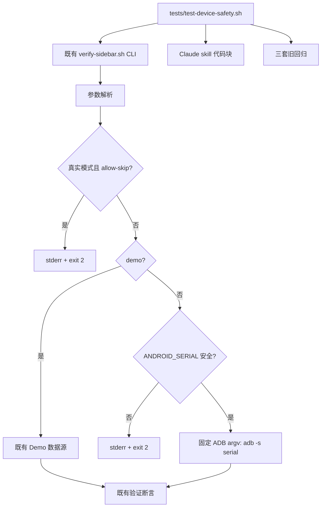
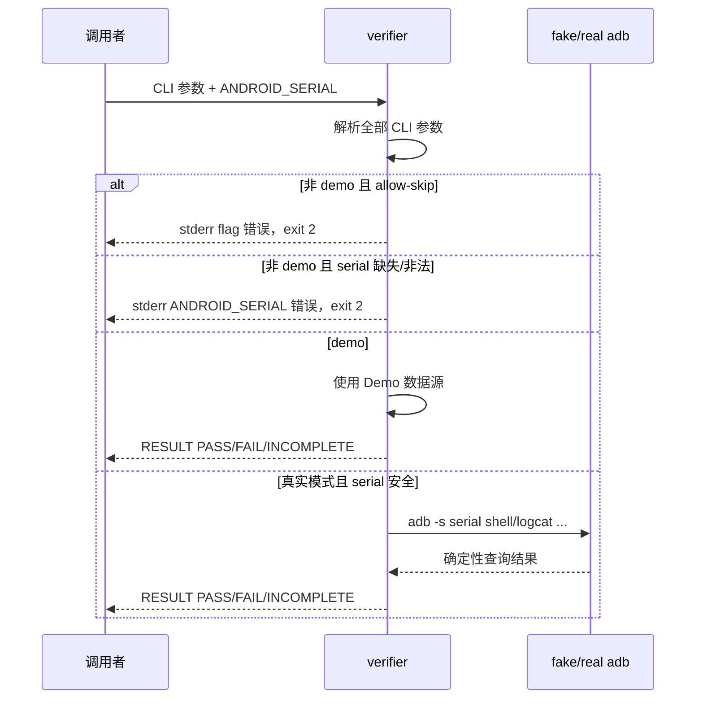
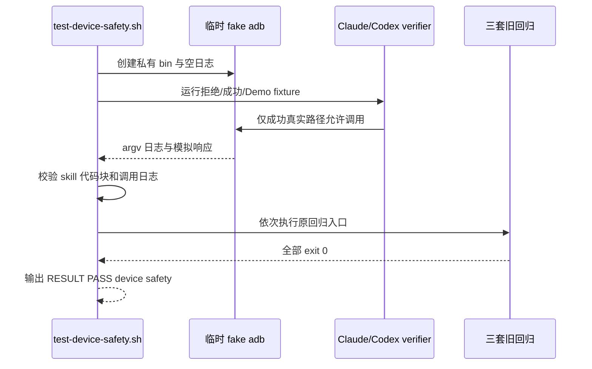

# 任务 1.8: 聚合 legacy 与最终无参入口

> 这是你的需求。数值、签名、命令一律照抄，不要自己发挥。
> 你只做这一个任务，不要顺手做别的。不要派 subagent。

---

## 完整上下文

下面是整个 spec 的三个文件，让你了解整体需求、设计和任务分解。
**但你只执行「你的任务」那一节，不要去做别的任务。**

### Requirements

> 用户原话：
> “$spec review 这套 aosp harness 工程，有哪些欠缺的地方，进行重构和完善”；用户已通过 PLAN v4，并要求后续按 autopilot 执行。

## 目标

通过强制 `ANDROID_SERIAL` 来固定 ADB 的 `shell`、`logcat`、`root`、`remount`、`push`、`reboot` 目标，消除独立 Claude Demo 可操作错设备、以及独立 Codex verifier 可把真实模式 SKIP 判为成功的两个最高风险缺口，同时保留离线 Demo 和现有用户入口。

## 需求

R1. [计划] 当 Claude verifier 在真实模式启动时，系统必须在第一次 ADB 调用前要求 `ANDROID_SERIAL` 匹配 `^[A-Za-z0-9][A-Za-z0-9._:-]*$`，并使所有 `shell` 与 `logcat` 调用通过同一 `adb -s "$serial"` 目标执行。

R2. [计划] 如果发生 Claude 真实 verifier 缺少 `ANDROID_SERIAL` 或 serial 不符合安全格式，系统必须在零次 ADB 调用后向 stderr 输出包含 `ANDROID_SERIAL` 的错误，并以退出码 `2` 结束。

R3. [计划] 当 Claude `build-services-jar` 部署流程或 `build-sepolicy` 真机验证流程被按文档执行时，系统必须先读取并校验显式 `ANDROID_SERIAL`，且每条 `root`、`remount`、`push`、`reboot`、`shell` 命令必须使用 `adb -s "$device_serial"`。

R4. [计划] 当 Claude 或 Codex verifier 在非 demo 模式收到 `--allow-skip` 时，系统必须先于 serial 校验拒绝该组合，在零次 ADB 调用后向 stderr 输出 `--allow-skip requires --demo`，并以退出码 `2` 结束。

R5. [计划] 当 Claude 或 Codex verifier 以 `--demo --allow-skip` 运行且应用缺失时，系统必须保留现有探索语义：输出 `SKIP`、末行输出 `RESULT PASS (SKIP allowed)` 并退出 `0`。

R6. [计划] 在本 spec 的隔离回归期间，系统必须仅使用临时 fake `adb` 取证，必须证明安全拒绝路径不执行 fake `adb`、成功路径每次调用均携带预期 serial，且不得访问开发机真实 ADB server。

R7. [计划] 系统必须保留 `claude-code/features/dev-sidebar/verify-sidebar.sh`、`codex/features/dev-sidebar/verify-sidebar.sh` 和三套旧回归入口的现有路径。

## 验收标准

主验证命令: bash ./tests/test-device-safety.sh
期望输出: stdout 末行精确为 `RESULT PASS  device safety`，退出码为 `0`

验收清单:

- [ ] Claude 真实 verifier 对 serial 缺失、`-bad`、`.bad`、`_bad`、`:bad`、`bad/path`、`bad value`、含实际 LF 的 Bash 值 `$'bad\nvalue'`、`bad;value`、`bad+value` 均返回 `2`，stderr 包含 `ANDROID_SERIAL`，fake ADB 日志为空。
- [ ] Claude 真实 verifier 分别接受 `demo-serial`、`A0._:-z`，fake ADB 每条记录都以对应 `adb -s <serial> ` 开头，且末行为 `RESULT PASS`。
- [ ] Claude 两个流程 skill 的每个真机代码块都在首条 ADB 前从 `ANDROID_SERIAL` 取值并执行完整安全格式校验，枚举出的每条 ADB 命令都精确以分离参数 `adb -s "$device_serial"` 开头，不存在其他 target 变量或裸调用。
- [ ] Claude 与 Codex 每个入口在真实模式传 `--allow-skip` 时，均分别以 serial 缺失和非空非法 `-bad` 取证（共四个组合）；每个组合都返回 `2`、stderr 含 `--allow-skip requires --demo` 且不含 `ANDROID_SERIAL`、fake ADB 日志为空，证明 flag 错误恒先于 serial 校验。
- [ ] Claude 与 Codex 的应用缺失 `--demo --allow-skip` fixture 均至少输出一行以 `SKIP  ` 开头的明细，退出 `0`，且末行为 `RESULT PASS (SKIP allowed)`。
- [ ] `bash -n` 对本 spec 修改的 shell 文件全部退出 `0`，Claude、Codex、common 三套旧回归均退出 `0`。

不变量（不许劣化，2-4 项）:

- 开发机真实 ADB 调用数 ≤ `0`，验证: `bash ./tests/test-device-safety.sh`在私有 fake-ADB `PATH` 下运行且日志只含 fixture 记录。
- 三套旧回归失败数 ≤ `0`，验证: `bash ./claude-code/features/.harness/tests/test-harness.sh && ./codex/tests/test-harness.sh && ./common/tests/test-harness.sh`。
- 既有 verifier 用户入口删除数 ≤ `0`，验证: `test -x claude-code/features/dev-sidebar/verify-sidebar.sh && test -x codex/features/dev-sidebar/verify-sidebar.sh`。

## 超出范围

- 不在本 spec 引入公共 ADB command runtime、超时、重试、stderr 诊断或 lease；这些由 `04`、`06` 及 `09` 处理。
- 不收敛三套 verifier 断言集，不修改 common verifier；由 `05` 处理。
- 不执行真实 ADB、CVD、AOSP build、网络访问、发布、提交或推送。

## autopilot 裁定

- 必答问题 `0` 个，带推荐问题 `0` 个；现状、预期、不应变均已被 PLAN 和源码证据覆盖。
- 已定告知：安全 serial 格式与现有 Codex/common 对齐；用法/安全拒绝返回 `2`；`--allow-skip` 仅 demo 可用；本 spec 只做最小安全补丁，不提前引入后续公共内核。

### Design

# 2026-08-31-01-device-safety 设计

## 1. 概述

在两个既有 verifier 的参数解析与设备调用之间加入 fail-closed 前置层，并用一份根级离线回归锁定 serial、SKIP 和 Claude 部署文档的设备选择约束。

- 选择在两个 verifier 内就地执行相同顺序的前置检查：先拒绝真实模式 `--allow-skip`，再校验真实模式 `ANDROID_SERIAL`；这样在后续公共 dispatcher 尚未落地时即可关闭风险。放弃本 spec 提前抽公共库，因为那会侵入 `05/06/09` 的边界并扩大回滚面。
- 选择将安全 serial 保存为单个 Bash 变量，并通过数组形式 `ADB=(adb -s "$serial")` 传递给 Claude verifier；这样每个参数保持分离且所有查询天然复用同一目标。放弃依赖 adb 的隐式 `ANDROID_SERIAL` 选择，因为它无法从命令日志证明目标，也容易被调用环境覆盖。
- 选择新增独立 `tests/test-device-safety.sh`，同时只对 Claude 旧回归中受目标固定影响的 fake ADB fixture 做兼容调整；这样新契约有单一可执行判据且三套旧入口继续回归。放弃把全部新矩阵塞入某一客户端旧套件，因为这会隐藏跨 Claude/Codex 的共同安全契约。

## 2. 需求映射

| 组件 | 实现的需求 |
|---|---|
| Claude verifier 前置层与 ADB adapter | R1, R2, R4, R5, R7 |
| Codex verifier flag 前置层 | R4, R5, R7 |
| Claude 真机流程 skill 代码块 | R3 |
| 根级 device-safety 隔离回归 | R1, R2, R3, R4, R5, R6, R7 |
| Claude 旧回归兼容 fixture | R6, R7 |

## 3. 架构



实现仍位于三个现有 Demo 的兼容边界内：不新增运行时公共依赖，不改变 verifier 路径或 CLI 参数集合。Shell 实现以 Bash 3.2 及以上和仓库现有的 `awk`、`grep`、`sed`、`mktemp` 为下限；不引入网络、第三方包或真实 ADB。后续 `09-verifier-adapters` 可以用公共 dispatcher 替换内部实现，但必须保留这里锁定的前置顺序和外部行为。

## 4. 组件与接口

### Claude verifier 前置层与 ADB adapter

- 职责：解析完参数后先判定 flag 组合，再校验 serial，并让真实模式的 `shell`、`logcat` 都通过同一固定 argv 调用。
- 对外接口：`claude-code/features/dev-sidebar/verify-sidebar.sh [--demo] [--allow-skip] [--since <epoch-seconds>]`
- 依赖：Bash；真实模式依赖外部 `adb`，Demo 模式不依赖 adb。
- 内部约束：`--allow-skip` 的真实模式错误必须发生在读取/校验 serial 之前；仅在非 Demo 且 serial 通过 `^[A-Za-z0-9][A-Za-z0-9._:-]*$` 后构造 `ADB=(adb -s "$serial")`。

### Codex verifier flag 前置层

- 职责：在现有 serial 校验前拒绝真实模式 `--allow-skip`，不改变既有 Demo SKIP 或真实验证逻辑。
- 对外接口：`codex/features/dev-sidebar/verify-sidebar.sh [--demo] [--allow-skip] [--since EPOCH] [--help]`
- 依赖：Bash、现有 verifier 逻辑。

### Claude 真机流程 skill 代码块

- 职责：使复制执行的 services.jar 部署和 sepolicy 真机验证片段都先完成显式 serial 校验，再使用固定目标执行每条 ADB 命令。
- 对外接口：`device_serial="${ANDROID_SERIAL-}"`；安全格式为 `^[A-Za-z0-9][A-Za-z0-9._:-]*$`；设备命令前缀为 `adb -s "$device_serial"`。
- 依赖：Bash 代码块、调用环境显式提供的 `ANDROID_SERIAL`。

### 根级 device-safety 隔离回归

- 职责：以私有 fake ADB 对两个 verifier 和两个 skill 做行为/静态取证，最后运行三套旧回归。
- 对外接口：`tests/test-device-safety.sh —— 无参数；全部通过时退出 0 且 stdout 末行为 RESULT PASS  device safety，任一断言失败时退出非零`
- 依赖：Bash、`mktemp`、`awk`、`grep`、`sed`，以及仓库内两个 verifier、两个 skill 和三套旧回归入口。
- 隔离规则：脚本创建只含 fake `adb` 的临时 `bin` 并将它置于 `PATH` 首位；所有真实模式 fixture 都显式使用该 `PATH`，fake ADB 将 argv 写入私有日志并返回确定性响应。

### Claude 旧回归兼容 fixture

- 职责：让既有整数 logcat baseline 测试显式设置安全 serial，并使其 fake adb 接受且检查 `-s <serial>` 前缀。
- 对外接口：无新增接口；`bash ./claude-code/features/.harness/tests/test-harness.sh` 保持原入口和成功语义。
- 依赖：Claude verifier 的固定 ADB argv。

## 5. 数据模型

不适用：本 spec 不创建持久化状态、schema 或跨进程会话。运行时只有当前进程内的 `demo/allow-skip/serial` 标量、固定 ADB argv，以及测试临时目录内的追加式 fake ADB 调用日志；测试退出时通过 trap 删除临时目录。

## 6. 数据流

### 真实 verifier 前置顺序



### 隔离测试取证



## 7. 错误处理

| 错误场景 | 恢复策略 | 校验位置 | 日志 | 用户可见 |
|---|---|---|---|---|
| 非 Demo 使用 `--allow-skip` | 立即终止，不读设备、不调用 ADB | 两个 verifier 参数解析之后、serial 校验之前 | 不写 ADB 日志 | stderr 含 `--allow-skip requires --demo`，exit 2 |
| Claude 真实模式 serial 缺失或非法 | 立即终止，不调用 ADB | Claude verifier 构造 ADB argv 前 | 不写 ADB 日志 | stderr 含 `ANDROID_SERIAL`，exit 2 |
| 合法 serial 下 ADB 查询失败 | 沿用 verifier 现有 FAIL/INCOMPLETE 语义，本 spec 不增加重试 | 既有查询/断言处 | fake ADB 记录含固定 `-s serial` 的 argv | 既有结果末行和非零退出码 |
| Demo 应用缺失且显式允许 SKIP | 保留探索路径，不触碰 ADB | 既有 package 断言与汇总处 | 无 ADB 日志 | 至少一行 `SKIP  `，末行 `RESULT PASS (SKIP allowed)`，exit 0 |
| skill 代码块缺少完整校验或出现裸 ADB | 离线测试失败，不执行代码块 | 根级测试的静态代码块检查 | stderr 指出文件和缺失约束 | test 脚本非零退出 |
| fake ADB 收到无 `-s`、错误 serial 或未知命令 | fake 命令返回非零并使 fixture 失败 | 临时 fake adb | 记录原始分离 argv | test 脚本非零退出 |
| 任一旧回归失败 | 停止成功汇总并返回失败 | 根级测试末段 | 保留旧回归自身输出 | 不输出成功末行，exit 非零 |

## 8. 测试策略

| 层 | 测什么 | 用什么工具 |
|---|---|---|
| 单元 | Claude serial 正反字符边界；两个入口四种 flag/serial 优先级组合；Demo 应用缺失 SKIP；skill 每个真机代码块的取值、完整 regex、固定变量和 ADB 前缀 | `tests/test-device-safety.sh` 内的 Bash 断言、临时 fake `adb`、`awk/grep/sed` 静态检查 |
| 集成 | Claude 两个合法 serial 的完整真实模式流程，证明所有 `shell/logcat` 调用固定目标且末行为 PASS | 同一根级测试通过私有 `PATH` 启动原 verifier 入口并核对追加式 argv 日志 |
| 端到端 | 新安全回归与 Claude、Codex、common 三套旧回归全部成功；两个 verifier 路径仍可执行 | `bash ./tests/test-device-safety.sh`；该脚本内部依次调用三套旧回归，并以精确成功末行收口 |
| 性能 | 不适用：只增加常数次字符串校验；PLAN 明确不为未实测时序设性能指标 | 不执行性能测试 |

所有设备相关测试均以私有 fake ADB 运行；不调用系统 adb server，不执行 AOSP build、CVD、网络或发布操作。实现完成后另跑 `bash -n` 覆盖本 spec 修改的 shell 文件，并运行 `git diff --check` 作为格式卫生检查。

## 文件清单

| 文件 | 创建/修改 | 职责（一句话） |
|---|---|---|
| `claude-code/features/dev-sidebar/verify-sidebar.sh` | 修改 | 增加 flag/serial 前置校验并固定全部真实 ADB 调用目标。 |
| `codex/features/dev-sidebar/verify-sidebar.sh` | 修改 | 在 serial 校验前拒绝真实模式 `--allow-skip`。 |
| `claude-code/features/.harness/skills/build-services-jar/SKILL.md` | 修改 | 将 services.jar 真机部署片段改为先校验 serial、后固定目标。 |
| `claude-code/features/.harness/skills/build-sepolicy/SKILL.md` | 修改 | 将 sepolicy 真机验证片段改为先校验 serial、后固定目标。 |
| `claude-code/features/.harness/tests/test-harness.sh` | 修改 | 使受影响的旧 fake ADB fixture 显式验证固定 serial。 |
| `tests/test-device-safety.sh` | 创建 | 提供本 spec 的跨入口离线安全验收与旧回归聚合入口。 |

### 所有任务

# 2026-08-31-01-device-safety 实现计划

## 测试骨架与 verifier 判据

### 任务 1.1: 建立隔离 fixture 与 scope runner

文件: 创建 `tests/test-device-safety.sh`
消费: 无
产出: device_safety_register_scope <scope> <function>、device_safety_fake_adb_install <fixture> <serial>
需求: R6
必需: 是
状态: 完成

- [ ] 步骤 1: 跑 `test -e ./tests/test-device-safety.sh` 确认红阶段失败，因为根级安全测试入口尚不存在。
- [ ] 步骤 2: 按下列骨架创建 scope 注册、失败汇总和无位置参数 runner；未知 scope 向 stderr 报错并 exit 2。

  ```bash
  DEVICE_SAFETY_SCOPE_NAMES=()
  DEVICE_SAFETY_SCOPE_FUNCS=()
  device_safety_register_scope() {
    DEVICE_SAFETY_SCOPE_NAMES+=("$1")
    DEVICE_SAFETY_SCOPE_FUNCS+=("$2")
  }
  device_safety_run_scope() {
    local wanted="$1" i
    for ((i=0; i<${#DEVICE_SAFETY_SCOPE_NAMES[@]}; i++)); do
      [[ "${DEVICE_SAFETY_SCOPE_NAMES[$i]}" != "$wanted" ]] || {
        "${DEVICE_SAFETY_SCOPE_FUNCS[$i]}"
        return
      }
    done
    printf 'error: unknown DEVICE_SAFETY_TEST_SCOPE: %s\n' "$wanted" >&2
    return 2
  }
  ```

- [ ] 步骤 3: 按下列 argv/响应表实现私有 fake adb；日志必须包含命令名，未知 serial 或命令返回非零。

  ```bash
  printf 'adb ' >>"$ADB_LOG"
  printf '%q ' "$@" >>"$ADB_LOG"
  printf '\n' >>"$ADB_LOG"
  [[ "${1-}" == -s && "${2-}" == "$EXPECTED_SERIAL" ]] || exit 91
  shift 2
  case "$*" in
    'shell getprop sys.boot_completed') printf '1\n' ;;
    'shell pidof system_server') printf '1423\n' ;;
    'shell cat /proc/stat') printf 'btime 200\n' ;;
    logcat\ -b\ crash\ -d\ -v\ *\ -T\ *) exit 0 ;;
    'shell service list') printf '52 sidebar: [android.sidebar.ISidebar]\n' ;;
    'shell pm list packages') printf 'package:com.android.sidebar\n' ;;
    *) exit 92 ;;
  esac
  ```

- [ ] 步骤 4: 用 `DEVICE_SAFETY_TEST_SCOPE=fixture bash ./tests/test-device-safety.sh` 自测完整日志、未知 serial/命令非零、私有 `PATH` 首项和 trap 清理注册；自测不得调用系统 adb。
- [ ] 步骤 5: 跑 `bash -n ./tests/test-device-safety.sh`，确认语法检查 exit 0。

### 任务 1.2: 增加 Claude 非法 serial 矩阵

文件: 修改 `tests/test-device-safety.sh`
消费: device_safety_register_scope <scope> <function>、device_safety_fake_adb_install <fixture> <serial>
产出: device_safety_run_claude_invalid_serial_matrix
需求: R2, R6
必需: 是
状态: 完成

- [ ] 步骤 1: 按下列表驱动非法输入；`__UNSET__` 用 `env -u ANDROID_SERIAL`，其他值用分离环境参数传入，实际 LF 不得写成两个字符 `\` 和 `n`。

  ```bash
  invalid_serials=(
    '__UNSET__' '-bad' '.bad' '_bad' ':bad' 'bad/path' 'bad value'
    $'bad\nvalue' 'bad;value' 'bad+value'
  )
  ```

- [ ] 步骤 2: 每个 case 使用独立空日志运行 Claude 真实 verifier，逐项断言 rc 精确为 2、stderr 含 `ANDROID_SERIAL`、日志不存在或大小为 0；失败标签为 `FAIL  claude <case> ANDROID_SERIAL: expected rc=2 and zero adb calls`。

  ```bash
  [[ "$rc" -eq 2 ]] || device_safety_fail "$label: expected rc=2 and zero adb calls"
  grep -Fq 'ANDROID_SERIAL' "$stderr_file" || device_safety_fail "$label: missing ANDROID_SERIAL error"
  [[ ! -s "$adb_log" ]] || device_safety_fail "$label: expected zero adb calls"
  ```

- [ ] 步骤 3: 注册 `claude-invalid-serial` scope，跑 `DEVICE_SAFETY_TEST_SCOPE=claude-invalid-serial bash ./tests/test-device-safety.sh` 确认当前红阶段非零；首错为 `FAIL  claude missing ANDROID_SERIAL: expected rc=2 and zero adb calls`，且原始日志非空，证明当前裸 ADB 被 oracle 捕获。

### 任务 1.3: 增加 Claude 合法 serial 正向矩阵

文件: 修改 `tests/test-device-safety.sh`
消费: device_safety_register_scope <scope> <function>、device_safety_fake_adb_install <fixture> <serial>
产出: device_safety_run_claude_valid_serial_matrix
需求: R1, R6
必需: 是
状态: 完成

- [ ] 步骤 1: 对 `demo-serial`、`A0._:-z` 分别创建独立 fixture，运行 Claude 真实 verifier `--since 200` 并保存 rc/stdout/ADB 日志。

  ```bash
  valid_serials=('demo-serial' 'A0._:-z')
  for serial in "${valid_serials[@]}"; do
    expected_prefix="adb -s $serial "
    # run verifier with ANDROID_SERIAL="$serial" and private PATH
  done
  ```

- [ ] 步骤 2: 每个 case 断言 rc 为 0、stdout 末行精确 `RESULT PASS`、日志非空，且每一行而非仅首行都以精确 `adb -s <对应 serial> ` 开头。

  ```bash
  [[ "$rc" -eq 0 && "$(tail -n 1 "$stdout_file")" == 'RESULT PASS' ]]
  [[ -s "$adb_log" ]]
  [[ "$(grep -Fvc "$expected_prefix" "$adb_log")" -eq 0 ]]
  ```

- [ ] 步骤 3: 注册 `claude-valid-serial` scope，跑 `DEVICE_SAFETY_TEST_SCOPE=claude-valid-serial bash ./tests/test-device-safety.sh` 确认当前红阶段非零，首错为 `FAIL  claude demo-serial: expected adb -s prefix on every call`。

### 任务 1.4: 增加 flag 优先级与 Demo SKIP 矩阵

文件: 修改 `tests/test-device-safety.sh`
消费: device_safety_register_scope <scope> <function>、device_safety_fake_adb_install <fixture> <serial>
产出: device_safety_run_flag_and_demo_matrix
需求: R4, R5, R6, R7
必需: 是
状态: 完成

- [ ] 步骤 1: 用下列四组合分别运行两个真实 verifier；每组断言 rc 2、stderr 含精确短语且不含 `ANDROID_SERIAL`、ADB 日志为空。

  ```bash
  flag_cases=(
    'claude|__UNSET__' 'claude|-bad'
    'codex|__UNSET__' 'codex|-bad'
  )
  expected_error='--allow-skip requires --demo'
  ```

- [ ] 步骤 2: 对 Claude/Codex 分别以 `DEMO_APP_INSTALLED=0 --demo --allow-skip` 运行，断言 rc 0、至少一行匹配 `^SKIP  `、末行精确 `RESULT PASS (SKIP allowed)`。

  ```bash
  [[ "$rc" -eq 0 ]]
  grep -Eq '^SKIP  ' "$stdout_file"
  [[ "$(tail -n 1 "$stdout_file")" == 'RESULT PASS (SKIP allowed)' ]]
  ```

- [ ] 步骤 3: 断言两个 verifier 路径可执行；注册 `claude-flag-demo`、`codex-flag-demo`，再用 `flag-demo` 依次组合两者。
- [ ] 步骤 4: 跑 `DEVICE_SAFETY_TEST_SCOPE=flag-demo bash ./tests/test-device-safety.sh` 确认红阶段非零，首错为 `FAIL  claude real allow-skip missing serial: expected flag error before ANDROID_SERIAL`；原始日志非空或 rc 错误，不能被清空伪装为修复证据。

## Skill 静态 oracle

### 任务 1.5: 提取并计数 fenced 真机块

文件: 修改 `tests/test-device-safety.sh`
消费: device_safety_register_scope <scope> <function>
产出: device_safety_extract_device_blocks <skill-name> <path> <output-dir>
需求: R3, R6
必需: 是
状态: 完成

- [ ] 步骤 1: 实现 fenced Bash block 状态机；只把含目标 ADB 子命令的块落到私有 `output-dir/block-N.bash`，行内反引号不得算 fenced block。

  ```bash
  in_bash=0
  block=''
  while IFS= read -r line || [[ -n "$line" ]]; do
    if [[ "$in_bash" -eq 0 && "$line" == '```bash' ]]; then
      in_bash=1; block=''; continue
    fi
    if [[ "$in_bash" -eq 1 && "$line" == '```' ]]; then
      if grep -Eq '(^|[;&][[:space:]]*)adb[[:space:]].*(root|remount|push|reboot|shell)' <<<"$block"; then
        count=$((count + 1))
        printf '%s\n' "$block" >"$output_dir/block-$count.bash"
      fi
      in_bash=0; continue
    fi
    [[ "$in_bash" -eq 0 ]] || block+="${block:+$'\n'}$line"
  done <"$path"
  ```

- [ ] 步骤 2: 对 `build-services-jar`、`build-sepolicy` 各要求目标计数精确为 1；零或多块均失败，sepolicy 当前行内 ADB 因计数为零必须被检出。
- [ ] 步骤 3: 用合成 Markdown fixture 验证“一个 build block + 一个 device block”只提取 device block；跑 `DEVICE_SAFETY_TEST_SCOPE=skill-blocks bash ./tests/test-device-safety.sh` 确认当前红阶段精确失败为 `FAIL  build-sepolicy: expected exactly one fenced device block`。

### 任务 1.6: 校验 serial preflight 与逐命令目标

文件: 修改 `tests/test-device-safety.sh`
消费: device_safety_extract_device_blocks <skill-name> <path> <output-dir>
产出: device_safety_check_skill_file <skill-name> <path>
需求: R3, R6
必需: 是
状态: 完成

- [ ] 步骤 1: 对唯一目标块取得首条 ADB 行号，并按精确片段验证 `device_serial` 取值和完整 regex 均位于该行之前。

  ```bash
  serial_line='device_serial="${ANDROID_SERIAL-}"'
  regex_line='if [[ -z "$device_serial" || ! "$device_serial" =~ ^[A-Za-z0-9][A-Za-z0-9._:-]*$ ]]; then'
  first_adb="$(grep -nEm1 '(^|[;&][[:space:]]*)adb[[:space:]]' "$block" | cut -d: -f1)"
  serial_at="$(grep -nF "$serial_line" "$block" | cut -d: -f1)"
  regex_at="$(grep -nF "$regex_line" "$block" | cut -d: -f1)"
  [[ "$serial_at" -lt "$first_adb" && "$regex_at" -lt "$first_adb" ]]
  ```

- [ ] 步骤 2: 逐条读取含 `root/remount/push/reboot/shell` 的 ADB 命令，要求每条精确以 `adb -s "$device_serial"` 开头；目标块中出现其他 serial 变量或裸 ADB 即报 `bare adb`。

  ```bash
  expected_prefix='adb -s "$device_serial" '
  while IFS= read -r adb_line; do
    trimmed="${adb_line#"${adb_line%%[![:space:]]*}"}"
    [[ "$trimmed" == "$expected_prefix"* ]] || return 1
  done < <(grep -E 'adb[[:space:]].*(root|remount|push|reboot|shell)' "$block")
  ```

- [ ] 步骤 3: 注册 `skill-contract` scope；跑 `DEVICE_SAFETY_TEST_SCOPE=skill-contract bash ./tests/test-device-safety.sh` 确认当前红阶段首错精确为 `FAIL  build-services-jar device block 1: missing safe serial preflight`。

### 任务 1.7: 用逐 skill mutation 证明 oracle 可失败

文件: 修改 `tests/test-device-safety.sh`
消费: device_safety_check_skill_file <skill-name> <path>
产出: device_safety_run_skill_mutations
需求: R3, R6
必需: 是
状态: 完成

- [ ] 步骤 1: 对每个 skill 的临时副本只在唯一目标块做两种 mutation：把完整 regex 行改成仅空值判断；把第一条固定目标 ADB 去掉 `-s "$device_serial"`。每次修改前后用 `cmp -s` 证明文件已变，并断言替换计数精确为 1。

  ```bash
  unsafe_regex='if [[ -z "$device_serial" ]]; then'
  bare_prefix='adb '
  # awk 只在 extractor 返回的目标 block 边界内替换一次；替换计数 != 1 即失败。
  ```

- [ ] 步骤 2: 对两个 skill 共四个变体运行同一 `device_safety_check_skill_file`；regex 变体必须以 `missing safe serial preflight` 失败，裸 ADB 变体必须以 `bare adb` 失败，任一变体 exit 0 都算测试失败。
- [ ] 步骤 3: 用两个最小安全合成 skill 先跑 `mutation-selftest` scope 并确认 exit 0；再跑 `DEVICE_SAFETY_TEST_SCOPE=skills bash ./tests/test-device-safety.sh`，当前原文件仍应以 `FAIL  build-services-jar device block 1: missing safe serial preflight` 红灯失败。

### 任务 1.8: 聚合 legacy 与最终无参入口

文件: 修改 `tests/test-device-safety.sh`
消费: device_safety_register_scope <scope> <function>、device_safety_fake_adb_install <fixture> <serial>、device_safety_run_claude_invalid_serial_matrix、device_safety_run_claude_valid_serial_matrix、device_safety_run_flag_and_demo_matrix、device_safety_check_skill_file <skill-name> <path>、device_safety_run_skill_mutations
产出: tests/test-device-safety.sh —— 无参数；全部通过时退出 0 且 stdout 末行为 RESULT PASS  device safety，任一断言失败时退出非零
需求: R1, R2, R3, R4, R5, R6, R7
必需: 是

- [ ] 步骤 1: 注册 `legacy` scope，在私有 fake adb `bin` 始终位于 `PATH` 首位的环境下逐项执行三套旧回归并断言 exit 0。

  ```bash
  legacy_tests=(
    './claude-code/features/.harness/tests/test-harness.sh'
    './codex/tests/test-harness.sh'
    './common/tests/test-harness.sh'
  )
  for legacy_test in "${legacy_tests[@]}"; do
    PATH="$fake_bin:$PATH" bash "$legacy_test" || device_safety_fail "legacy failed: $legacy_test"
  done
  ```

- [ ] 步骤 2: 注册 `all` 并作为无参数默认 scope，按 fixture、两个 Claude serial scope、flag-demo、skills、legacy 顺序运行；仅全部成功输出精确末行。

  ```bash
  for scope in fixture claude-invalid-serial claude-valid-serial flag-demo skills legacy; do
    device_safety_run_scope "$scope" || exit 1
  done
  printf 'RESULT PASS  device safety\n'
  ```

- [ ] 步骤 3: 跑 `chmod +x ./tests/test-device-safety.sh`，再逐条跑 `bash -n ./tests/test-device-safety.sh` 与 `DEVICE_SAFETY_TEST_SCOPE=fixture bash ./tests/test-device-safety.sh`，确认直接执行入口和 fixture 基线为绿。
- [ ] 步骤 4: 跑 `bash ./tests/test-device-safety.sh` 确认生产修改前红阶段非零，首错为 `FAIL  claude missing ANDROID_SERIAL: expected rc=2 and zero adb calls`，末行不得是总成功结果。

## 最小生产修改

### 任务 2.1: 固定 Claude verifier 的设备目标

文件: 修改 `claude-code/features/dev-sidebar/verify-sidebar.sh`、修改 `claude-code/features/.harness/tests/test-harness.sh`
消费: tests/test-device-safety.sh —— 无参数；全部通过时退出 0 且 stdout 末行为 RESULT PASS  device safety，任一断言失败时退出非零
产出: claude-code/features/dev-sidebar/verify-sidebar.sh [--demo] [--allow-skip] [--since <epoch-seconds>]
需求: R1, R2, R4, R5, R7
必需: 是

- [ ] 步骤 1: 跑 `DEVICE_SAFETY_TEST_SCOPE=claude-invalid-serial bash ./tests/test-device-safety.sh` 确认实现前首错为 missing serial 的 rc/零调用红灯，原始 fake ADB 日志非空。
- [ ] 步骤 2: 在参数解析后按下列顺序加入 flag 与 serial preflight；serial 分支只能在非 Demo 执行。

  ```bash
  if [[ "$DEMO" -eq 0 && "$ALLOW_SKIP" -eq 1 ]]; then
    echo 'error: --allow-skip requires --demo' >&2
    exit 2
  fi
  if [[ "$DEMO" -eq 0 ]]; then
    serial="${ANDROID_SERIAL-}"
    if [[ -z "$serial" || ! "$serial" =~ ^[A-Za-z0-9][A-Za-z0-9._:-]*$ ]]; then
      echo 'error: set ANDROID_SERIAL to a safe, explicit target serial' >&2
      exit 2
    fi
    ADB=(adb -s "$serial")
  fi
  ```

- [ ] 步骤 3: 把 Claude 真实 `adb shell` 和 `adb logcat` 改为 `"${ADB[@]}" shell` 与 `"${ADB[@]}" logcat`；Demo 分支不访问未定义的 ADB 数组。
- [ ] 步骤 4: 在 Claude 旧 fake adb 函数开头精确校验 `$1 == -s`、`$2 == demo-serial` 后 `shift 2`，并为对应真实 fixture 显式提供 `ANDROID_SERIAL=demo-serial`。
- [ ] 步骤 5: 用 `for file in ./claude-code/features/dev-sidebar/verify-sidebar.sh ./claude-code/features/.harness/tests/test-harness.sh; do bash -n "$file" || exit; done` 逐文件验证语法。
- [ ] 步骤 6: 分别跑 `DEVICE_SAFETY_TEST_SCOPE=claude-invalid-serial bash ./tests/test-device-safety.sh`、`DEVICE_SAFETY_TEST_SCOPE=claude-valid-serial bash ./tests/test-device-safety.sh`、`DEVICE_SAFETY_TEST_SCOPE=claude-flag-demo bash ./tests/test-device-safety.sh` 与 `DEVICE_SAFETY_TEST_SCOPE=legacy bash ./tests/test-device-safety.sh`，确认全部 exit 0。

### 任务 2.2: 关闭 Codex 真实模式 SKIP 假成功

文件: 修改 `codex/features/dev-sidebar/verify-sidebar.sh`
消费: tests/test-device-safety.sh —— 无参数；全部通过时退出 0 且 stdout 末行为 RESULT PASS  device safety，任一断言失败时退出非零
产出: codex/features/dev-sidebar/verify-sidebar.sh [--demo] [--allow-skip] [--since EPOCH] [--help]
需求: R4, R5, R7
必需: 是

- [ ] 步骤 1: 跑 `DEVICE_SAFETY_TEST_SCOPE=codex-flag-demo bash ./tests/test-device-safety.sh`，确认实现前红阶段失败且首错为 `FAIL  codex real allow-skip missing serial: expected flag error before ANDROID_SERIAL`。
- [ ] 步骤 2: 在现有 serial 校验前加入下列 preflight，不改 Demo 或其他真实断言。

  ```bash
  if ((demo == 0 && allow_skip == 1)); then
    echo 'error: --allow-skip requires --demo' >&2
    exit 2
  fi
  ```

- [ ] 步骤 3: 跑 `bash -n ./codex/features/dev-sidebar/verify-sidebar.sh`，确认语法检查 exit 0。
- [ ] 步骤 4: 跑 `DEVICE_SAFETY_TEST_SCOPE=codex-flag-demo bash ./tests/test-device-safety.sh`，确认 Codex 两个真实优先级 case 与 Demo missing-app case 全部 exit 0。

### 任务 2.3: 固定 Claude skill 真机代码块的设备目标

文件: 修改 `claude-code/features/.harness/skills/build-services-jar/SKILL.md`、修改 `claude-code/features/.harness/skills/build-sepolicy/SKILL.md`
消费: tests/test-device-safety.sh —— 无参数；全部通过时退出 0 且 stdout 末行为 RESULT PASS  device safety，任一断言失败时退出非零、claude-code/features/dev-sidebar/verify-sidebar.sh [--demo] [--allow-skip] [--since <epoch-seconds>]、codex/features/dev-sidebar/verify-sidebar.sh [--demo] [--allow-skip] [--since EPOCH] [--help]
产出: device_serial —— 两个 Claude skill 真机代码块唯一允许的 ADB 目标变量
需求: R3
必需: 是

- [ ] 步骤 1: 跑 `DEVICE_SAFETY_TEST_SCOPE=skills bash ./tests/test-device-safety.sh`，确认实现前红阶段失败且首错为 `FAIL  build-services-jar device block 1: missing safe serial preflight`。
- [ ] 步骤 2: 在 services.jar 部署块使用下列完整 preflight，并让每条 root/remount/push/reboot 都单独以固定前缀开头。

  ```bash
  device_serial="${ANDROID_SERIAL-}"
  if [[ -z "$device_serial" || ! "$device_serial" =~ ^[A-Za-z0-9][A-Za-z0-9._:-]*$ ]]; then
    echo 'error: set ANDROID_SERIAL to a safe, explicit target serial' >&2
    exit 2
  fi
  adb -s "$device_serial" root
  adb -s "$device_serial" remount
  adb -s "$device_serial" push out/target/product/vsoc_x86_64/system/framework/services.jar /system/framework/services.jar
  adb -s "$device_serial" reboot
  ```

- [ ] 步骤 3: 把 sepolicy 行内验证改成唯一 fenced Bash block，复用完全相同的 preflight，再使用以下命令。

  ```bash
  adb -s "$device_serial" shell dmesg | grep 'avc: denied'
  adb -s "$device_serial" shell service list | grep sidebar
  ```

- [ ] 步骤 4: 跑 `DEVICE_SAFETY_TEST_SCOPE=skills bash ./tests/test-device-safety.sh`，确认目标计数、原文件 contract 与两个 skill 各两类 mutation 全部 exit 0。
- [ ] 步骤 5: 用 `for file in ./tests/test-device-safety.sh ./claude-code/features/dev-sidebar/verify-sidebar.sh ./codex/features/dev-sidebar/verify-sidebar.sh ./claude-code/features/.harness/tests/test-harness.sh; do bash -n "$file" || exit; done` 逐文件验证所有修改 shell 文件语法。
- [ ] 步骤 6: 跑 `bash ./tests/test-device-safety.sh`，确认 exit 0 且 stdout 末行为 `RESULT PASS  device safety`。
- [ ] 步骤 7: 跑 `git diff --check`，确认六个实现文件没有空白错误。

---

## 你的任务

文件: 修改 `tests/test-device-safety.sh`
消费: device_safety_register_scope <scope> <function>、device_safety_fake_adb_install <fixture> <serial>、device_safety_run_claude_invalid_serial_matrix、device_safety_run_claude_valid_serial_matrix、device_safety_run_flag_and_demo_matrix、device_safety_check_skill_file <skill-name> <path>、device_safety_run_skill_mutations
产出: tests/test-device-safety.sh —— 无参数；全部通过时退出 0 且 stdout 末行为 RESULT PASS  device safety，任一断言失败时退出非零
需求: R1, R2, R3, R4, R5, R6, R7
必需: 是

- [ ] 步骤 1: 注册 `legacy` scope，在私有 fake adb `bin` 始终位于 `PATH` 首位的环境下逐项执行三套旧回归并断言 exit 0。

  ```bash
  legacy_tests=(
    './claude-code/features/.harness/tests/test-harness.sh'
    './codex/tests/test-harness.sh'
    './common/tests/test-harness.sh'
  )
  for legacy_test in "${legacy_tests[@]}"; do
    PATH="$fake_bin:$PATH" bash "$legacy_test" || device_safety_fail "legacy failed: $legacy_test"
  done
  ```

- [ ] 步骤 2: 注册 `all` 并作为无参数默认 scope，按 fixture、两个 Claude serial scope、flag-demo、skills、legacy 顺序运行；仅全部成功输出精确末行。

  ```bash
  for scope in fixture claude-invalid-serial claude-valid-serial flag-demo skills legacy; do
    device_safety_run_scope "$scope" || exit 1
  done
  printf 'RESULT PASS  device safety\n'
  ```

- [ ] 步骤 3: 跑 `chmod +x ./tests/test-device-safety.sh`，再逐条跑 `bash -n ./tests/test-device-safety.sh` 与 `DEVICE_SAFETY_TEST_SCOPE=fixture bash ./tests/test-device-safety.sh`，确认直接执行入口和 fixture 基线为绿。
- [ ] 步骤 4: 跑 `bash ./tests/test-device-safety.sh` 确认生产修改前红阶段非零，首错为 `FAIL  claude missing ANDROID_SERIAL: expected rc=2 and zero adb calls`，末行不得是总成功结果。

## 最小生产修改

## 报告契约

完整报告写进控制器指定的 `task-N-report.md`（路径由控制器给出）。

返回控制器的只有：
- **Status**：`DONE` / `DONE_WITH_CONCERNS` / `NEEDS_CONTEXT` / `BLOCKED`
- **Commits**：本任务产生的 commit 列表
- **一行测试摘要**：例如 `Ran 12 tests, OK`
- **顾虑**：如有


