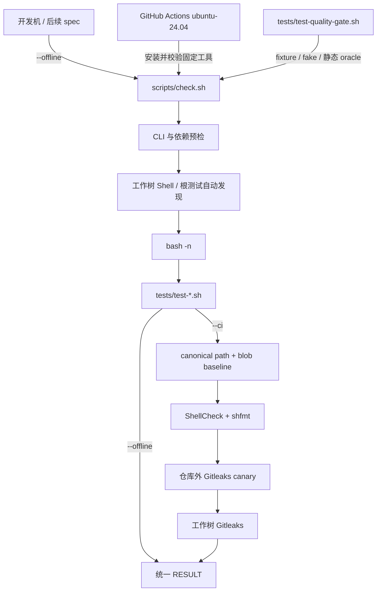
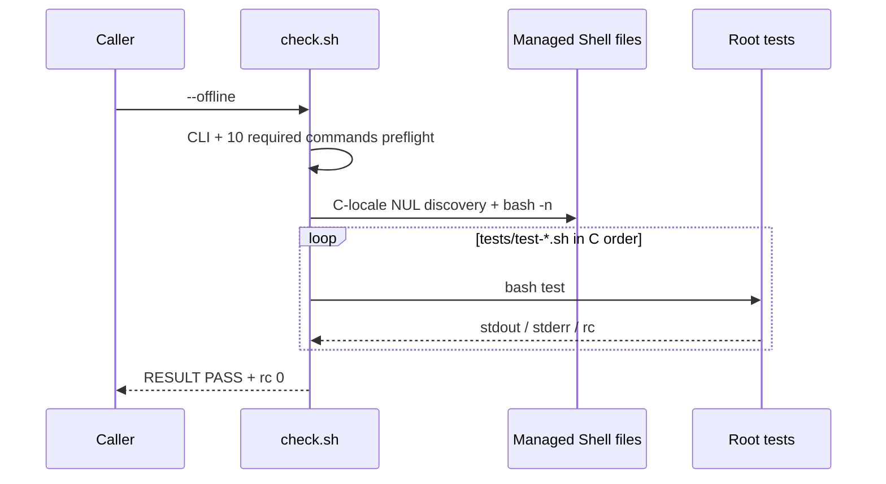
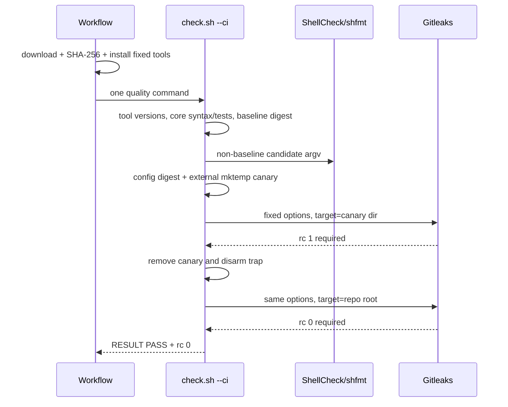

# 任务 1.3: 固定 CI 工具预检

> 这是你的需求。数值、签名、命令一律照抄，不要自己发挥。
> 你只做这一个任务，不要顺手做别的。不要派 subagent。

---

## 完整上下文

下面是整个 spec 的三个文件，让你了解整体需求、设计和任务分解。
**但你只执行「你的任务」那一节，不要去做别的任务。**

### Requirements

> 用户原话：
> “$spec review 这套 aosp harness 工程，有哪些欠缺的地方，进行重构和完善”；用户已通过 PLAN v4，并要求后续按 autopilot 执行。

## 目标

建立一个稳定、可扩展且本地不依赖可选静态工具或外部环境的根级离线质量门禁；CI 用固定工具链执行增量 Shell 与 working-tree 秘密检查，后续规格只需新增根级测试即可进入同一验收入口。

## 术语

- “受管 Shell 入口”是仓库根目录下除 `.git/`、`.spec/` 外的普通文件，且路径以 `.sh` 结尾或首行精确为 `#!/usr/bin/env bash`、`#!/bin/bash`；不跟随符号链接。枚举与排序固定使用 `LC_ALL=C`。
- “历史 baseline”只指从锚点 `b143821925e279401334d09a788ba9a969df5c7c` 的 Git tree 按上条规则枚举出的全部 30 个受管 Shell 入口，并按 `path<TAB>git-blob\n`、`LC_ALL=C` 排序形成的 `scripts/shell-quality-baseline.tsv`；canonical 文件 SHA-256 必须为 `62211b0b05c8ada6e48e408696244a655e1b0cb728c3a5406b601fc0af074a5f`，同时固定在 gate 与 contract test。CI 运行时只校验该固定文件，无需读取锚点历史。baseline 变更必须形成新的 PLAN/DECISIONS 裁定，单独追加当前 blob 不构成授权。

## 需求

R1. [默认] 当 `scripts/check.sh` 收到唯一参数 `--offline` 时，系统必须先对全部受管 Shell 入口执行 bash 语法检查，再按 `LC_ALL=C` 路径字典序逐个执行普通文件 `tests/test-*.sh`，且仅在全部成功后以退出码 `0` 和末行精确 `RESULT PASS  aosp-harness offline quality gate` 结束；无参数、未知参数或额外参数必须返回 `2`。

R2. [默认] 如果发生 offline 必需的 bash、git、python3、rg、find、sort、awk、sed、grep、sha256sum 任一命令缺失，系统必须在任何语法或测试执行前向 stderr 指明缺失命令、返回 `2` 且不打印总成功行。

R3. [默认] 当后续规格使 `tests/test-*.sh` 集合发生变化时，系统必须从工作树自动发现当前集合，不得在 gate 中硬编码 provider 测试文件名；语法错误或任一测试失败时必须返回 `1`，分别原样转发失败测试的 stdout/stderr，停止后续测试且不打印总成功行。

R4. [计划] 在 `--offline` 运行期间，系统必须不探测、不调用也不因缺少 ShellCheck、shfmt、Gitleaks 而改变语义，并且不得访问网络、真实 ADB/CVD、AOSP build 或已安装的 Claude/Codex 客户端。

R5. [默认] 如果发生 `scripts/check.sh --ci` 所需的 ShellCheck `0.11.0`、shfmt `3.14.0`、Gitleaks `8.30.1` 任一命令缺失或版本不符，系统必须在运行语法/测试/静态检查前向 stderr 指明工具与期望版本、返回 `2` 且不打印总成功行。

R6. [默认] 当 `--ci` 工具预检通过时，系统必须先执行与 `--offline` 相同的语法与根测试，再对不匹配批准 baseline 的全部受管 Shell 入口执行 `shellcheck -x --severity=warning` 与 `shfmt -d -i 2 -ci -bn`；随后必须校验 `.gitleaks.toml` 字节精确为 `[extend]`、`useDefault = true` 两行且 SHA-256 为 `27630a96d6c55755cc37620f3933d5cab94b1eb78a726a32e11212972525d76e`，清除 GITLEAKS_CONFIG/GITLEAKS_CONFIG_TOML，用运行时拼接的临时 AWS access-key canary 证明同一 config/argv 的真实 Gitleaks 精确返回 `1`，再执行 `gitleaks dir --no-banner --redact --exit-code 1 --config <repo>/.gitleaks.toml <repo>`；baseline/config 摘要或格式不符、canary 未被检出必须返回 `2`，工具对真实工作树执行后的任意非零必须归一为检查失败 `1`。

R7. [默认] 当仓库 CI 被 push、pull request 或 workflow dispatch 触发时，系统必须使用 `ubuntu-24.04` x86_64 runner，从三个官方 release tag 下载固定 Linux x86_64/amd64 资产并校验已裁定 SHA-256，安装后只调用一次 `./scripts/check.sh --ci`；workflow 中的版本、资产、摘要必须与 gate 契约一致。

R8. [默认] 系统必须提供 `tests/COVERAGE.md` 需求到测试矩阵，表头固定包含 Test、Specs/requirements、Protected behavior、Offline boundary、Status；每个已存在根级 `tests/test-*.sh` 必须精确出现一次且各字段非空，Status 只能为 active，不得把文件数、函数数或调用数表述为行/分支覆盖率。

R9. [默认] 系统必须提供离线 gate contract 回归，使用临时 fixture 与 fake 工具分别证明无参数、未知参数、额外参数三类 CLI 错误，必需依赖/CI 工具预检早于语法和根测试，受管集合与 Bash 语法失败，C-locale 字典序发现，stdout/stderr 转发和短路，offline 可选工具隔离，批准 baseline 命中，baseline 扩增/摘要变化拒绝，新增或变化 Shell 必检，固定 Gitleaks 两次调用的 argv/env/canary/失败传播，三类 CI trigger/runner/资产摘要以及 COVERAGE 字段；回归不得下载工具或访问外部服务。

## 验收标准

主验证命令: bash ./scripts/check.sh --offline
期望输出: 退出码为 `0`，stdout 末行精确为 `RESULT PASS  aosp-harness offline quality gate`

验收清单:

- [ ] fixture 中的 gate 自身、一个无扩展名 Bash 入口、一个新根测试和一个语法错误 `.sh` 均被受管集合发现；语法错误时 gate 返回 `1`、根测试不执行且无总成功行。
- [ ] fixture 以非字典序创建三个根测试；成功时按 `LC_ALL=C` 路径序各执行一次，中间失败时其 stdout/stderr 唯一 marker 各原样出现一次、后续 marker 不出现、gate 返回 `1` 且无总成功行。
- [ ] 无参数、未知参数、额外参数三类调用均返回 `2`、stderr 含 usage、syntax/root-test marker 为 `0` 且无总成功行；对十个 offline 必需命令逐个构造缺失 case，也均在 syntax/root-test marker 为 `0` 时返回 `2`；私有 poison `PATH` 与 `GIT_ALLOW_PROTOCOL=file` 下运行真实 `--offline` 时，ShellCheck/shfmt/Gitleaks 及 `adb`、`cvd`、`curl`、`wget`、`ssh`、`repo`、`ninja`、Claude/Codex poison 日志调用数均为 `0`。
- [ ] 对 ShellCheck、shfmt、Gitleaks 分别构造缺失和错版本 fake，`--ci` 均在 syntax/root-test marker 为 `0` 时返回 `2` 并报告期望版本；三者版本正确时，fake 断言 ShellCheck/shfmt 参数和 Gitleaks canary/工作树两次调用的精确参数、扫描根、显式 config 及两个配置环境变量已清除。
- [ ] canonical baseline 精确为 30 行和固定摘要，原始 `path + blob` 可豁免历史文件；单独追加新增/变化文件当前 pair、修改摘要、重复/乱序/畸形/非锚点条目均返回 `2`；baseline 不变时新增或变化 Shell 入口必须调用两个静态工具；config 精确内容/摘要与临时 canary 自检均通过，空规则、全局 allowlist 或 canary 返回 `0` 必须返回 `2`，任一静态工具或工作树 Gitleaks 非零使 gate 返回 `1`。
- [ ] CI workflow 精确包含 `push`、`pull_request`、`workflow_dispatch`，runner 为 `ubuntu-24.04`，三个官方 tag/资产/SHA-256 与 requirements 的 autopilot 裁定一致，且最终质量步骤只出现一次 `./scripts/check.sh --ci`。
- [ ] `tests/COVERAGE.md` 使用 R8 的五列表头；`tests/test-device-safety.sh` 与 `tests/test-quality-gate.sh` 各精确出现一次且五列非空，自动发现的每个根测试路径都有唯一 `active` 行，文档不含数字覆盖率宣称。

不变量（不许劣化，2-4 项）:

- 离线验收的真实网络/ADB/CVD/AOSP build/客户端调用数 ≤ `0`，验证: `tests/test-quality-gate.sh` 的 poison 日志、`GIT_ALLOW_PROTOCOL=file` 与真实 `bash ./scripts/check.sh --offline`。
- 当前三套旧回归和 device-safety 回归失败数 ≤ `0`，验证: `bash ./scripts/check.sh --offline` 的自动发现与 `tests/test-device-safety.sh` 内 legacy 聚合。
- 三个 `CURRENT_FEATURE` 的前后内容 hash 变化数 ≤ `0`，验证: `tests/test-quality-gate.sh` 在 gate 前后保存并逐字比较 `git hash-object claude-code/CURRENT_FEATURE codex/CURRENT_FEATURE common/CURRENT_FEATURE` 输出。

## 超出范围

- 不在本 spec 清零全部历史 ShellCheck/shfmt 债务；批准 baseline 只豁免锚点提交中内容未变化的条目，新内容必须通过固定参数的静态检查。
- 不引入数字行/分支覆盖率阈值，不把当前测试体量外推成覆盖率结论；文档与 readiness 的最终完整性由 `10` 处理。
- 不执行真实 ADB、CVD、AOSP build、Claude/Codex 客户端或外部服务；CI workflow 的下载步骤只在 CI 安装阶段运行，gate contract 回归保持无网络。
- 不修改后续 session、lease、verifier、runtime、registry 或 adapter 行为；它们只通过新增根级测试被自动纳入 gate。
- 实现仍受 PLAN 的 8 个非生成文件、400 行新增+删除 review-package 硬门约束；本 requirements 不用未绑定占位符重复定义该流程门。
- 不发布或推送。

## 实现可行性预算

本片只允许 6 个非生成实现文件，新增+删除预算如下；tasks 若无法在这些上限内给出可审查的表驱动 fixture，必须在执行前回 PLAN 拆片。

| 文件 | 最大新增+删除行 |
|---|---:|
| `scripts/check.sh` | 105 |
| `scripts/shell-quality-baseline.tsv` | 30 |
| `.gitleaks.toml` | 2 |
| `.github/workflows/quality.yml` | 42 |
| `tests/COVERAGE.md` | 8 |
| `tests/test-quality-gate.sh` | 200 |
| 合计 | 387 |

## autopilot 裁定

- 必答问题 `0` 个，带推荐问题 `0` 个；本地/CI 分流、自动发现、版本固定和 gate test 均来自已确认 PLAN，具体默认已按用户的 autopilot 授权裁定。
- Offline 必需依赖按当前被消费回归的真实调用面固定为 Bash、Git、Python 3、ripgrep 和列出的基础命令；缺失属于可诊断的协议/环境错误 `2`，不伪装成测试失败。
- 工具固定为 ShellCheck `0.11.0`（`shellcheck-v0.11.0.linux.x86_64.tar.xz`，`https://github.com/koalaman/shellcheck/releases/download/v0.11.0/`）、shfmt `3.14.0`（`shfmt_v3.14.0_linux_amd64`，`https://github.com/mvdan/sh/releases/download/v3.14.0/`）、Gitleaks `8.30.1`（`gitleaks_8.30.1_linux_x64.tar.gz`，`https://github.com/gitleaks/gitleaks/releases/download/v8.30.1/`）。对应 SHA-256 依次为 `8c3be12b05d5c177a04c29e3c78ce89ac86f1595681cab149b65b97c4e227198`、`fe42021c7272ef2d67ea36cbc3031683c625d0badec733ef3a57b567246a0b66`、`551f6fc83ea457d62a0d98237cbad105af8d557003051f41f3e7ca7b3f2470eb`。
- 当前历史 Shell 不满足固定 ShellCheck/shfmt 参数，无法在本片预算内清零；采用锚定提交、固定摘要的 immutable baseline 做增量收紧。若判断错误，代价是历史未改脚本暂时保留静态债务；若不设 baseline，8 文件/400 行内无法得到绿色 CI，且会越权修改后续 spec 的文件。

### Design

# 2026-09-01-02-offline-quality-gate 设计

## 概述

方案是在仓库根新增单一 Bash gate：`--offline` 只做依赖预检、全工作树 Shell 语法和根测试，`--ci` 在同一核心之后追加由 immutable blob baseline 约束的增量静态检查与真实 Gitleaks 扫描；GitHub Actions 只负责安装经摘要校验的固定工具并调用该 gate。

关键决策：

1. 选择“工作树自动发现 + C locale + fail-fast”，使后续规格新增根测试无需修改 gate；放弃硬编码测试清单，因为它会让 provider 回滚和新测试注册重新耦合到 02。
2. 选择锚点提交的 canonical 30 行 `path + blob` baseline，只豁免完全未变化的历史 Shell；放弃一次性格式化旧脚本，因为它会超过 400 行预算并越过后续 spec 的文件所有权，也放弃路径级豁免，因为同路径变化可绕过检查。
3. 选择固定两行 Gitleaks config、摘要校验和每次 CI 的仓库外真实 canary；放弃只用 fake 或任意仓库 config，因为空规则、环境覆盖和全局 allowlist 都能制造假绿。

## 需求映射

| 组件 | 实现的需求 |
|---|---|
| 根质量 gate `scripts/check.sh` | R1, R2, R3, R4, R5, R6 |
| canonical Shell baseline + Gitleaks config | R6 |
| GitHub Actions workflow | R7 |
| coverage 矩阵 | R8 |
| gate contract 回归 | R1, R2, R3, R4, R5, R6, R7, R8, R9 |

## 架构



Gate 是唯一行为入口；workflow 不复制检查逻辑。离线层只依赖 requirements 列出的基础命令，不查找三个可选工具。CI 层固定 ShellCheck 0.11.0、shfmt 3.14.0、Gitleaks 8.30.1。文件发现从仓库绝对根执行，排除 `.git/.spec`，只取普通文件，不跟随软链，所有列表用 NUL 分隔并以 `LC_ALL=C sort -z` 排序，避免空格或换行路径破坏边界。

## 组件与接口

### 根质量 gate

- 职责：解析唯一 mode，完成分层预检、发现、语法、根测试，以及 CI 增量静态/秘密检查；任何失败都禁止打印总成功行。
- 对外接口：scripts/check.sh --offline|--ci —— 成功时退出 0 且 stdout 末行为 RESULT PASS  aosp-harness offline quality gate；参数/依赖/工具预检错误返回 2，语法/测试/静态/秘密检查失败返回 1，失败时不得输出该成功末行
- 依赖：Bash、Git、Python 3、ripgrep、requirements 列出的基础命令；CI mode 再依赖三个精确版本工具、baseline 和 config。
- 内部边界：`quality_list_shell_files` 只向 stdout 写 NUL 分隔相对路径；`quality_run_core` 只做 syntax + root tests；`quality_run_ci` 只接收 core 成功后的文件集合，不复刻 core。

### 已消费的 device-safety 回归

- 职责：作为首个自动发现的 provider test，继续聚合三套 legacy 回归。
- 对外接口：tests/test-device-safety.sh —— 无参数；全部通过时退出 0 且 stdout 末行为 RESULT PASS  device safety，任一断言失败时退出非零
- 依赖：由根 gate 提供可诊断的基础依赖环境；其私有 fake ADB 隔离保持不变。

### canonical baseline 与 Gitleaks config

- 职责：baseline 仅记录锚点 30 个 Shell blob；config 仅继承 Gitleaks 8.30.1 默认规则。二者均由 gate 内置完整 SHA-256 验证。
- 对外接口：`scripts/shell-quality-baseline.tsv` 每行 `path<TAB>40-hex-git-blob`；`.gitleaks.toml` 字节精确为 `[extend]\nuseDefault = true\n`。
- 依赖：baseline 运行时不读取锚点对象；当前文件用 `git hash-object` 与固定 pair 比较。

### CI workflow

- 职责：在三个触发器上下载固定 x86_64/amd64 资产，逐个校验 SHA-256并安装为 `$RUNNER_TEMP/aosp-harness-quality/bin/{shellcheck,shfmt,gitleaks}`；安装 step 把该绝对目录追加到 `$GITHUB_PATH`，独立 quality step 因而能从 PATH 找到三者并唯一一次调用 gate 的 CI mode。
- 对外接口：`.github/workflows/quality.yml`，触发 `push|pull_request|workflow_dispatch`，runner `ubuntu-24.04`。
- 依赖：`actions/checkout`、curl/tar/install/sha256sum，以及以下唯一 artifact-to-executable 映射；检查行为仅来自 `scripts/check.sh --ci`。

| 下载资产 | SHA-256 | 安装来源 | 安装目标 |
|---|---|---|---|
| `shellcheck-v0.11.0.linux.x86_64.tar.xz` | `8c3be12b05d5c177a04c29e3c78ce89ac86f1595681cab149b65b97c4e227198` | 解包后的 `shellcheck-v0.11.0/shellcheck` | `bin/shellcheck` |
| `shfmt_v3.14.0_linux_amd64` | `fe42021c7272ef2d67ea36cbc3031683c625d0badec733ef3a57b567246a0b66` | 下载文件本身 | `bin/shfmt` |
| `gitleaks_8.30.1_linux_x64.tar.gz` | `551f6fc83ea457d62a0d98237cbad105af8d557003051f41f3e7ca7b3f2470eb` | 解包后的 `gitleaks` | `bin/gitleaks` |

三个目标统一由 `install -m 0755` 写入。安装 step 使用 shell `set -euo pipefail`，只有三份摘要、解包和安装全成功后才写 `$GITHUB_PATH`；任一步失败都不会进入 quality step。

### Coverage 矩阵

- 职责：把每个现存根测试一一映射到规格、保护行为、离线边界和 active 状态。
- 对外接口：`tests/COVERAGE.md` 的五列表格 `Test | Specs/requirements | Protected behavior | Offline boundary | Status`。
- 依赖：根测试文件集合；不存储数字覆盖率。

### Gate contract 回归

- 职责：用表驱动 fixture/fake 对 R1-R9 做可失败验证，并在被根 gate 嵌套执行时用 `QUALITY_GATE_NESTED=1` 只返回 child marker，避免自递归；外层测试仍完整执行。
- 对外接口：`tests/test-quality-gate.sh` 无参数；成功退出 `0` 且末行精确为 `RESULT PASS  offline quality gate contract`。
- 依赖：复制 gate/baseline/config 到 `mktemp` Git fixture；不联网、不调用真实三个 CI 工具。

## 数据模型

### Baseline TSV

```text
<repo-relative-path>\t<40-lowercase-hex-git-blob>\n
```

- 固定 30 行、C-locale 严格递增、路径和 blob 均唯一；整个文件摘要固定为 requirements 的 `62211b...a5f`。
- Gate 先验摘要；摘要不符直接返回 `2`。摘要通过后，当前文件只有 exact pair 命中才豁免，否则进入 ShellCheck/shfmt candidate 数组。
- 不提供“更新 baseline”命令；变更需新的 PLAN/DECISIONS 裁定，避免实现期自授权。

### Gitleaks config 与 canary

- Config 恰好两行 `[extend]` / `useDefault = true`，摘要固定为 requirements 的 `27630a...d76e`，不接受 repo/env 的第二配置来源。
- Canary 目录由 `mktemp -d` 创建在仓库外；`canary.txt` 的内容由片段 `AKIA` 与 `ABCDEFGHIJKLMNOP` 在运行时拼成 `aws_access_key_id = <两段连接值>`。该 20 字符值已用 Gitleaks 8.30.1 默认规则验证能产生精确退出码 `1`，完整值不在任一被跟踪单段中出现。
- 两次 Gitleaks 调用的固定 options/config 完全相同，唯一差异是最后 target：先 canary 目录，后仓库绝对根。

### Coverage Markdown

每个自动发现的根测试必须对应一行，五列非空，状态仅 `active`。Contract test 解析 Markdown 行，不把标题分隔行计为数据。

## 数据流

### Offline 主流程



任一 syntax/test 失败立即返回 `1`；测试的双流由子进程直接继承，gate 不捕获或改写。任何 preflight 失败发生在 discovery/syntax/test 之前并返回 `2`。

### CI 增量检查与秘密扫描



Canary 清理由 trap 保底，并在工作树扫描前显式完成；因此最终扫描不会包含 canary。canary 返回 `0` 或非 `1` 表示规则/config 自检无效，归类协议错误 `2`；工作树扫描非零归类检查失败 `1`。

## 错误处理

| 错误场景 | 恢复策略 | 校验位置 | 日志 | 用户可见 |
|---|---|---|---|---|
| 无/未知/额外参数 | 不执行任何检查 | CLI parser | stderr usage | rc `2`，无总 PASS |
| Offline 必需命令缺失 | fail-fast | core preflight | stderr 含命令名 | rc `2` |
| CI 工具缺失/版本错 | fail-fast，syntax/test 为零调用 | CI preflight | stderr 含实际/期望版本 | rc `2` |
| Shell 语法错误 | 首错即停 | `bash -n` 循环 | `bash -n` 原始 stderr | rc `1` |
| 根测试失败 | 原样双流，停止后续测试 | test loop | 测试原始 stdout/stderr | rc `1` |
| Baseline 摘要或格式错 | 不运行静态或秘密扫描 | static phase 前的 baseline validation | stderr 指明 baseline | rc `2` |
| ShellCheck/shfmt finding | 不继续秘密扫描 | CI static phase | 工具原始输出 | rc `1` |
| Gitleaks config 摘要或格式错 | core/static 已完成且不回滚；不运行 canary 或工作树 Gitleaks | static phase 后的 config validation | stderr 指明 config | rc `2` |
| Canary 未精确返回 `1` | trap 清理 canary，不扫工作树 | Gitleaks self-test | stderr 指明 canary contract | rc `2` |
| 工作树 Gitleaks 非零 | 已清理 canary，直接失败 | final secret phase | redacted 工具输出 | rc `1` |
| Workflow 下载/摘要/安装失败 | shell `set -e` 停止，不调用 gate | CI install step | Actions step log | workflow failure |

## 测试策略

| 层 | 测什么 | 用什么工具 |
|---|---|---|
| 单元/contract | CLI 三错误、10 个依赖、6 个工具预检、managed discovery/syntax、排序/双流/短路、baseline/config mutations、静态 argv、两次 Gitleaks 调用 | `tests/test-quality-gate.sh` 的 `mktemp` Git fixture、表驱动 fake/poison；发现 fixture 必含空格路径、实际 LF 路径、指向仓库外非法脚本的 symlink，并由 fake-sort 证明宿主 locale 被覆盖为 `LC_ALL=C`；≤200 行 |
| 集成 | 真正根 gate 自动运行 device-safety 与 gate contract；CURRENT_FEATURE 前后 hash 不变 | `QUALITY_GATE_NESTED=1 bash ./scripts/check.sh --offline`，外层 contract 检查 child marker 与 poison 日志 |
| CI 静态 | 固定版本真实 ShellCheck/shfmt；真实 Gitleaks canary 与工作树扫描；workflow contract | `./scripts/check.sh --ci`，workflow/COVERAGE 静态 oracle |
| 端到端 | 默认离线质量入口的精确末行、退出码、无真实外部调用 | `bash ./scripts/check.sh --offline` + poison PATH + `GIT_ALLOW_PROTOCOL=file` |
| 性能 | 不适用：PLAN 未设性能指标；只要求有限的本地离线门禁，不把墙钟时间写成硬阈值。 | 不适用 |

测试脚本按 fixture/helper、表驱动 case 数据、少量复合断言三层组织；不得把多个独立判据压成不可定位的一行。若实现报告的六文件总 diff 超过 400 行，必须回 PLAN 拆片，不以压缩可读性换预算。

## 文件清单

| 文件 | 创建/修改 | 职责（一句话） | 行预算 |
|---|---|---|---:|
| `scripts/check.sh` | 创建 | 根级 offline/CI gate 与唯一结果协议 | 105 |
| `scripts/shell-quality-baseline.tsv` | 创建 | 锚点提交的 canonical 30 个历史 Shell blob | 30 |
| `.gitleaks.toml` | 创建 | 固定继承 Gitleaks 默认规则 | 2 |
| `.github/workflows/quality.yml` | 创建 | 固定工具安装、摘要校验和单次 CI gate | 42 |
| `tests/COVERAGE.md` | 创建 | 根测试需求映射与离线边界矩阵 | 8 |
| `tests/test-quality-gate.sh` | 创建 | R1-R9 离线 contract 与 workflow/doc oracle | 200 |

总计 6 个非生成文件、最多 387 行，给 PLAN 的 400 行硬门保留 13 行余量；文件职责和预算在 tasks 中不得扩大。

### 所有任务

# 2026-09-01-02-offline-quality-gate 实现计划

## Gate contract 与分层实现

### 任务 1.1: 锁定 CLI 与 offline 依赖预检

文件: 创建 `tests/test-quality-gate.sh`、创建 `scripts/check.sh`
消费: 无
产出: scripts/check.sh --offline —— 仅接受唯一 mode 参数；CLI 或十个 core 命令预检失败时在 syntax/root-test 前退出 2，空 fixture 成功时末行精确为总 PASS
需求: R1, R2, R9
必需: 是
状态: 完成

- [ ] 步骤 1: 创建可清理的临时 Git fixture、断言 rc/末行/marker 的 helper 与 `QUALITY_GATE_NESTED=1` 防递归分支；污染 PATH 前保存并验证 `host_bash="$(command -v bash)"` 为绝对可执行路径，再用它启动每个 gate。表驱动覆盖无参数、`--unknown`、`--offline extra` 以及逐个隐藏 `bash git python3 rg find sort awk sed grep sha256sum`；缺 bash case 也必须由 `"$host_bash" fixture/scripts/check.sh --offline` 启动且传入的 PATH 中没有 bash。每个失败 case 都放入非法 `.sh` 和会写 marker 的根测试，并断言 rc `2`、stderr 含 usage 或 gate 自己输出的 `missing required command: <name>`、两个 marker 均为 `0`、无总 PASS。

  ```bash
  host_bash="$(command -v bash)"
  [[ "$host_bash" == /* && -x "$host_bash" ]]
  if [[ "${QUALITY_GATE_NESTED-}" == 1 ]]; then
    printf 'RESULT PASS  offline quality gate child\n'
    exit 0
  fi
  offline_required=(bash git python3 rg find sort awk sed grep sha256sum)
  set +e
  PATH="$case_bin" "$host_bash" "$fixture/scripts/check.sh" --offline \
    >"$stdout_file" 2>"$stderr_file"
  rc=$?
  set -e
  [[ "$rc" -eq 2 && ! -s "$syntax_marker" && ! -s "$test_marker" ]]
  grep -Fq "missing required command: $missing" "$stderr_file"
  ```
- [ ] 步骤 2: 跑 `bash ./tests/test-quality-gate.sh`，确认红阶段非零且首个失败标签为 `FAIL  cli no-argument: expected rc=2`，因为 gate 尚不存在。
- [ ] 步骤 3: 在 `scripts/check.sh` 实现唯一参数 parser、十命令 `command -v` 预检、从脚本位置求绝对 repo root 与统一 `quality_protocol_error`；此片只让无受管错误/根测试的 fixture 输出精确总 PASS，所有错误只写 stderr。

  ```bash
  quality_protocol_error() { printf 'error: %s\n' "$*" >&2; exit 2; }
  [[ "$#" -eq 1 && ( "$1" == --offline || "$1" == --ci ) ]] ||
    quality_protocol_error 'usage: scripts/check.sh --offline|--ci'
  mode="$1"
  for command_name in bash git python3 rg find sort awk sed grep sha256sum; do
    command -v "$command_name" >/dev/null 2>&1 ||
      quality_protocol_error "missing required command: $command_name"
  done
  repo_root="$(cd -- "${BASH_SOURCE[0]%/*}/.." && pwd -P)"
  cd -- "$repo_root"
  ```
- [ ] 步骤 4: 跑 `bash ./tests/test-quality-gate.sh`，确认 13 个 preflight case 全部通过，exit `0` 且末行精确为 `RESULT PASS  offline quality gate contract`。
- [ ] 步骤 5: 跑 `chmod +x ./scripts/check.sh ./tests/test-quality-gate.sh && bash -n ./scripts/check.sh && bash -n ./tests/test-quality-gate.sh && for file in ./scripts/check.sh ./tests/test-quality-gate.sh; do test -z "$(git diff --no-index --check /dev/null "$file" 2>&1 || :)" || exit 1; done`，确认两个未跟踪入口可执行、语法和全文件空白检查均通过；本任务对 test/gate 的累计改动分别不超过 45/25 行。

### 任务 1.2: 自动发现并执行 offline 核心

文件: 修改 `tests/test-quality-gate.sh`、修改 `scripts/check.sh`
消费: scripts/check.sh --offline —— 仅接受唯一 mode 参数；CLI 或十个 core 命令预检失败时在 syntax/root-test 前退出 2，空 fixture 成功时末行精确为总 PASS
产出: scripts/check.sh --offline —— 预检后以 LC_ALL=C、NUL 边界发现全部受管 Shell，先 bash -n 再按序 fail-fast 执行 tests/test-*.sh，成功末行精确为总 PASS
需求: R1, R3, R4, R9
必需: 是
状态: 完成

- [ ] 步骤 1: 扩展同一 fixture：加入 gate 自身、无扩展名 Bash、空格路径、实际 LF 路径、非法 `.sh`、`.git/.spec` 下脚本和指向仓库外非法脚本的 symlink；PATH 中 fake `bash` 对每个 `-n` 目标以 NUL 记录后委托保存的绝对 `host_bash`，fake `sort` 断言 `LC_ALL=C`。精确断言 gate/无扩展名/空格/LF/非法 `.sh` 各被 `-n` 一次，symlink 与 `.git/.spec` 路径零次，且全部 `-n` 记录先于首个 root marker；fixture 的 `tests/test-quality-gate.sh` 仅在 `QUALITY_GATE_NESTED=1` 时写唯一 child marker，否则写 body marker，断言普通 gate 调用只写一次 child、body 为零。另以非字典序创建三个根测试，断言语法失败时测试零调用、成功时 C 序各一次、中间失败的 stdout/stderr marker 各原样一次且后续 marker 为零。

  ```bash
  if [[ "${1-}" == -n ]]; then
    printf '%s\0' "$2" >>"$SYNTAX_LOG"
  fi
  exec "$HOST_BASH" "$@"
  # fixture/tests/test-quality-gate.sh
  [[ "${QUALITY_GATE_NESTED-}" == 1 ]] || { printf 'body\n' >>"$BODY_LOG"; exit 97; }
  printf 'RESULT PASS  offline quality gate child\n'
  fixture="$(cd -- "$fixture" && pwd -P)"; unrelated="$(mktemp -d)"
  mkdir -p "$unrelated/tests"
  printf '#!/bin/bash\nprintf poison >>%q\n' "$outside_marker" >"$unrelated/tests/test-poison.sh"
  (cd -- "$unrelated" && "$host_bash" "$fixture/scripts/check.sh" --offline)
  [[ ! -s "$outside_marker" ]]
  ```

- [ ] 步骤 2: 加入真实仓库边界 case：保存三个 `CURRENT_FEATURE` 的 `git hash-object`，以私有 poison PATH 与 `GIT_ALLOW_PROTOCOL=file` 普通调用真实 `--offline`（调用方不得预设 `QUALITY_GATE_NESTED`），用 Python `subprocess.run(..., timeout=30)` 限制递归风险；断言输出仅含一次 child marker，ShellCheck/shfmt/Gitleaks、adb/cvd/curl/wget/ssh/repo/ninja、Claude/Codex 日志总调用数为 `0` 且三个 hash 不变。跑 `bash ./tests/test-quality-gate.sh` 确认红阶段首错含 `managed shell syntax was not checked`。

  ```bash
  "$host_python" - "$repo_root" "$host_bash" <<'PY'
  import os, subprocess, sys
  result = subprocess.run([sys.argv[2], "./scripts/check.sh", "--offline"], cwd=sys.argv[1],
                          env=os.environ.copy(), text=True, capture_output=True, timeout=30)
  assert result.returncode == 0, (result.stdout, result.stderr)
  assert result.stdout.count("RESULT PASS  offline quality gate child") == 1
  PY
  ```
- [ ] 步骤 3: 在 gate 用 `find -print0`、首行精确 Bash shebang 检测、数组和 `LC_ALL=C sort -z` 实现 `quality_list_shell_files`；排除 `.git/.spec`、只接受普通文件且不跟随 symlink，再让 `quality_run_core` 先逐文件 `bash -n`、后逐个直接继承双流运行 C 序根测试，任一非零归一为 rc `1` 并短路。

  ```bash
  quality_list_shell_files() {
    find . -path './.git' -prune -o -path './.spec' -prune -o -type f -print0 |
      while IFS= read -r -d '' path; do
        [[ "$path" == *.sh || "$(sed -n '1p' "$path")" == '#!/usr/bin/env bash' ||
          "$(sed -n '1p' "$path")" == '#!/bin/bash' ]] && printf '%s\0' "${path#./}"
      done | LC_ALL=C sort -z
  }
  for test_path in "${root_tests[@]}"; do
    QUALITY_GATE_NESTED=1 bash "$test_path" || return 1
  done
  ```
- [ ] 步骤 4: 跑 `bash ./tests/test-quality-gate.sh`，确认 managed-set、syntax、排序、双流、短路、poison 与 hash case 全部通过，exit `0` 且末行为 contract PASS。
- [ ] 步骤 5: 跑 `bash ./scripts/check.sh --offline`，确认 exit `0` 且 stdout 末行为 `RESULT PASS  aosp-harness offline quality gate`；再跑 `git diff --check`，本任务新增 test/gate 改动分别不超过 45/30 行、累计不超过 90/55 行。

### 任务 1.3: 固定 CI 工具预检

文件: 修改 `tests/test-quality-gate.sh`、修改 `scripts/check.sh`
消费: scripts/check.sh --offline —— 预检后以 LC_ALL=C、NUL 边界发现全部受管 Shell，先 bash -n 再按序 fail-fast 执行 tests/test-*.sh，成功末行精确为总 PASS
产出: scripts/check.sh --ci —— 在 core 之前要求 ShellCheck 0.11.0、shfmt 3.14.0、Gitleaks 8.30.1，缺失或错版本返回 2 且 syntax/root-test 零调用
需求: R5, R9
必需: 是

- [ ] 步骤 1: 为三个 fake 工具各写正确版本响应，再表驱动构造“缺失”和“错版本”六个 case；每个 fixture 同时放非法 Shell 与 root marker，断言 rc `2`、stderr 同时含工具名和期望版本、syntax/root-test marker 均为 `0`、无总 PASS。

  ```bash
  tool_cases=(
    'shellcheck|0.11.0' 'shfmt|3.14.0' 'gitleaks|8.30.1'
  )
  case "${0##*/}:$1" in
    shellcheck:--version) printf 'version: %s\n' "$FAKE_VERSION" ;;
    shfmt:--version) printf 'v%s\n' "$FAKE_VERSION" ;;
    gitleaks:version) printf '%s\n' "$FAKE_VERSION" ;;
    *) exit 90 ;;
  esac
  ```
- [ ] 步骤 2: 跑 `bash ./tests/test-quality-gate.sh`，确认红阶段非零且首错为 `FAIL  ci shellcheck missing: expected rc=2 before core`。
- [ ] 步骤 3: 在 gate 的 mode 分支中仅为 `--ci` 增加三工具存在性与版本字符串预检，顺序固定在 `quality_run_core` 之前；`--offline` 路径不得执行三个命令的 `--version`。

  ```bash
  if [[ "$mode" == --ci ]]; then
    for tool_spec in shellcheck:0.11.0 shfmt:3.14.0 gitleaks:8.30.1; do
      tool="${tool_spec%%:*}"; expected="${tool_spec#*:}"
      command -v "$tool" >/dev/null 2>&1 || quality_protocol_error "missing $tool $expected"
    done
    [[ "$(shellcheck --version | awk '/^version:/ {print $2}')" == 0.11.0 ]] ||
      quality_protocol_error 'expected shellcheck 0.11.0'
    [[ "$(shfmt --version)" == v3.14.0 ]] || quality_protocol_error 'expected shfmt 3.14.0'
    [[ "$(gitleaks version)" == 8.30.1 ]] || quality_protocol_error 'expected gitleaks 8.30.1'
  fi
  ```
- [ ] 步骤 4: 跑 `bash ./tests/test-quality-gate.sh`，确认六个 CI preflight case 与全部 offline case 通过，exit `0` 且末行为 contract PASS。
- [ ] 步骤 5: 跑 `bash -n ./scripts/check.sh && bash -n ./tests/test-quality-gate.sh && git diff --check`；本任务新增 test/gate 改动分别不超过 20/15 行、累计不超过 110/70 行。

### 任务 1.4: 落地 canonical baseline 与增量静态检查

文件: 修改 `tests/test-quality-gate.sh`、修改 `scripts/check.sh`、创建 `scripts/shell-quality-baseline.tsv`
消费: scripts/check.sh --ci —— 在 core 之前要求 ShellCheck 0.11.0、shfmt 3.14.0、Gitleaks 8.30.1，缺失或错版本返回 2 且 syntax/root-test 零调用
产出: scripts/shell-quality-baseline.tsv —— 30 行 C 序 path<TAB>git-blob canonical 文件且 SHA-256 为 62211b0b05c8ada6e48e408696244a655e1b0cb728c3a5406b601fc0af074a5f、scripts/check.sh --ci —— exact pair 命中才豁免，否则运行固定 ShellCheck/shfmt argv
需求: R6, R9
必需: 是

- [ ] 步骤 1: 从锚点 `b143821925e279401334d09a788ba9a969df5c7c` 的 Git tree 按受管规则生成 30 行 canonical TSV；断言行数、严格 C 序、path/blob 唯一、40 位小写 blob 和文件 SHA-256 精确匹配 requirements，禁止从当前工作树自授权扩增。

  ```bash
  anchor=b143821925e279401334d09a788ba9a969df5c7c
  git ls-tree -r -z "$anchor" |
    while IFS= read -r -d '' entry; do
      meta="${entry%%$'\t'*}"; path="${entry#*$'\t'}"; mode="${meta%% *}"
      [[ "$mode" == 100644 || "$mode" == 100755 ]] || continue
      [[ "$path" != .spec/* && "$path" != .git/* ]] || continue
      first="$(git show "$anchor:$path" 2>/dev/null | sed -n '1p')"
      [[ "$path" == *.sh || "$first" == '#!/usr/bin/env bash' || "$first" == '#!/bin/bash' ]] || continue
      printf '%s\t%s\n' "$path" "$(git rev-parse "$anchor:$path")"
    done | LC_ALL=C sort >scripts/shell-quality-baseline.tsv
  ```
- [ ] 步骤 2: 扩展 contract：原始 baseline pair 命中时两静态工具零调用；新增/变化 Shell 必须分别收到 `shellcheck -x --severity=warning` 与 `shfmt -d -i 2 -ci -bn`；单独追加当前 pair、改摘要、重复、乱序、畸形与非锚点条目均返回 `2` 且秘密工具零调用，任一静态 fake 非零使 gate 返回 `1`。

  ```bash
  python3 - "$shellcheck_log" -x --severity=warning "$candidate" <<'PY'
  from pathlib import Path
  import sys
  got = Path(sys.argv[1]).read_bytes().split(b'\0')
  assert got[-1] == b'' and got[:-1] == [arg.encode() for arg in sys.argv[2:]], got
  PY
  python3 - "$shfmt_log" -d -i 2 -ci -bn "$candidate" <<'PY'
  from pathlib import Path
  import sys
  got = Path(sys.argv[1]).read_bytes().split(b'\0')
  assert got[-1] == b'' and got[:-1] == [arg.encode() for arg in sys.argv[2:]], got
  PY
  baseline_mutations=(append-current wrong-digest duplicate unsorted malformed non-anchor)
  ```
- [ ] 步骤 3: 跑 `bash ./tests/test-quality-gate.sh`，确认红阶段非零且首错为 `FAIL  baseline canonical digest mismatch`。
- [ ] 步骤 4: 在 gate 内固定 baseline 摘要，先校验摘要和 30 行 canonical 格式/顺序/唯一性，再用 `git hash-object` 判断 exact pair；以 NUL 数组把其余受管文件逐个传给两个固定 argv，baseline 协议错误返回 `2`、静态 finding 返回 `1`。

  ```bash
  baseline_sha=62211b0b05c8ada6e48e408696244a655e1b0cb728c3a5406b601fc0af074a5f
  [[ "$(sha256sum "$baseline_file" | awk '{print $1}')" == "$baseline_sha" ]] ||
    quality_protocol_error 'baseline canonical digest mismatch'
  declare -A approved=()
  while IFS=$'\t' read -r path blob; do approved["$path"]="$blob"; done <"$baseline_file"
  for path in "${shell_files[@]}"; do
    [[ "${approved[$path]-}" == "$(git hash-object "$path")" ]] && continue
    shellcheck -x --severity=warning "$path" || return 1
    shfmt -d -i 2 -ci -bn "$path" || return 1
  done
  ```
- [ ] 步骤 5: 跑 `bash ./tests/test-quality-gate.sh`，确认 baseline mutation、candidate 和 static failure 全通过；再跑 `test "$(wc -l < scripts/shell-quality-baseline.tsv)" -eq 30 && test "$(sha256sum scripts/shell-quality-baseline.tsv | awk '{print $1}')" = 62211b0b05c8ada6e48e408696244a655e1b0cb728c3a5406b601fc0af074a5f && test -z "$(git diff --no-index --check /dev/null scripts/shell-quality-baseline.tsv 2>&1 || :)" && git diff --check`；本任务新增 test/gate/baseline 改动分别不超过 35/15/30 行、累计不超过 145/85/30 行。

### 任务 1.5: 用真实 canary 保护 Gitleaks 扫描

文件: 修改 `tests/test-quality-gate.sh`、修改 `scripts/check.sh`、创建 `.gitleaks.toml`
消费: scripts/shell-quality-baseline.tsv —— 30 行 C 序 path<TAB>git-blob canonical 文件且 SHA-256 为 62211b0b05c8ada6e48e408696244a655e1b0cb728c3a5406b601fc0af074a5f、scripts/check.sh --ci —— exact pair 命中才豁免，否则运行固定 ShellCheck/shfmt argv
产出: scripts/check.sh --offline|--ci —— 成功时退出 0 且 stdout 末行为 RESULT PASS  aosp-harness offline quality gate；参数/依赖/工具预检错误返回 2，语法/测试/静态/秘密检查失败返回 1，失败时不得输出该成功末行、.gitleaks.toml —— 字节精确为 [extend]\nuseDefault = true\n 且固定摘要
需求: R6, R9
必需: 是

- [ ] 步骤 1: 创建精确两行 config；扩展 fake Gitleaks 记录 NUL argv/env/target，并断言 gate 清除两个配置环境变量、先扫描 repo 外 canary 后扫描 repo、两次固定 options/config 完全相同且只有 target 不同、canary 文件由 `AKIA` 与 `ABCDEFGHIJKLMNOP` 运行时拼成并在第二次调用前已清理。

  ```bash
  printf '[extend]\nuseDefault = true\n' >.gitleaks.toml
  printf 'GITLEAKS_CONFIG=%s\0GITLEAKS_CONFIG_TOML=%s\0' \
    "${GITLEAKS_CONFIG-unset}" "${GITLEAKS_CONFIG_TOML-unset}" >>"$GITLEAKS_LOG"
  printf '%s\0' "$@" >>"$GITLEAKS_LOG"
  [[ "$call_index" -eq 1 ]] && exit "$CANARY_RC"
  exit "$WORKTREE_RC"
  ```
- [ ] 步骤 2: 表驱动断言 config 内容/摘要变化、空规则、全局 allowlist、canary fake 返回 `0` 或 `2` 都使 gate rc `2` 且不扫工作树；另把 `TMPDIR` 指到 fixture 仓库内，断言 gate 拒绝仓库内 canary、rc `2` 且 Gitleaks 零调用。canary 精确返回 `1` 后工作树 fake 非零必须归一 rc `1`，两阶段正确时才允许精确总 PASS；跑 `bash ./tests/test-quality-gate.sh` 确认红阶段首错含 `gitleaks config contract`。

  ```bash
  protocol_cases=(config-bytes config-digest empty-rules global-allowlist canary-rc-0 canary-rc-2)
  [[ "$canary_calls" -eq 1 && "$worktree_calls" -eq 0 && "$rc" -eq 2 ]]
  mkdir -p "$fixture/in-repo-tmp"
  set +e
  TMPDIR="$fixture/in-repo-tmp" "$host_bash" "$fixture/scripts/check.sh" --ci
  in_repo_tmp_rc=$?
  set -e
  [[ "$in_repo_tmp_rc" -eq 2 && "$in_repo_tmp_gitleaks_calls" -eq 0 ]]
  [[ "$worktree_failure_rc" -eq 1 ]]
  [[ "$success_calls" -eq 2 && "$success_last_line" ==
    'RESULT PASS  aosp-harness offline quality gate' ]]
  ```
- [ ] 步骤 3: 在 static 成功后校验 config 精确摘要；unset 两个环境变量，在 repo 外 `mktemp -d` 写入分片拼接 canary，注册 trap，以相同 `gitleaks dir --no-banner --redact --exit-code 1 --config <absolute-config> <target>` 要求 canary rc 精确 `1`，显式清理并解除 trap 后再扫绝对 repo root。

  ```bash
  config_sha=27630a96d6c55755cc37620f3933d5cab94b1eb78a726a32e11212972525d76e
  [[ "$(sha256sum "$config" | awk '{print $1}')" == "$config_sha" ]] ||
    quality_protocol_error 'gitleaks config contract'
  unset GITLEAKS_CONFIG GITLEAKS_CONFIG_TOML
  canary_dir="$(mktemp -d)"; canary_dir="$(cd -- "$canary_dir" && pwd -P)"
  case "$canary_dir/" in "$repo_root/"*) rm -rf -- "$canary_dir"; quality_protocol_error 'canary must be outside repository' ;; esac
  trap 'rm -rf -- "$canary_dir"' EXIT
  printf 'aws_access_key_id = %s%s\n' 'AKIA' 'ABCDEFGHIJKLMNOP' >"$canary_dir/canary.txt"
  gitleaks_args=(dir --no-banner --redact --exit-code 1 --config "$config")
  set +e; gitleaks "${gitleaks_args[@]}" "$canary_dir"; canary_rc=$?; set -e
  [[ "$canary_rc" -eq 1 ]] || quality_protocol_error 'gitleaks canary contract'
  rm -rf -- "$canary_dir"; trap - EXIT
  gitleaks "${gitleaks_args[@]}" "$repo_root" || exit 1
  ```
- [ ] 步骤 4: 跑 `bash ./tests/test-quality-gate.sh`，确认所有 Gitleaks/config case 通过，exit `0` 且末行为 contract PASS；再跑 `bash ./scripts/check.sh --offline`，确认真实 offline 仍 exit `0` 且末行为总 PASS。
- [ ] 步骤 5: 跑 `test "$(sha256sum .gitleaks.toml | awk '{print $1}')" = 27630a96d6c55755cc37620f3933d5cab94b1eb78a726a32e11212972525d76e && bash -n scripts/check.sh && bash -n tests/test-quality-gate.sh && test -z "$(git diff --no-index --check /dev/null .gitleaks.toml 2>&1 || :)" && git diff --check`；本任务新增 test/gate/config 改动分别不超过 24/20/2 行、最终累计不超过 169/105/2 行。

## CI 安装与 coverage 交付

### 任务 2.1: 固定 workflow 与 coverage 矩阵

文件: 修改 `tests/test-quality-gate.sh`、创建 `.github/workflows/quality.yml`、创建 `tests/COVERAGE.md`
消费: scripts/check.sh --offline|--ci —— 成功时退出 0 且 stdout 末行为 RESULT PASS  aosp-harness offline quality gate；参数/依赖/工具预检错误返回 2，语法/测试/静态/秘密检查失败返回 1，失败时不得输出该成功末行、.gitleaks.toml —— 字节精确为 [extend]\nuseDefault = true\n 且固定摘要
产出: CI workflow —— push/pull_request/workflow_dispatch 在 ubuntu-24.04 安装三份固定摘要工具并唯一一次调用 ./scripts/check.sh --ci、tests/COVERAGE.md —— 每个根 tests/test-*.sh 在五列表中唯一映射为 active、tests/test-quality-gate.sh —— 无参数且成功时 exit-0/末行为 RESULT PASS  offline quality gate contract
需求: R7, R8, R9
必需: 是

- [ ] 步骤 1: 在 contract 增加静态 oracle：workflow 必须含三个 trigger、`ubuntu-24.04`、三个官方 tag/资产/摘要、RUNNER_TEMP 绝对 bin、三种 artifact-to-executable 映射、`install -m 0755`、最后才写 GITHUB_PATH，且独立 quality step 唯一一次出现 `./scripts/check.sh --ci`。

  ```bash
  quality_docs_oracle() { python3 - "$1" "$2" <<'PY'
  import os,re,sys
  from pathlib import Path
  w='\n'.join(x for x in Path(sys.argv[1]).read_text().splitlines() if not x.lstrip().startswith('#'))
  assert 'on: [push, pull_request, workflow_dispatch]' in w and 'runs-on: ubuntu-24.04' in w
  assert 'root="$RUNNER_TEMP/aosp-harness-quality"; bin="$root/bin"' in w
  maps=(
  ('curl -fsSL -o "$root/downloads/shellcheck.tar.xz" https://github.com/koalaman/shellcheck/releases/download/v0.11.0/shellcheck-v0.11.0.linux.x86_64.tar.xz','8c3be12b05d5c177a04c29e3c78ce89ac86f1595681cab149b65b97c4e227198','tar -xJf "$root/downloads/shellcheck.tar.xz" -C "$root"','install -m 0755 "$root/shellcheck-v0.11.0/shellcheck" "$bin/shellcheck"'),
  ('curl -fsSL -o "$root/downloads/shfmt" https://github.com/mvdan/sh/releases/download/v3.14.0/shfmt_v3.14.0_linux_amd64','fe42021c7272ef2d67ea36cbc3031683c625d0badec733ef3a57b567246a0b66','install -m 0755 "$root/downloads/shfmt" "$bin/shfmt"'),
  ('curl -fsSL -o "$root/downloads/gitleaks.tar.gz" https://github.com/gitleaks/gitleaks/releases/download/v8.30.1/gitleaks_8.30.1_linux_x64.tar.gz','551f6fc83ea457d62a0d98237cbad105af8d557003051f41f3e7ca7b3f2470eb','tar -xzf "$root/downloads/gitleaks.tar.gz" -C "$root"','install -m 0755 "$root/gitleaks" "$bin/gitleaks"'))
  install_positions=[]
  for mapping in maps:
    positions=[w.index(value) for value in mapping]; assert positions==sorted(positions), mapping
    install_positions.append(positions[-1])
  path_at=w.index('printf \'%s\\n\' "$bin" >>"$GITHUB_PATH"'); assert max(install_positions)<path_at
  assert w.count('./scripts/check.sh --ci')==1
  assert re.search(r'- name: Quality gate\n\s+run: \./scripts/check\.sh --ci',w)
  c=Path(sys.argv[2]).read_text(); rows=[]
  assert '| Test | Specs/requirements | Protected behavior | Offline boundary | Status |' in c
  for line in c.splitlines():
    cells=[cell.strip() for cell in line.strip().strip('|').split('|')]
    if not line.startswith('|') or cells[0] in ('Test','---'): continue
    assert len(cells)==5 and all(cells) and cells[4]=='active', cells
    match=re.fullmatch(r'`(tests/test-[^`]+\.sh)`',cells[0]); assert match; rows.append(match.group(1))
  expected={'tests/'+entry.name for entry in os.scandir('tests') if entry.is_file(follow_symlinks=False) and entry.name.startswith('test-') and entry.name.endswith('.sh')}
  assert len(rows)==len(set(rows)) and set(rows)==expected, (rows,expected)
  assert not re.search(r'(行|分支|line|branch|覆盖率|coverage)[^|\n]{0,20}\d+(?:\.\d+)?%?',c,re.I)
  PY
  }
  ```
- [ ] 步骤 2: 增加 coverage oracle：解析五列表头，自动发现每个当前普通根 `tests/test-*.sh` 并要求精确一条五列非空、Status 精确 `active`；拒绝未知/重复测试、空字段和数字行/分支覆盖率宣称；跑 `bash ./tests/test-quality-gate.sh` 确认红阶段首错为 `FAIL  workflow quality contract`。

  ```bash
  quality_docs_oracle .github/workflows/quality.yml tests/COVERAGE.md ||
    quality_test_fail 'workflow quality contract'
  ```
- [ ] 步骤 3: 创建 workflow：checkout 后用 `set -euo pipefail` 下载三个 requirements 固定资产、逐份 `sha256sum -c`、按 design 映射解包并 `install -m 0755` 到 `$RUNNER_TEMP/aosp-harness-quality/bin`，全部成功后追加 `$GITHUB_PATH`；独立 step 只调用一次 gate CI mode。

  ```yaml
  on: [push, pull_request, workflow_dispatch]
  jobs:
    quality:
      runs-on: ubuntu-24.04
      steps:
        - uses: actions/checkout@v4
        - name: Install pinned quality tools
          run: |
            set -euo pipefail
            root="$RUNNER_TEMP/aosp-harness-quality"; bin="$root/bin"
            mkdir -p "$root/downloads" "$bin"
            curl -fsSL -o "$root/downloads/shellcheck.tar.xz" https://github.com/koalaman/shellcheck/releases/download/v0.11.0/shellcheck-v0.11.0.linux.x86_64.tar.xz
            printf '%s  %s\n' 8c3be12b05d5c177a04c29e3c78ce89ac86f1595681cab149b65b97c4e227198 "$root/downloads/shellcheck.tar.xz" | sha256sum -c -
            tar -xJf "$root/downloads/shellcheck.tar.xz" -C "$root"
            install -m 0755 "$root/shellcheck-v0.11.0/shellcheck" "$bin/shellcheck"
            curl -fsSL -o "$root/downloads/shfmt" https://github.com/mvdan/sh/releases/download/v3.14.0/shfmt_v3.14.0_linux_amd64
            printf '%s  %s\n' fe42021c7272ef2d67ea36cbc3031683c625d0badec733ef3a57b567246a0b66 "$root/downloads/shfmt" | sha256sum -c -
            install -m 0755 "$root/downloads/shfmt" "$bin/shfmt"
            curl -fsSL -o "$root/downloads/gitleaks.tar.gz" https://github.com/gitleaks/gitleaks/releases/download/v8.30.1/gitleaks_8.30.1_linux_x64.tar.gz
            printf '%s  %s\n' 551f6fc83ea457d62a0d98237cbad105af8d557003051f41f3e7ca7b3f2470eb "$root/downloads/gitleaks.tar.gz" | sha256sum -c -
            tar -xzf "$root/downloads/gitleaks.tar.gz" -C "$root"
            install -m 0755 "$root/gitleaks" "$bin/gitleaks"
            printf '%s\n' "$bin" >>"$GITHUB_PATH"
        - name: Quality gate
          run: ./scripts/check.sh --ci
  ```
- [ ] 步骤 4: 创建不超过 8 行的 coverage 五列表，把 `tests/test-device-safety.sh` 与 `tests/test-quality-gate.sh` 各唯一映射到规格、保护行为、离线边界和 `active`；跑 `bash ./tests/test-quality-gate.sh` 与 `bash ./scripts/check.sh --offline`，确认两者 exit `0` 且各自末行精确匹配公开契约。

  ```markdown
  | Test | Specs/requirements | Protected behavior | Offline boundary | Status |
  |---|---|---|---|---|
  | `tests/test-device-safety.sh` | 01 R1-R7 | Device targeting and legacy regressions | Fake ADB only | active |
  | `tests/test-quality-gate.sh` | 02 R1-R9 | Offline/CI quality-gate contract | Fixture and fake tools only | active |
  ```
- [ ] 步骤 5: 跑下列 `bash -c` 自查脚本，确认 branch base 至当前 HEAD、index、tracked working diff 与全部 untracked 的 NUL 安全集合排除正常 `.spec/` 工作文件后恰好是六个许可文件；脚本以备用 index 暂存第七文件并要求范围门真实失败，不接触用户 index，同时执行 105/30/2/42/8/200 单文件上限、总 387 行和全文件空白门。

  ```bash
  set -euo pipefail
  files=(scripts/check.sh scripts/shell-quality-baseline.tsv .gitleaks.toml
         .github/workflows/quality.yml tests/COVERAGE.md tests/test-quality-gate.sh)
  caps=(105 30 2 42 8 200); base="$(git merge-base main HEAD)"
  scope_check() {
    git_with_index() { if [[ -n "${QUALITY_INDEX-}" ]]; then GIT_INDEX_FILE="$QUALITY_INDEX" git "$@"; else git "$@"; fi; }
    { git diff --name-only -z "$base"...HEAD
      git_with_index diff --cached --name-only -z
      git_with_index diff --name-only -z
      git_with_index ls-files --others --exclude-standard -z
    } | python3 -c 'import sys
  got={p for p in sys.stdin.buffer.read().split(b"\0") if p and not p.startswith(b".spec/")}
  expected={p.encode() for p in sys.argv[1:]}
  assert got == expected, (got, expected)' "${files[@]}"
  }
  total=0
  for i in "${!files[@]}"; do
    lines="$(wc -l <"${files[$i]}")"; ((lines <= caps[i])); total=$((total + lines))
    test -z "$(git diff --no-index --check /dev/null "${files[$i]}" 2>&1 || :)"
  done
  ((total <= 387)); scope_check
  probe_dir="$(mktemp -d)"; probe=.quality-range-canary
  trap 'rm -f -- "$probe"; rm -rf -- "$probe_dir"' EXIT
  GIT_INDEX_FILE="$probe_dir/index" git read-tree HEAD
  : >"$probe"; GIT_INDEX_FILE="$probe_dir/index" git add -- "$probe"
  ! QUALITY_INDEX="$probe_dir/index" scope_check
  rm -f -- "$probe"; rm -rf -- "$probe_dir"; trap - EXIT
  ```

---

## 你的任务

文件: 修改 `tests/test-quality-gate.sh`、修改 `scripts/check.sh`
消费: scripts/check.sh --offline —— 预检后以 LC_ALL=C、NUL 边界发现全部受管 Shell，先 bash -n 再按序 fail-fast 执行 tests/test-*.sh，成功末行精确为总 PASS
产出: scripts/check.sh --ci —— 在 core 之前要求 ShellCheck 0.11.0、shfmt 3.14.0、Gitleaks 8.30.1，缺失或错版本返回 2 且 syntax/root-test 零调用
需求: R5, R9
必需: 是

- [ ] 步骤 1: 为三个 fake 工具各写正确版本响应，再表驱动构造“缺失”和“错版本”六个 case；每个 fixture 同时放非法 Shell 与 root marker，断言 rc `2`、stderr 同时含工具名和期望版本、syntax/root-test marker 均为 `0`、无总 PASS。

  ```bash
  tool_cases=(
    'shellcheck|0.11.0' 'shfmt|3.14.0' 'gitleaks|8.30.1'
  )
  case "${0##*/}:$1" in
    shellcheck:--version) printf 'version: %s\n' "$FAKE_VERSION" ;;
    shfmt:--version) printf 'v%s\n' "$FAKE_VERSION" ;;
    gitleaks:version) printf '%s\n' "$FAKE_VERSION" ;;
    *) exit 90 ;;
  esac
  ```
- [ ] 步骤 2: 跑 `bash ./tests/test-quality-gate.sh`，确认红阶段非零且首错为 `FAIL  ci shellcheck missing: expected rc=2 before core`。
- [ ] 步骤 3: 在 gate 的 mode 分支中仅为 `--ci` 增加三工具存在性与版本字符串预检，顺序固定在 `quality_run_core` 之前；`--offline` 路径不得执行三个命令的 `--version`。

  ```bash
  if [[ "$mode" == --ci ]]; then
    for tool_spec in shellcheck:0.11.0 shfmt:3.14.0 gitleaks:8.30.1; do
      tool="${tool_spec%%:*}"; expected="${tool_spec#*:}"
      command -v "$tool" >/dev/null 2>&1 || quality_protocol_error "missing $tool $expected"
    done
    [[ "$(shellcheck --version | awk '/^version:/ {print $2}')" == 0.11.0 ]] ||
      quality_protocol_error 'expected shellcheck 0.11.0'
    [[ "$(shfmt --version)" == v3.14.0 ]] || quality_protocol_error 'expected shfmt 3.14.0'
    [[ "$(gitleaks version)" == 8.30.1 ]] || quality_protocol_error 'expected gitleaks 8.30.1'
  fi
  ```
- [ ] 步骤 4: 跑 `bash ./tests/test-quality-gate.sh`，确认六个 CI preflight case 与全部 offline case 通过，exit `0` 且末行为 contract PASS。
- [ ] 步骤 5: 跑 `bash -n ./scripts/check.sh && bash -n ./tests/test-quality-gate.sh && git diff --check`；本任务新增 test/gate 改动分别不超过 20/15 行、累计不超过 110/70 行。

## 报告契约

完整报告写进控制器指定的 `task-N-report.md`（路径由控制器给出）。

返回控制器的只有：
- **Status**：`DONE` / `DONE_WITH_CONCERNS` / `NEEDS_CONTEXT` / `BLOCKED`
- **Commits**：本任务产生的 commit 列表
- **一行测试摘要**：例如 `Ran 12 tests, OK`
- **顾虑**：如有


