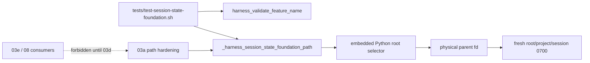
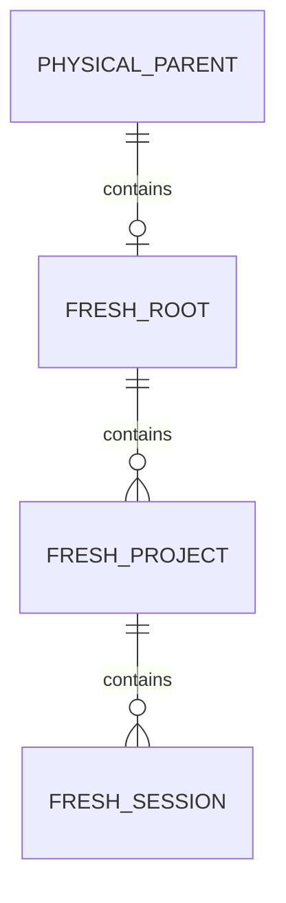
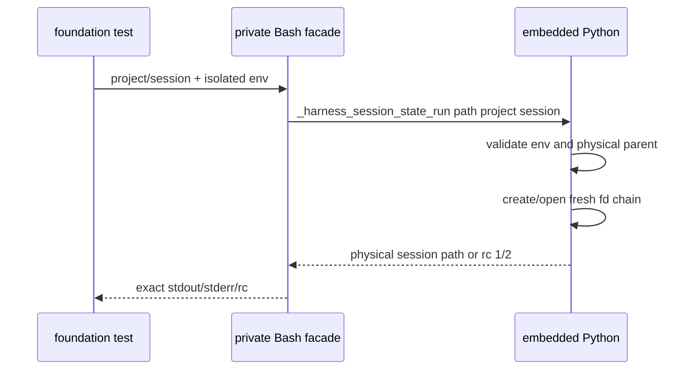

# 任务 1.3: 封闭 public surface 并交付 foundation

> 这是你的需求。数值、签名、命令一律照抄，不要自己发挥。
> 你只做这一个任务，不要顺手做别的。不要派 subagent。

---

## 完整上下文

下面是整个 spec 的三个文件，让你了解整体需求、设计和任务分解。
**但你只执行「你的任务」那一节，不要去做别的任务。**

### Requirements

> 用户原话：“$spec review 这套 aosp harness 工程，有哪些欠缺的地方，进行重构和完善”；并确认后续按 autopilot 执行。

## 目标

交付可独立验收的session-state foundation：公开安全名称校验；私有四级根选择、physical parent与fresh fd链。尚未完成existing-object身份/owner/mode/TOCTOU防护的path facade不得公开，`HARNESS_SESSION_STATE_PROVIDER_VERSION`不得设置，避免后续consumer误用半安全API。

## 术语

- “安全单组件”是长度 `1..128` 的 ASCII `[A-Za-z0-9][A-Za-z0-9._-]*`。
- “foundation path”是私有 `_harness_session_state_foundation_path`；它先校验两个ID，再调用同样私有的 `_harness_session_state_run path <project-id> <session-id>`。两者只在 fresh fixture 中证明环境选择、物理父级和新inode属性；03a才补既有对象hardening，完整public path直到03d aggregator才发布。
- “危险根”是空的 HARNESS/XDG、相对路径、含 ASCII 控制字节或完整 `.`/`..` 组件的路径；HARNESS 精确 `/` 也危险。TMPDIR unset/empty 才回退 `/tmp`。

根选择真值表：

| 候选 | unset | empty | nonempty safe absolute | parent/base missing | nonempty危险值 |
|---|---|---|---|---|---|
| `HARNESS_STATE_ROOT` | 继续XDG | 安全错2 | exact root；其physical parent下创建leaf | 安全错2 | 安全错2；精确`/`也拒绝 |
| `XDG_RUNTIME_DIR` | 继续TMP | 安全错2 | root=`$XDG_RUNTIME_DIR/aosp-harness-$EUID` | 安全错2 | 安全错2 |
| `TMPDIR` | root=`/tmp/aosp-harness-$EUID` | 同unset，回退`/tmp` | root=`$TMPDIR/aosp-harness-$EUID` | 安全错2 | 安全错2 |

所有候选的相对路径、控制字节、完整`.`/`..`组件均属危险值；低优先级候选在高优先级set时不得读取或触碰。

## 需求

R1. [计划] 当调用 `harness_validate_feature_name <name>` 时，系统必须只接受安全单组件，合法时返回 `0` 且 stdout/stderr 为空，arity 或名称非法时不得触碰文件系统、stderr 精确为 `error: invalid feature name` 加 LF 并返回 `2`。

R2. [计划] 当03a的实现测试调用 `_harness_session_state_foundation_path <project-id> <session-id>` 或 `_harness_session_state_run path <project-id> <session-id>` 时，系统必须按真值表选择根，从strict physical parent fd只创建root leaf/project/session的当前EUID `0700`非链接目录；成功stdout唯一为physical absolute session path+LF、stderr空、返回0。两个export都必须独立校验project/session ID；任一export的arity/ID错以及dispatcher的op错均stdout空、stderr精确`error: unsafe session state\n`、返回2；根安全错同样返回2；其他普通OS错stdout空、stderr精确`error: session state operation failed\n`、返回1。

R3. [计划] 当在`HARNESS_SESSION_STATE_PROVIDER_VERSION`初始unset的隔离shell中source provider时，系统必须返回0、stdout/stderr空，只定义函数，不读取状态环境、不创建或修改文件，并保持调用者预置sentinel变量的值与export属性逐字不变；source不得创建marker。foundation完成时必须逐个证明public `harness_session_state_path/write/read/remove`均不存在，使未harden的path无法被consumer当成稳定API。

R4. [计划] 系统必须提供独立离线 `tests/test-session-state-foundation.sh`，逐字验证 R1、四级根选择、危险路径零创建、优先级低候选 untouched、physical parent、fresh EUID/0700/nonlink、source 零副作用和预存默认根不删除；成功末行精确为 `RESULT PASS  session state foundation`，且不调用设备、网络、build、Claude 或 Codex。

R5. [计划] 当foundation进入验收时，系统必须由controller证明执行前BASE到最终HEAD只修改`common/.harness/lib/session-state-foundation.sh`与`tests/test-session-state-foundation.sh`、总新增+删除不超过`400`，并用PLAN v5.3规定的六列`seq/task/base/head/reviewer/final-status` review manifest证明任务1.1–1.3的base/head连续、独立reviewer最终PASS、首尾绑定review package且提交链无缺口。

R6. [计划] 如果发生PLAN v5.3的review package文件集合/行数超过R5或review manifest缺行、断链、非PASS，系统必须拒绝foundation验收并回流对应任务或PLAN，不得把私有foundation标记为可供consumer使用。

## 验收标准

主验证命令: bash ./tests/test-session-state-foundation.sh
期望输出: 退出码为 `0`，stdout 末行精确为 `RESULT PASS  session state foundation`

验收清单:

- [ ] `harness_validate_feature_name`名称表覆盖零/多参数、空、`.`、`..`、前导`-`、斜线、反斜线、空白、换行、非ASCII、129字节拒绝和1/128字节、`a._-Z9`成功，并逐字比较rc/stdout/stderr bytes。
- [ ] `_harness_session_state_foundation_path`与`_harness_session_state_run path`各自独立覆盖完整结果协议：合法调用逐字断言physical path+LF/空stderr/rc0；普通OS错误注入逐字断言空stdout/`error: session state operation failed\n`/rc1；零/少/多参数、非法project/session及仅dispatcher的非法op逐字断言空stdout/`error: unsafe session state\n`/rc2，证明直接dispatcher也不接受未经校验的组件。
- [ ] 根选择真值表逐项通过：HARNESS/XDG empty失败而TMP empty/unset回退`/tmp`；三变量的safe/relative/dotdot/control/missing和HARNESS`/`逐字通过；失败时fixture inventory不变，成功时低优先级候选untouched。
- [ ] physical parent 输出、fresh root/project/session 的非链接目录类型、EUID、0700 和两项目×两会话隔离逐项成立；测试不删除调用前存在的空 `/tmp/aosp-harness-$UID`。
- [ ] 在marker初始unset、预置并export sentinel变量的隔离shell中，source rc0且双流空，sentinel的`declare -p`前后逐字相等，目录/inode/size/内容与危险目标均不变，source后marker仍unset；循环四个状态public函数并对每个单独执行`declare -F "$name"`，任一成功即失败，而public validate与两个private exports逐个存在。
- [ ] `bash ./scripts/check.sh --offline` 退出 `0` 且末行为 `RESULT PASS  aosp-harness offline quality gate`，`git diff --check` 退出 `0`。
- [ ] `review-manifest-v1`与review package在隔离worktree根一次执行以下完整片段退出0：`: "${EXECUTION_BASE_FILE:?}" "${REVIEW_MANIFEST:?}"; BASE_SHA=$(sed -n 's/^BASE_SHA=//p' "$EXECUTION_BASE_FILE"); HEAD_SHA=$(git rev-parse HEAD); test -n "$BASE_SHA"; awk -F '\t' -v base="$BASE_SHA" -v head="$HEAD_SHA" 'NF!=6 || $1 != NR || $2 != "1." NR || $3 !~ /^[0-9a-f]{40}$/ || $4 !~ /^[0-9a-f]{40}$/ || $5=="" || $6!="PASS" {bad=1} NR==1 && $3!=base {bad=1} NR>1 && $3!=prev {bad=1} {prev=$4} END {exit bad || NR!=3 || prev!=head}' "$REVIEW_MANIFEST"; test "$(git diff --name-only "$BASE_SHA" "$HEAD_SHA" | LC_ALL=C sort)" = "$(printf '%s\n' common/.harness/lib/session-state-foundation.sh tests/test-session-state-foundation.sh)"; git diff --numstat "$BASE_SHA" "$HEAD_SHA" | awk 'NF != 3 || $1 !~ /^[0-9]+$/ || $2 !~ /^[0-9]+$/ {bad=1} {files++; lines += $1 + $2} END {exit bad || files > 2 || lines > 400}'`。

不变量（不许劣化，2-4 项）:

- source 与 unsafe case 的 fixture 内容变化数 ≤ `0`，验证: `bash ./tests/test-session-state-foundation.sh`。
- 调用前已存在的默认根删除数 ≤ `0`，验证: `bash ./tests/test-session-state-foundation.sh` 的 preexisting-root case。
- 既有 Claude、Codex、common 与 device-safety 回归失败数 ≤ `0`，验证: `bash ./scripts/check.sh --offline`。

## 超出范围

- 不公开 path/write/read/remove；03a–03d 按顺序完成并发布。
- 不做 existing managed-object owner/mode/dev-inode/TOCTOU、snapshot、signal、remove 或 coverage active 注册。
- 不改 Claude hook/demo；03e 只在 03d 完整 provider 后接入。
- 不调用真实设备、网络、build 或客户端，不发布或 push。

## autopilot 裁定

- execute 证据证明原五 API 单片 400 行不成立；当前片停在安全发布边界：只公开已完整验证的 validate，path foundation 保持私有。若判断错误，代价是 03a 需要调整私有签名；若公开半安全 path，代价是 consumer 可绕过后续 hardening。
- 03 独占 foundation module/test；03a–03d 各自交付不同模块，03d aggregator 只有在全部私有模块及预期函数存在时才设置 `HARNESS_SESSION_STATE_PROVIDER_VERSION=1` 并定义五个 public API。若判断错误，代价是多一层 source/能力探测；若共享同一 provider 文件，代价是任一前序片无法独立回滚且 partial provider 可能被 consumer 误用。

### Design

# 03-session-state-safety foundation 设计

## 1. 概述

本片只发布已完整闭合的`harness_validate_feature_name`；四级根选择和fresh fd链保留为`_harness_session_state_foundation_path`与`_harness_session_state_run path`，供紧随其后的03a实现/测试扩展。当前实现task 1.1/1.2已有独立diff review；task 1.3只负责移除半安全public facade、封闭两个private签名和测试，review PASS后由controller生成manifest。

- 选择：只公开已完整验证的validate；原因是existing-object hardening尚未完成；放弃现在公开path，避免consumer误用半安全能力。
- 选择：保留两个下划线private export给03a；原因是复用已审root/fd foundation且可独立验收；放弃提前设置marker或把private函数描述成稳定public API。
- 选择：03–03d各自独占模块，03d才聚合发布capability；原因是满足400行/P5和独立回滚；放弃继续叠改单一provider/test或用1400行例外。

## 2. 需求映射

| 组件 | 需求 |
|---|---|
| Bash C-locale predicate/public validate | R1, R3 |
| 私有 Bash facade + embedded Python root/fd foundation | R2, R3 |
| root foundation test 与 review manifest | R4, R5, R6 |

## 3. 架构



`session-state-foundation.sh` source 时只定义 Bash 函数。public surface 只有 validate；private foundation 可在测试中创建 fresh 目录，但没有 capability marker、coverage active 行或 public path 名，因此 consumer 不得探测/调用它。03a–03d 必须写入各自独立模块；最终 `session-state.sh` aggregator 只有在全部模块及预期私有函数存在后才可发布 marker 与五API。

## 4. 组件与接口

### Public validate

- 接口：`harness_validate_feature_name <name> —— 合法返回0且双流空；arity/非法名称返回2，stderr为 error: invalid feature name 加LF`
- 实现：`_harness_component_is_safe` 在 `LC_ALL=C` 下判 1..128 字节与完整 ASCII regex。

### Private root foundation

- 接口：`_harness_session_state_foundation_path <project-id> <session-id> —— 仅03a实现/测试可调用；Bash facade自身在分派前做exact arity与C-locale两个ID校验；fresh fixture成功输出physical absolute path，unsafe 2，operation 1`
- dispatcher：`_harness_session_state_run path <project-id> <session-id>`同样是03a可见的私有export；Bash入口在启动Python前只允许exact `path`、exact arity并独立复用C-locale predicate校验两个ID，arity/op/ID/安全错2，OS错1，成功path+LF/0，所有错误stdout空且stderr按requirements固定映射。
- 选择：所有nonempty候选先拒绝相对路径、ASCII control和完整`.`/`..`组件；`HARNESS_STATE_ROOT` set时取exact且额外拒绝`/`，empty fail closed；否则`XDG_RUNTIME_DIR` set后拼固定leaf，empty fail closed；否则非空`TMPDIR`拼leaf，empty/unset回退`/tmp`。HARNESS的existing parent、XDG/TMP/default的existing base必须strict physicalize，缺失按unsafe映射。
- 路径：从strict physical existing parent fd开始，对root leaf/project/session逐层执行fd-relative `mkdirat`（Python `os.mkdir(..., dir_fd=...)`，只在缺失时）、`openat(O_RDONLY|O_DIRECTORY|O_NOFOLLOW|O_CLOEXEC)`；本调用新建的inode在open后`fchmod(0700)`，既有inode不chmod，并始终从刚持有的child fd继续下一层。成功path由physical parent与三个安全组件拼成。
- 明确缺口：既有受管对象的 type/EUID/mode/name-fd identity 不在本片保证内，所以函数必须保持下划线私有名。

### Review manifest

- owner：controller。
- 路径：review-package 外 `work/2026-09-01-03-session-state-safety/review-manifest.tsv`。
- schema：`seq<TAB>task<TAB>base<TAB>head<TAB>reviewer<TAB>final-status`，任务1.1–1.3各一行；seq等于物理行号，task依次为1.1–1.3，SHA为40hex，首base/末head绑定review package，status只允许PASS且相邻提交连续。

## 5. 数据模型



这些目录在本片只是 03a 的构建基础，不代表 public session-state capability。测试使用唯一 project/session，默认 `/tmp` 根调用前若存在则只清本次条目，绝不删除预存 root。

## 6. 数据流



## 7. 错误处理

| 场景 | rc | stderr | 副作用 |
|---|---:|---|---|
| validate arity/name非法 | 2 | `error: invalid feature name` | 零 |
| 两private export arity/ID、dispatcher op、env危险 | 2 | `error: unsafe session state\n` | 零 |
| override parent/base缺失 | 2 | `error: unsafe session state\n` | 不创建缺失parent/base |
| 其他普通OS错误 | 1 | `error: session state operation failed\n` | 不触碰调用前对象 |
| fresh mkdir/open/fchmod失败 | 1 | `error: session state operation failed\n` | 只允许本调用已创建的空条目由测试清理 |

低层 Python 不打印；dispatcher 唯一映射双流。source 期间不启动 Python。

## 8. 测试策略

- 名称：文件级 `cmp` 比较双流 bytes，覆盖完整合法/非法表和 C locale。
- source：marker初始unset；在绑定cwd/目标的fixture对目录清单、inode、size、sentinel文件内容和目标不存在做前后比较，并对预置export sentinel变量的`declare -p`做逐字比较；source rc0/双流空且provider-copy mutation必须被抓住。
- roots：HARNESS/XDG/TMP/default 成功/危险矩阵；inventory 证明零创建和低优先级 untouched。
- private exports：同一表驱动分别调用facade与dispatcher，覆盖合法path+LF/0、provider-copy注入EIO的固定operation/1、arity/两个ID/dispatcher op的固定unsafe/2，所有case文件级比较双流。
- isolation：fresh root/project/session 逐层验证 `! -L`、目录类型、EUID、0700；两项目×两会话唯一。
- default root：调用前记录存在性/inode，只清本次唯一 project/session；预存 root 始终保留。
- surface：validate与两个private exports逐个存在；循环逐名证明四个未完成public API不存在，并证明`HARNESS_SESSION_STATE_PROVIDER_VERSION`未设置；成功末行改为foundation专属摘要。
- review：task1.3进入实现前按当前373行预留27行，若完整oracle预计或实际超出立即回PLAN而不压缩语义；manifest机械校验三任务链，最终exact 2 files/400 lines与clean worktree。

## 文件清单

| 文件 | 创建/修改 | 职责 | 硬门目标 |
|---|---|---|---:|
| `common/.harness/lib/session-state-foundation.sh` | 创建 | public validate + private root/fd foundation | 在总量内调剂 |
| `tests/test-session-state-foundation.sh` | 创建 | foundation API/环境/副作用回归 | 在总量内调剂 |
| 合计 | 2个非生成文件 | BASE..HEAD exact package | ≤400 |

`review-manifest.tsv`位于`.spec/work`证据目录，不进入实现review package；03a从最终private signature继续且仍不发布public path，只有03d aggregator确认全部模块完整后才定义状态public API与capability marker。

### 所有任务

# 03-session-state-safety foundation 实现计划

## Foundation 实现

### 任务 1.1: 锁定名称并保存执行基线

文件: 最终落入 `common/.harness/lib/session-state-foundation.sh`、`tests/test-session-state-foundation.sh`；执行期 1.1 先以临时 `session-state.sh`/`test-session-state.sh` 建立实现，1.3 原样重命名；创建 review-package 外 `work/2026-09-01-03-session-state-safety/execution-base.env`
消费: 无
产出: execution-base-v1 —— `execution-base.env` 唯一一行 `BASE_SHA=<40hex>`；session-validate-v1 —— `harness_validate_feature_name <name>` 与静默 `_harness_component_is_safe <value>`
需求: R1, R3, R4, R5
必需: 是
状态: 完成

- [ ] 步骤 1: controller 记录 BASE；测试建立文件级双流比较、source fixture、完整名称表和清理。
- [ ] 步骤 2: 跑 `bash ./tests/test-session-state.sh`，确认红阶段失败且首错为 `FAIL validate valid: provider missing`。
- [ ] 步骤 3: 实现 C-locale 1..128 bytes 完整 regex 与 public validate。
  ```bash
  _harness_component_is_safe() { LC_ALL=C; [[ $# == 1 && ${#1} -ge 1 && ${#1} -le 128 && $1 =~ ^[A-Za-z0-9][A-Za-z0-9._-]*$ ]]; }
  harness_validate_feature_name() { [[ $# == 1 ]] && _harness_component_is_safe "$1" || { printf '%s\n' 'error: invalid feature name' >&2; return 2; }; }
  ```
- [ ] 步骤 4: 跑 `bash -n common/.harness/lib/session-state.sh && bash -n tests/test-session-state.sh && bash ./tests/test-session-state.sh`，确认名称表和source零副作用通过。
- [ ] 步骤 5: 普通 Conventional Commits 提交并由独立 reviewer 最终 PASS；controller 把 base/head/reviewer/status 记入 manifest素材。

### 任务 1.2: 实现私有四级根与 fresh fd 链

文件: 最终落入 `common/.harness/lib/session-state-foundation.sh`、`tests/test-session-state-foundation.sh`；执行期 1.2 修改临时文件，1.3 原样重命名
消费: session-validate-v1 —— `harness_validate_feature_name <name>` 与静默 `_harness_component_is_safe <value>`
产出: foundation-root-v1 —— 四级root selector、physical parent和fresh root/project/session fd链已实现且测试隔离/零副作用oracle通过
需求: R2, R4, R5
必需: 是
状态: 完成

- [ ] 步骤 1: 加 path arity/ID、HARNESS/XDG/TMP/default 成功与危险矩阵、inventory/低优先级 untouched、fresh nonlink/type/EUID/0700、physical parent、两项目×两会话和预存默认根保留测试。
- [ ] 步骤 2: 跑 `bash ./tests/test-session-state.sh`，确认红阶段失败且首错为 `FAIL path HARNESS precedence: function missing`。
- [ ] 步骤 3: 实现 embedded Python root selector、strict physical parent、只创建root leaf和relative fresh fd链；既有对象hardening明确留给03a。
  ```python
  def select_root(env, euid):
      if "HARNESS_STATE_ROOT" in env: return checked_exact(env["HARNESS_STATE_ROOT"], reject_root=True)
      if "XDG_RUNTIME_DIR" in env: return checked_base(env["XDG_RUNTIME_DIR"]) / f"aosp-harness-{euid}"
      return checked_base(env.get("TMPDIR") or "/tmp") / f"aosp-harness-{euid}"
  def fresh_path(project, session):
      parent_fd, leaf, physical = open_physical_parent(select_root(os.environ, os.geteuid()))
      return open_fresh_chain(parent_fd, (leaf, project, session), physical)
  ```
- [ ] 步骤 4: 跑 `bash ./tests/test-session-state.sh && bash ./scripts/check.sh --offline && git diff --check`，确认完整矩阵、预存root和mutation oracle通过。
- [ ] 步骤 5: 普通 Conventional Commits 提交并由独立 reviewer 最终 PASS；controller 把base/head/reviewer/status记入manifest素材。

### 任务 1.3: 封闭 public surface 并交付 foundation

文件: 重命名 `common/.harness/lib/session-state.sh` → `common/.harness/lib/session-state-foundation.sh`、`tests/test-session-state.sh` → `tests/test-session-state-foundation.sh`；创建 review-package 外 `work/2026-09-01-03-session-state-safety/review-manifest.tsv`
消费: foundation-root-v1 —— 四级root selector、physical parent和fresh root/project/session fd链已实现且测试隔离/零副作用oracle通过；session-validate-v1 —— `harness_validate_feature_name <name>`与静默predicate；execution-base-v1 —— `execution-base.env`唯一一行`BASE_SHA=<40hex>`
产出: harness_validate_feature_name —— foundation唯一public API；_harness_session_state_foundation_path —— 03a消费的私有fresh-root facade；_harness_session_state_run —— 03a消费且仅允许path op的私有dispatcher；tests/test-session-state-foundation.sh —— 成功末行`RESULT PASS  session state foundation`；review-manifest-v1 —— controller在review PASS后写入的六列三任务连续链
需求: R2, R3, R4, R5, R6
必需: 是

- [ ] 步骤 1: 先按`work/2026-09-01-03-session-state-safety/task-1.3-sizing.md`复核118+255=373基线与126+267=393目标。在测试首次成功source provider后、任何validate/private/marker/path断言前，按以下顺序加入public循环，使当前实现的首错确定为path absent；然后再增加`assert_call`helper复用十组相邻capture/assert，最多删除8个冗余空行但不拼接语句、不删注释/oracle。其后逐个断言两个private export和marker，把现有path矩阵改调private facade并明确补齐arity参数数`0/1/3`，dispatcher表覆盖参数数`0/1/2/4`、非法op、非法project、非法session及合法0；同一provider-copy EIO mutation分别覆盖两export的operation/1；补source rc0/双流空和export sentinel`declare -p`不变；成功末行改为foundation摘要。
  ```bash
  for public_name in harness_session_state_path harness_session_state_write harness_session_state_read harness_session_state_remove; do
    if declare -F "$public_name" >/dev/null; then
      fail "public surface: $public_name must be absent"
    fi
  done
  ```
- [ ] 步骤 2: 跑 `bash ./tests/test-session-state.sh`，确认红阶段失败且首错精确为 `FAIL public surface: harness_session_state_path must be absent`。
- [ ] 步骤 3: 把临时public path facade改为private foundation facade；在`_harness_session_state_run`启动Python前先分支检查exact arity，再检查exact`path`和两个C-locale ID并映射固定unsafe错误，避免`set -u`下展开缺失位置参数；embedded Python逻辑不扩张。随后用`git mv`把provider/test改为独占foundation文件名并修正测试source路径。不得加入existing-object、snapshot、signal、remove、aggregator或coverage。
  ```bash
  _harness_session_state_foundation_path() {
    [[ $# == 2 ]] && _harness_component_is_safe "$1" && _harness_component_is_safe "$2" || { printf '%s\n' 'error: unsafe session state' >&2; return 2; }
    _harness_session_state_run path "$1" "$2"
  }
  ```
  `_harness_session_state_run`入口同样必须在启动Python前复用`_harness_component_is_safe`校验两个ID，不能只依赖private facade；先独立判断`$#`再读取`$1..$3`。
- [ ] 步骤 4: controller dispatch固定绝对execution/worktree环境。一次执行提交前验证：`WORKTREE_ROOT=/home/zzh0838/CareerDevelop/AI2D/aosp-harness-demo-03-session-state-safety; EXECUTION_BASE_FILE=/home/zzh0838/CareerDevelop/AI2D/aosp-harness-demo/.spec/2026-08-31-aosp-harness-refactor/work/2026-09-01-03-session-state-safety/execution-base.env; bash -n "$WORKTREE_ROOT/common/.harness/lib/session-state-foundation.sh" && bash -n "$WORKTREE_ROOT/tests/test-session-state-foundation.sh" && bash "$WORKTREE_ROOT/tests/test-session-state-foundation.sh" && bash "$WORKTREE_ROOT/scripts/check.sh" --offline && git -C "$WORKTREE_ROOT" diff --check; BASE_SHA=$(sed -n 's/^BASE_SHA=//p' "$EXECUTION_BASE_FILE"); EXPECTED=$(printf '%s\n' common/.harness/lib/session-state-foundation.sh tests/test-session-state-foundation.sh); test "$(git -C "$WORKTREE_ROOT" diff --name-only "$BASE_SHA" | LC_ALL=C sort)" = "$EXPECTED"; git -C "$WORKTREE_ROOT" diff --numstat "$BASE_SHA" | awk 'NF!=3 || $1 !~ /^[0-9]+$/ || $2 !~ /^[0-9]+$/ {bad=1} {files++; lines += $1+$2} END {exit bad || files!=2 || lines>400}'`。若失败或需删oracle/comment、拼接语句才能通过，立即报告BLOCKED并回PLAN。
- [ ] 步骤 5: 一次执行提交与提交后门：`WORKTREE_ROOT=/home/zzh0838/CareerDevelop/AI2D/aosp-harness-demo-03-session-state-safety; EXECUTION_BASE_FILE=/home/zzh0838/CareerDevelop/AI2D/aosp-harness-demo/.spec/2026-08-31-aosp-harness-refactor/work/2026-09-01-03-session-state-safety/execution-base.env; git -C "$WORKTREE_ROOT" add common/.harness/lib/session-state-foundation.sh tests/test-session-state-foundation.sh && git -C "$WORKTREE_ROOT" commit -m 'refactor(session): publish private foundation module' && git -C "$WORKTREE_ROOT" show --check --oneline --stat HEAD; BASE_SHA=$(sed -n 's/^BASE_SHA=//p' "$EXECUTION_BASE_FILE"); HEAD_SHA=$(git -C "$WORKTREE_ROOT" rev-parse HEAD); EXPECTED=$(printf '%s\n' common/.harness/lib/session-state-foundation.sh tests/test-session-state-foundation.sh); test "$(git -C "$WORKTREE_ROOT" diff --name-only "$BASE_SHA" "$HEAD_SHA" | LC_ALL=C sort)" = "$EXPECTED"; git -C "$WORKTREE_ROOT" diff --numstat "$BASE_SHA" "$HEAD_SHA" | awk 'NF!=3 || $1 !~ /^[0-9]+$/ || $2 !~ /^[0-9]+$/ {bad=1} {files++; lines += $1+$2} END {exit bad || files!=2 || lines>400}'; test -z "$(git -C "$WORKTREE_ROOT" status --porcelain)"`。
- [ ] 步骤 6: 独立reviewer PASS后，controller在主仓创建六列manifest三行并一次执行最终完整门：`EXECUTION_BASE_FILE=/home/zzh0838/CareerDevelop/AI2D/aosp-harness-demo/.spec/2026-08-31-aosp-harness-refactor/work/2026-09-01-03-session-state-safety/execution-base.env; REVIEW_MANIFEST=/home/zzh0838/CareerDevelop/AI2D/aosp-harness-demo/.spec/2026-08-31-aosp-harness-refactor/work/2026-09-01-03-session-state-safety/review-manifest.tsv; WORKTREE_ROOT=/home/zzh0838/CareerDevelop/AI2D/aosp-harness-demo-03-session-state-safety; BASE_SHA=$(sed -n 's/^BASE_SHA=//p' "$EXECUTION_BASE_FILE"); HEAD_SHA=$(git -C "$WORKTREE_ROOT" rev-parse HEAD); EXPECTED=$(printf '%s\n' common/.harness/lib/session-state-foundation.sh tests/test-session-state-foundation.sh); awk -F '\t' -v base="$BASE_SHA" -v head="$HEAD_SHA" 'NF!=6 || $1 != NR || $2 != "1." NR || $3 !~ /^[0-9a-f]{40}$/ || $4 !~ /^[0-9a-f]{40}$/ || $5=="" || $6!="PASS" {bad=1} NR==1 && $3!=base {bad=1} NR>1 && $3!=prev {bad=1} {prev=$4} END {exit bad || NR!=3 || prev!=head}' "$REVIEW_MANIFEST"; test "$(git -C "$WORKTREE_ROOT" diff --name-only "$BASE_SHA" "$HEAD_SHA" | LC_ALL=C sort)" = "$EXPECTED"; git -C "$WORKTREE_ROOT" diff --numstat "$BASE_SHA" "$HEAD_SHA" | awk 'NF!=3 || $1 !~ /^[0-9]+$/ || $2 !~ /^[0-9]+$/ {bad=1} {files++; lines += $1+$2} END {exit bad || files!=2 || lines>400}'; test -z "$(git -C "$WORKTREE_ROOT" status --porcelain)"`。

---

## 你的任务

文件: 重命名 `common/.harness/lib/session-state.sh` → `common/.harness/lib/session-state-foundation.sh`、`tests/test-session-state.sh` → `tests/test-session-state-foundation.sh`；创建 review-package 外 `work/2026-09-01-03-session-state-safety/review-manifest.tsv`
消费: foundation-root-v1 —— 四级root selector、physical parent和fresh root/project/session fd链已实现且测试隔离/零副作用oracle通过；session-validate-v1 —— `harness_validate_feature_name <name>`与静默predicate；execution-base-v1 —— `execution-base.env`唯一一行`BASE_SHA=<40hex>`
产出: harness_validate_feature_name —— foundation唯一public API；_harness_session_state_foundation_path —— 03a消费的私有fresh-root facade；_harness_session_state_run —— 03a消费且仅允许path op的私有dispatcher；tests/test-session-state-foundation.sh —— 成功末行`RESULT PASS  session state foundation`；review-manifest-v1 —— controller在review PASS后写入的六列三任务连续链
需求: R2, R3, R4, R5, R6
必需: 是

- [ ] 步骤 1: 先按`work/2026-09-01-03-session-state-safety/task-1.3-sizing.md`复核118+255=373基线与126+267=393目标。在测试首次成功source provider后、任何validate/private/marker/path断言前，按以下顺序加入public循环，使当前实现的首错确定为path absent；然后再增加`assert_call`helper复用十组相邻capture/assert，最多删除8个冗余空行但不拼接语句、不删注释/oracle。其后逐个断言两个private export和marker，把现有path矩阵改调private facade并明确补齐arity参数数`0/1/3`，dispatcher表覆盖参数数`0/1/2/4`、非法op、非法project、非法session及合法0；同一provider-copy EIO mutation分别覆盖两export的operation/1；补source rc0/双流空和export sentinel`declare -p`不变；成功末行改为foundation摘要。
  ```bash
  for public_name in harness_session_state_path harness_session_state_write harness_session_state_read harness_session_state_remove; do
    if declare -F "$public_name" >/dev/null; then
      fail "public surface: $public_name must be absent"
    fi
  done
  ```
- [ ] 步骤 2: 跑 `bash ./tests/test-session-state.sh`，确认红阶段失败且首错精确为 `FAIL public surface: harness_session_state_path must be absent`。
- [ ] 步骤 3: 把临时public path facade改为private foundation facade；在`_harness_session_state_run`启动Python前先分支检查exact arity，再检查exact`path`和两个C-locale ID并映射固定unsafe错误，避免`set -u`下展开缺失位置参数；embedded Python逻辑不扩张。随后用`git mv`把provider/test改为独占foundation文件名并修正测试source路径。不得加入existing-object、snapshot、signal、remove、aggregator或coverage。
  ```bash
  _harness_session_state_foundation_path() {
    [[ $# == 2 ]] && _harness_component_is_safe "$1" && _harness_component_is_safe "$2" || { printf '%s\n' 'error: unsafe session state' >&2; return 2; }
    _harness_session_state_run path "$1" "$2"
  }
  ```
  `_harness_session_state_run`入口同样必须在启动Python前复用`_harness_component_is_safe`校验两个ID，不能只依赖private facade；先独立判断`$#`再读取`$1..$3`。
- [ ] 步骤 4: controller dispatch固定绝对execution/worktree环境。一次执行提交前验证：`WORKTREE_ROOT=/home/zzh0838/CareerDevelop/AI2D/aosp-harness-demo-03-session-state-safety; EXECUTION_BASE_FILE=/home/zzh0838/CareerDevelop/AI2D/aosp-harness-demo/.spec/2026-08-31-aosp-harness-refactor/work/2026-09-01-03-session-state-safety/execution-base.env; bash -n "$WORKTREE_ROOT/common/.harness/lib/session-state-foundation.sh" && bash -n "$WORKTREE_ROOT/tests/test-session-state-foundation.sh" && bash "$WORKTREE_ROOT/tests/test-session-state-foundation.sh" && bash "$WORKTREE_ROOT/scripts/check.sh" --offline && git -C "$WORKTREE_ROOT" diff --check; BASE_SHA=$(sed -n 's/^BASE_SHA=//p' "$EXECUTION_BASE_FILE"); EXPECTED=$(printf '%s\n' common/.harness/lib/session-state-foundation.sh tests/test-session-state-foundation.sh); test "$(git -C "$WORKTREE_ROOT" diff --name-only "$BASE_SHA" | LC_ALL=C sort)" = "$EXPECTED"; git -C "$WORKTREE_ROOT" diff --numstat "$BASE_SHA" | awk 'NF!=3 || $1 !~ /^[0-9]+$/ || $2 !~ /^[0-9]+$/ {bad=1} {files++; lines += $1+$2} END {exit bad || files!=2 || lines>400}'`。若失败或需删oracle/comment、拼接语句才能通过，立即报告BLOCKED并回PLAN。
- [ ] 步骤 5: 一次执行提交与提交后门：`WORKTREE_ROOT=/home/zzh0838/CareerDevelop/AI2D/aosp-harness-demo-03-session-state-safety; EXECUTION_BASE_FILE=/home/zzh0838/CareerDevelop/AI2D/aosp-harness-demo/.spec/2026-08-31-aosp-harness-refactor/work/2026-09-01-03-session-state-safety/execution-base.env; git -C "$WORKTREE_ROOT" add common/.harness/lib/session-state-foundation.sh tests/test-session-state-foundation.sh && git -C "$WORKTREE_ROOT" commit -m 'refactor(session): publish private foundation module' && git -C "$WORKTREE_ROOT" show --check --oneline --stat HEAD; BASE_SHA=$(sed -n 's/^BASE_SHA=//p' "$EXECUTION_BASE_FILE"); HEAD_SHA=$(git -C "$WORKTREE_ROOT" rev-parse HEAD); EXPECTED=$(printf '%s\n' common/.harness/lib/session-state-foundation.sh tests/test-session-state-foundation.sh); test "$(git -C "$WORKTREE_ROOT" diff --name-only "$BASE_SHA" "$HEAD_SHA" | LC_ALL=C sort)" = "$EXPECTED"; git -C "$WORKTREE_ROOT" diff --numstat "$BASE_SHA" "$HEAD_SHA" | awk 'NF!=3 || $1 !~ /^[0-9]+$/ || $2 !~ /^[0-9]+$/ {bad=1} {files++; lines += $1+$2} END {exit bad || files!=2 || lines>400}'; test -z "$(git -C "$WORKTREE_ROOT" status --porcelain)"`。
- [ ] 步骤 6: 独立reviewer PASS后，controller在主仓创建六列manifest三行并一次执行最终完整门：`EXECUTION_BASE_FILE=/home/zzh0838/CareerDevelop/AI2D/aosp-harness-demo/.spec/2026-08-31-aosp-harness-refactor/work/2026-09-01-03-session-state-safety/execution-base.env; REVIEW_MANIFEST=/home/zzh0838/CareerDevelop/AI2D/aosp-harness-demo/.spec/2026-08-31-aosp-harness-refactor/work/2026-09-01-03-session-state-safety/review-manifest.tsv; WORKTREE_ROOT=/home/zzh0838/CareerDevelop/AI2D/aosp-harness-demo-03-session-state-safety; BASE_SHA=$(sed -n 's/^BASE_SHA=//p' "$EXECUTION_BASE_FILE"); HEAD_SHA=$(git -C "$WORKTREE_ROOT" rev-parse HEAD); EXPECTED=$(printf '%s\n' common/.harness/lib/session-state-foundation.sh tests/test-session-state-foundation.sh); awk -F '\t' -v base="$BASE_SHA" -v head="$HEAD_SHA" 'NF!=6 || $1 != NR || $2 != "1." NR || $3 !~ /^[0-9a-f]{40}$/ || $4 !~ /^[0-9a-f]{40}$/ || $5=="" || $6!="PASS" {bad=1} NR==1 && $3!=base {bad=1} NR>1 && $3!=prev {bad=1} {prev=$4} END {exit bad || NR!=3 || prev!=head}' "$REVIEW_MANIFEST"; test "$(git -C "$WORKTREE_ROOT" diff --name-only "$BASE_SHA" "$HEAD_SHA" | LC_ALL=C sort)" = "$EXPECTED"; git -C "$WORKTREE_ROOT" diff --numstat "$BASE_SHA" "$HEAD_SHA" | awk 'NF!=3 || $1 !~ /^[0-9]+$/ || $2 !~ /^[0-9]+$/ {bad=1} {files++; lines += $1+$2} END {exit bad || files!=2 || lines>400}'; test -z "$(git -C "$WORKTREE_ROOT" status --porcelain)"`。

## 报告契约

完整报告写进控制器指定的 `task-N-report.md`（路径由控制器给出）。

返回控制器的只有：
- **Status**：`DONE` / `DONE_WITH_CONCERNS` / `NEEDS_CONTEXT` / `BLOCKED`
- **Commits**：本任务产生的 commit 列表
- **一行测试摘要**：例如 `Ran 12 tests, OK`
- **顾虑**：如有


