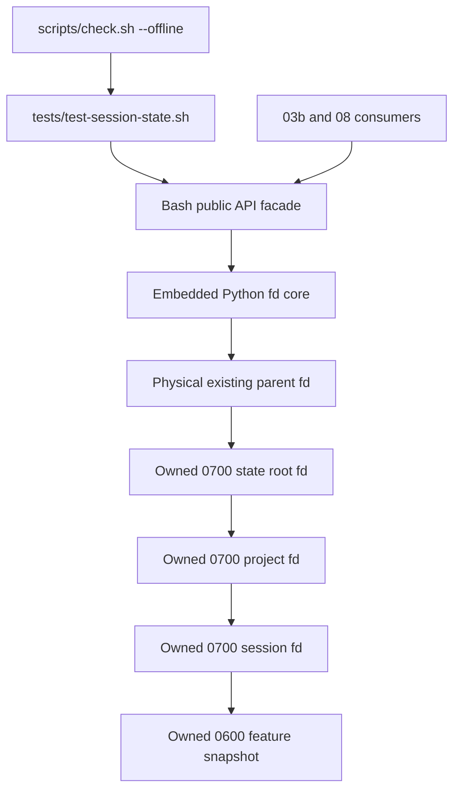
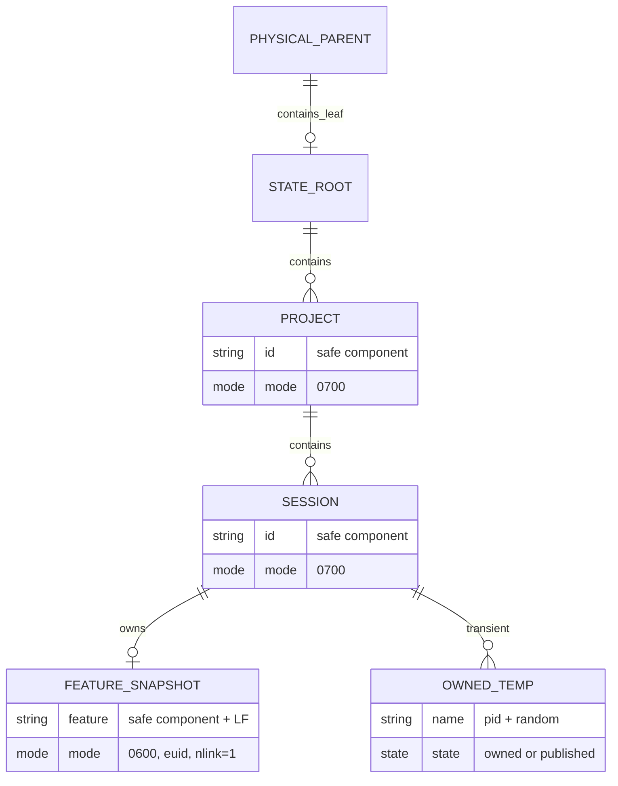
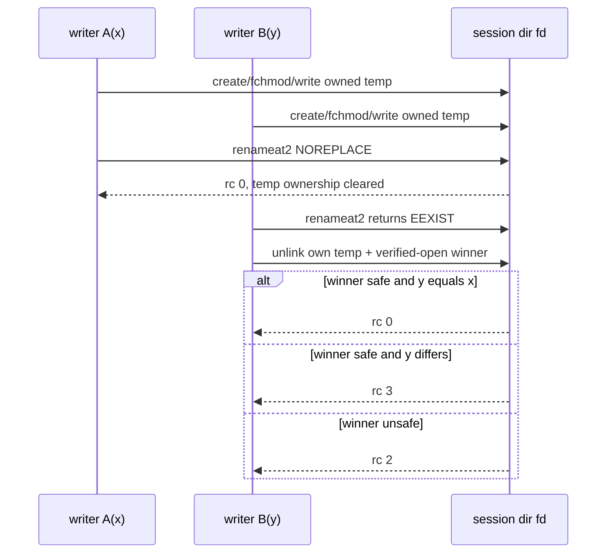
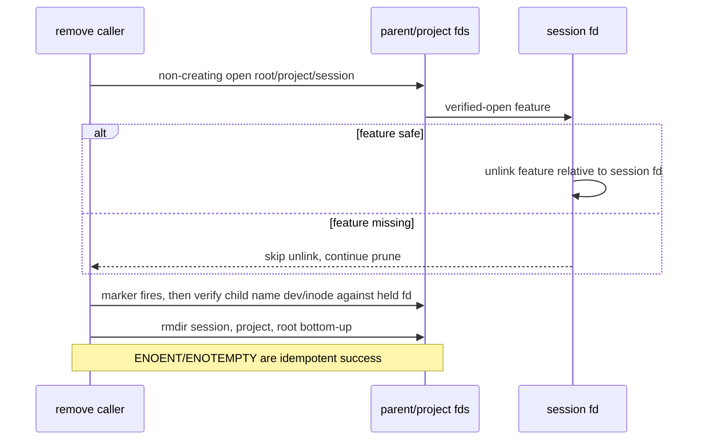
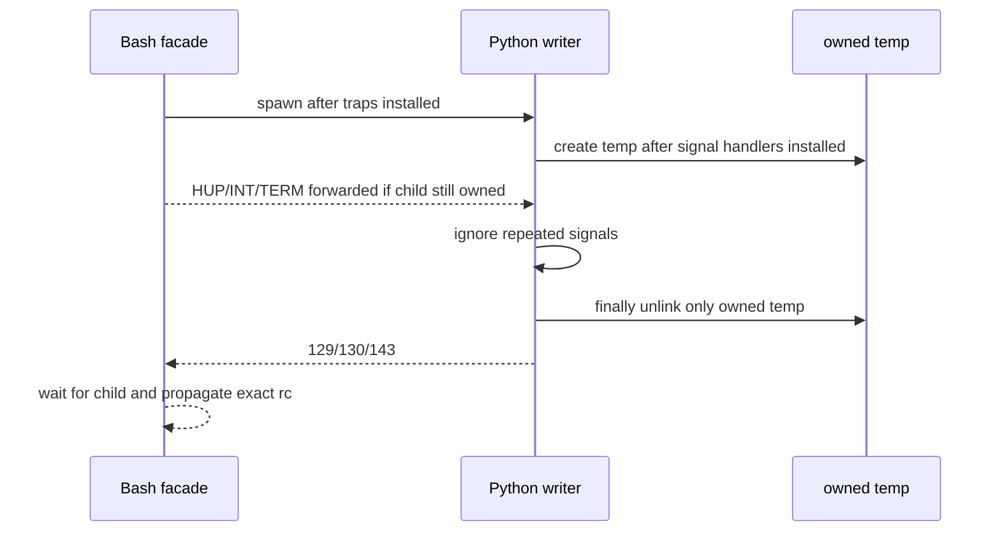

# 任务 1.1: 锁定名称并保存执行基线

> 这是你的需求。数值、签名、命令一律照抄，不要自己发挥。
> 你只做这一个任务，不要顺手做别的。不要派 subagent。

---

## 完整上下文

下面是整个 spec 的三个文件，让你了解整体需求、设计和任务分解。
**但你只执行「你的任务」那一节，不要去做别的任务。**

### Requirements

> 用户原话：
> “$spec review 这套 aosp harness 工程，有哪些欠缺的地方，进行重构和完善”；用户已通过总体拆分，并要求后续按 autopilot 流程执行。

## 目标

交付唯一的 feature/session 状态安全内核：五个公共 Bash API 在不跟随受管链接、不接管既有宽权限目录、不覆盖异值基线的前提下，按项目和会话隔离 create-once 快照，以 `rmdir` 清空安全空目录并把并发 `ENOTEMPTY` 当作幂等结果；独立离线测试用确定性攻击、竞争、信号和错误注入证明失败时不改受害文件、不删除并发胜者，并以 `active` 状态由根质量 gate 自动发现。

## 术语

- “安全单组件”是长度 `1..128` 的 ASCII 字符串，完整匹配 `[A-Za-z0-9][A-Za-z0-9._-]*`；不含 `/`、反斜线、空白、控制字符、`.`/`..` 或前导 `-`。
- “受管状态根”优先取绝对路径 `HARNESS_STATE_ROOT`；未设置时取 `${XDG_RUNTIME_DIR}/aosp-harness-$UID`，再回退到 `${TMPDIR:-/tmp}/aosp-harness-$UID`。已设置的 HARNESS/XDG 候选为空、相对或不可规范化时必须 fail closed 而不降级；TMPDIR 为空与未设置均按 `/tmp`，非空但相对或不可规范化时 fail closed。“危险”精确指原始路径含 ASCII 控制字节或 `.`/`..` 完整组件，HARNESS 根还额外拒绝精确 `/`；命中时返回安全错误 `2`、零创建。既有父目录先物理规范化，系统只创建根末级，不创建覆盖值缺失的任意父级。
- “受管目录”是状态根末级及其下 project/session 两层。新建目录必须是当前有效 UID 所有、mode 精确 `0700`；既有目录必须已经满足同一属性且为非链接目录，系统不得用 chmod 接管它。
- “快照”是 `<state-root>/<project-id>/<session-id>/feature`：当前有效 UID 所有、mode 精确 `0600`、link count `1` 的非链接普通文件，内容精确为一个安全 feature 加一个 LF。
- “普通竞争”从目标缺失开始，由多个合法写者争用同一名字；“恶意替换”是已检查路径在不跟随 fd 打开前被换成软链、硬链、目录或属性错误对象。两者的返回分类不同。

## API 契约

所有函数都拒绝未列出的额外参数。表中的成功 path/feature 和固定 stderr 都精确带一个末尾 LF；“空”表示零字节。

| API/场景 | stdout | stderr | rc |
|---|---|---|---:|
| `harness_validate_feature_name <name>` 合法 | 空 | 空 | 0 |
| validate 参数/名称非法 | 空 | `error: invalid feature name` | 2 |
| `harness_session_state_path <project-id> <session-id>` 成功 | 唯一绝对路径 + LF | 空 | 0 |
| path 参数/安全错误 | 空 | `error: unsafe session state` | 2 |
| path 普通 OS 操作失败 | 空 | `error: session state operation failed` | 1 |
| `harness_session_state_write <project-id> <session-id> <feature>` 首次或同值 | 空 | 空 | 0 |
| write 异值冲突 | 空 | `error: session state conflict` | 3 |
| `harness_session_state_read <project-id> <session-id>` 成功 | 唯一 feature + LF | 空 | 0 |
| read 缺失 | 空 | `error: session state missing` | 3 |
| `harness_session_state_remove <project-id> <session-id>` 成功或缺失 | 空 | 空 | 0 |
| write/read/remove 参数或安全错误 | 空 | `error: unsafe session state` | 2 |
| write/read/remove 普通 OS 操作失败 | 空 | `error: session state operation failed` | 1 |
| write 被 HUP/INT/TERM 中断 | 空 | 空 | 129/130/143 |

## 需求

R1. [计划] 当调用 `harness_validate_feature_name <name>` 时，系统必须只接受安全单组件，合法时不写 stdout/stderr 并返回 `0`，参数个数错误或名称非法时不得触碰文件系统、stderr 精确输出 `error: invalid feature name` 并返回 `2`；其他四个 API 必须复用同一静默内部判定，但按各自 API 表映射错误，不泄漏 validate 的公开错误文案。来源：PLAN v5 的 `03-session-state-safety` 产出与 DECISIONS “03 requirements review round 1”。

R2. [计划] 当调用 `harness_session_state_path <project-id> <session-id>` 时，系统必须先校验参数，再以 fd-relative 且不跟随链接的方式准备受管状态根、project 和 session 目录；新建对象在 restrictive umask 下仍须对本调用刚创建并已打开的 inode 设置精确 mode，既有对象只能校验不能 chmod，并在成功时唯一输出规范绝对会话路径；相对/危险根、缺失覆盖父级、非法 ID、受管链接、非目录或 owner/mode 错必须按 API 表返回 `2` 且零路径输出。来源：PLAN v5 的 `03-session-state-safety` 详情与 DECISIONS “03 requirements review round 1-3”。

R3. [计划] 当调用 `harness_session_state_write <project-id> <session-id> <feature>` 时，系统必须在已验证 session fd 下创建当前调用独占的 `0600` 临时普通文件，写入精确快照内容后以 no-clobber 原子操作发布；首次成功返回 `0`，普通竞争 loser 必须重新用不跟随链接的 fd 验证胜者，同值幂等返回 `0`、异值返回 `3`，任何写入都不得覆盖既有快照。来源：PLAN v5 的 `03-session-state-safety` 详情与 DECISIONS “03 requirements review round 3”。

R4. [计划] 当调用 `harness_session_state_read <project-id> <session-id>` 时，系统必须以 non-creating 路径打开并验证三层目录与快照的类型、owner、mode、link count 和精确内容，成功时唯一输出 feature；任一目录或快照缺失返回 `3`，链接、硬链、目录、属性错、畸形或超长内容返回 `2`，且所有失败均不得创建状态或读取链接受害文件。来源：PLAN v5 的五 API 契约与 DECISIONS “03 requirements review round 2-3”。

R5. [计划] 当调用 `harness_session_state_remove <project-id> <session-id>` 时，系统必须先 non-creating 地持有并验证 root/project/session fd，再不跟随地打开、验证并相对 session fd unlink 快照，然后按已持有 parent fd 和 dev/inode 身份自底向上尝试 `rmdir` 空 session/project/root；feature 缺失但安全目录已存在时跳过 unlink 并仍尝试 prune，任意层缺失和并发 `ENOTEMPTY` 幂等成功，链接/硬链/类型/owner/mode/content 错返回 `2`，其他 OS 错返回 `1`，且不得删除其他条目。目录替换保证精确限定为测试 marker 触发在最终身份检查前，命中时必须返回 `2` 且不删除替换目录；同 EUID 攻击者在最终检查后、`rmdir` 前换入空目录的竞态不在保证内，`rmdir` 仍不删除非空目录或其中内容。来源：PLAN v5.1 的五 API 契约与 DECISIONS “03 requirements review round 3”。

R6. [默认] 如果发生 write 收到 HUP/INT/TERM 或发布前失败，系统必须只释放本次 write 的 fd、删除它尚未发布的临时文件并使既有或并发胜者快照保持原状；发布成功是提交点，提交后必须立即撤销临时名所有权且后续或重复信号不得删除固定 `feature`；被 HUP/INT/TERM 中断的调用不得返回 `0`，最终必须分别返回 `129/130/143`。该信号回滚保证不适用于已完成 unlink 的 remove。来源：PLAN v5.1 的 03 信号/中断攻击测试边界、DECISIONS “03 收窄 requirements review round 3 I1-I3”与 shell `128+signal` 默认。

R7. [计划] 如果发生五 API 的参数/链接/类型/owner/mode/link-count/content 安全错误或 EIO 代表的普通 OS I/O 错误，系统必须分别按 API 表统一返回 `2` 或 `1`，释放本调用资源且不改变其他项目/会话；remove 的信号中断不承诺回滚已完成的 unlink。来源：PLAN v5 的 03 错误处理与攻击测试边界；DECISIONS “03 requirements review round 2-3”。

R8. [计划] 系统必须提供 `tests/test-session-state.sh` 的独立离线回归，逐场景验证五 API 表、名称边界、状态根四级选择、root/project/session 隔离与权限、同值/异值竞争、软/硬链和类型/属性/内容攻击、read/remove non-creating、目录 prune、write 信号所有权及普通 OS 错误；TOCTOU、wrong-owner、EIO 和 signal fixture 必须复制 provider，在固定 marker 精确命中一次后注入，并先断言独立 sentinel 再检查 rc、stderr、temp 和受害文件。来源：PLAN v5 的 03 独立判据、审查规模与文件边界。

R9. [计划] 当根质量 gate 自动发现本测试时，系统必须保持 Claude、Codex、common 三套既有离线回归与 device-safety 回归通过，在 `tests/COVERAGE.md` 为 `tests/test-session-state.sh` 增加唯一 `active` 行；poison PATH 必须证明 `adb|cvd|curl|wget|m|mm|mmm|soong_ui.bash|gradlew|claude|codex` 调用数为 `0`，provider 静态网络 API/`/dev/tcp|udp` 引用数为 `0`。来源：PLAN v5 的整体验收、全局约束与 `02 -> 03` gate 契约。

## 验收标准

主验证命令: bash ./tests/test-session-state.sh
期望输出: 退出码为 `0`，stdout 末行精确为 `RESULT PASS  session state`

验收清单:

- [ ] 表驱动名称用例证明空值、额外参数、`.`、`..`、前导 `-`、斜线、反斜线、空白、换行、非 ASCII、129 字节名称均以公开错误和 rc `2` 拒绝；1 字节与 128 字节合法且零输出，其他 API 的非法名称使用各自安全错误。
- [ ] 四组独立 fixture 证明 `HARNESS_STATE_ROOT` 覆盖 XDG/TMP、unset HARNESS 后选择 XDG、再 unset XDG 后选择 TMP、三者均 unset 后选择 `/tmp/aosp-harness-$UID`；HARNESS/XDG 的空值、`relative`、`/tmp/../tmp/x`、含换行值、缺失父级以及 HARNESS 的 `/` 均返回 `2`、固定安全 stderr、零创建，TMPDIR 为空时选择 `/tmp`，非空的 `relative`、`/tmp/../tmp`、含换行值或缺失路径同样 fail closed。两项目×两会话得到四个不同绝对路径，受管三层目录均为当前 EUID、`0700` 且不经过受管链接；预置普通文件/软链/错误 owner/mode 均返回 `2`、零路径输出，既有目录 mode 不变。
- [ ] 五 API 逐场景满足 API 表；快照为当前 EUID、普通文件、`0600`、link count `1`、精确单行内容。同值双写为 `0+0`，异值双写为 `0+3`，最终值只能是两候选之一且无临时文件。
- [ ] 预置软链、硬链、目录、owner/mode 错和畸形内容均返回 `2`，受害目标 hash 不变；read 缺失返回 `3` 且不创建根，remove 缺失返回 `0` 且不创建根。
- [ ] remove 删除目标快照并清安全空 session/project/root；目录存在但 feature 缺失时仍清安全空层级；并发非空目录仍返回 `0` 且其他条目不变。provider-copy marker 在最终身份检查前替换目录名时，dev/inode 不匹配使操作返回 `2`，替换目录及受害内容不被删除；测试明确记录检查后同 EUID 空目录换入竞态不在保证内。
- [ ] provider-copy 的 path-stat→fd-open 软链替换、期望 EUID 替换和 EIO 注入各自 marker/替换次数精确为 `1`、hit sentinel 存在，分别得到 rc `2|2|1` 和精确 stderr，受害文件 hash 变化数为 `0`，失败后本调用 temp 数为 `0`。
- [ ] 向 write 的 child、Bash facade 和进程组分别发送 HUP/INT/TERM 后，调用分别返回 `129/130/143` 而不假成功，本调用未发布 temp 数为 `0`；预存同值快照 inode/内容不变，竞争 loser 退出后胜者快照仍存在，重复信号不删除固定 `feature`；本片不把 remove 中断包装成事务回滚。
- [ ] `tests/COVERAGE.md` 中 session-state 测试精确出现一次并为 `active`；poison call log 中 `adb|cvd|curl|wget|m|mm|mmm|soong_ui.bash|gradlew|claude|codex` 调用数为 `0`，provider 的 `socket|urllib|http://|https://|/dev/tcp|/dev/udp` 引用数为 `0`；只有全部断言通过才打印唯一成功末行。
- [ ] `bash ./scripts/check.sh --offline` 退出 `0` 且末行为 `RESULT PASS  aosp-harness offline quality gate`，三套 legacy 与 device-safety 回归失败数为 `0`，`git diff --check` 退出 `0`。
- [ ] 以执行前记录的 `BASE` 和最终 `HEAD` 生成 review package 后，`test "$(git diff --name-only "$BASE" "$HEAD" | LC_ALL=C sort)" = "$(printf '%s\n' common/.harness/lib/session-state.sh tests/COVERAGE.md tests/test-session-state.sh)"` 退出 `0`，且 `git diff --numstat "$BASE" "$HEAD" | awk 'NF != 3 || $1 !~ /^[0-9]+$/ || $2 !~ /^[0-9]+$/ { bad=1 } { files++; lines += $1 + $2 } END { exit bad || files > 3 || lines > 400 }'` 退出 `0`；逐文件目标允许在总量内调剂。

不变量（不许劣化，2-4 项）:

- 路径逃逸、链接、目录替换和 owner/mode 错 case 的受害文件 hash 变化数 ≤ `0`，验证: `bash ./tests/test-session-state.sh` 中对应 case 的 hash 计数断言。
- 既有或并发胜者快照被失败写者/信号删除的数量 ≤ `0`，验证: `bash ./tests/test-session-state.sh` 中 publish/signal case 的 inode 与内容计数断言。
- Claude、Codex、common 既有回归及 device-safety 回归失败数 ≤ `0`，验证: `bash ./scripts/check.sh --offline`。
- 默认验收中枚举的设备、网络、build、Claude/Codex 外部命令调用数 ≤ `0`，验证: `bash ./tests/test-session-state.sh` 的 poison PATH/call log 与 provider 静态引用断言。

## 超出范围

- 不在本 spec 修改 Claude hook、settings、`CURRENT_FEATURE` 读取或 demo；SessionStart/UserPromptSubmit/SessionEnd、raw-byte reader、locator 与 fixture-only demo 由紧随其后的 `03b-claude-session-lifecycle` 完成。
- 不在本 spec 迁移 Codex hook；Claude/Codex 的最终统一 adapter 由 `08-client-session-adapters` 完成。
- 不实现源码、build、device 或 CVD 租约；这些由 `04-runtime-resource-leases` 与 `06-resilient-command-runtime` 完成。
- 不执行真实客户端、设备、构建、网络或跨平台矩阵，不发布或推送。
- 实现严格受 PLAN v5 当前文件边界形成的单一 review-package 硬门约束：只含本规格列出的 3 个非生成文件，且总新增+删除不超过 400 行。

## 实现可行性预算

本片最多修改或创建 3 个非生成文件且总新增+删除不超过 400 行，这是唯一文件/行数硬门；design 目标不超过 360 行并保留至少 40 行修复余量，逐文件数字仅作预警，可在总量内调剂。

| 文件 | design 目标新增+删除行 |
|---|---:|
| `common/.harness/lib/session-state.sh` | 210 |
| `tests/test-session-state.sh` | 148 |
| `tests/COVERAGE.md` | 1 |
| 合计 | 359 |

## autopilot 裁定

- 必答问题 `0` 个，带推荐问题 `0` 个：五 API、错误表和安全边界来自已批准 PLAN 与 requirements review；本轮只按 design 的 P5 证据收窄职责，不改变公共契约。
- 沿五 API 稳定接口拆片，使 03 的独立产出是可直接 source/调用的 provider，03b 可用 provider-present/absent fixture 独立验收 hook 生命周期。若判断错误，代价是多一轮串行 spec；若不拆，fd/信号安全内核与 Claude 集成测试会争抢同一 400 行预算。
- 公共 provider 的支持边界仍只承诺 Linux；具体 kernel/glibc/Bash/Python 下限和 no-clobber primitive 在 design 锁定。若判断错误，代价是其他平台需 legacy fallback；若现在宣称跨平台，则 no-clobber 与 fd 语义无法由本轮 CI 证明。
- write 信号采用 `128+signal` 的 shell 退出惯例，HUP/INT/TERM 固定 `129/130/143`。若判断错误，代价是调用方比“任意非零”多绑定三个码；若不固定，清理成功后仍可能以 rc `0` 假成功且测试无法判定。

### Design

# 03-session-state-safety 设计

## 1. 概述

本规格用一个可 source 的 Bash provider 包装单一 Python fd 安全内核，交付五个稳定 API；Claude hook/demo 不在本片修改。

关键决策：

1. 选择“一个 `.sh` 文件内的 Bash facade + embedded Python core”。Bash 保持调用契约和 C-locale 名称校验，Python 负责 `dir_fd`、`O_NOFOLLOW`、`fstat` 和 no-clobber syscall；放弃纯 Bash（不能可靠表达 fd-relative 安全边界）和独立 `.py` 文件（增加发布/定位边界且挤占本片 3 文件清单）。
2. 选择 Linux `renameat2(RENAME_NOREPLACE)` 发布 create-once 快照。它不会暴露 hard-link publish 的正常 `nlink=2` 窗口；放弃 `mv`/`os.replace`（会覆盖基线）和 `link+unlink`（竞争 reader 会把正常中间态判成 unsafe）。
3. 选择“write/path 可创建，read/remove 永不创建；新 inode 精确 fchmod，既有 inode 只验证”。放弃自动修复权限或跟随 realpath 的受管组件，因为两者都会接管调用者未授权的对象。

设计目标为 3 个非生成文件、359 行新增+删除，低于 PLAN 的 400 行硬门 41 行。

## 2. 需求映射

| 组件 | 实现的需求 |
|---|---|
| Bash API facade 与名称判定 | R1, R6, R7 |
| Python 状态根/目录 fd 层 | R2, R4, R5, R7 |
| Python snapshot read/write/remove 层 | R3, R4, R5, R6, R7 |
| 根 session-state 测试与 coverage 注册 | R1, R2, R3, R4, R5, R6, R7, R8, R9 |

## 3. 架构



`common/.harness/lib/session-state.sh` 是唯一生产实现：source 时只定义函数，不读环境、不创建目录；public validate 只走 Bash predicate，除 validate 外的四个状态 API 才解析环境并启动一个 Python child。支持边界固定为 Linux kernel `>=3.15`、glibc `>=2.28`、Bash `>=5.0`、Python `>=3.8`，因为实现通过 `ctypes.CDLL(None, use_errno=True)` 调 glibc `renameat2`，并使用 Python 的 `dir_fd`/`follow_symlinks=False`。缺符号、`ENOSYS` 或平台不满足时返回普通操作失败 `1`，不静默退化为覆盖式 publish。

状态根选择按以下四分支执行，不留给实现时推断：

```text
if HARNESS_STATE_ROOT is set: root = its exact value
elif XDG_RUNTIME_DIR is set: validate base; root = base / "aosp-harness-<euid>"
elif TMPDIR is nonempty: validate base; root = base / "aosp-harness-<euid>"
else: root = "/tmp/aosp-harness-<euid>"
```

HARNESS/XDG empty 直接 unsafe；TMPDIR unset/empty 才取 `/tmp`。chosen root/base 的原始路径先拒绝 ASCII 控制字符和完整 `.`/`..` 组件，再要求绝对；HARNESS 精确 `/` 额外 unsafe。用 `normpath` 去除重复/尾斜线，把 root 拆为 `parent path + leaf`；只 `realpath(strict)` 既有 parent、确认其为目录后打开 physical parent fd，只在其下创建 leaf。XDG/TMP/default 都是先验证/物理化 base，再拼固定 `aosp-harness-<os.geteuid()>` leaf；规范 stdout 使用 physical parent 加 leaf/project/session，精确一个 LF。

## 4. 组件与接口

### 已消费的根质量 gate

- 职责：按 C locale 自动发现根测试并传播失败。
- 对外接口：`scripts/check.sh --offline|--ci —— 自动发现普通文件 tests/test-*.sh；成功退出 0，任一根测试失败则 gate 退出 1`
- 依赖：02 已合入的测试插件契约；session-state test 不反调 gate，避免递归。

### 公共 session-state provider

- 职责：校验单组件，安全准备/打开目录，完成 create-once write、verified read 和 idempotent remove。
- 对外接口：`harness_validate_feature_name <name>；harness_session_state_path <project-id> <session-id>；harness_session_state_write <project-id> <session-id> <feature>；harness_session_state_read <project-id> <session-id>；harness_session_state_remove <project-id> <session-id> —— 成功按 requirements API 表返回 0，操作失败返回 1，协议/安全错误返回 2，仅 read 缺失/write 异值冲突返回 3，remove 缺失幂等返回 0；write 被 HUP/INT/TERM 中断分别返回 129/130/143`
- 依赖：Bash、Python 3、Linux/glibc；读取 `HARNESS_STATE_ROOT`、`XDG_RUNTIME_DIR`、`TMPDIR`、有效 UID。
- 私有接口：`_harness_component_is_safe <value>` 在 `LC_ALL=C` 下做字节长度与完整 regex 判定；public validate 决定其专属错误文案，其他 API 静默调用后映射为 unsafe。`_harness_session_state_run <op> ...` 在隔离 subshell 内设 `umask 077`、安装 trap 并运行 Python dispatcher；二者都不属于下游契约。

目录 helper 返回 physical parent fd、root leaf 及按顺序持有的 root/project/session fd。每层先 `stat(..., follow_symlinks=False)`，在固定 `# HARNESS_TEST_MARKER_MANAGED_BEFORE_OPEN` 后用 `O_DIRECTORY|O_NOFOLLOW|O_CLOEXEC` 打开，再比较 name stat 与 fd 的 dev/inode、类型、EUID 和精确 mode。缺失且 create=true 时 `mkdir(0700)`，处理合法 `FileExistsError` 竞争后打开；只对本调用刚创建并已打开的 inode `fchmod(0700)`。create=false 把缺失交给 op 映射，绝不创建。`expected_euid = os.geteuid()` 只在固定 `# HARNESS_TEST_MARKER_EXPECTED_EUID` 后赋值，供 wrong-owner provider copy 精确替换一次。

snapshot helper 在固定 `# HARNESS_TEST_MARKER_SNAPSHOT_BEFORE_OPEN` 后以 `O_NOFOLLOW|O_CLOEXEC` 打开 `feature`，要求普通文件、EUID、`0600`、`nlink=1`，最多读取 130 bytes 并精确匹配安全名加一个 LF。write 用 `.<pid>.<random>.tmp`、`O_CREAT|O_EXCL|O_NOFOLLOW` 建 temp，立即 `fchmod(0600)` 并 fstat；写完在 `# HARNESS_TEST_MARKER_TEMP_BEFORE_PUBLISH` 后调用 `renameat2`，并在 syscall 返回后立即保存 `ctypes.get_errno()`。`EEXIST` 分支清自己的 temp，再 verified-open 胜者：winner 消失归普通竞争/生命周期交错的 operation `1`，link/type/identity 变化归 unsafe `2`，安全同值/异值为 `0/3`。

### 信号 facade

- 职责：使 write 的 shell parent、Python child 或进程组收到信号时均等待 child 完成幂等清理，并返回固定信号码。
- 接口：无额外公共函数；行为属于 `harness_session_state_write`。
- 依赖：Bash subshell trap 与 Python `signal`。

facade 状态固定为 `pending_signal=0`、`child_pid=''`、`child_rc`。spawn 前安装三个 trap；第一个 trap 原子记录 signal number，并立刻把 HUP/INT/TERM 全改为 ignore。若 PID 已发布且 `kill -0` 成功就转发一次；若信号落在 spawn 与 `$!` 保存之间，保存 PID 后看到 pending 非零就立即补转发。随后循环 wait：trap 打断 wait 且 child 仍存活时继续；只有 child 已回收才保存 child rc。若 facade 记录过信号，最终以首信号的 `128+signal` 返回，否则传播 child rc；child 已退出但未回收时不再改写其状态。多个不同信号也是 first-signal-wins。

Python 在任何状态/temp mutation 前安装同样的 first-signal-wins handler；第一次信号把三种 handler 全改为 ignore，再抛私有中断异常，`finally` 只 unlink 仍持有名字的 temp 并关闭本调用 fd。进程组的首次投递加 facade 转发不会第二次打断 cleanup。rename 成功后立即清空 temp-name 变量；即使信号落在 syscall 返回与变量清空之间，旧 temp 名已不存在，cleanup 也绝不 unlink 固定 `feature`。child-only 信号由 child rc 决定，facade-only/group 信号由 pending signal 决定，三种投递均精确得到 `129/130/143`。

### 根回归

- 职责：表驱动五 API、攻击/竞争/信号和规模门，注册 coverage。
- 对外接口：`bash ./tests/test-session-state.sh` 成功退出 `0`，stdout 末行精确 `RESULT PASS  session state`。
- 依赖：Bash、Git、Python 3、基础 coreutils；不调用根 gate、设备、网络、build 或客户端。

## 5. 数据模型



目录地址为 `<physical-parent>/<root-leaf>/<project-id>/<session-id>/`；公共 project/session 都是任意安全单组件。状态机为 `ABSENT -> SAFE(feature)`；write 允许 `SAFE(x) -> SAFE(x)`，拒绝 `SAFE(x) -> SAFE(y)`；任何 `UNSAFE` 对象都无自动修复边。read 是纯观察。remove 做 `SAFE|ABSENT -> ABSENT` 后 best-effort prune；feature 已缺失但安全空层级存在时仍 prune。temp 只有当前调用的 `OWNED` 状态；rename 成功即 `PUBLISHED` 并撤销 temp 名所有权。

## 6. 数据流





remove 的威胁边界止于固定 `# HARNESS_TEST_MARKER_PRUNE_BEFORE_IDENTITY` 后的最终身份检查：该 marker 在生产文件精确出现一次，检查前换入目录时 dev/inode 不同并返回 `2`。Linux 没有把 `rmdir(name, dir_fd)` 原子绑定到 held directory fd 的可移植接口，因此同 EUID 攻击者在检查后、rmdir 前换入空目录不在保证内；rmdir 对非空目录返回 `ENOTEMPTY`，不会删除其中内容。



## 7. 错误处理

| 错误场景 | 恢复策略 | 校验位置 | 日志 | 用户可见 |
|---|---|---|---|---|
| public validate 参数/名称非法 | 零文件系统访问 | Bash C-locale predicate | 固定 invalid stderr | rc 2 |
| 其他 API 参数或环境路径非法 | 不启动状态遍历或零创建退出 | Bash arity/name + Python root parser | 固定 unsafe stderr | rc 2 |
| 受管 stat 已存在，随后 open 得到 ENOENT/ENOTDIR/ELOOP 或 dev-inode 变化 | 视为身份竞态，不重试/不接管 | lstat/open/fstat boundary | 固定 unsafe stderr | rc 2 |
| 受管初始 stat 缺失且 create=false | read 不创建；remove 继续幂等/prune | traversal before open | missing 或空 | rc 3/0 |
| 受管初始 stat 缺失且 create=true，mkdir 得 EEXIST | 重新 lstat/open 并完整验证竞争胜者 | mkdir race branch | 按验证结果 | rc 0/1/2 |
| open physical parent 的 EACCES/EIO，或受管 open 的 EACCES/EIO | 不改变对象 | root/directory opener | 固定 operation stderr | rc 1 |
| 受管链接、类型/owner/mode/dev-inode 错 | 不 chmod、不跟随、不接管 | lstat/open/fstat boundary | 固定 unsafe stderr | rc 2 |
| 快照硬链/属性/内容错 | 不读取链接受害目标、不改对象 | snapshot fd verifier | 固定 unsafe stderr | rc 2 |
| path/write 创建时普通 OS 错；`renameat2` 缺符号或返回 ENOSYS/EINVAL/EXDEV/EPERM/EIO/ENOSPC | 立即读取 errno，清本调用 temp/fd，不降级 publish | `# HARNESS_TEST_MARKER_OS_ERROR` 所在 mapper | 固定 operation stderr | rc 1 |
| normal publish EEXIST | 清 own temp，verified-read winner；winner 随后 ENOENT 为 operation，link/type/identity 变为 unsafe | write publish branch | 按分类固定 stderr | rc 0/1/2/3 |
| read 任意受管层缺失 | 不创建 | create=false traversal | 固定 missing stderr | rc 3 |
| remove 层级/feature 缺失 | feature 缺失仍 prune 已有安全空层级 | remove traversal | 空 | rc 0 |
| prune ENOENT/ENOTEMPTY | 视为并发幂等，不删其他条目 | parent-fd rmdir | 空 | rc 0 |
| prune marker 后、最终检查时 name 与 held fd 的 dev/inode 不同 | 停止 prune；检查后空目录换入窗口明确在范围外 | held-fd identity check | 固定 unsafe stderr | rc 2 |
| write HUP/INT/TERM | 首次信号屏蔽重复投递，清 owned temp；已发布快照不回滚 | Bash/Python signal boundary | 空 | rc 129/130/143 |
| remove 在 unlink 后被中断 | 不声称事务回滚；已提交 unlink 允许保留 | 非本规格保证 | 无固定文案 | 非本规格固定码 |

Python 用 `UnsafeState`、`MissingState`、`ConflictState`、`OperationFailure` 和 `InterruptedWrite` 五个私有类别集中映射；只有 dispatcher 写 stdout/stderr，低层 helper 不打印。`ELOOP`、属性不符和已存在对象的身份变化归 unsafe；`EIO`、`ENOSPC`、权限/空间等非安全 OS errno 归 operation failure。所有 fd 用 `ExitStack`/`finally` 逆序关闭。

## 8. 测试策略

| 层 | 范围 | 工具与 oracle |
|---|---|---|
| 单元/API | 五函数 arity、1/128 字节边界、错误表、四级根选择、权限/内容和 non-creating | Bash case 表；逐次捕获 stdout/stderr/rc，Python `stat` 核属性 |
| 安全/并发 | 软/硬链、目录、owner/mode/content、目录身份替换、同值/异值 publish race | `mktemp` + 并行 subprocess；受害文件 hash/inode、temp count 和精确 `0+0`/`0+3` |
| 白盒 mutation | stat→open swap、wrong EUID、EIO、publish 前 signal | 每例复制 provider，要求 marker 原文计数恰为 1、替换后原文为 0、独立 sentinel 命中后才判断结果；生产 provider 不读取测试变量 |
| 集成 | coverage active 行、poison 外部命令、provider 网络引用、legacy 根 gate | session test 自身验证前 3 项；accept 阶段单独跑 `scripts/check.sh --offline`，不递归 |
| 性能 | 不适用：本片不声明吞吐/延迟 | 仅给并发/信号 fixture 设置 5 秒有界 wait，超时即测试失败 |

路径表覆盖 HARNESS 覆盖、XDG、TMPDIR、默认 `/tmp` 四条成功选择，以及 empty、`relative`、`/tmp/../tmp/x`、含换行、缺失父级和 HARNESS `/`。默认 `/tmp` case 使用唯一 project/session，结束调用 remove；若根内有其他合法并发状态，只要求本 case 条目清零，不删除他人状态。

mutation marker 固定为 `MANAGED_BEFORE_OPEN`、`EXPECTED_EUID`、`SNAPSHOT_BEFORE_OPEN`、`TEMP_BEFORE_PUBLISH`、`PRUNE_BEFORE_IDENTITY`、`OS_ERROR` 六处，每个在生产文件精确出现一次。测试复制文件后用一次性文本替换写 hard-coded fixture/sentinel，不引入生产 test env seam；先验证 marker 原文恰为 1、替换后原文为 0、replacement 恰为 1 和 sentinel 已命中，再断言 rc、stderr、victim hash、winner inode 与 temp 数，防止注入未命中造成假绿。managed stat→open、snapshot stat→open 和 prune→identity 使用三个不同 marker/case；child/Bash facade/process-group 的 HUP/INT/TERM 表使用 publish 前 marker barrier，分别期待 `129/130/143`。

poison PATH 只枚举 requirements 的 11 个命令并记录参数；Python/Git 本地能力继续从后续 PATH 解析。静态扫描 provider 的 `socket|urllib|http://|https://|/dev/tcp|/dev/udp`，命中即失败。测试全程 EXIT trap 清私有根、provider copy 和日志，且只有全部 case 通过才打印唯一成功末行。

## 文件清单

| 文件 | 创建/修改 | 职责（一句话） | design 目标 diff |
|---|---|---|---:|
| `common/.harness/lib/session-state.sh` | 创建 | 五个 Bash API、信号 facade 与 embedded Python fd 安全内核 | 210 |
| `tests/test-session-state.sh` | 创建 | API、攻击/竞争、mutation、信号与离线 oracle | 148 |
| `tests/COVERAGE.md` | 修改 | 注册 session-state 唯一 active 行 | 1 |
| 合计 | 3 个非生成文件 | 低于 400 行总硬门并保留 41 行修复余量 | 359 |

行数证据见同目录 `sizing-prototype.md`：它逐名列出全部 production helper、errno/signal 状态字段和 test case 的 210/148 行可计数骨架，不进入生产或任务 diff。provider 仍拆为 Bash predicate/API/signal facade 34、Python imports/ctypes/errors/signal 26、root selection 与目录 fd traversal 44、snapshot verifier/read 24、temp/write/publish 36、remove/prune 30、dispatch/close 16；测试拆为 scaffold/capture/cleanup/poison 22、validate/root 表 26、API/权限/内容 24、race/link/mutation 32、remove/prune/signal 32、coverage/summary 12。tasks 中任何骨架项无落点或总目标超过 `360` 都必须停止；最终只用 requirements 的 exact name-only 与 numstat 非零断言执行 3 文件/400 行硬门。

### 所有任务

# 2026-09-01-03-session-state-safety 实现计划

任务级行数只对照 `sizing-prototype.md` 作预警并记录偏差；唯一规模硬门是最终 review package 精确 3 文件且新增+删除总和不超过 400 行。

## 名称、路径与快照基线

### 任务 1.1: 锁定名称并保存执行基线

文件: 创建 `common/.harness/lib/session-state.sh`、创建 `tests/test-session-state.sh`、创建 review-package 外 `work/2026-09-01-03-session-state-safety/execution-base.env`
消费: 无
产出: execution-base-v1 —— `execution-base.env` 唯一一行 `BASE_SHA=<40hex>` 且 controller 后续每次 dispatch 携带其绝对路径 `EXECUTION_BASE_FILE`；session-validate-v1 —— `_harness_component_is_safe <value>` 静默判定且 `harness_validate_feature_name <name>` 合法返回 0 非法返回固定 stderr 和 2
需求: R1, R8
必需: 是

- [ ] 步骤 1: controller 在派活前跑 `git rev-parse HEAD`，把输出以唯一一行 `BASE_SHA=<40hex>` 写入 `work/2026-09-01-03-session-state-safety/execution-base.env`，在 ledger 记录该绝对路径并作为 `EXECUTION_BASE_FILE` 传给后续派活；测试建立 source-only scaffold、`capture_api`、EXIT 清理和逐字 rc/stdout/stderr 断言，表驱动零/多参数、空、`.`、`..`、前导 `-`、斜线、反斜线、空白、换行、非 ASCII、129 字节与 1/128 字节成功。
- [ ] 步骤 2: 跑 `bash ./tests/test-session-state.sh`，确认红阶段失败且首错精确为 `FAIL validate valid: provider missing`。
- [ ] 步骤 3: 在 `LC_ALL=C` 下实现私有 predicate 的字节长度和完整 ASCII regex，再实现 public validate 的 arity/固定错误；source 阶段只定义函数且零文件系统副作用。
  ```bash
  _harness_component_is_safe() {
    LC_ALL=C; [[ $# == 1 && ${#1} -ge 1 && ${#1} -le 128 && $1 =~ ^[A-Za-z0-9][A-Za-z0-9._-]*$ ]]
  }
  harness_validate_feature_name() {
    [[ $# == 1 ]] && _harness_component_is_safe "$1" || { printf '%s\n' 'error: invalid feature name' >&2; return 2; }
  }
  ```
- [ ] 步骤 4: 跑 `bash -n common/.harness/lib/session-state.sh && bash -n tests/test-session-state.sh && bash ./tests/test-session-state.sh`，确认 validate 全表 exit 0，并在报告记录 sizing 偏差与 `BASE_SHA`。
- [ ] 步骤 5: 跑 `git add common/.harness/lib/session-state.sh tests/test-session-state.sh && git commit -m 'feat(session): add feature validation contract' && git show --check --oneline --stat HEAD`。

### 任务 1.2: 实现四级根选择

文件: 修改 `common/.harness/lib/session-state.sh`、修改 `tests/test-session-state.sh`
消费: session-validate-v1 —— `_harness_component_is_safe <value>` 静默判定且 `harness_validate_feature_name <name>` 合法返回 0 非法返回固定 stderr 和 2
产出: session-root-v1 —— `_select_state_root` 实现 HARNESS/XDG/TMP/default 选择且 `harness_session_state_path` 为新对象创建 physical-parent/root/project/session
需求: R2, R7, R8
必需: 是

- [ ] 步骤 1: 测 path 零/多参数与非法 project/session 的 rc 2、固定双流、零创建；再做变量×值矩阵：HARNESS 覆盖 XDG/TMP，HARNESS unset 后 XDG，再 unset 后非空 TMPDIR，三者 unset 或 TMPDIR empty 取 `/tmp`。HARNESS/XDG 各测 empty/relative/`/tmp/../tmp/x`/换行/缺失 parent，TMPDIR 非空测 relative/`/tmp/../tmp`/换行/缺失 parent，HARNESS 另测 `/`；逐例断言 exact root、rc/双流和零创建。
- [ ] 步骤 2: 跑 `bash ./tests/test-session-state.sh`，确认红阶段失败且首错精确为 `FAIL path HARNESS precedence: function missing`。
- [ ] 步骤 3: 实现 `_harness_session_state_run`、embedded Python dispatcher 和 `_select_state_root`：校验 arity/ID，严格执行绝对/控制字节/完整 dot component/HARNESS `/` 检查，existing parent strict physicalization且只创建末级 root；fresh root/project/session 用 `O_DIRECTORY|O_NOFOLLOW|O_CLOEXEC` 打开并只对本调用新 inode fchmod 0700。
  ```python
  def select_root(env, euid):
      if "HARNESS_STATE_ROOT" in env: return checked_exact(env["HARNESS_STATE_ROOT"], reject_root=True)
      if "XDG_RUNTIME_DIR" in env: return checked_base(env["XDG_RUNTIME_DIR"]) / f"aosp-harness-{euid}"
      base = env.get("TMPDIR") or "/tmp"
      return checked_base(base) / f"aosp-harness-{euid}"
  def dispatch_path(project, session):
      parent_fd, leaf, physical = open_physical_parent(select_root(os.environ, os.geteuid()))
      return open_fresh_chain(parent_fd, (leaf, project, session), physical)
  ```
- [ ] 步骤 4: 跑 `bash ./tests/test-session-state.sh`，确认 path 参数与完整环境矩阵通过，stdout 是 physical parent 下唯一绝对路径加一个 LF，并记录 root-selection sizing 偏差。
- [ ] 步骤 5: 跑 `git add common/.harness/lib/session-state.sh tests/test-session-state.sh && git commit -m 'feat(session): select safe state roots' && git show --check --oneline --stat HEAD`。

### 任务 1.3: 校验既有受管目录

文件: 修改 `common/.harness/lib/session-state.sh`、修改 `tests/test-session-state.sh`
消费: session-root-v1 —— `_select_state_root` 实现 HARNESS/XDG/TMP/default 选择且 `harness_session_state_path` 为新对象创建 physical-parent/root/project/session
产出: session-managed-static-v1 —— `_open_managed(parent_fd,name,create)` 校验既有非链接目录的类型/EUID/0700且 read/remove 可请求 non-creating traversal
需求: R2, R7, R8
必需: 是

- [ ] 步骤 1: 测两 project×两 session 得四个不同路径和 fresh 三层 EUID/0700；root/project/session 各预置普通文件、软链、wrong-mode，断言 rc 2、零 path、inode/mode 不变且不跟随 victim。wrong-owner 不用 chown，由任务 2.1 的 `EXPECTED_EUID` provider-copy 覆盖。
- [ ] 步骤 2: 跑 `bash ./tests/test-session-state.sh`，确认红阶段失败且首错精确为 `FAIL path existing wrong mode: expected rc=2 got rc=0`。
- [ ] 步骤 3: 实现 `_open_managed(parent_fd,name,create)` 的 `stat(follow_symlinks=False)`、nofollow open、类型/EUID/精确 0700 校验；既有对象不 chmod，create=false 缺失返回私有 missing，mkdir EEXIST 完整验证胜者。dev/inode TOCTOU 校验留给任务 2.1。
  ```python
  def open_managed(parent_fd, name, create):
      try: before = os.stat(name, dir_fd=parent_fd, follow_symlinks=False)
      except FileNotFoundError:
          if not create: raise MissingState
          try: os.mkdir(name, 0o700, dir_fd=parent_fd); made = True
          except FileExistsError: made = False
      fd = os.open(name, os.O_RDONLY | os.O_DIRECTORY | os.O_NOFOLLOW | os.O_CLOEXEC, dir_fd=parent_fd)
      current = os.fstat(fd); made and os.fchmod(fd, 0o700); verify_managed(current, os.geteuid())
      return fd
  ```
- [ ] 步骤 4: 跑 `bash ./tests/test-session-state.sh`，确认隔离、权限和三层静态攻击全绿，并记录 managed-static sizing 偏差。
- [ ] 步骤 5: 跑 `git add common/.harness/lib/session-state.sh tests/test-session-state.sh && git commit -m 'fix(session): validate managed directories' && git show --check --oneline --stat HEAD`。

### 任务 1.4: 实现首次快照与 verified read

文件: 修改 `common/.harness/lib/session-state.sh`、修改 `tests/test-session-state.sh`
消费: session-managed-static-v1 —— `_open_managed(parent_fd,name,create)` 校验既有非链接目录的类型/EUID/0700且 read/remove 可请求 non-creating traversal
产出: session-snapshot-first-v1 —— `_open_snapshot` 校验静态快照且 write 用 owned 0600 temp 加 `renameat2(RENAME_NOREPLACE)` 首次发布并由 read non-creating 读取
需求: R3, R4, R7, R8
必需: 是

- [ ] 步骤 1: 测 write 首次成功、read 命中及 root/project/session/feature 四个缺失深度、两者 arity/非法 ID/feature；逐个缺失 case 断言 read rc3、固定双流且零创建，快照为 EUID/0600/nlink1/精确 `<feature>\n`。为 read 预置软链、硬链、目录、wrong-mode、畸形/超长内容，断言 rc 2、固定双流、victim hash/inode/mode 不变；wrong-owner 由任务 2.2 的 provider-copy 覆盖。
- [ ] 步骤 2: 跑 `bash ./tests/test-session-state.sh`，确认红阶段失败且首错精确为 `FAIL write first: function missing`。
- [ ] 步骤 3: 实现 non-creating `_open_snapshot` 的 nofollow/type/EUID/0600/nlink/content 静态验证和最多 130 bytes 读取；write 建随机 `O_CREAT|O_EXCL|O_NOFOLLOW` temp、立即 fchmod/fstat、写精确内容，再调用 glibc `renameat2(RENAME_NOREPLACE)`。本任务 EEXIST 暂归 operation 1，TOCTOU 留给任务 2.2。
  ```python
  def open_snapshot(session_fd):
      fd = os.open("feature", os.O_RDONLY | os.O_NOFOLLOW | os.O_CLOEXEC, dir_fd=session_fd)
      verify_snapshot_stat(os.fstat(fd), os.geteuid()); return fd, parse_feature(read_at_most(fd, 130))
  def write_first(session_fd, feature):
      temp_name, temp_fd = make_temp(session_fd); os.write(temp_fd, (feature + "\n").encode("ascii"))
      rc = rename_noreplace(session_fd, temp_name, "feature")
      if rc != 0: raise OperationFailure
  ```
- [ ] 步骤 4: 跑 `bash ./tests/test-session-state.sh`，确认首次 write/read、non-creating 与静态 snapshot 攻击通过，并记录 snapshot-base sizing 偏差。
- [ ] 步骤 5: 跑 `git add common/.harness/lib/session-state.sh tests/test-session-state.sh && git commit -m 'feat(session): add first-write snapshots' && git show --check --oneline --stat HEAD`。

### 任务 1.5: 完成幂等与冲突 publish

文件: 修改 `common/.harness/lib/session-state.sh`、修改 `tests/test-session-state.sh`
消费: session-snapshot-first-v1 —— `_open_snapshot` 校验静态快照且 write 用 owned 0600 temp 加 `renameat2(RENAME_NOREPLACE)` 首次发布并由 read non-creating 读取
产出: session-publish-v1 —— `_publish_snapshot` 在 EEXIST 后清 own temp并 verified-open winner 映射同值0异值3消失1 unsafe2
需求: R3, R7, R8
必需: 是

- [ ] 步骤 1: 增加顺序同值/异值 write 和双 writer 同值/异值并发，断言精确 `0+0`/`0+3`、winner 值属于候选、inode/content 稳定且 temp 0；provider-copy 对唯一 EEXIST winner-open 调用片段做 count=1 替换并以 sentinel 触发 winner 消失/unsafe，断言 rc 1/2、固定双流和 victim 不变。
- [ ] 步骤 2: 跑 `bash ./tests/test-session-state.sh`，确认红阶段失败且首错精确为 `FAIL write same value: expected rc=0 got rc=1`。
- [ ] 步骤 3: syscall 后立即保存 errno；EEXIST 先清 own temp再 `_open_snapshot` winner并映射四分支，其他缺符号/ENOSYS/EINVAL/EXDEV/EPERM/EIO/ENOSPC 均 operation 1且无覆盖式 fallback。
  ```python
  rc = renameat2(session_fd, temp_name, session_fd, "feature", RENAME_NOREPLACE)
  saved_errno = ctypes.get_errno()
  if rc == 0: return 0
  unlink_owned_temp(session_fd, temp_name)
  if saved_errno != errno.EEXIST: raise OperationFailure
  try: winner = open_snapshot(session_fd)[1]
  except MissingState: raise OperationFailure
  return 0 if winner == feature else 3
  ```
- [ ] 步骤 4: 跑 `bash ./tests/test-session-state.sh` 三次，确认顺序、竞争、winner 消失/unsafe 稳定并记录 publish sizing 偏差。
- [ ] 步骤 5: 跑 `git add common/.harness/lib/session-state.sh tests/test-session-state.sh && git commit -m 'feat(session): classify concurrent publishes' && git show --check --oneline --stat HEAD`。

## Mutation 与错误映射

### 任务 2.1: 封闭受管目录 stat-open 竞态与 owner 注入

文件: 修改 `common/.harness/lib/session-state.sh`、修改 `tests/test-session-state.sh`
消费: session-publish-v1 —— `_publish_snapshot` 在 EEXIST 后清 own temp并 verified-open winner 映射同值0异值3消失1 unsafe2 和 session-managed-static-v1 —— `_open_managed(parent_fd,name,create)` 校验既有非链接目录的类型/EUID/0700且 read/remove 可请求 non-creating traversal
产出: session-managed-identity-v1 —— `_open_managed` 含 exact-once `MANAGED_BEFORE_OPEN`/`EXPECTED_EUID` marker并校验 name-fd dev/inode与 expected EUID
需求: R2, R7, R8
必需: 是

- [ ] 步骤 1: provider-copy 要求两 marker 原文各恰一次；一次性注入 path stat→open 软链 swap 和 wrong expected EUID，逐例断言替换后原文0/replacement1/sentinel命中、rc2、固定 unsafe 双流、零创建/temp及 victim hash/inode/mode 不变。
- [ ] 步骤 2: 跑 `bash ./tests/test-session-state.sh`，确认红阶段失败且首错精确为 `FAIL marker MANAGED_BEFORE_OPEN: expected count=1 got count=0`。
- [ ] 步骤 3: 在 managed stat/open 间加入固定 marker，在另一固定 marker 后赋 `expected_euid=os.geteuid()`；open 后比较 name stat与fd的dev/inode/type，既有对象 ENOENT/ENOTDIR/ELOOP或身份变化统一 unsafe2。
  ```python
  before = os.stat(name, dir_fd=parent_fd, follow_symlinks=False)
  # HARNESS_TEST_MARKER_MANAGED_BEFORE_OPEN
  fd = os.open(name, OPEN_DIR_NOFOLLOW, dir_fd=parent_fd)
  after = os.fstat(fd)
  # HARNESS_TEST_MARKER_EXPECTED_EUID
  expected_euid = os.geteuid()
  if (before.st_dev, before.st_ino) != (after.st_dev, after.st_ino): raise UnsafeState
  verify_managed(after, expected_euid)
  ```
- [ ] 步骤 4: 跑 `bash ./tests/test-session-state.sh`，确认 swap与wrong-owner oracle全绿并记录 managed-mutation sizing 偏差。
- [ ] 步骤 5: 跑 `git add common/.harness/lib/session-state.sh tests/test-session-state.sh && git commit -m 'fix(session): bind managed names to inodes' && git show --check --oneline --stat HEAD`。

### 任务 2.2: 封闭快照 stat-open 竞态与 owner 注入

文件: 修改 `common/.harness/lib/session-state.sh`、修改 `tests/test-session-state.sh`
消费: session-managed-identity-v1 —— `_open_managed` 含 exact-once `MANAGED_BEFORE_OPEN`/`EXPECTED_EUID` marker并校验 name-fd dev/inode与 expected EUID 和 session-snapshot-first-v1 —— `_open_snapshot` 校验静态快照且 write 用 owned 0600 temp 加 `renameat2(RENAME_NOREPLACE)` 首次发布并由 read non-creating 读取
产出: session-snapshot-identity-v1 —— `_open_snapshot` 含 exact-once `SNAPSHOT_BEFORE_OPEN` marker并校验 name-fd dev/inode且复用 `EXPECTED_EUID`
需求: R3, R4, R7, R8
必需: 是

- [ ] 步骤 1: provider-copy 要求 SNAPSHOT marker 恰一次，分别注入快照 stat→open 软链/硬链/目录 swap；再替换 EXPECTED_EUID 对 read 注入 wrong owner。每例断言原文/replacement/sentinel计数、rc2、固定双流、temp0和 victim/winner hash/inode/mode不变。
- [ ] 步骤 2: 跑 `bash ./tests/test-session-state.sh`，确认红阶段失败且首错精确为 `FAIL marker SNAPSHOT_BEFORE_OPEN: expected count=1 got count=0`。
- [ ] 步骤 3: 在 snapshot stat/open 间加入固定 marker；open 后比较 name stat与fd的dev/inode/type，再执行 expected EUID/mode/nlink/content校验，ENOENT/ELOOP/identity变化归unsafe2。
  ```python
  before = os.stat("feature", dir_fd=session_fd, follow_symlinks=False)
  # HARNESS_TEST_MARKER_SNAPSHOT_BEFORE_OPEN
  fd = os.open("feature", os.O_RDONLY | os.O_NOFOLLOW | os.O_CLOEXEC, dir_fd=session_fd)
  after = os.fstat(fd)
  if (before.st_dev, before.st_ino) != (after.st_dev, after.st_ino): raise UnsafeState
  verify_snapshot_stat(after, expected_euid); feature = parse_feature(read_at_most(fd, 130))
  ```
- [ ] 步骤 4: 跑 `bash ./tests/test-session-state.sh`，确认三种swap与wrong-owner全绿并记录 snapshot-mutation sizing 偏差。
- [ ] 步骤 5: 跑 `git add common/.harness/lib/session-state.sh tests/test-session-state.sh && git commit -m 'fix(session): bind snapshots to inodes' && git show --check --oneline --stat HEAD`。

### 任务 2.3: 固定已有操作的普通 OS 错误映射

文件: 修改 `common/.harness/lib/session-state.sh`、修改 `tests/test-session-state.sh`
消费: session-snapshot-identity-v1 —— `_open_snapshot` 含 exact-once `SNAPSHOT_BEFORE_OPEN` marker并校验 name-fd dev/inode且复用 `EXPECTED_EUID` 和 session-root-v1 —— `_select_state_root` 实现 HARNESS/XDG/TMP/default 选择且 `harness_session_state_path` 为新对象创建 physical-parent/root/project/session 和 session-publish-v1 —— `_publish_snapshot` 在 EEXIST 后清 own temp并 verified-open winner 映射同值0异值3消失1 unsafe2
产出: session-error-map-v1 —— dispatcher 用四类私有异常集中映射且 exact-once `OS_ERROR` marker可为 path/read/write/publish 注入 EIO
需求: R7, R8
必需: 是

- [ ] 步骤 1: provider-copy 要求 OS_ERROR marker 恰一次并分别为 managed open、snapshot read、temp write、publish 注入 EIO；逐例先断言原文/replacement/sentinel再断言 rc1、固定 operation 双流、own temp0、其他会话与 victim不变。
- [ ] 步骤 2: 跑 `bash ./tests/test-session-state.sh`，确认红阶段失败且首错精确为 `FAIL marker OS_ERROR: expected count=1 got count=0`。
- [ ] 步骤 3: 增加 `UnsafeState/MissingState/ConflictState/OperationFailure` 与固定 marker 的集中 mapper；ELOOP/属性/identity错归2，missing/conflict仅相应op映射3，EACCES/EIO/ENOSPC与syscall缺失归1，低层不打印。
  ```python
  class UnsafeState(Exception): pass
  class MissingState(Exception): pass
  class ConflictState(Exception): pass
  class OperationFailure(Exception): pass
  # HARNESS_TEST_MARKER_OS_ERROR
  try: result = dispatch(op, argv)
  except UnsafeState: emit(2, "error: unsafe session state")
  except (OSError, OperationFailure): emit(1, "error: session state operation failed")
  ```
- [ ] 步骤 4: 跑 `bash ./tests/test-session-state.sh`，确认四类EIO与既有错误表通过并记录 error-map sizing 偏差。
- [ ] 步骤 5: 跑 `git add common/.harness/lib/session-state.sh tests/test-session-state.sh && git commit -m 'fix(session): centralize state errors' && git show --check --oneline --stat HEAD`。

## Remove 生命周期

### 任务 3.1: 实现 verified unlink

文件: 修改 `common/.harness/lib/session-state.sh`、修改 `tests/test-session-state.sh`
消费: session-error-map-v1 —— dispatcher 用四类私有异常集中映射且 exact-once `OS_ERROR` marker可为 path/read/write/publish 注入 EIO 和 session-managed-identity-v1 —— `_open_managed` 含 exact-once `MANAGED_BEFORE_OPEN`/`EXPECTED_EUID` marker并校验 name-fd dev/inode与 expected EUID 和 session-snapshot-identity-v1 —— `_open_snapshot` 含 exact-once `SNAPSHOT_BEFORE_OPEN` marker并校验 name-fd dev/inode且复用 `EXPECTED_EUID`
产出: session-remove-unlink-v1 —— `harness_session_state_remove` non-creating verified-unlink安全feature且缺失返回0并暂保留父目录
需求: R5, R7, R8
必需: 是

- [ ] 步骤 1: 测 remove 零/多参数和非法 ID；全根缺失返回0且不创建；正常删除 feature。为 feature 预置软链、硬链、目录、wrong-mode、畸形内容；再对 root/project/session 三层各预置软链、非目录、wrong-mode，并用 EXPECTED_EUID copy 分别注入目录/feature wrong-owner；逐例断言 rc2、固定双流、零创建、victim hash/inode/mode不变；本任务明确暂不要求父目录 prune。
- [ ] 步骤 2: 跑 `bash ./tests/test-session-state.sh`，确认红阶段失败且首错精确为 `FAIL remove existing: function missing`。
- [ ] 步骤 3: 实现 non-creating traversal与snapshot fd-verified相对session fd unlink；任一层或feature缺失返回0，unsafe返回2，其他OS错返回1，不删除其他entry。
  ```python
  def remove_snapshot(project, session):
      try: chain = open_chain(project, session, create=False)
      except MissingState: return 0
      try: snapshot_fd, _ = open_snapshot(chain.session_fd)
      except MissingState: return 0
      os.close(snapshot_fd); os.unlink("feature", dir_fd=chain.session_fd)
      return 0
  ```
- [ ] 步骤 4: 跑 `bash ./tests/test-session-state.sh`，确认 remove API、verified unlink、缺失根和静态攻击全绿并记录 unlink sizing 偏差。
- [ ] 步骤 5: 跑 `git add common/.harness/lib/session-state.sh tests/test-session-state.sh && git commit -m 'feat(session): add verified state unlink' && git show --check --oneline --stat HEAD`。

### 任务 3.2: 实现缺失深度与幂等 prune

文件: 修改 `common/.harness/lib/session-state.sh`、修改 `tests/test-session-state.sh`
消费: session-remove-unlink-v1 —— `harness_session_state_remove` non-creating verified-unlink安全feature且缺失返回0并暂保留父目录 和 session-error-map-v1 —— dispatcher 用四类私有异常集中映射且 exact-once `OS_ERROR` marker可为 path/read/write/publish 注入 EIO
产出: session-prune-v1 —— remove用held parent/child fd自底向上rmdir且每个缺失深度与ENOENT/ENOTEMPTY幂等0
需求: R5, R7, R8
必需: 是

- [ ] 步骤 1: 分别构造 root缺失、root已有/project缺失、project已有/session缺失、session已有/feature缺失，断言0、零新增且剩余安全空父层被prune；正常删除清三层；其他entry触发ENOTEMPTY仍0且entry不变。用OS_ERROR copy分别注入unlink/rmdir EIO并断言rc1、固定双流、victim不变。
- [ ] 步骤 2: 跑 `bash ./tests/test-session-state.sh`，确认红阶段失败且首错精确为 `FAIL remove feature-missing prune: expected root absent`。
- [ ] 步骤 3: 以held child/parent fd从session/project/root逆序核对identity后rmdir；feature缺失仍进入prune，ENOENT/ENOTEMPTY幂等0，其他OS错1。
  ```python
  def prune(chain):
      for parent_fd, name, child_fd in reversed(chain.edges):
          verify_child_identity(parent_fd, name, child_fd)
          try: os.rmdir(name, dir_fd=parent_fd)
          except OSError as exc:
              if exc.errno not in (errno.ENOENT, errno.ENOTEMPTY): raise OperationFailure from exc
  def remove(project, session):
      chain = open_chain_or_prefix(project, session); unlink_feature_if_present(chain); prune(chain); return 0
  ```
- [ ] 步骤 4: 跑 `bash ./tests/test-session-state.sh`，确认四缺失深度、正常prune、非空与remove EIO全绿并记录 prune sizing 偏差。
- [ ] 步骤 5: 跑 `git add common/.harness/lib/session-state.sh tests/test-session-state.sh && git commit -m 'feat(session): prune empty state directories' && git show --check --oneline --stat HEAD`。

### 任务 3.3: 封闭 prune 最终身份替换

文件: 修改 `common/.harness/lib/session-state.sh`、修改 `tests/test-session-state.sh`
消费: session-prune-v1 —— remove用held parent/child fd自底向上rmdir且每个缺失深度与ENOENT/ENOTEMPTY幂等0 和 session-managed-identity-v1 —— `_open_managed` 含 exact-once `MANAGED_BEFORE_OPEN`/`EXPECTED_EUID` marker并校验 name-fd dev/inode与 expected EUID
产出: session-prune-identity-v1 —— prune在 exact-once `PRUNE_BEFORE_IDENTITY` marker后核对held child与parent name dev/inode
需求: R5, R7, R8
必需: 是

- [ ] 步骤 1: provider-copy 要求 PRUNE marker 恰一次并在最终identity前换入含victim目录；断言原文/replacement/sentinel计数、rc2、固定unsafe双流、替换目录/victim不变，测试名明确检查后同EUID空目录换入不在保证内。
- [ ] 步骤 2: 跑 `bash ./tests/test-session-state.sh`，确认红阶段失败且首错精确为 `FAIL marker PRUNE_BEFORE_IDENTITY: expected count=1 got count=0`。
- [ ] 步骤 3: 最终prune identity check前加入唯一marker；held fd fstat与parent-fd name stat比dev/inode/type，失配立即2且不删换入name。
  ```python
  def verify_child_identity(parent_fd, name, child_fd):
      # HARNESS_TEST_MARKER_PRUNE_BEFORE_IDENTITY
      held = os.fstat(child_fd)
      named = os.stat(name, dir_fd=parent_fd, follow_symlinks=False)
      if not stat.S_ISDIR(named.st_mode): raise UnsafeState
      if (held.st_dev, held.st_ino) != (named.st_dev, named.st_ino): raise UnsafeState
  ```
- [ ] 步骤 4: 跑 `bash ./tests/test-session-state.sh`，确认 marker/replacement/sentinel/受害 oracle全绿并记录 prune-mutation sizing 偏差。
- [ ] 步骤 5: 跑 `git add common/.harness/lib/session-state.sh tests/test-session-state.sh && git commit -m 'fix(session): verify prune target identity' && git show --check --oneline --stat HEAD`。

## Write 信号生命周期

### 任务 4.1: 实现 Python child 基础信号清理

文件: 修改 `common/.harness/lib/session-state.sh`、修改 `tests/test-session-state.sh`
消费: session-prune-identity-v1 —— prune在 exact-once `PRUNE_BEFORE_IDENTITY` marker后核对held child与parent name dev/inode 和 session-publish-v1 —— `_publish_snapshot` 在 EEXIST 后清 own temp并 verified-open winner 映射同值0异值3消失1 unsafe2 和 session-error-map-v1 —— dispatcher 用四类私有异常集中映射且 exact-once `OS_ERROR` marker可为 path/read/write/publish 注入 EIO
产出: session-child-signal-v1 —— Python含 exact-once `TEMP_BEFORE_PUBLISH` marker与first-signal handler；测试helper `make_signal_provider <mode> <copy> <sentinel> <ready> <release>` 提供5秒barrier
需求: R6, R7, R8
必需: 是

- [ ] 步骤 1: helper复制provider并要求TEMP marker恰一次，mode=`before_publish`替换为ready/release barrier且断言原文0/replacement1/sentinel；向child发HUP/INT/TERM，断言129/130/143、双流空、5秒内退出、own temp0和预存winner不变。
- [ ] 步骤 2: 跑 `bash ./tests/test-session-state.sh`，确认红阶段失败且首错精确为 `FAIL marker TEMP_BEFORE_PUBLISH: expected count=1 got count=0`。
- [ ] 步骤 3: Python在mutation前安装first-signal-wins handler，首信号ignore三信号后抛`InterruptedWrite`；finally逆序关fd且只unlink仍owned temp，dispatcher返回128+signal且双流空。
  ```python
  first_signal = 0
  def interrupted(signum, _frame):
      global first_signal
      if first_signal: return
      first_signal = signum
      for item in SIGNALS: signal.signal(item, signal.SIG_IGN)
      raise InterruptedWrite(signum)
  install_handlers_before_mutation(interrupted)
  # HARNESS_TEST_MARKER_TEMP_BEFORE_PUBLISH
  try: publish_owned_temp()
  finally: cleanup_owned_temp_only()
  ```
- [ ] 步骤 4: 跑 `bash ./tests/test-session-state.sh` 三次，确认child三信号稳定并记录 child-signal sizing 偏差。
- [ ] 步骤 5: 跑 `git add common/.harness/lib/session-state.sh tests/test-session-state.sh && git commit -m 'fix(session): clean interrupted writer temps' && git show --check --oneline --stat HEAD`。

### 任务 4.2: 固定 publish 后 temp 所有权

文件: 修改 `common/.harness/lib/session-state.sh`、修改 `tests/test-session-state.sh`
消费: session-child-signal-v1 —— Python含 exact-once `TEMP_BEFORE_PUBLISH` marker与first-signal handler；测试helper `make_signal_provider <mode> <copy> <sentinel> <ready> <release>` 提供5秒barrier 和 session-publish-v1 —— `_publish_snapshot` 在 EEXIST 后清 own temp并 verified-open winner 映射同值0异值3消失1 unsafe2
产出: session-write-ownership-v1 —— rename成功立即清temp-name所有权且child loser/post-publish/repeated-signal不删winner
需求: R6, R7, R8
必需: 是

- [ ] 步骤 1: 扩展helper的`race_loser`与`after_publish` mode；静态断言rename成功紧邻temp-name清空，再动态验证竞争loser被中断后winner存在、publish后信号不删固定feature inode/content、连续两信号取第一种，全部双流空且temp0。
- [ ] 步骤 2: 跑 `bash ./tests/test-session-state.sh`，确认红阶段失败且首错精确为 `FAIL publish ownership: temp name not cleared after rename`。
- [ ] 步骤 3: rename成功后立即令temp-name为空再允许信号；EEXIST loser清own temp后不持有winner名，重复信号已ignore且cleanup不可再次进入。
  ```python
  rc, saved_errno = publish(temp_name)
  if rc == 0:
      temp_name = None
      return 0
  unlink_owned_temp(temp_name)
  temp_name = None
  if saved_errno == errno.EEXIST: return compare_verified_winner(feature)
  raise OperationFailure
  ```
- [ ] 步骤 4: 跑 `bash ./tests/test-session-state.sh` 三次，确认loser/post-publish/repeated-signal稳定并记录 ownership sizing 偏差。
- [ ] 步骤 5: 跑 `git add common/.harness/lib/session-state.sh tests/test-session-state.sh && git commit -m 'fix(session): release published temp ownership' && git show --check --oneline --stat HEAD`。

### 任务 4.3: 协调 facade 与进程组基础信号

文件: 修改 `common/.harness/lib/session-state.sh`、修改 `tests/test-session-state.sh`
消费: session-write-ownership-v1 —— rename成功立即清temp-name所有权且child loser/post-publish/repeated-signal不删winner 和 session-child-signal-v1 —— Python含 exact-once `TEMP_BEFORE_PUBLISH` marker与first-signal handler；测试helper `make_signal_provider <mode> <copy> <sentinel> <ready> <release>` 提供5秒barrier
产出: session-facade-signal-v1 —— Bash facade在TEMP barrier处理facade/group HUP/INT/TERM并等待child清理后返回129/130/143
需求: R6, R7, R8
必需: 是

- [ ] 步骤 1: 复用`make_signal_provider before_publish`，向Bash facade和独立进程组分别发HUP/INT/TERM；断言返回前child已退出、双流空、rc129/130/143、temp0、winner不变和5秒上限。
- [ ] 步骤 2: 跑 `bash ./tests/test-session-state.sh`，确认红阶段失败且首错精确为 `FAIL facade trap: signal forwarding structure missing`。
- [ ] 步骤 3: 在隔离subshell spawn前安装trap；首信号转发已知child，wait被打断但child存活就继续，回收后返回facade信号码；本任务先完成单信号facade/group，first-signal与spawn-gap状态由4.4完成。
  ```bash
  _harness_session_state_run() (
    child_pid=
    forward_signal() { [[ -n "$child_pid" ]] && kill "-$1" "$child_pid" 2>/dev/null || :; }
    trap 'forward_signal 1' HUP; trap 'forward_signal 2' INT; trap 'forward_signal 15' TERM
    python3 - "$@" <<'PY' &
  # embedded dispatcher
  PY
    child_pid=$!; while ! wait "$child_pid"; do kill -0 "$child_pid" 2>/dev/null || break; done
  )
  ```
- [ ] 步骤 4: 跑 `bash ./tests/test-session-state.sh` 三次，确认facade/group六例稳定并记录 facade sizing 偏差。
- [ ] 步骤 5: 跑 `git add common/.harness/lib/session-state.sh tests/test-session-state.sh && git commit -m 'fix(session): wait for signaled writer children' && git show --check --oneline --stat HEAD`。

### 任务 4.4: 固定 facade first-signal 与 spawn-gap 状态机

文件: 修改 `common/.harness/lib/session-state.sh`、修改 `tests/test-session-state.sh`
消费: session-facade-signal-v1 —— Bash facade在TEMP barrier处理facade/group HUP/INT/TERM并等待child清理后返回129/130/143 和 session-child-signal-v1 —— Python含 exact-once `TEMP_BEFORE_PUBLISH` marker与first-signal handler；测试helper `make_signal_provider <mode> <copy> <sentinel> <ready> <release>` 提供5秒barrier
产出: session-provider-signal-v1 —— facade用`pending_signal/child_pid/child_rc`静态闭合spawn-gap补转发且动态first-signal-wins
需求: R6, R7, R8
必需: 是

- [ ] 步骤 1: 静态断言provider恰有`pending_signal=0`、空`child_pid`、保存`$!`后pending补转发和wait重入分支；在TEMP barrier向facade/进程组连续投不同信号，动态断言第一信号rc、child已回收、双流空、temp0、winner不变。
- [ ] 步骤 2: 跑 `bash ./tests/test-session-state.sh`，确认红阶段失败且首错精确为 `FAIL facade state: pending_signal assignment missing`。
- [ ] 步骤 3: 首trap原子记录signal并立刻ignore三信号；PID已知且live则转发，保存`$!`后pending非零就补转发；wait循环只在child回收后保存rc，最终pending优先child_rc。
  ```bash
  pending_signal=0; child_pid=; child_rc=0
  remember_signal() { pending_signal=$1; trap '' HUP INT TERM; [[ -n "$child_pid" ]] && kill -"$1" "$child_pid" 2>/dev/null || :; }
  trap 'remember_signal 1' HUP; trap 'remember_signal 2' INT; trap 'remember_signal 15' TERM
  python3 - "$@" <<'PY' &
  # embedded dispatcher
  PY
  child_pid=$!; (( pending_signal == 0 )) || kill -"$pending_signal" "$child_pid" 2>/dev/null || :
  while ! wait "$child_pid"; do child_rc=$?; kill -0 "$child_pid" 2>/dev/null || break; done
  (( pending_signal == 0 )) && return "$child_rc" || return "$((128 + pending_signal))"
  ```
- [ ] 步骤 4: 跑 `bash ./tests/test-session-state.sh` 三次，确认静态spawn-gap与动态first-signal全绿并记录 signal-state sizing 偏差。
- [ ] 步骤 5: 跑 `git add common/.harness/lib/session-state.sh tests/test-session-state.sh && git commit -m 'fix(session): make facade signals first-wins' && git show --check --oneline --stat HEAD`。

## 最终离线交付

### 任务 5.1: 注册 coverage 并执行 review-package 硬门

文件: 修改 `tests/test-session-state.sh`、修改 `tests/COVERAGE.md`
消费: session-provider-signal-v1 —— facade用`pending_signal/child_pid/child_rc`静态闭合spawn-gap补转发且动态first-signal-wins 和 execution-base-v1 —— `execution-base.env` 唯一一行 `BASE_SHA=<40hex>` 且 controller 后续每次 dispatch 携带其绝对路径 `EXECUTION_BASE_FILE`
产出: tests/test-session-state.sh —— 完整离线回归成功exit0且stdout唯一成功末行精确为`RESULT PASS  session state`并由active coverage行注册
需求: R8, R9
必需: 是

- [ ] 步骤 1: 加最终oracle：coverage恰一条session-state/active行；poison PATH精确枚举`adb cvd curl wget m mm mmm soong_ui.bash gradlew claude codex`且call log0；provider静态`socket|urllib|http://|https://|/dev/tcp|/dev/udp`零命中；先不改coverage，跑 `bash ./tests/test-session-state.sh` 并确认红阶段失败且首错精确为 `FAIL coverage session-state: expected one active row`。
- [ ] 步骤 2: 增加唯一active行并收敛摘要；跑 `bash -n common/.harness/lib/session-state.sh && bash -n tests/test-session-state.sh && bash ./tests/test-session-state.sh`，确认exit0、poison日志空、成功行恰一次且末行精确。
- [ ] 步骤 3: 跑 `bash ./scripts/check.sh --offline && git diff --check`，确认legacy/device-safety失败数0且末行精确`RESULT PASS  aosp-harness offline quality gate`；provider若需修复必须回流前序任务。
- [ ] 步骤 4: 从controller传入的证据路径加载immutable BASE并校验待提交树，跑 `test -f "$EXECUTION_BASE_FILE" && IFS= read -r base_line <"$EXECUTION_BASE_FILE" && BASE=${base_line#BASE_SHA=} && test "$base_line" = "BASE_SHA=$BASE" && test "${#BASE}" -eq 40 && git cat-file -e "$BASE^{commit}" && git add common/.harness/lib/session-state.sh tests/COVERAGE.md tests/test-session-state.sh && test -z "$(git diff --name-only)" && test -z "$(git ls-files --others --exclude-standard)" && test "$(git diff --cached --name-only "$BASE" | LC_ALL=C sort)" = "$(printf '%s\n' common/.harness/lib/session-state.sh tests/COVERAGE.md tests/test-session-state.sh)" && git diff --cached --numstat "$BASE" | awk 'NF != 3 || $1 !~ /^[0-9]+$/ || $2 !~ /^[0-9]+$/ { bad=1 } { files++; lines += $1 + $2 } END { exit bad || files > 3 || lines > 400 }'`。
- [ ] 步骤 5: 从同一证据文件重新加载 BASE 后提交，跑 `IFS= read -r base_line <"$EXECUTION_BASE_FILE" && BASE=${base_line#BASE_SHA=} && git commit -m 'test(session): add offline state regression' && HEAD=$(git rev-parse HEAD) && test "$(git diff --name-only "$BASE" "$HEAD" | LC_ALL=C sort)" = "$(printf '%s\n' common/.harness/lib/session-state.sh tests/COVERAGE.md tests/test-session-state.sh)" && git diff --numstat "$BASE" "$HEAD" | awk 'NF != 3 || $1 !~ /^[0-9]+$/ || $2 !~ /^[0-9]+$/ { bad=1 } { files++; lines += $1 + $2 } END { exit bad || files > 3 || lines > 400 }' && git diff --quiet HEAD -- && git diff --cached --quiet && test -z "$(git ls-files --others --exclude-standard)" && git show --check --oneline --stat HEAD`。

---

## 你的任务

文件: 创建 `common/.harness/lib/session-state.sh`、创建 `tests/test-session-state.sh`、创建 review-package 外 `work/2026-09-01-03-session-state-safety/execution-base.env`
消费: 无
产出: execution-base-v1 —— `execution-base.env` 唯一一行 `BASE_SHA=<40hex>` 且 controller 后续每次 dispatch 携带其绝对路径 `EXECUTION_BASE_FILE`；session-validate-v1 —— `_harness_component_is_safe <value>` 静默判定且 `harness_validate_feature_name <name>` 合法返回 0 非法返回固定 stderr 和 2
需求: R1, R8
必需: 是

- [ ] 步骤 1: controller 在派活前跑 `git rev-parse HEAD`，把输出以唯一一行 `BASE_SHA=<40hex>` 写入 `work/2026-09-01-03-session-state-safety/execution-base.env`，在 ledger 记录该绝对路径并作为 `EXECUTION_BASE_FILE` 传给后续派活；测试建立 source-only scaffold、`capture_api`、EXIT 清理和逐字 rc/stdout/stderr 断言，表驱动零/多参数、空、`.`、`..`、前导 `-`、斜线、反斜线、空白、换行、非 ASCII、129 字节与 1/128 字节成功。
- [ ] 步骤 2: 跑 `bash ./tests/test-session-state.sh`，确认红阶段失败且首错精确为 `FAIL validate valid: provider missing`。
- [ ] 步骤 3: 在 `LC_ALL=C` 下实现私有 predicate 的字节长度和完整 ASCII regex，再实现 public validate 的 arity/固定错误；source 阶段只定义函数且零文件系统副作用。
  ```bash
  _harness_component_is_safe() {
    LC_ALL=C; [[ $# == 1 && ${#1} -ge 1 && ${#1} -le 128 && $1 =~ ^[A-Za-z0-9][A-Za-z0-9._-]*$ ]]
  }
  harness_validate_feature_name() {
    [[ $# == 1 ]] && _harness_component_is_safe "$1" || { printf '%s\n' 'error: invalid feature name' >&2; return 2; }
  }
  ```
- [ ] 步骤 4: 跑 `bash -n common/.harness/lib/session-state.sh && bash -n tests/test-session-state.sh && bash ./tests/test-session-state.sh`，确认 validate 全表 exit 0，并在报告记录 sizing 偏差与 `BASE_SHA`。
- [ ] 步骤 5: 跑 `git add common/.harness/lib/session-state.sh tests/test-session-state.sh && git commit -m 'feat(session): add feature validation contract' && git show --check --oneline --stat HEAD`。

## 报告契约

完整报告写进控制器指定的 `task-N-report.md`（路径由控制器给出）。

返回控制器的只有：
- **Status**：`DONE` / `DONE_WITH_CONCERNS` / `NEEDS_CONTEXT` / `BLOCKED`
- **Commits**：本任务产生的 commit 列表
- **一行测试摘要**：例如 `Ran 12 tests, OK`
- **顾虑**：如有


