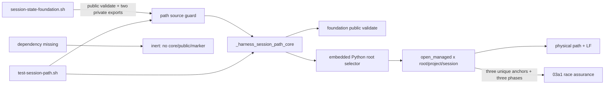
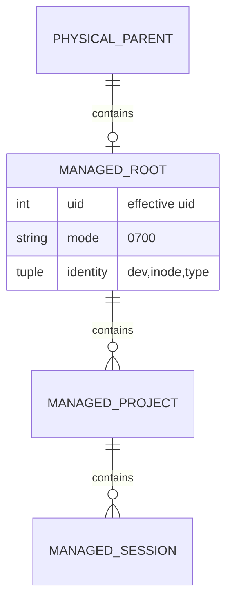
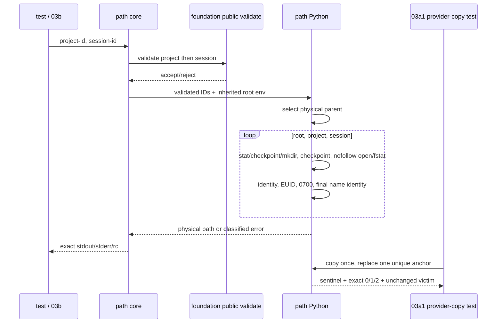

# 任务 1: 建立source/inert与validate fail-fast骨架

> 这是你的需求。数值、签名、命令一律照抄，不要自己发挥。
> 你只做这一个任务，不要顺手做别的。不要派 subagent。

---

## 完整上下文

下面是整个 spec 的三个文件，让你了解整体需求、设计和任务分解。
**但你只执行「你的任务」那一节，不要去做别的任务。**

### Requirements

> 用户原话：“$spec review 这套 aosp harness 工程，有哪些欠缺的地方，进行重构和完善”；并确认后续按 autopilot 执行。PLAN v5.4 的 `03a-session-path-safety` 条目是本片直接依据。

## 目标

交付可独立验收的私有 path hardening 模块：在不修改 foundation 的前提下，实际消费 public `harness_validate_feature_name`，并对 root/project/session 的新建、`EEXIST` 竞争与既有目录统一执行 nofollow、EUID、精确 `0700` 和 name↔fd dev/inode/`fstat` 身份校验。安全探针固定为 `HARNESS_TEST_MARKER_MANAGED_BEFORE_OPEN`、`HARNESS_TEST_MARKER_EXPECTED_EUID`、`HARNESS_TEST_MARKER_OS_ERROR`；本片不设置 `HARNESS_SESSION_STATE_PROVIDER_VERSION`，不发布 public path API，以 manifest 全 `PASS` 作为验收前提。

## 需求

R1. [计划] 当 foundation 的 `harness_validate_feature_name`、`_harness_session_state_foundation_path` 与 `_harness_session_state_run` 已定义时，系统必须使 source `common/.harness/lib/session-state-path.sh` 返回 `0`、stdout/stderr 为空，只新增私有 `_harness_session_path_core <project-id> <session-id>`；source 结果不得受 HARNESS/XDG/TMP 状态值影响，不得创建/修改文件、改写这三个变量的值/导出属性、覆写 foundation 函数体、设置 `HARNESS_SESSION_STATE_PROVIDER_VERSION` 或定义 `harness_session_state_path/write/read/remove`。

R2. [计划] 如果发生 R1 的 public validate 或两个 foundation 私有函数任一缺席，系统必须使直接 source path 模块静默返回 `0` 并保持 inert：不定义 `_harness_session_path_core`、状态 public API 或 marker。`bash ./tests/test-session-path.sh --dependency-absent` 与真实上游缺席时的默认运行都必须验证此分支，成功摘要与功能分支相同。

R3. [计划] 当调用 `_harness_session_path_core <project-id> <session-id>` 时，系统必须先检查 exact arity，再以 foundation public `harness_validate_feature_name` 按 project/session 顺序校验两个 ID，丢弃 validate 自身双流并映射为 core 的 unsafe 错误；合法调用按 foundation 的 HARNESS/XDG/TMP/default 选择语义得到 physical parent，以 fd-relative `mkdir/open` 持有 root/project/session 链，成功 stdout 唯一为 physical absolute session path+LF、stderr 空、返回 `0`。arity/ID/根安全错必须 stdout 空、stderr 精确 `error: unsafe session state\n`、返回 `2`；其他普通 OS 错 stdout 空、stderr 精确 `error: session state operation failed\n`、返回 `1`。

R4. [计划] 当 root/project/session 组件缺席时，系统必须在 `umask 077` 下用 `mkdir(0700)` 创建，不对 mkdir 后从 namespace 重新取得的任何 inode 执行 fchmod；新建成功后必须取 name stat，再 nofollow open/fstat 并证明 dev/inode/type/EUID/0700 一致。当组件已存在时，必须只校验而不 chmod，并且要求非链接目录、owner 等于当前 EUID、mode 精确 `0700`。对 root/project/session 各层的软链接、普通文件、错误 mode 或 owner 必须返回安全错 `2`，不跟随 victim，不修改既有 inode/mode/内容，不在不安全层下创建后续目录。fresh 的 stat-missing→mkdir 若遇 `EEXIST`，必须重新取 name stat 并执行同一套 type/EUID/0700/name-fd 校验：安全 winner 返回同一路径/`0`，不安全 winner 返回 `2`，winner 在 EEXIST 后消失或其他普通竞争 OS 错返回 `1`。

R5. [计划] 如果发生受管目录的 missing/create/open 竞争，系统必须通过一个生产文本仅出现一次的 `HARNESS_TEST_MARKER_MANAGED_BEFORE_OPEN` no-op checkpoint 函数支持 before_mkdir、after_eexist、before_open 三个调用 phase；provider-copy 只替换该函数体，按 phase/name/made 硬编码命中 root 并记录 sentinel，以真实制造 EEXIST catch、catch 后 winner 消失、existing swap（安全目录/链接/普通文件）与 mkdir-success replacement。系统必须在 nofollow fd 后比较 name stat 与 `fstat` 的 dev/inode/type；换入链接/非目录导致的 `ELOOP|ENOTDIR` 或身份不同返回 `2`，消失竞争返回 `1`。生产文件还必须各精确保留一个 `HARNESS_TEST_MARKER_EXPECTED_EUID` 和 `HARNESS_TEST_MARKER_OS_ERROR`；本片以 root 层代表性注入逐例证明 safe/unsafe/disappearing EEXIST 的 `0|2|1`、wrong EUID、replacement不被chmod、真实EIO映射和sentinel/catch命中。生产模块不得读取测试专用环境变量；同一driver在project/session层的穷举由直接后继03a1独占，且03a1通过前没有consumer。

R6. [计划] 系统必须提供独立离线 `tests/test-session-path.sh`，功能分支覆盖 fresh 与既有安全目录、root/project/session 三层静态攻击、两 project×两 session 唯一性、R5 的 root代表性 provider-copy mutation、参数/环境/错误字节和 source 零副作用；inert 分支覆盖 public validate 与两 private foundation export各自缺席。成功退出 `0` 且 stdout 末行精确为 `RESULT PASS  session path safety`，不调用设备、网络、build、Claude 或 Codex。

R7. [计划] 当 03a 进入验收时，系统必须由 controller 证明 execution BASE 到最终 HEAD 只修改 `common/.harness/lib/session-state-path.sh` 与 `tests/test-session-path.sh`、总 numstat 行数不超过 `400`，且本 spec 六列 `seq/task/base/head/reviewer/final-status` manifest 的任务顺序、首尾、相邻提交链和最终 `PASS` 都经机械校验；超范围、超行数、断链或非 PASS 必须拒绝验收。

## 验收标准

主验证命令: bash ./tests/test-session-path.sh
期望输出: 退出码为 `0`，stdout 末行精确为 `RESULT PASS  session path safety`

验收清单:

- [ ] `session-path-delivery-v1`由exact两个实现文件组成：private core、三个唯一anchor与固定PASS摘要测试均存在。
- [ ] source 功能分支和三种 missing-export inert fixture 都在同一隔离 shell/fixture 的一次 source 前后同时比较 rc/双流、三个 exported 状态变量的 `declare -p`、marker unset、仍应存在的 foundation 函数 `declare -f`、path/core/public 函数面和文件 inventory；`--dependency-absent` 退出 `0` 且使用同一成功摘要。
- [ ] core 的 arity `0/1/3`、非法 project/session 和 HARNESS/XDG/TMP/default 安全错都逐字节比较空stdout、固定 unsafe stderr 与 rc `2`；HARNESS、XDG、TMP、default 四个 safe fixture 各自逐字节断言合法 physical path+LF/0，其中一个 parent 使用 symlink 并必须输出物理目标，高优先级生效时低优先级候选 inventory 不变。
- [ ] 在隔离 fixture 中包装 foundation `harness_validate_feature_name`，让它记录 project/session 两次实际调用并拒绝一个原本合法的 session ID；PATH 内 fake `python3` 调用数必须为 `0`，core 返回精确 unsafe/`2`、命中 validate sentinel 且 inventory 不变。
- [ ] 同一 HARNESS root 下两 project×两 session 得到四条唯一路径，root、两 project、四 session 逐项为非链接目录、当前 EUID、精确 `0700`。
- [ ] root/project/session 各层预置软链接、普通文件和 wrong-mode，逐例返回 `2`且无后续创建，victim hash/inode/mode 不变，既有 wrong-mode 不被 chmod；wrong-owner只在root代表性provider-copy `EXPECTED_EUID` 注入中命中，project/session穷举属于03a1。
- [ ] MANAGED checkpoint 的 marker 文本精确一次且生产 helper实际调用before_mkdir/after_eexist/before_open；root代表性provider-copy按phase/name/made制造existing safe-dir/link/file swap、真实EEXIST safe/unsafe/disappearing winner与mkdir-success replacement，marker/replacement/sentinel/catch均命中，逐例证明exact `0|2|1`、替换winner未被chmod/跟随且无后续创建；`EXPECTED_EUID` root注入返回`2`，`OS_ERROR`真实EIO返回`1`。project/session穷举明确留给03a1。
- [ ] 循环逐名证明 `harness_session_state_path/write/read/remove` 均不存在，marker 仍 unset；foundation 文件 BASE..HEAD diff 为空，foundation 与 offline gate 仍退出 `0`。
- [ ] review manifest 的六列、任务序号、execution BASE、相邻 base/head、最终 HEAD 和全 `PASS` 一次机械校验通过；BASE..HEAD exact name-only 为上述两文件，numstat 总和 `<=400`，worktree clean。
- [ ] `bash ./scripts/check.sh --offline` 退出 `0` 且末行为 `RESULT PASS  aosp-harness offline quality gate`，`git diff --check` 退出 `0`。

不变量（不许劣化，2-4 项）:

- 软链接、非目录、wrong-mode/owner 与 stat→open 替换 case 的 victim 内容/inode/mode 变化数 ≤ `0`，验证: `bash ./tests/test-session-path.sh`。
- 不安全既有层下新建后续目录数 ≤ `0`，验证: `bash ./tests/test-session-path.sh` 的三层攻击 inventory。
- foundation 两个已验收文件的 BASE..HEAD 变更数 ≤ `0`，验证: `git diff --name-only "$BASE" "$HEAD" -- common/.harness/lib/session-state-foundation.sh tests/test-session-state-foundation.sh`。
- Claude、Codex、common、device-safety 与 foundation 回归失败数 ≤ `0`，验证: `bash ./scripts/check.sh --offline`。

## 超出范围

- 不修改 foundation module/test，不公开 path API，不设置 provider marker；03d 才发布完整 capability。
- 不实现 snapshot write/read、竞争发布、signal cleanup、remove/prune、aggregator 或 coverage active fragment；分别属于 03b–03d。
- 不在本片穷举 project/session 的 provider-copy race矩阵；直接后继 `03a1-session-path-race-assurance` 独占该测试，并在03b开始前强制通过。
- 不改 Claude/Codex hook、demo 或 `CURRENT_FEATURE`，不调用真实设备、网络、build 或客户端，不发布或 push。

### Design

# 03a-session-path-safety 设计

## 1. 概述

本片新增独占 `session-state-path.sh` 和 `test-session-path.sh`，不修改已验收 foundation。path module 在 source 时只检查 foundation 的一个 public validate 与两个 private path export；齐全时定义 `_harness_session_path_core`，任一缺席时静默 inert。core 先实际调用 public validate 校验两个 ID，再运行 embedded Python，在单次 fd 链内完成根选择、创建、existing-object 校验和 physical path 输出。

支持边界固定为 Linux kernel >=3.15、glibc >=2.28、Bash >=5.0、Python >=3.8；其他平台不在本片声称范围内。

- 生产 core 复用 foundation public `harness_validate_feature_name` 和结果协议，但不调用只返回字符串的 foundation path facade。facade 返回时 fd 已关闭，事后 harden 无法保护后续副作用。
- path module 内重建与 foundation 行为等价的根选择，一次持有 parent/root/project/session fd 直到结果确定。03a 文件 owner 禁止修改 foundation，现有跨模块签名也不能传递 fd。
- 单一 managed helper 统一 fresh、EEXIST winner 和 existing 对象。创建权限只依赖 `umask 077` 与 `mkdir(0700)`，此后只验证而不 chmod；mkdir 返回后 name 可能已指向替换 inode，任何事后 chmod 都可能修改竞争者对象。

## 2. 需求映射

| 组件 | 需求 |
|---|---|
| source capability guard / inert branch | R1, R2 |
| Bash core + foundation public validate | R1, R3 |
| Python root selector / managed fd chain | R3, R4 |
| multi-phase checkpoint、identity、owner、EIO markers | R4, R5 |
| present/inert/attack test + manifest gate | R6, R7 |

## 3. 架构



消费的三个签名严格是：

- `harness_validate_feature_name <name>`
- `_harness_session_state_foundation_path <project-id> <session-id>`
- `_harness_session_state_run path <project-id> <session-id>`

foundation facade 与 run export 是 source compatibility guard，但 core 不调用它们。测试证明三个依赖任一缺席时 inert，全部存在时 core 真正调用 public validate。

03a1直接消费 `_harness_session_path_core <project-id> <session-id>` 与三个生产文本唯一的anchor：`HARNESS_TEST_MARKER_MANAGED_BEFORE_OPEN` checkpoint必须实际以`before_mkdir`、`after_eexist`、`before_open`调用，另两个是`HARNESS_TEST_MARKER_EXPECTED_EUID`和`HARNESS_TEST_MARKER_OS_ERROR`。03a1只复制provider测试，不修改或source时消费anchor。

## 4. 组件与接口

### Source guard

- 前置：`declare -F` 同时命中 `harness_validate_feature_name`、`_harness_session_state_foundation_path`、`_harness_session_state_run`。
- present：只定义 `_harness_session_path_core`，source rc `0`、双流空。
- absent/partial：source rc `0`、双流空，不定义 core/public/marker。
- 两分支都不执行 Python，不展开 HARNESS/XDG/TMP 值，不改写 foundation 函数或 caller 变量。

### Private path core

`_harness_session_path_core <project-id> <session-id>`

1. exact arity 不是 `2` 时直接 unsafe/`2`，不读未定义位置参数。
2. 顺序调用 `harness_validate_feature_name "$1" >/dev/null 2>&1` 与 `harness_validate_feature_name "$2" >/dev/null 2>&1`；任一拒绝时在 Python 前返回 core 自身的 unsafe/`2`。
3. 在 subshell设 `umask 077` 并调用 embedded Python。成功唯一 stdout 为 physical absolute session path+LF、stderr 空、rc `0`。
4. `UnsafeState` 唯一映射空 stdout/`error: unsafe session state\n`/`2`；`OperationFailure` 与普通 `OSError` 唯一映射空 stdout/`error: session state operation failed\n`/`1`。

### Root selector

- HARNESS set：精确路径；empty、relative、control、dot-component、`/`拒绝；strict resolve existing parent，leaf 作受管 root。
- HARNESS unset 且 XDG set：empty/危险拒绝；strict resolve base，root leaf=`aosp-harness-$EUID`。
- 两者 unset：TMP nonempty 时 strict resolve 它，TMP empty/unset 使用 `/tmp`，root leaf同上。
- 候选一旦选中不读低优先级路径；输出使用 resolved physical parent/base。

### Managed directory helper

`open_managed(parent_fd, name) -> child_fd`

1. 定义生产 no-op `_managed_checkpoint(phase, parent_fd, name, made)`；函数体内唯一出现 `HARNESS_TEST_MARKER_MANAGED_BEFORE_OPEN`。正常逻辑在 `before_mkdir`、`after_eexist`、`before_open` 三个 phase 调用它。
2. 先 `stat(name, follow_symlinks=False)`。missing 时 checkpoint(`before_mkdir`, made=False)，再尝试 `mkdir(0700, dir_fd=parent_fd)`；成功后立即 name stat并记 `made=True`。
3. `FileExistsError` catch 先执行可观测 catch sentinel，再 checkpoint(`after_eexist`, made=False)并重取 name stat；winner 消失映射 operation/`1`，不重试创建。
4. name stat 已取得后 checkpoint(`before_open`, 当前 made)，再拒绝链接/非目录；随后 `openat(O_RDONLY|O_DIRECTORY|O_NOFOLLOW|O_CLOEXEC)` 与 `fstat`，比较 before↔fd dev/inode/type。open 的 `ELOOP|ENOTDIR`（含 stat→open 换入链接/非目录）映射 unsafe/`2`，`ENOENT` 等消失竞争映射 operation/`1`。
5. 在 helper 内唯一 `HARNESS_TEST_MARKER_EXPECTED_EUID` 后得到 expected EUID；fresh、EEXIST winner、existing 一律只校验 fd owner 与精确 `0700`，绝不 chmod。
6. 再取 after name stat，比较 after↔fd dev/inode/type。任一 identity/type/owner/mode 不符映射 unsafe/`2`。
7. 从 physical parent fd 开始，对 root leaf、project、session 三次调用，只从刚持有的 child fd 继续；`finally` 逆序关闭全部 fd。

### Error/mutation points

- `HARNESS_TEST_MARKER_MANAGED_BEFORE_OPEN`：只位于 no-op checkpoint 函数体且生产文本精确一次；copy replacement 按 `phase`/`name`/`made` 命中目标层，可真实介入 mkdir 前、EEXIST catch 后与 open 前。
- `HARNESS_TEST_MARKER_EXPECTED_EUID`：生产文本精确一次；copy replacement 依 `name` 只改目标层 expected EUID。
- `HARNESS_TEST_MARKER_OS_ERROR`：生产文本精确一次，位于首个 Python fd 操作前；copy 抛真实 `OSError(errno.EIO)`。
- marker 都是测试复制文本锚点；生产逻辑不读取 test-only env。

## 5. 数据模型

三层使用同一不变量：安全单组件 name、nofollow directory fd、EUID owner、精确 `0700`、name stat 与 fd 的 dev/inode/type一致。path module 不创建 feature snapshot，不定义 public capability。



## 6. 数据流



## 7. 错误处理

| 阶段/错误 | 分类 | rc | 副作用 |
|---|---|---:|---|
| Bash arity/public validate reject | unsafe | 2 | Python 未启动，inventory 不变 |
| 危险根、parent/base 缺席 | unsafe | 2 | 不创建 parent/base |
| existing/EEXIST winner link、non-dir、wrong owner/mode | unsafe | 2 | 不 chmod，不创建后层 |
| before/after name stat 与 fd identity 不一致 | unsafe | 2 | 不跟随 victim |
| EEXIST winner 重取时消失 | operation | 1 | 不重试或创建新 winner |
| mkdir/open/fstat/final-stat 普通 OS 错 | operation | 1 | 关闭本调用 fd，不回滚他人 winner |
| success | success | 0 | 仅安全三层存在 |

Python 不输出中间诊断；顶层 catch 只输出 requirements 的两个固定 stderr。刚创建的本调用空目录在后续 operation 失败时不 prune；remove/prune 属于 03d，验收只要求 victim 与不安全层零变化。

## 8. 测试策略

- source：present 与三个 missing-dependency fixture 都比较 rc/双流、HARNESS/XDG/TMP `declare -p`、仍存在的 foundation 函数、core/public/marker 和 inventory；`--dependency-absent` 专门跑 inert fixture。
- validate：包装 public validate，log project/session 两参数并拒绝合法 session；PATH 内 fake `python3` 调用数必须为零，断言 unsafe/`2` 与 inventory 不变。
- roots：HARNESS/XDG/TMP/default 四成功输出，HARNESS 成功时低优先级 untouched，symlink parent 输出 physical path；危险/缺席表逐字节 unsafe/`2`。
- managed：同根两 project×两 session和全部 type/EUID/0700/nonlink；root/project/session 各自软链接、文件、wrong-mode 静态表。
- mutations：共用 copy/count/replace/sentinel/inventory helper；本片在root层实际覆盖existing safe-dir/link/file swap、wrong EUID、EEXIST safe/unsafe/disappearing、mkdir-success replacement与EIO。每例先证明注入命中，再检查exact streams/rc/victim/inventory；project/session穷举由03a1独占，且03a1通过前没有consumer。
- surface/regression：四 public state API 与 marker absent；foundation files BASE..HEAD 不变；path 摘要唯一，foundation test和offline gate通过。
- size/review：以 `prototypes/` 下 runnable/countable skeleton 的实测行数和 case inventory 为依据；实现硬门仍为 exact 2 files/400 numstat，controller 维护六列连续 manifest。

## 9. 文件清单

| 文件 | 创建/修改 | 职责 | 目标 |
|---|---|---|---:|
| `common/.harness/lib/session-state-path.sh` | 创建 | source guard、private core、root/managed fd hardening | 见 sizing 实测 |
| `tests/test-session-path.sh` | 创建 | present/inert、root/static/race/mutation 回归 | 见 sizing 实测 |

BASE..HEAD 硬门不超过 400。`.spec` 下 prototype、sizing、brief、report、review package 和 manifest 不进入实现 diff。

### 所有任务

# 2026-09-01-03a-session-path-safety 实现计划

执行基线固定为进入execute时记录的`BASE_SHA`。每次提交后controller都运行exact-name与numstat累计检查：只允许`common/.harness/lib/session-state-path.sh`、`tests/test-session-path.sh`，累计达到380行停止扩展并压缩共享helper，超过400立即回PLAN。提交使用个人项目Conventional Commits，不使用公司五段式模板。

### 任务 1: 建立source/inert与validate fail-fast骨架

文件: 创建 `common/.harness/lib/session-state-path.sh` / 创建 `tests/test-session-path.sh`
消费: 无
产出: foundation-contract-v1 —— `harness_validate_feature_name <name>` plus `_harness_session_state_foundation_path <project-id> <session-id>` plus `_harness_session_state_run path <project-id> <session-id>`已由fixture实际验证；path-core-shell-v1 —— `_harness_session_path_core <project-id> <session-id>`的source guard、exact arity与public validate fail-fast骨架
需求: R1, R2, R3, R6
必需: 是

- [ ] 步骤 1: 创建隔离Shell测试，逐字断言依赖齐全source为`0/空双流`且只定义private core，并比较source前后HARNESS/XDG/TMP的`declare -p`、foundation函数体和fixture inventory；public validate或两个private export逐一缺席时source静默inert；包装validate记录project/session并拒绝合法session，PATH内fake`python3`计数必须为0。
- [ ] 步骤 2: 运行`bash ./tests/test-session-path.sh --case source-validate`，确认失败：退出`1`且stderr首行精确为`FAIL source present: provider missing`。
- [ ] 步骤 3: 最小实现三函数`declare -F`guard、private core exact arity、顺序调用`harness_validate_feature_name`并把其双流丢弃后映射为`error: unsafe session state\n`/`2`；source期间不读取根变量、不启动Python、不定义public API/marker。
  ```bash
  if declare -F harness_validate_feature_name >/dev/null && declare -F _harness_session_state_foundation_path >/dev/null && declare -F _harness_session_state_run >/dev/null; then
    _harness_session_path_core() (
      if [[ $# != 2 ]] || ! harness_validate_feature_name "$1" >/dev/null 2>&1 || ! harness_validate_feature_name "$2" >/dev/null 2>&1; then
        printf '%s\n' 'error: unsafe session state' >&2
        return 2
      fi
      printf '%s\n' 'error: session state operation failed' >&2
      return 1
    )
  fi
  ```
- [ ] 步骤 4: 运行`bash ./tests/test-session-path.sh --case source-validate && bash -n common/.harness/lib/session-state-path.sh tests/test-session-path.sh`，确认退出`0`；随后验证BASE..HEAD仍为exact两文件且累计numstat不超过150。
- [ ] 步骤 5: 以`feat(session): add guarded path core`提交并记录红阶段日志、提交SHA与累计numstat；本任务独立review最终PASS后controller才派任务2。

### 任务 2: 实现根选择与统一managed目录校验

文件: 修改 `common/.harness/lib/session-state-path.sh` / 修改 `tests/test-session-path.sh`
消费: foundation-contract-v1 —— `harness_validate_feature_name <name>` plus `_harness_session_state_foundation_path <project-id> <session-id>` plus `_harness_session_state_run path <project-id> <session-id>`已由fixture实际验证；path-core-shell-v1 —— `_harness_session_path_core <project-id> <session-id>`的source guard、exact arity与public validate fail-fast骨架
产出: path-core-managed-v1 —— `_harness_session_path_core <project-id> <session-id>`的完整root selector与`open_managed(parent_fd,name)`
需求: R3, R4, R6
必需: 是

- [ ] 步骤 1: 增加`--case roots-static`测试：HARNESS/XDG/TMP/default与physical symlink parent逐字输出，高优先级时低优先级inventory不变；empty/relative/control/dot-component/root slash/missing parent按优先级逐字断言unsafe/2且零创建；同根2project×2session逐项验证非链接目录/EUID/0700；root/project/session分别预置link/file/wrong-mode并验证unsafe/2、victim与后续inventory零变化。
- [ ] 步骤 2: 运行`bash ./tests/test-session-path.sh --case roots-static`，确认失败：退出`1`且stderr首行精确为`FAIL root HARNESS: python path engine missing`。
- [ ] 步骤 3: 在`umask 077`的embedded Python中实现foundation等价root selector与统一`open_managed`：mkdir(0700)后绝不fchmod，nofollow stat/open/fstat，校验type/dev/inode/EUID/exact0700及final name identity；`ELOOP|ENOTDIR`映射unsafe/2，普通OS错映射operation/1，逆序关闭fd。
  ```python
  def identity(info):
      return info.st_dev, info.st_ino, stat.S_IFMT(info.st_mode)
  def validate_fd(before, child_fd, expected_euid):
      current = os.fstat(child_fd)
      if identity(before) != identity(current) or current.st_uid != expected_euid or stat.S_IMODE(current.st_mode) != 0o700:
          raise UnsafeState
      return current
  def managed_open_error(exc):
      if exc.errno in (errno.ELOOP, errno.ENOTDIR):
          raise UnsafeState from exc
      raise OperationFailure from exc
  ```
- [ ] 步骤 4: 运行`bash ./tests/test-session-path.sh --case source-validate && bash ./tests/test-session-path.sh --case roots-static`，确认全部退出`0`；再运行`! grep -q fchmod common/.harness/lib/session-state-path.sh`并验证累计numstat不超过280。
- [ ] 步骤 5: 以`feat(session): harden managed path traversal`提交并记录红阶段日志、提交SHA与累计numstat；本任务独立review最终PASS后controller才派任务3。

### 任务 3: 加入multi-phase竞态探针与root承重mutation

文件: 修改 `common/.harness/lib/session-state-path.sh` / 修改 `tests/test-session-path.sh`
消费: path-core-managed-v1 —— `_harness_session_path_core <project-id> <session-id>`的完整root selector与`open_managed(parent_fd,name)`
产出: path-core-race-v1 —— `_harness_session_path_core <project-id> <session-id>` plus `HARNESS_TEST_MARKER_MANAGED_BEFORE_OPEN`三phase plus `HARNESS_TEST_MARKER_EXPECTED_EUID` plus `HARNESS_TEST_MARKER_OS_ERROR`
需求: R4, R5, R6
必需: 是

- [ ] 步骤 1: 增加`--case mutations`的单一provider-copy/count/replace/sentinel/inventory driver，实际执行root existing safe-dir/link/file swap、EEXIST safe/unsafe/disappearing、mkdir-success replacement、wrong EUID与真实`OSError(errno.EIO)`；逐字断言`0|2|1`、catch/phase sentinel、replacement mode/victim/inventory零变化。
- [ ] 步骤 2: 运行`bash ./tests/test-session-path.sh --case mutations`，确认失败：退出`1`且stderr首行精确为`FAIL marker MANAGED count: expected 1 got 0`，不得把未注入case计为通过。
- [ ] 步骤 3: 实现文本仅一次的no-op `_managed_checkpoint(phase,parent_fd,name,made)`并在三phase调用；EEXIST catch后重取winner且消失映射operation/1；加入唯一EXPECTED_EUID与首个fd操作前OS_ERROR anchor，生产逻辑不读test-only env。
  ```python
  def _managed_checkpoint(phase, parent_fd, name, made):
      pass  # HARNESS_TEST_MARKER_MANAGED_BEFORE_OPEN
  _managed_checkpoint("before_mkdir", parent_fd, name, False)
  _managed_checkpoint("after_eexist", parent_fd, name, False)
  _managed_checkpoint("before_open", parent_fd, name, made)
  expected_euid = os.geteuid()  # HARNESS_TEST_MARKER_EXPECTED_EUID
  pass  # HARNESS_TEST_MARKER_OS_ERROR
  ```
- [ ] 步骤 4: 运行`bash ./tests/test-session-path.sh --case mutations && bash ./tests/test-session-path.sh --case roots-static`，确认退出`0`；逐个`grep -c`三个marker均为1、三个phase均存在、provider无`fchmod`，累计numstat不超过370。
- [ ] 步骤 5: 以`test(session): cover path race boundaries`提交并记录红阶段日志、提交SHA与累计numstat；本任务独立review最终PASS后controller才派任务4。

### 任务 4: 闭合回滚入口、公共surface与最终门禁

文件: 修改 `tests/test-session-path.sh` / 验证 `common/.harness/lib/session-state-path.sh`
消费: path-core-race-v1 —— `_harness_session_path_core <project-id> <session-id>` plus `HARNESS_TEST_MARKER_MANAGED_BEFORE_OPEN`三phase plus `HARNESS_TEST_MARKER_EXPECTED_EUID` plus `HARNESS_TEST_MARKER_OS_ERROR`
产出: session-path-delivery-v1 —— _harness_session_path_core <project-id> <session-id>成功path+LF/0或OS错1或安全协议错2 plus三个生产文本唯一anchor plus tests/test-session-path.sh固定PASS摘要
需求: R1, R2, R6, R7
必需: 是

- [ ] 步骤 1: 增加默认全组执行、`--dependency-absent`真实上游缺席fixture、四个public state API与provider marker absent、foundation两文件不变、唯一PASS摘要；测试自身逐字检查双流/rc并清理所有fixture。
- [ ] 步骤 2: 运行`bash ./tests/test-session-path.sh --dependency-absent`，确认失败：退出`1`且stderr首行精确为`FAIL option: --dependency-absent unsupported`；保存红阶段证据。
- [ ] 步骤 3: 最小连接case dispatcher与回滚fixture，不扩入project/session穷举mutation；若累计达到380行先合并共享helper，任何R1–R7 oracle不得删除。
  ```bash
  case ${1:-all} in
    --case) group=${2:?missing case name} ;;
    --dependency-absent) group=dependency-absent ;;
    all) group=all ;;
    *) fail "option: ${1:-empty} unsupported" ;;
  esac
  run_group "$group"
  printf '%s\n' 'RESULT PASS  session path safety'
  ```
- [ ] 步骤 4: 运行`bash ./tests/test-session-path.sh && bash ./tests/test-session-path.sh --dependency-absent && bash ./tests/test-session-state-foundation.sh && bash ./scripts/check.sh --offline && git diff --check`，确认全部退出`0`且两个path命令末行精确PASS；提交前以`EXPECTED=$(printf '%s\n' common/.harness/lib/session-state-path.sh tests/test-session-path.sh); test "$(git diff --name-only "$BASE_SHA" | LC_ALL=C sort)" = "$EXPECTED"; git diff --numstat "$BASE_SHA" | awk 'NF!=3 || $1 !~ /^[0-9]+$/ || $2 !~ /^[0-9]+$/ {bad=1} {files++; lines += $1+$2} END {exit bad || files!=2 || lines>400}'`把task4工作区改动纳入exact两文件/400行门。
- [ ] 步骤 5: 以`test(session): close path safety contract`提交并完成本任务独立review；所有review fix提交也最终PASS后，controller只汇总四个最终PASS结果到`$REVIEW_MANIFEST`，再运行`HEAD_SHA=$(git rev-parse HEAD); EXPECTED=$(printf '%s\n' common/.harness/lib/session-state-path.sh tests/test-session-path.sh); test "$(git diff --name-only "$BASE_SHA" "$HEAD_SHA" | LC_ALL=C sort)" = "$EXPECTED"; git diff --numstat "$BASE_SHA" "$HEAD_SHA" | awk 'NF!=3 || $1 !~ /^[0-9]+$/ || $2 !~ /^[0-9]+$/ {bad=1} {files++; lines += $1+$2} END {exit bad || files!=2 || lines>400}'; awk -F '\t' -v base="$BASE_SHA" -v head="$HEAD_SHA" 'NF!=6 || $1!=NR || $2!="task-" NR || $3 !~ /^[0-9a-f]{40}$/ || $4 !~ /^[0-9a-f]{40}$/ || $5=="" || $6!="PASS" {bad=1} NR==1 && $3!=base {bad=1} NR>1 && $3!=prev {bad=1} {prev=$4} END {exit bad || NR!=4 || prev!=head}' "$REVIEW_MANIFEST"; test -z "$(git status --porcelain)"`，全部退出`0`后才完成本片。

---

## 你的任务

文件: 创建 `common/.harness/lib/session-state-path.sh` / 创建 `tests/test-session-path.sh`
消费: 无
产出: foundation-contract-v1 —— `harness_validate_feature_name <name>` plus `_harness_session_state_foundation_path <project-id> <session-id>` plus `_harness_session_state_run path <project-id> <session-id>`已由fixture实际验证；path-core-shell-v1 —— `_harness_session_path_core <project-id> <session-id>`的source guard、exact arity与public validate fail-fast骨架
需求: R1, R2, R3, R6
必需: 是

- [ ] 步骤 1: 创建隔离Shell测试，逐字断言依赖齐全source为`0/空双流`且只定义private core，并比较source前后HARNESS/XDG/TMP的`declare -p`、foundation函数体和fixture inventory；public validate或两个private export逐一缺席时source静默inert；包装validate记录project/session并拒绝合法session，PATH内fake`python3`计数必须为0。
- [ ] 步骤 2: 运行`bash ./tests/test-session-path.sh --case source-validate`，确认失败：退出`1`且stderr首行精确为`FAIL source present: provider missing`。
- [ ] 步骤 3: 最小实现三函数`declare -F`guard、private core exact arity、顺序调用`harness_validate_feature_name`并把其双流丢弃后映射为`error: unsafe session state\n`/`2`；source期间不读取根变量、不启动Python、不定义public API/marker。
  ```bash
  if declare -F harness_validate_feature_name >/dev/null && declare -F _harness_session_state_foundation_path >/dev/null && declare -F _harness_session_state_run >/dev/null; then
    _harness_session_path_core() (
      if [[ $# != 2 ]] || ! harness_validate_feature_name "$1" >/dev/null 2>&1 || ! harness_validate_feature_name "$2" >/dev/null 2>&1; then
        printf '%s\n' 'error: unsafe session state' >&2
        return 2
      fi
      printf '%s\n' 'error: session state operation failed' >&2
      return 1
    )
  fi
  ```
- [ ] 步骤 4: 运行`bash ./tests/test-session-path.sh --case source-validate && bash -n common/.harness/lib/session-state-path.sh tests/test-session-path.sh`，确认退出`0`；随后验证BASE..HEAD仍为exact两文件且累计numstat不超过150。
- [ ] 步骤 5: 以`feat(session): add guarded path core`提交并记录红阶段日志、提交SHA与累计numstat；本任务独立review最终PASS后controller才派任务2。

## 报告契约

完整报告写进控制器指定的 `task-N-report.md`（路径由控制器给出）。

返回控制器的只有：
- **Status**：`DONE` / `DONE_WITH_CONCERNS` / `NEEDS_CONTEXT` / `BLOCKED`
- **Commits**：本任务产生的 commit 列表
- **一行测试摘要**：例如 `Ran 12 tests, OK`
- **顾虑**：如有

