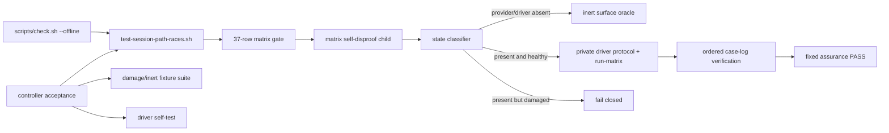
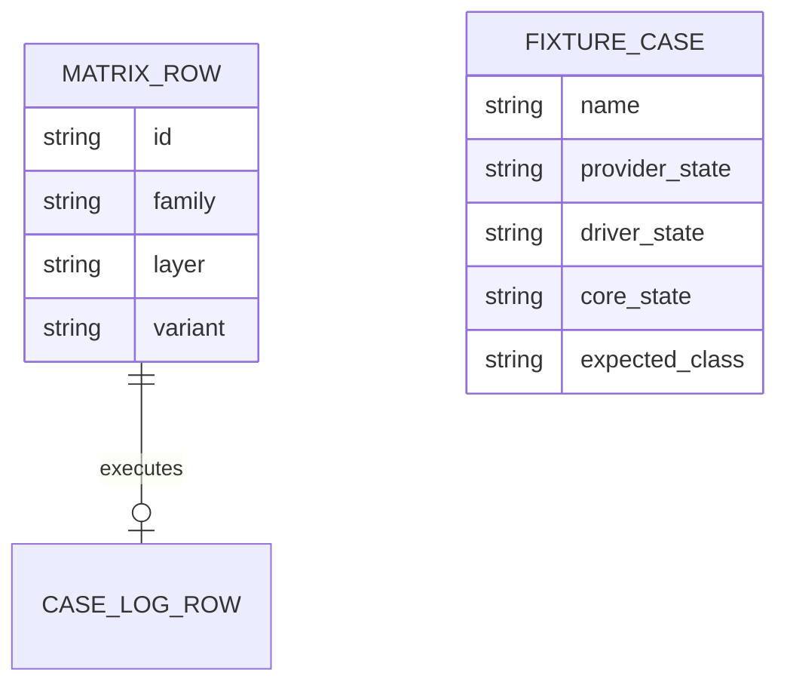
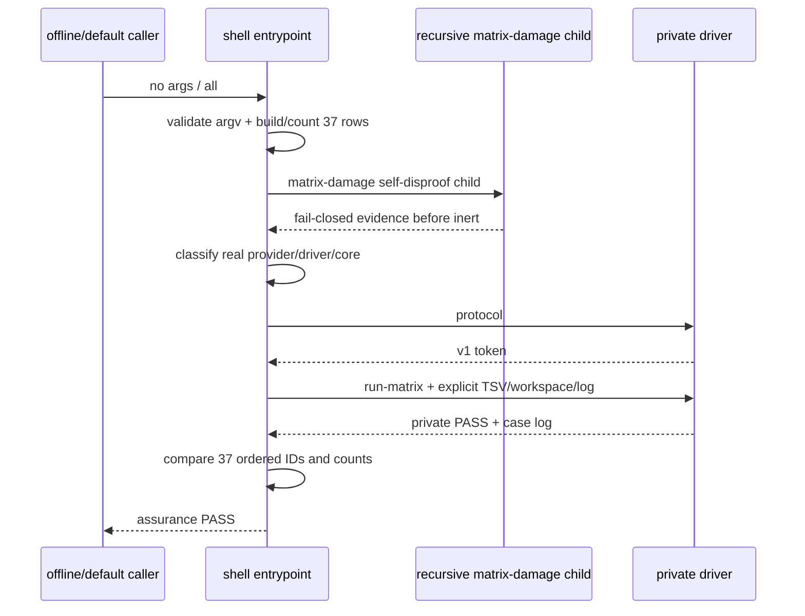

# 任务 2: 建立provider/driver/core优先级分类器

> 这是你的需求。数值、签名、命令一律照抄，不要自己发挥。
> 你只做这一个任务，不要顺手做别的。不要派 subagent。

---

## 完整上下文

下面是整个 spec 的三个文件，让你了解整体需求、设计和任务分解。
**但你只执行「你的任务」那一节，不要去做别的任务。**

### Requirements

> 用户原话：“$spec review 这套 aosp harness 工程，有哪些欠缺的地方，进行重构和完善”；并确认后续按 autopilot 执行。PLAN v5.6固定03a2在03a1 accepted HEAD与全PASS manifest入ledger之后启动，并在任何path consumer 03b之前交付默认37-case门。

## 目标

只新增一个由root offline gate默认发现的shell入口，把37-row四列matrix及九类计数的所有权从private driver外置出来；入口明确校验driver `protocol`，所有分支持续保持`HARNESS_SESSION_STATE_PROVIDER_VERSION`缺席。依赖齐全时必须真实调用已验收driver执行37/37，依赖缺席时保持零case inert，依赖存在但损坏时fail closed，从而在03b开始前形成可回滚、可浅克隆复现的三层path race门禁。

## 需求

R1. [计划] 当03a provider与03a1 driver已合入时，系统必须只新增`tests/test-session-path-races.sh`，不得修改foundation、provider、driver或既有测试，不得定义状态public API或设置`HARNESS_SESSION_STATE_PROVIDER_VERSION`；脚本必须从自身physical路径解析repo root，只消费tracked foundation/provider/driver，不读取固定历史SHA、网络、设备或AOSP build。

R2. [计划] 当入口生成matrix时，系统必须在读取provider/driver、判断inert或执行任何race case之前，按唯一顺序生成exact 37行四列TSV：swap 9、wrong-euid 3、eexist 9、mkdir-replace 3、mkdir-failure 3、post-mkdir-disappear 3、open-disappear 3、final-stat-disappear 3、real-eio 1。系统必须独立核对37行、37个唯一canonical ID与九类连续计数`9/3/9/3/3/3/3/3/1`；matrix损坏必须rc1、stdout无成功摘要，即使provider/driver/foundation同时缺席也不得被inert掩盖。

R3. [计划] 当调用入口时，系统必须只接受无参数、显式`all`或唯一`--dependency-absent`；无参数与`all`行为逐字相同。unknown、额外参数或`--dependency-absent`带值必须rc1且不得打印成功摘要。所有成功分支必须rc0、stderr空、stdout逐字节唯一为`RESULT PASS  session path race assurance\n`。

R4. [计划] 当tracked provider物理缺席时，default与`--dependency-absent`必须执行同一零case inert oracle并成功；当provider存在时，系统必须在foundation/core/flag判断之前先要求三个生产anchor文本各精确一次，任一缺失或重复都fail closed rc1，不能因foundation缺席或flag转为inert。inert oracle必须在隔离shell中证明private core、四个状态public API和provider marker全部缺席，不得source出partial capability。

R5. [计划] 当provider结构完整时，系统必须按以下优先级处理driver：物理缺席则default与`--dependency-absent`零case inert；路径是symlink或存在但非普通文件则fail closed；普通文件必须以`python3 DRIVER protocol`得到rc0、stderr空和逐字`session-path-race-driver-v1\n`，语法/执行/protocol损坏均fail closed。只有provider与driver均通过上述自损坏门后，`--dependency-absent`、foundation物理缺席或source后`_harness_session_path_core`不可用才允许走同一零case inert oracle。

R6. [计划] 当provider、driver、foundation与core齐全且使用default/all时，系统必须在一次入口运行中只调用driver一次`protocol`和一次`run-matrix FOUNDATION PROVIDER ABSENT_WORKSPACE CASE_TSV CASE_LOG`，绝不调用`self-test`；入口必须创建physical absent workspace、四列TSV与case-log路径。driver非零、stderr非空或stdout不逐字等于`RESULT PASS  session path race driver\n`必须fail closed。成功后入口必须逐字比较CASE_LOG与TSV第一列，重新核对37行/37唯一ID与九类计数，任何缺失、重复、额外、乱序或未执行都不得打印总PASS；fake-driver argv log必须能机械证明调用序列精确为`protocol,run-matrix`而不是74 case或重复调用。

R7. [计划] 当验证独立回滚与损坏态时，系统必须至少覆盖：provider absent；三个anchor各自missing/duplicate并与foundation missing/core unavailable/flag组合；driver absent、symlink、directory、protocol mismatch、syntax/rc failure；foundation absent；core unavailable；显式dependency-absent；matrix duplicate。provider/driver真正损坏必须优先fail closed，只有物理缺席或结构完整但运行依赖不可用的规定状态可inert；所有inert分支case-log必须为0 case且surface oracle通过。系统还必须在隔离candidate checkout只删除本片唯一entrypoint，随后独立运行driver self-test与offline gate：driver仍精确38-byte PASS、offline仍PASS且root gate发现race entrypoint次数为0，不要求任何03b文件存在。

R8. [计划] 当03a2进入验收时，系统必须由controller把`python3 DRIVER protocol`与`python3 DRIVER self-test FOUNDATION PROVIDER`作为入口之外的独立命令运行，再在dependency-present状态运行默认入口，三者均rc0且精确摘要；入口自身仍只调用R6的protocol/run-matrix。`bash ./scripts/check.sh --offline`必须自动发现并运行本入口。完整历史与真实file-URL `--depth 1` checkout都必须通过默认入口和offline，depth-1不得查询固定SHA。controller必须先逐字验证`shfmt --version`为`v3.14.0`、ShellCheck的version字段为`0.11.0`，再只对`tests/test-session-path-races.sh`运行`shfmt -d -i 2 -ci -bn`、`shellcheck -x --severity=warning`与`bash -n`，要求rc0且无差异/诊断。每个checkout必须从当前tracked provider/driver采集调用前SHA-256并在全部测试后逐字比较不变；accepted dependency身份由BASE..HEAD零diff与ledger绑定，运行时不查询固定历史SHA。03/03a/03a1回归、`git diff --check`与worktree clean必须通过。

R9. [计划] 当03a2提交验收时，系统必须证明execution BASE到accepted HEAD exact只新增`tests/test-session-path-races.sh`且numstat总和`<=400`，六列review manifest与tasks一一对应、首尾/相邻连续、reviewer非空且全PASS。controller必须先把03a2 accepted HEAD、dependency-present 37/37、九类计数与全PASS manifest写入ledger，才允许创建03b worktree、固定03b execution BASE或dispatch任务；任何inert PASS不能解除03b门。

R10. [默认] 如果发生37行、37唯一ID、九类计数、400行预算、full/depth-1、review manifest或dependency-present证据任一门不满足，系统必须拒绝03a2验收并保持03b worktree、execution BASE与dispatch缺席。

## 验收标准

终交付物：`session-path-race-matrix-v1 —— tests/test-session-path-races.sh提供默认发现的37-row入口、依赖缺席inert与固定RESULT PASS  session path race assurance摘要；无运行时API`。

主验证命令: bash ./tests/test-session-path-races.sh
期望输出: 退出码为`0`、stderr空，stdout逐字节精确为`RESULT PASS  session path race assurance\n`

验收清单:

- [ ] 无参数与`all`在dependency-present状态真实执行37/37，九类计数逐字为`9/3/9/3/3/3/3/3/1`，CASE_LOG与TSV ID有序逐字一致；fake-driver argv log证明入口精确调用`protocol,run-matrix`且不调用self-test，controller另行取得driver protocol/self-test精确摘要。
- [ ] matrix duplicate自损坏在provider/foundation/driver缺席时仍rc1、stdout 0B且无总PASS，证明matrix门先于任何inert分支。
- [ ] provider absent与driver absent分别零case inert；provider存在时三个anchor missing/duplicate始终fail closed；driver symlink/nonregular/protocol/语法/执行损坏始终fail closed。
- [ ] `--dependency-absent`、foundation absent与core unavailable只在provider/driver结构及protocol通过后inert；每个inert fixture均证明core、四public API和marker缺席且输出同一总摘要。
- [ ] unknown/extra参数rc1无PASS；driver非零、stderr非空、摘要错、case-log缺失/重复/额外/乱序均rc1无PASS。
- [ ] 在隔离candidate checkout只删除entrypoint后，driver self-test仍38-byte PASS、offline PASS、root gate发现race入口0次，且不需要03b文件。
- [ ] accepted driver protocol/self-test、默认入口、03/foundation、03a path与offline在主worktree、full checkout和真实depth-1中全部PASS；root offline gate真实发现本入口。
- [ ] `shfmt --version`精确`v3.14.0`、ShellCheck version字段精确`0.11.0`；仅entrypoint的`shfmt -d -i 2 -ci -bn`、`shellcheck -x --severity=warning`、`bash -n`无差异/诊断。每个checkout的当前tracked provider/driver测试前后SHA不变；diff-check与clean通过，BASE..HEAD exact1且只含entrypoint、numstat`<=400`，manifest连续全PASS。
- [ ] 03a2 accepted HEAD、dependency-present 37-case/九类计数和manifest写入ledger前，不存在03b worktree/base/dispatch；inert PASS不计作解除证据。

不变量（不许劣化，2-4项）:

- dependency-present默认入口case数或唯一ID数不等于`37`的次数 ≤ `0`，验证: CASE_TSV/CASE_LOG双向逐字比较。
- provider/driver损坏被inert掩盖的组合数 ≤ `0`，验证: R7优先级矩阵。
- 03/foundation、03a provider/test、03a1 driver的BASE..HEAD变更文件数 ≤ `0`，验证: 限定路径`git diff --name-only "$BASE" "$HEAD"`。
- full与depth-1默认入口/offline失败数 ≤ `0`，验证: 两种checkout分别运行主命令与offline gate。

## 超出范围

- 不修改private Python driver、不复制其family executor/signature/inventory/delta/14项自反证；shell只拥有matrix数据、依赖优先级、调用和case-log复核。
- 不新增生产模块、public API、capability marker、snapshot write/read、signals、remove/prune、consumer或coverage fragment；这些属于03b之后。
- 不声称inert PASS提供race覆盖；03b门只接受dependency-present 37/37证据。
- 不调用真实设备、网络、AOSP build或Claude/Codex客户端，不push、不清理既有spec branch/worktree。

### Design

# 03a2-session-path-race-matrix 设计

## 1. 概述

本片只创建`tests/test-session-path-races.sh`。它是root offline gate默认发现的Bash测试入口，拥有37-row四列matrix、依赖状态优先级和driver调用/复核；复杂race executor、对象oracle与14项自反证继续由已验收`tests/lib/session-path-race-driver.py`独占。

关键决定：入口只对driver调用一次`protocol`和一次`run-matrix`，绝不调用`self-test`；controller在入口之外独立验收self-test，避免默认/offline重复执行74 case。入口先验证参数和自身matrix，再按provider anchors、driver type/protocol、foundation/core的固定顺序区分fail-closed与inert。生产入口只为matrix duplicate内建一个provider缺席的递归child self-disproof；其余provider/driver/core损坏组合由`.spec` controller在隔离candidate root复跑，不新增skip-fixture环境seam。

技术边界沿用仓库：Linux、Bash >=5.0、Python >=3.8；入口只使用Bash、Python driver及现有基础文本工具。最终实现必须经shfmt 3.14.0与ShellCheck 0.11.0，单文件不超过400行。

## 2. 需求映射

| 组件 | 实现的需求 |
|---|---|
| argv/root/temp dispatcher | R1, R3 |
| canonical matrix builder + self-damage gate | R2, R10 |
| provider/driver/core state classifier | R4, R5, R7 |
| driver capture + case-log verifier | R6 |
| matrix self-disproof child + controller damage fixture suite | R3, R4, R5, R7 |
| checkout/tool/rollback/review controller gates | R8, R9, R10 |

## 3. 架构



消费签名逐字为：

`session-path-delivery-v1的private path core与三个唯一anchor；session-path-race-driver-v1的protocol/self-test/run-matrix私有CLI`

产出签名逐字为：

`session-path-race-matrix-v1 —— tests/test-session-path-races.sh提供默认发现的37-row入口、依赖缺席inert与固定RESULT PASS  session path race assurance摘要；无运行时API`

03a2不import driver内部实现。03b运行时仍直接消费03a core；它只把03a2 dependency-present accepted evidence当作启动前门，因此没有运行时循环依赖。

## 4. 组件与接口

### Public test CLI

| argv | 含义 | 成功摘要 |
|---|---|---|
| 无参数 | default actual dependency state | `RESULT PASS  session path race assurance\n` |
| `all` | 与无参数逐字相同 | 同上 |
| `--dependency-absent` | 验证规定inert surface | 同上 |

unknown、extra或flag带值为rc1、stdout无PASS。成功必须rc0、stderr空、stdout只有一行固定摘要。

入口通过`BASH_SOURCE[0]`的physical directory定位repo root，固定依赖路径为foundation、provider、同目录`lib/session-path-race-driver.py`。所有临时对象位于单个`mktemp -d` owner下，并用trap只清理该owner。

### Canonical matrix builder

每次运行先生成以下连续块：swap 9、wrong-euid 3、eexist 9、mkdir-replace 3、mkdir-failure 3、post-mkdir-disappear 3、open-disappear 3、final-stat-disappear 3、real-eio 1。写完立即验证：37行、第一列37唯一ID、第二列按连续块统计为`9/3/9/3/3/3/3/3/1`。计数只用C locale数据，不接受排序后掩盖原始块乱序。

私有child fixture通过test-only `HARNESS_TEST_MATRIX_DAMAGE`追加重复EIO；parent把entrypoint复制到provider缺席的隔离root并只对该child设置变量，要求rc1、stdout 0B、无摘要。这是matrix优先于inert的主动反证。该变量不是运行时API/capability，正常/default调用必须unset；controller另行证明外部损坏值只会使测试fail closed。

### State classifier

固定优先级如下：

1. argv合法且matrix gate、自损坏child均通过；
2. provider物理缺席：inert；
3. provider存在：三个anchor逐个要求文本精确一次，否则fail closed；
4. driver物理缺席：inert；driver symlink/非普通文件：fail closed；
5. 捕获driver `protocol`的rc/stdout/stderr，必须是0、精确token、空stderr，否则fail closed；
6. 显式flag、foundation物理缺席或source后core不可用：inert；
7. 其余dependency-present状态进入run-matrix。

`inert_surface()`在新Bash进程中unset marker/core/public functions；只在provider存在时source provider，并要求core、四public API与marker全部缺席。inert不创建driver workspace/case log，不执行case。

### Driver adapter

`capture_driver()`把stdout与stderr写到不同临时文件并保存rc，不能使用会把stderr泄漏到入口的裸command substitution。protocol要求0/精确28B/0B。dependency-present分支只调用一次：

`python3 DRIVER run-matrix FOUNDATION PROVIDER ABSENT_WORKSPACE CASE_TSV CASE_LOG`

要求rc0、stdout精确38B、stderr 0B。随后入口用TSV第一列生成expected log并`cmp`实际CASE_LOG，再验证37行、37唯一ID及九类计数。fake driver fixture写argv log，parent逐字要求两行只为`protocol`、`run-matrix`，且没有`self-test`。

### Controller damage fixture suite

生产entrypoint只内建matrix duplicate的递归self-disproof，不把全部损坏driver/provider fixture塞入默认运行。`.spec`下的prototype/controller与任务验收资产在隔离candidate root复制或替换最小foundation/provider/driver，表驱动覆盖provider absent；三个anchor各missing/duplicate与foundation/core/flag组合；driver absent/symlink/directory/protocol/syntax/rc/stderr/summary/log；foundation absent/core unavailable/flag；matrix duplicate。每行声明期望`inert-pass`或`fail-closed`、driver argv和case count。fixture Python与controller不进入implementation diff，最终独立review必须复跑同一矩阵。

## 5. 数据模型

无持久化数据。运行期只有以下临时记录：



CASE_TSV与CASE_LOG都在owner temp下；成功只通过逐字比较建立关系，退出后无状态保留。

## 6. 数据流



controller acceptance另行先后运行driver protocol、driver self-test、entrypoint、offline；self-test不是上图入口内部的一部分。

## 7. 错误处理

| 错误场景 | 恢复策略 | 校验位置 | 日志 | 用户可见 |
|---|---|---|---|---|
| argv或matrix损坏 | fail closed，不读依赖 | argv/matrix gate | stderr单行`FAIL` | rc1，stdout无PASS |
| provider或driver物理缺席 | 规定回滚inert | state classifier + inert surface | 无 | rc0，唯一固定摘要 |
| provider anchor损坏 | fail closed，不进入driver/core | anchor gate | stderr单行`FAIL` | rc1，stdout无PASS |
| driver symlink/nonregular/protocol/语法/rc损坏 | fail closed，不执行case | driver type/protocol capture | stderr单行`FAIL` | rc1，stdout无PASS |
| foundation/core不可用或显式flag | 规定dependency inert | core gate + inert surface | 无 | rc0，唯一固定摘要 |
| run-matrix rc/双流/summary错误 | fail closed，不接受partial log | driver result capture | stderr单行`FAIL` | rc1，stdout无PASS |
| case-log缺失/重复/额外/乱序 | fail closed，不解除03b门 | post-driver log gate | stderr单行`FAIL` | rc1，stdout无PASS |
| acceptance size/depth/manifest失败 | controller拒绝合入并保持03b缺席 | acceptance controller | `.spec` evidence/report | 无发布产出 |

## 8. 测试策略

| 层 | 测什么 | 命令/工具 |
|---|---|---|
| CLI | no-arg/all/flag/unknown/extra及精确摘要 | entrypoint child capture |
| matrix | 37/37、九类连续计数、damage优先 | TSV/cut/uniq/cmp与duplicate child |
| dependency | provider/anchor/driver/foundation/core优先级与inert surface | controller-owned isolated fixture table |
| adapter | exact protocol/run-matrix argv、独立双流与case log | fake driver argv log + real driver |
| rollback | 删除本entrypoint后driver self-test与offline仍绿且发现次数0 | 隔离candidate checkout |
| regression | driver protocol/self-test、03、03a、offline | requirements列出的主命令 |
| compatibility | full与真实file-URL depth-1 | 两个clean checkout |
| static | 唯一entrypoint格式/静态/语法 | shfmt 3.14.0、ShellCheck 0.11.0、bash -n固定argv |
| review | exact1/400、六列manifest、03b缺席 | Git + manifest/order gate |

每个checkout在测试前后比较当前tracked provider/driver SHA-256，不查询历史commit。root offline自动发现只匹配`tests/test-*.sh`，因此新增entrypoint被发现而private driver仍不被直接发现。

## 9. 文件清单

| 文件 | 创建/修改 | 职责（一句话） | 目标 |
|---|---|---|---:|
| `tests/test-session-path-races.sh` | 创建 | 默认37-row matrix、依赖分类、driver调用与matrix self-disproof | prototype实测137，硬门400 |

扩展可执行prototype实测entrypoint为137/400、临时候选exact1/137；dependency-present、18个anchor组合、driver损坏、inert、工具、rollback及full/depth-1均PASS，证据位于`work/2026-09-02-03a2-session-path-race-matrix/`。requirements/design/tasks、fixture controller、prototype、evidence、review与manifest只位于`.spec`，不进入implementation diff。03/03a/03a1及03b文件均不属于本片。

### 所有任务

# 2026-09-02-03a2-session-path-race-matrix 实现计划

执行基线固定为进入execute时的`BASE_SHA`。三个任务严格串行；每个任务先保存真实红阶段证据，再由实现agent参考`work/2026-09-02-03a2-session-path-race-matrix/prototype/tests/test-session-path-races.sh`的137行可执行蓝图完成最小纵切，提交普通Conventional Commit，最后交给未参与该任务实现的agent做`TASK_BASE..TASK_HEAD`独立diff review。controller只维护六列`review-manifest.tsv`、ledger与门禁，不读取或改写生产实现。任何blocker/important finding未复审PASS时不得派下一任务。

### 任务 1: 固定CLI、37-row matrix与最小inert表面

文件: 创建 `tests/test-session-path-races.sh`
消费: 无
产出: matrix-gate-v1
需求: R1, R2, R3, R4
必需: 是
状态: 完成

- [ ] 步骤 1: controller在派发前从implementation worktree只读记录`BASE_SHA=$(git rev-parse HEAD)`，验证为40位commit并把同一immutable值显式传入每个任务brief/report与最终controller命令；同时记录tracked foundation/provider/driver的SHA-256及目标文件物理缺席。运行`bash tests/test-session-path-races.sh`，红阶段必须因文件缺席而非临时同名源码失败，stdout不含`RESULT PASS`。
- [ ] 步骤 2: 只提取prototype的root/temp/argv、`write_matrix`、`check_matrix`、`inert_surface`与provider-absent分支。matrix顺序固定为swap9、wrong-euid3、eexist9、mkdir-replace3、mkdir-failure3、post-mkdir-disappear3、open-disappear3、final-stat-disappear3、real-eio1；在读取任何dependency前校验37行、37唯一ID及`9/3/9/3/3/3/3/3/1`。
- [ ] 步骤 3: 保留test-only `HARNESS_TEST_MATRIX_DAMAGE=duplicate`，parent把入口复制到provider缺席的隔离root并只给child设置该变量；child必须rc1/stdout0/no-PASS，且不得引入skip-fixture seam。provider物理缺席则在新Bash进程证明core、四public API及marker全缺席后输出唯一41B摘要；provider存在的临时过渡分支必须rc1诊断`dependency classifier incomplete`，不允许假绿。

  本片在matrix/inert helper之后的可直接落地收口固定为：

  ```bash
  validate_matrix || fail '37 unique rows and nine category counts'
  matrix_self_disproof
  if [[ ! -e $PROVIDER && ! -L $PROVIDER ]]; then
    pass_inert
  fi
  fail 'dependency classifier incomplete'
  ```
- [ ] 步骤 4: 在同一个provider物理缺席的隔离root中分别运行no-arg、`all`和`--dependency-absent`三种调用，均要求rc0、stdout逐字41B、stderr0；不得把provider-present误解为inert。unknown、`all extra`、`--dependency-absent value`均rc1/stdout0/no-PASS；matrix duplicate同时删除provider/foundation/driver仍在inert前rc1。在真实repo验证只因过渡诊断失败，不执行driver case。
- [ ] 步骤 5: 先`git add -N tests/test-session-path-races.sh`，再跑`bash -n`、`git diff --check`、BASE..working-tree exact1/400与dependency SHA不变；以`test(session): add race matrix gate`提交。保存red/green日志、实现报告和SHA，独立review最终PASS后才派任务2。

### 任务 2: 建立provider/driver/core优先级分类器

文件: 修改 `tests/test-session-path-races.sh`
消费: matrix-gate-v1
产出: dependency-classifier-v1
需求: R4, R5, R7
必需: 是

- [ ] 步骤 1: 在真实dependency-present repo运行`bash tests/test-session-path-races.sh`，确认当前红阶段精确因`dependency classifier incomplete`而rc1、stdout0/no-PASS；记录driver未被调用与provider/driver SHA不变。
- [ ] 步骤 2: 按设计固定顺序实现：provider缺席inert → provider存在则三anchor各exact1 → driver缺席inert/symlink或nonregular fail → `python3 DRIVER protocol`精确rc0/stdout28B/stderr0 → flag/foundation缺席/core不可用inert。protocol必须用分离临时文件捕获stdout/stderr与rc，不得用丢失末LF的command substitution判等。

  本片用下列完整顺序替换任务1的过渡收口，不提前加入`run-matrix`：

  ```bash
  for marker in HARNESS_TEST_MARKER_MANAGED_BEFORE_OPEN HARNESS_TEST_MARKER_EXPECTED_EUID HARNESS_TEST_MARKER_OS_ERROR; do
    count=$(grep -Fo "$marker" "$PROVIDER" | wc -l)
    [[ $count == 1 ]] || fail 'provider anchors: expected each exactly once'
  done
  if [[ -L $DRIVER || (-e $DRIVER && ! -f $DRIVER) ]]; then
    fail 'race driver: expected regular non-symlink file'
  fi
  if [[ ! -e $DRIVER ]]; then
    pass_inert
  fi
  printf '%s\n' "$DRIVER_PROTOCOL" >"$TMP_TEST/protocol.expected"
  if ! python3 "$DRIVER" protocol >"$TMP_TEST/protocol.out" 2>"$TMP_TEST/protocol.err"; then
    fail 'race driver protocol execution'
  fi
  [[ ! -s $TMP_TEST/protocol.err ]] && cmp -s "$TMP_TEST/protocol.out" "$TMP_TEST/protocol.expected" || fail 'race driver protocol bytes'
  if [[ $GROUP == dependency-absent ]] || ! core_available; then
    pass_inert
  fi
  fail 'race adapter incomplete'
  ```
- [ ] 步骤 3: dependency-present分支暂以唯一`race adapter incomplete`诊断rc1/no-PASS收口。用`.spec` controller隔离fixture表验证：provider absent；三anchor各missing/duplicate与foundation missing/core unavailable/flag的18组交叉；driver absent/symlink/directory/protocol mismatch/syntax/rc/stderr；foundation absent/core unavailable/flag。healthy-provider过渡红、provider-absent与18个anchor组合都替换为同一可记录fake driver，每个case使用独立`FAKE_DRIVER_ARGV_LOG`；生产diff不得加入fixture或controller。
- [ ] 步骤 4: 要求healthy-provider过渡红、provider-absent与anchor 18组的argv log物理缺席或0B，从而机械证明driver零调用；driver物理缺席inert且log 0行，其余损坏type/protocol状态fail closed；flag/foundation/core只inert且argv log精确一行`protocol`、无`run-matrix/self-test`，inert surface仍缺core/四API/marker。
- [ ] 步骤 5: 跑`bash -n`、`git diff --check`、BASE..working-tree exact1/400、03/03a/03a1限定路径零diff与dependency SHA不变；以`test(session): classify race dependencies`提交。独立review重点查顺序、精确双流和inert surface，最终PASS后才派任务3。

### 任务 3: 闭合run-matrix、case-log与accepted-HEAD门

文件: 修改 `tests/test-session-path-races.sh`
消费: dependency-classifier-v1
产出: session-path-race-matrix-v1
需求: R1, R2, R3, R5, R6, R7, R8, R9, R10
必需: 是
验收资产（不纳入源码文件清单）: 创建 `.spec/2026-08-31-aosp-harness-refactor/work/2026-09-02-03a2-session-path-race-matrix/acceptance/accepted-default.out` / 创建 `.spec/2026-08-31-aosp-harness-refactor/work/2026-09-02-03a2-session-path-race-matrix/acceptance/fake-driver.argv` / 创建 `.spec/2026-08-31-aosp-harness-refactor/work/2026-09-02-03a2-session-path-race-matrix/acceptance/matrix.tsv` / 创建 `.spec/2026-08-31-aosp-harness-refactor/work/2026-09-02-03a2-session-path-race-matrix/acceptance/case-log.expected` / 创建 `.spec/2026-08-31-aosp-harness-refactor/work/2026-09-02-03a2-session-path-race-matrix/acceptance/acceptance-report.md` / 创建 `.spec/2026-08-31-aosp-harness-refactor/work/2026-09-02-03a2-session-path-race-matrix/review-manifest.tsv`

- [ ] 步骤 1: 在真实dependency-present repo运行`bash tests/test-session-path-races.sh`，确认当前红阶段精确因`race adapter incomplete`而rc1、stdout0/no-PASS；controller同时独立确认driver `protocol`与`self-test FOUNDATION PROVIDER`均绿，证明红因只在入口adapter。
- [ ] 步骤 2: 删除唯一过渡红灯，调用且只调用一次`python3 DRIVER run-matrix FOUNDATION PROVIDER ABSENT_WORKSPACE CASE_TSV CASE_LOG`；workspace为临时owner的physical absent直接子路径，case-log位于workspace内。分离捕获rc/stdout/stderr，只receive rc0、38B driver摘要和0B stderr。
- [ ] 步骤 3: 驱动成功后从TSV第一列生成expected log并`cmp`实际CASE_LOG，再核对37行、37唯一ID与九类连续计数，任何driver rc/stderr/summary或log缺失/重复/额外/乱序都rc1/no-PASS。fake driver argv log必须逐字只有`protocol`、`run-matrix`两行，绝无`self-test`。

  本片只删除`race adapter incomplete`并在原位落下以下终态adapter：

  ```bash
  printf '%s\n' "$DRIVER_SUMMARY" >"$TMP_TEST/driver.expected"
  if ! python3 "$DRIVER" run-matrix "$FOUNDATION" "$PROVIDER" "$TMP_TEST/driver" "$CASE_TSV" "$CASE_LOG" >"$TMP_TEST/driver.out" 2>"$TMP_TEST/driver.err"; then
    fail 'race driver execution'
  fi
  [[ ! -s $TMP_TEST/driver.err ]] && cmp -s "$TMP_TEST/driver.out" "$TMP_TEST/driver.expected" || fail 'race driver result bytes'
  cut -f1 "$CASE_TSV" >"$TMP_TEST/cases.expected"
  cmp -s "$CASE_LOG" "$TMP_TEST/cases.expected" || fail '37-case ordered log'
  validate_matrix || fail 'post-driver matrix validation'
  [[ $(wc -l <"$CASE_LOG") == 37 && $(sort -u "$CASE_LOG" | wc -l) == 37 ]] || fail '37 unique executed cases'
  printf '%s\n' "$SUMMARY"
  ```
- [ ] 步骤 4: 跑真实no-arg/all，均得rc0/stdout41B/stderr0，CASE_LOG 37/37与`9/3/9/3/3/3/3/3/1`证据齐全；复跑全部inert/fail-closed表、参数、matrix damage、driver result/log damage、03 foundation、03a path、driver protocol/self-test和offline。fake fixture必须用`FAKE_DRIVER_ARGV_LOG`、`FAKE_DRIVER_MATRIX_EVIDENCE`与`FAKE_DRIVER_CASE_LOG_EVIDENCE`分别保存到已声明的`fake-driver.argv`、`matrix.tsv`与`case-log.expected`，controller以下列双仓骨架逐字复核。验证`shfmt --version`=`v3.14.0`与ShellCheck version field=`0.11.0`后，只对entrypoint运行`shfmt -d -i 2 -ci -bn`、`shellcheck -x --severity=warning`、`bash -n`。
- [ ] 步骤 5: 跑无range `git diff --check`、dependency前后SHA不变、BASE..working-tree exact1/400与旧模块零diff；以`test(session): execute session path race matrix`提交并保持implementation worktree clean。以candidate HEAD建立full checkout和真实`git clone --depth 1 file://...`，在两者独立验证protocol/self-test/default/offline、当前tracked dependency SHA不变、depth commit-count=1与clean；再建隔离rollback checkout，只删除entrypoint并证明driver self-test 38B、offline PASS、race发现0次且03b物理缺席。若review产生fix commit，对新最终HEAD重跑本步与步骤4全部门禁。
- [ ] 步骤 6: 独立review PASS后，controller验证六列manifest恰好3行、首行base=`BASE_SHA`、相邻连续、末行head=当前accepted HEAD、reviewer非空且全PASS；在ledger写入accepted HEAD、dependency-present 37/37、九类计数、full/depth-1/rollback证据之前，物理验证03b spec/worktree/branch/execution-base/dispatch全缺席。只有ledger成功落盘后才允许选中03b；任何inert PASS不得代替dependency-present证据。

  controller在写ledger之前必须以下列双仓、accepted-HEAD和fail-closed骨架为唯一收口；`CONTROL_REPO_ROOT`、`IMPLEMENTATION_WORKTREE`与任务1派发前锁定的40位`BASE_SHA`由controller显式传入，不从当前目录或未定义资产猜测：

  ```bash
  set -euo pipefail
  [[ $CONTROL_REPO_ROOT == /* && $IMPLEMENTATION_WORKTREE == /* ]]
  [[ $(git -C "$CONTROL_REPO_ROOT" rev-parse --show-toplevel) == "$CONTROL_REPO_ROOT" ]]
  [[ $(git -C "$IMPLEMENTATION_WORKTREE" rev-parse --show-toplevel) == "$IMPLEMENTATION_WORKTREE" ]]
  [[ $(git -C "$CONTROL_REPO_ROOT" rev-parse --path-format=absolute --git-common-dir) == \
     $(git -C "$IMPLEMENTATION_WORKTREE" rev-parse --path-format=absolute --git-common-dir) ]]

  WORK="$CONTROL_REPO_ROOT/.spec/2026-08-31-aosp-harness-refactor/work/2026-09-02-03a2-session-path-race-matrix"
  ACCEPT="$WORK/acceptance"
  MANIFEST="$WORK/review-manifest.tsv"
  mkdir -p "$ACCEPT"
  [[ $BASE_SHA =~ ^[0-9a-f]{40}$ ]]
  git -C "$IMPLEMENTATION_WORKTREE" cat-file -e "${BASE_SHA}^{commit}"
  HEAD_SHA=$(git -C "$IMPLEMENTATION_WORKTREE" rev-parse HEAD)
  FOUNDATION="$IMPLEMENTATION_WORKTREE/common/.harness/lib/session-state-foundation.sh"
  PROVIDER="$IMPLEMENTATION_WORKTREE/common/.harness/lib/session-state-path.sh"
  DRIVER="$IMPLEMENTATION_WORKTREE/tests/lib/session-path-race-driver.py"
  ENTRY="$IMPLEMENTATION_WORKTREE/tests/test-session-path-races.sh"
  printf 'session-path-race-driver-v1\n' >"$ACCEPT/protocol.expected"
  printf 'RESULT PASS  session path race driver\n' >"$ACCEPT/selftest.expected"
  printf 'RESULT PASS  session path race assurance\n' >"$ACCEPT/default.expected"

  capture_exact() {
    local label=$1 expected=$2 rc
    shift 2
    set +e
    "$@" >"$ACCEPT/$label.out" 2>"$ACCEPT/$label.err"
    rc=$?
    set -e
    [[ $rc == 0 && ! -s $ACCEPT/$label.err ]]
    cmp -s "$ACCEPT/$label.out" "$expected"
  }
  dependency_before=$(sha256sum "$PROVIDER" "$DRIVER")
  capture_exact protocol "$ACCEPT/protocol.expected" python3 "$DRIVER" protocol
  capture_exact selftest "$ACCEPT/selftest.expected" python3 "$DRIVER" self-test "$FOUNDATION" "$PROVIDER"
  capture_exact accepted-default "$ACCEPT/default.expected" bash "$ENTRY"
  set +e
  (cd "$IMPLEMENTATION_WORKTREE" && bash ./scripts/check.sh --offline) >"$ACCEPT/offline.out" 2>"$ACCEPT/offline.err"
  offline_rc=$?
  set -e
  [[ $offline_rc == 0 && ! -s $ACCEPT/offline.err ]]
  [[ $(grep -Fxc 'RESULT PASS  session path race assurance' "$ACCEPT/offline.out") == 1 ]]
  [[ $(tail -n 1 "$ACCEPT/offline.out") == 'RESULT PASS  aosp-harness offline quality gate' ]]
  dependency_after=$(sha256sum "$PROVIDER" "$DRIVER")
  [[ $dependency_after == "$dependency_before" ]]
  [[ -z $(git -C "$IMPLEMENTATION_WORKTREE" status --porcelain) ]]

  [[ -s $ACCEPT/fake-driver.argv && -s $ACCEPT/matrix.tsv && -s $ACCEPT/case-log.expected ]]
  awk -F '\t' 'NR==1 {ok=($0=="protocol")} NR==2 {ok=ok && $1=="run-matrix" && NF==6} END {exit !(ok && NR==2)}' "$ACCEPT/fake-driver.argv"
  [[ $(wc -l <"$ACCEPT/matrix.tsv") == 37 ]]
  [[ $(cut -f1 "$ACCEPT/matrix.tsv" | sort -u | wc -l) == 37 ]]
  counts=$(cut -f2 "$ACCEPT/matrix.tsv" | uniq -c | awk '{$1=$1; print}' | paste -sd, -)
  [[ $counts == '9 swap,3 wrong-euid,9 eexist,3 mkdir-replace,3 mkdir-failure,3 post-mkdir-disappear,3 open-disappear,3 final-stat-disappear,1 real-eio' ]]
  cut -f1 "$ACCEPT/matrix.tsv" | cmp -s - "$ACCEPT/case-log.expected"

  TMP_ACCEPT=$(mktemp -d "${TMPDIR:-/tmp}/03a2-accept.XXXXXX")
  trap 'rm -rf -- "$TMP_ACCEPT"' EXIT
  verify_checkout() {
    local label=$1 checkout=$2 before after rc
    before=$(sha256sum "$checkout/common/.harness/lib/session-state-path.sh" "$checkout/tests/lib/session-path-race-driver.py")
    python3 "$checkout/tests/lib/session-path-race-driver.py" protocol >"$TMP_ACCEPT/$label.protocol" 2>"$TMP_ACCEPT/$label.protocol.err"
    cmp -s "$TMP_ACCEPT/$label.protocol" "$ACCEPT/protocol.expected" && [[ ! -s $TMP_ACCEPT/$label.protocol.err ]]
    python3 "$checkout/tests/lib/session-path-race-driver.py" self-test "$checkout/common/.harness/lib/session-state-foundation.sh" "$checkout/common/.harness/lib/session-state-path.sh" >"$TMP_ACCEPT/$label.selftest" 2>"$TMP_ACCEPT/$label.selftest.err"
    cmp -s "$TMP_ACCEPT/$label.selftest" "$ACCEPT/selftest.expected" && [[ ! -s $TMP_ACCEPT/$label.selftest.err ]]
    bash "$checkout/tests/test-session-path-races.sh" >"$TMP_ACCEPT/$label.default" 2>"$TMP_ACCEPT/$label.default.err"
    cmp -s "$TMP_ACCEPT/$label.default" "$ACCEPT/default.expected" && [[ ! -s $TMP_ACCEPT/$label.default.err ]]
    set +e
    (cd "$checkout" && bash ./scripts/check.sh --offline) >"$TMP_ACCEPT/$label.offline" 2>"$TMP_ACCEPT/$label.offline.err"
    rc=$?
    set -e
    [[ $rc == 0 && ! -s $TMP_ACCEPT/$label.offline.err ]]
    [[ $(grep -Fxc 'RESULT PASS  session path race assurance' "$TMP_ACCEPT/$label.offline") == 1 ]]
    [[ $(tail -n 1 "$TMP_ACCEPT/$label.offline") == 'RESULT PASS  aosp-harness offline quality gate' ]]
    after=$(sha256sum "$checkout/common/.harness/lib/session-state-path.sh" "$checkout/tests/lib/session-path-race-driver.py")
    [[ $after == "$before" && -z $(git -C "$checkout" status --porcelain) ]]
  }
  git clone --no-local "$IMPLEMENTATION_WORKTREE" "$TMP_ACCEPT/full"
  git clone --depth 1 "file://$IMPLEMENTATION_WORKTREE" "$TMP_ACCEPT/depth1"
  verify_checkout full "$TMP_ACCEPT/full"
  verify_checkout depth1 "$TMP_ACCEPT/depth1"
  [[ $(git -C "$TMP_ACCEPT/depth1" rev-list --count HEAD) == 1 && -s $TMP_ACCEPT/depth1/.git/shallow ]]

  git clone --no-local "$IMPLEMENTATION_WORKTREE" "$TMP_ACCEPT/rollback"
  git -C "$TMP_ACCEPT/rollback" rm tests/test-session-path-races.sh
  git -C "$TMP_ACCEPT/rollback" -c user.name=03a2-controller -c user.email=controller@example.invalid commit -m 'revert: remove race matrix entrypoint'
  python3 "$TMP_ACCEPT/rollback/tests/lib/session-path-race-driver.py" self-test "$TMP_ACCEPT/rollback/common/.harness/lib/session-state-foundation.sh" "$TMP_ACCEPT/rollback/common/.harness/lib/session-state-path.sh" >"$TMP_ACCEPT/rollback.selftest" 2>"$TMP_ACCEPT/rollback.selftest.err"
  cmp -s "$TMP_ACCEPT/rollback.selftest" "$ACCEPT/selftest.expected" && [[ ! -s $TMP_ACCEPT/rollback.selftest.err ]]
  (cd "$TMP_ACCEPT/rollback" && bash ./scripts/check.sh --offline) >"$TMP_ACCEPT/rollback.offline" 2>"$TMP_ACCEPT/rollback.offline.err"
  [[ ! -s $TMP_ACCEPT/rollback.offline.err ]]
  [[ $(grep -Fxc 'RESULT PASS  session path race assurance' "$TMP_ACCEPT/rollback.offline" || :) == 0 ]]
  [[ $(tail -n 1 "$TMP_ACCEPT/rollback.offline") == 'RESULT PASS  aosp-harness offline quality gate' ]]
  [[ ! -e $TMP_ACCEPT/rollback/common/.harness/lib/session-state-snapshot.sh && ! -L $TMP_ACCEPT/rollback/common/.harness/lib/session-state-snapshot.sh ]]
  [[ ! -e $TMP_ACCEPT/rollback/tests/test-session-snapshot.sh && ! -L $TMP_ACCEPT/rollback/tests/test-session-snapshot.sh ]]
  [[ -z $(git -C "$TMP_ACCEPT/rollback" status --porcelain) ]]

  awk -F '\t' -v base="$BASE_SHA" -v head="$HEAD_SHA" 'NF!=6 || $1!=NR || $2!="task-" NR || $3 !~ /^[0-9a-f]{40}$/ || $4 !~ /^[0-9a-f]{40}$/ || $5=="" || $6!="PASS" {bad=1} NR==1 && $3!=base {bad=1} NR>1 && $3!=prev {bad=1} {prev=$4} END {exit bad || NR!=3 || prev!=head}' "$MANIFEST"
  [[ $(git -C "$IMPLEMENTATION_WORKTREE" diff --name-only "$BASE_SHA" "$HEAD_SHA" --) == tests/test-session-path-races.sh ]]
  [[ $(git -C "$IMPLEMENTATION_WORKTREE" diff --numstat "$BASE_SHA" "$HEAD_SHA" -- | awk '{sum+=$1+$2} END {print sum+0}') -le 400 ]]
  [[ -z $(git -C "$IMPLEMENTATION_WORKTREE" status --porcelain) ]]

  PROJECT_SPEC_ROOT="$CONTROL_REPO_ROOT/.spec/2026-08-31-aosp-harness-refactor"
  NEXT_ID=2026-09-02-03b-session-snapshot-safety
  NEXT_SPEC="$PROJECT_SPEC_ROOT/specs/$NEXT_ID"
  NEXT_WORK="$PROJECT_SPEC_ROOT/work/$NEXT_ID"
  NEXT_WORKTREE="$(dirname "$CONTROL_REPO_ROOT")/aosp-harness-demo-03b-session-snapshot-safety"
  absent() { [[ ! -e $1 && ! -L $1 ]]; }
  worktree_listing=$(git -C "$CONTROL_REPO_ROOT" worktree list --porcelain)
  if grep -F -e "worktree $NEXT_WORKTREE" -e "branch refs/heads/spec/$NEXT_ID" <<<"$worktree_listing"; then
    exit 1
  fi
  set +e
  git -C "$CONTROL_REPO_ROOT" show-ref --verify --quiet "refs/heads/spec/$NEXT_ID"
  next_ref_rc=$?
  set -e
  [[ $next_ref_rc == 1 ]]
  for path in "$NEXT_SPEC" "$NEXT_WORK" "$NEXT_WORKTREE" "$NEXT_WORK/execution-base.env" "$NEXT_WORK/review-manifest.tsv" "$NEXT_WORK/task-1-brief.md"; do
    absent "$path"
  done
  [[ -s $ACCEPT/accepted-default.out && -s $ACCEPT/matrix.tsv && -s $ACCEPT/case-log.expected && -s $ACCEPT/acceptance-report.md ]]
  ```

---

## 你的任务

文件: 修改 `tests/test-session-path-races.sh`
消费: matrix-gate-v1
产出: dependency-classifier-v1
需求: R4, R5, R7
必需: 是

- [ ] 步骤 1: 在真实dependency-present repo运行`bash tests/test-session-path-races.sh`，确认当前红阶段精确因`dependency classifier incomplete`而rc1、stdout0/no-PASS；记录driver未被调用与provider/driver SHA不变。
- [ ] 步骤 2: 按设计固定顺序实现：provider缺席inert → provider存在则三anchor各exact1 → driver缺席inert/symlink或nonregular fail → `python3 DRIVER protocol`精确rc0/stdout28B/stderr0 → flag/foundation缺席/core不可用inert。protocol必须用分离临时文件捕获stdout/stderr与rc，不得用丢失末LF的command substitution判等。

  本片用下列完整顺序替换任务1的过渡收口，不提前加入`run-matrix`：

  ```bash
  for marker in HARNESS_TEST_MARKER_MANAGED_BEFORE_OPEN HARNESS_TEST_MARKER_EXPECTED_EUID HARNESS_TEST_MARKER_OS_ERROR; do
    count=$(grep -Fo "$marker" "$PROVIDER" | wc -l)
    [[ $count == 1 ]] || fail 'provider anchors: expected each exactly once'
  done
  if [[ -L $DRIVER || (-e $DRIVER && ! -f $DRIVER) ]]; then
    fail 'race driver: expected regular non-symlink file'
  fi
  if [[ ! -e $DRIVER ]]; then
    pass_inert
  fi
  printf '%s\n' "$DRIVER_PROTOCOL" >"$TMP_TEST/protocol.expected"
  if ! python3 "$DRIVER" protocol >"$TMP_TEST/protocol.out" 2>"$TMP_TEST/protocol.err"; then
    fail 'race driver protocol execution'
  fi
  [[ ! -s $TMP_TEST/protocol.err ]] && cmp -s "$TMP_TEST/protocol.out" "$TMP_TEST/protocol.expected" || fail 'race driver protocol bytes'
  if [[ $GROUP == dependency-absent ]] || ! core_available; then
    pass_inert
  fi
  fail 'race adapter incomplete'
  ```
- [ ] 步骤 3: dependency-present分支暂以唯一`race adapter incomplete`诊断rc1/no-PASS收口。用`.spec` controller隔离fixture表验证：provider absent；三anchor各missing/duplicate与foundation missing/core unavailable/flag的18组交叉；driver absent/symlink/directory/protocol mismatch/syntax/rc/stderr；foundation absent/core unavailable/flag。healthy-provider过渡红、provider-absent与18个anchor组合都替换为同一可记录fake driver，每个case使用独立`FAKE_DRIVER_ARGV_LOG`；生产diff不得加入fixture或controller。
- [ ] 步骤 4: 要求healthy-provider过渡红、provider-absent与anchor 18组的argv log物理缺席或0B，从而机械证明driver零调用；driver物理缺席inert且log 0行，其余损坏type/protocol状态fail closed；flag/foundation/core只inert且argv log精确一行`protocol`、无`run-matrix/self-test`，inert surface仍缺core/四API/marker。
- [ ] 步骤 5: 跑`bash -n`、`git diff --check`、BASE..working-tree exact1/400、03/03a/03a1限定路径零diff与dependency SHA不变；以`test(session): classify race dependencies`提交。独立review重点查顺序、精确双流和inert surface，最终PASS后才派任务3。

## 报告契约

完整报告写进控制器指定的 `task-N-report.md`（路径由控制器给出）。

返回控制器的只有：
- **Status**：`DONE` / `DONE_WITH_CONCERNS` / `NEEDS_CONTEXT` / `BLOCKED`
- **Commits**：本任务产生的 commit 列表
- **一行测试摘要**：例如 `Ran 12 tests, OK`
- **顾虑**：如有
