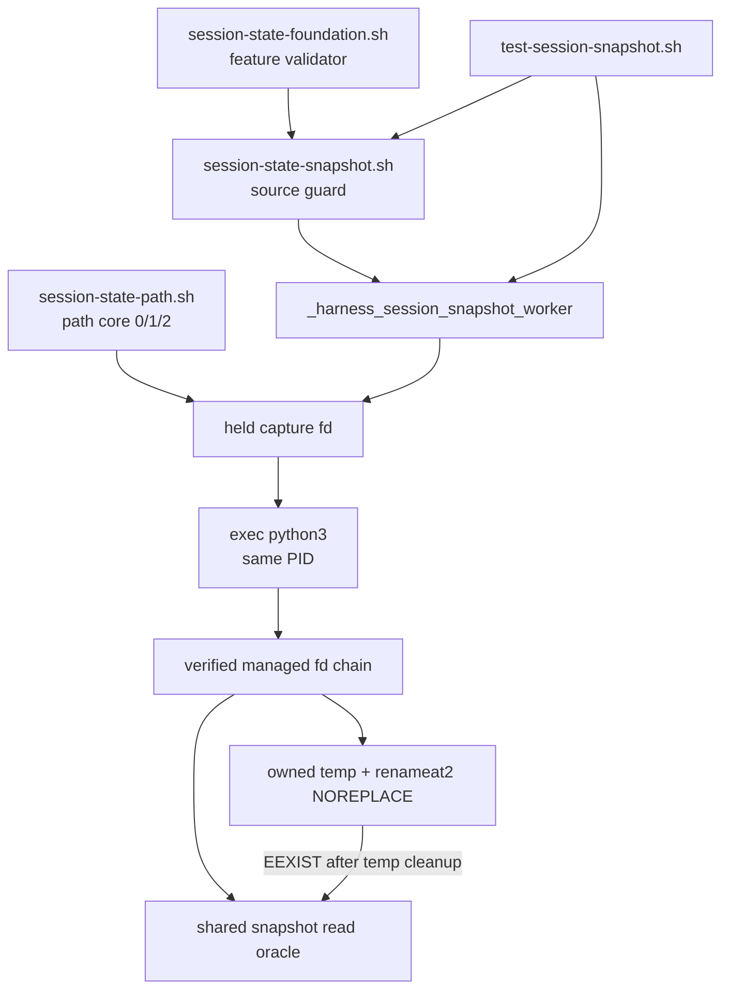
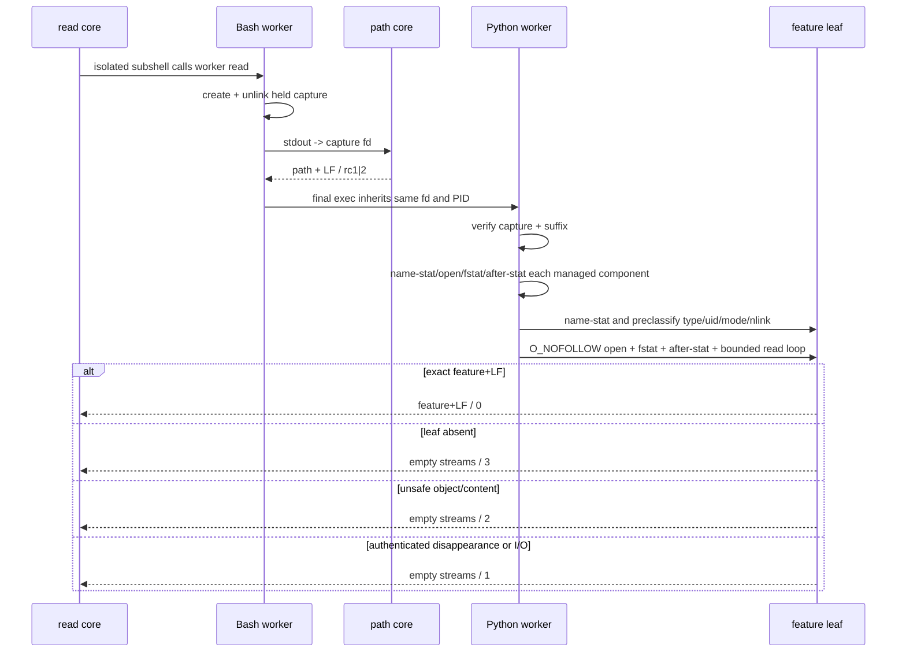

# 任务 2.3: 验证真实depth-1 checkout

> 这是你的需求。数值、签名、命令一律照抄，不要自己发挥。
> 你只做这一个任务，不要顺手做别的。不要派 subagent。

---

## 完整上下文

下面是整个 spec 的三个文件，让你了解整体需求、设计和任务分解。
**但你只执行「你的任务」那一节，不要去做别的任务。**

### Requirements

> 用户原话：“$spec review 这套 aosp harness 工程，有哪些欠缺的地方，进行重构和完善”；并确认后续按 autopilot 执行。PLAN v5.7要求03b在03a2 dependency-present竞态门通过后交付signal-aware create-once snapshot worker，03b1再穷举其动态安全分支。

## 目标

只新增snapshot私有模块与基础默认测试：在已harden的session path下以held capture fd和重新验证的managed fd链首次发布固定`feature`快照，同值幂等、异值冲突且绝不覆盖winner，读取只接受安全唯一规则文件；spawn-only `_harness_session_snapshot_worker write|read ...`自己处理HUP/INT/TERM并清本调用未发布temp。feature规则以`harness_validate_feature_name`为真值；发布只使用Linux `renameat2`的`RENAME_NOREPLACE`，`ENOSYS`是不降级的OS错分支。生产文本供03b1 provider-copy反证的anchors是`HARNESS_TEST_MARKER_CAPTURE_READY`、`HARNESS_TEST_MARKER_SNAPSHOT_MANAGED_BEFORE_OPEN`、`HARNESS_TEST_MARKER_MANAGED_EXPECTED_EUID`、`HARNESS_TEST_MARKER_SNAPSHOT_EXPECTED_EUID`、`HARNESS_TEST_MARKER_SNAPSHOT_BEFORE_OPEN`、`HARNESS_TEST_MARKER_TEMP_BEFORE_PUBLISH`、`HARNESS_TEST_MARKER_PUBLISH_RESULT`与`HARNESS_TEST_MARKER_OS_ERROR`；它们都不是capability marker。本片继续不设置`HARNESS_SESSION_STATE_PROVIDER_VERSION`、不发布public path/write/read/remove；03b1先穷举动态分支，03c再只包装信号转发facade。

## 需求

R1. [计划] 当`harness_validate_feature_name`与`_harness_session_path_core`均已定义时，系统必须使source `common/.harness/lib/session-state-snapshot.sh`返回0、双流空，只新增spawn-only `_harness_session_snapshot_worker write|read ...`、write core与read core三个私有export；source不得读写文件、覆写依赖、定义状态public API或设置`HARNESS_SESSION_STATE_PROVIDER_VERSION`。如果source时validate或path core任一缺席，系统必须静默返回0并保持三个snapshot export、四个状态public API与marker全缺席。

R2. [计划] 当调用两个snapshot core时，系统必须先检查exact arity，write还必须按已验收`harness_validate_feature_name`同等规则拒绝非安全单组件feature；再以umask077 exclusive创建0600 capture、持有fd后立即unlink名字，让`_harness_session_path_core <project-id> <session-id>`只向该fd写入，并由最终exec替换成的Python进程继承同一fd，经fstat/lseek/有界读取解析exact path+LF；不得按pathname reopen，重建原名不得改变消费bytes。这个已unlink的capture输入文件不属于R4的同session `.snapshot-*` publish owned-temp。认证后的path core输出是physical parent/root的语义真值；解析器只要求root非空且末两段逐字为project/session，再从physical parent fd对root/project/session逐层执行nofollow name-stat预检→open/fstat/after-stat、当前EUID、mode精确0700与身份一致检查，最后只通过session fd操作固定leaf `feature`。managed link/type/owner/mode/identity错返回2，真实I/O或已认证对象消失返回1；path原始1/2分别透传。所有write结果及read失败结果双流空。

R3. [计划] 当读取既有`feature`快照时，系统必须以R2调用会安全创建缺失managed目录的path core取得session fd；non-creating承诺只覆盖snapshot leaf。name stat后必须先按当前EUID、regular type、0600、nlink1归类，错误立即返回2而不尝试open；再经过snapshot marker以`O_NOFOLLOW|O_CLOEXEC`相对open、fstat和after-stat验证同一对象及属性保持。内容必须循环读取以容忍合法short read，累计130 bytes立即拒绝，否则直到EOF并只接受精确字节语法`^[A-Za-z0-9][A-Za-z0-9._-]{0,127}\n$`。成功唯一stdout逐字节为feature+唯一LF/0；leaf缺席3且不建leaf/temp；已安全stat对象消失1；链接/类型/owner/mode/nlink/身份或内容损坏2。固定损坏表含空文件、129-byte feature+LF、非ASCII、无LF、多LF、合法LF后额外字节，以及`.bad\n`、`a b\n`、`a/b\n`三种非法ASCII；所有失败双流空且不修改victim。

R4. [计划] 当write看到leaf物理缺席时，系统必须用不可猜测同目录名、`O_CREAT|O_EXCL|O_NOFOLLOW|O_CLOEXEC`、0600创建并fstat证明owned temp，循环写入feature+LF并close后经过temp/publish marker，只用Linux `renameat2(..., RENAME_NOREPLACE)`发布；不得使用替换rename、link publish或先移除winner。缺symbol、`ENOSYS`及其他非EEXIST errno均双流空/1且无fallback；成功双流空/0。spawn-only worker必须是普通函数链并在最终步骤直接exec Python，使03c background调用取得的PID就是Python worker；write/read core只在各自隔离subshell调用worker。Python write worker必须在创建任何同session `.snapshot-*` publish owned-temp前安装HUP/INT/TERM handler；首个handler入口必须先原子锁存first_signal，后续重入handler只返回，再把三者全设为ignore并抛私有中断。任何可中断close前必须先转移并清空fd ownership；cleanup必须记录close错误或私有中断、继续尝试全部后续fd close，并以嵌套finally保证仍尝试unlink；全部cleanup结束后已锁存的129/130/143优先于任何cleanup错误。rename未提交时信号清temp且无winner；rename已经提交但Python尚未更新ownership时winner必须继续存在、旧temp名清理只可得到ENOENT并返回首信号码；EEXIST期间先清temp且绝不修改winner。publish之后不得移除winner。read worker不创建owned-temp，只承诺普通`0|1|2|3`协议，不承诺信号码或first-signal latch。

R5. [计划] 如果发生publish marker后的`RENAME_NOREPLACE`返回EEXIST，系统必须先清owned temp，并由03b1在进入winner的首次name-stat之前证明session中已无该owned temp，再用R3同一完整oracle读winner：同值0、异值3、unsafe2、消失1且全部双流空；不得让最外层Missing把消失误映射成3。系统必须使并行同值writers全0、并行异值恰一0而其余3，最终唯一安全winner属于请求集，loser/幂等不改winner dev/inode/uid/mode/nlink/size/hash；生产publish marker可供03b1只改provider copy便确定性进入缺symbol、ENOSYS与EEXIST四分支，基础测试至少证明真实并发结果、完整winner指纹不变和无temp残留。

R6. [计划] 如果发生managed/snapshot链接、hard link、directory、wrong-owner、wrong-mode、九类内容或stat→open替换，系统必须使read/write fail closed且不修改攻击对象/victim/winner。基础测试必须覆盖三managed层的static link/file/wrong-mode/disappear、managed后缀不匹配、snapshot static对象/内容表和七anchor加OS anchor各精确一次；03b1才用provider-copy穷举capture同名重建、managed/snapshot link/different-inode/disappear、无特权expected-EUID、short-read、真实EIO、publish与temp信号。生产模块不得读取测试环境变量；任一anchor只能是无副作用文本点，完整动态证据不是03b自身验收或03c启动的替代品。

R7. [计划] 系统必须提供默认发现且shfmt-clean的`tests/test-session-snapshot.sh`，只接受无参数、`all`或唯一`--dependency-absent`；dependency-present默认/all覆盖source零副作用、三export/arity/双流、held capture结构、path rc、first/read/same/different、managed/snapshot static表、同/异值并发、常规temp cleanup、worker直接background后越过TEMP barrier时`ps`所见PID已为Python且信号命中同PID、以及八anchor occurrence。真实validate/path provider缺席或fixture缺任一export时，默认与flag运行同一inert surface并零active case；成功唯一摘要为`RESULT PASS  session snapshot safety\n`，unknown/extra/flag带值rc1且无PASS。

R8. [计划] 当03b进入验收时，系统必须在candidate、完整历史checkout和真实`git clone --depth 1 file://...`中分别运行默认snapshot测试与`bash ./scripts/check.sh --offline`，自动发现snapshot入口恰好一次，且每个checkout的当前tracked foundation/path/03a1-driver/03a2-entrypoint SHA-256在测试前后不变。controller必须先逐字验证shfmt `v3.14.0`与ShellCheck version field `0.11.0`，再只对本片exact两文件运行`shfmt -d -i 2 -ci -bn`、`shellcheck -x --severity=warning`与`bash -n`；execution BASE到accepted HEAD必须exact只新增`common/.harness/lib/session-state-snapshot.sh`与`tests/test-session-snapshot.sh`、numstat总和`<=400`，六列review manifest必须与tasks一一对应、首尾/相邻连续、reviewer非空且全PASS，`git diff --check`与worktree clean必须通过。

R9. [计划] 当验证独立回滚与顺序时，系统必须从accepted HEAD建立隔离临时分支，提交一个exact只删除snapshot module/test的rollback commit，在该clean checkout运行03a path、03a1 self-test、03a2默认入口和offline并要求全绿、snapshot发现0次；验收后丢弃临时checkout，不改变candidate/full/depth checkout。controller只有在03b accepted HEAD、基础active证据、八anchor、signal-aware协议、exact2/400和全PASS manifest入ledger后，才可创建规范ID `2026-09-02-03b1-session-snapshot-assurance`的spec目录、同名`spec/`分支/worktree、ledger execution BASE或dispatch记录；规范ID `2026-09-02-03c-session-write-interrupts`的相同四类资产仍必须物理缺席，且只有未来03b1 dependency-present完整矩阵入ledger后才能创建。顺序门必须以`test ! -e`核spec目录、`git show-ref --verify --quiet refs/heads/spec/<id>`的反值核分支、`git worktree list --porcelain`核worktree路径/branch、`rg`核ledger/dispatch/BASE记录；任一inert PASS不得解除任何顺序门。

## 验收标准

主验证命令: bash ./tests/test-session-snapshot.sh
期望输出: 退出码为`0`、stderr空，stdout逐字节精确为`RESULT PASS  session snapshot safety\n`

验收清单:

- [ ] exact两文件只发布spawn-only worker与两个snapshot core及固定摘要基础测试；source功能/validate缺席/path缺席fixture逐字比较rc/双流、依赖函数体、三个snapshot export、四public API、provider marker、环境export属性和inventory，证明零副作用或inert。
- [ ] write/read arity、非法feature与path core的`0|1|2`表逐字验证；capture fd创建后名字已缺席、Python继承同一0600/nlink0 fd且生产文本无pathname reopen；read在缺失managed目录时只可由path core创建安全目录，leaf缺席3且不创建leaf/temp。
- [ ] root/project/session各自的static symlink/file/wrong-mode均返回2且不触及目标；认证path后managed对象真实消失返回1，后缀不匹配返回2；完整stat-open mutation留给03b1而非移除anchor。
- [ ] fresh write后read以文件hex/cmp逐字证明唯一LF成功；同值重写返回0、异值重写返回3且每次winner dev/inode/uid/mode/nlink/size/hash不变；快照为当前EUID、0600、nlink1的nofollow普通文件并精确feature+LF。
- [ ] 并行同值writers全rc0，并行异值writers结果恰好一个0与其余3；第二波并发幂等/loser前后完整winner指纹不变，最终唯一winner内容属于请求集且无未发布temp。
- [ ] snapshot symlink/hardlink/directory/wrong-mode与固定九类损坏内容的read/write均fail closed；victim/winner不变、不安全层不产生temp；wrong-owner、short-read与动态swap由各自exact-once anchor留给03b1无特权反证。
- [ ] capture/managed-EUID/managed-before-open/snapshot-EUID/snapshot-before-open/temp/publish及OS八个anchor在生产文本各精确一次且不读测试环境；write worker在任何`.snapshot-*` owned-temp前安装三个handler并先锁存first signal，close前转移ownership，cleanup错误不遮蔽信号码且不阻断后续unlink/close；provider-copy覆盖post-close、ignore安装期第二信号、signal+cleanup-close-error的五次close尝试、rename未提交与已提交窗口，已提交winner不回滚；read无信号协议。
- [ ] 真实dependency-present默认/all与隔离provider-absent默认/flag均得唯一固定摘要，但只有dependency-present基础active evidence计入03b验收；unknown/extra/flag带值rc1/no-PASS；03b1完整矩阵尚未存在不能冒充PASS。
- [ ] candidate/full/depth-1的snapshot默认与offline全PASS，offline发现恰好一次，depth-1 commit-count=1且shallow marker非空；每个checkout的当前tracked上游SHA测试前后不变且clean。
- [ ] 隔离rollback commit exact只移除snapshot module/test后，clean checkout中path、driver self-test、race entrypoint与offline全PASS且snapshot发现0次；03b1/03c的spec/ref/worktree/BASE/dispatch按R9机械查缺席。
- [ ] review manifest六列、任务序号、execution BASE、相邻base/head、accepted HEAD和全PASS一次机械验证通过；BASE..HEAD exact name-only为上述两文件、numstat总和`<=400`，固定版本断言后对exact两文件运行shfmt/ShellCheck/bash-n全绿，`git diff --check`和clean通过；只有ledger accepted后才可创建03b1，03c继续缺席。
- [ ] 终交付锚点`session-snapshot-core-v2`仅由上述exact两文件与固定基础摘要组成，不包含03b1 provider-copy assurance入口。

不变量（不许劣化，2-4项）:

- 已发布安全winner被同值、异值或并发loser改变的次数 ≤ `0`，验证: 每次调用前后比较winner dev/inode/hash/mode/nlink。
- 不安全snapshot/victim被read/write跟随或修改的次数 ≤ `0`，验证: 攻击表的victim与namespace inventory delta。
- 常规或worker信号返回后本调用未发布owned temp残留数 ≤ `0`，验证: session directory每case前后完整inventory；Bash facade信号转发属于03c。
- foundation/path/driver/race-entrypoint的execution BASE..HEAD变更文件数 ≤ `0`，验证: `git diff --name-only "$BASE" "$HEAD" -- common/.harness/lib/session-state-foundation.sh common/.harness/lib/session-state-path.sh tests/lib/session-path-race-driver.py tests/test-session-path-races.sh`。

## 超出范围

- 不修改03/03a/03a1/03a2模块或测试，不设置provider marker，不发布public path/write/read/remove；03d aggregator才原子发布完整capability。
- 不实现Bash facade、spawn-gap/process-group转发或facade first-signal-wins；它们属于03c。Python child的首信号latch、owned-temp cleanup和`TEMP_BEFORE_PUBLISH`属于本片。
- 不在本片穷举provider-copy动态mutation、publish注入与signal barrier；只交付anchor和基础证明，03b1独占完整assurance入口。
- 不实现snapshot remove、目录prune、`PRUNE_BEFORE_IDENTITY`、final aggregator或coverage fragment；它们属于03d。
- 不调用设备、网络、AOSP build、Claude/Codex客户端，不push、不清理已有spec/prototype/implementation分支或worktree。

### Design

# 2026-09-02-03b-session-snapshot-safety 设计

## 概述

在既有 foundation/path 私有层之上增加一个 spawn-only Bash→Python snapshot worker：Bash 用已unlink的held fd认证path core输出，Python重新打开并验证managed目录链，以`renameat2(RENAME_NOREPLACE)`首次发布固定leaf `feature`，并为write child提供首信号锁存和owned-temp清理。

- 选择“Bash负责source/arity/capture，单个最终exec Python负责fd链、snapshot和cleanup”，因为03c必须能background同一worker并拿到真实Python PID；放弃外层Bash等待Python和由03c复制publish算法，两者分别会造成PID错位和双实现漂移。
- 选择“读取与EEXIST winner共用一个verified-open oracle、发布只用`RENAME_NOREPLACE`”，因为所有路径必须共享type/owner/mode/nlink/identity/content判据且绝不覆盖winner；放弃普通rename、link/unlink组合与ENOSYS降级，它们无法同时保持create-once和可证伪边界。
- 选择“03b只交付静态/真实竞态基础测试和八个无副作用anchor，完整provider-copy动态矩阵留给03b1”，因为补齐信号线性化后的runnable sizing为exact2 400/400；放弃把assurance塞进本片，也不弱化03b1对03c的顺序门。

## 需求映射

| 组件 | 实现的需求 |
|---|---|
| source guard与三个私有函数surface | R1, R7 |
| held capture与spawn-only worker | R2, R4, R7 |
| Python managed-fd链与snapshot read oracle | R2, R3, R5, R6 |
| create-once publish与write signal cleanup | R4, R5, R6 |
| 默认基础测试与结构anchors | R1, R2, R3, R4, R5, R6, R7 |
| controller验收、回滚与顺序门 | R8, R9 |

## 架构



运行时只新增一个可source的私有模块，不设置capability marker，也不发布public API。source层依赖Bash现有函数；active worker要求Linux、Bash 4.4+、Python 3.8+和支持`dir_fd`/`O_NOFOLLOW`的POSIX文件接口，publish还要求libc导出Linux `renameat2`。缺symbol或内核`ENOSYS`是明确OS错误，不做跨平台降级。所有测试anchor只是生产文本中的exact-once无副作用点，生产模块不读取测试环境变量；03b1只能复制provider后替换anchor。

## 组件与接口

### 既有直接依赖

- 职责：验证feature组件并产生经03a/03a2验收的physical session path。
- 消费接口：`session-foundation-v1的harness_validate_feature_name <name>；session-path-delivery-v1的_harness_session_path_core <project-id> <session-id>成功path+LF/0或OS错1或安全协议错2；session-path-race-matrix-v1的03a2 accepted ledger中dependency-present 37/37与九类全PASS门（无运行时API）`
- 依赖：`common/.harness/lib/session-state-foundation.sh`、`common/.harness/lib/session-state-path.sh`及03a2 ledger证据；本片不修改它们。

### Snapshot source guard与core wrappers

- 职责：source时做双依赖fail-inert；active时只留下worker/write/read三个私有函数，core wrapper在隔离subshell中调用worker。
- 产出接口：`session-snapshot-core-v2 —— spawn-only _harness_session_snapshot_worker write|read ...、signal-aware _harness_session_snapshot_write_core <project-id> <session-id> <feature>与_harness_session_snapshot_read_core <project-id> <session-id>的私有协议 plus tests/test-session-snapshot.sh基础摘要及03b1 anchors；无public API/provider marker`
- 精确调用：`_harness_session_snapshot_worker write <project-id> <session-id> <feature>`、`_harness_session_snapshot_worker read <project-id> <session-id>`、`_harness_session_snapshot_write_core <project-id> <session-id> <feature>`、`_harness_session_snapshot_read_core <project-id> <session-id>`。
- 依赖：上述直接依赖；worker在capture前拒绝错误arity/op及非法write feature，write/read core不承担额外状态。

### Held capture与Python dispatch

- 职责：以umask077 exclusive创建capture、持有读写fd后unlink名字，把path core stdout定向到该fd，再以最后一步`exec python3`继承同一fd；Python只经fstat/lseek/read消费capture。
- 内部接口：`dispatch(op, path_fd, project, session, feature) -> 0|1|2|3`；write另可由首信号产生`129|130|143`。
- 依赖：path core `0|1|2`协议；capture必须regular/current-EUID/0600/nlink0，输入最多4096 bytes且exact一个结尾LF。

### Managed/snapshot oracle与publisher

- 职责：从physical parent开始逐层name-stat→open/fstat→after-stat验证root/project/session；对leaf提供唯一read oracle与create-once publisher。
- 内部接口：`read_snapshot(session_fd) -> feature`或`Missing/Unsafe/Failed`；`publish(session_fd, feature) -> 0|3`或异常；异常统一在Python顶层映射退出码。
- 依赖：当前EUID、managed 0700、snapshot 0600/nlink1、Linux `renameat2(..., RENAME_NOREPLACE)`；不按已认证对象pathname reopen，不follow link，不移除winner。
- 资源规则：任何可中断close前先把owned fd转移到局部变量并清空ownership；统一`close_all`收集OSError/私有中断并继续尝试全部后续fd，temp cleanup用嵌套finally保证close失败后仍尝试unlink；全部cleanup后若`first_signal`已锁存则它优先于cleanup错误。rename syscall是ownership线性化点：未提交仍拥有temp，已提交即只拥有winner，旧temp名ENOENT绝不能触发winner回滚。

### 默认基础测试

- 职责：实现`bash ./tests/test-session-snapshot.sh`的active/inert/CLI/双流/攻击/并发/signal/anchor oracle，并保持唯一成功摘要。
- 对外接口：无参数或`all`运行自动active/inert分流，唯一`--dependency-absent`强制inert；成功逐字输出`RESULT PASS  session snapshot safety\n`。
- 依赖：生产模块、既有foundation/path、固定shfmt 3.14.0、ShellCheck 0.11.0及系统`bash/python3/git/rg/find/stat/sha256sum`。

## 数据模型

不新增schema或跨进程数据库。持久状态只有既有session目录下的固定leaf：

| 对象 | 名称/生命周期 | 安全属性 | 内容 |
|---|---|---|---|
| capture输入 | `${TMPDIR:-/tmp}/snapshot-path.*`，open后立即unlink，exec继承fd，进程退出关闭 | current-EUID、0600、nlink0、regular | exact physical session path + LF，最大4096 bytes |
| managed目录 | physical parent下root/project/session，生命周期由path core创建 | current-EUID、0700、directory、每步身份稳定 | 只作为fd锚点 |
| publish temp | session内`.snapshot-`+32 hex，只归本次write所有，发布或失败后名字消失 | current-EUID、0600、nlink1、regular | validated feature + LF |
| winner snapshot | session内固定`feature`，首次NO_REPLACE发布后不可覆盖 | current-EUID、0600、nlink1、regular、verified identity | `^[A-Za-z0-9][A-Za-z0-9._-]{0,127}\n$` |

状态转换固定为`leaf missing → owned temp → winner`；rename成功的syscall线性化点即把ownership从temp转为winner，即使信号先于Python清空temp变量到达，finally也只能对已不存在的旧名容忍ENOENT、不得unlink winner。EEXIST先`owned temp → absent`，再读独立winner并映射same/different/unsafe/disappear。任何错误都不能产生“替换既有winner”转换。`first_signal`初始为空，首个handler在任何其他可重入操作前一次性写入；后续handler看到非空只返回，cleanup完成后始终以该值映射退出码。

## 数据流

### 首次write与EEXIST

```mermaid
sequenceDiagram
  participant B as Bash worker
  participant P as path core
  participant Y as Python same PID
  participant D as session dirfd
  B->>B: validate arity/feature; create+unlink capture
  B->>P: stdout -> held capture fd
  P-->>B: physical path + LF / rc1|2
  B->>Y: exec(op, fd, project, session, feature)
  Y->>Y: install write signal handlers
  Y->>D: reopen verified managed fd chain
  Y->>D: verified read feature
  alt leaf missing
    Y->>D: create/write/close owned .snapshot-*
    Y->>D: renameat2 NOREPLACE
    alt publish success
      D-->>Y: rc0; temp becomes winner
    else EEXIST
      Y->>D: unlink owned temp
      Y->>D: full verified winner read
      D-->>Y: same rc0 / different rc3 / unsafe rc2 / disappear rc1
    end
  else safe winner exists
    D-->>Y: same rc0 / different rc3
  end
```

### verified read与失败分类



### write signal cleanup

```mermaid
sequenceDiagram
  participant F as future 03c facade
  participant W as Python write worker
  participant D as session dirfd
  F->>W: background spawn-only worker; PID remains stable after exec
  W->>W: install HUP/INT/TERM handlers before .snapshot-* creation
  W->>D: create and own temp
  W->>W: transfer fd ownership before interruptible close
  alt signal before rename commit
    F->>W: first signal
    W->>W: latch first_signal before any reentrant action
    F->>W: second signal during ignore installation returns only
    W->>W: ignore all three and raise private interrupt
    W->>D: finally attempts close/unlink despite cleanup errors
    W-->>F: no winner; 128 + first_signal
  else signal after rename syscall committed
    W->>D: renameat2 success makes temp name the winner
    F->>W: signal before Python clears old temp ownership
    W->>D: finally sees old temp name ENOENT; never removes winner
    W-->>F: winner preserved; 128 + first_signal
  end
```

## 错误处理

| 错误场景 | 恢复策略 | 校验位置 | 日志 | 用户可见 |
|---|---|---|---|---|
| source依赖缺席 | 静默inert，不定义snapshot/public surface | Bash source guard | 无 | source 0、双流空 |
| worker op/arity或write feature非法 | capture前拒绝且零state副作用 | Bash worker guard/validator | 无 | 双流空、2 |
| path core失败 | 原样透传1或2，不启动Python | held capture调用点 | 无 | 双流空、1或2 |
| capture格式/属性/后缀错 | fail closed | `path_from_fd`/`open_session` | 无 | 双流空、2；真实fd I/O为1 |
| managed link/type/owner/mode/identity错 | 不继续到leaf、不清攻击对象 | `open_dir`三阶段验证 | 无 | 双流空、2 |
| authenticated managed对象消失或真实I/O | 关闭已持有fds | `open_dir`异常映射与dispatch finally | 无 | 双流空、1 |
| leaf缺席read | 不创建leaf/temp | `read_snapshot`初次name-stat | 无 | 双流空、3 |
| snapshot属性/身份/内容错 | 不follow、不修改winner/victim | shared read oracle | 无 | 双流空、2 |
| safe snapshot在stat后消失/真实read I/O | 关闭fd，不改namespace | shared read oracle | 无 | 双流空、1 |
| renameat2缺symbol、ENOSYS或其他非EEXIST | 无fallback，finally清owned temp | `publish_errno`/`publish` | 无 | 双流空、1 |
| renameat2 EEXIST | 先清owned temp，再完整读取winner | `publish` EEXIST分支 | 无 | same 0 / different 3 / unsafe 2 / disappear 1 |
| write收到HUP/INT/TERM | handler先一次性锁存首信号，后续重入只返回；close前转移ownership，`close_all`继续全部fd且嵌套finally仍unlink，最终锁存信号优先于cleanup错 | Python handler、owned-fd close、dispatch close与publish finally | 无 | 双流空、129/130/143 |
| 信号跨越rename线性化点 | syscall未成功则清temp/无winner；已成功则旧temp名ENOENT且winner保留 | provider-copy pre/post-success oracle | 无 | 两者均返回锁存信号码，namespace按commit状态决定 |
| read收到信号 | 不建立本片信号返回契约，遵循进程默认行为 | 超出read协议 | 无 | 不纳入`0|1|2|3`保证 |

## 测试策略

| 层 | 测什么 | 用什么工具 |
|---|---|---|
| 单元/结构 | 四态source零副作用与exact function/export inventory；worker arity、feature、capture 0600/nlink0/pathname absent/fd消费；八anchor exact-once、无fallback | `bash`隔离shell、`declare`、`export -p`、`rg`、`stat`、`od` |
| 集成 | first/read/same/different；managed三层static/disappear与suffix；snapshot对象和九类内容；同/异值两波并发完整winner/tree delta；TEMP barrier后的真实Python PID和首TERM锁存 | `bash ./tests/test-session-snapshot.sh`、临时目录、`find/stat/sha256sum/ps/kill` |
| assurance sizing | held capture重建、managed/snapshot mutation、wrong-owner、short-read、EIO、symbol/ENOSYS、EEXIST全分支、HUP/INT/TERM，以及post-close、ignore安装期第二信号、signal+cleanup-close-error的五次close、rename post-success窗口；只证明03b1可实施，不替代未来门禁 | prototype `snapshot-assurance-r1.sh`、provider copy、固定shfmt/ShellCheck；308/400、240项 |
| 端到端/兼容 | candidate、完整历史checkout、真实depth-1 clone分别跑snapshot默认与offline；tracked上游hash不变；clean rollback commit删除exact两文件后03a/03a1/03a2/offline仍绿 | `bash ./scripts/check.sh --offline`、`git clone --depth 1 file://...`、`git diff/status/hash-object` |
| 静态与收敛 | exact2、numstat≤400、固定工具版本、shfmt/ShellCheck/bash-n/diff-check、六列manifest连续且全PASS、03b1/03c资产顺序查缺 | shfmt 3.14.0、ShellCheck 0.11.0、`bash -n`、Git/awk/rg controller命令 |
| 性能 | 不适用：本片不设吞吐/延迟SLO；bounded read、有限fd链和六writer竞态用于资源/终止性验收，不冒充benchmark | `timeout`只作为测试防挂死 |

测试必须将stdout/stderr落文件后按字节比较，禁止用会吞尾随LF的command substitution验证成功流。默认真实provider缺席与`--dependency-absent`都只跑inert surface；只有dependency-present active证据可解除03b验收门。03b1和03c的spec/ref/worktree/BASE/dispatch在R9条件前必须全部缺席。

## 文件清单

| 文件 | 创建/修改 | 职责（一句话） |
|---|---|---|
| `common/.harness/lib/session-state-snapshot.sh` | 创建 | source-inert的spawn-only snapshot worker、held capture、verified read、create-once publish与write child cleanup |
| `tests/test-session-snapshot.sh` | 创建 | 默认发现的active/inert基础安全、竞态、信号、结构及固定摘要验收 |

验收资产（不纳入源码文件清单）：本spec的requirements/design/tasks/ledger与review报告；prototype runtime/base code `a708ce6f0979c6644292b58b4a7b0d4afcdf821d`、assurance `cbdbdde0e1e3ff4ceb2dc0279b1db83127a0ea9e`、evidence `9f0dfbc5bca35df8fe9ea9ba249050a8aa4547fd`；执行期task briefs、red/green报告、六列review manifest、candidate/full/depth-1/rollback日志和accepted HEAD证据。实现门③通过前不创建implementation worktree或固定execution BASE，03b accepted ledger前不创建03b1，03b1完整active ledger前不创建03c。

### 所有任务

# 2026-09-02-03b-session-snapshot-safety 实现计划

三轮tasks review证明逐函数拼装中间Python会制造未定义import、截断builder与假红。熔断裁定改为两个固定blob机械落地任务，再把candidate/full/depth-1/rollback/order/terminal拆成六个小型controller任务；共八个任务严格串行。实现提交使用普通Conventional Commit。每个任务均保存red记录、green报告和evidence package，交全新独立agent review；Blocking/Important修复后必须由另一全新agent re-review。

固定变量与blob门：

```bash
PROJECT=.spec/2026-08-31-aosp-harness-refactor
SPEC=$PROJECT/specs/2026-09-02-03b-session-snapshot-safety
WORK=$PROJECT/work/2026-09-02-03b-session-snapshot-safety
TASKS=$SPEC/tasks.md
LEDGER=$SPEC/ledger.md
MANIFEST=$WORK/review-manifest.tsv
PROTO_SHA=a708ce6f0979c6644292b58b4a7b0d4afcdf821d
PROTO_ROOT=$PROJECT/work/2026-09-02-03b-session-snapshot-safety/prototype
PROTO_CORE=$PROTO_ROOT/snapshot-core-r2.sh
PROTO_TEST=$PROTO_ROOT/snapshot-test-prototype.sh
test "$(git show "$PROTO_SHA:$PROTO_CORE" | wc -l)" -eq 208
test "$(git show "$PROTO_SHA:$PROTO_TEST" | wc -l)" -eq 192
```

red记录固定六行：`task=`、`command=`、`expected=`、`rc=`、`stdout_sha256=`、`stderr_sha256=`，末加`assertion=`；green报告固定含task/base/head/files/commands/results。evidence package为TSV三列`path<TAB>sha256<TAB>bytes`，列出brief、report和全部日志；reviewer拿这三个路径，而不是依赖base=head的空diff。

manifest固定六列`seq<TAB>task-id<TAB>base<TAB>head<TAB>reviewer<TAB>PASS`。每个任务独立review PASS后先追加本行，再分别执行：

```bash
python3 /home/zzh0838/.agents/skills/spec/scripts/mark-task-done.py "$TASKS" TASK_ID
# controller用apply_patch向ledger增加：- 任务 TASK_ID: 完成 commits=[TASK_HEAD]
python3 /home/zzh0838/.agents/skills/spec/scripts/sync-ledger.py "$LEDGER" --repo "$IMPLEMENTATION_WORKTREE"
```

### 任务 1.1: 机械落地完整snapshot runtime

文件: 创建 `common/.harness/lib/session-state-snapshot.sh`
验收资产（不纳入源码文件清单）: 创建 `.spec/2026-08-31-aosp-harness-refactor/work/2026-09-02-03b-session-snapshot-safety/evidence/task-1.1-red.txt` / 创建 `.spec/2026-08-31-aosp-harness-refactor/work/2026-09-02-03b-session-snapshot-safety/task-1.1-report.md` / 创建 `.spec/2026-08-31-aosp-harness-refactor/work/2026-09-02-03b-session-snapshot-safety/review-manifest.tsv`
消费: 无
产出: session-snapshot-runtime-v2
需求: R1, R2, R3, R4, R5, R6, R7
必需: 是
状态: 完成

外部接口：`harness_validate_feature_name <name>`合法0/双流空、非法或arity错2/stdout空/stderr逐字`error: invalid feature name\n`，worker抑制其双流并映射2；`_harness_session_path_core <project-id> <session-id>`成功path+LF/0、OS错双流空/1、安全错双流空/2；03a2 accepted ledger的37/37与九类PASS门。

- [ ] 步骤 1: 运行`test ! -e common/.harness/lib/session-state-snapshot.sh`后尝试source目标，确认红阶段失败为文件缺席；按固定schema写`$WORK/evidence/task-1.1-red.txt`并核`test -s`。
- [ ] 步骤 2: 用apply_patch创建目标文件，内容与`git show "$PROTO_SHA:$PROTO_CORE"`逐字相同；将blob落临时文件后运行`cmp -s "$tmp_core" common/.harness/lib/session-state-snapshot.sh`和`wc -l`=208。
- [ ] 步骤 3: 将prototype test blob落到implementation根下临时文件，只设置绝对`SNAPSHOT_CORE`为目标runtime并运行；要求rc0、stdout逐字`RESULT PASS  session snapshot safety\n`、stderr0B，结束后删除临时文件。
- [ ] 步骤 4: 运行固定shfmt/ShellCheck、bash-n、`git diff --check`、八anchor exact1、无fallback、source四态与assurance sizing hash只读核对；按固定schema写task报告。
- [ ] 步骤 5: 对untracked runtime运行`git add -N`核working-tree name-only exact1/numstat208，再提交`feat(session): add snapshot runtime`；设置`TASK_HEAD=$(git rev-parse HEAD)`并核`TASK_BASE..TASK_HEAD`exact1、clean、上游四文件SHA不变。
- [ ] 步骤 6: 生成task brief/report、`review-package.sh TASK_BASE TASK_HEAD`及evidence package，取得独立diff review PASS；有fix则更新`TASK_HEAD`、重跑步骤3–5并交全新reviewer。
- [ ] 步骤 7: 运行`printf '1\ttask-1.1\t%s\t%s\t%s\tPASS\n' "$TASK_BASE" "$TASK_HEAD" "$REVIEWER" >>"$MANIFEST"`；随后分别mark 1.1、apply_patch写ledger锚点、sync-ledger。

### 任务 1.2: 机械落地默认基础测试

文件: 创建 `tests/test-session-snapshot.sh`
验收资产（不纳入源码文件清单）: 创建 `.spec/2026-08-31-aosp-harness-refactor/work/2026-09-02-03b-session-snapshot-safety/evidence/task-1.2-red.txt` / 创建 `.spec/2026-08-31-aosp-harness-refactor/work/2026-09-02-03b-session-snapshot-safety/task-1.2-report.md` / 修改 `.spec/2026-08-31-aosp-harness-refactor/work/2026-09-02-03b-session-snapshot-safety/review-manifest.tsv`
消费: session-snapshot-runtime-v2
产出: snapshot-default-matrix-v1
需求: R1, R2, R3, R4, R5, R6, R7
必需: 是
状态: 完成

- [ ] 步骤 1: 运行`test ! -e tests/test-session-snapshot.sh && bash tests/test-session-snapshot.sh`，确认红阶段失败rc127/no-PASS；按固定schema写red文件并核非空，runtime的prototype test前置仍PASS。
- [ ] 步骤 2: 用apply_patch创建目标test；内容只对prototype blob做唯一转换：`core=${SNAPSHOT_CORE:-$here/snapshot-core-prototype.sh}`替换为`core=${SNAPSHOT_CORE:-$repo/common/.harness/lib/session-state-snapshot.sh}`，其余逐字相同。以机械转换生成临时expected并`cmp -s`目标，核192行。
- [ ] 步骤 3: 运行argv全表、dependency-present default/all、隔离provider-absent default/flag、source四态、failure-stdout/source-rc self-disproof；每次分离保存rc/stdout/stderr，成功摘要逐字且失败rc1/no-PASS。
- [ ] 步骤 4: 运行同/异值并发、managed/snapshot攻击、真实Python PID与基础首信号表，核八anchor exact1、strict misuse零state、无fallback、winner/victim/temp delta；写green报告。
- [ ] 步骤 5: 对untracked test运行`git add -N`，执行固定工具、bash-n、default/all/offline、diff-check和working-tree exact2/numstat<=400；提交`test(session): add snapshot safety matrix`，设置并验证`TASK_HEAD`、clean和上游SHA不变。
- [ ] 步骤 6: 生成brief/report/diff/evidence package并取得独立review PASS；fix后更新head、全量重跑并交全新reviewer。
- [ ] 步骤 7: 运行`printf '2\ttask-1.2\t%s\t%s\t%s\tPASS\n' "$TASK_BASE" "$TASK_HEAD" "$REVIEWER" >>"$MANIFEST"`；随后分别mark 1.2、apply_patch写ledger锚点、sync-ledger。

### 任务 2.1: 审计candidate并固定accepted HEAD

文件: 测试 `common/.harness/lib/session-state-snapshot.sh` / 测试 `tests/test-session-snapshot.sh`
验收资产（不纳入源码文件清单）: 创建 `.spec/2026-08-31-aosp-harness-refactor/work/2026-09-02-03b-session-snapshot-safety/evidence/task-2.1-red.txt` / 创建 `.spec/2026-08-31-aosp-harness-refactor/work/2026-09-02-03b-session-snapshot-safety/task-2.1-report.md` / 修改 `.spec/2026-08-31-aosp-harness-refactor/work/2026-09-02-03b-session-snapshot-safety/review-manifest.tsv`
消费: snapshot-default-matrix-v1
产出: snapshot-accepted-head-v1
需求: R8
必需: 是
状态: 完成

- [ ] 步骤 1: 运行`test -s "$WORK/task-2.1-report.md"`确认红阶段失败为报告缺席，按固定schema写red文件；implementation必须clean且HEAD为任务1.2 head。
- [ ] 步骤 2: 保存四上游文件before SHA，核固定工具版本，只对exact两文件跑shfmt/ShellCheck/bash-n/default/all/offline，分别保存日志并核offline中的snapshot摘要恰一次，再`cmp` after SHA清单。
- [ ] 步骤 3: 核`BASE_SHA..HEAD`exact两文件、numstat<=400、diff-check、八anchor/surface、clean并生成green报告和evidence package；若发现源码缺陷则回流任务1.1或1.2修复/re-review，不在本任务改变HEAD。
- [ ] 步骤 4: 交独立reviewer审brief/report/evidence package并取得PASS，把当前40位clean HEAD固定为`ACCEPTED_HEAD`。
- [ ] 步骤 5: 运行`printf '3\ttask-2.1\t%s\t%s\t%s\tPASS\n' "$TASK_HEAD" "$TASK_HEAD" "$REVIEWER" >>"$MANIFEST"`；随后分别mark 2.1、apply_patch写ledger锚点、sync-ledger。

### 任务 2.2: 验证完整历史checkout

文件: 测试 `common/.harness/lib/session-state-snapshot.sh` / 测试 `tests/test-session-snapshot.sh`
验收资产（不纳入源码文件清单）: 创建 `.spec/2026-08-31-aosp-harness-refactor/work/2026-09-02-03b-session-snapshot-safety/evidence/task-2.2-red.txt` / 创建 `.spec/2026-08-31-aosp-harness-refactor/work/2026-09-02-03b-session-snapshot-safety/task-2.2-report.md` / 修改 `.spec/2026-08-31-aosp-harness-refactor/work/2026-09-02-03b-session-snapshot-safety/review-manifest.tsv`
消费: snapshot-accepted-head-v1
产出: snapshot-full-checkout-v1
需求: R8
必需: 是
状态: 完成

- [ ] 步骤 1: 运行`test -s "$WORK/task-2.2-report.md"`确认红阶段失败为报告缺席并写red文件；核implementation HEAD=`ACCEPTED_HEAD`。
- [ ] 步骤 2: 创建临时目录，运行`git clone --no-local "$IMPLEMENTATION_WORKTREE" "$tmp/full"`并核full HEAD逐字等于`ACCEPTED_HEAD`。
- [ ] 步骤 3: 在full中保存四上游SHA before，分别运行default与offline到独立日志；核default固定摘要一次、offline日志snapshot摘要恰一次且末行offline PASS，再比较after SHA、diff/status clean。
- [ ] 步骤 4: 写green报告/evidence package并删除full checkout；独立review PASS后运行`printf '4\ttask-2.2\t%s\t%s\t%s\tPASS\n' "$ACCEPTED_HEAD" "$ACCEPTED_HEAD" "$REVIEWER" >>"$MANIFEST"`。
- [ ] 步骤 5: 分别mark 2.2、apply_patch写ledger锚点、sync-ledger。

### 任务 2.3: 验证真实depth-1 checkout

文件: 测试 `common/.harness/lib/session-state-snapshot.sh` / 测试 `tests/test-session-snapshot.sh`
验收资产（不纳入源码文件清单）: 创建 `.spec/2026-08-31-aosp-harness-refactor/work/2026-09-02-03b-session-snapshot-safety/evidence/task-2.3-red.txt` / 创建 `.spec/2026-08-31-aosp-harness-refactor/work/2026-09-02-03b-session-snapshot-safety/task-2.3-report.md` / 修改 `.spec/2026-08-31-aosp-harness-refactor/work/2026-09-02-03b-session-snapshot-safety/review-manifest.tsv`
消费: snapshot-full-checkout-v1
产出: snapshot-depth1-checkout-v1
需求: R8
必需: 是

- [ ] 步骤 1: 运行`test -s "$WORK/task-2.3-report.md"`确认红阶段失败为报告缺席并写red文件。
- [ ] 步骤 2: 运行`git clone --depth 1 "file://$IMPLEMENTATION_WORKTREE" "$tmp/depth1"`，核HEAD=`ACCEPTED_HEAD`、`git rev-list --count HEAD`=1及`.git/shallow`非空。
- [ ] 步骤 3: 保存四上游SHA before，分别运行default/offline到独立日志，逐个核固定摘要与offline snapshot恰一次/末行PASS；比较after SHA、diff/status clean。
- [ ] 步骤 4: 写green报告/evidence package并删除depth checkout；独立review PASS后运行`printf '5\ttask-2.3\t%s\t%s\t%s\tPASS\n' "$ACCEPTED_HEAD" "$ACCEPTED_HEAD" "$REVIEWER" >>"$MANIFEST"`。
- [ ] 步骤 5: 分别mark 2.3、apply_patch写ledger锚点、sync-ledger。

### 任务 2.4: 验证exact rollback

文件: 测试 `common/.harness/lib/session-state-snapshot.sh` / 测试 `tests/test-session-snapshot.sh`
验收资产（不纳入源码文件清单）: 创建 `.spec/2026-08-31-aosp-harness-refactor/work/2026-09-02-03b-session-snapshot-safety/evidence/task-2.4-red.txt` / 创建 `.spec/2026-08-31-aosp-harness-refactor/work/2026-09-02-03b-session-snapshot-safety/task-2.4-report.md` / 修改 `.spec/2026-08-31-aosp-harness-refactor/work/2026-09-02-03b-session-snapshot-safety/review-manifest.tsv`
消费: snapshot-depth1-checkout-v1
产出: snapshot-rollback-v1
需求: R9
必需: 是

- [ ] 步骤 1: 运行`test -s "$WORK/task-2.4-report.md"`确认红阶段失败为报告缺席并写red文件。
- [ ] 步骤 2: 从implementation clone rollback并核HEAD=`ACCEPTED_HEAD`；运行`git rm common/.harness/lib/session-state-snapshot.sh tests/test-session-snapshot.sh`后提交普通rollback commit，核其name-status exact两个D。
- [ ] 步骤 3: 在rollback运行`bash tests/test-session-path.sh`、`python3 tests/lib/session-path-race-driver.py self-test common/.harness/lib/session-state-foundation.sh common/.harness/lib/session-state-path.sh`、`bash tests/test-session-path-races.sh`与offline；核全绿、offline中snapshot摘要0、两目标物理缺席且clean。
- [ ] 步骤 4: 写green报告/evidence package并删除rollback；独立review PASS后运行`printf '6\ttask-2.4\t%s\t%s\t%s\tPASS\n' "$ACCEPTED_HEAD" "$ACCEPTED_HEAD" "$REVIEWER" >>"$MANIFEST"`。
- [ ] 步骤 5: 分别mark 2.4、apply_patch写ledger锚点、sync-ledger。

### 任务 2.5: 验证03b1与03c顺序门

文件: 测试 `common/.harness/lib/session-state-snapshot.sh` / 测试 `tests/test-session-snapshot.sh`
验收资产（不纳入源码文件清单）: 创建 `.spec/2026-08-31-aosp-harness-refactor/work/2026-09-02-03b-session-snapshot-safety/evidence/task-2.5-red.txt` / 创建 `.spec/2026-08-31-aosp-harness-refactor/work/2026-09-02-03b-session-snapshot-safety/task-2.5-report.md` / 修改 `.spec/2026-08-31-aosp-harness-refactor/work/2026-09-02-03b-session-snapshot-safety/review-manifest.tsv`
消费: snapshot-rollback-v1
产出: snapshot-order-gate-v1
需求: R9
必需: 是

- [ ] 步骤 1: 运行`test -s "$WORK/task-2.5-report.md"`确认红阶段失败为报告缺席并写red文件。
- [ ] 步骤 2: 定义完整ID`NEXT1=2026-09-02-03b1-session-snapshot-assurance`、`NEXT2=2026-09-02-03c-session-write-interrupts`；对两者逐一`test ! -e "$PROJECT/specs/$id"`、`test ! -e "$PROJECT/work/$id"`，并要求`git show-ref --verify --quiet "refs/heads/spec/$id"`返回1。
- [ ] 步骤 3: 对两者逐一核`git worktree list --porcelain`不含`branch refs/heads/spec/$id`及约定worktree绝对路径；若未来work目录缺席则execution-base/manifest/task-brief自然缺席，若存在任何同名或symlink立即失败。
- [ ] 步骤 4: 仅对`$PROJECT/specs/*/ledger.md`与`$PROJECT/work/*/{dispatch.tsv,execution-base.env}`存在文件运行rg，禁止匹配`dispatch.*$id|execution BASE.*$id|spec/$id`；不得搜索PLAN/requirements中的合法规划文字。
- [ ] 步骤 5: 写green报告/evidence package并取得独立review PASS；运行`printf '7\ttask-2.5\t%s\t%s\t%s\tPASS\n' "$ACCEPTED_HEAD" "$ACCEPTED_HEAD" "$REVIEWER" >>"$MANIFEST"`。
- [ ] 步骤 6: 分别mark 2.5、apply_patch写ledger锚点、sync-ledger。

### 任务 2.6: 收敛manifest、ledger与终交付

文件: 测试 `common/.harness/lib/session-state-snapshot.sh` / 测试 `tests/test-session-snapshot.sh`
验收资产（不纳入源码文件清单）: 创建 `.spec/2026-08-31-aosp-harness-refactor/work/2026-09-02-03b-session-snapshot-safety/evidence/task-2.6-red.txt` / 创建 `.spec/2026-08-31-aosp-harness-refactor/work/2026-09-02-03b-session-snapshot-safety/task-2.6-report.md` / 修改 `.spec/2026-08-31-aosp-harness-refactor/work/2026-09-02-03b-session-snapshot-safety/review-manifest.tsv` / 创建 `.spec/2026-08-31-aosp-harness-refactor/work/2026-09-02-03b-session-snapshot-safety/acceptance/acceptance-report.md`
消费: snapshot-order-gate-v1
产出: session-snapshot-core-v2
需求: R8, R9
必需: 是

- [ ] 步骤 1: 运行`test -s "$WORK/acceptance/acceptance-report.md"`确认红阶段失败为报告缺席并写red文件；核HEAD=`ACCEPTED_HEAD`与clean。
- [ ] 步骤 2: 汇总candidate/full/depth/rollback/order日志到green与acceptance报告，生成evidence package并取得独立review PASS。
- [ ] 步骤 3: 运行`printf '8\ttask-2.6\t%s\t%s\t%s\tPASS\n' "$ACCEPTED_HEAD" "$ACCEPTED_HEAD" "$REVIEWER" >>"$MANIFEST"`。
- [ ] 步骤 4: 运行以下完整manifest核验：

  ```bash
  awk -F '\t' -v base="$BASE_SHA" -v head="$ACCEPTED_HEAD" '
    BEGIN { split("task-1.1 task-1.2 task-2.1 task-2.2 task-2.3 task-2.4 task-2.5 task-2.6", ids, " ") }
    NF != 6 || $1 != NR || $2 != ids[NR] || $3 !~ /^[0-9a-f]{40}$/ || $4 !~ /^[0-9a-f]{40}$/ || $5 == "" || $6 != "PASS" { bad=1 }
    NR == 1 && $3 != base { bad=1 }
    NR > 1 && $3 != prev { bad=1 }
    { prev=$4 }
    END { exit bad || NR != 8 || prev != head }
  ' "$MANIFEST"
  ```

- [ ] 步骤 5: mark任务2.6完成；用apply_patch写ledger完成锚点及accepted HEAD、active摘要、八anchor、signal协议、exact2/400、full/depth/rollback/order证据，再运行sync-ledger。
- [ ] 步骤 6: 重跑check-tasks/check-req/check-criteria/check-analyze、candidate default/offline、diff-check、clean与顺序门；全部通过才进入accept，任何inert PASS不得解除后序门。

---

## 你的任务

文件: 测试 `common/.harness/lib/session-state-snapshot.sh` / 测试 `tests/test-session-snapshot.sh`
验收资产（不纳入源码文件清单）: 创建 `.spec/2026-08-31-aosp-harness-refactor/work/2026-09-02-03b-session-snapshot-safety/evidence/task-2.3-red.txt` / 创建 `.spec/2026-08-31-aosp-harness-refactor/work/2026-09-02-03b-session-snapshot-safety/task-2.3-report.md` / 修改 `.spec/2026-08-31-aosp-harness-refactor/work/2026-09-02-03b-session-snapshot-safety/review-manifest.tsv`
消费: snapshot-full-checkout-v1
产出: snapshot-depth1-checkout-v1
需求: R8
必需: 是

- [ ] 步骤 1: 运行`test -s "$WORK/task-2.3-report.md"`确认红阶段失败为报告缺席并写red文件。
- [ ] 步骤 2: 运行`git clone --depth 1 "file://$IMPLEMENTATION_WORKTREE" "$tmp/depth1"`，核HEAD=`ACCEPTED_HEAD`、`git rev-list --count HEAD`=1及`.git/shallow`非空。
- [ ] 步骤 3: 保存四上游SHA before，分别运行default/offline到独立日志，逐个核固定摘要与offline snapshot恰一次/末行PASS；比较after SHA、diff/status clean。
- [ ] 步骤 4: 写green报告/evidence package并删除depth checkout；独立review PASS后运行`printf '5\ttask-2.3\t%s\t%s\t%s\tPASS\n' "$ACCEPTED_HEAD" "$ACCEPTED_HEAD" "$REVIEWER" >>"$MANIFEST"`。
- [ ] 步骤 5: 分别mark 2.3、apply_patch写ledger锚点、sync-ledger。

## 报告契约

完整报告写进控制器指定的 `task-N-report.md`（路径由控制器给出）。

返回控制器的只有：
- **Status**：`DONE` / `DONE_WITH_CONCERNS` / `NEEDS_CONTEXT` / `BLOCKED`
- **Commits**：本任务产生的 commit 列表
- **一行测试摘要**：例如 `Ran 12 tests, OK`
- **顾虑**：如有


