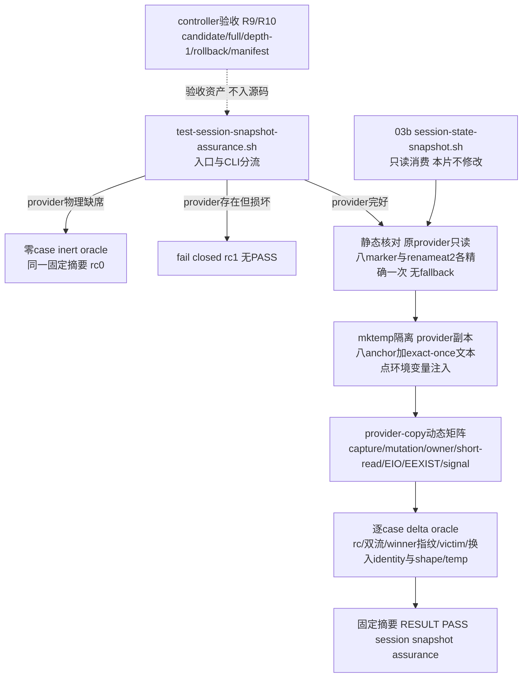

# 任务 2.2: 验证完整历史checkout

> 这是你的需求。数值、签名、命令一律照抄，不要自己发挥。
> 你只做这一个任务，不要顺手做别的。不要派 subagent。

---

## 完整上下文

下面是整个 spec 的三个文件，让你了解整体需求、设计和任务分解。
**但你只执行「你的任务」那一节，不要去做别的任务。**

### Requirements

> 用户原话：“$spec review 这套 aosp harness 工程，有哪些欠缺的地方，进行重构和完善”；并确认后续按 autopilot 执行。PLAN v5.7要求03b1在03b accepted后、03c signals facade前，以provider-copy穷举snapshot mutation/publish/child signal动态分支。

## 目标

只新增默认发现的shfmt-clean assurance测试`tests/test-session-snapshot-assurance.sh`：不修改已验收snapshot provider，只复制它并在八个无副作用anchor注入攻击，逐项反证held capture fd不受同名路径重建影响、managed/snapshot stat→open mutation、无特权wrong-owner、短读仍逐字节产出精确`feature`、真实EIO、`renameat2`缺symbol/`ENOSYS`、确定性`EEXIST`后same/different/disappear/unsafe，以及write child在`TEMP_BEFORE_PUBLISH`后的HUP/INT/TERM清理（含五次close与已提交winner旧名只得`ENOENT`的窗口）；全部provider副本与state root位于`mktemp`隔离目录。成功唯一摘要为`RESULT PASS  session snapshot assurance`。八个anchor是`HARNESS_TEST_MARKER_CAPTURE_READY`、`HARNESS_TEST_MARKER_SNAPSHOT_MANAGED_BEFORE_OPEN`、`HARNESS_TEST_MARKER_MANAGED_EXPECTED_EUID`、`HARNESS_TEST_MARKER_SNAPSHOT_EXPECTED_EUID`、`HARNESS_TEST_MARKER_SNAPSHOT_BEFORE_OPEN`、`HARNESS_TEST_MARKER_TEMP_BEFORE_PUBLISH`、`HARNESS_TEST_MARKER_PUBLISH_RESULT`与`HARNESS_TEST_MARKER_OS_ERROR`；它们都不是capability marker。本片继续不设置`HARNESS_SESSION_STATE_PROVIDER_VERSION`、不发布运行时API；dependency-present完整矩阵入ledger后才可启动03c，inert PASS不能解除该顺序门。

## 需求

R1. [计划] 系统必须只新增一个默认发现且shfmt-clean的`tests/test-session-snapshot-assurance.sh`，不修改common/.harness/lib/session-state-snapshot.sh及任何前序模块或测试；入口从自身路径解析repo root，只接受无参数、`all`或唯一`--dependency-absent`，unknown/extra/flag带值返回1且不打印PASS。

R2. [计划] 当真实snapshot provider物理缺席时，系统必须使默认无参数、`all`与`--dependency-absent`运行走同一零active case的inert oracle并以同一固定摘要`RESULT PASS  session snapshot assurance\n`逐字退出0；当provider路径存在但非普通文件、是symlink、`bash -n`语法失败、source非零、source后预期三个snapshot export缺席、任一anchor非精确一次或`renameat2`非精确一次时，系统必须fail closed返回1且不打印PASS。

R3. [计划] 当入口执行active分支时，系统必须只复制provider到隔离临时副本并在八个anchor处注入攻击，注入前核对原provider文本中八个marker各精确一次、`renameat2`调用精确一次且不存在rename/link publish fallback；不得修改原provider文件，副本与state root必须位于`mktemp`隔离目录。

R4. [计划] 当攻击者在held capture fd的已unlink pathname上重建同名文件时，系统必须证明worker仍消费held fd字节：snapshot发布落到canonical session path、重建文件内容逐字节等于攻击者写入、无owned temp残留。

R5. [计划] 当managed root/project/session任一层或snapshot leaf在stat→open之间被换成symlink/different-inode或消失时，系统必须对read/write各覆盖全部组合：link与different-inode返回2、认证后消失返回1、失败双流空，并逐行核对被移原winner完整指纹不变、victim不变、换入对象的注入identity与精确shape、无owned temp残留。

R6. [计划] 如果发生无特权wrong-owner、强制一字节short read或真实EIO，系统必须使managed与snapshot expected-EUID失败对read/write均返回2且winner/temp不变、short read仍逐字节产出精确`feature`+LF并返回0、EIO对既有read与fresh write均返回1且双流空，并逐行核对各自winner/victim/temp delta。

R7. [计划] 如果发生publish seam的libc symbol缺失、`ENOSYS`或确定性`EEXIST`，系统必须使缺symbol与ENOSYS返回1且无任何fallback，EEXIST后same/different/unsafe/disappear分别返回0/3/2/1且全部双流空；same/different必须在进入winner首次name-stat前证明owned temp已清，并在返回后核对完整winner指纹（dev/inode/uid/mode/nlink/size/hash），unsafe/disappear核对注入identity与精确shape，所有分支victim不变且无temp残留。

R8. [计划] 当write child在`TEMP_BEFORE_PUBLISH` barrier后收到HUP/INT/TERM时，系统必须向`ps`证实已为Python的PID逐信号送达，并核对首信号rc恰为129/130/143、无winner、owned temp清零；ignore安装期第二信号必须只返回且不改首信号码。provider-copy窗口行必须覆盖post-close信号、signal+cleanup-close-error下owned temp/session/三层ancestor共五次close尝试且锁存信号码优先于cleanup错误、rename未提交窗口无winner、rename已提交窗口winner保持完整指纹且旧temp名只得到`ENOENT`、已提交winner绝不回滚。

R9. [计划] 当03b1进入验收时，系统必须在candidate、完整历史checkout和真实`git clone --depth 1 file://...`中分别运行默认assurance入口与`bash ./scripts/check.sh --offline`，自动发现本入口恰好一次，且每个checkout的当前tracked上游六文件（common/.harness/lib/session-state-foundation.sh、common/.harness/lib/session-state-path.sh、tests/lib/session-path-race-driver.py、tests/test-session-path-races.sh、common/.harness/lib/session-state-snapshot.sh、tests/test-session-snapshot.sh）SHA-256在测试前后不变。controller必须先逐字验证shfmt `v3.14.0`与ShellCheck version field `0.11.0`，再只对本片exact单文件运行`shfmt -d -i 2 -ci -bn`、`shellcheck -x --severity=warning`与`bash -n`；execution BASE到accepted HEAD必须exact只新增`tests/test-session-snapshot-assurance.sh`、numstat总和`<=400`，六列review manifest必须与tasks一一对应、首尾/相邻连续、reviewer非空且全PASS，`git diff --check`与worktree clean必须通过。

R10. [计划] 当验证独立回滚与顺序时，系统必须从accepted HEAD建立隔离临时分支，提交一个exact只删除该assurance入口的rollback commit，在该clean checkout运行03b基础测试与offline并要求全绿、本入口发现0次；验收后丢弃临时checkout，不改变candidate/full/depth-1 checkout。controller只有在03b1 accepted HEAD、dependency-present完整矩阵、exact1/400与全PASS manifest入ledger后，才可创建规范ID `2026-09-02-03c-session-write-interrupts`的spec目录、同名`spec/`分支/worktree、ledger execution BASE或dispatch记录；此前这四类资产必须物理缺席，以`test ! -e`、`git show-ref --verify --quiet`反值、`git worktree list --porcelain`与`rg`机械核对；任何inert PASS不得作为本片验收证据或解除该顺序门。

## 验收标准

主验证命令: bash ./tests/test-session-snapshot-assurance.sh
期望输出: dependency-present时退出码为`0`、stderr空，stdout逐字节精确为`RESULT PASS  session snapshot assurance\n`，且完整矩阵逐case全PASS

验收清单:

- [ ] exact单文件入口只消费03b provider与八anchor；unknown/extra/flag带值rc1且无PASS；provider物理缺席时默认/all/--dependency-absent逐字同一inert摘要且零active case。
- [ ] provider存在但非普通文件、是symlink、bash -n/source失败、三export缺席、anchor或renameat2次数错时fail closed rc1无PASS；inert摘要不计入本片验收证据。
- [ ] 注入前核对八marker各精确一次、renameat2精确一次、无rename/link fallback；原provider文件SHA-256在运行前后不变；副本与state root均在mktemp隔离目录。
- [ ] capture同名重建行证明发布落到canonical path、重建文件内容逐字节等于攻击者写入、无temp残留。
- [ ] managed三层×link/inode/missing×read/write与snapshot leaf×link/inode/missing×read/write逐行核对rc、双流、被移原winner指纹、victim、换入identity与shape、temp。
- [ ] wrong-owner四行rc2、short-read行rc0且stdout hex精确feature+LF、EIO两行rc1双流空；各行winner/victim/temp delta均核对。
- [ ] 缺symbol/ENOSYS行rc1且无fallback；EEXIST四行rc 0/3/2/1，same/different在winner首次name-stat前证明temp已清且完整winner指纹一致，unsafe/disappear核对identity/shape，victim不变。
- [ ] HUP/INT/TERM三行在barrier后送达ps证实为Python的PID，首信号rc 129/130/143、第二信号不改码、无winner、temp清零；post-close、cleanup-close五次close、rename未提交/已提交窗口行核对锁存rc、namespace与已提交winner不回滚。
- [ ] candidate/full/depth-1的默认入口与offline全PASS，offline发现恰好一次，depth-1 commit-count=1且shallow marker非空；每个checkout的上游六文件SHA-256测试前后不变且clean。
- [ ] 隔离rollback commit exact只删除本入口后，clean checkout中03b基础测试与offline全PASS且本入口发现0次；03c的spec/ref/worktree/BASE/dispatch按R10机械查缺席。
- [ ] review manifest六列、任务序号、execution BASE、相邻base/head、accepted HEAD和全PASS一次机械验证通过；BASE..HEAD exact name-only为上述单文件、numstat总和`<=400`，固定版本断言后对exact单文件运行shfmt/ShellCheck/bash-n全绿，`git diff --check`和clean通过；只有dependency-present完整矩阵入ledger后才可创建03c。

不变量（不许劣化，2-4项）:

- assurance任一case改变已发布安全winner的次数 ≤ `0`，验证: 每case前后比较winner dev/inode/uid/mode/nlink/size/hash指纹。
- 不安全换入对象被read/write跟随或victim被修改的次数 ≤ `0`，验证: 攻击矩阵的victim指纹与session namespace inventory delta。
- case结束后本调用未发布owned temp残留数 ≤ `0`，验证: 每case前后在临时根下find `.snapshot-*`计数。
- 上游六tracked文件在execution BASE..HEAD的变更数 ≤ `0`，验证: `git diff --name-only "$BASE" "$HEAD" -- common/.harness/lib/session-state-foundation.sh common/.harness/lib/session-state-path.sh tests/lib/session-path-race-driver.py tests/test-session-path-races.sh common/.harness/lib/session-state-snapshot.sh tests/test-session-snapshot.sh`。

## 超出范围

- 不修改03b snapshot provider及03/03a/03a1/03a2任何模块或测试；不设置`HARNESS_SESSION_STATE_PROVIDER_VERSION`，不发布public path/write/read/remove或任何运行时API。
- 不实现03c的Bash signals facade、spawn-gap补转发、process-group信号或facade first-signal-wins；本片只证明03b worker级信号语义，03c启动仍以dependency-present完整矩阵ledger为门。
- 不重复03b基础测试已验收的静态攻击表与真实并发矩阵；本片独占provider-copy动态穷举，inert PASS不替代dependency-present证据。
- 不实现remove/prune/final aggregator/coverage fragment（属03d）；不调用设备、网络、AOSP build、Claude/Codex客户端，不push、不清理已有spec/prototype/implementation分支或worktree。

### Design

# 2026-09-02-03b1-session-snapshot-assurance 设计

## 概述

只新增一个默认发现、shfmt-clean 的 `tests/test-session-snapshot-assurance.sh`：不改 03b provider，把它复制到 `mktemp` 隔离目录后在八个无副作用 anchor 及若干 exact-once 非 anchor 文本点注入攻击，穷举 held capture/managed/snapshot mutation、wrong-owner、short-read、EIO、publish seam 与 child signal 窗口的全部动态分支，成功唯一输出 `RESULT PASS  session snapshot assurance`。

- 选择“provider-copy + 环境变量注入，原 provider 只读消费”，因为 03b 已验收的模块不能被本片触碰，而攻击点必须落在 stat→open、publish、signal handler 等生产文本内部；放弃给 provider 加测试钩子参数（污染已验收接口）和在测试里重写 worker 算法（双实现漂移，证的不是同一份代码）。注入集不止八个 marker anchor：R3 的静态核对只针对八 marker 与 `renameat2`，而动态矩阵还在 short-read chunk、cleanup-close、post-close 信号、latch-second、caught barrier、unlink errno 记录等 exact-once 非 anchor 文本点做逐字替换，这些点不进入 R3 的 marker 计数。
- 选择“inert 与 fail-closed 严格分流：provider 物理缺席时三种调用走同一零 active case inert oracle 并以同一固定摘要 rc0；存在但损坏（类型/symlink/`bash -n`/source/三 export/anchor 或 `renameat2` 次数错）一律 rc1 无 PASS”，因为 inert PASS 不得充当本片验收证据，损坏 provider 伪装成 inert 会让 fail-closed 场景静默通过；放弃把损坏并入 inert 摘要。
- 选择“原样整合 prototype 的 308 行 active 矩阵，剩余约 92 行只用于 inert 分流、CLI 解析、fail-closed 七类检查、固定摘要与计数、controller 面向的结构注释，以及 rename 已提交窗口的 unlink errno 记录注入点（注入替换与一行 oracle 核对合计约 8 行），承诺 execution diff exact1 且 numstat ≤400”，因为 runnable prototype `cbdbdde0e1e3ff4ceb2dc0279b1db83127a0ea9e` 已在当前 main 固定格式实跑 rc0、240 项断言、308/400 行；放弃把 R9/R10 的 candidate/full/depth-1/rollback/manifest 逻辑塞进测试文件（它们属 controller 验收资产，进文件必超 400 行且无法机械验收）。

## 需求映射

| 组件 | 实现的需求 |
|---|---|
| 入口与 CLI 分流 | R1, R2 |
| inert/fail-closed oracle | R2 |
| provider-copy 注入与静态核对 | R3 |
| held capture 同名重建用例 | R4 |
| managed/snapshot stat→open mutation 矩阵 | R5 |
| wrong-owner/short-read/EIO 用例 | R6 |
| publish seam（symbol/ENOSYS/EEXIST 四态）矩阵 | R7 |
| child signal 四窗口矩阵 | R8 |
| controller 验收（candidate/full/depth-1/offline/manifest/exact1） | R9 |
| controller 回滚与 03c 顺序门 | R10 |

## 架构



本片运行时零新增：唯一的源码产出是测试文件本身，不设置 capability marker、不发布运行时 API、不修改 `common/` 与任何前序测试。测试入口依赖 Bash（固定 shfmt `v3.14.0` 格式化验收）、系统 `python3`（worker 进程与注入文本生成）、以及 `rg/find/stat/sha256sum/ps/kill/od/git/mktemp`；选这些是因为 03b worker 本体就是 Bash→Python spawn-only 结构，注入文本替换必须与 worker 内的 Python 源码逐字对齐，而 delta oracle 需要的 dev/inode/uid/mode/nlink/size/hash 指纹只能由 `stat`/`sha256sum` 机械给出。注入替换分两层：八个 marker anchor 由 R3 静态核对精确一次后注入；short-read chunk、cleanup-close、post-close 信号、unlink errno 记录等攻击点落在非 anchor 的 exact-once 生产文本上，替换时同样要求原文精确一次，但不计入 marker 结构核对。全部 provider 副本与 state root 位于单个 `mktemp -d` 隔离目录（`TMPDIR` 同步指向它），`trap EXIT` 清理，不触碰真实 `${TMPDIR:-/tmp}` 之外的状态。

## 组件与接口

### assurance 入口与 CLI 分流

- 职责：从自身路径解析 repo root，只接受无参数、`all` 或唯一 `--dependency-absent`，按 provider 物理状态分流到 inert/fail-closed/active 三条路径之一。
- 对外接口（产出，与 frontmatter 逐字一致）：`session-snapshot-assurance-v1 —— tests/test-session-snapshot-assurance.sh默认发现入口、provider-copy完整矩阵与固定摘要`RESULT PASS  session snapshot assurance`；无运行时API/provider marker`
- 精确调用面：`bash ./tests/test-session-snapshot-assurance.sh`、`bash ./tests/test-session-snapshot-assurance.sh all`、`bash ./tests/test-session-snapshot-assurance.sh --dependency-absent`；active 与 inert 成功时 stdout 逐字 `RESULT PASS  session snapshot assurance\n`、stderr 空、rc0；unknown 参数、extra 参数、flag 带值均 rc1 且不打印 PASS。
- 依赖：`common/.harness/lib/session-state-snapshot.sh` 的物理路径与 03b accepted HEAD；`bash/rg/stat/sha256sum/mktemp`。

### 消费契约（03b snapshot core，本片只读）

- 职责：提供被复制的 provider 文本、spawn-only worker 与 write/read core 私有协议、八个确定性测试 anchor。
- 消费接口（与 frontmatter 逐字一致）：`session-snapshot-core-v2的spawn-only _harness_session_snapshot_worker write|read ...、signal-aware write/read core私有协议与八个确定性测试anchor；tests/test-session-snapshot.sh基础测试dependency-present PASS证据（无运行时API）`
- 精确调用：`_harness_session_snapshot_worker write <project-id> <session-id> <feature>`、`_harness_session_snapshot_worker read <project-id> <session-id>`、`_harness_session_snapshot_write_core <project-id> <session-id> <feature>`、`_harness_session_snapshot_read_core <project-id> <session-id>`；八个 anchor 为 `HARNESS_TEST_MARKER_CAPTURE_READY`、`HARNESS_TEST_MARKER_SNAPSHOT_MANAGED_BEFORE_OPEN`、`HARNESS_TEST_MARKER_MANAGED_EXPECTED_EUID`、`HARNESS_TEST_MARKER_SNAPSHOT_EXPECTED_EUID`、`HARNESS_TEST_MARKER_SNAPSHOT_BEFORE_OPEN`、`HARNESS_TEST_MARKER_TEMP_BEFORE_PUBLISH`、`HARNESS_TEST_MARKER_PUBLISH_RESULT` 与 `HARNESS_TEST_MARKER_OS_ERROR`，它们都不是 capability marker。
- 依赖：03b accepted ledger；本片不设置 `HARNESS_SESSION_STATE_PROVIDER_VERSION`。

### inert/fail-closed oracle

- 职责：provider 物理缺席时，无参数、`all`、`--dependency-absent` 三种调用走同一零 active case 流程并以同一固定摘要逐字 rc0；provider 存在但损坏时统一 fail closed。
- 内部接口：`run_inert() -> 0`（唯一输出固定摘要）；fail-closed 检查点各自直接 `exit 1`，不打印 PASS。
- fail-closed 触发条件（存在即拒）：路径非普通文件、是 symlink、`bash -n` 语法失败、source 返回非零、source 后 `_harness_session_snapshot_worker`/`_harness_session_snapshot_write_core`/`_harness_session_snapshot_read_core` 三个 export 任一缺席、任一 anchor 非精确一次、`renameat2` 调用非精确一次。
- 依赖：入口分流结果；inert 摘要不得作为本片验收证据，只保证回滚兼容。

### provider-copy 注入与静态核对

- 职责：在 active 分支把原 provider 复制到 `mktemp` 隔离副本，注入前对原文件静态核对，注入只发生在副本上，运行前后原 provider SHA-256 不变。
- 内部接口：`verify_provider_static <path> -> 0|1`（八 marker 各精确一次、`renameat2` 精确一次、无 `os.replace(`/`os.link(`/`os.rename(` publish fallback）；`inject_copy <src> <dst> -> 0`（逐字锚点替换，每处替换要求原文出现且仅出现一次，否则注入自身失败 rc1）。
- 注入机制：副本内的攻击代码由 `ASSURANCE_*` 环境变量按 case 驱动（capture 重建路径、managed/snapshot 换入动作与层、owner 偏移、EIO 开关、publish 动作、barrier/caught 文件、cleanup close 日志等），与 runnable prototype 的注入集一一对应。
- 依赖：原 provider 文本、mktemp 隔离目录、python3（替换脚本）。

### 动态矩阵（capture/managed/snapshot/owner/short-read/EIO）

- 职责：逐项反证 R4–R6 的动态分支，每行核对 rc、双流与完整状态 delta。
- 用例集：held capture 同名重建 1 组（发布落 canonical session path、重建文件内容逐字节等于攻击者写入、无 temp 残留）；managed 三层（state/project/session）×（link/inode/missing）×（read/write）= 18 行；snapshot leaf ×（link/inode/missing）×（read/write）= 6 行；wrong-owner（managed/snapshot expected-EUID）×（read/write）= 4 行 rc2；强制一字节 short read 1 行 rc0 且 stdout hex 精确 `feature`+LF；真实 EIO 既有 read 与 fresh write 2 行 rc1 双流空。
- delta oracle：每行核对被移原 winner 完整指纹（dev/inode/uid/mode/nlink/size/sha256）不变、victim 不变、换入对象的注入 identity 与精确 shape（link 目标/dir 属性/file 属性+hash/absent）、owned temp 计数为 0。
- 依赖：provider-copy 注入、`_harness_session_snapshot_{read,write}_core`。

### publish seam 矩阵

- 职责：覆盖 R7 的 libc symbol 缺失、`ENOSYS` 与确定性 `EEXIST` 全分支。
- 用例集：`symbol`/`enosys` 各 rc1 且无任何 fallback；`EEXIST` 后 same/different/unsafe/disappear 分别 rc 0/3/2/1 且全部双流空；same/different 必须在进入 winner 首次 name-stat 前证明 owned temp 已清（注入点主动拒绝残留 `.snapshot-*`），返回后核对完整 winner 指纹；unsafe/disappear 核对注入 identity 与精确 shape；所有分支 victim 不变、无 temp 残留。
- 依赖：`HARNESS_TEST_MARKER_PUBLISH_RESULT` 与 `HARNESS_TEST_MARKER_OS_ERROR` 注入、write core。

### child signal 窗口矩阵

- 职责：覆盖 R8 的 HUP/INT/TERM 锁存与四个确定性信号线性化窗口。
- 用例集：三行真实信号——spawn-only background worker，`TEMP_BEFORE_PUBLISH` barrier 后向 `ps` 证实为 Python 的 PID 送达首信号，rc 恰为 129/130/143，无 winner，owned temp 清零，ignore 安装期第二信号只返回且不改首信号码；四行 provider-copy 窗口——post-close 信号、signal+cleanup-close-error（owned temp/session/三层 ancestor 共五次 close 尝试，锁存信号码优先于 cleanup 错误）、rename 未提交窗口无 winner、rename 已提交窗口 winner 保持完整指纹且旧 temp 名只得到 `ENOENT`、已提交 winner 绝不回滚。
- 旧 temp 名 ENOENT 的机械 oracle：新增一个 exact-once 非 anchor 文本注入点，逐字替换 finally 中 owned temp 的 unlink 调用点；设置 `ASSURANCE_UNLINK_LOG` 时副本把该次 unlink 的结果（`success` 或具体 errno 名）追加到日志文件，替换同样要求原文精确一次、否则注入自身 rc1。rename 已提交窗口行核对日志唯一一行恰为 `ENOENT`——first_signal 锁存后任何非 ENOENT 的 unlink 错误（或 unlink 意外成功删到真实对象）都会使该行 FAIL，而不是被 finally 静默吞掉。该注入替换与一行日志核对合计约 8 行，计入剩余约 92 行的整合预算。
- 依赖：spawn-only worker（PID 在 exec 后不变）、`TEMP_BEFORE_PUBLISH`/`PUBLISH_RESULT`/close 注入点、`ps/kill`。

### controller 验收与顺序门（验收资产，不进入源码文件）

- 职责：执行 R9/R10 的机器核对，全部证据入 ledger 后才允许 03c 启动。
- 验收动作：candidate、完整历史 checkout、真实 `git clone --depth 1 file://...` 分别运行默认入口与 `bash ./scripts/check.sh --offline`，offline 发现本入口恰好一次，depth-1 commit-count=1 且 shallow marker 非空；每个 checkout 的六 tracked 上游文件（`common/.harness/lib/session-state-foundation.sh`、`common/.harness/lib/session-state-path.sh`、`tests/lib/session-path-race-driver.py`、`tests/test-session-path-races.sh`、`common/.harness/lib/session-state-snapshot.sh`、`tests/test-session-snapshot.sh`）SHA-256 测试前后不变且 clean；逐字验证 shfmt `v3.14.0` 与 ShellCheck version field `0.11.0` 后只对 exact 单文件运行 `shfmt -d -i 2 -ci -bn`、`shellcheck -x --severity=warning`、`bash -n`；execution BASE 到 accepted HEAD exact 只新增 `tests/test-session-snapshot-assurance.sh`、numstat 总和 ≤400、六列 manifest 与 tasks 一一对应、首尾/相邻连续、reviewer 非空且全 PASS、`git diff --check` 与 worktree clean 通过；从 accepted HEAD 建隔离临时分支提交 exact 只删除本入口的 rollback commit，clean checkout 中 03b 基础测试与 offline 全绿、本入口发现 0 次；03c 的 spec 目录/分支/worktree/ledger BASE 或 dispatch 记录在条件满足前以 `test ! -e`、`git show-ref --verify --quiet` 反值、`git worktree list --porcelain` 与 `rg` 机械查缺席。
- 依赖：本片 accepted HEAD、dependency-present 完整矩阵、exact1/400 与全 PASS manifest 入 ledger；inert PASS 不解除该门。

## 数据模型

不适用：本片不新增持久化状态、schema 或跨进程数据库。测试 fixture 只有 `mktemp` 隔离目录内的 provider 副本、state root 与 attacker 文件，复用 03b 数据模型的 capture/managed/temp/winner 四对象及其安全属性（capture nlink0 0600、managed 0700、temp `.snapshot-*` 0600、winner 固定 leaf 0600 nlink1），case 结束由 `trap EXIT` 整体销毁；oracle 只比较指纹与 inventory delta，不产生任何留存状态。

## 数据流

### 入口分流与 provider-copy 注入

```mermaid
sequenceDiagram
  participant U as 调用方(controller/offline/用户)
  participant E as assurance入口
  participant B as 原provider(只读)
  participant C as mktemp副本
  U->>E: 无参数 / all / --dependency-absent
  E->>E: 解析repo root; 拒绝unknown/extra/flag带值(rc1无PASS)
  alt provider物理缺席
    E-->>U: 零active case inert; RESULT PASS  session snapshot assurance / rc0
  else provider存在但损坏
    E->>B: 类型/symlink/bash -n/source/三export/anchor/renameat2次数
    E-->>U: fail closed rc1 无PASS
  else provider完好
    E->>B: 静态核对八marker各一次/renameat2一次/无fallback; 记录SHA-256
    E->>C: 复制并逐字注入八anchor与exact-once文本点(每处替换要求精确一次)
    E->>C: 执行完整动态矩阵与delta oracle
    E->>B: 复核SHA-256不变
    E-->>U: RESULT PASS  session snapshot assurance / rc0 / stderr空
  end
```

### managed stat→open mutation 单行 oracle

```mermaid
sequenceDiagram
  participant T as 测试driver
  participant W as provider副本worker
  participant D as managed目录链
  T->>W: prepare: write alpha 建立合法winner
  T->>T: 记录winner/victim完整指纹
  T->>W: 设ASSURANCE_MANAGED=link|inode|missing, ASSURANCE_LAYER=state|project|session
  W->>D: name-stat通过该层
  W->>D: SNAPSHOT_MANAGED_BEFORE_OPEN anchor: 换入symlink/different-inode或删除
  W->>D: open/fstat/after-stat 重新验证该层
  alt link或different-inode
    D-->>T: 双流空 / rc2; 不follow换入对象
  else 认证后消失
    D-->>T: 双流空 / rc1
  end
  T->>T: 核对被移原winner指纹不变/victim不变/换入identity与精确shape/temp=0
```

### child signal barrier 与锁存窗口

```mermaid
sequenceDiagram
  participant T as 测试driver
  participant W as spawn-only worker(同一PID)
  participant D as session dirfd
  T->>W: background worker write; 设barrier/caught文件
  W->>W: 安装HUP/INT/TERM handler后建owned temp
  W->>D: TEMP_BEFORE_PUBLISH anchor: 落barrier并等待
  T->>T: 等到barrier; ps证实该PID为Python; temp计数=1
  T->>W: 首信号 HUP/INT/TERM
  W->>W: handler一次性锁存first_signal
  T->>W: ignore安装期第二信号
  W->>W: 非空锁存只返回, 不改首信号码
  W->>D: finally清owned temp; cleanup错误不覆盖锁存码
  W-->>T: rc=128+首信号(129/130/143); 无winner; temp清零
  T->>T: 另四行核对post-close/五次close/rename未提交/已提交窗口
  T->>T: 已提交窗口另核unlink日志唯一一行恰为ENOENT
```

## 错误处理

| 错误场景 | 恢复策略 | 校验位置 | 日志 | 用户可见 |
|---|---|---|---|---|
| CLI unknown/extra/flag带值 | 拒绝且不进入任何分支 | 入口参数解析 | 无 | rc1、无 PASS |
| provider 物理缺席 | 三种调用同一零 case inert oracle | 入口分流 | 无 | 固定摘要、rc0 |
| provider 非普通文件/是 symlink | fail closed，不 source 不复制 | 入口 fail-closed 检查 | 无 | rc1、无 PASS |
| provider `bash -n` 失败/source 非零/三 export 缺席 | fail closed | 入口 fail-closed 检查 | 无 | rc1、无 PASS |
| 任一 anchor 或 `renameat2` 非精确一次/存在 rename/link fallback | fail closed，注入前终止 | 静态核对 | 无 | rc1、无 PASS |
| 注入锚点替换非精确一次 | 注入自身失败，矩阵不执行 | `inject_copy` | 无 | rc1、无 PASS |
| 真实 EIO（OS_ERROR anchor） | worker 原语义：既有 read 与 fresh write 均 rc1，不改 winner/victim/temp | EIO 两行 delta oracle | 无 | 双流空、rc1；矩阵 PASS 依赖该分类 |
| ENOENT 窗口（managed/snapshot 认证后消失、EEXIST disappear） | 关闭已持有 fd，不改 namespace | mutation/EEXIST 行 rc 与 shape 核对 | 无 | 双流空、rc1 |
| EEXIST same/different/unsafe/disappear | temp 先清再读 winner；分别 rc 0/3/2/1 | publish seam 行；same/different 在 winner 首次 name-stat 前拒残留 temp | 无 | 双流空、对应 rc |
| `renameat2` 缺 symbol/ENOSYS | 无 fallback，清 owned temp | publish seam 行 rc1 与 temp=0 | 无 | 双流空、rc1 |
| write child 收 HUP/INT/TERM | handler 一次性锁存首信号；ignore 期第二信号只返回；finally 五次 close 尝试后锁存码优先于 cleanup 错误 | 信号窗口矩阵 rc/close 日志/temp 核对 | 无 | 双流空、129/130/143 |
| rename 已提交后信号 | 旧 temp 名只容忍 `ENOENT`，winner 完整指纹保留且绝不回滚 | 已提交窗口 winner 指纹与 shape 核对 + unlink errno 注入日志（唯一一行恰为 `ENOENT`，非 ENOENT 吞错即 FAIL） | unlink errno 日志到 mktemp 文件 | 锁存信号码、winner 不变 |
| wrong-owner（无特权 expected-EUID 失败） | 拒绝 follow，winner/temp 不变 | owner 四行 rc2 与 delta | 无 | 双流空、rc2 |
| 强制一字节 short read | 循环读满仍逐字节产出精确 `feature`+LF | stdout hex 精确比较 | 无 | rc0、stdout hex 精确 |
| 任一 case 失败 | 累计 failures，末行不打印 PASS | 统一 check/run_rc 计数器 | 失败详情到 stderr | rc1、无 PASS |

## 测试策略

| 层 | 测什么 | 用什么工具 |
|---|---|---|
| 单元/结构 | CLI 四态（无参数/all/--dependency-absent 接受，unknown/extra/flag带值 rc1 无 PASS）；原 provider 八 marker 与 `renameat2` 各精确一次、无 `os.replace/link/rename` fallback；运行前后原 provider SHA-256 不变；副本与 state root 均在 `mktemp` 隔离目录 | `bash` 隔离 shell、`rg`、`stat`、`sha256sum`、`mktemp` |
| 集成（动态矩阵，本片主体） | R4–R8 全组合：capture 同名重建；managed 三层×link/inode/missing×read/write 18 行；snapshot leaf×link/inode/missing×read/write 6 行；wrong-owner 4 行；short-read 1 行（stdout hex 精确）；EIO 2 行；symbol/ENOSYS/EEXIST 四态 6 行；child 信号 3 行真实信号 + 4 行 provider-copy 窗口；每行核对 rc、双流、winner 完整指纹、victim、换入 identity/shape、temp=0 | `bash ./tests/test-session-snapshot-assurance.sh`（主验证命令）、python3 注入、`ps/kill/od/find/stat/sha256sum` |
| inert/fail-closed | provider 物理缺席时三种调用同一零 case 流程、同一固定摘要逐字 rc0；七类损坏（非普通文件/symlink/`bash -n`/source/三 export/anchor 次数/`renameat2` 次数）逐一 fail closed rc1 无 PASS；inert 摘要不计入本片验收证据 | 同上入口 + `--dependency-absent`、损坏 fixture 目录 |
| 端到端/收敛（controller 验收资产） | candidate、完整历史 checkout、真实 `git clone --depth 1 file://...` 分别跑默认入口与 `bash ./scripts/check.sh --offline`，offline 发现本入口恰好一次，depth-1 commit-count=1 且 shallow marker 非空；六 tracked 上游文件 SHA-256 测试前后不变且 clean；隔离 rollback commit exact 只删本入口后 03b 基础测试与 offline 全绿、本入口发现 0 次；03c 四类资产机械查缺席 | `git clone --depth 1 file://...`、`git worktree/status/diff/show-ref`、`bash ./scripts/check.sh --offline`、`rg` |
| 静态与 sizing | 固定版本断言后只对 exact 单文件 `shfmt -d -i 2 -ci -bn`、`shellcheck -x --severity=warning`、`bash -n`；execution BASE..HEAD exact 只新增本入口、numstat 总和 ≤400；六列 manifest 机械验证；`git diff --check` 与 clean 通过 | shfmt `v3.14.0`、ShellCheck `0.11.0`、`bash -n`、Git/awk controller 命令 |
| 性能 | 不适用：本片不设吞吐/延迟 SLO；信号 barrier 用短轮询等待，`timeout` 仅作测试防挂死，不冒充 benchmark | `timeout` |

sizing 承诺：runnable prototype `cbdbdde0e1e3ff4ceb2dc0279b1db83127a0ea9e` 的 active 矩阵以固定格式实测 308/400 行、实跑 rc0、240 项断言；剩余约 92 行只整合 inert/fail-closed 分流（含 fail-closed 七类检查的逐类 fixture）、CLI 解析、固定摘要与 failures/checks 计数、repo root 解析、controller 面向的结构注释，以及 rename 已提交窗口的 unlink errno 记录注入点（约 8 行），不新增其他动态用例。承诺 execution diff exact1（只新增 `tests/test-session-snapshot-assurance.sh`）且 `git diff --numstat` 总和 ≤400。stdout/stderr 一律落文件后按字节比较，禁止用吞尾随 LF 的 command substitution 验证成功流。sizing 证据为 `cbdbdde0e1e3ff4ceb2dc0279b1db83127a0ea9e:.spec/2026-08-31-aosp-harness-refactor/work/2026-09-02-03b-session-snapshot-safety/prototype/round3-assurance-sizing-evidence.md`；其中 293 行/236 项是修复旧 close 顺序 mutant 之前的早期测量，现行口径以 requirements 与 PLAN v5.7 确认的 308/400 行、240 项断言为准。

## 文件清单

| 文件 | 创建/修改 | 职责（一句话） |
|---|---|---|
| `tests/test-session-snapshot-assurance.sh` | 创建 | 默认发现的 shfmt-clean assurance 入口：CLI/inert/fail-closed 分流与 provider-copy 八 anchor 注入的 capture/mutation/publish/signal 完整动态矩阵及固定摘要 |

验收资产（不纳入源码文件清单）：红阶段证据（失败双流 mutant 与 old-order close mutant 的 rc1/无 PASS 自反证记录）、逐 task review 报告、六列 review manifest、candidate/full/depth-1/rollback 运行日志、accepted HEAD 与 ledger execution BASE 证据；sizing 依据 prototype `cbdbdde0e1e3ff4ceb2dc0279b1db83127a0ea9e`（308/400 行、240 项断言）与 `cbdbdde0e1e3ff4ceb2dc0279b1db83127a0ea9e:.spec/2026-08-31-aosp-harness-refactor/work/2026-09-02-03b-session-snapshot-safety/prototype/round3-assurance-sizing-evidence.md`（其中 293/236 为修复旧 close 顺序前的早期测量，现行口径 308/400）。门③通过前不创建 implementation worktree 或固定 execution BASE；dependency-present 完整矩阵、exact1/400 与全 PASS manifest 入 ledger 前不创建 03c 的 spec 目录/分支/worktree/BASE/dispatch 记录。

### 所有任务

# 2026-09-02-03b1-session-snapshot-assurance 实现计划

03b 三轮 tasks review 证明逐函数拼装中间代码会制造假红；本片最终文件不是现成 blob，而是 runnable prototype 308 行加约 41 行机械整合。熔断裁定：任务 1.1 一次性交付完整候选文件（以 prototype blob 为基座，整合点 E1–E6 逐处给出确切代码或确切转换规则），随后 candidate/full/depth-1/rollback/order/terminal 六个零 delta controller 验证任务；共七个任务严格串行。实现提交使用普通 Conventional Commit。每个任务均保存 red 记录、green 报告和 evidence package，交全新独立 agent review；Blocking/Important 修复后必须由另一全新 agent re-review。

固定变量与 blob 门：

```bash
PROJECT=.spec/2026-08-31-aosp-harness-refactor
SPEC=$PROJECT/specs/2026-09-02-03b1-session-snapshot-assurance
WORK=$PROJECT/work/2026-09-02-03b1-session-snapshot-assurance
TASKS=$SPEC/tasks.md
LEDGER=$SPEC/ledger.md
MANIFEST=$WORK/review-manifest.tsv
PROTO_SHA=cbdbdde0e1e3ff4ceb2dc0279b1db83127a0ea9e
PROTO_ASSURANCE=.spec/2026-08-31-aosp-harness-refactor/work/2026-09-02-03b-session-snapshot-safety/prototype/snapshot-assurance-r1.sh
test "$(git show "$PROTO_SHA:$PROTO_ASSURANCE" | wc -l)" -eq 308
```

controller 在门④通过后固定 `IMPLEMENTATION_WORKTREE` 与 `TASK_BASE`（execution BASE，即任务 1.1 提交前的 clean HEAD），并令 `BASE_SHA=$TASK_BASE`。

red记录固定六行：`task=`、`command=`、`expected=`、`rc=`、`stdout_sha256=`、`stderr_sha256=`，末加`assertion=`；green报告固定含task/base/head/files/commands/results。evidence package为TSV三列`path<TAB>sha256<TAB>bytes`，列出brief、report和全部日志；reviewer拿这三个路径，而不是依赖base=head的空diff。

manifest固定六列`seq<TAB>task-id<TAB>base<TAB>head<TAB>reviewer<TAB>PASS`。每个任务独立review PASS后先追加本行，再分别执行：

```bash
python3 /home/zzh0838/.agents/skills/spec/scripts/mark-task-done.py "$TASKS" TASK_ID
# controller用apply_patch向ledger增加：- 任务 TASK_ID: 完成 commits=[TASK_HEAD]
python3 /home/zzh0838/.agents/skills/spec/scripts/sync-ledger.py "$LEDGER" --repo "$IMPLEMENTATION_WORKTREE"
```

裁定（定死，依据随条给出）：

1. 落地策略：任务 1.1 单任务交付完整候选文件，禁止逐段拼装。依据：03b 教训——拼装中间代码制造未定义引用、截断 builder 与假红；prototype 已在当前 main 固定格式实跑 rc0，机械整合可把差异面压到 `diff` 逐 hunk 可核。
2. 整合后 dependency-present 实跑断言计数恰为 241 = prototype 实跑口径 240 加设计批准的 1 行 `ASSURANCE_UNLINK_LOG` ENOENT oracle。依据：design 测试策略 sizing 节——240 断言对应无该 oracle 的 308 行 prototype，「该注入替换与一行日志核对合计约 8 行」计入约 92 行整合预算。sizing 证据文档 `cbdbdde0e1e3ff4ceb2dc0279b1db83127a0ea9e:.spec/2026-08-31-aosp-harness-refactor/work/2026-09-02-03b-session-snapshot-safety/prototype/round3-assurance-sizing-evidence.md` 正文所记 293 行/236 断言为修复旧 close 顺序 mutant 之前的早期测量，已过期；现行口径以 requirements 与 PLAN v5.7 确认的 308/400 行、240 断言为准（review round 1 实跑复现 rc0 与 checks=240）。
3. fail-closed 七类硬检查先于 `--dependency-absent` inert 分支执行；inert 判定用 `! -e` 与 `! -L` 双判，dangling symlink 走 fail-closed 而非 inert。依据：R2「provider 路径存在但损坏一律 rc1 无 PASS」不含 flag 例外；inert PASS 本来不作本片验收证据，flag 不应放行损坏 provider。
4. E1–E6 是允许的全部整合点；prototype blob 与候选文件的 `diff` 除 E1–E6 外必须为零，防止顺手改动打散 240 断言口径与实跑证据。
5. 终交付锚点 `session-snapshot-assurance-v1` 记入本文、ledger 完成锚点与 acceptance 报告；任务 2.6 的「产出」字段写 `tests/test-session-snapshot-assurance.sh`。依据：check-tasks 的孤儿产出检查只认 requirements 验收标准节正文，该路径在「主验证命令」行逐字出现，而锚点名只出现在 requirements frontmatter。

### 任务 1.1: 交付完整assurance候选文件

文件: 创建 `tests/test-session-snapshot-assurance.sh`
验收资产（不纳入源码文件清单）: 创建 `.spec/2026-08-31-aosp-harness-refactor/work/2026-09-02-03b1-session-snapshot-assurance/evidence/task-1.1-red.txt` / 创建 `.spec/2026-08-31-aosp-harness-refactor/work/2026-09-02-03b1-session-snapshot-assurance/task-1.1-report.md` / 创建 `.spec/2026-08-31-aosp-harness-refactor/work/2026-09-02-03b1-session-snapshot-assurance/review-manifest.tsv`
消费: 无
产出: snapshot-assurance-matrix-v1
需求: R1, R2, R3, R4, R5, R6, R7, R8
必需: 是
状态: 完成

候选文件 = `git show "$PROTO_SHA:$PROTO_ASSURANCE"`（308 行）加以下且仅以下六处整合。每处给出确切代码或确切转换规则；整合后全文约 349 行，必须 ≤400。

E1（CLI 解析与结构注释）：在 prototype 第 4 行 `repo=$(git -C "$here" rev-parse --show-toplevel)` 之后插入：

```bash
# 03b1 session snapshot assurance: provider-copy 动态矩阵。
# 结构: CLI 分流 -> inert/fail-closed -> 注入副本 -> 动态矩阵 -> 固定摘要。
# 成功唯一摘要: RESULT PASS  session snapshot assurance
# 注意: 注释只写摘要文字，不得包含固定摘要的 printf 调用（步骤 4/5 探针按该调用字面量的出现次数定位）。
case ${1-} in
  '' | all) ;;
  --dependency-absent) mode=absent ;;
  *) exit 1 ;;
esac
[[ $# -le 1 ]] || exit 1
```

E2（provider 路径固定到 repo root）：把 prototype 第 5 行 `provider=${SNAPSHOT_CORE:-$here/snapshot-core-r2.sh}` 整行替换为：

```bash
provider=$repo/common/.harness/lib/session-state-snapshot.sh
```

E3（inert 分流与 fail-closed 七类）：紧随 E2 之后插入：

```bash
if [[ ! -e $provider && ! -L $provider ]]; then
  printf 'RESULT PASS  session snapshot assurance\n'
  exit 0
fi
[[ -f $provider && ! -L $provider ]] || exit 1
bash -n "$provider" 2>/dev/null || exit 1
bash -c 'source "$1"' _ "$provider" >/dev/null 2>&1 || exit 1
for fn in _harness_session_snapshot_worker _harness_session_snapshot_write_core _harness_session_snapshot_read_core; do
  bash -c 'source "$1/common/.harness/lib/session-state-foundation.sh" && source "$1/common/.harness/lib/session-state-path.sh" && source "$2" && declare -F "$3" >/dev/null' _ "$repo" "$provider" "$fn" >/dev/null 2>&1 || exit 1
done
for marker in CAPTURE_READY SNAPSHOT_MANAGED_BEFORE_OPEN MANAGED_EXPECTED_EUID \
  SNAPSHOT_EXPECTED_EUID SNAPSHOT_BEFORE_OPEN TEMP_BEFORE_PUBLISH PUBLISH_RESULT OS_ERROR; do
  [[ $(rg -c "HARNESS_TEST_MARKER_$marker" "$provider") == 1 ]] || exit 1
done
[[ $(rg -c 'renameat2' "$provider") == 1 ]] || exit 1
if rg -q 'os\.(replace|link|rename)\(' "$provider"; then exit 1; fi
if [[ ${mode-} == absent ]]; then
  printf 'RESULT PASS  session snapshot assurance\n'
  exit 0
fi
```

E4（注入自身失败即 rc1）：把 prototype 中 `python3 - "$provider" "$copy" <<'PY'` 行替换为 `python3 - "$provider" "$copy" <<'PY' || exit 1`，heredoc 正文逐字不动。

E5（`ASSURANCE_UNLINK_LOG` 注入点）：在 prototype 的 python heredoc `replacements` 字典中、键为 `"    raise Interrupted"` 的条目之后，插入一个条目（确切文本）：

```python
    "                try: os.unlink(temp, dir_fd=dir_fd)\n                except OSError as exc:": """                try:
                    os.unlink(temp, dir_fd=dir_fd)
                    if os.environ.get("ASSURANCE_UNLINK_LOG"): open(os.environ["ASSURANCE_UNLINK_LOG"], "a").write("success\\n")
                except OSError as exc:
                    if os.environ.get("ASSURANCE_UNLINK_LOG"): open(os.environ["ASSURANCE_UNLINK_LOG"], "a").write(errno.errorcode.get(exc.errno, "EUNKNOWN") + "\\n")""",
```

E6（rename 已提交窗口 ENOENT oracle）：对 prototype 信号窗口循环做四处逐字替换：(a) 把 `cleanup_log=$tmp/cleanup-log` 替换为 `cleanup_log=$tmp/cleanup-log` 加一行 `unlink_log=$tmp/unlink-log`（prototype 原文为连字符 `cleanup-log`，下划线写法在 308 行全文中出现 0 次）；(b) 把循环内 `  : >"$cleanup_log"` 替换为 `  : >"$cleanup_log"` 加一行 `  : >"$unlink_log"`；(c) 把 `    publish-success) ASSURANCE_PUBLISH=signal-success run_rc 143 _harness_session_snapshot_write_core project session alpha ;;` 替换为 `    publish-success) ASSURANCE_PUBLISH=signal-success ASSURANCE_UNLINK_LOG=$unlink_log run_rc 143 _harness_session_snapshot_write_core project session alpha ;;`；(d) 在 `  [[ $action != cleanup-close ]] || check_eq "$action all close attempts" 5 "$(wc -l <"$cleanup_log" | xargs)"` 行之后插入 `  [[ $action != publish-success ]] || check_eq "$action unlink errno" ENOENT "$(<"$unlink_log")"`。

- [ ] 步骤 1: 运行`test ! -e tests/test-session-snapshot-assurance.sh && bash tests/test-session-snapshot-assurance.sh`，确认红阶段失败为文件缺席 rc127、stdout 无 PASS；按固定六行 schema 写`$WORK/evidence/task-1.1-red.txt`并核`test -s "$WORK/evidence/task-1.1-red.txt"`。
- [ ] 步骤 2: 运行`test "$(git show "$PROTO_SHA:$PROTO_ASSURANCE" | wc -l)" -eq 308`核 blob 门；用 apply_patch 创建`tests/test-session-snapshot-assurance.sh`，内容 = prototype blob + E1–E6；运行`diff <(git show "$PROTO_SHA:$PROTO_ASSURANCE") tests/test-session-snapshot-assurance.sh`把 hunks 落日志，逐 hunk 核对只含 E1–E6、无其他差异，并核`test "$(wc -l <tests/test-session-snapshot-assurance.sh)" -le 400`。
- [ ] 步骤 3: 运行`test "$(shfmt --version)" = "v3.14.0"`与`shellcheck --version | rg -q '^version: 0.11.0$'`逐字核固定工具版本；对该单文件跑`shfmt -d -i 2 -ci -bn tests/test-session-snapshot-assurance.sh`（无输出）、`shellcheck -x --severity=warning tests/test-session-snapshot-assurance.sh`（rc0）、`bash -n tests/test-session-snapshot-assurance.sh`与`git diff --check`，全部通过。
- [ ] 步骤 4: dependency-present 实跑——分别运行`bash ./tests/test-session-snapshot-assurance.sh`与`bash ./tests/test-session-snapshot-assurance.sh all`，各自`>out 2>err`落盘后核 rc0、`printf 'RESULT PASS  session snapshot assurance\n' | cmp -s - out`、`test ! -s err`；断言计数：在仓库内`mktemp -d "$PWD/.count.XXXXXX"`中放目标副本，用 python3 把最后一处`printf 'RESULT PASS  session snapshot assurance\n'`前插入`printf 'checks=%d\n' "$checks" >&2`，跑 default 核`test "$(<err)" = "checks=241"`，随后删除临时目录。该定位的前提是全文恰 3 处此字面量：E3 的 provider-absent inert 分支（第 1 处）与 mode-absent inert 分支（第 2 处）、prototype 末行 active 出口（第 3 处）；计数对象是统一 `check_eq`/`run_rc` 计数器的累加值，E1 注释按 E1 内嵌约束只含摘要文字、不含此 printf 字面量，故 rindex 即末行 active 出口。argv 非法表`bash ./tests/test-session-snapshot-assurance.sh --bogus`、`bash ./tests/test-session-snapshot-assurance.sh all extra`、`bash ./tests/test-session-snapshot-assurance.sh --dependency-absent=x`逐行核 rc1 且 stdout 不含 PASS。
- [ ] 步骤 5: provider-absent 实跑——`git clone --no-local . "$tmp/r"`后`cp tests/test-session-snapshot-assurance.sh "$tmp/r/tests/"`并`rm "$tmp/r/common/.harness/lib/session-state-snapshot.sh"`，在`$tmp/r`分别跑无参数、`all`、`--dependency-absent`，核三者 rc0、stdout 逐字同一`RESULT PASS  session snapshot assurance\n`、stderr 0B。零 active case 的机械核验：对该副本用 python3 在第一处`printf 'RESULT PASS  session snapshot assurance\n'`（`index`，即 E3 provider-absent inert 分支）前插入`  printf 'checks=%d\n' "${checks:-0}" >&2`（两空格缩进与该分支一致；`set -u` 下 `checks=0` 在 prototype 第 97 行才初始化，inert 分支在其之前，必须用`${checks:-0}`；不能用步骤 4 的 rindex/`"$checks"` 探针——inert 流程在 E3 即`exit 0`，末行探针不可达、提前引用`"$checks"`会 unbound 崩溃），跑 default 核 rc0、stdout 逐字 inert 摘要、`test "$(<err)" = "checks=0"`。
- [ ] 步骤 6: fail-closed 七类逐类实跑——每类独立`git clone --no-local . "$tmp/fN"`、`cp`目标文件后造 fixture：(a)`rm` provider 后`mkdir`同名目录；(b)`rm`后`ln -s /dev/null`同名 symlink；(c)`printf 'if\n' >>`provider（bash -n 失败）；(d)`printf 'false\n' >>`provider（source 非零）；(e)`sed -i 's/_harness_session_snapshot_read_core/_harness_session_snapshot_read_core_x/g' provider`（三 export 缺一）；(f)`printf '# HARNESS_TEST_MARKER_OS_ERROR\n' >>`provider（anchor 两次）；(g)`printf '# renameat2\n' >>`provider（renameat2 两次）；逐类跑 default 核 rc1 且`! rg -q PASS out`，再跑`--dependency-absent`核同样 rc1 无 PASS（裁定 3）。
- [ ] 步骤 7: 提交——`git add -N tests/test-session-snapshot-assurance.sh`后核 working-tree `git diff --name-only`恰为该单文件、`git diff --numstat | awk '{s+=$1} END {print s+0}'`≤400；`git commit -m "test(session): add snapshot assurance matrix"`；设`TASK_HEAD=$(git rev-parse HEAD)`并核`git diff --name-only "$TASK_BASE" "$TASK_HEAD"`恰为该单文件、numstat 总和≤400、`git diff --name-only "$TASK_BASE" "$TASK_HEAD" -- common/.harness/lib/session-state-foundation.sh common/.harness/lib/session-state-path.sh tests/lib/session-path-race-driver.py tests/test-session-path-races.sh common/.harness/lib/session-state-snapshot.sh tests/test-session-snapshot.sh`为空、`git status --porcelain`为空。
- [ ] 步骤 8: 生成 task brief/report、`review-package.sh TASK_BASE TASK_HEAD`及 evidence package，取得独立 diff review PASS；有 fix 则更新`TASK_HEAD`、重跑步骤 3–7 并交全新 reviewer。PASS 后运行`printf '1\ttask-1.1\t%s\t%s\t%s\tPASS\n' "$TASK_BASE" "$TASK_HEAD" "$REVIEWER" >>"$MANIFEST"`；随后分别 mark 1.1、apply_patch 写 ledger 锚点、sync-ledger。

### 任务 2.1: 审计candidate并固定accepted HEAD

文件: 测试 `tests/test-session-snapshot-assurance.sh`
验收资产（不纳入源码文件清单）: 创建 `.spec/2026-08-31-aosp-harness-refactor/work/2026-09-02-03b1-session-snapshot-assurance/evidence/task-2.1-red.txt` / 创建 `.spec/2026-08-31-aosp-harness-refactor/work/2026-09-02-03b1-session-snapshot-assurance/task-2.1-report.md` / 修改 `.spec/2026-08-31-aosp-harness-refactor/work/2026-09-02-03b1-session-snapshot-assurance/review-manifest.tsv`
消费: snapshot-assurance-matrix-v1
产出: assurance-accepted-head-v1
需求: R9
必需: 是
状态: 完成

- [ ] 步骤 1: 运行`test -s "$WORK/task-2.1-report.md"`确认红阶段失败为报告缺席，按固定六行 schema 写 red 文件并核`test -s`；核 implementation clean 且`git rev-parse HEAD`为任务 1.1 的`TASK_HEAD`。
- [ ] 步骤 2: 保存六上游文件 before SHA（`sha256sum common/.harness/lib/session-state-foundation.sh common/.harness/lib/session-state-path.sh tests/lib/session-path-race-driver.py tests/test-session-path-races.sh common/.harness/lib/session-state-snapshot.sh tests/test-session-snapshot.sh`）；核`test "$(shfmt --version)" = "v3.14.0"`与`shellcheck --version | rg -q '^version: 0.11.0$'`；只对 exact 单文件跑`shfmt -d -i 2 -ci -bn`、`shellcheck -x --severity=warning`、`bash -n`；分别运行 default 入口与`bash ./scripts/check.sh --offline`到独立日志，核 default 摘要逐字、`test "$(rg -c 'RESULT PASS  session snapshot assurance' offline.log)" = 1"`（offline 发现恰一次）且 offline 末行 PASS；再`sha256sum -c`比较 after SHA。
- [ ] 步骤 3: 核`git diff --name-only "$BASE_SHA" HEAD`恰为`tests/test-session-snapshot-assurance.sh`、numstat 总和≤400、`git diff --check`、clean，生成 green 报告和 evidence package；若发现源码缺陷则回流任务 1.1 修复并重 review，不在本任务改变 HEAD。
- [ ] 步骤 4: 交独立 reviewer 审 brief/report/evidence package 并取得 PASS，把当前 40 位 clean HEAD 固定为`ACCEPTED_HEAD`。
- [ ] 步骤 5: 运行`printf '2\ttask-2.1\t%s\t%s\t%s\tPASS\n' "$TASK_HEAD" "$TASK_HEAD" "$REVIEWER" >>"$MANIFEST"`；随后分别 mark 2.1、apply_patch 写 ledger 锚点、sync-ledger。

### 任务 2.2: 验证完整历史checkout

文件: 测试 `tests/test-session-snapshot-assurance.sh`
验收资产（不纳入源码文件清单）: 创建 `.spec/2026-08-31-aosp-harness-refactor/work/2026-09-02-03b1-session-snapshot-assurance/evidence/task-2.2-red.txt` / 创建 `.spec/2026-08-31-aosp-harness-refactor/work/2026-09-02-03b1-session-snapshot-assurance/task-2.2-report.md` / 修改 `.spec/2026-08-31-aosp-harness-refactor/work/2026-09-02-03b1-session-snapshot-assurance/review-manifest.tsv`
消费: assurance-accepted-head-v1
产出: assurance-full-checkout-v1
需求: R9
必需: 是

- [ ] 步骤 1: 运行`test -s "$WORK/task-2.2-report.md"`确认红阶段失败为报告缺席并写 red 文件；核 implementation `git rev-parse HEAD`逐字等于`ACCEPTED_HEAD`。
- [ ] 步骤 2: 创建临时目录，运行`git clone --no-local "$IMPLEMENTATION_WORKTREE" "$tmp/full"`并核 full 的`git rev-parse HEAD`逐字等于`ACCEPTED_HEAD`。
- [ ] 步骤 3: 在 full 中保存六上游文件 before SHA，分别运行 default 入口与`bash ./scripts/check.sh --offline`到独立日志；核 default 固定摘要逐字、`test "$(rg -c 'RESULT PASS  session snapshot assurance' offline.log)" = 1"`且 offline 末行 PASS，再比较 after SHA、`git status --porcelain`与`git diff` clean。
- [ ] 步骤 4: 写 green 报告/evidence package 并删除 full checkout；独立 review PASS 后运行`printf '3\ttask-2.2\t%s\t%s\t%s\tPASS\n' "$ACCEPTED_HEAD" "$ACCEPTED_HEAD" "$REVIEWER" >>"$MANIFEST"`。
- [ ] 步骤 5: 分别 mark 2.2、apply_patch 写 ledger 锚点、sync-ledger。

### 任务 2.3: 验证真实depth-1 checkout

文件: 测试 `tests/test-session-snapshot-assurance.sh`
验收资产（不纳入源码文件清单）: 创建 `.spec/2026-08-31-aosp-harness-refactor/work/2026-09-02-03b1-session-snapshot-assurance/evidence/task-2.3-red.txt` / 创建 `.spec/2026-08-31-aosp-harness-refactor/work/2026-09-02-03b1-session-snapshot-assurance/task-2.3-report.md` / 修改 `.spec/2026-08-31-aosp-harness-refactor/work/2026-09-02-03b1-session-snapshot-assurance/review-manifest.tsv`
消费: assurance-full-checkout-v1
产出: assurance-depth1-checkout-v1
需求: R9
必需: 是

- [ ] 步骤 1: 运行`test -s "$WORK/task-2.3-report.md"`确认红阶段失败为报告缺席并写 red 文件。
- [ ] 步骤 2: 运行`git clone --depth 1 "file://$IMPLEMENTATION_WORKTREE" "$tmp/depth1"`，核`git rev-parse HEAD`逐字等于`ACCEPTED_HEAD`、`test "$(git rev-list --count HEAD)" = 1`及`test -s .git/shallow`。
- [ ] 步骤 3: 保存六上游文件 before SHA，分别运行 default 入口与`bash ./scripts/check.sh --offline`到独立日志，核 default 固定摘要逐字、`test "$(rg -c 'RESULT PASS  session snapshot assurance' offline.log)" = 1"`且 offline 末行 PASS；比较 after SHA、diff/status clean。
- [ ] 步骤 4: 写 green 报告/evidence package 并删除 depth checkout；独立 review PASS 后运行`printf '4\ttask-2.3\t%s\t%s\t%s\tPASS\n' "$ACCEPTED_HEAD" "$ACCEPTED_HEAD" "$REVIEWER" >>"$MANIFEST"`。
- [ ] 步骤 5: 分别 mark 2.3、apply_patch 写 ledger 锚点、sync-ledger。

### 任务 2.4: 验证exact rollback

文件: 测试 `tests/test-session-snapshot-assurance.sh`
验收资产（不纳入源码文件清单）: 创建 `.spec/2026-08-31-aosp-harness-refactor/work/2026-09-02-03b1-session-snapshot-assurance/evidence/task-2.4-red.txt` / 创建 `.spec/2026-08-31-aosp-harness-refactor/work/2026-09-02-03b1-session-snapshot-assurance/task-2.4-report.md` / 修改 `.spec/2026-08-31-aosp-harness-refactor/work/2026-09-02-03b1-session-snapshot-assurance/review-manifest.tsv`
消费: assurance-depth1-checkout-v1
产出: assurance-rollback-v1
需求: R10
必需: 是

- [ ] 步骤 1: 运行`test -s "$WORK/task-2.4-report.md"`确认红阶段失败为报告缺席并写 red 文件。
- [ ] 步骤 2: 从 implementation `git clone --no-local "$IMPLEMENTATION_WORKTREE" "$tmp/rollback"`并核 HEAD=`ACCEPTED_HEAD`；运行`git rm tests/test-session-snapshot-assurance.sh`后提交普通 rollback commit，核`git diff --name-status HEAD~1 HEAD`恰为一行`D	tests/test-session-snapshot-assurance.sh`。
- [ ] 步骤 3: 在 rollback 运行`bash tests/test-session-snapshot.sh`（03b 基础测试，核逐字`RESULT PASS  session snapshot safety`）与`bash ./scripts/check.sh --offline`；核全绿、`! rg -q 'session snapshot assurance' offline.log`（assurance 摘要与发现 0 次）、`test ! -e tests/test-session-snapshot-assurance.sh`且 clean；candidate/full/depth-1 checkout 不被触碰。
- [ ] 步骤 4: 写 green 报告/evidence package 并删除 rollback；独立 review PASS 后运行`printf '5\ttask-2.4\t%s\t%s\t%s\tPASS\n' "$ACCEPTED_HEAD" "$ACCEPTED_HEAD" "$REVIEWER" >>"$MANIFEST"`。
- [ ] 步骤 5: 分别 mark 2.4、apply_patch 写 ledger 锚点、sync-ledger。

### 任务 2.5: 验证03c顺序门

文件: 测试 `tests/test-session-snapshot-assurance.sh`
验收资产（不纳入源码文件清单）: 创建 `.spec/2026-08-31-aosp-harness-refactor/work/2026-09-02-03b1-session-snapshot-assurance/evidence/task-2.5-red.txt` / 创建 `.spec/2026-08-31-aosp-harness-refactor/work/2026-09-02-03b1-session-snapshot-assurance/task-2.5-report.md` / 修改 `.spec/2026-08-31-aosp-harness-refactor/work/2026-09-02-03b1-session-snapshot-assurance/review-manifest.tsv`
消费: assurance-rollback-v1
产出: assurance-order-gate-v1
需求: R10
必需: 是

- [ ] 步骤 1: 运行`test -s "$WORK/task-2.5-report.md"`确认红阶段失败为报告缺席并写 red 文件。
- [ ] 步骤 2: 定义完整 ID`NEXT=2026-09-02-03c-session-write-interrupts`；运行`test ! -e "$PROJECT/specs/$NEXT"`、`test ! -e "$PROJECT/work/$NEXT"`，并要求`git show-ref --verify --quiet "refs/heads/spec/$NEXT"`返回 1。
- [ ] 步骤 3: 核`git worktree list --porcelain`不含`branch refs/heads/spec/$NEXT`及约定 worktree 绝对路径；若未来 work 目录缺席则 execution-base/manifest/task-brief 自然缺席，若存在任何同名或 symlink 立即失败。
- [ ] 步骤 4: 仅对`$PROJECT/specs/*/ledger.md`与`$PROJECT/work/*/{dispatch.tsv,execution-base.env}`存在文件运行 rg，禁止匹配`dispatch.*$NEXT|execution BASE.*$NEXT|spec/$NEXT`；不得搜索 PLAN/requirements 中的合法规划文字。
- [ ] 步骤 5: 写 green 报告/evidence package 并取得独立 review PASS；运行`printf '6\ttask-2.5\t%s\t%s\t%s\tPASS\n' "$ACCEPTED_HEAD" "$ACCEPTED_HEAD" "$REVIEWER" >>"$MANIFEST"`。
- [ ] 步骤 6: 分别 mark 2.5、apply_patch 写 ledger 锚点、sync-ledger。

### 任务 2.6: 收敛manifest、ledger与终交付

文件: 测试 `tests/test-session-snapshot-assurance.sh`
验收资产（不纳入源码文件清单）: 创建 `.spec/2026-08-31-aosp-harness-refactor/work/2026-09-02-03b1-session-snapshot-assurance/evidence/task-2.6-red.txt` / 创建 `.spec/2026-08-31-aosp-harness-refactor/work/2026-09-02-03b1-session-snapshot-assurance/task-2.6-report.md` / 修改 `.spec/2026-08-31-aosp-harness-refactor/work/2026-09-02-03b1-session-snapshot-assurance/review-manifest.tsv` / 创建 `.spec/2026-08-31-aosp-harness-refactor/work/2026-09-02-03b1-session-snapshot-assurance/acceptance/acceptance-report.md`
消费: assurance-order-gate-v1
产出: tests/test-session-snapshot-assurance.sh（终交付锚点 session-snapshot-assurance-v1 记入 ledger 完成锚点与 acceptance 报告）
需求: R9, R10
必需: 是

- [ ] 步骤 1: 运行`test -s "$WORK/acceptance/acceptance-report.md"`确认红阶段失败为报告缺席并写 red 文件；核`git rev-parse HEAD`=`ACCEPTED_HEAD`与 clean。
- [ ] 步骤 2: 汇总 candidate/full/depth/rollback/order 日志到 green 与 acceptance 报告（含 accepted HEAD、active 摘要、八 anchor 注入、`ASSURANCE_UNLINK_LOG` ENOENT oracle、exact1/400、241 断言口径），生成 evidence package 并取得独立 review PASS。
- [ ] 步骤 3: 运行`printf '7\ttask-2.6\t%s\t%s\t%s\tPASS\n' "$ACCEPTED_HEAD" "$ACCEPTED_HEAD" "$REVIEWER" >>"$MANIFEST"`。
- [ ] 步骤 4: 运行以下完整 manifest 核验（七行、六列、相邻连续、reviewer 非空、全 PASS）：

  ```bash
  awk -F '\t' -v base="$BASE_SHA" -v head="$ACCEPTED_HEAD" '
    BEGIN { split("task-1.1 task-2.1 task-2.2 task-2.3 task-2.4 task-2.5 task-2.6", ids, " ") }
    NF != 6 || $1 != NR || $2 != ids[NR] || $3 !~ /^[0-9a-f]{40}$/ || $4 !~ /^[0-9a-f]{40}$/ || $5 == "" || $6 != "PASS" { bad=1 }
    NR == 1 && $3 != base { bad=1 }
    NR > 1 && $3 != prev { bad=1 }
    { prev=$4 }
    END { exit bad || NR != 7 || prev != head }
  ' "$MANIFEST"
  ```

- [ ] 步骤 5: mark 任务 2.6 完成；用 apply_patch 写 ledger 完成锚点及 accepted HEAD、active 摘要、八 anchor、`ASSURANCE_UNLINK_LOG` 注入点、exact1/400、241 断言、full/depth/rollback/order 证据，再运行 sync-ledger。
- [ ] 步骤 6: 重跑`python3 /home/zzh0838/.agents/skills/spec/scripts/check-tasks.py "$TASKS"`、`python3 /home/zzh0838/.agents/skills/spec/scripts/check-req.py "$SPEC/requirements.md"`、`python3 /home/zzh0838/.agents/skills/spec/scripts/check-criteria.py "$SPEC/requirements.md"`、`python3 /home/zzh0838/.agents/skills/spec/scripts/check-analyze.py "$SPEC/requirements.md"`、candidate default/offline、`git diff --check`、clean 与任务 2.5 的 03c 顺序门；全部通过才进入 accept，任何 inert PASS 不得作为本片验收证据或解除后序门。

---

## 你的任务

文件: 测试 `tests/test-session-snapshot-assurance.sh`
验收资产（不纳入源码文件清单）: 创建 `.spec/2026-08-31-aosp-harness-refactor/work/2026-09-02-03b1-session-snapshot-assurance/evidence/task-2.2-red.txt` / 创建 `.spec/2026-08-31-aosp-harness-refactor/work/2026-09-02-03b1-session-snapshot-assurance/task-2.2-report.md` / 修改 `.spec/2026-08-31-aosp-harness-refactor/work/2026-09-02-03b1-session-snapshot-assurance/review-manifest.tsv`
消费: assurance-accepted-head-v1
产出: assurance-full-checkout-v1
需求: R9
必需: 是

- [ ] 步骤 1: 运行`test -s "$WORK/task-2.2-report.md"`确认红阶段失败为报告缺席并写 red 文件；核 implementation `git rev-parse HEAD`逐字等于`ACCEPTED_HEAD`。
- [ ] 步骤 2: 创建临时目录，运行`git clone --no-local "$IMPLEMENTATION_WORKTREE" "$tmp/full"`并核 full 的`git rev-parse HEAD`逐字等于`ACCEPTED_HEAD`。
- [ ] 步骤 3: 在 full 中保存六上游文件 before SHA，分别运行 default 入口与`bash ./scripts/check.sh --offline`到独立日志；核 default 固定摘要逐字、`test "$(rg -c 'RESULT PASS  session snapshot assurance' offline.log)" = 1"`且 offline 末行 PASS，再比较 after SHA、`git status --porcelain`与`git diff` clean。
- [ ] 步骤 4: 写 green 报告/evidence package 并删除 full checkout；独立 review PASS 后运行`printf '3\ttask-2.2\t%s\t%s\t%s\tPASS\n' "$ACCEPTED_HEAD" "$ACCEPTED_HEAD" "$REVIEWER" >>"$MANIFEST"`。
- [ ] 步骤 5: 分别 mark 2.2、apply_patch 写 ledger 锚点、sync-ledger。

## 报告契约

完整报告写进控制器指定的 `task-N-report.md`（路径由控制器给出）。

返回控制器的只有：
- **Status**：`DONE` / `DONE_WITH_CONCERNS` / `NEEDS_CONTEXT` / `BLOCKED`
- **Commits**：本任务产生的 commit 列表
- **一行测试摘要**：例如 `Ran 12 tests, OK`
- **顾虑**：如有


