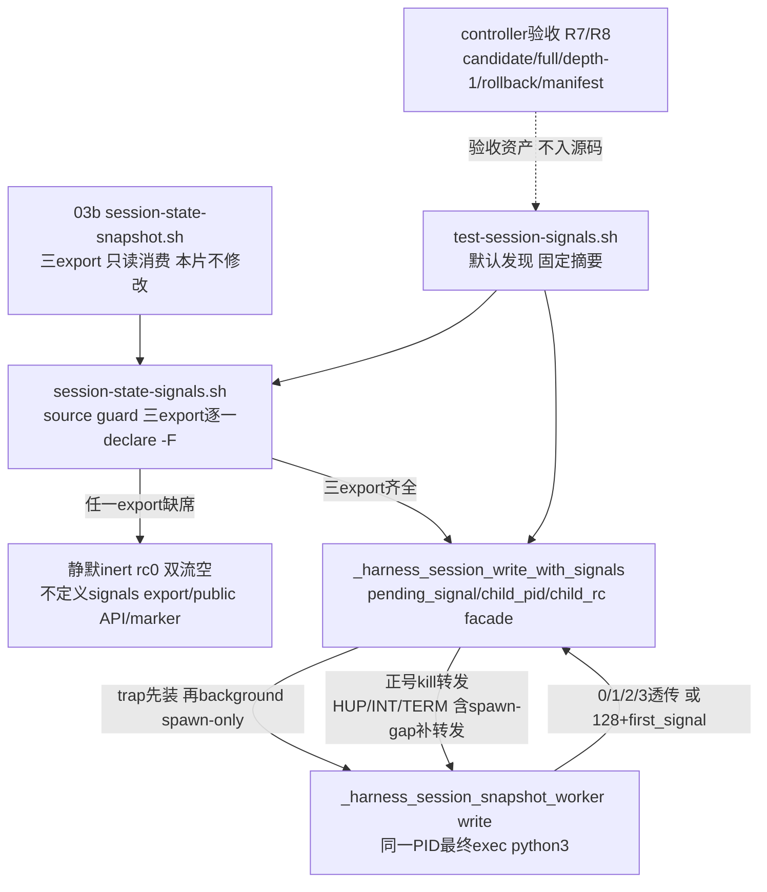

# 任务 2.5: 验证03d顺序门

> 这是你的需求。数值、签名、命令一律照抄，不要自己发挥。
> 你只做这一个任务，不要顺手做别的。不要派 subagent。

---

## 完整上下文

下面是整个 spec 的三个文件，让你了解整体需求、设计和任务分解。
**但你只执行「你的任务」那一节，不要去做别的任务。**

### Requirements

> 用户原话：“$spec review 这套 aosp harness 工程，有哪些欠缺的地方，进行重构和完善”；并确认后续按 autopilot 执行。PLAN v5.7要求03c只在已由03b/03b1验收的signal-aware snapshot worker上增加可组合的Bash信号转发facade，不复制temp/publish逻辑、不修改snapshot模块。

## 目标

只新增私有模块`common/.harness/lib/session-state-signals.sh`与默认发现测试`tests/test-session-signals.sh`：在已由03b/03b1验收的signal-aware snapshot worker上增加Bash `pending_signal/child_pid/child_rc` facade、spawn-gap补转发、facade first-signal-wins与facade/process-group HUP/INT/TERM转发，交付唯一私有接口`_harness_session_write_with_signals <project-id> <session-id> <feature>`。owned temp、publish提交点与child信号handler全部留在03b worker内，本片不复制这些逻辑、不修改snapshot模块。本片继续不设置`HARNESS_SESSION_STATE_PROVIDER_VERSION`、不发布public path/write/read/remove或任何运行时API；dependency-present active证据入ledger后才可启动03d，inert PASS不能解除该顺序门。

## 需求

R1. [计划] 当`_harness_session_snapshot_worker`、`_harness_session_snapshot_write_core`与`_harness_session_snapshot_read_core`三个export均已定义时，系统必须使source `common/.harness/lib/session-state-signals.sh`返回0、双流空，且只新增唯一私有export `_harness_session_write_with_signals`；source不得读写文件、覆写依赖、定义四个状态public API或设置`HARNESS_SESSION_STATE_PROVIDER_VERSION`。

R2. [计划] 当source的依赖检查中三个snapshot export任一缺席时，系统必须静默返回0、双流空，并保持signals export、四个状态public API与provider marker全缺席。

R3. [计划] 当常规调用`_harness_session_write_with_signals <project-id> <session-id> <feature>`时，系统必须沿用snapshot write的双流与返回协议：首次/同值返回0、OS错返回1、安全/协议错返回2、异值冲突返回3，全部双流空；facade不得复制temp/publish逻辑，不得修改snapshot模块。

R4. [计划] 在facade执行期间，系统必须只以`pending_signal/child_pid/child_rc`状态机直接background spawn-only worker取得真实child PID，spawn与trap安装之间的spawn-gap收到信号必须补转发，facade锁存首信号（first-signal-wins），并向child PID及其process-group转发HUP/INT/TERM。

R5. [计划] 如果发生facade自身或其process-group收到HUP/INT/TERM任一信号，系统必须使`_harness_session_write_with_signals`返回恰为129/130/143的首信号码，后续信号不改变已锁存码，facade不得让cleanup或wait错误遮蔽信号码。

R6. [计划] 系统必须提供默认发现且shfmt-clean的`tests/test-session-signals.sh`，只接受无参数、`all`或唯一`--dependency-absent`；dependency-present默认/all必须逐个覆盖worker/write/read三export各自缺席的inert fixture，以及facade HUP/INT/TERM、process-group HUP/INT/TERM、spawn-gap补转发与facade first-signal-wins矩阵；真实snapshot provider缺席或任一export缺席时，默认与flag运行同一inert surface并零active case；成功唯一摘要为`RESULT PASS  session write interrupts\n`，unknown/extra/flag带值rc1且不打印PASS。

R7. [计划] 当03c进入验收时，系统必须在candidate、完整历史checkout和真实`git clone --depth 1 file://...`中分别运行默认signals测试与`bash ./scripts/check.sh --offline`，自动发现本入口恰好一次，且每个checkout的当前tracked上游七文件（common/.harness/lib/session-state-foundation.sh、common/.harness/lib/session-state-path.sh、tests/lib/session-path-race-driver.py、tests/test-session-path-races.sh、common/.harness/lib/session-state-snapshot.sh、tests/test-session-snapshot.sh、tests/test-session-snapshot-assurance.sh）SHA-256在测试前后不变。controller必须先逐字验证shfmt `v3.14.0`与ShellCheck version field `0.11.0`，再只对本片exact两文件运行`shfmt -d -i 2 -ci -bn`、`shellcheck -x --severity=warning`与`bash -n`；execution BASE到accepted HEAD必须exact只新增`common/.harness/lib/session-state-signals.sh`与`tests/test-session-signals.sh`、numstat总和`<=400`，六列review manifest必须与tasks一一对应、首尾/相邻连续、reviewer非空且全PASS，`git diff --check`与worktree clean必须通过。

R8. [计划] 当验证独立回滚与顺序时，系统必须从accepted HEAD建立隔离临时分支，提交一个exact只删除signals module/test的rollback commit，在该clean checkout运行03b基础测试、03b1 assurance入口与offline并要求全绿、本入口发现0次；验收后丢弃临时checkout，不改变candidate/full/depth-1 checkout。controller只有在03c accepted HEAD、dependency-present active证据、exact2/400与全PASS manifest入ledger后，才可创建规范ID `03d-session-remove-prune`（日期前缀由创建日决定，本片不预知）的spec目录、同名`spec/`分支/worktree、ledger execution BASE或dispatch记录；此前这四类资产必须物理缺席，以nullglob下`ls -d "$PROJECT"/specs/*03d-session-remove-prune`缺席、`git show-ref | rg 'refs/heads/spec/.*03d-session-remove-prune'`零匹配、`git worktree list --porcelain | rg 03d-session-remove-prune`零匹配与`rg 03d-session-remove-prune`对ledger/dispatch/execution-base记录零匹配机械核对；任何inert PASS不得作为本片验收证据或解除该顺序门。

## 验收标准

主验证命令: bash ./tests/test-session-signals.sh
期望输出: dependency-present时退出码为`0`、stderr空，stdout逐字节精确为`RESULT PASS  session write interrupts\n`

验收清单:

- [ ] source功能fixture返回0、双流空且只新增`_harness_session_write_with_signals`一个export；worker/write/read三export逐个缺席的fixture逐字比较rc/双流、export inventory、四public API与provider marker全缺席，证明inert零副作用。
- [ ] 常规首次/同值write返回0、OS错1、安全/协议错2、异值冲突3且全部双流空，与snapshot write协议逐字一致；生产文本不含temp/publish逻辑副本，snapshot模块SHA-256在测试前后不变。
- [ ] facade HUP/INT/TERM三行各自返回恰为129/130/143、无winner、本调用owned temp清零；process-group HUP/INT/TERM三行同样核对首信号码；第二信号不改变已锁存码；spawn-gap窗口收到的信号被补转发且不丢失。
- [ ] 真实dependency-present默认/all与隔离provider-absent默认/flag均得唯一固定摘要`RESULT PASS  session write interrupts\n`，但只有dependency-present active证据计入本片验收；unknown/extra/flag带值rc1且无PASS。
- [ ] candidate/full/depth-1的默认入口与offline全PASS，offline发现本入口恰好一次，depth-1 commit-count=1且shallow marker非空；每个checkout的上游七文件SHA-256测试前后不变且clean。
- [ ] 隔离rollback commit exact只删除signals module/test后，clean checkout中03b基础测试、03b1 assurance入口与offline全PASS且本入口发现0次；03d的spec/ref/worktree/BASE/dispatch按R8机械查缺席。
- [ ] review manifest六列、任务序号、execution BASE、相邻base/head、accepted HEAD和全PASS一次机械验证通过；BASE..HEAD exact name-only为上述两文件、numstat总和`<=400`，固定版本断言后对exact两文件运行shfmt/ShellCheck/bash-n全绿，`git diff --check`和clean通过；只有dependency-present active证据入ledger后才可创建03d。

不变量（不许劣化，2-4项）:

- 已发布安全winner被facade/group信号矩阵改变的次数 ≤ `0`，验证: 每case前后比较winner dev/inode/uid/mode/nlink/size/hash指纹。
- 任一信号分支返回后本调用未发布owned temp残留数 ≤ `0`，验证: 每case前后在临时session根下find `.snapshot-*`计数。
- facade/group HUP/INT/TERM返回非首信号码或第二信号改码的次数 ≤ `0`，验证: 信号矩阵逐case核对锁存rc与`child_rc`恰为129/130/143。
- 上游七tracked文件在execution BASE..HEAD的变更数 ≤ `0`，验证: `git diff --name-only "$BASE" "$HEAD" -- common/.harness/lib/session-state-foundation.sh common/.harness/lib/session-state-path.sh tests/lib/session-path-race-driver.py tests/test-session-path-races.sh common/.harness/lib/session-state-snapshot.sh tests/test-session-snapshot.sh tests/test-session-snapshot-assurance.sh`。

## 超出范围

- 不修改03b snapshot provider、03b1 assurance入口及03/03a/03a1/03a2任何模块或测试；不设置`HARNESS_SESSION_STATE_PROVIDER_VERSION`，不发布public path/write/read/remove或任何运行时API。
- 不复制snapshot worker的owned-temp/publish逻辑或Python child信号处理；facade只组合已由03b/03b1验收的signal-aware spawn-only worker，read路径不新增信号契约。
- 不实现remove/prune/final aggregator/coverage fragment（属03d）；03d的全部资产（spec目录、`spec/`分支、worktree、ledger execution BASE、dispatch记录）在本片dependency-present active证据入ledger前继续物理缺席。
- inert PASS不替代dependency-present证据；不调用设备、网络、AOSP build、Claude/Codex客户端，不push、不清理已有spec/prototype/implementation分支或worktree。

### Design

# 2026-09-03-03c-session-write-interrupts 设计

## 概述

只新增 source-inert 的私有模块 `common/.harness/lib/session-state-signals.sh` 与默认发现、shfmt-clean 的 `tests/test-session-signals.sh`：在已由 03b/03b1 验收的 signal-aware spawn-only worker 上组合一个 Bash `pending_signal/child_pid/child_rc` 信号转发 facade，交付唯一私有 export `_harness_session_write_with_signals <project-id> <session-id> <feature>`，常规 0/1/2/3 透传、HUP/INT/TERM 恰为 129/130/143；owned temp、publish 提交点与 child 信号 handler 全部留在 03b worker 内，本片不复制、不修改 snapshot 模块。

- 选择“facade 只用 bash 内建 `kill` 向 child 的单一正 PID 转发，child 不放入独立 pgroup”，因为 worker 是 spawn-only 单进程结构（background 后最终 `exec python3`、PID 稳定、Python 侧不 fork 也无孙进程），“child PID 及其 process-group 中由本调用产生的部分”恰好等于这一个 PID，正号转发即完整覆盖 R4 的转发义务，且转发目标永远不含 facade 自身（facade 与调用方同组，正 PID 不可能打回自身）；放弃 `setsid` 把 child 移入独立 pgroup（仓库 grep 零先例、引入新的运行时外部依赖、spawn-only 单进程下零收益）与负 PID 组转发（非 job-control shell 中 child 与 facade、测试 driver/controller 同一 process group，`kill -SIG -- -pgid` 会同时命中 facade 自身——trap 重入或在 wait/rc 映射前被杀——以及父 shell，违反双流纪律并可能杀死调用方）。
- 选择“trap 先于 spawn 安装、spawn 后立即补转发，并在 facade 自有模块内放两个 exact-once 无副作用 anchor（`HARNESS_TEST_MARKER_SIGNALS_BEFORE_SPAWN`/`HARNESS_TEST_MARKER_SIGNALS_AFTER_WAIT`）”，因为 spawn-gap（trap 已装、`child_pid` 未赋值）收到的信号只能先锁存 `pending_signal`、spawn 后补转发才不会丢；测试在自有模块的 mktemp 副本上于 anchor 处同步注入 `kill`，把 spawn-gap 与“child 已 reap 后”两个窗口锁死为确定性用例；放弃修改 03b worker 增加钩子（R3 与超出范围明文禁止）和裸竞态时序测试（不可机械验收）。
- 选择“source 守卫逐一 `declare -F` 验证 `_harness_session_snapshot_worker`/`_harness_session_snapshot_write_core`/`_harness_session_snapshot_read_core` 三个 export，任一缺席则静默 inert”，与 03b 的 inert 语义同构、与 R1/R2 明文一致；放弃只验 worker 一个 export（违反 R1，且 03d 的 aggregator 顺序链以三 export 齐备为前提）。

## 需求映射

| 组件 | 实现的需求 |
|---|---|
| signals source guard 与 inert 契约 | R1, R2 |
| signals facade（状态机/补转发/锁存/转发） | R3, R4, R5 |
| 默认发现测试 `tests/test-session-signals.sh` | R6 |
| controller 验收（candidate/full/depth-1/offline/manifest/exact2） | R7 |
| controller 独立回滚与 03d 顺序门 | R8 |

## 架构



运行时零新增依赖：facade 只用 bash 内建 `trap`/`kill`（正 PID）/`wait`/`declare`，不调用任何外部命令，不读写文件，不复制 temp/publish 逻辑。process-group 语义界定为两条确定性路径的合取：信号组投递（终端 Ctrl-C、supervisor `kill -- -pgid`）时内核把信号直送同组的 child，facade trap 再补一次正号转发——child 的 Python handler 与 facade 锁存都是 first-signal-wins 幂等，重复投递无害；信号只打 facade 单 PID 时由 trap 转发到 child。facade 永远不使用负 PID，因此转发在任何 shell 模式下都不可能命中自身组。`setsid` 只允许出现在测试侧：group 行需要把 facade-under-test 隔离到自己的 session/pgroup 才能安全地 `kill -- -pgid`，当前环境实测 util-linux `setsid` 2.39.3 可用且离线；`set -m` 方案实测会向 stderr 泄漏 `[1]+ Terminated` job 通知（破坏双流空 oracle）并改变 worker 的 pgroup 语义，放弃。生产模块沿用 03b 锚点纪律：facade 的两个 anchor 是 exact-once 无副作用 `: #` 行，生产不读取任何测试环境变量，注入只发生在测试的 mktemp 副本上。

## 组件与接口

### signals source guard 与 inert 契约

- 职责：source 时逐一 `declare -F` 验证三个 snapshot export；任一缺席则整段 guard 不成立，source 静默返回 0、双流空，不定义 signals export、四个状态 public API（`harness_session_path`/`harness_session_write`/`harness_session_read`/`harness_session_remove`）与 `HARNESS_SESSION_STATE_PROVIDER_VERSION`，不读写文件、不覆写依赖。
- 对外接口：无（guard 是模块顶层结构，非函数）；inert 时 export inventory 与 source 前逐字一致。
- 依赖：03b 模块已 source 后的函数表；缺席场景下零依赖。

### signals facade（状态机/补转发/锁存/转发）

- 职责：以 `pending_signal/child_pid/child_rc` 三 local 状态机 background spawn-only worker，先装 trap 再 spawn，spawn-gap 补转发，first-signal-wins 锁存，wait 被 trap 中断时重 wait 至 reap，最终把首信号映射为恰 129/130/143，常规 rc 0/1/2/3 透传且全程双流空。
- 对外接口（产出，与 frontmatter 逐字一致）：`session-signals-facade-v1 —— 唯一私有export _harness_session_write_with_signals <project-id> <session-id> <feature>（常规沿用snapshot write的0|1|2|3，HUP/INT/TERM返回129|130|143）plus tests/test-session-signals.sh默认发现测试固定摘要`RESULT PASS  session write interrupts`；无public API/provider marker`
- 精确调用：`_harness_session_write_with_signals <project-id> <session-id> <feature>`；arity/feature 校验完全委托 worker（非法输入由 worker 在 capture 前返回 2、双流空）。
- 内部结构（唯一 export，不新增辅助函数）：三条 inline trap 各自 `[[ -n $pending_signal ]] || { pending_signal=<SIG>; [[ -n $child_pid ]] && kill -<SIG> "$child_pid" 2>/dev/null; }`；`: # HARNESS_TEST_MARKER_SIGNALS_BEFORE_SPAWN` 位于 trap 安装与 spawn 之间、`: # HARNESS_TEST_MARKER_SIGNALS_AFTER_WAIT` 位于 wait 循环与 trap 摘除之间；wait 循环 `wait "$child_pid"` 后若 rc>128 且 `kill -0 "$child_pid"` 成立则重 wait，否则取为 `child_rc`；摘除 trap 后 `pending_signal` 非空按 HUP/INT/TERM 返回 129/130/143，否则 `return "$child_rc"`。
- 依赖：`_harness_session_snapshot_worker` 的 spawn-only 语义（最终 exec python3、PID 稳定、worker write 双流空、首信号锁存 128+first_signal、owned temp 自清）。

### 消费契约（03b snapshot core，本片只读）

- 职责：提供 spawn-only worker、signal-aware write/read core 私有协议与 03b1 验收门；本片只组合、不修改。
- 消费接口（与 frontmatter 逐字一致）：`session-snapshot-core-v2的spawn-only _harness_session_snapshot_worker write|read ...与signal-aware _harness_session_snapshot_write_core/_harness_session_snapshot_read_core私有协议（worker write双流空0|1|2|3|129|130|143，worker read成功feature+LF/0、失败双流空1|2|3，最终exec Python且PID稳定）；session-snapshot-assurance-v1的03b1 accepted ledger中dependency-present完整矩阵checks=241与全PASS门（无运行时API）`
- 精确调用：facade 只 background 调用 `_harness_session_snapshot_worker write <project-id> <session-id> <feature>`（不经 write_core——core 外包一层 subshell 会造成 PID 错位）；write_core/read_core 只作为 source guard 的存在性检查对象。
- 依赖：03b 与 03b1 accepted ledger；本片不设置 `HARNESS_SESSION_STATE_PROVIDER_VERSION`，read 路径不新增信号契约。

### 默认发现测试

- 职责：实现 `bash ./tests/test-session-signals.sh` 的 CLI 分流、inert 三 fixture、常规透传行、facade/group/spawn-gap 信号矩阵与固定摘要。
- 对外接口：无参数或 `all` 运行 active/inert 自动分流，唯一 `--dependency-absent` 强制 inert；成功 stdout 逐字 `RESULT PASS  session write interrupts\n`、stderr 空、rc0；unknown 参数、extra 参数、flag 带值均 rc1 且不打印 PASS。
- 依赖：生产 signals 模块、03b 模块、既有 foundation/path、固定 shfmt `v3.14.0`/ShellCheck `0.11.0`，以及 `bash/python3/rg/find/stat/sha256sum/ps/kill/mktemp/git` 与测试侧 `setsid`。

### controller 验收与 03d 顺序门（验收资产，不进入源码文件）

- 职责：执行 R7/R8 的机器核对，全部证据入 ledger 后才允许创建 03d 的任何资产。
- 验收动作：candidate、完整历史 checkout、真实 `git clone --depth 1 file://...` 分别运行默认 signals 测试与 `bash ./scripts/check.sh --offline`，offline 发现本入口恰好一次，depth-1 commit-count=1 且 shallow marker 非空；每个 checkout 的上游七 tracked 文件（`common/.harness/lib/session-state-foundation.sh`、`common/.harness/lib/session-state-path.sh`、`tests/lib/session-path-race-driver.py`、`tests/test-session-path-races.sh`、`common/.harness/lib/session-state-snapshot.sh`、`tests/test-session-snapshot.sh`、`tests/test-session-snapshot-assurance.sh`）SHA-256 测试前后不变且 clean；逐字验证 shfmt `v3.14.0` 与 ShellCheck version field `0.11.0` 后只对本片 exact 两文件运行 `shfmt -d -i 2 -ci -bn`、`shellcheck -x --severity=warning`、`bash -n`；execution BASE 到 accepted HEAD exact 只新增 `common/.harness/lib/session-state-signals.sh` 与 `tests/test-session-signals.sh`、numstat 总和 ≤400、六列 review manifest 与 tasks 一一对应、首尾/相邻连续、reviewer 非空且全 PASS、`git diff --check` 与 worktree clean 通过；从 accepted HEAD 建隔离临时分支提交 exact 只删除本片两文件的 rollback commit，clean checkout 中 03b 基础测试、03b1 assurance 入口与 offline 全绿、本入口发现 0 次；03d 的 spec 目录/分支/worktree/ledger BASE 或 dispatch 记录按 R8 以 `ls -d` 缺席、`git show-ref` 零匹配、`git worktree list --porcelain` 零匹配与 `rg` 零匹配机械查缺席。
- 依赖：本片 accepted HEAD、dependency-present active 证据、exact2/400 与全 PASS manifest 入 ledger；inert PASS 不作为本片验收证据，也不解除该顺序门。

## 数据模型

不适用：本片不新增持久化状态、schema 或跨进程数据库；winner/temp/managed 的数据模型与安全属性全部沿用 03b，facade 不触碰文件系统。facade 内部只有单次调用生命周期内的内存状态机（bash local，return 即销毁）：

| 变量 | 初始 | 转换 | 读取点 |
|---|---|---|---|
| `pending_signal` | 空 | 首个 trap 一次性写入 `HUP`/`INT`/`TERM`（first-signal-wins，此后 trap 只返回不改值） | spawn 后补转发判定；最终 rc 映射（HUP→129、INT→130、TERM→143） |
| `child_pid` | 空 | spawn 行后写入 `$!`，此后不变 | trap 转发目标；wait/kill -0 对象 |
| `child_rc` | 空 | wait 真正 reap 后写入真实退出码；被 trap 中断的 wait（rc>128 且 child 仍存活）不写入，重 wait | `pending_signal` 为空时原样 `return` |

转换不变量：`pending_signal` 单调（空→一个值，不再变）；信号码优先于 `child_rc` 与任何 cleanup/wait 异常；三变量不跨调用留存。

## 数据流

### 常规透传与 trap 安装/摘除时序

```mermaid
sequenceDiagram
  participant C as 调用方
  participant F as signals facade
  participant W as spawn-only worker(同一PID)
  C->>F: _harness_session_write_with_signals p s f
  F->>F: local三状态置空; 安装HUP/INT/TERM trap
  F->>F: BEFORE_SPAWN anchor(生产为无副作用:)
  F->>W: background spawn; child_pid=$!
  F->>F: pending_signal非空则立即补转发(spawn-gap)
  F->>W: wait循环; trap中断且kill -0存活则重wait
  W-->>F: 真实退出码 0/1/2/3 或128+first_signal
  F->>F: AFTER_WAIT anchor; 摘除trap
  alt pending_signal为空
    F-->>C: child_rc透传; 双流空
  else 已锁存首信号
    F-->>C: 恰为129/130/143; 双流空
  end
```

### 运行中信号与 process-group 投递

```mermaid
sequenceDiagram
  participant T as 信号源(终端/supervisor/测试driver)
  participant F as facade trap
  participant W as Python child(与facade同组)
  T->>F: 首信号 HUP/INT/TERM(只打facade单PID)
  F->>F: first-signal-wins锁存pending_signal
  F->>W: kill -SIG "$child_pid"(正号单PID 永不含自身)
  W->>W: handler一次性锁存first_signal并ignore三种; finally清owned temp
  T->>F: 第二信号(不同种)
  F->>F: 锁存非空只返回; 不改码 不再转发
  W-->>F: 128+first_signal
  F-->>T: 恰为129/130/143; 无winner; owned temp清零
  Note over T,W: group投递时内核同组直送child; facade补转发幂等无害; facade从不负PID转发
```

### spawn-gap 补转发与已退出后窗口（probe 副本确定性注入）

```mermaid
sequenceDiagram
  participant T as 测试driver
  participant F as facade(probe副本)
  participant W as worker child
  T->>F: BEFORE_SPAWN注入点同步kill -SIG facade(窗口锁死)
  F->>F: trap锁存pending_signal; child_pid仍空 不转发
  F->>W: spawn; child_pid=$!
  F->>W: pending非空 立即补转发
  W->>W: 补转发送达则终止; 落入pre-exec窗口被吞则barrier出现后由driver放行(执行期修订: 异步subshell SIG_IGN可吞SIGINT, hang不作oracle)
  W-->>F: 128+首信号 或 正常0(被吞时)
  F-->>T: 恰为129/130/143; winner随child结局(absent或beta); temp=0
  T->>F: 另一行 AFTER_WAIT注入点kill(child已reap)
  F->>F: 锁存; 转发目标不存在 kill静默失败
  F-->>T: 恰为129/130/143; wait/cleanup不遮蔽信号码
```

## 错误处理

| 错误场景 | 恢复策略 | 校验位置 | 日志 | 用户可见 |
|---|---|---|---|---|
| source 时三 export 任一缺席 | 静默 inert，不定义 signals/public surface/marker | source guard | 无 | source rc0、双流空 |
| CLI unknown/extra/flag 带值 | 拒绝且不进入任何分支 | 测试入口参数解析 | 无 | rc1、无 PASS |
| 真实 provider 缺席或 `--dependency-absent` | 三种调用走同一零 active case inert surface | 测试入口依赖探测 | 无 | 固定摘要、rc0 |
| write arity/feature 非法 | 完全委托 worker 在 capture 前拒绝，零 state 副作用 | worker guard/validator 透传 | 无 | 双流空、rc2 |
| 常规首次/同值/OS错/安全错/异值 | worker 协议原样透传，facade 不加码不改流 | 常规透传行 rc/双流核对 | 无 | 双流空、0/1/2/3 |
| spawn-gap 收到信号 | 锁存后 spawn 立即补转发 | spawn-gap 行 rc/temp 核对 + 补转发前向观测日志（facade probe 副本包装补转发语句落日志，mutant 删行则日志缺席即 FAIL；执行期修订：child pre-exec 窗口可吞信号，接收为尽力而为，winner 断言为 absent/beta 析取，不靠 hang 判 mutant） | 无 | 恰 129/130/143 |
| 运行中收到信号 | 锁存并向 child 正 PID 转发；child handler 自清 owned temp | facade 三行与 group 三行 rc/指纹/temp 核对 | 无 | 双流空、恰 129/130/143 |
| 第二信号 | facade 锁存非空只返回不改码；child ignore 期重入只返回 | 每信号行附带第二信号核对锁存 rc | 无 | 仍为首信号码 |
| child 已 reap 后收到信号 | 锁存；`kill` 目标不存在静默失败；信号码不被 wait/cleanup 遮蔽 | AFTER_WAIT 注入行 rc 核对 | 无 | 恰 129/130/143 |
| wait 被 trap 中断（rc>128 但 child 未 reap） | `kill -0` 存活判定为真则重 wait，真实 `child_rc` 不被中断值遮蔽 | wait 循环；信号矩阵 rc 核对 | 无 | 不受影响 |
| group 投递（内核同组直送 child） | child 与 facade 双侧幂等锁存，补转发重复无害 | group 三行（setsid 隔离 pgroup） | 无 | 恰 129/130/143 |
| 外部只打 child 单 PID（facade 未收信号） | `pending_signal` 为空，`child_rc` 即 128+信号码原样透传 | 透传语义（worker 协议） | 无 | 恰 129/130/143 |
| 任一 case 失败 | 累计 failures，末行不打印 PASS | 统一 check/failures 计数器 | 失败详情到 stderr | rc1、无 PASS |

## 测试策略

| 层 | 测什么 | 用什么工具 |
|---|---|---|
| 单元/结构 | CLI 四态（无参数/all 接受，unknown/extra/flag 带值 rc1 无 PASS）；三 export 各自缺席的 inert fixture 逐字比较 rc/双流/export inventory/四 public API/marker 全缺席；齐全 fixture 恰好新增唯一 export；facade 双 anchor 各 exact-once；生产文本无 `renameat2`/`.snapshot-` 等 temp/publish 逻辑副本；测试前后 snapshot 模块 SHA-256 不变 | `bash` 隔离 shell、`declare`、`export -p`、`rg`、`sha256sum`、`mktemp` |
| 集成（信号矩阵，本片主体） | 常规 0/1/2/3 透传行（双流空）；facade HUP/INT/TERM × 到达窗口：运行中（snapshot probe 副本 barrier 持有 owned temp、`ps -o comm=` 证实该 PID 为 python3 后送信号，照 03b 先例）、spawn-gap（facade probe 副本 BEFORE_SPAWN 同步注入）、已退出后（AFTER_WAIT 同步注入），每行附第二不同信号核对锁存；process-group HUP/INT/TERM 三行（`setsid --wait` 隔离 pgroup，inner 写 PID 文件，`kill -SIG -- -pgid`）；每行核对恰 129/130/143、owned temp=0、winner 指纹不变；facade/wait/group 行核无 winner，spawn-gap 行 winner 为 absent/beta 析取（执行期修订：pre-exec 窗口可吞补转发，child 结局 don't-care，oracle 为前向观测日志） | `bash ./tests/test-session-signals.sh`（主验证命令）、python3 注入、`ps/kill/find/stat/sha256sum`、测试侧 `setsid` |
| inert | 真实 snapshot provider 缺席与 `--dependency-absent` 均走同一零 active case surface、同一固定摘要逐字 rc0；inert 摘要不计入本片验收证据 | 同上入口 + `--dependency-absent`、隔离 fixture shell |
| 端到端/收敛（controller 验收资产） | candidate、完整历史 checkout、真实 `git clone --depth 1 file://...` 分别跑默认入口与 `bash ./scripts/check.sh --offline`，offline 发现本入口恰好一次，depth-1 commit-count=1 且 shallow marker 非空；上游七 tracked 文件 SHA-256 测试前后不变且 clean；隔离 rollback commit exact 只删本片两文件后 03b 基础测试、03b1 assurance 入口与 offline 全绿、本入口发现 0 次；03d 四类资产机械查缺席 | `git clone --depth 1 file://...`、`git worktree/status/diff/show-ref`、`bash ./scripts/check.sh --offline`、`rg`、`ls -d` |
| 静态与 sizing | 固定版本断言后只对 exact 两文件 `shfmt -d -i 2 -ci -bn`、`shellcheck -x --severity=warning`、`bash -n`；execution BASE..HEAD exact 只新增本片两文件、numstat 总和 ≤400；六列 manifest 机械验证；`git diff --check` 与 clean 通过 | shfmt `v3.14.0`、ShellCheck `0.11.0`、`bash -n`、Git/awk controller 命令 |
| 性能 | 不适用：本片不设吞吐/延迟 SLO；barrier 用短轮询等待，`timeout` 仅作测试防挂死兜底（执行期修订：spawn-gap 行的 mutant 判定靠前向观测日志缺席，不靠挂起），不冒充 benchmark | `timeout` |

sizing 承诺：execution diff exact2 且 `git diff --numstat` 总和 ≤400。行数预算分解：`common/.harness/lib/session-state-signals.sh` ≤45 行（shebang 与三 export 守卫 ~6、facade locals 与三条 inline trap ~5、spawn/补转发/双 anchor ~6、wait 循环 ~7、trap 摘除与 129/130/143 映射 ~8、结构注释 ~13）；`tests/test-session-signals.sh` ≤345 行（CLI 与 repo/tmp 引导 ~18、inert 三 fixture 加齐全 fixture ~28、依赖探测与 inert 摘要 ~6、双 probe 副本注入 ~30（复用 03b barrier/caught 替换文本，另加 facade 双 anchor 注入）、helper ~36、常规透传行 ~14、三模式信号 runner ~60、矩阵调用 ~20、第二信号核对 ~8、CLI 自调用 ~10、SHA-256 与结构核对 ~10、摘要与计数 ~6、结构注释 ~99）；合计 ≤390，保留 ≥10 行余量。stdout/stderr 一律落文件后按字节比较，禁止用吞尾随 LF 的 command substitution 验证成功流。facade 本体极小（无外部命令、无分支矩阵），不需要 runnable prototype 作为 sizing 依据；预算按上述分解机械核对。

## 文件清单

| 文件 | 创建/修改 | 职责（一句话） |
|---|---|---|
| `common/.harness/lib/session-state-signals.sh` | 创建 | source-inert 的信号转发 facade：三 export 守卫、`pending_signal/child_pid/child_rc` 状态机、spawn-gap 补转发与 first-signal-wins 锁存的唯一私有 export |
| `tests/test-session-signals.sh` | 创建 | 默认发现的 shfmt-clean 入口：CLI/inert 分流、三 export 缺席 fixture、常规透传与 facade/group/spawn-gap 信号矩阵及固定摘要 |

验收资产（不纳入源码文件清单）：红阶段证据（facade 无补转发 mutant 与锁存被第二信号覆盖 mutant 的 rc1/无 PASS 自反证记录）、逐 task review 报告、六列 review manifest、candidate/full/depth-1/rollback 运行日志、accepted HEAD 与 ledger execution BASE 证据。门③通过前不创建 implementation worktree 或固定 execution BASE；dependency-present active 证据、exact2/400 与全 PASS manifest 入 ledger 前不创建 03d 的 spec 目录/分支/worktree/BASE/dispatch 记录。

### 所有任务

# 2026-09-03-03c-session-write-interrupts 实现计划

03b 三轮 tasks review 证明逐函数拼装中间代码会制造假红；本片两个交付文件均为新写完整文件，无 prototype blob——design sizing 节明确 facade 本体极小（无外部命令、无分支矩阵），不需要 runnable prototype 作为 sizing 依据，候选文件以 design「组件与接口」节为唯一权威结构。熔断裁定：任务 1.1 一次性交付完整 signals 模块（≤45 行小文件，单任务落地）、任务 1.2 一次性交付完整测试文件（≤345 行，含红阶段 mutant 自反证），禁止逐段拼装；随后 candidate/full/depth-1/rollback/order/terminal 六个零 delta controller 验证任务；共八个任务严格串行。实现提交使用普通 Conventional Commit。每个任务均保存 red 记录、green 报告和 evidence package，交全新独立 agent review；Blocking/Important 修复后必须由另一全新 agent re-review。

固定变量与工具门：

```bash
PROJECT=.spec/2026-08-31-aosp-harness-refactor
SPEC=$PROJECT/specs/2026-09-03-03c-session-write-interrupts
WORK=$PROJECT/work/2026-09-03-03c-session-write-interrupts
TASKS=$SPEC/tasks.md
LEDGER=$SPEC/ledger.md
MANIFEST=$WORK/review-manifest.tsv
TOOLS=/tmp/claude-1000/-home-zzh0838-CareerDevelop-AI2D-aosp-harness-demo/bdc6e669-9154-4030-a9db-78dc599ab491/scratchpad/tools/bin
UPSTREAM7="common/.harness/lib/session-state-foundation.sh common/.harness/lib/session-state-path.sh tests/lib/session-path-race-driver.py tests/test-session-path-races.sh common/.harness/lib/session-state-snapshot.sh tests/test-session-snapshot.sh tests/test-session-snapshot-assurance.sh"
test "$("$TOOLS/shfmt" --version)" = "v3.14.0"
"$TOOLS/shellcheck" --version | rg -q '^version: 0.11.0$'
```

controller 在门④通过后固定 `IMPLEMENTATION_WORKTREE` 与 `TASK_BASE`（execution BASE，即任务 1.1 提交前的 clean HEAD），并令 `BASE_SHA=$TASK_BASE`；任务 1.2 开始时重取 `TASK_BASE=$(git rev-parse HEAD)` 为任务 1.1 的 `TASK_HEAD`，保证 manifest 相邻连续。

red记录固定六行：`task=`、`command=`、`expected=`、`rc=`、`stdout_sha256=`、`stderr_sha256=`，末加`assertion=`；green报告固定含task/base/head/files/commands/results。evidence package为TSV三列`path<TAB>sha256<TAB>bytes`，列出brief、report和全部日志；reviewer拿这三个路径，而不是依赖base=head的空diff。

manifest固定六列`seq<TAB>task-id<TAB>base<TAB>head<TAB>reviewer<TAB>PASS`。每个任务独立review PASS后先追加本行，再分别执行：

```bash
python3 /home/zzh0838/.agents/skills/spec/scripts/mark-task-done.py "$TASKS" TASK_ID
# controller用apply_patch向ledger增加：- 任务 TASK_ID: 完成 commits=[TASK_HEAD]
python3 /home/zzh0838/.agents/skills/spec/scripts/sync-ledger.py "$LEDGER" --repo "$IMPLEMENTATION_WORKTREE"
```

裁定（定死，依据随条给出）：

1. 落地策略：任务 1.1/1.2 各以单任务一次性交付完整候选文件，禁止逐段拼装。依据：03b 教训——拼装中间代码制造未定义引用、截断 builder 与假红；本片无 prototype blob，design 明确 facade 本体极小不需 runnable prototype 作 sizing 依据，两个候选文件以 design「组件与接口」节为唯一权威结构。sizing 预算：模块 ≤45 行、测试 ≤345 行，合计 ≤390，对 exact2/400 门保留 ≥10 行余量。
2. 探针字面量前提：测试文件中 `printf 'RESULT PASS  session write interrupts\n'` 调用字面量恰 2 处——依赖缺席 inert 出口（第 1 处）与 active 出口（末行，第 2 处）。dependency-present 实跑用 rindex 定位末处、在其前插入 `printf 'checks=%d\n' "$checks" >&2` 探针；inert 实跑用 index 定位首处、插入 `printf 'checks=%d\n' "${checks:-0}" >&2` 探针——inert 流程在计数器初始化前即 `exit 0`，末行探针不可达、提前引用 `"$checks"` 会 unbound 崩溃（03b1 步骤 5 同款约束）。结构注释只写摘要文字，不得逐字包含该 printf 调用字面量，否则 rindex/index 定位失效（03b1 M1 教训）。
3. mutant 设计：任务 1.2 红阶段含两个 mutant 自反证。(a) spawn-gap 无补转发 mutant：在 mktemp 副本上删除 spawn 后补转发行；该 mutant 不靠 rc 区分——worker 收不到补转发会被 barrier 封闭为 hang，由 `timeout` 判 FAIL、rc1 无 PASS。（执行期修订：review round1 F1 实证补转发可落入 child pre-exec 窗口被吞（SIGINT 遇异步 subshell SIG_IGN），hang 与 mutant 不可区分构成假红；oracle 改为 facade probe 副本包装补转发语句落前向观测日志、mutant 删行则日志缺席确定性判 FAIL，driver 轮询放行存活 child，timeout 降为纯兜底，详见 design.md 四处执行期修订与 task-1.2-review-round-{1,2}.md。）(b) 锁存被第二信号覆盖 mutant：trap 体去掉 `[[ -n $pending_signal ]] ||` 守卫；由信号矩阵每行附带的第二信号核对判 FAIL、rc1 无 PASS。两 mutant 均经 `SIGNALS_MODULE` 环境变量覆盖注入（照 03b `SNAPSHOT_CORE` 先例），不改动已提交模块。
4. `setsid` 仅测试侧：生产模块零外部命令、零文件读写、只用 bash 内建 `trap`/`kill`（正 PID）/`wait`/`declare`，永不含 `setsid` 与负 PID 组转发；process-group 三行用 `setsid --wait` 隔离 pgroup 只出现在测试文件。依据：design 概述决策——spawn-only 单进程下正 PID 即完整覆盖 R4 转发义务，负 PID 会命中 facade 自身组。
5. 终交付锚点 `session-signals-facade-v1` 记入本文、ledger 完成锚点与 acceptance 报告；任务 2.6 的「产出」字段写 `tests/test-session-signals.sh`。依据：check-tasks 的孤儿产出检查只认 requirements 验收标准节正文，该路径在「主验证命令」行逐字出现，而锚点名只出现在 requirements frontmatter（03b1 裁定 5 同款）。
6. `03d-session-remove-prune` 字面全名的硬禁令只覆盖 scoped rg 实际搜索的文件——`$PROJECT/specs/*/ledger.md`、`$PROJECT/work/*/dispatch.tsv`、`$PROJECT/work/*/execution-base.env`；这些文件只写「03d 顺序门」字样，本片自身 ledger 若含该字面全名，任务 2.6 终门重跑顺序门会自命中制造假红。green/red 报告与运行日志不在 rg 域内、不受硬禁令约束，但任务 2.5 的报告与日志中命令一律以步骤 2 已定义的 `"$NEXT"` 间接形式记录、不内联字面全名，以降低误写扩散风险。
7. inert PASS 不作为本片验收证据，也不解除 03d 顺序门；只有 dependency-present active 证据、exact2/400 与全 PASS manifest 入 ledger 后才可创建 03d 的 spec 目录/分支/worktree/ledger BASE/dispatch 记录（R8）。

### 任务 1.1: 一次性交付完整signals facade模块

文件: 创建 `common/.harness/lib/session-state-signals.sh`
验收资产（不纳入源码文件清单）: 创建 `.spec/2026-08-31-aosp-harness-refactor/work/2026-09-03-03c-session-write-interrupts/evidence/task-1.1-red.txt` / 创建 `.spec/2026-08-31-aosp-harness-refactor/work/2026-09-03-03c-session-write-interrupts/task-1.1-report.md` / 创建 `.spec/2026-08-31-aosp-harness-refactor/work/2026-09-03-03c-session-write-interrupts/review-manifest.tsv`
消费: 无
产出: session-signals-facade-runtime-v1
需求: R1, R2, R3, R4, R5
必需: 是
状态: 完成

候选文件权威结构（design「组件与接口」节，唯一 export、不新增辅助函数）：source 守卫逐一 `declare -F` 验证 `_harness_session_snapshot_worker`/`_harness_session_snapshot_write_core`/`_harness_session_snapshot_read_core`，任一缺席则静默返回 0、双流空，不定义 signals export、四个状态 public API 与 `HARNESS_SESSION_STATE_PROVIDER_VERSION`；齐全则定义 `_harness_session_write_with_signals <project-id> <session-id> <feature>`——`pending_signal/child_pid/child_rc` 三 local 状态机，三条 inline trap 各自 `[[ -n $pending_signal ]] || { pending_signal=<SIG>; [[ -n $child_pid ]] && kill -<SIG> "$child_pid" 2>/dev/null; }`，`: # HARNESS_TEST_MARKER_SIGNALS_BEFORE_SPAWN` 位于 trap 安装与 spawn 之间，background spawn-only `_harness_session_snapshot_worker write`（不经 write_core）后 `child_pid=$!` 并立即补转发 spawn-gap 锁存信号，wait 循环 `wait "$child_pid"` 后 rc>128 且 `kill -0 "$child_pid"` 成立则重 wait，`: # HARNESS_TEST_MARKER_SIGNALS_AFTER_WAIT` 位于 wait 循环与 trap 摘除之间，摘除 trap 后 `pending_signal` 非空按 HUP/INT/TERM 恰返回 129/130/143，否则 `return "$child_rc"` 透传 0/1/2/3；全程双流空、零外部命令、零文件读写、正 PID 单点转发。worker 组合的正确性（R3–R5 行为矩阵）由任务 1.2 封闭，本任务只做 source 契约与静态门，避免在无矩阵覆盖下制造假绿。

- [ ] 步骤 1: 运行`test ! -e common/.harness/lib/session-state-signals.sh && bash -c 'source common/.harness/lib/session-state-signals.sh'`，确认红阶段失败为文件缺席 rc1、stdout 无 PASS；按固定六行 schema 写`$WORK/evidence/task-1.1-red.txt`并核`test -s "$WORK/evidence/task-1.1-red.txt"`。
- [ ] 步骤 2: 核`git rev-parse HEAD`逐字等于门④固定的 execution BASE 并设`TASK_BASE=$(git rev-parse HEAD)`；用 apply_patch 一次性创建`common/.harness/lib/session-state-signals.sh`完整候选（禁止逐段拼装），核`test "$(wc -l <common/.harness/lib/session-state-signals.sh)" -le 45`、`test "$(rg -c ': # HARNESS_TEST_MARKER_SIGNALS_BEFORE_SPAWN' common/.harness/lib/session-state-signals.sh)" = 1"`、`test "$(rg -c ': # HARNESS_TEST_MARKER_SIGNALS_AFTER_WAIT' common/.harness/lib/session-state-signals.sh)" = 1"`、`test "$(rg -c '^[a-z_0-9]+\(\)' common/.harness/lib/session-state-signals.sh)" = 1"`（唯一函数定义）、`! rg -q 'setsid' common/.harness/lib/session-state-signals.sh`、`! rg -q -- '-- -' common/.harness/lib/session-state-signals.sh`（无负 PID 组转发）。
- [ ] 步骤 3: 逐字核固定工具版本`test "$("$TOOLS/shfmt" --version)" = "v3.14.0"`与`"$TOOLS/shellcheck" --version | rg -q '^version: 0.11.0$'`；对该单文件跑`"$TOOLS/shfmt" -d -i 2 -ci -bn common/.harness/lib/session-state-signals.sh`（无输出）、`"$TOOLS/shellcheck" -x --severity=warning common/.harness/lib/session-state-signals.sh`（rc0）、`bash -n common/.harness/lib/session-state-signals.sh`与`git diff --check`，全部通过。
- [ ] 步骤 4: source 契约实跑——依赖齐全态运行`bash -c 'source common/.harness/lib/session-state-foundation.sh && source common/.harness/lib/session-state-path.sh && source common/.harness/lib/session-state-snapshot.sh && source common/.harness/lib/session-state-signals.sh' >out 2>err`核 rc0、`test ! -s out`、`test ! -s err`；export inventory 核`declare -F _harness_session_write_with_signals`在场、`harness_session_path`/`harness_session_write`/`harness_session_read`/`harness_session_remove`逐个缺席、`declare -p HARNESS_SESSION_STATE_PROVIDER_VERSION`非 0；export 缺席抽查态在`mktemp -d`中复制 snapshot 模块并把`_harness_session_snapshot_read_core`全局改名，source foundation/path/改名副本/signals 四文件核 rc0、双流空且`declare -F _harness_session_write_with_signals`缺席，结束后删除临时目录；完整逐 export 缺席 fixture 矩阵由任务 1.2 封闭，本步只做单点抽查。
- [ ] 步骤 5: 提交——`git add -N common/.harness/lib/session-state-signals.sh`后核 working-tree `git diff --name-only`恰为该单文件、`git diff --numstat | awk '{s+=$1} END {print s+0}'`≤45；`git commit -m "feat(session): add write signal-forwarding facade"`；设`TASK_HEAD=$(git rev-parse HEAD)`并核`git diff --name-only "$TASK_BASE" "$TASK_HEAD"`恰为该单文件、`git diff --numstat "$TASK_BASE" "$TASK_HEAD" | awk '{s+=$1} END {print s+0}'`≤45、`git diff --name-only "$TASK_BASE" "$TASK_HEAD" -- $UPSTREAM7`为空、`git status --porcelain`为空。
- [ ] 步骤 6: 生成 task brief/report、`review-package.sh TASK_BASE TASK_HEAD`及 evidence package，取得独立 diff review PASS；有 fix 则更新`TASK_HEAD`、重跑步骤 3–5 并交全新 reviewer。PASS 后运行`printf '1\ttask-1.1\t%s\t%s\t%s\tPASS\n' "$TASK_BASE" "$TASK_HEAD" "$REVIEWER" >>"$MANIFEST"`；随后分别 mark 1.1、apply_patch 写 ledger 锚点、sync-ledger。

### 任务 1.2: 一次性交付完整默认发现信号矩阵测试

文件: 创建 `tests/test-session-signals.sh`
验收资产（不纳入源码文件清单）: 创建 `.spec/2026-08-31-aosp-harness-refactor/work/2026-09-03-03c-session-write-interrupts/evidence/task-1.2-red.txt` / 创建 `.spec/2026-08-31-aosp-harness-refactor/work/2026-09-03-03c-session-write-interrupts/task-1.2-report.md` / 修改 `.spec/2026-08-31-aosp-harness-refactor/work/2026-09-03-03c-session-write-interrupts/review-manifest.tsv`
消费: session-signals-facade-runtime-v1
产出: session-signals-matrix-v1
需求: R1, R2, R3, R4, R5, R6
必需: 是
状态: 完成

候选文件权威结构（design「默认发现测试」与「测试策略」节）：CLI 只接受无参数、`all` 或唯一 `--dependency-absent`，unknown/extra/flag 带值 rc1 且不打印 PASS；依赖探测要求 signals 模块文件在场且三个 snapshot export 在隔离 shell 逐一 `declare -F` 齐全，真实 provider 缺席或任一 export 缺席时默认与 flag 走同一零 active case inert surface，打印 inert 出口摘要（printf 调用字面量第 1 处）；active 路径覆盖：三 export 各自缺席的 inert fixture 逐字比较 rc/双流/export inventory/四 public API/marker 全缺席，齐全 fixture 恰好新增唯一 export，facade 双 anchor 各 exact-once，生产文本无 temp/publish 逻辑副本且测试前后 snapshot 模块 SHA-256 不变；常规 0/1/2/3 透传行全部双流空；facade HUP/INT/TERM 三窗口——运行中（snapshot probe 副本 barrier 持有 owned temp、`ps -o comm=` 证实该 PID 为 python3 后送信号，照 03b 先例）、spawn-gap（facade probe 副本 BEFORE_SPAWN anchor 同步注入，行外包 `timeout` 防挂死）、已退出后（AFTER_WAIT anchor 同步注入）——每行附第二不同信号核对锁存，逐行核恰 129/130/143、无 winner、本调用 owned temp=0、winner 指纹不变；process-group HUP/INT/TERM 三行用 `setsid --wait` 隔离 pgroup、inner 写 PID 文件、`kill -SIG -- -pgid`；模块经 `signals=${SIGNALS_MODULE:-$repo/common/.harness/lib/session-state-signals.sh}` 定位以支持 mutant 注入；stdout/stderr 一律落文件按字节比较，禁止用吞尾随 LF 的 command substitution 验证成功流；active 出口打印末行摘要（printf 调用字面量第 2 处），全文恰 2 处（裁定 2）。

- [ ] 步骤 1: 运行`test ! -e tests/test-session-signals.sh && bash tests/test-session-signals.sh`，确认红阶段失败为文件缺席 rc127、stdout 无 PASS；按固定六行 schema 写`$WORK/evidence/task-1.2-red.txt`并核`test -s "$WORK/evidence/task-1.2-red.txt"`。
- [ ] 步骤 2: 设`TASK_BASE=$(git rev-parse HEAD)`并核其逐字等于任务 1.1 的`TASK_HEAD`（manifest 相邻连续）；用 apply_patch 一次性创建`tests/test-session-signals.sh`完整候选（禁止逐段拼装），核`test "$(wc -l <tests/test-session-signals.sh)" -le 345`、`test "$(rg -cF "printf 'RESULT PASS  session write interrupts\n'" tests/test-session-signals.sh)" = 2"`（裁定 2 前提）。
- [ ] 步骤 3: 逐字核固定工具版本`test "$("$TOOLS/shfmt" --version)" = "v3.14.0"`与`"$TOOLS/shellcheck" --version | rg -q '^version: 0.11.0$'`；对该单文件跑`"$TOOLS/shfmt" -d -i 2 -ci -bn tests/test-session-signals.sh`（无输出）、`"$TOOLS/shellcheck" -x --severity=warning tests/test-session-signals.sh`（rc0）、`bash -n tests/test-session-signals.sh`与`git diff --check`，全部通过。
- [ ] 步骤 4: dependency-present 实跑——分别运行`bash ./tests/test-session-signals.sh`与`bash ./tests/test-session-signals.sh all`，各自`>out 2>err`落盘后核 rc0、`printf 'RESULT PASS  session write interrupts\n' | cmp -s - out`、`test ! -s err`；断言计数：在仓库内`mktemp -d "$PWD/.count.XXXXXX"`中放目标副本，用 python3 以 rindex 定位最后一处`printf 'RESULT PASS  session write interrupts\n'`并在其前插入`printf 'checks=%d\n' "$checks" >&2`，跑 default 与 all 各一次，核两次`err`逐字一致且为`checks=N`（N>0），把 N 记入 green 报告作为本片 dependency-present 完整矩阵口径，随后删除临时目录；argv 非法表`bash ./tests/test-session-signals.sh --bogus`、`bash ./tests/test-session-signals.sh all extra`、`bash ./tests/test-session-signals.sh --dependency-absent=x`逐行核 rc1 且 stdout 不含 PASS。
- [ ] 步骤 5: mutant 自反证（裁定 3）——(a) 在`mktemp -d`中复制 signals 模块并删除 spawn 后补转发行，`SIGNALS_MODULE=$tmp/mutant-a bash ./tests/test-session-signals.sh`核 spawn-gap 行被 barrier 封闭为 hang、`timeout` 判 FAIL、整体 rc1 且 stdout 无 PASS（执行期修订：实际 oracle 为前向观测日志缺席——mutant-a 核 gap 行 reforward 观测 missing 确定性 FAIL、无 hang 依赖，timeout 纯兜底）；(b) 复制模块并把 trap 体的`[[ -n $pending_signal ]] ||`守卫去掉，`SIGNALS_MODULE=$tmp/mutant-b bash ./tests/test-session-signals.sh`核第二信号核对行 FAIL、整体 rc1 且无 PASS；两 mutant 的 rc/双流落入日志并写入 green 报告，结束后删除临时目录。
- [ ] 步骤 6: provider-absent 隔离实跑——`git clone --no-local . "$tmp/r"`后`rm "$tmp/r/common/.harness/lib/session-state-signals.sh"`，在`$tmp/r`分别跑无参数、`all`、`--dependency-absent`，核三者 rc0、stdout 逐字同一`RESULT PASS  session write interrupts\n`、stderr 0B；零 active case 机械核验：对该副本用 python3 以 index 在第一处`printf 'RESULT PASS  session write interrupts\n'`（inert 出口）前插入`  printf 'checks=%d\n' "${checks:-0}" >&2`（两空格缩进与该分支一致，裁定 2），跑 default 核 rc0、stdout 逐字 inert 摘要、`test "$(<err)" = "checks=0"`；再另起`git clone --no-local . "$tmp/e"`，把`$tmp/e`中 snapshot 模块的`_harness_session_snapshot_read_core`全局改名，跑 default 核同样 rc0、同一 inert 摘要、stderr 0B；结束后删除两个临时 clone。
- [ ] 步骤 7: 提交——`git add -N tests/test-session-signals.sh`后核 working-tree `git diff --name-only`恰为该单文件、`git diff --numstat | awk '{s+=$1} END {print s+0}'`≤345；`git commit -m "test(session): add write interrupt signal matrix"`；设`TASK_HEAD=$(git rev-parse HEAD)`并核`git diff --name-only "$BASE_SHA" "$TASK_HEAD"`恰为`common/.harness/lib/session-state-signals.sh`与`tests/test-session-signals.sh`两文件、`git diff --numstat "$BASE_SHA" "$TASK_HEAD" | awk '{s+=$1} END {print s+0}'`≤400、`git diff --name-only "$BASE_SHA" "$TASK_HEAD" -- $UPSTREAM7`为空、`git status --porcelain`为空（两文件/≤400 断言必须用 execution BASE `$BASE_SHA`——`$TASK_BASE` 是任务 1.1 的 HEAD，该范围只含本任务单提交，name-only 必缺一文件；`$TASK_BASE` 仅保留给步骤 8 的 manifest 行与相邻连续性，与任务 2.1 步骤 3 口径一致）。
- [ ] 步骤 8: 生成 task brief/report、`review-package.sh TASK_BASE TASK_HEAD`及 evidence package，取得独立 diff review PASS；有 fix 则更新`TASK_HEAD`、重跑步骤 3–7 并交全新 reviewer。PASS 后运行`printf '2\ttask-1.2\t%s\t%s\t%s\tPASS\n' "$TASK_BASE" "$TASK_HEAD" "$REVIEWER" >>"$MANIFEST"`；随后分别 mark 1.2、apply_patch 写 ledger 锚点、sync-ledger。

### 任务 2.1: 审计candidate并固定accepted HEAD

文件: 测试 `common/.harness/lib/session-state-signals.sh` / 测试 `tests/test-session-signals.sh`
验收资产（不纳入源码文件清单）: 创建 `.spec/2026-08-31-aosp-harness-refactor/work/2026-09-03-03c-session-write-interrupts/evidence/task-2.1-red.txt` / 创建 `.spec/2026-08-31-aosp-harness-refactor/work/2026-09-03-03c-session-write-interrupts/task-2.1-report.md` / 修改 `.spec/2026-08-31-aosp-harness-refactor/work/2026-09-03-03c-session-write-interrupts/review-manifest.tsv`
消费: session-signals-matrix-v1
产出: signals-accepted-head-v1
需求: R7
必需: 是
状态: 完成

- [ ] 步骤 1: 运行`test -s "$WORK/task-2.1-report.md"`确认红阶段失败为报告缺席，按固定六行 schema 写 red 文件并核`test -s`；核 implementation clean 且`git rev-parse HEAD`为任务 1.2 的`TASK_HEAD`。
- [ ] 步骤 2: 创建临时目录`tmp=$(mktemp -d)`；保存七上游文件 before SHA（`sha256sum $UPSTREAM7 >"$tmp/before.sha"`）；核`test "$("$TOOLS/shfmt" --version)" = "v3.14.0"`与`"$TOOLS/shellcheck" --version | rg -q '^version: 0.11.0$'`；只对 exact 两文件跑`"$TOOLS/shfmt" -d -i 2 -ci -bn common/.harness/lib/session-state-signals.sh tests/test-session-signals.sh`、`"$TOOLS/shellcheck" -x --severity=warning common/.harness/lib/session-state-signals.sh tests/test-session-signals.sh`、`bash -n common/.harness/lib/session-state-signals.sh`与`bash -n tests/test-session-signals.sh`；分别运行 default 入口与`bash ./scripts/check.sh --offline`到独立日志，核 default 摘要逐字`RESULT PASS  session write interrupts\n`、`test "$(rg -c 'RESULT PASS  session write interrupts' offline.log)" = 1"`（offline 发现恰一次）且 offline 末行 PASS；再`sha256sum -c "$tmp/before.sha"`比较 after SHA，结束后删除临时目录。
- [ ] 步骤 3: 核`git diff --name-only "$BASE_SHA" HEAD`恰为`common/.harness/lib/session-state-signals.sh`与`tests/test-session-signals.sh`两文件、`git diff --numstat "$BASE_SHA" HEAD | awk '{s+=$1} END {print s+0}'`≤400、`git diff --name-only "$BASE_SHA" HEAD -- $UPSTREAM7`为空、`git diff --check`、clean，生成 green 报告和 evidence package；若发现源码缺陷则回流任务 1.1 或 1.2 修复并重 review，不在本任务改变 HEAD。
- [ ] 步骤 4: 交独立 reviewer 审 brief/report/evidence package 并取得 PASS，把当前 40 位 clean HEAD 固定为`ACCEPTED_HEAD`。
- [ ] 步骤 5: 运行`printf '3\ttask-2.1\t%s\t%s\t%s\tPASS\n' "$TASK_HEAD" "$TASK_HEAD" "$REVIEWER" >>"$MANIFEST"`；随后分别 mark 2.1、apply_patch 写 ledger 锚点、sync-ledger。

### 任务 2.2: 验证完整历史checkout

文件: 测试 `common/.harness/lib/session-state-signals.sh` / 测试 `tests/test-session-signals.sh`
验收资产（不纳入源码文件清单）: 创建 `.spec/2026-08-31-aosp-harness-refactor/work/2026-09-03-03c-session-write-interrupts/evidence/task-2.2-red.txt` / 创建 `.spec/2026-08-31-aosp-harness-refactor/work/2026-09-03-03c-session-write-interrupts/task-2.2-report.md` / 修改 `.spec/2026-08-31-aosp-harness-refactor/work/2026-09-03-03c-session-write-interrupts/review-manifest.tsv`
消费: signals-accepted-head-v1
产出: signals-full-checkout-v1
需求: R7
必需: 是
状态: 完成

- [ ] 步骤 1: 运行`test -s "$WORK/task-2.2-report.md"`确认红阶段失败为报告缺席并写 red 文件；核 implementation `git rev-parse HEAD`逐字等于`ACCEPTED_HEAD`。
- [ ] 步骤 2: 创建临时目录，运行`git clone --no-local "$IMPLEMENTATION_WORKTREE" "$tmp/full"`并核 full 的`git rev-parse HEAD`逐字等于`ACCEPTED_HEAD`。
- [ ] 步骤 3: 在 full 中保存七上游文件 before SHA，分别运行 default 入口与`bash ./scripts/check.sh --offline`到独立日志；核 default 固定摘要逐字`RESULT PASS  session write interrupts\n`、`test "$(rg -c 'RESULT PASS  session write interrupts' offline.log)" = 1"`且 offline 末行 PASS，再`sha256sum -c`比较 after SHA、`git status --porcelain`与`git diff` clean。
- [ ] 步骤 4: 写 green 报告/evidence package 并删除 full checkout；独立 review PASS 后运行`printf '4\ttask-2.2\t%s\t%s\t%s\tPASS\n' "$ACCEPTED_HEAD" "$ACCEPTED_HEAD" "$REVIEWER" >>"$MANIFEST"`。
- [ ] 步骤 5: 分别 mark 2.2、apply_patch 写 ledger 锚点、sync-ledger。

### 任务 2.3: 验证真实depth-1 checkout

文件: 测试 `common/.harness/lib/session-state-signals.sh` / 测试 `tests/test-session-signals.sh`
验收资产（不纳入源码文件清单）: 创建 `.spec/2026-08-31-aosp-harness-refactor/work/2026-09-03-03c-session-write-interrupts/evidence/task-2.3-red.txt` / 创建 `.spec/2026-08-31-aosp-harness-refactor/work/2026-09-03-03c-session-write-interrupts/task-2.3-report.md` / 修改 `.spec/2026-08-31-aosp-harness-refactor/work/2026-09-03-03c-session-write-interrupts/review-manifest.tsv`
消费: signals-full-checkout-v1
产出: signals-depth1-checkout-v1
需求: R7
必需: 是
状态: 完成

- [ ] 步骤 1: 运行`test -s "$WORK/task-2.3-report.md"`确认红阶段失败为报告缺席并写 red 文件。
- [ ] 步骤 2: 运行`git clone --depth 1 "file://$IMPLEMENTATION_WORKTREE" "$tmp/depth1"`，核`git rev-parse HEAD`逐字等于`ACCEPTED_HEAD`、`test "$(git rev-list --count HEAD)" = 1`及`test -s .git/shallow`。
- [ ] 步骤 3: 保存七上游文件 before SHA，分别运行 default 入口与`bash ./scripts/check.sh --offline`到独立日志，核 default 固定摘要逐字`RESULT PASS  session write interrupts\n`、`test "$(rg -c 'RESULT PASS  session write interrupts' offline.log)" = 1"`且 offline 末行 PASS；比较 after SHA、diff/status clean。
- [ ] 步骤 4: 写 green 报告/evidence package 并删除 depth checkout；独立 review PASS 后运行`printf '5\ttask-2.3\t%s\t%s\t%s\tPASS\n' "$ACCEPTED_HEAD" "$ACCEPTED_HEAD" "$REVIEWER" >>"$MANIFEST"`。
- [ ] 步骤 5: 分别 mark 2.3、apply_patch 写 ledger 锚点、sync-ledger。

### 任务 2.4: 验证exact rollback

文件: 测试 `common/.harness/lib/session-state-signals.sh` / 测试 `tests/test-session-signals.sh`
验收资产（不纳入源码文件清单）: 创建 `.spec/2026-08-31-aosp-harness-refactor/work/2026-09-03-03c-session-write-interrupts/evidence/task-2.4-red.txt` / 创建 `.spec/2026-08-31-aosp-harness-refactor/work/2026-09-03-03c-session-write-interrupts/task-2.4-report.md` / 修改 `.spec/2026-08-31-aosp-harness-refactor/work/2026-09-03-03c-session-write-interrupts/review-manifest.tsv`
消费: signals-depth1-checkout-v1
产出: signals-rollback-v1
需求: R8
必需: 是
状态: 完成

- [ ] 步骤 1: 运行`test -s "$WORK/task-2.4-report.md"`确认红阶段失败为报告缺席并写 red 文件。
- [ ] 步骤 2: 从 implementation `git clone --no-local "$IMPLEMENTATION_WORKTREE" "$tmp/rollback"`并核 HEAD=`ACCEPTED_HEAD`；运行`git rm common/.harness/lib/session-state-signals.sh tests/test-session-signals.sh`后提交普通 rollback commit，核`git diff --name-status HEAD~1 HEAD`恰为两行`D	common/.harness/lib/session-state-signals.sh`与`D	tests/test-session-signals.sh`。
- [ ] 步骤 3: 在 rollback 运行`bash tests/test-session-snapshot.sh`（03b 基础测试，核逐字`RESULT PASS  session snapshot safety`）、`bash tests/test-session-snapshot-assurance.sh`（03b1 assurance 入口，核逐字`RESULT PASS  session snapshot assurance`）与`bash ./scripts/check.sh --offline`；核全绿、`! rg -q 'session write interrupts' offline.log`（本入口发现 0 次）、`test ! -e common/.harness/lib/session-state-signals.sh`、`test ! -e tests/test-session-signals.sh`且 clean；candidate/full/depth-1 checkout 不被触碰。
- [ ] 步骤 4: 写 green 报告/evidence package 并删除 rollback checkout；独立 review PASS 后运行`printf '6\ttask-2.4\t%s\t%s\t%s\tPASS\n' "$ACCEPTED_HEAD" "$ACCEPTED_HEAD" "$REVIEWER" >>"$MANIFEST"`。
- [ ] 步骤 5: 分别 mark 2.4、apply_patch 写 ledger 锚点、sync-ledger。

### 任务 2.5: 验证03d顺序门

文件: 测试 `common/.harness/lib/session-state-signals.sh` / 测试 `tests/test-session-signals.sh`
验收资产（不纳入源码文件清单）: 创建 `.spec/2026-08-31-aosp-harness-refactor/work/2026-09-03-03c-session-write-interrupts/evidence/task-2.5-red.txt` / 创建 `.spec/2026-08-31-aosp-harness-refactor/work/2026-09-03-03c-session-write-interrupts/task-2.5-report.md` / 修改 `.spec/2026-08-31-aosp-harness-refactor/work/2026-09-03-03c-session-write-interrupts/review-manifest.tsv`
消费: signals-rollback-v1
产出: signals-order-gate-v1
需求: R8
必需: 是
状态: 未完成

- [ ] 步骤 1: 运行`test -s "$WORK/task-2.5-report.md"`确认红阶段失败为报告缺席并写 red 文件。
- [ ] 步骤 2: 定义日期无关规范 ID 片段`NEXT=03d-session-remove-prune`（日期前缀由创建日决定，本片不预知，R8）；前提：执行 shell 不得开 nullglob——未匹配 glob 需按字面传给 `ls`、由其 rc2 经 `!` 判缺席；在 implementation worktree 运行`! ls -d "$PROJECT"/specs/*"$NEXT" 2>/dev/null`与`! ls -d "$PROJECT"/work/*"$NEXT" 2>/dev/null`核 spec/work 目录缺席。
- [ ] 步骤 3: 运行`test -z "$(git show-ref | rg "refs/heads/spec/.*$NEXT")"`核分支零匹配；运行`test -z "$(git worktree list --porcelain | rg "$NEXT")"`核 worktree 零匹配。
- [ ] 步骤 4: 收集限定域文件后跑 scoped rg——`files=$(ls "$PROJECT"/specs/*/ledger.md "$PROJECT"/work/*/dispatch.tsv "$PROJECT"/work/*/execution-base.env 2>/dev/null)`（ls 多参数单列一行，禁止 `&&` 链 ls），然后`test -z "$files" || ! rg -q "$NEXT" $files`核 ledger/dispatch/execution-base 记录零匹配；不得搜索 PLAN/requirements 中的合法规划文字。
- [ ] 步骤 5: 写 green 报告/evidence package 并取得独立 review PASS；运行`printf '7\ttask-2.5\t%s\t%s\t%s\tPASS\n' "$ACCEPTED_HEAD" "$ACCEPTED_HEAD" "$REVIEWER" >>"$MANIFEST"`。
- [ ] 步骤 6: 分别 mark 2.5、apply_patch 写 ledger 锚点、sync-ledger。

### 任务 2.6: 收敛manifest、ledger与终交付

文件: 测试 `common/.harness/lib/session-state-signals.sh` / 测试 `tests/test-session-signals.sh`
验收资产（不纳入源码文件清单）: 创建 `.spec/2026-08-31-aosp-harness-refactor/work/2026-09-03-03c-session-write-interrupts/evidence/task-2.6-red.txt` / 创建 `.spec/2026-08-31-aosp-harness-refactor/work/2026-09-03-03c-session-write-interrupts/task-2.6-report.md` / 修改 `.spec/2026-08-31-aosp-harness-refactor/work/2026-09-03-03c-session-write-interrupts/review-manifest.tsv` / 创建 `.spec/2026-08-31-aosp-harness-refactor/work/2026-09-03-03c-session-write-interrupts/acceptance/acceptance-report.md`
消费: signals-order-gate-v1
产出: tests/test-session-signals.sh（终交付锚点 session-signals-facade-v1 记入 ledger 完成锚点与 acceptance 报告）
需求: R7, R8
必需: 是
状态: 未完成

- [ ] 步骤 1: 运行`test -s "$WORK/acceptance/acceptance-report.md"`确认红阶段失败为报告缺席并写 red 文件；核`git rev-parse HEAD`=`ACCEPTED_HEAD`与 clean。
- [ ] 步骤 2: 汇总 candidate/full/depth/rollback/order 日志到 green 与 acceptance 报告（含 accepted HEAD、active 摘要、双 anchor 注入、两 mutant 自反证、checks 计数口径、exact2/400），生成 evidence package 并取得独立 review PASS。
- [ ] 步骤 3: 运行`printf '8\ttask-2.6\t%s\t%s\t%s\tPASS\n' "$ACCEPTED_HEAD" "$ACCEPTED_HEAD" "$REVIEWER" >>"$MANIFEST"`。
- [ ] 步骤 4: 运行以下完整 manifest 核验（八行、六列、相邻连续、reviewer 非空、全 PASS）：

  ```bash
  awk -F '\t' -v base="$BASE_SHA" -v head="$ACCEPTED_HEAD" '
    BEGIN { split("task-1.1 task-1.2 task-2.1 task-2.2 task-2.3 task-2.4 task-2.5 task-2.6", ids, " ") }
    NF != 6 || $1 != NR || $2 != ids[NR] || $3 !~ /^[0-9a-f]{40}$/ || $4 !~ /^[0-9a-f]{40}$/ || $5 == "" || $6 != "PASS" { bad=1 }
    NR == 1 && $3 != base { bad=1 }
    NR > 1 && $3 != prev { bad=1 }
    { prev=$4 }
    END { exit bad || NR != 8 || prev != head }
  ' "$MANIFEST"
  ```

- [ ] 步骤 5: mark 任务 2.6 完成；用 apply_patch 写 ledger 完成锚点及 accepted HEAD、active 摘要、双 anchor、mutant 证据、checks 计数、exact2/400、full/depth/rollback/order 证据（遵守裁定 6，不逐字包含 03d 规范 ID 全名），再运行 sync-ledger。
- [ ] 步骤 6: 重跑`python3 /home/zzh0838/.agents/skills/spec/scripts/check-tasks.py "$TASKS"`、`python3 /home/zzh0838/.agents/skills/spec/scripts/check-req.py "$SPEC/requirements.md"`、`python3 /home/zzh0838/.agents/skills/spec/scripts/check-criteria.py "$SPEC/requirements.md"`、`python3 /home/zzh0838/.agents/skills/spec/scripts/check-analyze.py "$SPEC/requirements.md"`、candidate default/offline、`git diff --check`、clean 与任务 2.5 的 03d 顺序门；全部通过才进入 accept，任何 inert PASS 不得作为本片验收证据或解除后序门。

---

## 你的任务

文件: 测试 `common/.harness/lib/session-state-signals.sh` / 测试 `tests/test-session-signals.sh`
验收资产（不纳入源码文件清单）: 创建 `.spec/2026-08-31-aosp-harness-refactor/work/2026-09-03-03c-session-write-interrupts/evidence/task-2.5-red.txt` / 创建 `.spec/2026-08-31-aosp-harness-refactor/work/2026-09-03-03c-session-write-interrupts/task-2.5-report.md` / 修改 `.spec/2026-08-31-aosp-harness-refactor/work/2026-09-03-03c-session-write-interrupts/review-manifest.tsv`
消费: signals-rollback-v1
产出: signals-order-gate-v1
需求: R8
必需: 是
状态: 未完成

- [ ] 步骤 1: 运行`test -s "$WORK/task-2.5-report.md"`确认红阶段失败为报告缺席并写 red 文件。
- [ ] 步骤 2: 定义日期无关规范 ID 片段`NEXT=03d-session-remove-prune`（日期前缀由创建日决定，本片不预知，R8）；前提：执行 shell 不得开 nullglob——未匹配 glob 需按字面传给 `ls`、由其 rc2 经 `!` 判缺席；在 implementation worktree 运行`! ls -d "$PROJECT"/specs/*"$NEXT" 2>/dev/null`与`! ls -d "$PROJECT"/work/*"$NEXT" 2>/dev/null`核 spec/work 目录缺席。
- [ ] 步骤 3: 运行`test -z "$(git show-ref | rg "refs/heads/spec/.*$NEXT")"`核分支零匹配；运行`test -z "$(git worktree list --porcelain | rg "$NEXT")"`核 worktree 零匹配。
- [ ] 步骤 4: 收集限定域文件后跑 scoped rg——`files=$(ls "$PROJECT"/specs/*/ledger.md "$PROJECT"/work/*/dispatch.tsv "$PROJECT"/work/*/execution-base.env 2>/dev/null)`（ls 多参数单列一行，禁止 `&&` 链 ls），然后`test -z "$files" || ! rg -q "$NEXT" $files`核 ledger/dispatch/execution-base 记录零匹配；不得搜索 PLAN/requirements 中的合法规划文字。
- [ ] 步骤 5: 写 green 报告/evidence package 并取得独立 review PASS；运行`printf '7\ttask-2.5\t%s\t%s\t%s\tPASS\n' "$ACCEPTED_HEAD" "$ACCEPTED_HEAD" "$REVIEWER" >>"$MANIFEST"`。
- [ ] 步骤 6: 分别 mark 2.5、apply_patch 写 ledger 锚点、sync-ledger。

## 报告契约

完整报告写进控制器指定的 `task-N-report.md`（路径由控制器给出）。

返回控制器的只有：
- **Status**：`DONE` / `DONE_WITH_CONCERNS` / `NEEDS_CONTEXT` / `BLOCKED`
- **Commits**：本任务产生的 commit 列表
- **一行测试摘要**：例如 `Ran 12 tests, OK`
- **顾虑**：如有


