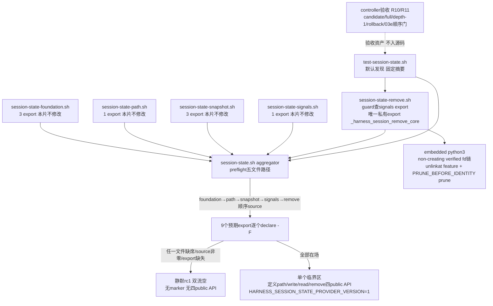

# 任务 1.1: 一次性交付完整remove模块

> 这是你的需求。数值、签名、命令一律照抄，不要自己发挥。
> 你只做这一个任务，不要顺手做别的。不要派 subagent。

---

## 完整上下文

下面是整个 spec 的三个文件，让你了解整体需求、设计和任务分解。
**但你只执行「你的任务」那一节，不要去做别的任务。**

### Requirements

> 用户原话：“$spec review 这套 aosp harness 工程，有哪些欠缺的地方，进行重构和完善”；并确认后续按 autopilot 执行。PLAN v5.7要求03d交付remove模块与最终aggregator：remove实现non-creating verified remove、feature缺失prune与ENOENT/ENOTEMPTY幂等；aggregator仅在五模块及预期私有函数完整时设置marker并原子发布五public API，任一missing-module状态走legacy由03e/08处理。

## 目标

只新增私有模块`common/.harness/lib/session-state-remove.sh`、最终aggregator `common/.harness/lib/session-state.sh`、默认发现集成测试`tests/test-session-state.sh`与独占coverage fragment `tests/coverage.d/03d-session-state.md`：remove交付`_harness_session_remove_core <project-id> <session-id>`，以held fd identity核对（`PRUNE_BEFORE_IDENTITY`）自底向上prune安全的空session/project/root层级；aggregator只做thin组合，在五个模块及预期export逐个点名在场时才定义完整五public API——foundation已公开的`harness_validate_feature_name <name>`与新发布的`harness_session_state_path`/`harness_session_state_write <project-id> <session-id> <feature>`/`harness_session_state_read`/`harness_session_state_remove <project-id> <session-id>`——并设置`HARNESS_SESSION_STATE_PROVIDER_VERSION=1`，任一缺失则静默失败、完整capability不出现。本片不复制任何模块内部逻辑、不修改上游九tracked文件；dependency-present active证据入ledger后才可启动03e，inert PASS不能解除该顺序门。

## 需求

R1. [计划] 当`_harness_session_write_with_signals`已定义时，系统必须使source `common/.harness/lib/session-state-remove.sh`返回0、stdout/stderr为空，且只新增唯一私有export `_harness_session_remove_core`；source不得读写文件、覆写依赖、定义四个状态public API或设置`HARNESS_SESSION_STATE_PROVIDER_VERSION`。（依据PLAN v5.7 03d详情：remove模块的精确私有接口为`_harness_session_remove_core`；03c->03d依赖边：signals export absent时remove inert，其逆即present时定义）

R2. [计划] 当source remove模块的依赖检查中`_harness_session_write_with_signals`缺席时，系统必须静默返回0、双流空，并保持remove export、四个状态public API与provider marker全缺席。（依据PLAN v5.7 03d详情与03c->03d依赖边：signals export缺失时remove模块静默inert）

R3. [计划] 当调用`_harness_session_remove_core <project-id> <session-id>`且feature存在时，系统必须先校验两个ID为安全单组件，经non-creating verified路径删除该feature规则文件，并以held parent/child fd identity核对（`PRUNE_BEFORE_IDENTITY`）后自底向上尝试删除安全的空session/project/root目录；成功或目标缺失返回0，普通OS错（含remove路径真实EIO）返回1，协议/安全错返回2，stdout恒空，stderr精确为rc1 `error: session state operation failed\n`、rc2 `error: unsafe session state\n`，不存在rc3分支。（依据DECISIONS 2026-09-01 03 round 2错误表、round 3 prune口径与PLAN v5.7 03d详情的remove接口契约）

R4. [计划] 如果发生feature缺失而安全session/project/root目录存在，系统必须仍返回0并自底向上prune空层级；遇到并发非空目录时必须保持成功且不删除其他条目，ENOENT与ENOTEMPTY均按幂等成功处理。（依据DECISIONS 2026-09-01 03收窄round 3 I1-I3「remove在安全目录存在但feature缺失时仍prune空层级」与round 3「遇并发非空仍成功且不删其他条目」）

R5. [计划] 当foundation/path/snapshot/signals/remove五个模块文件均存在时，系统必须使aggregator `common/.harness/lib/session-state.sh`先验证五个模块文件路径，再按foundation、path、snapshot、signals、remove顺序逐个source，并逐个点名核对预期export：foundation的`harness_validate_feature_name`、`_harness_session_state_run`、`_harness_session_state_foundation_path`，path的`_harness_session_path_core`，snapshot的`_harness_session_snapshot_worker`、`_harness_session_snapshot_write_core`、`_harness_session_snapshot_read_core`，signals的`_harness_session_write_with_signals`，remove的`_harness_session_remove_core`。（依据PLAN v5.7 03d详情「先验证五个模块文件路径，再逐个source」及DECISIONS 2026-09-01 PLAN v5.3 P5/P2回流「03d仅在五模块及预期私有函数完整时设置marker并发布五API」）

R6. [计划] 如果发生任一模块文件缺席、source非零或预期export缺失，系统必须使aggregator静默返回1、双流空，不设置`HARNESS_SESSION_STATE_PROVIDER_VERSION`、不定义四个状态public API，使missing-module状态走legacy由03e/08处理。（依据PLAN v5.7 03d详情「任一source非零或预期私有函数缺失时自身静默返回1，不设置marker或定义四个状态public API」与03c->03d依赖边「aggregator返回1」）

R7. [计划] 当五个模块及全部预期export完整时，系统必须使aggregator只做thin组合：定义public `harness_session_state_path`、`harness_session_state_write`、`harness_session_state_read`、`harness_session_state_remove`分别转接`_harness_session_path_core`、`_harness_session_write_with_signals`、`_harness_session_snapshot_read_core`与`_harness_session_remove_core`，并设置`HARNESS_SESSION_STATE_PROVIDER_VERSION=1`；不得复制任何模块内部逻辑，public `harness_session_state_path`沿用path协议成功path+LF/0，write/read沿用snapshot的`0|1|2|3`与write信号`129|130|143`，remove沿用R3/R4契约；public `harness_validate_feature_name`继续由foundation单独提供，不代表完整capability。（依据PLAN v5.7 03d详情「只有全部成功后才定义public path/write/read/remove并设置marker；public validate可由foundation单独存在但不代表完整capability」与03d->03e依赖边）

R8. [计划] 系统必须提供默认发现且shfmt-clean的`tests/test-session-state.sh`，只接受无参数、`all`、唯一`--dependency-absent`或唯一`--session-provider-fixture <missing-foundation|missing-path|missing-snapshot|missing-signals|missing-remove>`；dependency-present默认/all必须覆盖remove矩阵（feature存在删除并prune、feature缺失幂等0且仍prune空层级、并发非空成功且不删他项、完整rc/stdout/stderr契约）与aggregator发布面（五个public API逐个存在、marker精确为1、五模块各自缺席与aggregator缺席的隔离shell fixture中marker未设置且完整五API predicate为false、consumer忽略任何已加载前序函数）；真实依赖缺席时默认与`--dependency-absent`运行同一inert surface并零active case；成功唯一摘要为`RESULT PASS  session state\n`，unknown/extra/flag带值返回1且不打印PASS。（依据PLAN v5.7 03d行验收命令、03d详情测试契约与回滚矩阵的`--session-provider-fixture` test-only参数要求；其中aggregator缺席fixture为本片自愿加严、非PLAN原文要求——PLAN.md:221将aggregator缺席覆盖划给03e/08；`--dependency-absent` flag在PLAN.md:223-234对本入口无直接依据，为本片与03c `tests/test-session-signals.sh`的同构外推）

R9. [计划] 系统必须交付独占coverage fragment `tests/coverage.d/03d-session-state.md`，登记本片session-state capability的需求到测试映射，不得修改02的`tests/COVERAGE.md`。（依据PLAN v5.7文件边界表03d行「独占`tests/coverage.d/03d-session-state.md` fragment；不修改02的`tests/COVERAGE.md`」与独立回滚矩阵02行）

R10. [计划] 当03d进入验收时，系统必须在candidate、完整历史checkout和真实`git clone --depth 1 file://...`中分别运行默认session-state测试与`bash ./scripts/check.sh --offline`，自动发现本入口恰好一次，且每个checkout的当前tracked上游九文件（common/.harness/lib/session-state-foundation.sh、common/.harness/lib/session-state-path.sh、tests/lib/session-path-race-driver.py、tests/test-session-path-races.sh、common/.harness/lib/session-state-snapshot.sh、tests/test-session-snapshot.sh、tests/test-session-snapshot-assurance.sh、common/.harness/lib/session-state-signals.sh、tests/test-session-signals.sh）SHA-256在测试前后不变。controller必须先逐字验证shfmt `v3.14.0`与ShellCheck version field `0.11.0`，再只对本片exact四文件中三个shell文件运行`shfmt -d -i 2 -ci -bn`、`shellcheck -x --severity=warning`与`bash -n`；execution BASE到accepted HEAD必须exact只新增`common/.harness/lib/session-state-remove.sh`、`common/.harness/lib/session-state.sh`、`tests/test-session-state.sh`与`tests/coverage.d/03d-session-state.md`、numstat总和`<=400`，六列review manifest必须与tasks一一对应、首尾/相邻连续、reviewer非空且全PASS，`git diff --check`与worktree clean必须通过。（依据PLAN v5.7审查规模与文件边界、DECISIONS 2026-09-02 03b1上游集合裁定「后序片在此基础上累加各自前序交付」）

R11. [计划] 当验证独立回滚与顺序时，系统必须从accepted HEAD建立隔离临时分支，提交一个exact只删除本片四个交付文件的rollback commit，在该clean checkout运行03b基础测试、03b1 assurance入口、03c signals入口与offline并要求全绿、本入口发现0次；验收后丢弃临时checkout，不改变candidate/full/depth-1 checkout。controller只有在03d accepted HEAD、dependency-present active证据、exact4/400与全PASS manifest入ledger后，才可创建规范ID `03e-claude-session-lifecycle`（日期前缀由创建日决定，本片不预知）的spec目录、同名`spec/`分支/worktree、ledger execution BASE或dispatch记录；此前这五类资产必须物理缺席，以nullglob下`ls -d "$PROJECT"/specs/*03e-claude-session-lifecycle`缺席、`git show-ref | rg 'refs/heads/spec/.*03e-claude-session-lifecycle'`零匹配、`git worktree list --porcelain | rg 03e-claude-session-lifecycle`零匹配与`rg 03e-claude-session-lifecycle`对ledger/dispatch/execution-base记录零匹配机械核对；requirements/design/tasks等spec文档允许出现NEXT全名，禁令只针对ledger/dispatch/execution-base三类记录；任何inert PASS不得作为本片验收证据或解除该顺序门。（依据PLAN v5.7 spec表03e行为本片NEXT、独立回滚矩阵03d行与DECISIONS 2026-09-01 PLAN v5.3 P5/P2回流）

## 验收标准

主验证命令: bash ./tests/test-session-state.sh
期望输出: dependency-present时退出码为`0`、stderr空，stdout逐字节精确为`RESULT PASS  session state\n`

验收清单:

- [ ] remove模块source功能fixture返回0、双流空且只新增`_harness_session_remove_core`一个export；signals export缺席fixture逐字比较rc/双流、export inventory、四public API与provider marker全缺席，证明inert零副作用。
- [ ] feature存在时remove删除规则文件并自底向上prune空session/project/root层级；feature缺失幂等返回0且安全目录存在时仍prune空层级；并发非空目录仍成功且不删除其他条目；rc0/1/2与stderr错误表逐字一致，stdout恒空，不存在rc3分支。
- [ ] 五模块及预期export逐个点名在场时aggregator返回0，public path/write/read/remove分别转接`_harness_session_path_core`、`_harness_session_write_with_signals`、`_harness_session_snapshot_read_core`、`_harness_session_remove_core`且生产文本不含模块内部逻辑副本，marker精确为`1`，public validate由foundation提供。
- [ ] 五模块各自缺席的隔离shell fixture中，aggregator返回1、双流空，marker未设置且完整五API predicate为false；`--session-provider-fixture`五个取值各自复现对应missing-module inert surface。
- [ ] aggregator缺席的隔离shell fixture中，source尝试返回非零，marker未设置且完整五API predicate为false，不断言双流空（aggregator缺席fixture为本片自愿加严、非PLAN原文要求，PLAN.md:221将该覆盖划给03e/08）。
- [ ] 真实dependency-present默认/all与隔离dependency-absent默认/flag均得唯一固定摘要`RESULT PASS  session state\n`，但只有dependency-present active证据计入本片验收；unknown/extra/flag带值rc1且无PASS。
- [ ] `tests/coverage.d/03d-session-state.md`存在且为03d独占fragment；`tests/COVERAGE.md`的SHA-256在测试前后不变。
- [ ] candidate/full/depth-1的默认入口与offline全PASS，offline发现本入口恰好一次，depth-1 commit-count=1且shallow marker非空；每个checkout的上游九文件SHA-256测试前后不变且clean。
- [ ] 隔离rollback commit exact只删除本片四个交付文件后，clean checkout中03b基础测试、03b1 assurance入口、03c signals入口与offline全PASS且本入口发现0次；03e的spec/ref/worktree/BASE/dispatch按R11机械查缺席。
- [ ] review manifest六列、任务序号、execution BASE、相邻base/head、accepted HEAD和全PASS一次机械验证通过；BASE..HEAD exact name-only为上述四文件、numstat总和`<=400`，固定版本断言后对exact四文件中三个shell文件运行shfmt/ShellCheck/bash-n全绿，`git diff --check`和clean通过；只有dependency-present active证据入ledger后才可创建03e。

不变量（不许劣化，2-4 项）:

- 上游九tracked文件在execution BASE..HEAD的变更数 ≤ `0`，验证: `git diff --name-only "$BASE" "$HEAD" -- common/.harness/lib/session-state-foundation.sh common/.harness/lib/session-state-path.sh tests/lib/session-path-race-driver.py tests/test-session-path-races.sh common/.harness/lib/session-state-snapshot.sh tests/test-session-snapshot.sh tests/test-session-snapshot-assurance.sh common/.harness/lib/session-state-signals.sh tests/test-session-signals.sh`。
- 并发非空目录或其他session条目被remove/prune删除的次数 ≤ `0`，验证: `bash ./tests/test-session-state.sh`并发非空case前后对临时状态根做完整namespace inventory比较。
- 任一missing-module或aggregator-absent fixture中出现marker或形成partial五API capability的次数 ≤ `0`，验证: `bash ./tests/test-session-state.sh`六类inert fixture逐个核对marker unset与完整五API predicate为false。
- 既有Claude、Codex、common与已合入session回归失败数 ≤ `0`，验证: `bash ./scripts/check.sh --offline`。

## 超出范围

- 不实现Claude hook/demo生命周期接入（03e独占）；03e的全部资产（spec目录、`spec/`分支、worktree、ledger execution BASE、dispatch记录）在本片dependency-present active证据入ledger前继续物理缺席。
- 不修改上游九tracked文件（foundation/path/03a1 driver/03a2 entrypoint/snapshot/03b基础测试/03b1 assurance/signals/03c测试）与02的`tests/COVERAGE.md`；不新增信号契约，write的`129|130|143`沿用03c facade。
- 不承诺同EUID攻击者在最终dev/inode身份检查后、`rmdir`前换入空目录窗口的保护（DECISIONS 2026-09-01 03 design review B1已定此收窄）；`rmdir`不删除非空目录的保证不变。
- inert PASS不替代dependency-present证据；不调用设备、网络、AOSP build、Claude/Codex客户端，不push、不清理已有spec/prototype/implementation分支或worktree。

### Design

# 2026-09-03-03d-session-remove-prune 设计

## 概述

只新增四个文件：source-inert 的私有 remove 模块、thin 组合的最终 aggregator、默认发现集成测试与独占 coverage fragment。remove 交付 `_harness_session_remove_core <project-id> <session-id>`：non-creating verified 删除 feature 规则文件后，以 held parent/child fd identity 核对（`PRUNE_BEFORE_IDENTITY`）自底向上 prune 安全的空 session/project/root；aggregator 先验五模块文件路径、按 foundation→path→snapshot→signals→remove 唯一顺序 source、逐个点名 9 个预期 export，全部在场才在单个临界区内定义四个状态 public API 并设置 `HARNESS_SESSION_STATE_PROVIDER_VERSION=1`，任一缺失静默 rc1、双流空、partial capability 物理不可能。

- 选择“remove 自带 embedded python3 的 non-creating verified fd 链，不复用 `_harness_session_path_core`”，因为 path core 对 root/project/session 缺失层级一律执行 fresh mkdir（creating），仅 physical parent/base 缺失经 strict resolve fail closed 映射 unsafe/rc2，而 R3/R4 要求 non-creating 且目标缺失幂等 0，两者语义不可调和；root 选择与 verified open 的安全判据（physical parent、nofollow dir fd、EUID、0700、before/fstat/after identity）逐条沿用 path/snapshot 同源词汇，非新造机制。放弃“先调 path core 拿路径再删”（creating，违反 R3 的 non-creating）与“纯 bash 实现”（bash 无 dir_fd 相对的 unlinkat/rmdir/fstat 原语；foundation/path/snapshot 均以 embedded python3 为先例，remove 除 python3 外零外部命令，不需要 snapshot 的 mktemp/rm）。
- 选择“prune 用 `os.rmdir(name, dir_fd=parent_fd)`，每层执行 `PRUNE_BEFORE_IDENTITY`（held child fd 的 fstat 与 parent fd 下 name 重取 stat 的 dev/inode/type 三方核对）后自底向上 session→project→root，ENOENT/ENOTEMPTY 即幂等成功停止，EIO 及其他 OS 错归 rc1”，因为 DECISIONS 2026-09-01 03 design review B1 已裁定 Linux 无法把 rmdir 原子绑定到已持有 inode，最终检查前的确定性替换必须 fail closed（rc2），检查后窗口不承诺保护；实测（mktemp 内 python3）确认 dir_fd 相对 rmdir、ENOTEMPTY/ENOENT 语义与 identity 核对全部如预期。放弃“rename-away 再删”与递归删除（会删他项，违反 R4），也放弃更强宣称（B1 已判不可实现）。
- 选择“aggregator 的全部检查（五文件路径存在且可读→按唯一顺序逐个 source 并核 rc0→9 个 export 逐个 `declare -F`）完成后，才进入一个纯函数定义+marker 赋值的临界区”，因为每个模块的 source guard 都以前序模块 export 为激活条件，source 顺序只有这一条能全部激活；临界区内只有不可能失败的函数定义语句，故不存在“定义了部分 API”的执行路径，partial capability 物理不可能而非测试凑出来的。放弃边 source 边定义（中间态暴露 partial API）与只验文件存在或只验 marker（source 非零、guard inert 造成 export 缺失时会假阳性发布）。

## 需求映射

| 组件 | 实现的需求 |
|---|---|
| remove source guard 与 inert 契约 | R1, R2 |
| remove core（non-creating verified remove + PRUNE_BEFORE_IDENTITY prune） | R3, R4 |
| aggregator preflight/source/export guard | R5, R6 |
| aggregator thin 发布面与 marker | R7 |
| 默认发现测试 `tests/test-session-state.sh` | R8 |
| 独占 coverage fragment `tests/coverage.d/03d-session-state.md` | R9 |
| controller 验收（candidate/full/depth-1/offline/manifest/exact4） | R10 |
| controller 独立回滚与 03e 顺序门 | R11 |

## 架构



分层与边界：本片处于 03→03a→03b→03c 私有模块链的末端，是把五个已验收模块组合为 `session-state-provider-v1` 的唯一发布点；03e/08 consumer 只认 marker+五 API 的合取，任一 missing-module 状态走 legacy。技术栈沿用既有链且不加新下限：Bash 4.4+（`declare -F`、关联数组均不需要）、Linux + Python 3.8+（`dir_fd` 相对 `os.unlink`/`os.rmdir`/`os.stat(follow_symlinks=False)`/`os.fstat`，与 path/snapshot 同一 syscall 族）；aggregator 与 remove 的 bash 层只用内建，remove 的唯一外部进程是 embedded python3（同 03/03a/03b 先例），不引入 mktemp/rm/setsid。生产模块不读取任何测试环境变量；`PRUNE_BEFORE_IDENTITY` 与 OS 错注入点是生产文本中的 exact-once 无副作用 `pass  # ...` checkpoint（03a/03b anchor 先例），注入只发生在测试的 provider 副本上。

## 组件与接口

### remove source guard 与 inert 契约

- 职责：source 时 `declare -F _harness_session_write_with_signals` 单一检查；缺席则整段 guard 不成立，source 静默返回 0、双流空，不定义 remove export、四个状态 public API 与 `HARNESS_SESSION_STATE_PROVIDER_VERSION`，不读写文件、不覆写依赖。
- 对外接口：无（guard 是模块顶层结构，非函数）；inert 时 export inventory 与 source 前逐字一致。active 时恰好新增唯一私有 export，不多不少。
- 依赖：03c signals 模块已 source 后的函数表；缺席场景下零依赖。

### remove core（non-creating verified remove + prune）

- 职责：校验两个 ID 为安全单组件后，以 non-creating verified fd 链定位 session 目录，verified 删除 feature 规则文件，再以 held parent/child fd identity 核对自底向上 prune 安全的空 session/project/root 层级。
- 对外接口（私有 export，与 frontmatter 产出逐字一致的名字与参数表）：`_harness_session_remove_core <project-id> <session-id>`；rc 契约：成功或目标缺失 0、普通 OS 错（含 remove 路径真实 EIO）1、协议/安全错 2；不存在 rc3 分支；stdout 恒空；stderr 精确为 rc1 `error: session state operation failed\n`、rc2 `error: unsafe session state\n`（03 round 2 错误表）。
- 内部结构（bash 包装 + embedded python3，唯一 export，不新增辅助函数）：bash 层做 exact arity 与 `_harness_component_is_safe` 双 ID 校验（失败 rc2 + 固定 stderr）、`umask 077` 后 heredoc python3；python 侧复刻 path 同源 root 选择（`HARNESS_STATE_ROOT` exact 且拒 `/`、否则 `XDG_RUNTIME_DIR`/非空 `TMPDIR`/`/tmp` 拼 `aosp-harness-<euid>`，physical parent 必须 strict resolve 存在），随后 non-creating 打开 root/project/session 链——每层 `stat(name, dir_fd, follow_symlinks=False)`→拒绝非目录/链接→`open(O_RDONLY|O_DIRECTORY|O_NOFOLLOW|O_CLOEXEC)`+`fstat`→`after stat`，三方 dev/inode/type 一致且 EUID/0700 校验通过才继续；任一层 ENOENT 直接幂等 0（不创建、不报错），链接/非目录/owner/mode/identity 不符 rc2。feature 删除：`stat("feature", dir_fd=session_fd, follow_symlinks=False)` 验 regular/EUID/0600/nlink1 后 `os.unlink("feature", dir_fd=session_fd)`；ENOENT 幂等继续 prune，unsafe 对象 rc2 且不删。prune 循环：对 (project_fd, session_fd, session)、(root_fd, project_fd, project)、(parent_fd, root_fd, root_leaf) 三步，每步在 `PRUNE_BEFORE_IDENTITY` checkpoint 后重取 `stat(name, dir_fd=parent_fd, follow_symlinks=False)` 并与 held child fd 的 `fstat` 核 dev/inode/type，一致才 `os.rmdir(name, dir_fd=parent_fd)`；ENOENT/ENOTEMPTY 视为幂等成功并停止继续向上，identity 不符 rc2，EIO 及其他 OSError rc1；永不触碰 physical parent 本身，finally 逆序关闭全部 fd。
- 依赖：`_harness_component_is_safe`（经 foundation 公开面已在场）与 DECISIONS B1 收窄；不调用 `_harness_session_path_core`（creating 语义不合）。

### aggregator preflight/source/export guard

- 职责：先验证五个模块文件路径（`common/.harness/lib/` 下 foundation/path/snapshot/signals/remove 五文件均 `[[ -f && -r ]]`，路径常量由 `BASH_SOURCE` 定位），再按 foundation→path→snapshot→signals→remove 顺序逐个 source 并核 rc0，随后逐个点名核对 9 个预期 export：`harness_validate_feature_name`、`_harness_session_state_run`、`_harness_session_state_foundation_path`、`_harness_session_path_core`、`_harness_session_snapshot_worker`、`_harness_session_snapshot_write_core`、`_harness_session_snapshot_read_core`、`_harness_session_write_with_signals`、`_harness_session_remove_core`（均 `declare -F`）。
- 对外接口：无；任一文件缺席/不可读、source 非零或 export 缺失时 `return 1 2>/dev/null || exit 1`，静默、双流空，不设置 marker、不定义四个状态 public API（此时 foundation 的 `harness_validate_feature_name` 可能已单独存在，但不代表完整 capability）。
- 依赖：五个模块文件的物理在场与其各自 source guard 语义；source 顺序唯一是因为每个模块 guard 以前序 export 为激活条件，其他任何顺序必然留下 inert 模块并被 export 点名检查抓住。

### aggregator thin 发布面与 marker

- 职责：全部检查通过后，在单个临界区内定义四个转接函数并设置 marker；不复制任何模块内部逻辑。
- 对外接口（产出，与 frontmatter 逐字一致）：`session-state-provider-v1 —— common/.harness/lib/session-state.sh aggregator在foundation/path/snapshot/signals/remove五模块及预期export完整时设置HARNESS_SESSION_STATE_PROVIDER_VERSION=1并发布完整五public API（harness_validate_feature_name <name>；harness_session_state_path <project-id> <session-id>；harness_session_state_write <project-id> <session-id> <feature>；harness_session_state_read <project-id> <session-id>；harness_session_state_remove <project-id> <session-id>；成功0、OS错1、协议/安全错2、write异值冲突与read缺失3、remove缺失幂等0、write信号129|130|143）plus tests/test-session-state.sh固定摘要`RESULT PASS  session state`与独占tests/coverage.d/03d-session-state.md fragment`
- 精确调用：`harness_session_state_path` 转接 `_harness_session_path_core "$@"`；`harness_session_state_write` 转接 `_harness_session_write_with_signals "$@"`；`harness_session_state_read` 转接 `_harness_session_snapshot_read_core "$@"`；`harness_session_state_remove` 转接 `_harness_session_remove_core "$@"`；四函数体各仅一行转接，rc/双流契约原样沿用被转接方。`harness_validate_feature_name <name>` 不由 aggregator 重定义，继续由 foundation 单独提供。
- 依赖：guard 组件的全部肯定结论；临界区内只有函数定义与 `HARNESS_SESSION_STATE_PROVIDER_VERSION=1` 赋值，无任何可失败语句。

### 消费契约（03c 及前序，本片只读）

- 消费接口（与 frontmatter 逐字一致）：`session-signals-facade-v1的唯一私有export _harness_session_write_with_signals <project-id> <session-id> <feature>（常规沿用snapshot write的0|1|2|3双流空，HUP/INT/TERM恰129|130|143）；session-foundation-v1、session-path-delivery-v1、session-snapshot-core-v2的既有public/private export（harness_validate_feature_name、_harness_session_state_run、_harness_session_state_foundation_path、_harness_session_path_core、_harness_session_snapshot_worker、_harness_session_snapshot_write_core、_harness_session_snapshot_read_core，供aggregator thin转接）；03c accepted ledger中的03d启动门（dependency-present active证据、exact2/400、full/depth-1/rollback与顺序门证据，无其他运行时API）`
- 依赖：上游九 tracked 文件与 03c accepted ledger；本片不修改它们，不新增信号契约。

### 默认发现测试

- 职责：实现 `bash ./tests/test-session-state.sh` 的 CLI 分流、remove 矩阵、aggregator 发布面、六类 inert fixture 与固定摘要。
- 对外接口：无参数或 `all` 自动 active/inert 分流；唯一 `--dependency-absent` 强制 inert；唯一 `--session-provider-fixture <missing-foundation|missing-path|missing-snapshot|missing-signals|missing-remove>` 复现对应 missing-module inert surface；成功 stdout 逐字 `RESULT PASS  session state\n`、stderr 空、rc0；unknown 参数、extra 参数、flag 带值均 rc1 且不打印 PASS。
- 依赖：本片 remove 模块与 aggregator、上游四模块、固定 shfmt `v3.14.0`/ShellCheck `0.11.0`，以及 `bash/python3/rg/find/stat/sha256sum/mktemp/git`。

### 独占 coverage fragment

- 职责：`tests/coverage.d/03d-session-state.md` 登记本片 session-state capability 的需求到测试映射（R1–R9 到测试用例区段的表），为 03d 独占；不修改 02 的 `tests/COVERAGE.md`。
- 对外接口：无运行时接口；纯文档资产，进入 exact4 文件清单与 numstat 预算。

### controller 验收与 03e 顺序门（验收资产，不进入源码文件）

- 职责：执行 R10/R11 的机器核对，全部证据入 ledger 后才允许创建 03e 的任何资产。
- 验收动作：candidate、完整历史 checkout、真实 `git clone --depth 1 file://...` 分别运行默认 session-state 测试与 `bash ./scripts/check.sh --offline`，offline 发现本入口恰好一次，depth-1 commit-count=1 且 shallow marker 非空；每个 checkout 的上游九 tracked 文件 SHA-256 测试前后不变且 clean；逐字验证 shfmt `v3.14.0` 与 ShellCheck version field `0.11.0` 后只对本片 exact 四文件中三个 shell 文件运行 `shfmt -d -i 2 -ci -bn`、`shellcheck -x --severity=warning`、`bash -n`；execution BASE 到 accepted HEAD exact 只新增本片四文件、numstat 总和 ≤400、六列 review manifest 与 tasks 一一对应、首尾/相邻连续、reviewer 非空且全 PASS、`git diff --check` 与 worktree clean 通过；从 accepted HEAD 建隔离临时分支提交 exact 只删除本片四文件的 rollback commit，clean checkout 中 03b 基础测试、03b1 assurance 入口、03c signals 入口与 offline 全绿、本入口发现 0 次；03e 的 spec 目录/分支/worktree/ledger BASE 或 dispatch 记录按 R11 以 `ls -d` 缺席、`git show-ref` 零匹配、`git worktree list --porcelain` 零匹配与 `rg` 零匹配机械查缺席（requirements/design/tasks 文档允许出现 NEXT 全名，禁令只针对 ledger/dispatch/execution-base 三类记录）。
- 依赖：本片 accepted HEAD、dependency-present active 证据、exact4/400 与全 PASS manifest 入 ledger；inert PASS 不作为本片验收证据，也不解除该顺序门。

## 数据模型

不新增 schema 或跨进程数据库。本片只在既有 session 状态树上执行删除转换，对象安全属性全部沿用 path/snapshot 判据：

| 对象 | 位置/生命周期 | 安全属性（删除前 verified） | 本片允许的转换 |
|---|---|---|---|
| feature 规则文件 | session 目录内固定 leaf `feature` | regular、current-EUID、0600、nlink1、nofollow stat 与 identity 一致 | present → absent（unlinkat）；missing 幂等 0 |
| session 目录 | project 下安全单组件 | directory、current-EUID、0700、held fd 与 name re-stat dev/inode/type 一致（`PRUNE_BEFORE_IDENTITY`） | 空 → absent（rmdir）；非空/缺失幂等停止 |
| project 目录 | root 下安全单组件 | 同上 | 同上 |
| root 目录 | physical parent 下 `aosp-harness-<euid>` 或 HARNESS 根 leaf | 同上 | 同上；physical parent 本身永不删除 |

状态转换不变量：任何转换只删除经 identity 核对的空目录或 verified feature 文件；并发写入者留下的非空目录使 prune 停止且保持 rc0；不存在“删除非空目录/其他条目”的转换；检查前被替换（identity 不符）一律 fail closed rc2 且不执行该层 rmdir。

## 数据流

### feature 存在时的 remove + 全层 prune（happy path）

```mermaid
sequenceDiagram
  participant C as 调用方
  participant B as remove bash包装
  participant Y as embedded python3
  participant D as held fd链(parent/root/project/session)
  C->>B: _harness_session_remove_core p s
  B->>B: exact arity + 双ID安全单组件校验(失败rc2)
  B->>Y: umask 077; heredoc python3 p s
  Y->>D: root选择; non-creating verified打开三层(ENOENT幂等0)
  Y->>D: stat feature 验regular/EUID/0600/nlink1
  Y->>D: unlinkat feature(ENOENT幂等继续)
  loop session → project → root
    Y->>Y: PRUNE_BEFORE_IDENTITY: name re-stat vs held child fstat(dev/inode/type)
    alt identity一致
      Y->>D: os.rmdir(name, dir_fd=parent_fd)
    else identity不符
      Y-->>C: rc2 + error: unsafe session state(不执行该层rmdir)
    end
  end
  Y-->>B: 0(全部prune或ENOENT/ENOTEMPTY停止)
  B-->>C: rc0; stdout恒空; stderr空
```

### feature 缺失幂等与并发非空停止

```mermaid
sequenceDiagram
  participant C as 调用方
  participant Y as embedded python3
  participant D as held fd链
  participant W as 并发写入者
  C->>Y: remove p s(feature本不存在)
  Y->>D: verified链在场; stat feature -> ENOENT(幂等 继续prune)
  Y->>D: PRUNE_BEFORE_IDENTITY通过; rmdir session 成功
  W->>D: 在project下创建其他session条目
  Y->>D: PRUNE_BEFORE_IDENTITY通过; rmdir project -> ENOTEMPTY
  Y-->>C: rc0; 他项零删除; 不再向上尝试root
  Note over Y,D: ENOENT同样幂等停止; 两层级结果namespace inventory前后只差被删的空目录
```

### aggregator 组合与 fail-closed

```mermaid
sequenceDiagram
  participant S as consumer shell
  participant A as session-state.sh
  participant M as 五模块文件
  S->>A: source aggregator
  A->>M: preflight: 五文件 [[ -f && -r ]]
  A->>M: 按foundation→path→snapshot→signals→remove顺序source 逐个核rc0
  A->>A: 9个预期export逐个declare -F
  alt 任一文件缺席/source非零/export缺失
    A-->>S: return 1; 双流空; marker未设置; 四public API未定义(validate可单独存在)
  else 全部在场
    A->>A: 临界区: 定义path/write/read/remove四转接 + marker=1
    A-->>S: return 0; 完整五API与marker同生同灭
  end
```

## 错误处理

| 错误场景 | 恢复策略 | 校验位置 | 日志 | 用户可见 |
|---|---|---|---|---|
| source remove 时 signals export 缺席 | 静默 inert，不定义 remove/public surface/marker | remove source guard | 无 | source rc0、双流空 |
| remove arity 错或 ID 非安全单组件 | 拒绝，零文件副作用 | bash 包装入口 | 无 | rc2、`error: unsafe session state\n` |
| root 选择危险/parent 缺失 | fail closed，不创建 | python root selector | 无 | rc2、固定 stderr |
| 链上任一层 ENOENT | 目标缺失幂等，不创建不报错 | non-creating open | 无 | rc0、双流空 |
| 链上链接/非目录/wrong owner/mode/identity | 不继续、不删攻击对象 | 三层 verified open | 无 | rc2、固定 stderr |
| feature 缺失但目录安全 | 幂等并继续 prune 空层级 | feature stat ENOENT | 无 | rc0、双流空 |
| feature 为 unsafe 对象 | 不删，fail closed | feature stat verify | 无 | rc2、固定 stderr |
| PRUNE_BEFORE_IDENTITY 核对不符 | 不执行该层 rmdir，fail closed | prune 每层 checkpoint | 无 | rc2、固定 stderr |
| prune 遇 ENOENT/ENOTEMPTY（含并发非空） | 幂等成功并停止向上，不删他项 | rmdir errno 分类 | 无 | rc0、双流空 |
| 真实 EIO 或其他 OSError | 关闭已持有 fd，映射普通 OS 错 | unlinkat/rmdir/stat 异常映射 | 无 | rc1、`error: session state operation failed\n` |
| aggregator 五文件任一缺席/不可读 | 不 source，静默失败 | preflight 路径检查 | 无 | rc1、双流空 |
| 任一模块 source 非零或 9 export 缺一 | 不进入临界区，missing-module 走 legacy | source rc 与 `declare -F` 点名 | 无 | rc1、双流空、marker/API 缺席 |
| CLI unknown/extra/flag 带值 | 拒绝且不进入任何分支 | 测试入口参数解析 | 无 | rc1、无 PASS |
| 真实依赖缺席或 `--dependency-absent` | 与隔离 fixture 同一零 active case inert surface | 测试入口依赖探测 | 无 | 固定摘要、rc0 |
| 任一 case 失败 | 累计 failures，末行不打印 PASS | 统一 check/failures 计数器 | 失败详情到 stderr | rc1、无 PASS |

## 测试策略

| 层 | 测什么 | 用什么工具 |
|---|---|---|
| 单元/结构 | CLI 四态（无参数/all 接受，unknown/extra/flag 带值 rc1 无 PASS）；remove 模块 source 功能 fixture（signals export 在场）rc0、双流空、export inventory 恰好新增 `_harness_session_remove_core` 一名；signals export 缺席 fixture 逐字比较 rc/双流、export inventory、四 public API 与 marker 全缺席；`PRUNE_BEFORE_IDENTITY` 与 OS 错注入 anchor 各 exact-once；aggregator 生产文本 rg 证明无模块内部逻辑副本（无 root selector/rmdir/renameat2/heredoc python 片段）、四转接函数体各仅一行；测试前后上游九 tracked 文件 SHA-256 不变 | `bash` 隔离 shell、`declare`、`export -p`、`rg`、`sha256sum`、`mktemp` |
| 集成（remove 矩阵 + aggregator 发布面，本片主体） | remove：feature 存在删除并自底向上 prune 空 session/project/root（namespace inventory 前后比较只差被删空目录）；feature 缺失幂等 0 且安全目录存在时仍 prune 空层级；并发非空目录仍成功且不删他项（前后完整 namespace inventory 逐字比较）；rc 表逐字——合法 0/双流空、unsafe ID 与 unsafe 对象 rc2 固定 stderr、provider 副本在 OS 错 anchor 注入 EIO 得 rc1 固定 stderr、不存在 rc3 分支（rg 证明生产文本无 rc3 映射）；`PRUNE_BEFORE_IDENTITY` 攻击行：provider 副本在 checkpoint 处把待 prune 空目录换入同名新空目录，必须 rc2 且新旧目录均保留。aggregator：五 public API 逐个 `declare -F` 存在、marker 精确为 `1`、四个转接行为等价（path 成功 path+LF/0、write/read/remove 各取一例透传 rc/双流）、validate 由 foundation 提供 | `bash ./tests/test-session-state.sh`（主验证命令）、python3 注入、`find/stat/sha256sum/mktemp` |
| inert fixture（六类） | `--session-provider-fixture` 五值：mktemp 内复制 lib 树并移除对应模块文件，source 其中 aggregator 必须 rc1、双流空、marker 未设置、完整五 API predicate 为 false，且预置的同名家哨兵函数不被当作 capability（consumer 忽略任何已加载前序函数）；aggregator 缺席 fixture（本片自愿加严，PLAN.md:221 将该覆盖划给 03e/08）：lib 树无 `session-state.sh`，source 尝试返回非零、marker 未设置、五 API predicate 为 false，不断言双流空；真实依赖缺席时默认/all 与 `--dependency-absent` 运行同一零 active case inert surface、同一固定摘要 | 同上入口 + `--dependency-absent` / `--session-provider-fixture`、隔离 fixture shell |
| mutant 自反证（红证据） | 需要，双 mutant，与 03c 同构：(a) 删除 `PRUNE_BEFORE_IDENTITY` 核对的 mutant 在换入攻击行必须 rc1/无 PASS（换入目录被误删或 rc 不符即被抓）；(b) feature 缺失时不 prune 的 mutant 在幂等 prune 行必须 rc1/无 PASS（空层级残留 oracle FAIL）。不另设 aggregator mutant：partial-capability 不可能性由临界区结构核对（rg 文本顺序）加六类 inert fixture 机械覆盖，mutant 不新增信息。红阶段证据文件以路径独占一行、零尾随字符格式记录（照 03c 报告契约） | provider 副本 mutant、`bash`、红证据记录 |
| 端到端/收敛（controller 验收资产） | candidate、完整历史 checkout、真实 `git clone --depth 1 file://...` 分别跑默认入口与 `bash ./scripts/check.sh --offline`，offline 发现本入口恰好一次，depth-1 commit-count=1 且 shallow marker 非空；上游九 tracked 文件 SHA-256 测试前后不变且 clean；隔离 rollback commit exact 只删本片四文件后 03b 基础测试、03b1 assurance 入口、03c signals 入口与 offline 全绿、本入口发现 0 次；03e 五类资产按 R11 机械查缺席 | `git clone --depth 1 file://...`、`git worktree/status/diff/show-ref`、`bash ./scripts/check.sh --offline`、`rg`、`ls -d` |
| 静态与 sizing | 固定版本断言后只对 exact 四文件中三个 shell 文件 `shfmt -d -i 2 -ci -bn`、`shellcheck -x --severity=warning`、`bash -n`；execution BASE..HEAD exact 只新增本片四文件、numstat 总和 ≤400；六列 manifest 机械验证；`git diff --check` 与 clean 通过 | shfmt `v3.14.0`、ShellCheck `0.11.0`、`bash -n`、Git/awk controller 命令 |
| 性能 | 不适用：本片不设吞吐/延迟 SLO；prune 为常数级三层 rmdir，`timeout` 仅作测试防挂死兜底，不冒充 benchmark | `timeout` |

测试必须将 stdout/stderr 落文件后按字节比较，禁止用会吞尾随 LF 的 command substitution 验证成功流；成功唯一摘要为 `RESULT PASS  session state\n`。只有 dependency-present active 证据计入本片验收并解除 03e 顺序门；inert PASS 不计入。

sizing 承诺：execution diff exact4 且 `git diff --numstat` 总和 ≤400。这是**纯分解预算**，无 runnable prototype；分解依据是同构实际尺寸（path 模块 114 行含 creating 分支，remove 去掉 mkdir/EEXIST 分支、加上 unlink+prune 循环；03c 模块 45 行为零 python 下限）。行数预算分解：`common/.harness/lib/session-state-remove.sh` ≤110 行（shebang/guard ~8、bash 包装 ~12、python root selector ~25、non-creating verified open ~22、feature unlink ~10、prune 循环+identity ~20、dispatch/异常映射 ~8、结构注释 ~5）；`common/.harness/lib/session-state.sh` ≤50 行（preflight ~10、五 source ~10、9 export 点名 ~12、临界区四转接+marker ~12、结构注释 ~6）；`tests/test-session-state.sh` ≤205 行（CLI 与引导 ~18、remove 矩阵 ~70、aggregator 发布面 ~30、六类 fixture 表驱动循环 ~35、helper ~25、SHA/结构核对 ~12、摘要 ~6、结构注释 ~9）；`tests/coverage.d/03d-session-state.md` ≤25 行；合计 ≤390，保留 ≥10 行余量。若 tasks 或执行期预计/实际超出，立即回 PLAN 拆片（备选：把 remove 动态攻击行拆为独立 assurance 片），不压缩任何 oracle 语义。

## 文件清单

| 文件 | 创建/修改 | 职责（一句话） |
|---|---|---|
| `common/.harness/lib/session-state-remove.sh` | 创建 | source-inert 的 remove 模块：signals export 单检查 guard 与唯一私有 export `_harness_session_remove_core`（non-creating verified remove + PRUNE_BEFORE_IDENTITY 自底向上 prune） |
| `common/.harness/lib/session-state.sh` | 创建 | 最终 aggregator：preflight 五文件、唯一顺序 source、点名 9 export，全部在场才在临界区发布四 public API 与 provider marker |
| `tests/test-session-state.sh` | 创建 | 默认发现的 shfmt-clean 入口：CLI 分流、remove 矩阵、aggregator 发布面、六类 inert fixture 与固定摘要 |
| `tests/coverage.d/03d-session-state.md` | 创建 | 03d 独占 coverage fragment：登记本片需求到测试映射，不触碰 `tests/COVERAGE.md` |

验收资产（不纳入源码文件清单）：红阶段证据（无 PRUNE_BEFORE_IDENTITY 核对 mutant 与 feature 缺失不 prune mutant 的 rc1/无 PASS 自反证记录，路径独占一行零尾随字符）、逐 task review 报告、六列 review manifest、candidate/full/depth-1/rollback 运行日志、accepted HEAD 与 ledger execution BASE 证据、03e 五类资产缺席的机械核对记录。门③通过前不创建 implementation worktree 或固定 execution BASE；dependency-present active 证据、exact4/400 与全 PASS manifest 入 ledger 前不创建 03e 的 spec 目录/分支/worktree/BASE/dispatch 记录。

### 所有任务

# 2026-09-03-03d-session-remove-prune 实现计划

03b/03c 多轮 tasks review 证明逐函数拼装中间代码会制造假红；本片四个交付文件均为新写完整文件，无 prototype blob——design sizing 节明确为纯分解预算（同构实际尺寸外推），候选文件以 design「组件与接口」节为唯一权威结构。熔断裁定：任务 1.1 一次性交付完整 remove 模块（≤110 行，单任务落地）、任务 1.2 一次性交付完整 aggregator（≤50 行，单任务落地）、任务 1.3 一次性交付完整集成测试与 coverage fragment（≤205+≤25 行，含红阶段双 mutant 自反证），禁止逐段拼装；随后 candidate/full/depth-1/rollback/order/terminal 六个零 delta controller 验证任务；共九个任务严格串行。实现提交使用普通 Conventional Commit。每个任务均保存 red 记录、green 报告和 evidence package，交全新独立 agent review；Blocking/Important 修复后必须由另一全新 agent re-review。

固定变量与工具门：

```bash
PROJECT=.spec/2026-08-31-aosp-harness-refactor
SPEC=$PROJECT/specs/2026-09-03-03d-session-remove-prune
WORK=$PROJECT/work/2026-09-03-03d-session-remove-prune
TASKS=$SPEC/tasks.md
LEDGER=$SPEC/ledger.md
MANIFEST=$WORK/review-manifest.tsv
TOOLS=/tmp/claude-1000/-home-zzh0838-CareerDevelop-AI2D-aosp-harness-demo/bdc6e669-9154-4030-a9db-78dc599ab491/scratchpad/tools/bin
UPSTREAM9="common/.harness/lib/session-state-foundation.sh common/.harness/lib/session-state-path.sh tests/lib/session-path-race-driver.py tests/test-session-path-races.sh common/.harness/lib/session-state-snapshot.sh tests/test-session-snapshot.sh tests/test-session-snapshot-assurance.sh common/.harness/lib/session-state-signals.sh tests/test-session-signals.sh"
EXACT4="common/.harness/lib/session-state-remove.sh common/.harness/lib/session-state.sh tests/coverage.d/03d-session-state.md tests/test-session-state.sh"
test "$("$TOOLS/shfmt" --version)" = "v3.14.0"
"$TOOLS/shellcheck" --version | rg -q '^version: 0.11.0$'
```

controller 在门④通过后固定 `IMPLEMENTATION_WORKTREE` 与 `TASK_BASE`（execution BASE，即任务 1.1 提交前的 clean HEAD），并令 `BASE_SHA=$TASK_BASE`；任务 1.2 开始时重取 `TASK_BASE=$(git rev-parse HEAD)` 为任务 1.1 的 `TASK_HEAD`，任务 1.3 同理衔接任务 1.2，保证 manifest 相邻连续。

red记录固定六行：`task=`、`command=`、`expected=`、`rc=`、`stdout_sha256=`、`stderr_sha256=`，末加`assertion=`；green报告固定含task/base/head/files/commands/results。报告契约（03c 执行期教训，定死）：报告中「红阶段证据: 」一行的路径必须独占一行、行尾零尾随字符（`cat -A` 核）。evidence package为TSV三列`path<TAB>sha256<TAB>bytes`，列出brief、report和全部日志；package 生成后其中收录的任何文件再被改动（含 fix round 更新 report 或追加日志），必须重算并更新对应行，不得留下陈旧 sha256/bytes。reviewer拿这三个路径，而不是依赖base=head的空diff。

manifest固定六列`seq<TAB>task-id<TAB>base<TAB>head<TAB>reviewer<TAB>PASS`，manifest 行一律由 controller 在该任务独立 review PASS 后追加（实现者不预知 review 结果，03c 报告契约）。任务简报由 controller 以 `python3 /home/zzh0838/.agents/skills/spec/scripts/task-brief.py "$TASKS" <任务号> --out "$PROJECT/work"` 生成，任务号格式为 `1.1` 样式（不带 `task-` 前缀）；review 包真实签名为 4 参：`/home/zzh0838/.agents/skills/spec/scripts/review-package.sh <BASE> <HEAD> "$PROJECT/work" 2026-09-03-03d-session-remove-prune`（03c tasks 中的 2 参写法是执行期修订前的笔误，本片直接写正确签名）。每个任务 PASS 后先追加本行，再分别执行：

```bash
python3 /home/zzh0838/.agents/skills/spec/scripts/mark-task-done.py "$TASKS" TASK_ID
# controller用apply_patch向ledger增加：- 任务 TASK_ID: 完成 commits=[TASK_HEAD]
python3 /home/zzh0838/.agents/skills/spec/scripts/sync-ledger.py "$LEDGER" --repo "$IMPLEMENTATION_WORKTREE"
```

裁定（定死，依据随条给出）：

1. 落地策略：任务 1.1/1.2/1.3 各以单任务一次性交付完整候选文件，禁止逐段拼装。依据：03b/03c 教训——拼装中间代码制造未定义引用与假红；本片无 prototype blob，候选文件以 design「组件与接口」节为唯一权威结构。组1 拆三个交付任务而非两个的理由：design 四文件中有两个独立生产模块（remove ≤110、aggregator ≤50），各自有独立 source 契约与静态门可独立判定成败，合并会让实现者在无中间验证下连写两个模块、违背「先验证核心」且单任务 review 面超过 10 分钟；fragment ≤25 行是纯文档、无独立验证面，拆开会出现没有有效验证步骤的空任务，故并入任务 1.3。sizing 预算：110+50+205+25=390，对 exact4/400 门保留 ≥10 行余量。
2. 探针字面量前提：测试文件中 `printf 'RESULT PASS  session state\n'` 调用字面量恰 2 处——依赖缺席 inert 出口（第 1 处）与 active 出口（末行，第 2 处）。dependency-present 实跑用 rindex 定位末处、在其前插入 `printf 'checks=%d\n' "$checks" >&2` 探针；inert 实跑用 index 定位首处、插入 `  printf 'checks=%d\n' "${checks:-0}" >&2` 探针（两空格缩进与该分支一致）——inert 流程在计数器初始化前即 `exit 0`，末行探针不可达、提前引用 `"$checks"` 会 unbound 崩溃（03b1/03c 同款约束）。结构注释只写摘要文字，不得逐字包含该 printf 调用字面量，否则 rindex/index 定位失效（03b1 M1/03c 裁定 2 同款）。
3. mutant 设计：任务 1.3 红阶段含两个 mutant 自反证（design 测试策略节已定，不另设 aggregator mutant——partial-capability 不可能性由临界区 rg 文本顺序结构核对加六类 inert fixture 机械覆盖）。(a) 删 `PRUNE_BEFORE_IDENTITY` identity 核对 mutant：provider 副本中删除 checkpoint 后的 held child fd fstat 与 name 重取 stat 三方核对（直接 rmdir）；该 mutant 在换入攻击行必须 rc1/无 PASS——换入的新同名空目录被误删或 rc 不符即被抓。(b) feature 缺失不 prune mutant：provider 副本中把 feature stat ENOENT 分支改为直接成功返回、不进入 prune 循环；该 mutant 在 feature 缺失幂等 prune 行必须 rc1/无 PASS——空层级残留 oracle FAIL。注入机制：在 `mktemp -d` 内复制整棵 lib 树（provider 副本）后编辑 remove 副本，不改动已提交模块；生产模块不读取任何测试环境变量（design 分层节），故不设 03c `SIGNALS_MODULE` 式 env override，测试一律经 fixture/副本注入。两 mutant 的 rc/双流落入日志并写入 green 报告。
4. `setsid` 不适用本片：remove 唯一外部进程是同步前台 embedded python3，无 background child、无信号转发义务（R3/R4 错误表无 129|130|143 分支，write 信号语义独占于 03c facade），aggregator 纯 source 组合，测试无 process-group 行；design 分层节明确不引入 mktemp/rm/setsid。仍以 `! rg -q 'setsid'` 对三个 shell 交付文件负向断言防回归。
5. 终交付锚点 `session-state-provider-v1` 记入本文、ledger 完成锚点与 acceptance 报告；任务 2.6 的「产出」字段写 `tests/test-session-state.sh`。依据：check-tasks 的孤儿产出检查只认 requirements 验收标准节正文，该路径在「主验证命令」行逐字出现，而锚点名只出现在 requirements frontmatter（03b1/03c 裁定 5 同款）。
6. `03e-claude-session-lifecycle` 字面全名的硬禁令只覆盖 scoped rg 实际搜索的文件——`$PROJECT/specs/*/ledger.md`、`$PROJECT/work/*/dispatch.tsv`、`$PROJECT/work/*/execution-base.env`；这些文件只写「03e 顺序门」字样，本片自身 ledger 若含该字面全名，任务 2.6 终门重跑顺序门会自命中制造假红。requirements/design/tasks 等 spec 文档允许出现 NEXT 全名（R11）。green/red 报告与运行日志不在 rg 域内、不受硬禁令约束，但任务 2.5 的报告与日志中命令一律以步骤 2 已定义的 `"$NEXT"` 间接形式记录、不内联字面全名，以降低误写扩散风险。
7. inert PASS 不作为本片验收证据，也不解除 03e 顺序门；只有 dependency-present active 证据、exact4/400 与全 PASS manifest 入 ledger 后才可创建 03e 的 spec 目录/分支/worktree/ledger BASE/dispatch 记录（R11）。

### 任务 1.1: 一次性交付完整remove模块

文件: 创建 `common/.harness/lib/session-state-remove.sh`
验收资产（不纳入源码文件清单）: 创建 `.spec/2026-08-31-aosp-harness-refactor/work/2026-09-03-03d-session-remove-prune/evidence/task-1.1-red.txt` / 创建 `.spec/2026-08-31-aosp-harness-refactor/work/2026-09-03-03d-session-remove-prune/task-1.1-report.md` / 创建 `.spec/2026-08-31-aosp-harness-refactor/work/2026-09-03-03d-session-remove-prune/review-manifest.tsv`
消费: 无
产出: session-remove-core-runtime-v1
需求: R1, R2, R3, R4
必需: 是

候选文件权威结构（design「组件与接口」节，唯一 export、不新增辅助函数）：source 守卫单一 `declare -F _harness_session_write_with_signals` 检查，缺席则静默返回 0、双流空，不定义 remove export、四个状态 public API 与 `HARNESS_SESSION_STATE_PROVIDER_VERSION`，不读写文件、不覆写依赖；在场则定义 `_harness_session_remove_core <project-id> <session-id>`——bash 层做 exact arity 与 `_harness_component_is_safe` 双 ID 校验（失败 rc2 + `error: unsafe session state\n`）、`umask 077` 后 heredoc embedded python3（唯一外部进程）；python 侧复刻 path 同源 root 选择（`HARNESS_STATE_ROOT` exact 且拒 `/`、否则 `XDG_RUNTIME_DIR`/非空 `TMPDIR`/`/tmp` 拼 `aosp-harness-<euid>`，physical parent 必须 strict resolve 存在），non-creating 打开 root/project/session 链——每层 `stat(name, dir_fd, follow_symlinks=False)`→拒绝非目录/链接→`open(O_RDONLY|O_DIRECTORY|O_NOFOLLOW|O_CLOEXEC)`+`fstat`→after stat 三方 dev/inode/type 一致且 EUID/0700 通过才继续，任一层 ENOENT 幂等 0，链接/非目录/owner/mode/identity 不符 rc2；feature 删除先 stat 验 regular/EUID/0600/nlink1 后 `os.unlink("feature", dir_fd=session_fd)`，ENOENT 幂等继续 prune，unsafe 对象 rc2 不删；prune 对 (project_fd, session_fd, session)、(root_fd, project_fd, project)、(parent_fd, root_fd, root_leaf) 三步，每步 `pass  # PRUNE_BEFORE_IDENTITY` checkpoint 后 name 重取 stat 与 held child fd fstat 核 dev/inode/type，一致才 `os.rmdir(name, dir_fd=parent_fd)`，ENOENT/ENOTEMPTY 幂等成功停止，identity 不符 rc2，EIO 及其他 OSError rc1 + `error: session state operation failed\n`；OS 错注入 anchor `pass  # HARNESS_TEST_MARKER_OS_ERROR`（沿 path/snapshot 先例）与 `pass  # PRUNE_BEFORE_IDENTITY` 各 exact-once；永不触碰 physical parent 本身，finally 逆序关闭全部 fd；stdout 恒空、不存在 rc3 分支。remove 矩阵的行为正确性（R3/R4）由任务 1.3 封闭，本任务只做 source 契约与静态门，避免在无矩阵覆盖下制造假绿。

- [ ] 步骤 1: 运行`test ! -e common/.harness/lib/session-state-remove.sh && bash -c 'source common/.harness/lib/session-state-remove.sh'`，确认红阶段失败为文件缺席 rc1、stdout 无 PASS；按固定六行 schema 写`$WORK/evidence/task-1.1-red.txt`并核`test -s "$WORK/evidence/task-1.1-red.txt"`。
- [ ] 步骤 2: 核`git rev-parse HEAD`逐字等于门④固定的 execution BASE 并设`TASK_BASE=$(git rev-parse HEAD)`；用 apply_patch 一次性创建`common/.harness/lib/session-state-remove.sh`完整候选（禁止逐段拼装），核`test "$(wc -l <common/.harness/lib/session-state-remove.sh)" -le 110`、`test "$(rg -cF 'pass  # PRUNE_BEFORE_IDENTITY' common/.harness/lib/session-state-remove.sh)" = 1"`、`test "$(rg -cF 'pass  # HARNESS_TEST_MARKER_OS_ERROR' common/.harness/lib/session-state-remove.sh)" = 1"`、`test "$(rg -c '^[a-z_0-9]+\(\)' common/.harness/lib/session-state-remove.sh)" = 1"`（唯一函数定义）、`! rg -q 'setsid' common/.harness/lib/session-state-remove.sh`、`! rg -q 'HARNESS_SESSION_STATE_PROVIDER_VERSION' common/.harness/lib/session-state-remove.sh`、`! rg -q 'mktemp' common/.harness/lib/session-state-remove.sh`。
- [ ] 步骤 3: 逐字核固定工具版本`test "$("$TOOLS/shfmt" --version)" = "v3.14.0"`与`"$TOOLS/shellcheck" --version | rg -q '^version: 0.11.0$'`；对该单文件跑`"$TOOLS/shfmt" -d -i 2 -ci -bn common/.harness/lib/session-state-remove.sh`（无输出）、`"$TOOLS/shellcheck" -x --severity=warning common/.harness/lib/session-state-remove.sh`（rc0）、`bash -n common/.harness/lib/session-state-remove.sh`与`git diff --check`，全部通过。
- [ ] 步骤 4: source 契约实跑——依赖齐全态运行`bash -c 'source common/.harness/lib/session-state-foundation.sh && source common/.harness/lib/session-state-path.sh && source common/.harness/lib/session-state-snapshot.sh && source common/.harness/lib/session-state-signals.sh && source common/.harness/lib/session-state-remove.sh' >out 2>err`核 rc0、`test ! -s out`、`test ! -s err`；export inventory 核`declare -F _harness_session_remove_core`在场、`harness_session_state_path`/`harness_session_state_write`/`harness_session_state_read`/`harness_session_state_remove`逐个缺席、`declare -p HARNESS_SESSION_STATE_PROVIDER_VERSION`非 0；export 缺席抽查态在`mktemp -d`中复制 signals 模块并把`_harness_session_write_with_signals`全局改名，source foundation/path/snapshot/改名副本/remove 五文件核 rc0、双流空且`declare -F _harness_session_remove_core`缺席，结束后删除临时目录；完整 inert fixture 矩阵由任务 1.3 封闭，本步只做单点抽查。
- [ ] 步骤 5: 提交——`git add -N common/.harness/lib/session-state-remove.sh`后核 working-tree `git diff --name-only`恰为该单文件、`git diff --numstat | awk '{s+=$1} END {print s+0}'`≤110；`git add common/.harness/lib/session-state-remove.sh`（intent-to-add 不入提交，必须真 add，03c task-1.1 实测教训）后`git commit -m "feat(session): add non-creating verified remove module"`；设`TASK_HEAD=$(git rev-parse HEAD)`并核`git diff --name-only "$TASK_BASE" "$TASK_HEAD"`恰为该单文件、`git diff --numstat "$TASK_BASE" "$TASK_HEAD" | awk '{s+=$1} END {print s+0}'`≤110、`git diff --name-only "$TASK_BASE" "$TASK_HEAD" -- $UPSTREAM9`为空、`git status --porcelain`为空。
- [ ] 步骤 6: 生成 task brief/report、4 参`review-package.sh "$TASK_BASE" "$TASK_HEAD" "$PROJECT/work" 2026-09-03-03d-session-remove-prune`及 evidence package，取得独立 diff review PASS；有 fix 则更新`TASK_HEAD`、重跑步骤 3–5 并交全新 reviewer。PASS 后由 controller 运行`printf '1\ttask-1.1\t%s\t%s\t%s\tPASS\n' "$TASK_BASE" "$TASK_HEAD" "$REVIEWER" >>"$MANIFEST"`；随后分别 mark 1.1、apply_patch 写 ledger 锚点、sync-ledger。

### 任务 1.2: 一次性交付完整aggregator模块

文件: 创建 `common/.harness/lib/session-state.sh`
验收资产（不纳入源码文件清单）: 创建 `.spec/2026-08-31-aosp-harness-refactor/work/2026-09-03-03d-session-remove-prune/evidence/task-1.2-red.txt` / 创建 `.spec/2026-08-31-aosp-harness-refactor/work/2026-09-03-03d-session-remove-prune/task-1.2-report.md` / 修改 `.spec/2026-08-31-aosp-harness-refactor/work/2026-09-03-03d-session-remove-prune/review-manifest.tsv`
消费: session-remove-core-runtime-v1
产出: session-state-aggregator-runtime-v1
需求: R5, R6, R7
必需: 是

候选文件权威结构（design「组件与接口」节）：preflight 先验证五个模块文件路径（`common/.harness/lib/` 下 foundation/path/snapshot/signals/remove 五文件均 `[[ -f && -r ]]`，路径常量由 `BASH_SOURCE` 定位），再按 foundation→path→snapshot→signals→remove 唯一顺序逐个 source 并核 rc0，随后逐个点名 `declare -F` 核对 9 个预期 export——`harness_validate_feature_name`、`_harness_session_state_run`、`_harness_session_state_foundation_path`、`_harness_session_path_core`、`_harness_session_snapshot_worker`、`_harness_session_snapshot_write_core`、`_harness_session_snapshot_read_core`、`_harness_session_write_with_signals`、`_harness_session_remove_core`；任一文件缺席/不可读、source 非零或 export 缺失则 `return 1 2>/dev/null || exit 1`，静默、双流空，不设置 marker、不定义四个状态 public API；全部在场才进入单个临界区——只含四个一行转接函数定义（`harness_session_state_path`→`_harness_session_path_core "$@"`、`harness_session_state_write`→`_harness_session_write_with_signals "$@"`、`harness_session_state_read`→`_harness_session_snapshot_read_core "$@"`、`harness_session_state_remove`→`_harness_session_remove_core "$@"`）与 `HARNESS_SESSION_STATE_PROVIDER_VERSION=1` 赋值，无任何可失败语句，partial capability 物理不可能；`harness_validate_feature_name` 继续由 foundation 单独提供，aggregator 不重定义、不复制任何模块内部逻辑（无 root selector/rmdir/heredoc python 片段）。aggregator 发布面与六类 inert fixture 的行为正确性由任务 1.3 封闭，本任务只做 source 契约、临界区文本顺序结构核对与静态门。

- [ ] 步骤 1: 运行`test ! -e common/.harness/lib/session-state.sh && bash -c 'source common/.harness/lib/session-state.sh'`，确认红阶段失败为文件缺席 rc1、stdout 无 PASS；按固定六行 schema 写`$WORK/evidence/task-1.2-red.txt`并核`test -s "$WORK/evidence/task-1.2-red.txt"`。
- [ ] 步骤 2: 设`TASK_BASE=$(git rev-parse HEAD)`并核其逐字等于任务 1.1 的`TASK_HEAD`（manifest 相邻连续）；用 apply_patch 一次性创建`common/.harness/lib/session-state.sh`完整候选（禁止逐段拼装），核`test "$(wc -l <common/.harness/lib/session-state.sh)" -le 50`、`test "$(rg -c '^harness_session_state_(path|write|read|remove)\(\)' common/.harness/lib/session-state.sh)" = 4"`（恰四个 public 转接定义）、`test "$(rg -c 'HARNESS_SESSION_STATE_PROVIDER_VERSION=1' common/.harness/lib/session-state.sh)" = 1"`（marker 赋值 exact-once）、`! rg -q 'setsid' common/.harness/lib/session-state.sh`、`! rg -q 'python3' common/.harness/lib/session-state.sh`、`! rg -q 'os\.(rmdir|unlink|mkdir)' common/.harness/lib/session-state.sh`（无模块内部逻辑副本）。
- [ ] 步骤 3: 临界区文本顺序结构核对（裁定 3，替代 aggregator mutant）——跑以下 python3 核对，确认最后一个 export 点名检查的偏移先于首个 public 函数定义、首个 public 函数定义先于 marker 赋值，且四个 public 定义与 marker 赋值构成连续临界区：

  ```bash
  python3 - <<'EOF'
  import re, sys
  t = open("common/.harness/lib/session-state.sh").read()
  last_check = max(m.end() for m in re.finditer(r"declare -F", t))
  first_def = re.search(r"^harness_session_state_path\(\)", t, re.M).start()
  marker = re.search(r"HARNESS_SESSION_STATE_PROVIDER_VERSION=1", t).start()
  last_def = max(m.end() for m in re.finditer(r"^harness_session_state_\w+\(\)", t, re.M))
  sys.exit(0 if last_check < first_def < marker and last_def < marker else 1)
  EOF
  ```

- [ ] 步骤 4: 逐字核固定工具版本`test "$("$TOOLS/shfmt" --version)" = "v3.14.0"`与`"$TOOLS/shellcheck" --version | rg -q '^version: 0.11.0$'`；对该单文件跑`"$TOOLS/shfmt" -d -i 2 -ci -bn common/.harness/lib/session-state.sh`（无输出）、`"$TOOLS/shellcheck" -x --severity=warning common/.harness/lib/session-state.sh`（rc0）、`bash -n common/.harness/lib/session-state.sh`与`git diff --check`，全部通过。
- [ ] 步骤 5: source 契约实跑——依赖齐全态运行`bash -c 'source common/.harness/lib/session-state.sh' >out 2>err`核 rc0、`test ! -s out`、`test ! -s err`、`test "$HARNESS_SESSION_STATE_PROVIDER_VERSION" = 1"`、五个 public API（`harness_validate_feature_name` 与四个状态 API）逐个`declare -F`在场；转接抽查一例：`harness_session_state_remove` 对缺失目标调用核 rc0、双流空（remove 缺失幂等 0 透传）；missing-module 抽查态在`mktemp -d`中复制整棵 lib 树并删除其中 remove 模块，source 该树 aggregator 核 rc1、双流空、marker 未设置、完整五 API predicate 为 false，结束后删除临时目录；完整五模块各自缺席与 aggregator 缺席 fixture 矩阵由任务 1.3 封闭，本步只做单点抽查。
- [ ] 步骤 6: 提交——`git add -N common/.harness/lib/session-state.sh`后核 working-tree `git diff --name-only`恰为该单文件、`git diff --numstat | awk '{s+=$1} END {print s+0}'`≤50；`git add common/.harness/lib/session-state.sh`（intent-to-add 不入提交，必须真 add，03c task-1.1 实测教训）后`git commit -m "feat(session): add complete-provider aggregator"`；设`TASK_HEAD=$(git rev-parse HEAD)`并核`git diff --name-only "$BASE_SHA" "$TASK_HEAD"`恰为`common/.harness/lib/session-state-remove.sh`与`common/.harness/lib/session-state.sh`两文件、`git diff --numstat "$BASE_SHA" "$TASK_HEAD" | awk '{s+=$1} END {print s+0}'`≤160、`git diff --name-only "$BASE_SHA" "$TASK_HEAD" -- $UPSTREAM9`为空、`git status --porcelain`为空（累计断言必须用 execution BASE `$BASE_SHA`——`$TASK_BASE` 是任务 1.1 的 HEAD，仅保留给步骤 7 的 manifest 行与相邻连续性）。
- [ ] 步骤 7: 生成 task brief/report、4 参`review-package.sh "$TASK_BASE" "$TASK_HEAD" "$PROJECT/work" 2026-09-03-03d-session-remove-prune`及 evidence package，取得独立 diff review PASS；有 fix 则更新`TASK_HEAD`、重跑步骤 3–6 并交全新 reviewer。PASS 后由 controller 运行`printf '2\ttask-1.2\t%s\t%s\t%s\tPASS\n' "$TASK_BASE" "$TASK_HEAD" "$REVIEWER" >>"$MANIFEST"`；随后分别 mark 1.2、apply_patch 写 ledger 锚点、sync-ledger。

### 任务 1.3: 一次性交付完整默认发现集成测试与coverage fragment

文件: 创建 `tests/test-session-state.sh` / 创建 `tests/coverage.d/03d-session-state.md`
验收资产（不纳入源码文件清单）: 创建 `.spec/2026-08-31-aosp-harness-refactor/work/2026-09-03-03d-session-remove-prune/evidence/task-1.3-red.txt` / 创建 `.spec/2026-08-31-aosp-harness-refactor/work/2026-09-03-03d-session-remove-prune/task-1.3-report.md` / 修改 `.spec/2026-08-31-aosp-harness-refactor/work/2026-09-03-03d-session-remove-prune/review-manifest.tsv`
消费: session-state-aggregator-runtime-v1
产出: session-state-matrix-v1
需求: R1, R2, R3, R4, R5, R6, R7, R8, R9
必需: 是

候选文件权威结构（design「默认发现测试」「测试策略」与「独占 coverage fragment」节）：CLI 只接受无参数、`all`、唯一 `--dependency-absent` 或唯一 `--session-provider-fixture <missing-foundation|missing-path|missing-snapshot|missing-signals|missing-remove>`，unknown/extra/flag 带值 rc1 且不打印 PASS；依赖探测要求 aggregator 文件在场且在隔离 shell source 后 marker 精确为 1，真实 provider 缺席时默认与 `--dependency-absent` 走同一零 active case inert surface，打印 inert 出口摘要（printf 调用字面量第 1 处）；active 路径覆盖：remove 矩阵——feature 存在删除并自底向上 prune 空 session/project/root（namespace inventory 前后比较只差被删 feature 与被删空目录）、feature 缺失幂等 0 且安全目录存在时仍 prune 空层级、并发非空成功且不删他项（前后完整 namespace inventory 逐字比较仅差被删 feature 与被删的 session 目录）、rc 表逐字（合法 0/双流空、unsafe ID 与 unsafe 对象 rc2 固定 stderr、provider 副本在 OS 错 anchor 注入 EIO 得 rc1 固定 stderr、`rg` 证明生产文本无 rc3 映射）、`PRUNE_BEFORE_IDENTITY` 换入攻击行 rc2 且新旧目录均保留；aggregator 发布面——五 public API 逐个在场、marker 精确为 1、四个转接行为等价各取一例透传 rc/双流、validate 由 foundation 提供、aggregator 生产文本 rg 证明无模块内部逻辑副本；六类 inert fixture——`--session-provider-fixture` 五值（mktemp 内复制 lib 树移除对应模块，source 其中 aggregator rc1、双流空、marker 未设置、完整五 API predicate 为 false、预置同名家哨兵函数不被当作 capability）加 aggregator 缺席 fixture（自愿加严：lib 树无 `session-state.sh`，source 尝试返回非零、marker 未设置、五 API predicate 为 false，不断言双流空）；stdout/stderr 一律落文件按字节比较，禁止用吞尾随 LF 的 command substitution 验证成功流；active 出口打印末行摘要（printf 调用字面量第 2 处），全文恰 2 处（裁定 2）；coverage fragment 登记 R1–R9 到测试用例区段的映射表，不触碰 `tests/COVERAGE.md`。门③ design review M2 纪律（必须正面落实）：测试文件预算 205 行偏紧，实现者必须最先落定六类 fixture 表驱动循环与 mutant/anchor 注入的真实行数消耗——候选创建后立即核行数并把 fixture 循环区段与注入区段的实际行数记入 green 报告；若任一区段迫使测试文件超过 205 行或 numstat 总和预计超过 400，立即停手上报 controller 回 PLAN 拆片（备选：把 remove 动态攻击行拆为独立 assurance 片），禁止压缩任何 oracle 语义。

- [ ] 步骤 1: 运行`test ! -e tests/test-session-state.sh && bash tests/test-session-state.sh`，确认红阶段失败为文件缺席 rc127、stdout 无 PASS；按固定六行 schema 写`$WORK/evidence/task-1.3-red.txt`并核`test -s "$WORK/evidence/task-1.3-red.txt"`。
- [ ] 步骤 2: 设`TASK_BASE=$(git rev-parse HEAD)`并核其逐字等于任务 1.2 的`TASK_HEAD`（manifest 相邻连续）；用 apply_patch 一次性创建`tests/test-session-state.sh`完整候选（禁止逐段拼装），创建后**立即**核行数消耗（M2 纪律）：`test "$(wc -l <tests/test-session-state.sh)" -le 205`、`test "$(rg -cF "printf 'RESULT PASS  session state\n'" tests/test-session-state.sh)" = 2"`（裁定 2 前提）；把 fixture 表驱动循环区段与 mutant/anchor 注入区段的实际起止行号与行数记入 green 报告草稿；任一行数断言不过即停手上报 controller，不得删减 oracle 用例。
- [ ] 步骤 3: 用 apply_patch 一次性创建`tests/coverage.d/03d-session-state.md`（R1–R9 到测试用例区段的映射表），核`test "$(wc -l <tests/coverage.d/03d-session-state.md)" -le 25`，并跑`git diff --name-only -- tests/COVERAGE.md`核为空（02 的既有汇总文件零变更）。
- [ ] 步骤 4: 逐字核固定工具版本`test "$("$TOOLS/shfmt" --version)" = "v3.14.0"`与`"$TOOLS/shellcheck" --version | rg -q '^version: 0.11.0$'`；对测试单文件跑`"$TOOLS/shfmt" -d -i 2 -ci -bn tests/test-session-state.sh`（无输出）、`"$TOOLS/shellcheck" -x --severity=warning tests/test-session-state.sh`（rc0）、`bash -n tests/test-session-state.sh`与`git diff --check`，并核`! rg -q 'setsid' tests/test-session-state.sh`（裁定 4 对第三个 shell 交付文件的负向断言），全部通过。
- [ ] 步骤 5: dependency-present 实跑——分别运行`bash ./tests/test-session-state.sh`与`bash ./tests/test-session-state.sh all`，各自`>out 2>err`落盘后核 rc0、`printf 'RESULT PASS  session state\n' | cmp -s - out`、`test ! -s err`；断言计数：在仓库内`mktemp -d "$PWD/.count.XXXXXX"`中放目标副本，用 python3 以 rindex 定位最后一处`printf 'RESULT PASS  session state\n'`并在其前插入`printf 'checks=%d\n' "$checks" >&2`，跑 default 与 all 各一次，核两次`err`逐字一致且为`checks=N`（N>0），把 N 记入 green 报告作为本片 dependency-present 完整矩阵口径，随后删除临时目录；argv 非法表`bash ./tests/test-session-state.sh --bogus`、`bash ./tests/test-session-state.sh all extra`、`bash ./tests/test-session-state.sh --dependency-absent=x`、`bash ./tests/test-session-state.sh --session-provider-fixture`（缺值）、`bash ./tests/test-session-state.sh --session-provider-fixture bogus`逐行核 rc1 且 stdout 不含 PASS；五个`--session-provider-fixture`合法取值（missing-foundation/missing-path/missing-snapshot/missing-signals/missing-remove）逐行跑，核各自 rc0、stdout 逐字同一`RESULT PASS  session state\n`、stderr 0B。
- [ ] 步骤 6: mutant 自反证与 anchor 注入构造（裁定 3，以下注入均发生在`mktemp -d`内复制的整棵 lib 树 provider 副本上，变量名以 design 数据流节的`name`/`parent_fd`/`session`为准、按候选实际命名对齐）——先跑正确模块的两个注入行核 oracle 本身有效：(i) EIO 注入行：provider 副本在`pass  # HARNESS_TEST_MARKER_OS_ERROR`行后插入`raise OSError(errno.EIO, "injected EIO")`，经该副本 aggregator 调`harness_session_state_remove`核 rc1、stdout 空、stderr 逐字`error: session state operation failed\n`；(ii) 换入攻击行：provider 副本在`pass  # PRUNE_BEFORE_IDENTITY`行后插入下列换入代码，核 rc2、stderr 逐字`error: unsafe session state\n`，且`session`与`session.held`两目录均在：

  ```python
  if name == session:
      os.rename(name, name + ".held", src_dir_fd=parent_fd, dst_dir_fd=parent_fd)
      os.mkdir(name, 0o700, dir_fd=parent_fd)
  ```

  (iii) 并发非空行：provider 副本在同一 checkpoint 行后插入下列代码（prune session 层时在 project 下确定性制造非空），核 rc0、双流空、root 未被尝试、前后完整 namespace inventory 逐字比较仅差被删的 feature 文件与被删的空 session 目录（该行 setup 含 feature），且`concurrent`目录保留：

  ```python
  if name == session:
      os.mkdir("concurrent", 0o700, dir_fd=parent_fd)
  ```

  再跑双 mutant：(a) provider 副本删除`PRUNE_BEFORE_IDENTITY`后的 identity 三方核对（直接 rmdir）并叠加 (ii) 换入注入，跑测试核换入攻击行 FAIL、整体 rc1 且 stdout 无 PASS；(b) provider 副本把 feature stat ENOENT 分支改为直接成功返回（不进入 prune 循环），跑测试核 feature 缺失幂等 prune 行 FAIL（空层级残留）、整体 rc1 且无 PASS；两 mutant 的 rc/双流落入日志并写入 green 报告，结束后删除临时目录。
- [ ] 步骤 7: provider-absent 隔离实跑——`git clone --no-local . "$tmp/r"`后以`cp`把候选测试文件与 coverage fragment 放入 clone，删除`$tmp/r/common/.harness/lib/session-state.sh`（真实依赖缺席态），在`$tmp/r`分别跑无参数、`all`、`--dependency-absent`，核三者 rc0、stdout 逐字同一`RESULT PASS  session state\n`、stderr 0B；零 active case 机械核验：对该副本用 python3 以 index 在第一处`printf 'RESULT PASS  session state\n'`（inert 出口）前插入`  printf 'checks=%d\n' "${checks:-0}" >&2`（两空格缩进与该分支一致，裁定 2），跑 default 核 rc0、stdout 逐字 inert 摘要、`test "$(<err)" = "checks=0"`；再另起`git clone --no-local . "$tmp/e"`并放入候选文件，把`$tmp/e`中 signals 模块的`_harness_session_write_with_signals`全局改名，跑 default 核同样 rc0、同一 inert 摘要、stderr 0B；结束后删除两个临时 clone。
- [ ] 步骤 8: 提交——`git add -N tests/test-session-state.sh tests/coverage.d/03d-session-state.md`后核 working-tree `git diff --name-only`（git tree 序）恰为`tests/coverage.d/03d-session-state.md`与`tests/test-session-state.sh`两文件、`git diff --numstat | awk '{s+=$1} END {print s+0}'`≤230；`git add tests/test-session-state.sh tests/coverage.d/03d-session-state.md`（intent-to-add 不入提交，必须真 add，03c task-1.1 实测教训）后`git commit -m "test(session): add complete provider integration matrix"`；设`TASK_HEAD=$(git rev-parse HEAD)`并核`git diff --name-only "$BASE_SHA" "$TASK_HEAD"`逐字等于`$EXACT4`四文件、`git diff --numstat "$BASE_SHA" "$TASK_HEAD" | awk '{s+=$1} END {print s+0}'`≤400、`git diff --name-only "$BASE_SHA" "$TASK_HEAD" -- $UPSTREAM9`为空、`git status --porcelain`为空（exact4/≤400 断言必须用 execution BASE `$BASE_SHA`——`$TASK_BASE` 是任务 1.2 的 HEAD，该范围只含本任务单提交；`$TASK_BASE` 仅保留给步骤 9 的 manifest 行与相邻连续性）。
- [ ] 步骤 9: 生成 task brief/report、4 参`review-package.sh "$TASK_BASE" "$TASK_HEAD" "$PROJECT/work" 2026-09-03-03d-session-remove-prune`及 evidence package，取得独立 diff review PASS；有 fix 则更新`TASK_HEAD`、重跑步骤 4–8 并交全新 reviewer。PASS 后由 controller 运行`printf '3\ttask-1.3\t%s\t%s\t%s\tPASS\n' "$TASK_BASE" "$TASK_HEAD" "$REVIEWER" >>"$MANIFEST"`；随后分别 mark 1.3、apply_patch 写 ledger 锚点、sync-ledger。

### 任务 2.1: 审计candidate并固定accepted HEAD

文件: 测试 `common/.harness/lib/session-state-remove.sh` / 测试 `common/.harness/lib/session-state.sh` / 测试 `tests/test-session-state.sh` / 测试 `tests/coverage.d/03d-session-state.md`
验收资产（不纳入源码文件清单）: 创建 `.spec/2026-08-31-aosp-harness-refactor/work/2026-09-03-03d-session-remove-prune/evidence/task-2.1-red.txt` / 创建 `.spec/2026-08-31-aosp-harness-refactor/work/2026-09-03-03d-session-remove-prune/task-2.1-report.md` / 修改 `.spec/2026-08-31-aosp-harness-refactor/work/2026-09-03-03d-session-remove-prune/review-manifest.tsv`
消费: session-state-matrix-v1
产出: provider-accepted-head-v1
需求: R10
必需: 是

- [ ] 步骤 1: 运行`test -s "$WORK/task-2.1-report.md"`确认红阶段失败为报告缺席，按固定六行 schema 写 red 文件并核`test -s`；核 implementation clean 且`git rev-parse HEAD`为任务 1.3 的`TASK_HEAD`。
- [ ] 步骤 2: 创建临时目录`tmp=$(mktemp -d)`；保存九上游文件 before SHA（`sha256sum $UPSTREAM9 >"$tmp/before.sha"`）；逐字核`test "$("$TOOLS/shfmt" --version)" = "v3.14.0"`与`"$TOOLS/shellcheck" --version | rg -q '^version: 0.11.0$'`；只对 exact 四文件中三个 shell 文件跑`"$TOOLS/shfmt" -d -i 2 -ci -bn common/.harness/lib/session-state-remove.sh common/.harness/lib/session-state.sh tests/test-session-state.sh`、`"$TOOLS/shellcheck" -x --severity=warning common/.harness/lib/session-state-remove.sh common/.harness/lib/session-state.sh tests/test-session-state.sh`、`bash -n common/.harness/lib/session-state-remove.sh`与`bash -n common/.harness/lib/session-state.sh`与`bash -n tests/test-session-state.sh`；分别运行 default 入口与`bash ./scripts/check.sh --offline`到独立日志，核 default 摘要逐字`RESULT PASS  session state\n`、`test "$(rg -c 'RESULT PASS  session state$' offline.log)" = 1"`（offline 发现恰一次，`$`锚定行尾以区别于 foundation 摘要）且 offline 末行 PASS；再`sha256sum -c "$tmp/before.sha"`比较 after SHA，结束后删除临时目录。
- [ ] 步骤 3: 核`git diff --name-only "$BASE_SHA" HEAD`逐字等于`$EXACT4`四文件、`git diff --numstat "$BASE_SHA" HEAD | awk '{s+=$1} END {print s+0}'`≤400、`git diff --name-only "$BASE_SHA" HEAD -- $UPSTREAM9`为空、`git diff --check`、clean，生成 green 报告和 evidence package；若发现源码缺陷则回流任务 1.1/1.2/1.3 修复并重 review，不在本任务改变 HEAD。
- [ ] 步骤 4: 交独立 reviewer 审 brief/report/evidence package 并取得 PASS，把当前 40 位 clean HEAD 固定为`ACCEPTED_HEAD`。
- [ ] 步骤 5: 由 controller 运行`printf '4\ttask-2.1\t%s\t%s\t%s\tPASS\n' "$TASK_HEAD" "$TASK_HEAD" "$REVIEWER" >>"$MANIFEST"`；随后分别 mark 2.1、apply_patch 写 ledger 锚点、sync-ledger。

### 任务 2.2: 验证完整历史checkout

文件: 测试 `common/.harness/lib/session-state-remove.sh` / 测试 `common/.harness/lib/session-state.sh` / 测试 `tests/test-session-state.sh` / 测试 `tests/coverage.d/03d-session-state.md`
验收资产（不纳入源码文件清单）: 创建 `.spec/2026-08-31-aosp-harness-refactor/work/2026-09-03-03d-session-remove-prune/evidence/task-2.2-red.txt` / 创建 `.spec/2026-08-31-aosp-harness-refactor/work/2026-09-03-03d-session-remove-prune/task-2.2-report.md` / 修改 `.spec/2026-08-31-aosp-harness-refactor/work/2026-09-03-03d-session-remove-prune/review-manifest.tsv`
消费: provider-accepted-head-v1
产出: provider-full-checkout-v1
需求: R10
必需: 是

- [ ] 步骤 1: 运行`test -s "$WORK/task-2.2-report.md"`确认红阶段失败为报告缺席并写 red 文件；核 implementation `git rev-parse HEAD`逐字等于`ACCEPTED_HEAD`。
- [ ] 步骤 2: 创建临时目录，运行`git clone --no-local "$IMPLEMENTATION_WORKTREE" "$tmp/full"`并核 full 的`git rev-parse HEAD`逐字等于`ACCEPTED_HEAD`。
- [ ] 步骤 3: 在 full 中保存九上游文件 before SHA，分别运行 default 入口与`bash ./scripts/check.sh --offline`到独立日志；核 default 固定摘要逐字`RESULT PASS  session state\n`、`test "$(rg -c 'RESULT PASS  session state$' offline.log)" = 1"`且 offline 末行 PASS，再`sha256sum -c`比较 after SHA、`git status --porcelain`与`git diff` clean。
- [ ] 步骤 4: 写 green 报告/evidence package 并删除 full checkout；独立 review PASS 后由 controller 运行`printf '5\ttask-2.2\t%s\t%s\t%s\tPASS\n' "$ACCEPTED_HEAD" "$ACCEPTED_HEAD" "$REVIEWER" >>"$MANIFEST"`。
- [ ] 步骤 5: 分别 mark 2.2、apply_patch 写 ledger 锚点、sync-ledger。

### 任务 2.3: 验证真实depth-1 checkout

文件: 测试 `common/.harness/lib/session-state-remove.sh` / 测试 `common/.harness/lib/session-state.sh` / 测试 `tests/test-session-state.sh` / 测试 `tests/coverage.d/03d-session-state.md`
验收资产（不纳入源码文件清单）: 创建 `.spec/2026-08-31-aosp-harness-refactor/work/2026-09-03-03d-session-remove-prune/evidence/task-2.3-red.txt` / 创建 `.spec/2026-08-31-aosp-harness-refactor/work/2026-09-03-03d-session-remove-prune/task-2.3-report.md` / 修改 `.spec/2026-08-31-aosp-harness-refactor/work/2026-09-03-03d-session-remove-prune/review-manifest.tsv`
消费: provider-full-checkout-v1
产出: provider-depth1-checkout-v1
需求: R10
必需: 是

- [ ] 步骤 1: 运行`test -s "$WORK/task-2.3-report.md"`确认红阶段失败为报告缺席并写 red 文件。
- [ ] 步骤 2: 运行`git clone --depth 1 "file://$IMPLEMENTATION_WORKTREE" "$tmp/depth1"`，核`git rev-parse HEAD`逐字等于`ACCEPTED_HEAD`、`test "$(git rev-list --count HEAD)" = 1`及`test -s .git/shallow`。
- [ ] 步骤 3: 保存九上游文件 before SHA，分别运行 default 入口与`bash ./scripts/check.sh --offline`到独立日志，核 default 固定摘要逐字`RESULT PASS  session state\n`、`test "$(rg -c 'RESULT PASS  session state$' offline.log)" = 1"`且 offline 末行 PASS；比较 after SHA、diff/status clean。
- [ ] 步骤 4: 写 green 报告/evidence package 并删除 depth checkout；独立 review PASS 后由 controller 运行`printf '6\ttask-2.3\t%s\t%s\t%s\tPASS\n' "$ACCEPTED_HEAD" "$ACCEPTED_HEAD" "$REVIEWER" >>"$MANIFEST"`。
- [ ] 步骤 5: 分别 mark 2.3、apply_patch 写 ledger 锚点、sync-ledger。

### 任务 2.4: 验证exact rollback

文件: 测试 `common/.harness/lib/session-state-remove.sh` / 测试 `common/.harness/lib/session-state.sh` / 测试 `tests/test-session-state.sh` / 测试 `tests/coverage.d/03d-session-state.md`
验收资产（不纳入源码文件清单）: 创建 `.spec/2026-08-31-aosp-harness-refactor/work/2026-09-03-03d-session-remove-prune/evidence/task-2.4-red.txt` / 创建 `.spec/2026-08-31-aosp-harness-refactor/work/2026-09-03-03d-session-remove-prune/task-2.4-report.md` / 修改 `.spec/2026-08-31-aosp-harness-refactor/work/2026-09-03-03d-session-remove-prune/review-manifest.tsv`
消费: provider-depth1-checkout-v1
产出: provider-rollback-v1
需求: R11
必需: 是

- [ ] 步骤 1: 运行`test -s "$WORK/task-2.4-report.md"`确认红阶段失败为报告缺席并写 red 文件。
- [ ] 步骤 2: 从 implementation `git clone --no-local "$IMPLEMENTATION_WORKTREE" "$tmp/rollback"`并核 HEAD=`ACCEPTED_HEAD`；运行`git rm common/.harness/lib/session-state-remove.sh common/.harness/lib/session-state.sh tests/test-session-state.sh tests/coverage.d/03d-session-state.md`后提交普通 rollback commit，核`git diff --name-status HEAD~1 HEAD`恰为四行`D`且路径逐字等于`$EXACT4`。
- [ ] 步骤 3: 在 rollback 运行`bash tests/test-session-snapshot.sh`（03b 基础测试，核逐字`RESULT PASS  session snapshot safety`）、`bash tests/test-session-snapshot-assurance.sh`（03b1 assurance 入口，核逐字`RESULT PASS  session snapshot assurance`）、`bash tests/test-session-signals.sh`（03c signals 入口，核逐字`RESULT PASS  session write interrupts`）与`bash ./scripts/check.sh --offline`；核全绿、`! rg -q 'RESULT PASS  session state$' offline.log`（本入口发现 0 次）、`test ! -e common/.harness/lib/session-state-remove.sh`、`test ! -e common/.harness/lib/session-state.sh`、`test ! -e tests/test-session-state.sh`、`test ! -e tests/coverage.d/03d-session-state.md`且 clean；candidate/full/depth-1 checkout 不被触碰。
- [ ] 步骤 4: 写 green 报告/evidence package 并删除 rollback checkout；独立 review PASS 后由 controller 运行`printf '7\ttask-2.4\t%s\t%s\t%s\tPASS\n' "$ACCEPTED_HEAD" "$ACCEPTED_HEAD" "$REVIEWER" >>"$MANIFEST"`。
- [ ] 步骤 5: 分别 mark 2.4、apply_patch 写 ledger 锚点、sync-ledger。

### 任务 2.5: 验证03e顺序门

文件: 测试 `common/.harness/lib/session-state-remove.sh` / 测试 `common/.harness/lib/session-state.sh` / 测试 `tests/test-session-state.sh` / 测试 `tests/coverage.d/03d-session-state.md`
验收资产（不纳入源码文件清单）: 创建 `.spec/2026-08-31-aosp-harness-refactor/work/2026-09-03-03d-session-remove-prune/evidence/task-2.5-red.txt` / 创建 `.spec/2026-08-31-aosp-harness-refactor/work/2026-09-03-03d-session-remove-prune/task-2.5-report.md` / 修改 `.spec/2026-08-31-aosp-harness-refactor/work/2026-09-03-03d-session-remove-prune/review-manifest.tsv`
消费: provider-rollback-v1
产出: provider-order-gate-v1
需求: R11
必需: 是

- [ ] 步骤 1: 运行`test -s "$WORK/task-2.5-report.md"`确认红阶段失败为报告缺席并写 red 文件。
- [ ] 步骤 2: 定义日期无关规范 ID 片段`NEXT=03e-claude-session-lifecycle`（日期前缀由创建日决定，本片不预知，R11）；前提：执行 shell 不得开 nullglob——未匹配 glob 需按字面传给 `ls`、由其 rc2 经 `!` 判缺席；在 implementation worktree 运行`! ls -d "$PROJECT"/specs/*"$NEXT" 2>/dev/null`与`! ls -d "$PROJECT"/work/*"$NEXT" 2>/dev/null`核 spec/work 目录缺席。
- [ ] 步骤 3: 运行`test -z "$(git show-ref | rg "refs/heads/spec/.*$NEXT")"`核分支零匹配；运行`test -z "$(git worktree list --porcelain | rg "$NEXT")"`核 worktree 零匹配。
- [ ] 步骤 4: 收集限定域文件后跑 scoped rg——`files=$(ls "$PROJECT"/specs/*/ledger.md "$PROJECT"/work/*/dispatch.tsv "$PROJECT"/work/*/execution-base.env 2>/dev/null)`（ls 多参数单列一行，禁止 `&&` 链 ls），然后`test -z "$files" || ! rg -q "$NEXT" $files`核 ledger/dispatch/execution-base 记录零匹配；不得搜索 PLAN/requirements/design/tasks 中的合法规划文字（裁定 6）。
- [ ] 步骤 5: 写 green 报告/evidence package 并取得独立 review PASS；由 controller 运行`printf '8\ttask-2.5\t%s\t%s\t%s\tPASS\n' "$ACCEPTED_HEAD" "$ACCEPTED_HEAD" "$REVIEWER" >>"$MANIFEST"`。
- [ ] 步骤 6: 分别 mark 2.5、apply_patch 写 ledger 锚点、sync-ledger。

### 任务 2.6: 收敛manifest、ledger与终交付

文件: 测试 `common/.harness/lib/session-state-remove.sh` / 测试 `common/.harness/lib/session-state.sh` / 测试 `tests/test-session-state.sh` / 测试 `tests/coverage.d/03d-session-state.md`
验收资产（不纳入源码文件清单）: 创建 `.spec/2026-08-31-aosp-harness-refactor/work/2026-09-03-03d-session-remove-prune/evidence/task-2.6-red.txt` / 创建 `.spec/2026-08-31-aosp-harness-refactor/work/2026-09-03-03d-session-remove-prune/task-2.6-report.md` / 修改 `.spec/2026-08-31-aosp-harness-refactor/work/2026-09-03-03d-session-remove-prune/review-manifest.tsv` / 创建 `.spec/2026-08-31-aosp-harness-refactor/work/2026-09-03-03d-session-remove-prune/acceptance/acceptance-report.md`
消费: provider-order-gate-v1
产出: tests/test-session-state.sh（终交付锚点 session-state-provider-v1 记入 ledger 完成锚点与 acceptance 报告）
需求: R10, R11
必需: 是

- [ ] 步骤 1: 运行`test -s "$WORK/acceptance/acceptance-report.md"`确认红阶段失败为报告缺席并写 red 文件；核`git rev-parse HEAD`=`ACCEPTED_HEAD`与 clean。
- [ ] 步骤 2: 汇总 candidate/full/depth/rollback/order 日志到 green 与 acceptance 报告（含 accepted HEAD、active 摘要、双 anchor 注入行、两 mutant 自反证、checks 计数口径、exact4/400、六类 inert fixture），生成 evidence package 并取得独立 review PASS。
- [ ] 步骤 3: 由 controller 运行`printf '9\ttask-2.6\t%s\t%s\t%s\tPASS\n' "$ACCEPTED_HEAD" "$ACCEPTED_HEAD" "$REVIEWER" >>"$MANIFEST"`。
- [ ] 步骤 4: 运行以下完整 manifest 核验（九行、六列、相邻连续、reviewer 非空、全 PASS）：

  ```bash
  awk -F '\t' -v base="$BASE_SHA" -v head="$ACCEPTED_HEAD" '
    BEGIN { split("task-1.1 task-1.2 task-1.3 task-2.1 task-2.2 task-2.3 task-2.4 task-2.5 task-2.6", ids, " ") }
    NF != 6 || $1 != NR || $2 != ids[NR] || $3 !~ /^[0-9a-f]{40}$/ || $4 !~ /^[0-9a-f]{40}$/ || $5 == "" || $6 != "PASS" { bad=1 }
    NR == 1 && $3 != base { bad=1 }
    NR > 1 && $3 != prev { bad=1 }
    { prev=$4 }
    END { exit bad || NR != 9 || prev != head }
  ' "$MANIFEST"
  ```

- [ ] 步骤 5: mark 任务 2.6 完成；用 apply_patch 写 ledger 完成锚点及 accepted HEAD、active 摘要、双 anchor、mutant 证据、checks 计数、exact4/400、full/depth/rollback/order 证据（遵守裁定 6，不逐字包含 03e 规范 ID 全名），再运行 sync-ledger。
- [ ] 步骤 6: 重跑`python3 /home/zzh0838/.agents/skills/spec/scripts/check-tasks.py "$TASKS"`、`python3 /home/zzh0838/.agents/skills/spec/scripts/check-req.py "$SPEC/requirements.md"`、`python3 /home/zzh0838/.agents/skills/spec/scripts/check-criteria.py "$SPEC/requirements.md"`、`python3 /home/zzh0838/.agents/skills/spec/scripts/check-analyze.py "$SPEC/requirements.md"`、candidate default/offline、`git diff --check`、clean 与任务 2.5 的 03e 顺序门；全部通过才进入 accept，任何 inert PASS 不得作为本片验收证据或解除后序门。

---

## 你的任务

文件: 创建 `common/.harness/lib/session-state-remove.sh`
验收资产（不纳入源码文件清单）: 创建 `.spec/2026-08-31-aosp-harness-refactor/work/2026-09-03-03d-session-remove-prune/evidence/task-1.1-red.txt` / 创建 `.spec/2026-08-31-aosp-harness-refactor/work/2026-09-03-03d-session-remove-prune/task-1.1-report.md` / 创建 `.spec/2026-08-31-aosp-harness-refactor/work/2026-09-03-03d-session-remove-prune/review-manifest.tsv`
消费: 无
产出: session-remove-core-runtime-v1
需求: R1, R2, R3, R4
必需: 是

候选文件权威结构（design「组件与接口」节，唯一 export、不新增辅助函数）：source 守卫单一 `declare -F _harness_session_write_with_signals` 检查，缺席则静默返回 0、双流空，不定义 remove export、四个状态 public API 与 `HARNESS_SESSION_STATE_PROVIDER_VERSION`，不读写文件、不覆写依赖；在场则定义 `_harness_session_remove_core <project-id> <session-id>`——bash 层做 exact arity 与 `_harness_component_is_safe` 双 ID 校验（失败 rc2 + `error: unsafe session state\n`）、`umask 077` 后 heredoc embedded python3（唯一外部进程）；python 侧复刻 path 同源 root 选择（`HARNESS_STATE_ROOT` exact 且拒 `/`、否则 `XDG_RUNTIME_DIR`/非空 `TMPDIR`/`/tmp` 拼 `aosp-harness-<euid>`，physical parent 必须 strict resolve 存在），non-creating 打开 root/project/session 链——每层 `stat(name, dir_fd, follow_symlinks=False)`→拒绝非目录/链接→`open(O_RDONLY|O_DIRECTORY|O_NOFOLLOW|O_CLOEXEC)`+`fstat`→after stat 三方 dev/inode/type 一致且 EUID/0700 通过才继续，任一层 ENOENT 幂等 0，链接/非目录/owner/mode/identity 不符 rc2；feature 删除先 stat 验 regular/EUID/0600/nlink1 后 `os.unlink("feature", dir_fd=session_fd)`，ENOENT 幂等继续 prune，unsafe 对象 rc2 不删；prune 对 (project_fd, session_fd, session)、(root_fd, project_fd, project)、(parent_fd, root_fd, root_leaf) 三步，每步 `pass  # PRUNE_BEFORE_IDENTITY` checkpoint 后 name 重取 stat 与 held child fd fstat 核 dev/inode/type，一致才 `os.rmdir(name, dir_fd=parent_fd)`，ENOENT/ENOTEMPTY 幂等成功停止，identity 不符 rc2，EIO 及其他 OSError rc1 + `error: session state operation failed\n`；OS 错注入 anchor `pass  # HARNESS_TEST_MARKER_OS_ERROR`（沿 path/snapshot 先例）与 `pass  # PRUNE_BEFORE_IDENTITY` 各 exact-once；永不触碰 physical parent 本身，finally 逆序关闭全部 fd；stdout 恒空、不存在 rc3 分支。remove 矩阵的行为正确性（R3/R4）由任务 1.3 封闭，本任务只做 source 契约与静态门，避免在无矩阵覆盖下制造假绿。

- [ ] 步骤 1: 运行`test ! -e common/.harness/lib/session-state-remove.sh && bash -c 'source common/.harness/lib/session-state-remove.sh'`，确认红阶段失败为文件缺席 rc1、stdout 无 PASS；按固定六行 schema 写`$WORK/evidence/task-1.1-red.txt`并核`test -s "$WORK/evidence/task-1.1-red.txt"`。
- [ ] 步骤 2: 核`git rev-parse HEAD`逐字等于门④固定的 execution BASE 并设`TASK_BASE=$(git rev-parse HEAD)`；用 apply_patch 一次性创建`common/.harness/lib/session-state-remove.sh`完整候选（禁止逐段拼装），核`test "$(wc -l <common/.harness/lib/session-state-remove.sh)" -le 110`、`test "$(rg -cF 'pass  # PRUNE_BEFORE_IDENTITY' common/.harness/lib/session-state-remove.sh)" = 1"`、`test "$(rg -cF 'pass  # HARNESS_TEST_MARKER_OS_ERROR' common/.harness/lib/session-state-remove.sh)" = 1"`、`test "$(rg -c '^[a-z_0-9]+\(\)' common/.harness/lib/session-state-remove.sh)" = 1"`（唯一函数定义）、`! rg -q 'setsid' common/.harness/lib/session-state-remove.sh`、`! rg -q 'HARNESS_SESSION_STATE_PROVIDER_VERSION' common/.harness/lib/session-state-remove.sh`、`! rg -q 'mktemp' common/.harness/lib/session-state-remove.sh`。
- [ ] 步骤 3: 逐字核固定工具版本`test "$("$TOOLS/shfmt" --version)" = "v3.14.0"`与`"$TOOLS/shellcheck" --version | rg -q '^version: 0.11.0$'`；对该单文件跑`"$TOOLS/shfmt" -d -i 2 -ci -bn common/.harness/lib/session-state-remove.sh`（无输出）、`"$TOOLS/shellcheck" -x --severity=warning common/.harness/lib/session-state-remove.sh`（rc0）、`bash -n common/.harness/lib/session-state-remove.sh`与`git diff --check`，全部通过。
- [ ] 步骤 4: source 契约实跑——依赖齐全态运行`bash -c 'source common/.harness/lib/session-state-foundation.sh && source common/.harness/lib/session-state-path.sh && source common/.harness/lib/session-state-snapshot.sh && source common/.harness/lib/session-state-signals.sh && source common/.harness/lib/session-state-remove.sh' >out 2>err`核 rc0、`test ! -s out`、`test ! -s err`；export inventory 核`declare -F _harness_session_remove_core`在场、`harness_session_state_path`/`harness_session_state_write`/`harness_session_state_read`/`harness_session_state_remove`逐个缺席、`declare -p HARNESS_SESSION_STATE_PROVIDER_VERSION`非 0；export 缺席抽查态在`mktemp -d`中复制 signals 模块并把`_harness_session_write_with_signals`全局改名，source foundation/path/snapshot/改名副本/remove 五文件核 rc0、双流空且`declare -F _harness_session_remove_core`缺席，结束后删除临时目录；完整 inert fixture 矩阵由任务 1.3 封闭，本步只做单点抽查。
- [ ] 步骤 5: 提交——`git add -N common/.harness/lib/session-state-remove.sh`后核 working-tree `git diff --name-only`恰为该单文件、`git diff --numstat | awk '{s+=$1} END {print s+0}'`≤110；`git add common/.harness/lib/session-state-remove.sh`（intent-to-add 不入提交，必须真 add，03c task-1.1 实测教训）后`git commit -m "feat(session): add non-creating verified remove module"`；设`TASK_HEAD=$(git rev-parse HEAD)`并核`git diff --name-only "$TASK_BASE" "$TASK_HEAD"`恰为该单文件、`git diff --numstat "$TASK_BASE" "$TASK_HEAD" | awk '{s+=$1} END {print s+0}'`≤110、`git diff --name-only "$TASK_BASE" "$TASK_HEAD" -- $UPSTREAM9`为空、`git status --porcelain`为空。
- [ ] 步骤 6: 生成 task brief/report、4 参`review-package.sh "$TASK_BASE" "$TASK_HEAD" "$PROJECT/work" 2026-09-03-03d-session-remove-prune`及 evidence package，取得独立 diff review PASS；有 fix 则更新`TASK_HEAD`、重跑步骤 3–5 并交全新 reviewer。PASS 后由 controller 运行`printf '1\ttask-1.1\t%s\t%s\t%s\tPASS\n' "$TASK_BASE" "$TASK_HEAD" "$REVIEWER" >>"$MANIFEST"`；随后分别 mark 1.1、apply_patch 写 ledger 锚点、sync-ledger。

## 报告契约

完整报告写进控制器指定的 `task-N-report.md`（路径由控制器给出）。

返回控制器的只有：
- **Status**：`DONE` / `DONE_WITH_CONCERNS` / `NEEDS_CONTEXT` / `BLOCKED`
- **Commits**：本任务产生的 commit 列表
- **一行测试摘要**：例如 `Ran 12 tests, OK`
- **顾虑**：如有


