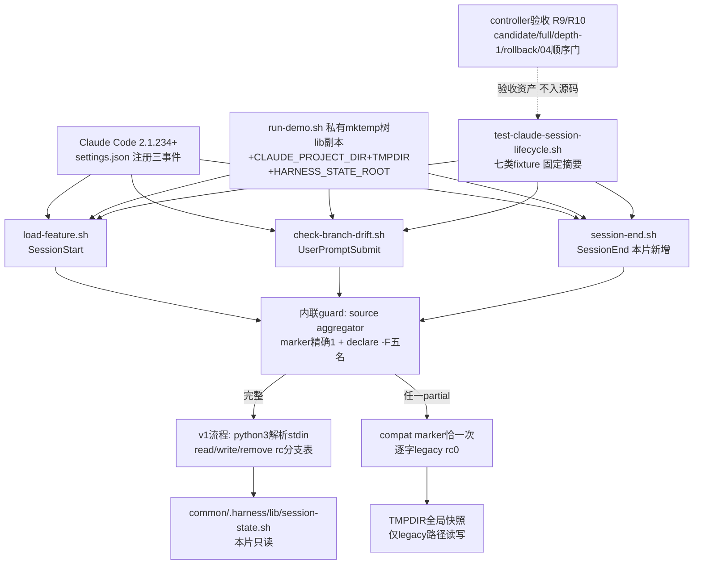

# 任务 1.2: 一次性交付run-demo.sh私有fixture改造

> 这是你的需求。数值、签名、命令一律照抄，不要自己发挥。
> 你只做这一个任务，不要顺手做别的。不要派 subagent。

---

## 任务相关上下文

下面只包含当前任务关联的需求、设计和上游契约。需要额外信息时返回
`NEEDS_CONTEXT`，不要猜测，也不要扩大任务范围。

### Requirements（当前 R + 验收契约）

> 用户原话：“$spec review 这套 aosp harness 工程，有哪些欠缺的地方，进行重构和完善”；并确认后续按 autopilot 执行。PLAN v5.7要求03e保留现有Claude hook/demo入口，只有marker精确为`1`且五个public API全存在才消费v1，fixture至少覆盖完整provider、aggregator缺席以及foundation/path/snapshot/signals/remove任一模块缺席，所有partial状态必须走legacy；SessionStart按source建立或读取基线，UserPromptSubmit检查漂移，SessionEnd同步幂等清理；demo在成功、受控失败和信号退出时只改自建mktemp子目录。DECISIONS.md 2026-09-01「03 requirements review round 1-3」与「round 2」两行已确认本片承接的Claude生命周期口径：UserPromptSubmit退出2阻止prompt；SessionStart错误只保证不创建/注入状态并报错，不宣称阻止会话；SessionEnd只保证hook被执行且未超时时的幂等清理；五种SessionStart source永不覆盖已有基线，startup/fork/clear/resume可在缺失时建立活跃生命周期基线，compact缺失报错；SessionEnd后resume建新基线，不宣称跨结束检测漂移；项目ID为权威物理根完整SHA-256；最低Claude Code版本2.1.234；SessionEnd经事件名/session ID/reason校验后删除目标已提交快照。

## 目标

适配现有Claude hook/settings/demo入口消费session-state-provider-v1：修改`claude-code/features/.harness/hooks/load-feature.sh`（SessionStart）与`claude-code/features/.harness/hooks/check-branch-drift.sh`（UserPromptSubmit）、新增`claude-code/features/.harness/hooks/session-end.sh`（SessionEnd）、修改`claude-code/features/.harness/settings.json`注册SessionEnd事件、修改`claude-code/run-demo.sh`收敛写入到自建mktemp子目录，并新增默认发现生命周期测试`tests/test-claude-session-lifecycle.sh`（CLI只接受无参数/`all`/唯一`--dependency-absent`/唯一`--session-provider-fixture <missing-foundation|missing-path|missing-snapshot|missing-signals|missing-remove|absent>`）——共exact六文件。三个hook仅当source aggregator后marker `HARNESS_SESSION_STATE_PROVIDER_VERSION`精确为`1`且`harness_validate_feature_name`/`harness_session_state_path`/`harness_session_state_write`/`harness_session_state_read`/`harness_session_state_remove`五public API逐个`declare -F`在场时才消费v1；任一partial状态（aggregator缺席、五模块任一缺席、session_id/source/reason/事件名非法、provider调用以设计外错误码返回）走legacy并输出compat marker `compat: session-provider=legacy`恰好一次。v1生命周期口径承接DECISIONS已确认行：project-id为权威物理根（realpath）完整SHA-256（64位小写hex，天然安全单组件）；SessionStart从stdin JSON解析`session_id`与`source`（startup/fork/clear/resume缺失时建立基线、compact缺失报错、五source永不覆盖已有基线）；UserPromptSubmit漂移时退出`2`阻止prompt；SessionEnd经事件名/session ID/`reason`校验后幂等清理；最低Claude Code版本2.1.234。SessionStart保持hook既有`sync_feature_link`软链同步行为；demo运行期间树根`CURRENT_FEATURE`始终只读。本片不修改上游十二tracked文件、不触碰codex/common/wrapper（08范围）、不新增稳定公共API；dependency-present active证据入ledger后才可启动04，inert或legacy-only PASS不能解除该顺序门。

## 需求

R7. [计划] 当`claude-code/run-demo.sh`以成功、受控失败或HUP/INT/TERM信号任一方式退出时，系统必须使其全部持久写入局限于自建`mktemp`子目录（hook演示在私有fixture中进行、真实`CURRENT_FEATURE`始终只读、不触发对`/tmp`全局快照的真实写入），并在EXIT trap中恢复任何被暂改的树根状态后删除该mktemp目录。（依据PLAN v5.7 03e详情「demo在成功、受控失败和信号退出时只改自建mktemp子目录」；codex/run-demo.sh已是该同构形态，本片对齐）

## 验收标准

主验证命令: bash ./tests/test-claude-session-lifecycle.sh
期望输出: dependency-present时退出码为`0`、stderr空，stdout逐字节精确为`RESULT PASS  claude session lifecycle\n`

验收清单:

- [ ] 三hook各自在完整provider下source aggregator后marker精确为`1`且五public API逐个在场时才启用v1；aggregator缺席与foundation/path/snapshot/signals/remove五模块各自缺席、session_id/source/reason/事件名非法、provider调用以设计外错误码返回的fixture中该hook走legacy、stdout含字面量`compat: session-provider=legacy`恰好一次、退出码0，完整五API predicate不形成partial capability。
- [ ] v1 SessionStart从stdin JSON解析`session_id`与`source`（五值校验），以权威物理根完整SHA-256为project-id；startup/fork/clear/resume缺失时建立基线、compact缺失报错不创建、基线已在场时任何source不改写、同值重写幂等不视为错误；现状`sync_feature_link`软链同步与人类可读stdout契约逐字保持。
- [ ] v1 UserPromptSubmit经read取基线与detect_feature当前值比较，漂移时告警文本沿用现状两行措辞且退出码为`2`（阻止prompt）、不写JSON；基线缺席或一致时零输出退出码0。
- [ ] SessionEnd在v1下经事件名/session ID/reason校验后remove幂等清理（重复调用第二次仍为成功；session ID、reason或事件名非法时不删除任何状态且不执行legacy清理），legacy下幂等删除全局快照文件（缺席不视为错误）；settings.json注册SessionEnd指向`session-end.sh`且python3 json解析通过。
- [ ] legacy路径行为与现状逐字一致（全局快照文件路径、字符串不等漂移判定、纯文本告警、退出码0不阻断）；v1路径不读写该legacy全局文件。
- [ ] run-demo.sh在成功、受控失败（某演示步骤预期非零）与HUP/INT/TERM信号三路径退出后：树根`CURRENT_FEATURE`内容逐字未变、`/tmp`全局快照缺席或被清理、自建mktemp目录已删除；demo的hook演示全部在mktemp私有fixture内进行。
- [ ] 真实dependency-present默认/all与隔离dependency-absent默认/flag均得唯一固定摘要`RESULT PASS  claude session lifecycle\n`，absent surface执行全部legacy行为case而非零case inert，但只有dependency-present active证据计入本片验收；`--session-provider-fixture`六值各自复现对应fixture surface；unknown/extra/flag带非法值rc1且无PASS。
- [ ] candidate/full/depth-1的默认入口与offline全PASS，offline发现本入口恰好一次，depth-1 commit-count=1且shallow marker非空；每个checkout的上游十二文件SHA-256测试前后不变且clean。
- [ ] 隔离rollback commit exact只回退本片六个交付文件后，clean checkout中03b基础测试、03b1 assurance入口、03c signals入口、03d provider入口与offline全PASS且本入口发现0次；04的spec/ref/worktree/BASE/dispatch按R10机械查缺席。
- [ ] review manifest六列、任务序号、execution BASE、相邻base/head、accepted HEAD和全PASS一次机械验证通过；BASE..HEAD exact name-only为上述六文件、numstat总和`<=400`，固定版本断言后对exact六文件中五个shell文件运行shfmt/ShellCheck/bash-n全绿、settings.json经python3 json解析核验，`git diff --check`和clean通过；只有dependency-present active证据入ledger后才可创建04。

不变量（不许劣化，2-4 项）:

- 上游十二tracked文件在execution BASE..HEAD的变更数 ≤ `0`，验证: `git diff --name-only "$BASE" "$HEAD" -- common/.harness/lib/session-state-foundation.sh common/.harness/lib/session-state-path.sh tests/lib/session-path-race-driver.py tests/test-session-path-races.sh common/.harness/lib/session-state-snapshot.sh tests/test-session-snapshot.sh tests/test-session-snapshot-assurance.sh common/.harness/lib/session-state-signals.sh tests/test-session-signals.sh common/.harness/lib/session-state-remove.sh common/.harness/lib/session-state.sh tests/test-session-state.sh`。
- SessionStart与SessionEnd在任一语义路径（v1/legacy/非法输入/provider设计外错误码）以非零退出码结束的次数 ≤ `0`，且UserPromptSubmit除v1漂移阻止（退出码`2`）外的非零退出次数 ≤ `0`，验证: `bash ./tests/test-claude-session-lifecycle.sh`七类fixture与错误注入行逐个核对退出码与compat marker计数。
- run-demo.sh退出后mktemp子目录外的净文件变更数 ≤ `0`（树根`CURRENT_FEATURE`逐字未变、`/tmp`全局快照缺席、无残留临时目录），验证: demo成功/受控失败/信号三路径前后对树根与`${TMPDIR:-/tmp}`做inventory比较。
- 既有Claude、Codex、common与已合入session回归失败数 ≤ `0`，验证: `bash ./scripts/check.sh --offline`。

## 超出范围

- 不修改codex/侧hooks、common/.claude、common/.harness与任何wrapper/resolver（08独占`harness_client_launch`与wrapper/Codex hook薄适配；本片不动`claude-code/features/.harness/bin/claude-feature`与`feature-common.sh`既有函数契约，除三hook与settings.json外不改`.harness`下其他文件）。
- 不修改上游十二tracked文件与02的`tests/COVERAGE.md`；不新增coverage fragment（PLAN.md:81对03e未列fragment，与03d不同）；不新增稳定公共API、不改变provider五API契约。
- 不实现04-runtime-resource-leases的任何资产；04的spec目录、`spec/`分支、worktree、ledger execution BASE、dispatch记录在本片dependency-present active证据入ledger前继续物理缺席。
- 不承诺跨SessionEnd的漂移检测（DECISIONS已确认「SessionEnd后resume建新基线，不宣称跨结束检测漂移」）、不承诺并发跨客户端复用同一session ID的保证（DECISIONS已确认排除）、不承诺hook对同EUID攻击者并发篡改session状态文件的额外防护（provider自身的verified路径与identity核对已覆盖本片威胁模型）；不调用真实Claude客户端、设备、网络、AOSP build，不push、不清理已有spec/prototype/implementation分支或worktree。

### Design

# 2026-09-03-03e-claude-session-lifecycle 设计

## 概述

exact 六文件：改写 `load-feature.sh`（SessionStart）与 `check-branch-drift.sh`（UserPromptSubmit）为「内联 guard 分流 v1/legacy」双路径形态，新增 `session-end.sh`（SessionEnd）并在 `settings.json` 注册第三事件，`run-demo.sh` 把全部 hook 演示收敛进自建 mktemp 私有树，新增默认发现测试。三 hook 仅当 source aggregator 后 marker 精确为 `1` 且五 public API 逐个 `declare -F` 在场才消费 v1；任一 partial 状态走 legacy 并在 stdout 输出 `compat: session-provider=legacy` 恰好一次、rc0 结束。v1 口径：project-id 为权威物理根（`realpath "$ROOT"`）完整 SHA-256；SessionStart 五 source 永不覆盖已有基线，startup/fork/clear/resume 缺失时建基线、compact 缺失报错不创建；UserPromptSubmit 漂移沿用现状两行措辞告警并 exit 2；SessionEnd 先校验事件名/session ID/reason 再幂等清理。

- 选择「provider guard 内联在三个 hook 各自文本里、aggregator 定位固定为 `$ROOT/../common/.harness/lib/session-state.sh`（`ROOT` 沿用现状 `${CLAUDE_PROJECT_DIR:-$(harness_project_root ...)}` 覆盖语义）」，因为本片 exact 六文件与不新增 `.harness` 下其他文件、不改 `feature-common.sh` 的约束使公共 guard 文件无处可放，接受三份 ~6 行重复；以 `$ROOT/..` 相对定位使 fixture/demo 只需在私有树旁放 `common/.harness/lib` 副本即可切换 v1/legacy，provider 物理缺席自动落 legacy，无需任何开关。放弃：把 aggregator 路径硬编码为仓库绝对路径（fixture 无法重定向）与只验 marker 或只验文件存在（foundation 单独 source 成功等中间态会假阳性发布 v1）。
- 选择「stdin JSON 用 embedded `python3 -c` 严格解析（codex 两个 hook 的既有先例），逐事件校验字段存在性、类型与值域；非法 JSON/缺字段/非法值与 provider 设计外错误码统一汇入各 hook 唯一 legacy 入口」，因为 bash 正则解析 JSON 不可靠、jq 是新外部依赖；python3 已是 codex 侧与 provider 五模块共同的既有下限，本片不抬高环境要求。放弃：复用 codex 的 `prepare_state_dir`/状态文件布局（v1 状态由 provider 五模块的 verified fd 链全权管理，hook 不直接读写任何 v1 状态文件）。
- 选择「SessionEnd 把 stdin 校验置于 provider/legacy 分流之后、任何删除之前：非法输入零删除（v1 状态与 legacy 全局快照均不动）只 marker+rc0；校验通过+legacy 才 `rm -f` 全局快照；校验通过+v1 经 remove 幂等清理且 provider 设计外错误码只 marker+rc0、不回退删除 legacy 快照」，因为 R5 要求校验失败不删任何状态、R6 要求 v1 路径不读写 legacy 全局文件，provider 出错时删 legacy 快照会把两条路径的状态语义混在一起。放弃：guard 先于校验短路（provider 缺席时非法输入会误触发 legacy 删除）与 provider 错误回退清理 legacy 文件（违反 R6）。
- 选择「每个 hook 定义单行 `compat_legacy()` helper，compat 字面量全文恰出现一次，所有 legacy 入口（guard 失败、stdin 非法、provider 设计外错误码）调用它恰好一次后执行 legacy 行为并 rc0」，因为「恰一次」由此获得双重机械保证：测试对每 hook 文本 `rg -o` 计数 ==1（结构），对每 case stdout 出现次数 ==1（行为）。放弃：在每个分支内联 printf（字面量多份，漏改一处即失去恰一次）。
- 选择「不设 mutant 自反证」，因为 03e 的 guard 合取两个子句各自已被机械覆盖：marker/API 缺席侧由七类 fixture（missing-* 时 aggregator fail-closed，marker 与四状态 API 同生同灭、hook 只能落 legacy）覆盖，且 hook 是全新进程、aggregator 临界区使「API 在场而 marker 缺席」物理不可达，sentinel 注入在 hook 级无对应可达状态；compat 恰一次由上述结构+行为双计数覆盖；v1 各分支（五 source、compact 缺失、漂移 exit 2、remove 幂等）都是直接行为断言。mutant 不新增信息（同 03d 对 aggregator 不设 mutant 的裁定逻辑）。

## 需求映射

| 组件 | 实现的需求 |
|---|---|
| 三 hook 内联 provider guard 与 compat marker 单点 | R1, R2 |
| `load-feature.sh` v1 SessionStart 流程 | R3 |
| `check-branch-drift.sh` v1 UserPromptSubmit 流程 | R4 |
| `session-end.sh` 与 `settings.json` SessionEnd 注册 | R5 |
| 两 hook legacy 段逐字保持与 v1/legacy 文件隔离 | R6 |
| `run-demo.sh` 私有 fixture 与单 EXIT trap | R7 |
| 默认发现测试 `tests/test-claude-session-lifecycle.sh` | R8 |
| controller 验收（candidate/full/depth-1/offline/manifest/exact6） | R9 |
| controller 独立回滚与 04 顺序门 | R10 |

## 架构

分层与边界：本片是 `session-state-provider-v1` 的第一个 consumer，只读消费 03d aggregator 发布的 marker+五 API，不修改上游十二 tracked 文件、不触碰 codex/common/wrapper/`feature-common.sh`/`.harness/bin`。三 hook 的物理位置仍是 `claude-code/features/.harness/hooks/`，经 `.claude` 软链被 Claude 以 `${CLAUDE_PROJECT_DIR}/.claude/hooks/...` 调用；hook 的 `ROOT` 是 claude-code 树根（现状覆盖语义逐字保留），provider 相对定位于 `$ROOT/../common/.harness/lib/`。技术栈不抬下限：Bash 4.4+（`declare -F` 多名一次核对）、coreutils `realpath`/`sha256sum`（project-id，64 位小写 hex 天然安全单组件）、Python 3.8+（仅 stdin JSON 解析，codex hook 与 provider 五模块同一先例）、最低 Claude Code 2.1.234（SessionEnd reason 五值表——2.1.234 起 `bypass_permissions_disabled` 已移除——与 fork source 的官方事件契约下限，承接 DECISIONS 已确认行）。hook 主流程保持 `set -euo pipefail`；v1 逻辑收进在 `if` 条件中调用的函数，条件调用使 `set -e` 在函数体内抑制，所有 provider rc 以 `|| rc=$?` 显式捕获进分支表，不存在被 `set -e` 截断的隐式出口。

## 组件与接口

### 对外契约（frontmatter 产出，逐字）

`claude-session-lifecycle-v1 —— Claude SessionStart/UserPromptSubmit/SessionEnd三hook的生命周期行为契约（marker+五API完整才消费v1 provider，任一partial状态走legacy并输出compat marker `compat: session-provider=legacy`；project-id为权威物理根完整SHA-256；SessionStart按source分级建/读基线；UserPromptSubmit漂移退出2阻止prompt；SessionEnd经事件名/session ID/reason校验后幂等清理）plus tests/test-claude-session-lifecycle.sh固定摘要`RESULT PASS  claude session lifecycle`；不新增稳定公共API`

### 消费契约（03d provider，本片只读，逐字）

`session-state-provider-v1的完整capability：marker HARNESS_SESSION_STATE_PROVIDER_VERSION精确为1且五个public API全存在（harness_validate_feature_name <name>；harness_session_state_path <project-id> <session-id>；harness_session_state_write <project-id> <session-id> <feature>；harness_session_state_read <project-id> <session-id>；harness_session_state_remove <project-id> <session-id>；path成功path+LF/0，write/read常规0|1|2|3、write异值冲突与read缺失3、write信号129|130|143，remove缺失幂等0、OS错1、协议/安全错2）；03d accepted ledger中的03e启动门（dependency-present active证据checks=72、exact4/400、full/depth-1/rollback与03e顺序门证据，无其他运行时API）`

本片只消费其中 validate/read/write/remove 四名与 marker；`harness_session_state_path` 不参与 hook 流程但必须在 guard 中点名（完整 capability 合取的一项）。

### 三 hook 内联 provider guard 与 compat marker 单点

- 职责：每个 hook 开头以同一段 ~6 行内联 guard 判定 `use_v1`：`source "$ROOT/../common/.harness/lib/session-state.sh" 2>/dev/null` 成功、`HARNESS_SESSION_STATE_PROVIDER_VERSION` 精确为 `1`、`declare -F harness_validate_feature_name harness_session_state_path harness_session_state_write harness_session_state_read harness_session_state_remove` 单条多名核对全在场，三者合取才置 1；`source` 失败天然覆盖 aggregator 文件缺席，无需单独 `-f` 检查。
- 对外接口：无新公共接口。`compat_legacy() { printf '%s\n' 'compat: session-provider=legacy'; }` 单行 helper，字面量每 hook 文本恰一次；所有 legacy 入口（guard 失败、stdin 非法、provider 设计外错误码）调用恰一次后执行该 hook 的 legacy 行为并以 rc0 结束。marker 一律写 stdout。
- 依赖：aggregator 的 fail-closed 契约（partial 时 marker 与四状态 API 同灭）；`ROOT` 的现状覆盖语义。

### `load-feature.sh` v1 SessionStart 流程

- 职责：guard 通过时按 source 分级建/读基线；guard 失败或 v1 内 partial 时落 legacy。
- 对外接口：无；hook 协议（stdin JSON、stdout 文案、exit code）为本片产出的组成部分。
- 精确流程：v1 函数 `v1_baseline` 在 `if` 条件中调用——(1) `python3 -c` 从 stdin 解析 `session_id`/`source`：JSON 非法、字段缺失/非字符串、`source` 非 startup/fork/clear/resume/compact 五值之一 → return 1；(2) `harness_validate_feature_name "$sid" 2>/dev/null` 安全单组件校验，rc 非 0 → return 1；(3) `project_id=$(printf '%s' "$(realpath -- "$ROOT")" | sha256sum)` 取 `%% *` 截断；(4) `read` rc 分支表：rc0 → 基线已在场，任何 source 只读、根本不 write（同值幂等由此自然成立，不视为错误）；rc3 → source=compact 时报 stderr 固定一行报错、不创建、继续走 sync+messages 以 rc0 结束，其余四 source 进入 write；rc 其他 → return 1（设计外错误码落 legacy）；(5) `write` rc 分支表：rc0 → 基线建立；rc3 → 异值冲突，stderr 报错、不改写（五 source 永不覆盖），继续 rc0；rc 其他 → return 1；(6) 随后与 legacy 共用的尾部：`sync_feature_link "$ROOT" "$target"` 与现状两条人类可读 stdout 文案逐字保持，v1 全程不读写 legacy 全局快照文件、不输出 compat marker。return 1 时主流程 `compat_legacy` 一次后执行逐字 legacy 段（含 `cat >/dev/null` 排水、`printf '%s'` 覆盖写全局快照、sync、messages）rc0。`feature`/`target` 探测与「未找到 feature 上下文」stderr 文案+exit 0 分支为两路径共用现状逻辑，逐字保留。错误保证只到「不创建/注入状态并报错」，不宣称阻止会话，任何语义路径 rc0。
- 依赖：guard 组件的肯定结论、provider read/write rc 契约、`feature-common.sh` 既有 `detect_feature`/`feature_context_path`/`sync_feature_link`（本片不修改）。

### `check-branch-drift.sh` v1 UserPromptSubmit 流程

- 职责：guard 通过时 read 基线与 `detect_feature` 当前值做字符串比较；否则落 legacy。
- 对外接口：无；hook 协议同上。
- 精确流程：v1 函数在 `if` 条件中调用——(1) `python3 -c` 仅解析 `session_id`（同样的类型/值域校验）+ `harness_validate_feature_name` → 非法 return 1；(2) project-id 同 SessionStart；(3) `read` rc 分支表：rc3 基线缺席 → 静默 exit 0；rc 其他非 0 → return 1 落 legacy；rc0 → 与 `detect_feature "$ROOT"` 当前值字符串比较，一致静默 exit 0，漂移则输出与现状逐字相同的两行告警（首行 `⚠️ [分支漂移] 会话注入时在 '<基线>'，现在切到了 '<当前>'。`，次行 `   当前会话仍含旧上下文；退出后用 .claude/bin/claude-feature 重启，别拿旧分支约定改新分支。`）并 `exit 2` 阻止该 prompt，不写 JSON。return 1 时 `compat_legacy` 一次后执行逐字 legacy 段（读全局快照、字符串不等告警、rc0 不阻断）。不宣称跨 SessionEnd 漂移检测（SessionEnd 后 resume 已按 R3 建新基线）。
- 依赖：guard 组件、provider read rc 契约、`detect_feature`。

### `session-end.sh` 与 `settings.json` SessionEnd 注册

- 职责：校验事件名/session ID/reason 后按 v1/legacy 幂等清理；`settings.json` 新增 `SessionEnd` 事件指向 `${CLAUDE_PROJECT_DIR}/.claude/hooks/session-end.sh`（与既有两事件同一 schema）。
- 对外接口：无；hook 协议同上。
- 精确流程：(1) 内联 guard 置 `use_v1`；(2) `python3 -c` 解析并一次性校验 stdin：`hook_event_name` 必须精确为 `SessionEnd`、`session_id` 必须 1–128 长度且匹配安全单组件形态 `[A-Za-z0-9][A-Za-z0-9._-]*`（legacy 路径无 provider 可用，故校验内嵌于解析器，规则与 foundation 同源）、`reason` 必须属于 `clear`/`resume`/`logout`/`prompt_input_exit`/`other` 五值（依据官方 SessionEnd reason 表（最低版本 2.1.234 起，`bypass_permissions_disabled` 已移除）与 DECISIONS 已确认行；requirements 为最高约束）——任一非法：`compat_legacy` 一次、rc0、零删除（v1 状态与 legacy 全局快照均不动）；(3) 校验通过+v1：project-id 同前，`harness_session_state_remove` rc 分支表：rc0（含状态缺失幂等 0）→ 静默 rc0；rc 其他（1/2/3 均视为设计外）→ `compat_legacy` 一次、rc0、不删 legacy 快照；(4) 校验通过+legacy：`compat_legacy` 一次后 `rm -f -- "${TMPDIR:-/tmp}/.aosp-harness-demo.feature-snapshot" 2>/dev/null || true`（缺席幂等、`rm` 失败也不破坏 rc0 不变量）。只保证 hook 被执行且未超时时的幂等清理。
- 依赖：guard 组件、provider remove rc 契约；`settings.json` 以 python3 json 解析核验。

### legacy 段与 v1/legacy 文件隔离

- 职责：两既有 hook 的 legacy 段行为与现状逐字一致；v1 路径与 legacy 全局快照互不触碰。
- 对外接口：无。
- 精确口径：`load-feature.sh` legacy 段保留 `printf '%s'` 覆盖写 `${TMPDIR:-/tmp}/.aosp-harness-demo.feature-snapshot`、`sync_feature_link` 与两条 stdout 文案；`check-branch-drift.sh` legacy 段保留 `tr -d '[:space:]'` 读快照、字符串不等判定、纯文本两行告警、rc0 不阻断。两段文本尽量逐字保留在原相对顺序以压缩 numstat；唯一新增输出是段首 compat marker 一行。v1 路径不读写该全局文件（测试以 TMPDIR 重定向后断言文件缺席做行为证明）。`session-end.sh` 的 legacy 清理是本片新增行为，无现状可比。
- 依赖：现状两 hook 文本（设计基线）。

### `run-demo.sh` 私有 fixture 与单 EXIT trap

- 职责：demo 全部 hook 演示在自建 mktemp 私有树进行；成功/受控失败/HUP/INT/TERM 三路径退出只改 mktemp 子目录。
- 对外接口：无。
- 精确结构：开头 `DEMO_TMP_DIR=$(mktemp -d)`，单一 EXIT trap 只 `rm -rf -- "$DEMO_TMP_DIR"`——新设计不暂改任何树根状态（真实 `CURRENT_FEATURE` 全程零写入、只读都不需要），故 trap 无恢复动作，三退出路径共用同一清理点；现状 `orig`/`restore_feature` 整段删除。fixture 布局：`$DEMO_TMP_DIR/tree/claude-code/`（`CURRENT_FEATURE`、`features/dev-sidebar/CLAUDE.md`、`features/dev-next/CLAUDE.md`）+ `$DEMO_TMP_DIR/tree/common/.harness/lib/`（`cp` 仓库 `common/.harness/lib/session-state*.sh` 副本）+ 私有 `TMPDIR="$DEMO_TMP_DIR/tmp"` 与 `HARNESS_STATE_ROOT="$DEMO_TMP_DIR/state"`。hook 演示以 `CLAUDE_PROJECT_DIR=$tmp/tree/claude-code TMPDIR=... HARNESS_STATE_ROOT=...` 调用真实 hook 文件：aggregator 相对定位命中 lib 副本 → 演示 v1 全生命周期——SessionStart（startup payload）建基线并展示 state 树、UPS 无漂移零输出、改写私有 `CURRENT_FEATURE` 后 UPS exit 2 两行告警（此即受控失败演示：demo 断言 rc==2 后继续）、SessionEnd（reason=clear）清理并展示 state 树消失。install-harness、wrapper dry-run、分支一致性、流程层、verify、回归各节保留现状。
- 依赖：三 hook 的 `CLAUDE_PROJECT_DIR` 覆盖语义与 provider 的 `HARNESS_STATE_ROOT` 根选择；codex/run-demo.sh 的同构形态（mktemp+drift-root，本片对齐）。

### 默认发现测试

- 职责：实现 `bash ./tests/test-claude-session-lifecycle.sh` 的 CLI 分流、v1 生命周期矩阵、七类 fixture、legacy surface 与固定摘要。
- 对外接口：无参数或 `all` 按依赖探测分流；唯一 `--dependency-absent` 强制 legacy surface；唯一 `--session-provider-fixture <missing-foundation|missing-path|missing-snapshot|missing-signals|missing-remove|absent>` 单跑对应 fixture；成功 stdout 逐字 `RESULT PASS  claude session lifecycle\n`、stderr 空、rc0；unknown 参数、extra 参数、flag 带值、fixture 缺值/非法值均 rc1 且不打印 PASS。
- 依赖：本片六文件、上游十二 tracked 文件只读、固定 shfmt `v3.14.0`/ShellCheck `0.11.0`、`bash/python3/rg/find/stat/sha256sum/realpath/mktemp/git`。

### controller 验收与 04 顺序门（验收资产，不进入源码文件）

- 职责：执行 R9/R10 的机器核对，全部证据入 ledger 后才允许创建 04-runtime-resource-leases 的任何资产。
- 验收动作：candidate、完整历史 checkout、真实 `git clone --depth 1 file://...` 分别运行默认 lifecycle 测试与 `bash ./scripts/check.sh --offline`，offline 发现本入口恰好一次，depth-1 commit-count=1 且 shallow marker 非空；每个 checkout 的上游十二 tracked 文件 SHA-256 测试前后不变且 clean；逐字验证 shfmt `v3.14.0` 与 ShellCheck version field `0.11.0` 后只对本片 exact 六文件中五个 shell 文件运行 `shfmt -d -i 2 -ci -bn`、`shellcheck -x --severity=warning`、`bash -n`，`settings.json` 以 python3 json 解析核验；execution BASE 到 accepted HEAD exact 只变更目标节六文件、numstat 总和 ≤400、六列 review manifest 与 tasks 一一对应、首尾/相邻连续、reviewer 非空且全 PASS、`git diff --check` 与 worktree clean 通过；从 accepted HEAD 建隔离临时分支提交 exact 只回退本片六文件的 rollback commit（删两新增、恢复四修改），clean checkout 中 03b 基础测试、03b1 assurance 入口、03c signals 入口、03d provider 入口与 offline 全绿、本入口发现 0 次；04-runtime-resource-leases 的 spec 目录/分支/worktree/ledger BASE/dispatch 记录按 R10 以 `ls -d` 缺席、`git show-ref` 零匹配、`git worktree list --porcelain` 零匹配与 `rg` 对 ledger/dispatch/execution-base 记录零匹配机械查缺席（requirements/design/tasks 文档允许出现 NEXT 全名，禁令只针对 ledger/dispatch/execution-base 三类记录）。
- 依赖：本片 accepted HEAD、dependency-present active 证据、exact6/400 与全 PASS manifest 入 ledger；inert 或 legacy-only PASS 不作为本片验收证据，也不解除该顺序门。

## 错误处理

| 错误场景 | 恢复策略 | 校验位置 | 日志 | 用户可见 |
|---|---|---|---|---|
| aggregator 缺席/source 非零/marker 非精确 1/五 API 任一缺席 | 该 hook 本次走 legacy，不形成 partial capability | 内联 guard 三合取 | 无 | stdout compat marker 恰一次、rc0 |
| stdin 非 JSON/缺字段/类型错 | 落 legacy（SessionEnd 为零删除 legacy） | hook 内 python3 解析器 | 无 | compat 恰一次、rc0 |
| SessionStart `source` 非五值 / `session_id` 非安全单组件 | 落 legacy | 解析器值域检查 + `harness_validate_feature_name` | 无 | compat 恰一次、rc0 |
| SessionEnd 事件名/session ID 非法或 reason 非 `clear`/`resume`/`logout`/`prompt_input_exit`/`other` 五值之一 | 零删除（v1 状态与 legacy 快照均不动），不执行 legacy 清理 | 解析器一次性校验 | 无 | compat 恰一次、rc0 |
| v1 SessionStart read rc0（基线在场） | 任何 source 只读，根本不 write | read rc 分支表 | 无 | 现状 sync+messages、rc0 |
| v1 SessionStart compact 且 read rc3 | 不创建基线，报错后继续 sync+messages | read rc 分支表 | stderr 固定一行 | 现状 stdout 文案、rc0 |
| v1 SessionStart write rc3（异值冲突） | 不改写（五 source 永不覆盖），报错后 rc0 | write rc 分支表 | stderr 固定一行 | 现状 stdout 文案、rc0 |
| provider 任一调用设计外错误码（read/write rc1/2、remove rc1/2/3 等） | 落 legacy（SessionEnd 不删 legacy 快照） | 各 rc 分支表 `*) return 1` | 无 | compat 恰一次、rc0 |
| v1 UserPromptSubmit 基线缺席（read rc3） | 静默通过 | read rc 分支表 | 无 | 零输出、rc0 |
| v1 UserPromptSubmit 漂移 | 现状两行措辞告警，exit 2 阻止 prompt，不写 JSON | 字符串比较 | 无 | 两行告警、exit 2 |
| legacy UserPromptSubmit 漂移 | 现状行为：同样两行告警但 rc0 不阻断 | legacy 段逐字 | 无 | 两行告警、rc0 |
| SessionEnd 重复调用/状态已缺席 | remove 缺失幂等 0；legacy `rm -f` 缺席幂等 | remove rc 分支表 / `rm -f \|\| true` | 无 | 静默/compat、rc0 |
| SessionEnd legacy `rm` 自身失败 | `\|\| true` 吸收，保持 rc0 不变量 | legacy 清理行 | 无 | compat 恰一次、rc0 |
| demo 成功/受控失败/HUP/INT/TERM 退出 | 单 EXIT trap 删除 mktemp 目录，树根零净变更 | run-demo.sh trap | 无 | 三路径均净零 |
| CLI unknown/extra/flag 带值/fixture 缺值/非法值 | 拒绝且不进入任何分支 | 测试入口参数解析 | 无 | rc1、无 PASS |
| 真实依赖缺席或 `--dependency-absent` | 运行同一 legacy surface（全部 legacy 行为 case，非零 case inert） | 测试入口依赖探测 | 无 | 同一固定摘要、rc0 |
| 任一 case 失败 | 累计 failures，末行不打印 PASS | 统一 check/failures 计数器 | 失败详情到 stderr | rc1、无 PASS |

## 测试策略

| 层 | 测什么 | 用什么工具 |
|---|---|---|
| 单元/结构 | CLI 四态（无参数/all 接受，unknown/extra/flag 带值/fixture 缺值/非法值 rc1 无 PASS）；三 hook 文本结构核对：compat 字面量 `rg -o` 恰 1 处、guard 含 marker 精确比较与 `declare -F` 五名（各 `rg` 锚定）；测试文件自身固定摘要 printf 调用恰 2 处（同 03d 裁定）；`settings.json` python3 json 解析且 SessionEnd 注册指向 `session-end.sh`；project-id 行为核对：fixture 树的预期 SHA-256 目录名在 HARNESS_STATE_ROOT 下出现 | `bash`、`rg`、`python3`、`sha256sum`、`realpath` |
| 集成（v1 生命周期，dependency-present 主体） | SessionStart：startup/fork/clear/resume 循环各建基线（状态文件在场、内容==feature）；compact 缺失报错不创建（rc0、stderr 一行、状态缺席）；已在场+任意 source 不改写（内容逐字不变）；同值幂等 rc0 无错；非法 session_id/source/ malformed JSON 三行各落 legacy（marker 恰一次、全局快照按 legacy 写入、v1 状态缺席）；v1 后 `CLAUDE.md` 软链指向私有 feature 上下文且 TMPDIR 无全局快照。UserPromptSubmit：无漂移零输出 rc0；漂移 exit 2 且两行告警与期望逐字相等；基线缺席静默 rc0；非法 session_id 落 legacy。SessionEnd：reason=clear 清理后状态树消失、重复调用仍 rc0；reason=resume 合法清理一行（五值集覆盖）；事件名/session ID 非法与 reason 值集外（如 `bogus`）三行各零删除（v1 状态与预置 legacy 快照均在场）+marker 恰一次；provider 设计外错误码注入（`HARNESS_STATE_ROOT=/` 触发 rc2）落 legacy | `bash ./tests/test-claude-session-lifecycle.sh`（主验证命令）、mktemp fixture 树、`env CLAUDE_PROJECT_DIR/TMPDIR/HARNESS_STATE_ROOT` |
| fixture（七类） | 完整 provider（即上条 v1 矩阵）；`absent`（无 aggregator）与 missing-foundation/path/snapshot/signals/remove：mktemp 内建 `tree/claude-code` + `tree/common/.harness/lib` 副本并按类删模块文件，三 hook 各以合法 stdin 运行——rc0、stdout compat marker 出现次数 ==1、执行对应 legacy 行为、v1 状态树缺席/为空；missing-* 时 aggregator fail-closed 使完整五 API predicate 为 false（hook 只能落 legacy，无任何 partial capability 可观测量） | 同上入口 + `--session-provider-fixture` 六值、隔离 fixture shell |
| legacy/absent surface | `absent` fixture 与 `--dependency-absent` 执行全部 legacy 行为 case（非零 case inert）：SessionStart 覆盖写全局快照（内容==feature）+sync+messages+marker 恰一次；UserPromptSubmit 漂移两行告警 rc0 不阻断（与 v1 的 exit 2 对照）、无漂移静默；SessionEnd 幂等删除全局快照、重复 rc0；真实依赖缺席时默认/all 自动分流到同一 surface、同一固定摘要 | 同上入口 + `--dependency-absent` |
| mutant 自反证 | 不设置（论证见「概述」末条：guard 两子句由七类 fixture 与结构核对机械覆盖，compat 恰一次由结构+行为双计数覆盖，v1 分支全是直接行为断言，mutant 不新增信息） | 不适用 |
| 端到端/收敛（demo + controller 验收资产） | demo 成功路径：真实 `CURRENT_FEATURE` 字节不变、`${TMPDIR:-/tmp}` 全局快照缺席、无残留 `claude-harness-demo.*` 目录、rc0；受控失败路径由 demo 内 UPS exit 2 断言自证；信号路径由单 EXIT trap 结构核对（`rg` 锚定唯一 trap 与 `rm -rf`）覆盖，不做非确定性中途注信号。candidate/full/depth-1 各跑默认入口与 offline（发现本入口恰好一次）；上游十二 tracked 文件 SHA-256 前后不变；rollback commit exact 回退六文件后 03b/03b1/03c/03d 入口与 offline 全绿、本入口发现 0 次；04 五类资产机械查缺席 | `bash claude-code/run-demo.sh`、inventory 比较、`git clone --depth 1 file://...`、`rg`、`ls -d` |
| 静态与 sizing | 固定版本断言后对 exact 六文件中五个 shell 文件 `shfmt -d -i 2 -ci -bn`、`shellcheck -x --severity=warning`、`bash -n`；settings.json python3 json 核验；execution BASE..HEAD exact name-only 六文件、numstat 总和 ≤400；六列 manifest 机械验证；`git diff --check` 与 clean 通过 | shfmt `v3.14.0`、ShellCheck `0.11.0`、`bash -n`、Git/awk controller 命令 |
| 性能 | 不适用：hook 为会话事件级单次调用，无吞吐/延迟 SLO；`timeout` 仅作测试防挂死兜底 | `timeout` |

测试必须将 stdout/stderr 落文件后按字节比较，禁止用会吞尾随 LF 的 command substitution 验证成功流；成功唯一摘要为 `RESULT PASS  claude session lifecycle\n`（PASS 后两个空格）。只有 dependency-present active 证据计入本片验收并解除 04 顺序门；legacy-only PASS 不计入。

sizing 承诺：execution diff exact6 且 `git diff --numstat` 总和 ≤400（修改文件新增+删除均计入）。这是**纯分解预算**，无 runnable prototype；分解依据是现状文件实测行数（load-feature.sh 27、check-branch-drift.sh 18、run-demo.sh 63、settings.json 11）与同构实际尺寸（03d 测试 204 行、codex 两 hook 的 python3 解析段）。行数预算分解：`load-feature.sh` ≤52（保留现状 ~22 行逐字：header/ROOT/detect/target/排水/快照写/sync/messages；新增 guard 6、compat 1、`v1_baseline` ~30、分派 ~6、注释 ~3，删除过期注释 ~5）；`check-branch-drift.sh` ≤42（保留 ~18 行逐字；新增 guard 6、compat 1、v1 函数 ~24、分派 4）；`session-end.sh` ≤52（新增文件：header/ROOT 8、compat 1、python3 校验解析 ~10、guard 6、remove 分支+legacy 清理 ~12、结构注释 ~6）；`settings.json` ≤6（SessionEnd 注册块 +4）；`run-demo.sh` ≤62（保留 install/wrapper/一致性/流程/验证/回归 ~45 行；新增 mktemp+trap ~10、私有树+lib 副本 ~12、v1 hook 演示 ~20；删除 orig/restore_feature/旧漂移段 ~16）；`tests/test-claude-session-lifecycle.sh` ≤176（CLI 与引导 12、helper 24、fixture 构建 12、v1 SessionStart 26、v1 UPS 14、v1 SessionEnd 20、legacy/absent surface 20、七类 fixture 循环 14、结构核对 12、argv 表 8、demo 10、摘要 4）；合计 ≤390，保留 ≥10 行余量。若 tasks 或执行期预计/实际超出，立即回 PLAN 拆片（备选：`run-demo.sh` 收敛与 hook 生命周期无代码耦合，可拆为独立小片），不压缩任何 oracle 语义。

## 文件清单

| 文件 | 创建/修改 | 职责（一句话） |
|---|---|---|
| `claude-code/features/.harness/hooks/load-feature.sh` | 修改 | SessionStart：内联 guard 分流，v1 按 source 分级建/读基线，legacy 段逐字保留，compat marker 单点 |
| `claude-code/features/.harness/hooks/check-branch-drift.sh` | 修改 | UserPromptSubmit：内联 guard 分流，v1 read 基线比较漂移 exit 2，legacy 段逐字保留 |
| `claude-code/features/.harness/hooks/session-end.sh` | 创建 | SessionEnd：校验事件名/session ID/reason 后 v1 remove 幂等清理或 legacy 幂等删除全局快照，非法输入零删除 |
| `claude-code/features/.harness/settings.json` | 修改 | 新增 SessionEnd 事件注册指向 `session-end.sh`（既有两事件不动） |
| `claude-code/run-demo.sh` | 修改 | demo 收敛到自建 mktemp 私有树演示 v1 全生命周期，单 EXIT trap 清理，真实 `CURRENT_FEATURE` 只读 |
| `tests/test-claude-session-lifecycle.sh` | 创建 | 默认发现的 shfmt-clean 入口：CLI 分流、v1 生命周期矩阵、七类 fixture、legacy surface 与固定摘要 |

验收资产（不纳入源码文件清单）：逐 task review 报告、六列 review manifest、candidate/full/depth-1/rollback 运行日志与 inventory 比较记录、accepted HEAD 与 ledger execution BASE 证据、04-runtime-resource-leases 五类资产（spec 目录/分支/worktree/ledger BASE/dispatch 记录）缺席的机械核对记录。门③通过前不创建 implementation worktree 或固定 execution BASE；dependency-present active 证据、exact6/400 与全 PASS manifest 入 ledger 前不创建 04 的 spec 目录/分支/worktree/BASE/dispatch 记录。

### 上游任务契约

#### 任务 1.1: 一次性交付三hook与settings.json注册

文件: 修改 `claude-code/features/.harness/hooks/load-feature.sh` / 修改 `claude-code/features/.harness/hooks/check-branch-drift.sh` / 创建 `claude-code/features/.harness/hooks/session-end.sh` / 修改 `claude-code/features/.harness/settings.json`
产出: claude-hook-lifecycle-contract-v1

---

## 你的任务

文件: 修改 `claude-code/run-demo.sh`
验收资产（不纳入源码文件清单）: 创建 `.spec/2026-08-31-aosp-harness-refactor/work/2026-09-03-03e-claude-session-lifecycle/evidence/task-1.2-red.txt` / 创建 `.spec/2026-08-31-aosp-harness-refactor/work/2026-09-03-03e-claude-session-lifecycle/task-1.2-report.md` / 修改 `.spec/2026-08-31-aosp-harness-refactor/work/2026-09-03-03e-claude-session-lifecycle/review-manifest.tsv`
消费: claude-hook-lifecycle-contract-v1
产出: claude-demo-private-fixture-v1
需求: R7
必需: 是

候选文件权威结构（design「run-demo.sh 私有 fixture 与单 EXIT trap」节）：开头`DEMO_TMP_DIR=$(mktemp -d "${TMPDIR:-/tmp}/claude-harness-demo.XXXXXX")`（带前缀模板，裁定 10：残留断言必须能把 demo 建的目录与同机其他进程的临时目录区分开），单一 EXIT trap 只`rm -rf -- "$DEMO_TMP_DIR"`——新设计不暂改任何树根状态（真实`CURRENT_FEATURE`全程零写入），故 trap 无恢复动作，成功/受控失败/HUP/INT/TERM 三退出路径共用同一清理点；现状`orig`/`restore_feature`整段与旧漂移演示段删除。fixture 布局：`$DEMO_TMP_DIR/tree/claude-code/`（`CURRENT_FEATURE`、`features/dev-sidebar/CLAUDE.md`、`features/dev-next/CLAUDE.md`）+`$DEMO_TMP_DIR/tree/common/.harness/lib/`（`cp`仓库`common/.harness/lib/session-state*.sh`副本）+私有`TMPDIR="$DEMO_TMP_DIR/tmp"`与`HARNESS_STATE_ROOT="$DEMO_TMP_DIR/state"`。hook 演示以`CLAUDE_PROJECT_DIR`/`TMPDIR`/`HARNESS_STATE_ROOT`三变量调真实 hook 文件演示 v1 全生命周期：SessionStart（startup payload）建基线并展示 state 树、UserPromptSubmit 无漂移零输出、改写私有`CURRENT_FEATURE`后 UPS exit 2 两行告警（受控失败演示：demo 断言 rc==2 后继续）、SessionEnd（reason=clear）清理并展示 state 树消失；install-harness、wrapper dry-run、分支一致性、流程层、verify、回归各节保留现状。

- [ ] 步骤 1: 行为红（不用文本代理红）——建 `tmp=$(mktemp -d)`，`git clone --no-local . "$tmp/democlone"`，**先 `mkdir -p "$tmp/demotmp"`**（不建这个目录，`load-feature.sh:19` 的重定向会直接失败、demo 以 rc1 早死且快照根本不生成，红因就不是 R7 那件事了），再在该 clone 内以私有 `TMPDIR="$tmp/demotmp"` 运行现状 `bash claude-code/run-demo.sh`；红的主断言：demo rc0 且结束后 `test -e "$tmp/demotmp/.aosp-harness-demo.feature-snapshot"` 为真、内容为 `dev-sidebar`（现状 demo 往 `${TMPDIR:-/tmp}` 写全局快照，即 R7 的真实缺陷；clone + 私有 TMPDIR 双重隔离，实测真实 `/tmp` 零污染）。第二个合取项「demo 期间 clone 树根 `CURRENT_FEATURE` 被改写后才由 `restore_feature` 还原」在 run 结束后已被 EXIT trap 还原、事后不可观测，故改为源码级观察并记入 red 证据：`rg -n 'echo "dev-next" > CURRENT_FEATURE' claude-code/run-demo.sh`（现状 :39）与 `rg -n 'trap restore_feature EXIT' claude-code/run-demo.sh`（现状 :17）各命中一行；落证据：本步骤的全部命令与输出落 `$WORK/evidence/task-1.2-red-run.log`，固定六行 schema 的 `$WORK/evidence/task-1.2-red.txt` 里 `command=` 写这一跑的主命令（`TMPDIR="$tmp/demotmp" bash claude-code/run-demo.sh`）、`expected=` 写「快照生成即 R7 缺陷在场」、`assertion=` 逐字记「rc0 / 快照路径 / 快照内容 sha256 / 两条 `rg` 命中行号 39 与 17 / 日志路径 `evidence/task-1.2-red-run.log`」（六行 schema 的字段不够装这些事实时一律进 `assertion=` 并由它引日志路径，不得增删 schema 行）；核 `test -s "$WORK/evidence/task-1.2-red.txt"` 与 `test -s "$WORK/evidence/task-1.2-red-run.log"`；`rm -rf -- "$tmp"`。
- [ ] 步骤 2: 设`TASK_BASE=$(git rev-parse HEAD)`并核其逐字等于任务 1.1 的`TASK_HEAD`（manifest 相邻连续）；用 apply_patch 一次性交付完整改造候选（禁止逐段拼装），结构核对：`test "$(rg -c 'trap' claude-code/run-demo.sh)" = 1`（唯一 trap）、`rg -qF 'rm -rf -- "$DEMO_TMP_DIR"' claude-code/run-demo.sh`、`! rg -q 'restore_feature' claude-code/run-demo.sh`、`rg -q 'HARNESS_STATE_ROOT' claude-code/run-demo.sh`、`rg -qF 'common/.harness/lib' claude-code/run-demo.sh`（lib 副本段在场）；立即核 v1 hook 演示段实际行数消耗（裁定 8 M2 纪律）并记入 green 报告草稿，超预算即停手上报。
- [ ] 步骤 3: 逐字核固定工具版本`test "$("$TOOLS/shfmt" --version)" = "v3.14.0"`与`"$TOOLS/shellcheck" --version | rg -q '^version: 0.11.0$'`；对该单文件跑`"$TOOLS/shfmt" -d -i 2 -ci -bn claude-code/run-demo.sh`（无输出）、`"$TOOLS/shellcheck" -x --severity=warning claude-code/run-demo.sh`（rc0）、`bash -n claude-code/run-demo.sh`与`git diff --check`，全部通过。
- [ ] 步骤 4: 三路径验收实跑——建 `tmp=$(mktemp -d)`；成功路径：记录真实`CURRENT_FEATURE` sha256 后运行`bash claude-code/run-demo.sh >"$tmp/demo.log" 2>&1`核 rc0，核真实`CURRENT_FEATURE`前后 sha256 逐字不变、`${TMPDIR:-/tmp}/.aosp-harness-demo.feature-snapshot`缺席、demo 私有树零残留——`test -z "$(ls -d "${TMPDIR:-/tmp}"/claude-harness-demo.* 2>/dev/null)"`（前缀 glob 断言，不做 /tmp 全量 inventory 比较，避免同机其他进程造成竞态）；并按 requirements 不变量第 3 条点名的验证方法补一次 inventory 比较，**四步严格有序，不得合并或调序**：(1) `mkdir -p "$tmp/demotmp"`；(2) 采前值 `find "$tmp/demotmp" | sort >"$tmp/priv.before"` 与 `find . -maxdepth 2 -not -path './.git/*' | sort >"$tmp/root.before"`；(3) 跑 `TMPDIR="$tmp/demotmp" bash claude-code/run-demo.sh >"$tmp/demo-private.log" 2>&1` 核 rc0；(4) 采后值到 `$tmp/priv.after`/`$tmp/root.after`（find 表达式与深度必须与 (2) 逐字相同）并`cmp -s "$tmp/priv.before" "$tmp/priv.after"`、`cmp -s "$tmp/root.before" "$tmp/root.after"` 双双通过。前值必须在跑之前采——两次都在跑完后采会让这条 oracle 退化成空转。安静的私有目录、零竞态，既满足不变量的字面验证方法，也能抓到 demo 往 `${TMPDIR:-/tmp}` 下**其他**路径的意外写入；上面 ambient `TMPDIR` 那一跑的定点断言保留，证明默认路径同样干净；受控失败路径由 demo 内 UPS exit 2 断言自证（demo 整体 rc0 即证明 rc==2 断言通过并继续）；信号路径由步骤 2 的单 EXIT trap 结构核对覆盖，不做非确定性中途注信号（design 测试策略节）；结束后`rm -rf -- "$tmp"`。
- [ ] 步骤 5: 提交——`git add -N claude-code/run-demo.sh`后核 working-tree `git diff --name-only`恰为该单文件、`git diff --numstat | awk '{s+=$1+$2} END {print s+0}'`≤62；`git add claude-code/run-demo.sh`（intent-to-add 不入提交，必须真 add）后`git commit -m "refactor(claude): confine demo writes to private mktemp tree"`；设`TASK_HEAD=$(git rev-parse HEAD)`并核`git diff --name-only "$BASE_SHA" "$TASK_HEAD"`恰为任务 1.1 四文件加本文件共五文件、`git diff --numstat "$BASE_SHA" "$TASK_HEAD" | awk '{s+=$1+$2} END {print s+0}'`≤214、`git diff --name-only "$BASE_SHA" "$TASK_HEAD" -- $UPSTREAM12`为空、`git status --porcelain`为空（累计断言必须用 execution BASE `$BASE_SHA`——`$TASK_BASE` 仅保留给步骤 6 的 manifest 行与相邻连续性）。
- [ ] 步骤 6: 生成 task brief/report、4 参`review-package.sh "$TASK_BASE" "$TASK_HEAD" "$PROJECT/work" 2026-09-03-03e-claude-session-lifecycle`及 evidence package，取得独立 diff review PASS；有 fix 则更新`TASK_HEAD`、重跑步骤 2–5 并交全新 reviewer。PASS 后由 controller 运行`printf '2\ttask-1.2\t%s\t%s\t%s\tPASS\n' "$TASK_BASE" "$TASK_HEAD" "$REVIEWER" >>"$MANIFEST"`；随后分别 mark 1.2、apply_patch 写 ledger 锚点、sync-ledger。

## 报告契约

完整报告写进控制器指定的 `task-N-report.md`（路径由控制器给出）。

返回控制器的只有：
- **Status**：`DONE` / `DONE_WITH_CONCERNS` / `NEEDS_CONTEXT` / `BLOCKED`
- **Commits**：本任务产生的 commit 列表
- **一行测试摘要**：例如 `Ran 12 tests, OK`
- **顾虑**：如有

