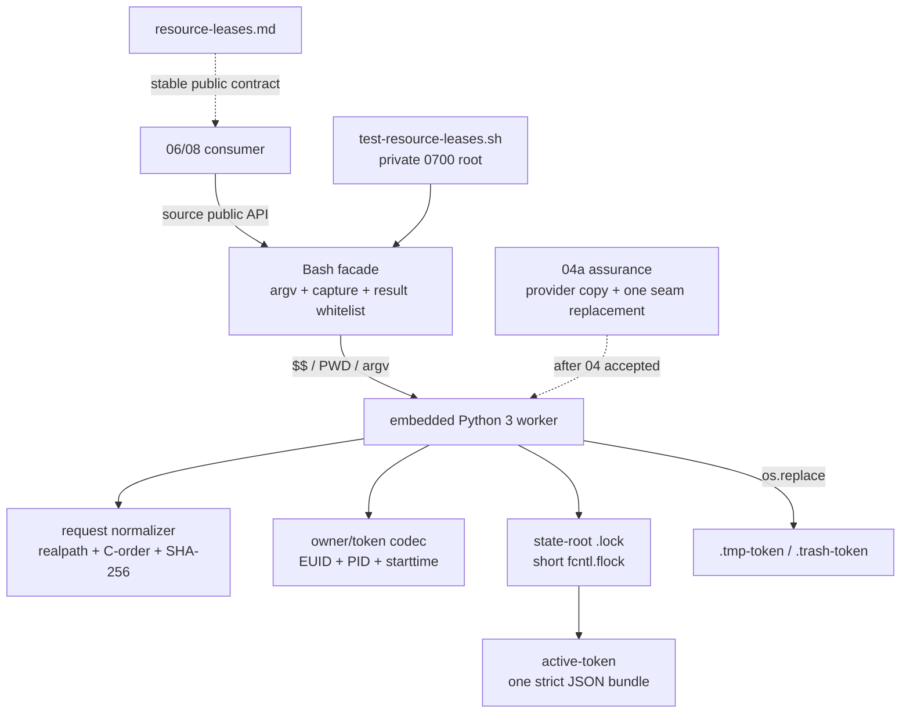

# 任务 1.1: 安装资源租约 runtime provider

> 这是你的需求。数值、签名、命令一律照抄，不要自己发挥。
> 你只做这一个任务，不要顺手做别的。不要派 subagent。

---

## 任务相关上下文

下面只包含当前任务关联的需求、设计和上游契约。需要额外信息时返回
`NEEDS_CONTEXT`，不要猜测，也不要扩大任务范围。

### Requirements（当前 R + 验收契约）

> 用户原话：“$spec review 这套 aosp harness 工程，有哪些欠缺的地方，进行重构和完善”；并确认后续按 autopilot 执行。PLAN v5.8 要求本片实现跨进程组合租约并保留全部运行时正确性、完整协议与代表性基础合同测试；完整 TSV/root/stored-state/I/O/concurrency/adapter mutation 矩阵由紧随其后的 04a 独占。稳定 public API、request TSV、owner、bundle 原子性、wait/stale/release 与 `0|2|3` 协议不因拆片变化。

## 目标

交付 `resource-leases-v1`：新增 `common/.harness/lib/resource-leases.sh`、`docs/resource-leases.md`、`tests/test-resource-leases.sh` 三文件。source 库文件后 `declare` 可见 `harness_lease_acquire` 与 `harness_lease_release` 两个公开函数，签名分别为 `harness_lease_acquire <session-id> <wait-seconds> <request-tsv>` 与 `harness_lease_release <lease-token>`。request 的 `domain` 只允许 `workspace|android`，workspace 的 `canonical_id` 用调用时 `PWD` 与 `realpath` 规范化，android 的 `canonical_id` 是安全 instance ID；状态命名空间由 `HARNESS_RESOURCE_LEASE_ROOT` 或默认运行时根唯一选择。每个规范 `domain+canonical_id` 是跨逻辑 owner 完全独占的资源键，mode 只标识用途，不把同 mode 降级为共享。一个 request 作为单个 bundle 只在唯一 publish 点整体可见，释放也先在唯一 unpublish 点整体失效。acquire 成功 stdout 唯一 token+LF，release 成功双流空，返回码 `0|2|3`；provider 仅保留恰一个私有 no-op `HARNESS_RESOURCE_LEASE_TEST_SEAM` anchor，运行时不由环境激活。本片不 source 03 会话模块、不设置 `HARNESS_SESSION_STATE_PROVIDER_VERSION`、不调用真实 ADB/CVD/AOSP build、不修改 02 的 `tests/COVERAGE.md` 与 03e/session 既有文件；本片 accepted/dependency-present 证据入 ledger 后只可启动 04a，04a 缺席或 inert PASS 不得启动 05/06/08。

## 需求

R1. [计划] 当调用方 source `common/.harness/lib/resource-leases.sh` 时，系统必须返回 0、定义且仅新增 `harness_lease_acquire` 与 `harness_lease_release` 两个公开函数（均可 `declare`），不得定义会话状态四 API、不得设置 `HARNESS_SESSION_STATE_PROVIDER_VERSION`、不得 source 03 会话模块。（依据 PLAN.md:82 独占「lease 公共库」与 PLAN.md:138 产出两函数签名）
R2. [计划] 当调用 `harness_lease_acquire <session-id> <wait-seconds> <request-tsv>` 时，系统必须把第三参当作普通文件路径读取 TSV：每行恰好 `domain<TAB>canonical_id<TAB>mode` 三列；`domain` 只能是 `workspace` 或 `android`；只接受四组合法 domain/mode 对；workspace 行必须以 `realpath` 成功得到且不含 ASCII 控制字节的绝对路径作为 `canonical_id` 键；android 行必须以安全单组件 `android-instance-id` 作为 `canonical_id` 键，ADB serial 与 CVD name 不得作为 lease key。（依据 PLAN.md:138 与 DECISIONS.md 2026-08-31 I1）
R3. [计划] 当一次 request 含一行或多行时，系统必须先生成术语所定的规范 request 与 SHA-256，再把整个 request 作为单个 bundle 在一个 publish 点全有或全无地对其他 owner 可见；任一失败路径不得留下 active 的部分 bundle。不同逻辑 owner 只要 request 与已有 bundle 的任一 `domain+canonical_id` 相交，无论两边 session 是否相同、mode 相同或不同，都是占用；同一 request 内规范键重复则在 publish 前返回 2。（依据 PLAN.md:55,138 「跨会话独占租约」「多资源按 domain+canonical_id 排序后全部获取或全部释放」）
R4. [计划] 当 `harness_lease_acquire` 参数合法且目标资源可立即持有或在等待窗口内可持有时，系统必须返回 0、stderr 空，并向 stdout 只打印当前 active bundle 中唯一的 token 加一个 LF。只有「逻辑 owner 相同 + `session-id` 相同 + request hash 相同」的完整重入才必须幂等返回既有 token/0；同 owner 对已持有键的任何其他部分重叠、子集、超集、session 变化或 request 变化都必须立即返回 2，不进入等待；同 owner 的不相交 request 可分别持有。（依据 PLAN.md:138「acquire stdout 唯一 token」「token 必须与 owner/session/request hash 同时匹配」）
R5. [计划] 如果发生参数个数错、`session-id` 非安全单组件、`wait-seconds` 非 `0..300` 十进制整数、request 非可读普通文件或不符合规范 request、domain/mode 非法、workspace `realpath` 失败或结果含 `0x00..0x1f`/`0x7f`、android instance ID 非法、同 owner 持有键上发生非完整重入，或逻辑 owner、SHA-256、状态根、状态完整性、必需工具、时钟与 I/O 任一无法安全判定，系统必须 fail closed 返回 2，stdout 空且 stderr 逐字节为 `error: resource lease operation failed\n`。acquire 的该类失败不得发布新 active bundle；清理未发布临时资产失败仍返回 2，其残留不得被解析为 active 租约。（依据 PLAN.md:138 返回码 2=协议/所有者错且只允许 `0|2|3`、DECISIONS.md 2026-08-31 I1/I2）
R6. [计划] 当调用 `harness_lease_release <lease-token>` 且 active bundle 记录的 token、owner 三元组、session 与由存储的规范 request 重算的 hash 全部自洽且当前逻辑 owner 匹配时，系统必须先在单一 unpublish 点使整个 bundle 对其他 acquire 失效，再清理其状态，成功返回 0 且双流空。缺参/多参、token 不存在或重复释放、owner 不匹配、session/request/hash 元数据被篡改、状态或 I/O 失败必须返回 2 与 R5 的固定双流，且不得 unpublish 任何无法完整验证或属于其他 owner 的 bundle。（依据 PLAN.md:138「release 成功无 stdout」「token 必须与 owner/session/request hash 同时匹配」）
R7. [计划] 在有界等待与持有期间，系统必须使 `wait-seconds=0` 只尝试一次，正值从首次尝试前的 monotonic 时钟计算 deadline，在 deadline 到达时做最后一次无 sleep 尝试后停止。不同存活 owner 的任意键相交都不得抢占：窗口耗尽返回 3，stdout 空且 stderr 逐字节为 `error: resource lease unavailable\n`；stale-owner bundle 必须先整体 unpublish 再允许新 owner 获取。同 owner 重叠且不是 R4 完整重入时按 R5 立即返回 2，不等待自己。（依据 PLAN.md:138「有界等待、主动释放和 stale-owner 回收，不抢占存活 owner」）

## 验收标准

主验证命令: bash ./tests/test-resource-leases.sh
期望输出: 退出码为 `0`、stderr 空，stdout 逐字节精确为 `RESULT PASS  resource leases\n`

验收清单:

- [ ] source `common/.harness/lib/resource-leases.sh` 后 `declare` 可见 `harness_lease_acquire` 与 `harness_lease_release`，不可见四个会话状态 public API，且 `HARNESS_SESSION_STATE_PROVIDER_VERSION` 未被本库设置。
- [ ] 合法 workspace key 等于以调用时 `PWD` 解析的 `realpath`；android key 等于安全 instance ID，serial/CVD name 不进入 provider key；完整双 adapter 主动反证由 04a 独占。
- [ ] 规范 request 至少一行并以 LF 结尾，无空行/CR/NUL；workspace `realpath` 结果含任一 ASCII 控制字节时 rc 2；逆序的同一组行得到同一 hash/token；任一规范 `domain+canonical_id` 重复（同 mode、异 mode 或 workspace 原始别名）均在 publish 前返回 2。
- [ ] 不同 owner 对同 key 的同 mode/异 mode 都返回 3；同 owner+session+hash 完整重入返回既有 token/0，其余键重叠立即返回 2；不相交 bundle 可同时持有，反向多键并发无 active 部分 bundle。
- [ ] 参数/request/状态根/状态完整性/工具/时钟/I/O 无法安全判定均 rc 2、stdout 空且 stderr 为固定 operation-failed 行，不发布新 active bundle；占用/超时 rc 3 且 stderr 为固定 unavailable 行。
- [ ] acquire 成功 stdout 恰好 token+LF 且 stderr 空；release 成功在单一点使 bundle 整体失效，rc 0 且双流空；错误/他人/重复 token 及 owner/session/request/hash 任一篡改返回 2，不释放其他 bundle。
- [ ] wait=0 只尝试一次；正值使用 monotonic deadline 且有最后一次无 sleep 尝试；stale-owner 和 PID 复用记录整体回收；存活 owner 超时后原 token 仍可正常 release。耗时只用宽容 outer timeout 防卡死，主 oracle 用 barrier 与状态。
- [ ] 状态根默认选择与显式 override 均一致；软链/非目录/异 owner/非 0700 根 fail closed；每次测试只使用独立 `mktemp -d` 根，成功 release 后 active/临时/墓碑记录均为 0，前后完整 inventory 相同。
- [ ] `docs/resource-leases.md` 含 R8 所列完整 public contract，不需阅读本 requirements 即可实现 06/08 的 provider-present consumer。
- [ ] 默认与 `all` 得到唯一固定摘要 `RESULT PASS  resource leases\n`；unknown/extra 返回 1 且无该摘要；库文件缺席时无该摘要；provider 内 `HARNESS_RESOURCE_LEASE_TEST_SEAM` 恰一处且本片测试不启用。
- [ ] candidate/full/depth-1 的默认入口与 `bash ./scripts/check.sh --offline` 退出 0，offline 发现本入口恰好一次，depth-1 commit-count=1 且 shallow marker 非空。
- [ ] 门③真实可运行、fixed-shfmt 三文件 prototype 为 exact3=`336+7+57=400/400`；验收时 BASE..HEAD exact 三文件且 numstat 总和 `<=400`，rollback 只回退这三文件后 03e 入口与 offline 全绿、本入口发现 0；04a 的真实 spec/ref/worktree/BASE/dispatch 按 R10 机械查缺席。

不变量（不许劣化，2-4 项）:

- execution BASE..HEAD 除 `common/.harness/lib/resource-leases.sh`、`docs/resource-leases.md`、`tests/test-resource-leases.sh` 外的变更文件数 ≤ `0`，验证: `git diff --name-only "$BASE" "$HEAD"`。
- 对存活 owner 的抢占次数 ≤ `0`，验证: `bash ./tests/test-resource-leases.sh` 中不同 owner 的相交 request 返回 3，原 holder token 仍可 release；同/异 mode 与正值超时穷举由 04a 继续反证。
- 成功 `harness_lease_release` 之后 active/临时/墓碑记录总数 ≤ `0`，验证: `bash ./tests/test-resource-leases.sh` 在私有状态根 release 前后做完整 inventory。
- 既有 Claude 生命周期与离线门禁失败数 ≤ `0`，验证: `bash ./tests/test-claude-session-lifecycle.sh` 与 `bash ./scripts/check.sh --offline`。

## 超出范围

- 不实现 06 的 `harness_command_run`、不实现 08 的 wrapper/`compat: lease-provider=legacy` 输出；provider 缺席时 06/08 的 absent fixture 由那两片各自交付。
- 不修改 02 的 `tests/COVERAGE.md`、`scripts/check.sh` 或 CI workflow；不新增 coverage fragment（PLAN.md:82 对 04 只列三文件）。
- 不修改 03e 独占六文件与 session 上游十二 tracked 文件；不 source 03 会话模块。
- 不调用真实 ADB、CVD、AOSP build、Claude/Codex 客户端或外部网络；lease 库本身不发起 device/CVD 命令。
- 不交付 `tests/test-resource-leases-assurance.sh`，不在本片启用 test seam；完整 assurance 只由 04a 新增单文件。
- 不创建 04a 的真实 spec 目录、`spec/` 分支、worktree、ledger execution BASE 或 dispatch 记录，直到本片 dependency-present 证据入 ledger；不创建 05/06/08，直到 04a active 验收门通过。
- 不发布、不 push。

### Design

# 2026-09-04-04-runtime-resource-leases 设计

## 概述

在单个 Bash 库内以两个公开函数包装 embedded Python worker：facade 捕获并白名单验证 worker 的私有结果；worker 在 EUID 私有状态根内用短时 `flock` 串行化状态变更，以单个 active bundle record 的原子 rename 作 publish/unpublish 线性化点，持有期不持全局锁。

- 选择「捕获/校验结果的 Bash facade + 单文件 embedded Python 3 worker」，因为 Python 标准库直接提供 `fcntl.flock`、`time.monotonic`、`os.replace`、SHA-256、base64 与严格 JSON，Bash 又能把损坏 Python 的任意 rc/双流收敛到稳定 public 协议。放弃直接透传 worker（工具损坏会泄漏输出/退出码）与纯 Bash `mkdir` 多锁（组合回滚复杂）。
- 选择「一个 request 对应一个 bundle record，协调锁只在扫描/发布/撤销时持有」，因为单文件 rename 给出唯一 publish/unpublish 点，observer 只能看到完整 bundle 或看不到。放弃逐键长期锁（存在部分获取窗口）和持有期全局大锁（不相交资源也被串行）。
- 选择「owner=`EUID+$$+/proc starttime`、token绑定 owner/session/request-hash/nonce、生产文本唯一私有 no-op seam」，因为 command substitution 中 `$$` 不变且 starttime 可识别 PID 复用，04a 又能只复制 provider 并替换一个稳定 anchor。放弃 `BASHPID`/仅PID、未绑定元数据的随机 token，以及由环境直接激活生产 seam。

## 需求映射

| 组件 | 实现的需求 |
|---|---|
| Bash public facade 与 source surface | R1, R4, R5, R6 |
| request normalizer 与 owner/token codec | R2, R3, R4, R5, R6 |
| state root、coordination lock 与 bundle store | R3, R4, R5, R6, R7 |
| 唯一私有 no-op seam | R9 |
| `docs/resource-leases.md` | R8 |
| `tests/test-resource-leases.sh` | R1, R2, R3, R4, R5, R6, R7, R8, R9 |
| controller 静态/checkout/rollback/NEXT 门 | R10 |

## 架构

边界：facade 负责公开签名、Python 版本探针、私有 capture、结果 shape 白名单和固定 public 输出；worker 是唯一持久状态 owner，request/owner/token/store 都是内部实现。06/08 只依赖两个函数与协议文档，不解析 JSON、状态路径或 seam，并且必须再等待 04a dependency-present 证据。本片不 source session provider、不调用 ADB/CVD/build、不提供 adapter。

技术下限：Linux `/proc`、Bash 4.4+、Python 3.8+ 标准库。workspace 规范化用 Python 3.8 已支持的 `pathlib.Path.resolve(strict=True)`；非 Linux、旧 Python 或 `/proc` 不可安全读取时按 R5 rc2，不降级为 PID-only owner。

## 组件与接口

### 消费契约（frontmatter `消费`，逐字）

`scripts/check.sh --offline|--ci 的根测试自动发现约定：本片产出默认可执行的 tests/test-resource-leases.sh，由 gate 按 LC_ALL=C 字典序发现；成功时 scripts/check.sh --offline 退出 0 且 stdout 末行为 RESULT PASS  aosp-harness offline quality gate。本片不调用 check.sh 作为独立判据，也不修改 02 的 tests/COVERAGE.md。`

### 产出契约（frontmatter `产出`，逐字）

`resource-leases-v1 —— source common/.harness/lib/resource-leases.sh 后 declare 可见 harness_lease_acquire <session-id> <wait-seconds> <request-tsv> 与 harness_lease_release <lease-token>；request-tsv 为至少一行的普通文件，每行 domain<TAB>canonical_id<TAB>mode；workspace canonical_id 以调用时 PWD 解析后的 realpath 绝对路径为键，android canonical_id 为安全单组件 android-instance-id（不是 serial 或 CVD name）；任意不同逻辑 owner 对同一 domain+canonical_id 的任意合法 mode 都互斥；逻辑 owner 为 EUID+$$+进程起始标识，请求按 C locale 规范化后取 SHA-256；acquire 成功 stdout 唯一 token+LF、release 成功双流空；两者 0 成功、2 协议/所有者/状态或 I/O 错、3 占用/超时；配套完整协议 docs/resource-leases.md 与 tests/test-resource-leases.sh 固定摘要 RESULT PASS  resource leases`

### Bash public facade

- 职责：source 时只新增 `harness_lease_acquire`、`harness_lease_release` 两个 `harness_*` public function；校验 argv 与 Python>=3.8，用 `mktemp -d` 文件捕获 worker 双流/rc，并在写入前验证 capture 是绝对路径、匹配本次模板长度/前缀、EUID 自有、0700、空且非软链的真目录。acquire rc0 只用 Bash builtin 一次读取完整 capture，拒绝 NUL 并接受 stderr空与32-byte lower-hex token+LF（不调用外部 `wc`），release rc0只接受双流空；只有 acquire 可接受 worker rc3，其他 rc/shape 一律转 public rc2。`mktemp`/`rm`/`rmdir` 的私有诊断均静默，清理只点名删除 capture 内的 `out`/`err` 再 `rmdir`，不递归删除 helper 返回路径；失败统一转固定 public rc2。worker 已 publish 后的任意 facade 校验或清理失败，按已捕获 token 调内部 release 撤销 active。
- 对外接口：`harness_lease_acquire <session-id> <wait-seconds> <request-tsv>`；`harness_lease_release <lease-token>`。
- 依赖：Bash `$$`、`python3`、`mktemp/rm/rmdir`。capture 清理后才输出；public token stdout 写失败时，以同 owner 内部 release 回收刚发布 bundle 再返回 rc2。worker 在状态变更前 `fstat` fd1/2，关闭输出通道时不得 publish；facade 在打开可消失的 capture 路径前先重定向 stderr，shell 自身诊断也不得泄漏。

### request normalizer 与 owner/token codec

- 职责：binary 读取普通 request 文件，验证非空/末LF/无空行CR NUL/恰三列/四组合法pair；新 request 的 workspace 以传入PWD做 strict realpath，拒绝结果中的控制字节，android验安全单组件；按domain+canonical-id的C字节序排序、拒绝重复key、重序列化并取SHA-256。stored request 不重新访问可能已消失的 workspace，而是要求其 workspace 字节为绝对、`normpath` 后逐字不变且非双斜杠起始，再重做 pair/排序/唯一性/逐字节 canonical/hash 校验；因此 `/ws/../ws`、`/ws/.`、重复斜杠等自洽伪记录仍 fail closed。owner从`/proc/<$$>/stat`最后`)`之后取field22 starttime；token是规范JSON `[owner,session,hash,nonce]` 的SHA-256前32hex。
- 对外接口：无；内部值为 `(canonical-bytes, request-hash, key-set)` 与 `[EUID,PID,starttime]`。
- 依赖：Python filesystem `surrogateescape`、procfs、`secrets.token_hex(16)`、SHA-256；canonical bytes 不经过 shell 文本变量。

### state root、bundle store 与协调状态机

- 职责：状态根取非空 `HARNESS_RESOURCE_LEASE_ROOT`，否则 `${XDG_RUNTIME_DIR:-/tmp}/aosp-harness-resource-leases-$EUID`；仅接受绝对、非软链、EUID自有0700真目录。`.lock` 用 `O_NOFOLLOW` 打开并验regular/EUID/0600。每次持短 exclusive flock：先严格恢复合法 tombstone、解析全部active并拒绝全局key重叠，再清 stale，最后执行重入/冲突/publish 或 release/unpublish。
- 对外接口：沿用两个 public function 的 `0|2|3` 和固定双流；状态目录不是 API。
- 依赖：单个 `.tmp-* -> active-<token>` rename 是 bundle publish；`active-* -> .trash-*` rename 是 unpublish，随后 unlink。wait用`time.monotonic()` deadline、每次释放flock后最多sleep 50ms，并在deadline到达时做最后一次无sleep尝试。

### 04a 私有测试 seam

- 职责：embedded Python 保留恰一处 `HARNESS_RESOURCE_LEASE_TEST_SEAM` anchor 与默认只返回原值的 `test_seam(point, value=None)`。生产 provider 不读取 fault 环境变量。04a 在临时副本中逐字替换 anchor+默认函数，为root/lock/clock/publish/unpublish/cleanup注入确定性返回值或I/O错。
- 对外接口：无；不属于`resource-leases-v1`，06/08不可调用或探测。
- 依赖：04a先断言anchor恰一处；provider缺席时inert PASS，存在但类型/anchor/source/API/协议损坏时fail closed。

### 协议文档、基础测试与 controller

- 职责：`docs/resource-leases.md` 独立记载 R8 public contract；`tests/test-resource-leases.sh` 交付 R9 代表性基础合同，完整主动反证不塞回本片；controller 执行 R10 固定工具、candidate/full/depth-1/offline/rollback 与04a五类NEXT缺席门。
- 对外接口：`bash ./tests/test-resource-leases.sh`；成功 stdout逐字`RESULT PASS  resource leases\n`、stderr空、rc0。
- 依赖：Bash/Python/Git/coreutils，固定 shfmt `v3.14.0`、ShellCheck version field `0.11.0`。

## 测试策略

| 层 | 范围 | 工具/判据 |
|---|---|---|
| 04基础合同 | source后全部`harness_*`恰两API且marker缺席；33-byte token framing、逆序完整重入、换session self-overlap、异owner占用、不相交、死owner stale、空request、非法stored request、tombstone恢复、版本探针后恶意worker、完整顶层inventory allowlist；default/all/extra/library-absent | `tests/test-resource-leases.sh`、私有0700根、capture文件逐字比较；source/unknown/inventory-failure/framing四个定点mutant证明oracle非假绿 |
| 04a完整assurance（后序独占） | control/root、同owner子/超/部分重叠、反向bundle barrier、PID reuse、monotonic最终尝试、全record字段/filename/nonregular/global overlap/存量非规范workspace、flock/open/write/fsync/publish+unpublish replace/unlink、伪`python3`/`mktemp`/`rm`、closed output、双adapter与mutants | 本片`prototypes/assurance/tests/test-resource-leases-assurance.sh`仅作04a sizing证据；最终文件由04a创建，不纳入本片源码清单/验收 |
| 协议文档 | R8签名、schema、root、owner、hash、矩阵、等待/stale/release/错误表与实现常量对应 | `rg -F`结构核对 + 基础行为 |
| checkout/rollback | candidate/full/depth-1默认+offline发现恰1；rollback后03e/offline绿且本入口0；04a五类真实资产缺席 | Bash/Git、真实`git clone --depth 1 file://...`、隔离rollback branch |
| 静态/sizing | fixed shfmt/ShellCheck/bash-n；exact3 name-only与numstat≤400；manifest连续PASS；diff-check/clean | shfmt3.14.0、ShellCheck0.11.0、Git/awk |
| 性能 | 无吞吐SLO；只保证wait有界且不卡死 | monotonic deadline + 宽容outer timeout；精确并发时钟反证在04a |

public framing 一律落 capture 文件后按字节比较。基础测试最终先校验 `find` 成功，再检查完整顶层 allowlist：除可选持久 `.lock` 外不得存在任何已知或未知资产。

### Runnable fixed-format sizing prototype

本 spec 的 `prototypes/` 与终交付三路径同构：

| 原型文件 | fixed-shfmt 后行数 | 证明点 |
|---|---:|---|
| `prototypes/common/.harness/lib/resource-leases.sh` | 336 | facade收敛/输出回滚、normalizer、strict record/global overlap、owner/token、flock、publish/unpublish、wait/stale/tombstone与唯一no-op seam |
| `prototypes/docs/resource-leases.md` | 7 | 不反读requirements即可消费的完整public contract骨架 |
| `prototypes/tests/test-resource-leases.sh` | 57 | R9基础合同、framing、恶意worker、完整inventory与固定摘要 |
| **合计** | **400 / 400** | **exact3零余量；tasks机械复制同构blob，不临时扩机制** |

固定 shfmt逐字`v3.14.0`、ShellCheck version field `0.11.0`；两shell的shfmt diff无输出，ShellCheck warning级与bash-n均rc0；基础default/all逐字PASS，extra rc1无摘要；四个基础mutant均rc1且无PASS。

04a sizing原型`prototypes/assurance/tests/test-resource-leases-assurance.sh`为fixed-shfmt exact1=`398/400`，default/all/`--dependency-absent`逐字PASS、extra rc1；只替换唯一seam，并以overlap/unpublish/bundle/adapter四类mutant自反证。它是验收资产，不得复制进本片最终三文件。若任务落地使04核心超过400，必须回流PLAN，不从生产机制或R9基础oracle删行。

## 文件清单

| 文件 | 创建/修改 | 职责（一句话） |
|---|---|---|
| `common/.harness/lib/resource-leases.sh` | 创建 | 两个Bash public API与embedded worker，实现结果收敛、规范化、owner/token、bundle原子性、wait/stale/release |
| `docs/resource-leases.md` | 创建 | 让06/08无需反读内部spec即可消费的完整resource-leases-v1协议 |
| `tests/test-resource-leases.sh` | 创建 | 默认发现的代表性基础合同、public framing/worker收敛/inventory oracle与固定PASS摘要 |

验收资产（不纳入源码文件清单）：门③core三文件与04a单文件sizing prototypes、固定工具/运行/mutant日志；逐task red/green/review证据、六列review manifest、candidate/full/depth-1/offline/rollback/04a NEXT缺席门日志、accepted HEAD/execution BASE记录。

### 上游任务契约

无：当前任务不消费其他任务产出。

---

## 你的任务

文件: 创建 `common/.harness/lib/resource-leases.sh`
验收资产（不纳入源码文件清单）: 创建 `.spec/2026-08-31-aosp-harness-refactor/work/2026-09-04-04-runtime-resource-leases/task-1.1-brief.md` / 创建 `.spec/2026-08-31-aosp-harness-refactor/work/2026-09-04-04-runtime-resource-leases/evidence/task-1.1-red.txt` / 创建 `.spec/2026-08-31-aosp-harness-refactor/work/2026-09-04-04-runtime-resource-leases/evidence/task-1.1-static.log` / 创建 `.spec/2026-08-31-aosp-harness-refactor/work/2026-09-04-04-runtime-resource-leases/evidence/task-1.1-source.out` / 创建 `.spec/2026-08-31-aosp-harness-refactor/work/2026-09-04-04-runtime-resource-leases/evidence/task-1.1-source.err` / 创建 `.spec/2026-08-31-aosp-harness-refactor/work/2026-09-04-04-runtime-resource-leases/task-1.1-report.md` / 创建 `.spec/2026-08-31-aosp-harness-refactor/work/2026-09-04-04-runtime-resource-leases/evidence/task-1.1-package.tsv` / 创建 `.spec/2026-08-31-aosp-harness-refactor/work/2026-09-04-04-runtime-resource-leases/review-manifest.tsv`
消费: 无
产出: `resource-leases-runtime-v1`（source 后仅公开 `harness_lease_acquire <session-id> <wait-seconds> <request-tsv>` 与 `harness_lease_release <lease-token>`）
需求: R1, R2, R3, R4, R5, R6, R7
必需: 是

- [ ] 步骤 1: 生成 task brief；运行 `cmp -s common/.harness/lib/resource-leases.sh "$SPEC/prototypes/common/.harness/lib/resource-leases.sh"`，确认红阶段因目标文件缺席返回非零，并按固定 schema 写 `task-1.1-red.txt`。
- [ ] 步骤 2: 核 `git rev-parse HEAD`=`BASE_SHA` 且 clean；机械复制 prototype 到 `common/.harness/lib/resource-leases.sh`，不得手工重排或删减 embedded Python、唯一 `HARNESS_RESOURCE_LEASE_TEST_SEAM` no-op anchor、capture preflight/rollback 与 bundle 状态机。
- [ ] 步骤 3: 运行 `cmp -s common/.harness/lib/resource-leases.sh "$SPEC/prototypes/common/.harness/lib/resource-leases.sh"`、`test "$(wc -l <common/.harness/lib/resource-leases.sh)" = 336`、固定 `shfmt -d -i 2 -ci -bn`、ShellCheck warning级与 `bash -n`，命令/结果写入 `$WORK/evidence/task-1.1-static.log`；另在隔离Bash中source并把双流写入 `$WORK/evidence/task-1.1-source.out/.err`，核source静默、全部 `harness_*` 函数排序结果逐字只有两个public API、session marker缺席、seam marker恰一处。
- [ ] 步骤 4: `git add common/.harness/lib/resource-leases.sh && git commit -m "feat(harness): add resource lease runtime"`；固定 `TASK_HEAD`，核本提交 exact 只新增该文件且 numstat 336、工作树 clean。
- [ ] 步骤 5: 写 green 报告/evidence package并交独立 diff review；PASS 后追加 manifest 第1行（`BASE_SHA -> TASK_HEAD`），mark 1.1、写 ledger、sync-ledger。

## 报告契约

完整报告写进控制器指定的 `task-N-report.md`（路径由控制器给出）。

返回控制器的只有：
- **Status**：`DONE` / `DONE_WITH_CONCERNS` / `NEEDS_CONTEXT` / `BLOCKED`
- **Commits**：本任务产生的 commit 列表
- **一行测试摘要**：例如 `Ran 12 tests, OK`
- **顾虑**：如有

