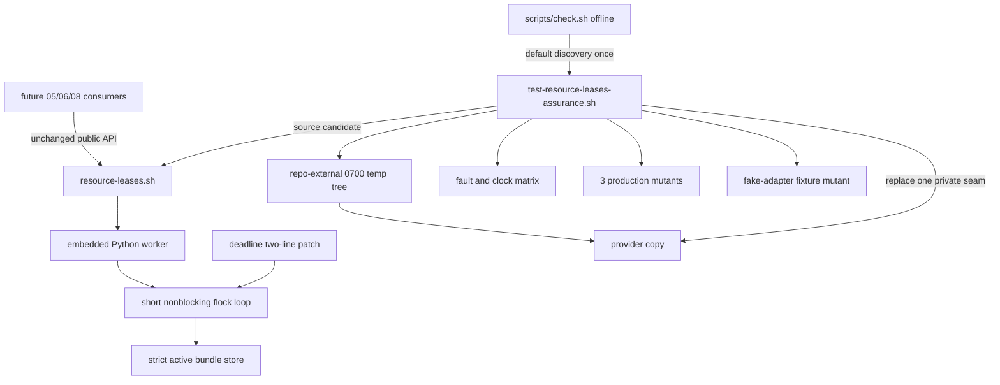

# 任务 1: 闭合 deadline 最后一轮锁尝试

> 这是你的需求。数值、签名、命令一律照抄，不要自己发挥。
> 你只做这一个任务，不要顺手做别的。不要派 subagent。

---

## 任务相关上下文

下面只包含当前任务关联的需求、设计和上游契约。需要额外信息时返回
`NEEDS_CONTEXT`，不要猜测，也不要扩大任务范围。

### Requirements（当前 R + 验收契约）

> 用户原话：“$spec review 这套 aosp harness 工程，有哪些欠缺的地方，进行重构和完善”；并确认后续按 autopilot 执行。PLAN v5.9 要求本片在任何租约消费者前闭合 04 已暴露的 deadline 最后一轮缺口，并以默认发现 assurance 穷举 mutation、I/O、并发和 adapter 反证。

## 目标

交付 `resource-lease-assurance-v1`：在不改变 `resource-leases-v1` public API、状态格式、文档与基础测试的前提下，替换 provider 的 deadline 相邻两行，使资源扫描后首次观测 deadline 到达时立即进入最后一次无 sleep `flock` 尝试，并由既有锁后检查在读取 record 或发布前返回 3；新增默认发现、fixed-shfmt 的 `tests/test-resource-leases-assurance.sh`，以 repo root 外的 `mktemp` 隔离树复制 provider，只替换唯一 `HARNESS_RESOURCE_LEASE_TEST_SEAM`，穷举输入、状态、I/O、并发、等待、adapter 与 mutant 矩阵。dependency-present 成功唯一摘要为 `RESULT PASS  resource lease assurance`；provider 物理缺席时走同摘要的零 active case inert 路径，但 inert PASS 不得解除 05/06/08 顺序门。

## 需求

R1. [计划] 系统必须只修改 `common/.harness/lib/resource-leases.sh` 与新增 `tests/test-resource-leases-assurance.sh` 两个源码文件：provider 的唯一合法改动是把扫描后 `not occupied|wait=0|deadline` 合并退出分支替换成 `not occupied|wait=0` 退出与 `deadline` 立即 continue 两行，不得修改 public 函数、状态格式、文档、基础测试或唯一 seam；execution BASE 到 accepted HEAD 的 provider numstat 必须为 `2/2`、assurance 为 `396/0`，新增与删除合计 `2+2+396=400/400`。
R2. [计划] 当正值等待的资源扫描结束后首次观测 monotonic deadline 已到时，系统必须不 sleep 而立即进入最后一轮并执行一次锁尝试；如果取得锁，系统必须由既有锁后 deadline 检查在读取 active record、回收 stale 或发布 bundle 前返回 3 与固定 unavailable 双流。该确定性场景的 seam 日志必须恰有两次 `flock`；`wait=0` 仍只尝试一次，无竞争正值请求仍可在 deadline 前成功，不得在 deadline 后发布 active bundle。

## 验收标准

主验证命令: bash ./tests/test-resource-leases-assurance.sh
期望输出: dependency-present时退出码为 `0`、stderr空，stdout逐字节精确为 `RESULT PASS  resource lease assurance\n`，且完整矩阵与四类 mutant 自反证全部执行

验收清单:

- [ ] BASE..HEAD exact 两文件：provider 只替换 deadline 相邻两行且 numstat `2/2`，assurance `396/0`，新增+删除`2+2+396=400/400`；public API、状态格式、docs、基础测试与 seam occurrence 不变。
- [ ] 确定性 monotonic 场景逐字返回 rc3/unavailable、seam 日志恰两次 `flock` 且第二次前无 sleep；锁后检查保证到期后零 record 读取、零 stale 回收、零 publish；wait=0/无竞争路径不回归。
- [ ] CLI六形态逐字核对invalid双流空；default/all先核provider精确位于repo内默认普通文件再执行active矩阵；provider absent surface清除override后三入口逐字同摘要/空stderr；damaged provider的目录/非普通文件/symlink/语法/source/API/seam缺失或重复全部核对rc1、空stdout与固定单行FAIL；inert PASS不计dependency-present验收证据。
- [ ] request/root/self-overlap 矩阵覆盖 R4 的全部形态，逐项核对 canonical key、token、`0|2|3`与固定双流，最终 inventory 无 active/tmp/trash/未知资产。
- [ ] live holder 同/异 mode、正值超时、反向 bundle barrier 与双 adapter alias 全部反证；visible record 从不含 partial bundle，竞争 adapter 命令计数为零。
- [ ] duplicate/noncanonical/global-overlap/nonregular 与全 record 字段矩阵均 fail closed；PID reuse stale reclaim 生成新 token并可释放。
- [ ] fake helper、capture/closed-output、root/lock identity 与全部 I/O seam 逐项收敛 rc2；victim不变，unpublish 保留 active，unlink 只留 tombstone且后序恢复清零。
- [ ] 顶层临时树创建后核repo外/EUID自有0700/普通空目录，失败EXIT cleanup可把删除失败变rc1，成功摘要只在已删除且物理缺席后打印；readiness marker与所有承重fixture构造/改写/清理均显式失败收口；三类production mutant逐一核唯一anchor/预期diff/source健康，fake-adapter fixture provider逐字未变，四者均非零、stdout空、stderr逐字匹配各自专属失败标签且无固定PASS；tracked provider/docs/base-test在assurance前后hash不变。
- [ ] candidate/full/depth-1 的默认入口与 offline 全 PASS，offline 发现恰一次，depth-1 commit-count=1且 shallow marker非空；fixed tools、exact2/400、manifest、diff-check与clean全部通过。
- [ ] rollback exact 恢复 provider 两行并删除 assurance 后，04基础测试、03e生命周期与offline全绿且本入口发现0次；05的spec/ref/worktree/BASE/dispatch在依赖证据前全部缺席。

不变量（不许劣化，2-4项）:

- `resource-leases-v1` public API/状态格式/docs/基础测试变化数 ≤ `0`，验证: source surface probe、`git diff "$BASE" "$HEAD" -- docs/resource-leases.md tests/test-resource-leases.sh`与 provider exact hunk。
- deadline 到达后读取 record、回收 stale 或发布 active bundle 的次数 ≤ `0`，验证: monotonic/final-flock seam 日志、到期 rc3 固定双流与最终 state inventory。
- assurance 任一攻击修改 victim、candidate tracked provider 或外部状态的次数 ≤ `0`，验证: 前后 SHA-256/指纹与所有 fixture 的 repo-root 外 `mktemp` 路径核对。
- 既有 04 lease、03e lifecycle 与 offline 门禁失败数 ≤ `0`，验证: candidate 与 rollback checkout 分别运行 `bash ./tests/test-resource-leases.sh`、`bash ./tests/test-claude-session-lifecycle.sh`和 `bash ./scripts/check.sh --offline`。

## 超出范围

- 不改变 `harness_lease_acquire/release`签名、`0|2|3`协议、request/state JSON格式、token算法、owner定义、错误文本、docs或04基础测试；provider只允许R1的两行替换。
- 不新增运行时 API、环境 capability marker或adapter实现；假adapter只验证同一instance ID不会因serial/CVD name不同而绕过lease key。
- 不调用真实ADB、CVD、AOSP build、设备、网络或Claude/Codex客户端；不把inert PASS当成active保证。
- 不创建05/06/08的真实spec、分支、worktree、execution BASE或dispatch，不push，不清理其他项目、spec或已有worktree。

### Design

# 2026-09-04-04a-runtime-resource-lease-assurance 设计

## 概述

以一个相邻控制流修复和一个默认发现的 Bash assurance 入口交付 `resource-lease-assurance-v1`：provider 在扫描后首次发现 deadline 到达时进入最后一轮无 sleep 锁尝试；assurance 在 repo 外临时树内用唯一 seam、真实并发和语义 mutant 穷举租约安全边界。

- 选择只替换 provider deadline 分支的相邻两行，因为既有锁后 deadline 检查已经位于 tombstone 恢复、active record 读取和 publish 之前；让扫描后到期路径 `continue` 即可复用该检查。放弃新增状态、重写等待循环或新公开 API，因为它们扩大已验收 04 的行为面。
- 选择单个 396 行、顶层默认发现的 assurance 脚本，内部复制 provider 并只替换唯一 `HARNESS_RESOURCE_LEASE_TEST_SEAM`，因为故障矩阵必须确定、可离线运行且不能修改 tracked 文件。放弃把矩阵塞回 04 基础测试、直接修改生产 provider 注入故障或拆成额外 helper，避免越过 exact2/400 和独立回滚边界。
- 选择“真实运行 + 专属失败标签 + mutant 自反证”的 oracle：每个承重 fixture 显式收口，每个 production mutant 先证明唯一预期 diff 和 source 健康。放弃只看最终 PASS、接受任意 `FAIL` 或删 no-op seam 的伪变异，因为这些路径已在 requirements review 中被实证可假绿。

## 需求映射

| 组件 | 实现的需求 |
|---|---|
| provider deadline 相邻修复 | R1, R2 |
| assurance CLI、provider route 与 inert/damaged surface | R3 |
| request/root/self-overlap 矩阵 | R4 |
| live holder、barrier 与 adapter 矩阵 | R5 |
| strict record、PID reuse 与 stale 矩阵 | R6 |
| helper、capture、identity 与 I/O fault 矩阵 | R7 |
| fixture 生命周期、唯一 seam 与四类 mutant 自反证 | R8 |
| controller 静态、candidate/full/depth-1 与 manifest 门 | R9 |
| rollback 与 05/06/08 顺序门 | R10 |

## 架构

边界保持在两个源码文件内。provider 继续拥有既有两个 public Bash 函数、状态格式、错误双流和唯一私有 no-op seam；本片只改变扫描后到期分支，不改变锁后到期检查。assurance 是测试消费者，不发布运行时函数、marker、adapter 或持久数据，也不调用真实 ADB/CVD/build/network。05/06/08 只在本片 dependency-present 验收证据入库后解除门禁。

技术栈沿用 04：Linux、Bash 4.4+、Python 3.8+、Git/coreutils；静态门固定 shfmt `v3.14.0` 与 ShellCheck version field `0.11.0`。并发场景只使用本机进程、文件和 `flock`，所有可变状态位于 `/tmp/aosp-harness-lease-assurance.XXXXXX` 且在 PASS 前删除。

## 组件与接口

### 消费契约（frontmatter `消费`，逐字）

`resource-leases-v1：common/.harness/lib/resource-leases.sh 的 harness_lease_acquire <session-id> <wait-seconds> <request-tsv>、harness_lease_release <lease-token>、唯一 HARNESS_RESOURCE_LEASE_TEST_SEAM anchor、0|2|3 双流协议，以及 tests/test-resource-leases.sh 的 dependency-present PASS 证据`

### 产出契约（frontmatter `产出`，逐字）

`resource-lease-assurance-v1：provider 保持原 public API/状态格式但闭合 deadline 到达后的最后一次无 sleep 锁尝试；新增 tests/test-resource-leases-assurance.sh 默认发现入口，dependency-present 成功唯一输出 RESULT PASS  resource lease assurance；不新增运行时 API 或 capability marker`

### provider deadline 相邻修复

- 职责：把扫描后的 `not occupied|wait=0|deadline` 合并退出拆成 `not occupied|wait=0` 退出与 `deadline` 立即 `continue`；下一轮无 sleep 执行第二次 `flock`，拿锁后由既有检查返回 3。
- 对外接口：`harness_lease_acquire <session-id> <wait-seconds> <request-tsv>`；`harness_lease_release <lease-token>`，签名、`0|2|3` 双流和状态格式均不变。
- 依赖：既有 `time.monotonic()`、短非阻塞 `fcntl.flock` 循环与锁后 deadline 检查；不新增依赖。

### assurance CLI 与 provider route

- 职责：只接受无参数、`all`、`--dependency-absent`；从顶层 `tests/` 解析 repo root，dependency-present 时在进入矩阵前确认默认 provider 是 repo 内精确路径上的普通非 symlink 文件。内部 absent surface 使用同构 `tests/`/`common/` 布局并显式清除 provider override；damaged provider 七类均 fail closed。
- 对外接口：`bash ./tests/test-resource-leases-assurance.sh [all|--dependency-absent]`；active 或 inert 成功均为 rc0、stdout 逐字 `RESULT PASS  resource lease assurance\n`、stderr 空，invalid CLI 为 rc1 双流空，damaged provider 为 rc1、stdout 空、stderr 逐字 `FAIL provider validation\n`。
- 依赖：Bash、`mktemp/find/stat/sha256sum/cmp` 与 candidate provider；`HARNESS_ASSURANCE_*` 只用于脚本递归 fixture，不是运行时 capability marker。

### fixture 与 fault matrix

- 职责：在自有临时树创建 request/root/state/record/helper/并发 fixture，复制 provider 后把唯一 seam 改为 fault/mutation/clock 实现；验证输入、record、等待、I/O、输出、tombstone、PID reuse、bundle barrier 与 adapter 行为。每次创建、改写和清理都有即时专属失败；holder/waiter/clock readiness 写失败令 child 非零并由父级 startup 标签收口。
- 对外接口：无运行时接口；内部 `invoke <label> <wanted-rc> <stream-shape> <command...>` 对每个 case 逐字检查 rc/stdout/stderr。
- 依赖：repo 外 EUID 自有 0700 临时树、既有唯一 seam、独立 Bash child 与 Python 标准库。tracked provider/docs/base test 只读并在前后比较 SHA-256。

### mutant self-proof

- 职责：构造 overlap 检查、真实 unpublish `os.replace(path, trash)` 状态转换、bundle 完整规范化三类 production mutant，以及 provider 文本不变的 fake-adapter key-selection fixture mutant。production mutant 必须先断言 anchor 恰一次、只替换该 anchor并通过 provider source 健康检查；child 只能命中对应专属失败标签。
- 对外接口：无；四个内部结果依次为 `FAIL stored overlap rc=0`、`FAIL disjoint release rc=2`、`FAIL same owner subset rc=0`、`FAIL adapter command count`，且 stdout 空、无 PASS。
- 依赖：candidate provider 副本、Python 精确文本替换、`provider_state` 与递归 child。

### controller 验收与顺序门

- 职责：检查 exact2/400、固定静态工具、review manifest、candidate/full/depth-1/offline/clean；在隔离 rollback checkout 恢复 provider 两行并删除 assurance，验证前序回归与本入口发现数为 0；在 accepted 证据前检查 05 五类资产物理缺席。
- 对外接口：`bash ./scripts/check.sh --offline` 与 Git 验收命令；不进入最终源码。
- 依赖：Git、隔离临时 checkout、固定工具目录和 spec ledger。

## 测试策略

| 层 | 范围 | 工具/判据 |
|---|---|---|
| 控制流单元 | deadline到期后恰两次flock、第二次前无sleep、锁后零record/stale/publish；wait=0与无竞争不回归 | 唯一 seam 的 monotonic/flock 日志、固定 rc3 双流、state inventory |
| 输入与状态集成 | R4 的 TSV/root/self-overlap 全矩阵；R6 的 duplicate/noncanonical/global overlap/nonregular/全部字段/PID reuse | `invoke`逐case核`0|2|3`及token/空/固定错误双流，结束核完整 inventory |
| 并发集成 | live holder同/异mode、positive timeout、反向bundle barrier、双adapter同instance ID | 独立 Bash进程、readiness marker、visible record解码、命令计数与有界等待 |
| 故障与 mutation | helper/capture/closed-output、root/lock identity、flock/open/write/fsync/replace/unpublish/unlink；三production mutant+一fixture mutant | provider副本唯一seam、精确mutation、source健康、专属stderr与空stdout |
| CLI/surface | 六种CLI；真实absent三入口；七类damaged provider；default/all必须先证明active route | capture文件逐字比较与运行时长/route guard，不以摘要单独证明active |
| 端到端 | candidate、完整历史checkout、真实depth-1 clone的默认入口与offline；自动发现恰一次 | `bash ./tests/test-resource-leases-assurance.sh`、`bash ./scripts/check.sh --offline`、Git shallow marker |
| 回滚/顺序 | rollback exact两文件后04基础、03e lifecycle、offline绿且入口0；05五类资产在验收前缺席 | 隔离rollback branch、Git name-only/numstat、路径/ref/worktree/ledger/dispatch检查 |
| 静态/sizing | provider `2/2`、assurance `396/0`、总churn400；manifest连续PASS；clean/diff-check | shfmt3.14.0、ShellCheck0.11.0、`bash -n`、Git/awk |
| 性能 | 不设吞吐SLO；只证明正值等待有界、到期不额外sleep | monotonic确定性clock + 外层宽容timeout |

### Runnable fixed-format prototype evidence

| 原型文件 | fixed-shfmt 后行数/差异 | 已证明 |
|---|---:|---|
| `prototypes/common/.harness/lib/resource-leases.sh` | 相对accepted provider `2/2` | deadline相邻修复，public surface/状态格式/seam不变 |
| `prototypes/tests/test-resource-leases-assurance.sh` | `396/0` | default/all真实active约30秒、dependency-absent、七damaged surface、完整矩阵和四mutant均PASS |
| **合计** | **`2+2+396=400/400`** | **exact2边界可实施** |

固定 shfmt/ShellCheck/bash-n与四项规格检查全绿。额外生命周期 fault probe 证明：顶层`mktemp`失败为rc1/空stdout/专属错误；成功前cleanup失败为rc1/空stdout/无PASS。熔断融合 reviewer 已独立复核 route、readiness、cleanup和四个专属 mutant oracle为PASS（0/0/0）。

验收资产（不纳入源码文件清单）：`prototypes/`、requirements三轮及熔断融合报告、固定工具与故障日志、逐任务red/green/review证据、六列review manifest、candidate/full/depth-1/offline/rollback/NEXT门日志、accepted HEAD与execution BASE记录。

## 文件清单

| 文件 | 创建/修改 | 职责（一句话） |
|---|---|---|
| `common/.harness/lib/resource-leases.sh` | 修改 | 以deadline相邻两行保证扫描后到期路径执行最后一次无sleep锁尝试，并复用锁后安全拒绝 |
| `tests/test-resource-leases-assurance.sh` | 创建 | 默认发现的完整输入/状态/I/O/并发/等待/adapter/mutant assurance 与固定摘要 |

### 上游任务契约

无：当前任务不消费其他任务产出。

---

## 你的任务

文件: 修改 `common/.harness/lib/resource-leases.sh`
验收资产（不纳入源码文件清单）: 创建 `.spec/2026-08-31-aosp-harness-refactor/work/2026-09-04-04a-runtime-resource-lease-assurance/task-1-brief.md` / 创建 `.spec/2026-08-31-aosp-harness-refactor/work/2026-09-04-04a-runtime-resource-lease-assurance/evidence/task-1-red.txt` / 创建 `.spec/2026-08-31-aosp-harness-refactor/work/2026-09-04-04a-runtime-resource-lease-assurance/evidence/task-1-static.log` / 创建 `.spec/2026-08-31-aosp-harness-refactor/work/2026-09-04-04a-runtime-resource-lease-assurance/task-1-report.md` / 创建 `.spec/2026-08-31-aosp-harness-refactor/work/2026-09-04-04a-runtime-resource-lease-assurance/evidence/task-1-package.tsv` / 创建 `.spec/2026-08-31-aosp-harness-refactor/work/2026-09-04-04a-runtime-resource-lease-assurance/review-manifest.tsv`
消费: 无
产出: `resource-lease-final-attempt-v1`
需求: R1, R2
必需: 是

- [ ] 步骤 1: 生成task brief；用固定`/tmp/aosp-harness-lease-assurance-task1.XXXXXX`创建repo外临时树，先核绝对前缀与不在repo内，再按真实顶层布局放入当前production provider、prototype assurance、当前accepted`docs/resource-leases.md`与`tests/test-resource-leases.sh`四文件并安装cleanup trap；运行 `bash tests/test-resource-leases-assurance.sh`，确认红阶段失败、首个专属错误逐字 `FAIL monotonic attempt count`且诊断seam日志只有一次`flock`，按固定schema写`task-1-red.txt`并删除且核临时树物理缺席。
- [ ] 步骤 2: 核 `git rev-parse HEAD`=`BASE_SHA`且clean；把`$SPEC/prototypes/common/.harness/lib/resource-leases.sh`机械复制到production路径，不改public函数、状态格式、docs、基础测试或唯一seam。
- [ ] 步骤 3: 运行 `git diff --numstat "$BASE_SHA" -- common/.harness/lib/resource-leases.sh`，确认逐字为`2<TAB>2<TAB>common/.harness/lib/resource-leases.sh`；运行`cmp -s`核production与prototype逐字相同，固定shfmt/ShellCheck/bash-n全绿，source surface仍恰两个public API且seam marker恰一处，记录到`task-1-static.log`。
- [ ] 步骤 4: 重新创建并核repo外边界的同构树，按步骤1同样复制修复后production provider、prototype assurance、当前accepted docs与基础测试四文件；运行 `bash tests/test-resource-leases-assurance.sh`，确认rc0、stderr空、stdout逐字固定摘要，并从seam oracle证明恰两次`flock`且锁后零record/stale/publish；删除且核临时树物理缺席。
- [ ] 步骤 5: 提交只含provider的清晰本地commit；固定`TASK_HEAD`，核该提交exact一个文件、numstat`2/2`与工作树clean。
- [ ] 步骤 6: 写green报告/evidence package并交独立diff review；PASS后追加manifest第1行（`BASE_SHA -> TASK_HEAD`），mark任务1、写ledger、sync-ledger。

## 报告契约

完整报告写进控制器指定的 `task-N-report.md`（路径由控制器给出）。

返回控制器的只有：
- **Status**：`DONE` / `DONE_WITH_CONCERNS` / `NEEDS_CONTEXT` / `BLOCKED`
- **Commits**：本任务产生的 commit 列表
- **一行测试摘要**：例如 `Ran 12 tests, OK`
- **顾虑**：如有

