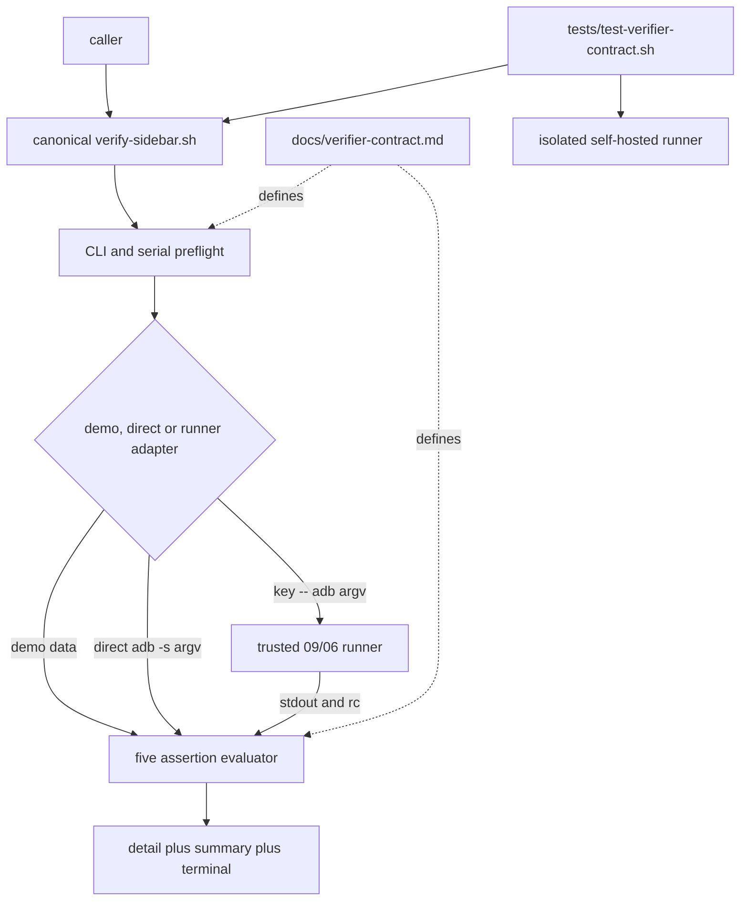

# 任务 2: 安装 canonical verifier provider

> 这是你的需求。数值、签名、命令一律照抄，不要自己发挥。
> 你只做这一个任务，不要顺手做别的。不要派 subagent。

---

## 任务相关上下文

下面只包含当前任务关联的需求、设计和上游契约。需要额外信息时返回
`NEEDS_CONTEXT`，不要猜测，也不要扩大任务范围。

### Requirements（当前 R + 验收契约）

> 用户原话：“$spec review 这套 aosp harness 工程，有哪些欠缺的地方，进行重构和完善”；并明确“后续所有流程走 autopilot 流程，不要再问我了”。PLAN v6.1 将本片定义为 04a 后、05a assurance 前的独立 canonical verifier core。

## 目标

交付 `verifier-contract-v1`：新增不被后序 adapter 改写的 `common/.harness/bin/verify-sidebar.sh` canonical physical provider，统一定义 boot、system_server、crash baseline、service、package 五项断言，以及查询失败、业务缺失、解析失败和 `PASS/FAIL/SKIP` 的聚合语义；新增完整 `docs/verifier-contract.md` 与代表性 `tests/test-verifier-contract.sh`，并提供私有逐查询 `HARNESS_VERIFIER_QUERY_RUNNER` transport seam，使 09 能在不改 provider 的前提下组合 06 runtime。穷举 oracle 由后序 05a 独占，在其 dependency-present 证据通过前不得开始 06/09。

## 需求

R1. [计划] 系统必须新增并维持canonical provider路径`common/.harness/bin/verify-sidebar.sh`，接受且只接受`verify-sidebar.sh [--demo] [--since <epoch[.nsec]>] [--allow-skip]`与单独的`--help`；解析阶段必须拒绝三个flag各自重复、`--since`缺值/多值/非法值、help组合、未知参数和位置参数，再拒绝真实模式`--allow-skip`，最后按`^[A-Za-z0-9][A-Za-z0-9._:-]*$`校验ANDROID_SERIAL，任一失败均须在零ADB调用下返回2；所有真实ADB命令必须使用同一`adb -s "$ANDROID_SERIAL"`。单独help须退出0、stderr空、零ADB且stdout参数集合与文档一致。
R2. [计划] 当canonical verifier执行时，系统必须各结算一次boot completed、system_server、crash baseline/window、sidebar service与`com.android.sidebar` package五项逻辑断言，并输出恰五行以`PASS  `、`FAIL  `或`SKIP  `开头的明细；外部查询非零必须按对应query-failed明细记FAIL，值语法不合法必须按parse-failed明细记FAIL，语法合法但boot/PID/service目标不满足必须按业务缺失明细记FAIL，只有package语法合法且目标完整行缺失时才记SKIP。默认transport执行分离argv并抑制子命令stderr；私有`HARNESS_VERIFIER_QUERY_RUNNER`若设置，必须在任何查询前验证为绝对路径、EUID自有、可执行的普通非symlink文件，再以`<query-key> -- adb -s <serial> <argv...>`调用，捕获其stdout、继承其stderr并维持非负rc（信号规范化为`128+signal`）；未设置时保持直接ADB。runner非法须零查询rc2，exec失败须固定诊断并使对应项query FAIL。该seam不是设备真实性边界，09只可绑定到其可信06 adapter；provider缺席仍由09 legacy fallback处理。
R3. [计划] 当未显式传`--since`时，系统必须从同一目标的`/proc/stat`解析恰一条完整匹配`btime <nonnegative-integer>`的行，零条、多条或只有畸形btime行均使crash项FAIL且不得调用logcat；当显式传入epoch时，系统必须接受非负十进制秒与一至九位小数并右补为九位后传给`logcat -b crash -d -v epoch,nsec -T`。所有查询输出按bytes只以LF分行、逐行移除至多一个尾CR；查询成功后必须忽略空行和原始首字节不是ASCII`0`–`9`的header，数字开头行的首ASCII空白分隔token必须是合法epoch；不存在`timestamp >= baseline`时PASS，即纯空或只有早期记录均PASS，等于或晚于baseline时FAIL，畸形数字token或logcat非零时FAIL；前导空白、Unicode digit与非法UTF-8均不得被误当合法数字行。
R4. [计划] 当五项查询成功时，系统必须按以下判定表逐项分类；按R3逐LF记录移除至多一个尾CR，表中“空行忽略”后无记录即为空，N/A格不得被测试伪造成另一类别。

| 项 | 合法输出 grammar | 空 | 合法但目标未满足 | 语法畸形 | 满足 |
|---|---|---|---|---|---|
| boot | 去首尾ASCII空白后仅`0`或`1` | parse FAIL | `0`为business FAIL | 其他非空为parse FAIL | `1`为PASS |
| system_server | 去首尾ASCII空格/tab/LF后为一个或多个空格/tab分隔的`[1-9][0-9]*` | business FAIL | N/A | `0`、前导零或其他字符为parse FAIL | 合法PID列表为PASS |
| crash | R3的baseline与记录grammar | 空buffer为PASS | 任一合法记录时间`>=baseline`为business FAIL | btime/数字token畸形为parse FAIL | 只有header或早期记录为PASS |
| service | 每个非空LF记录均为bytes grammar `^[0-9]+[ \t]+[^ \t]+:[ \t]+\[[^][\r\n]+\][ \t]*$` | business FAIL | 合法行中无服务名精确为`sidebar`者为business FAIL | 任一非空行不匹配为parse FAIL | 存在精确`sidebar:`行即PASS |
| package | 每个非空行均为`^package:[A-Za-z][A-Za-z0-9_]*(\.[A-Za-z][A-Za-z0-9_]*)+$` | SKIP | 合法行中无精确`package:com.android.sidebar`者为SKIP | 任一非空行不匹配为parse FAIL | 存在目标完整行即PASS |
R5. [计划] 当五项断言结束时，系统必须输出`SUMMARY PASS=<n> FAIL=<n> SKIP=<n>`且三计数之和精确为5；FAIL大于零时末行逐字为`RESULT FAIL`并退出1；FAIL为零但SKIP大于零且未选探索时末行逐字为`RESULT INCOMPLETE`并退出2；无FAIL/SKIP时末行逐字为`RESULT PASS`并退出0；只有`--demo --allow-skip`可把纯SKIP改为`RESULT PASS (SKIP allowed)`与退出0，该探索结果不得作为严格交付证据。
R6. [计划] 凡具备`--demo`，系统必须零调用真实ADB，并由DEMO_BOOT_QUERY_FAIL、DEMO_BOOT_COMPLETED、DEMO_SYSTEM_SERVER_QUERY_FAIL、DEMO_SYSTEM_SERVER、DEMO_BOOT_TIME_QUERY_FAIL、DEMO_BOOT_TIME、DEMO_CRASH_QUERY_FAIL、DEMO_CRASH_LOG、DEMO_SERVICE_QUERY_FAIL、DEMO_SERVICE_LIST、DEMO_PACKAGE_QUERY_FAIL与DEMO_PACKAGE_LIST夹具驱动与真实模式同一解析器；所有变量缺省必须生成`5/0/0`严格PASS，每个query-fail开关只改变对应逻辑项，夹具值不得作为shell代码执行。

## 验收标准

主验证命令: bash ./tests/test-verifier-contract.sh
期望输出: 退出码为`0`、stderr空，stdout逐字节精确为`RESULT PASS  verifier contract\n`，且canonical provider的demo/real、default/explicit baseline、runner与preflight基础合同全部执行

验收清单:

- [ ] canonical provider物理独立于三个旧入口；CLI拒绝优先级、三个flag重复、单独help/help组合、真实allow-skip、serial正则与全部ADB `-s` argv符合R1，所有前置错误零ADB且rc2。
- [ ] provider实现R3/R4完整grammar；基础测试以default/explicit baseline及代表query failure验证主链，05a负责逐格穷举与mutation自反证且在其验收前无consumer启动。
- [ ] private runner前置校验、六query key、`--`后分离ADB argv、stdout/继承stderr/rc协议与默认direct模式闭合；09无需改provider即可接06。
- [ ] FAIL、严格SKIP、严格PASS与demo探索PASS的末行/退出码逐字符合R5，只有严格`RESULT PASS`可作交付证据。
- [ ] base contract test逐字核demo与real主链、runner传输、代表preflight，并在repo外安全temp物理删除后才打印摘要；完整case manifest由05a单文件独占。
- [ ] `docs/verifier-contract.md`列出CLI/优先级、六query argv/runner seam、R4 bytes判定表、fixture、summary、terminal/rc与交付限制；门③runnable exact3 core prototype fixed-format、真实执行且churn≤400。
- [ ] BASE..HEAD exact三文件且churn≤400；固定静态工具、manifest、diff-check、clean、隔离converge与candidate/full/depth-1的contract/offline全部通过。
- [ ] rollback移除exact3后，01/02/04/04a与三个旧入口回归通过；后序09可按provider物理缺席走自有fallback而不覆盖其hunks，后序五片无提前执行资产。

不变量（不许劣化，2-4项）:

- 真实模式在参数、serial或runner校验完成前的query调用数 ≤ 0，验证: contract test的invalid CLI/serial/runner log。
- 每次完整verifier执行的逻辑断言数 = 5且断言缺失数 ≤ 0，验证: base test逐字输出与后序05a完整summary/coverage counters。
- strict INCOMPLETE或FAIL被误判为交付成功的次数 ≤ 0，验证: contract test对terminal+rc联合断言及`bash ./scripts/check.sh --offline`。
- 三个旧verifier及session/resource-lease public文件变化数 ≤ 0，验证: `git diff "$BASE" "$HEAD" -- common/.harness/features/dev-sidebar/verify-sidebar.sh claude-code/features/dev-sidebar/verify-sidebar.sh codex/features/dev-sidebar/verify-sidebar.sh common/.harness/lib tests/test-session-*.sh tests/test-resource-leases*.sh`。

## 超出范围

- 不调用真实设备、AOSP build、CVD、网络或外部客户端；真实模式只在隔离fake adb上验argv、输出和退出码。
- 不实现超时、重试、取消、租约、registry、dispatcher或client/session adapter；private seam只传输runner stderr/rc/stdout，runtime策略属于06，绑定属于09。
- 不改三个旧verifier，不做三入口parity、薄化或legacy fallback；09消费本片physical provider后完成。
- 不修改session/resource-lease provider、01/02既有测试、README/长文或后序spec，不push，不清理其他项目或已有worktree。

### Design

# 2026-09-04-05-verifier-contract 设计

## 概述

新增一个与三个旧 verifier 路径物理分离的 canonical CLI，由极薄 Bash 启动器 `exec python3 - "$@"` 承载 Python 3.8 标准库实现；同片新增完整契约文档和代表性基础隔离测试，三文件 runnable fixed-format core 原型实测 371/400 行并输出固定 PASS。完整矩阵由不改本片文件的后序 05a assurance 独占。

关键决策：

1. 选择新增 `common/.harness/bin/verify-sidebar.sh`，而不是修改任一旧入口。这样 09 可只消费、不改 provider，05 回滚是物理缺席，09 的 fallback/adapter hunk 不会被覆盖；放弃在 05 直接对齐三入口和在 09 再次改 common 的方案。
2. 选择 Bash 稳定路径加内嵌 Python 3.8：Bash 只保证现有调用形态，Python 用标准库完成无溢出的 epoch/nsec 比较、严格 regex、分离 argv 和查询 rc；放弃纯 Bash 的大整数/多行解析与额外 `.py` 文件，前者更难审且易受算术溢出影响，后者会扩大回滚面。
3. 选择同一 bytes 解析器消费 demo 数据、直接 `adb -s` 或 private runner stdout；query adapter 只替换取数方式。runner 以`query-key --`加完整分离ADB argv调用，stdout捕获、stderr继承、rc保留，使09可绑定06而无需改provider；未设置时维持direct与stderr抑制。放弃整进程runtime包装，因为它无法恢复逐query stderr/超时语义。
4. 依据round1的真实368/400弱oracle证据，把代表性base test留在05，把全grammar/CLI/argv/case-manifest/mutant矩阵拆到05a exact1。放弃向余32行压缩完整矩阵，避免以宽松断言换预算。

## 需求映射

| 组件 | 实现的需求 |
|---|---|
| CLI parser 与 serial preflight | R1、R7、R10 |
| direct/private-runner query adapter 与五断言 evaluator | R2、R3、R4、R6、R10 |
| result aggregator | R2、R5、R10 |
| contract 文档 | R1、R4、R5、R6、R8 |
| base contract test | R1、R2、R3、R5–R10 |
| 后序05a assurance边界 | R3、R4、R7–R10 |
| controller sizing/checkout/rollback gates | R8、R9、R10 |

## 架构

分层只有三层：入口/前置层不产生 query 副作用；query 层返回 `(rc, bytes)` 而不解释业务；evaluator/aggregator 层按 R4 表产生恰五个状态和一个终态。技术下限为 Bash 4.3、Python 3.8、GNU coreutils 与现有 Android `adb` CLI；运行时只使用 Python 标准库 `os/re/stat/subprocess/sys`。09 把本文件当 physical provider，不解析内容或覆写它，并只把已验证的私有seam绑定到可信06 adapter。

## 组件与接口

### Canonical verifier provider

- 职责：解析稳定 CLI、执行六条查询、结算五项断言并输出固定协议。
- 对外接口：`verifier-contract-v1：docs/verifier-contract.md；canonical physical provider common/.harness/bin/verify-sidebar.sh [--demo] [--since <epoch[.nsec]>] [--allow-skip]；private HARNESS_VERIFIER_QUERY_RUNNER=<absolute-euid-owned-regular-executable> 接收 <query-key> -- adb -s <serial> <argv...> 并传回 stdout/stderr/rc；五项断言、受控末行与退出码 0|1|2；tests/test-verifier-contract.sh 默认发现基础入口`
- 依赖：Python 3.8 标准库；真实模式依赖 `adb -s <validated-serial>`；不依赖 04 lease runtime。

入口实现保持单文件：shebang 后 `exec python3 - "$@"`，quoted heredoc 防 shell 展开；Python 从 `sys.argv[1:]` 读分离参数。`query(key, value_key, default, argv)` 在demo读取命名fixture；direct real用`subprocess.run(["adb", "-s", serial] + argv, stdout=PIPE, stderr=DEVNULL)`；runner real先由preflight核绝对路径、lstat普通非symlink、EUID owner与X_OK，再执行`[runner, key, "--", "adb", "-s", serial] + argv`，捕获stdout、继承stderr且保留rc。所有路径均`shell=False`。runner是组合seam而非auth边界，因为调用者本就控制PATH；09只能传入自身可信adapter。runner缺席回direct、provider缺席由09 fallback，两者不混淆。

### Base contract test

- 职责：在 repo 外 0700 fixture 中证明逐字demo/real成功主链、default/explicit baseline、六/五条runner argv、stderr/rc及代表性CLI/serial/runner preflight；完整grammar矩阵由05a独占。
- 对外接口：`bash ./tests/test-verifier-contract.sh`；成功唯一 stdout 为 `RESULT PASS  verifier contract\n`、stderr 空、退出 0。
- 依赖：canonical provider、Bash、`mktemp/stat/grep/cmp`；测试入口自身的runner分支记录argv并注入stdout/stderr/rc，避免第四个源码文件。

### 05a assurance boundary

- 职责：后序单文件穷举R3/R4/CLI/runner/bytes边界、完整case manifest和四类mutant，不修改05 exact3。
- 对外接口：`tests/test-verifier-contract-assurance.sh`；dependency-present成功唯一摘要`RESULT PASS  verifier contract assurance`。
- 依赖：本片provider/doc/base test物理齐全；缺provider时inert，partial/damaged fail closed。其active证据入ledger前06/09均不得启动。

### Contract document

- 职责：给 09 与人类调用者提供 CLI/判定表/结果码单一真相源。
- 对外接口：`docs/verifier-contract.md` 的 `Verifier contract v1`。
- 依赖：requirements R1–R6；不引用未来 dispatcher 内部路径。

### 上游消费

- 消费：`02 的根级离线门禁 bash ./scripts/check.sh --offline 及 tests/test-*.sh 默认发现约定；resource-lease-assurance-v1：provider 保持原 public API/状态格式且其 dependency-present active、exact2/400、full/depth-1/rollback 与全 PASS manifest 顺序门证据已入库（无运行时 API）`
- 用法：测试文件名进入 02 字典序发现；04a 只作为 controller 启动顺序证据，不在运行时 source 或调用。

## 错误处理

| 错误场景 | 恢复策略 | 校验位置 | 日志 | 用户可见 |
|---|---|---|---|---|
| CLI重复/缺值/未知/help组合 | 不执行查询，立即结束 | parser | usage 到stderr | rc2 |
| real allow-skip、serial或runner非法 | 不执行query，立即结束 | preflight | 固定类别到stderr | rc2 |
| runner通过预检后启动失败 | 该query按126失败并继续五项聚合 | query边界 | 固定runner execution诊断 | 最终rc1 |
| 任一查询非零 | 继续结算其他逻辑项 | query/evaluator边界 | 对应`FAIL  ... query failed` | 最终rc1 |
| btime零/多/畸形 | crash项FAIL且不调logcat | crash evaluator | `crash baseline parse failed` | 最终rc1 |
| 输出grammar畸形 | 该项parse FAIL，不降级为业务缺失 | R4 evaluator | 对应parse detail | 最终rc1 |
| 合法package缺失 | 只记SKIP | package evaluator | package missing detail | strict rc2或demo探索rc0 |
| fixture/static/预算/cleanup失败 | 测试不打印固定PASS并非零退出 | contract test/controller | 首个专属FAIL | rc1/门禁阻断 |

## 文件清单

| 文件 | 创建/修改 | 职责（一句话） |
|---|---|---|
| `common/.harness/bin/verify-sidebar.sh` | 创建 | 独立canonical physical provider与稳定CLI |
| `docs/verifier-contract.md` | 创建 | 五断言、CLI与终态协议单一文档 |
| `tests/test-verifier-contract.sh` | 创建 | 默认发现的代表性隔离base contract |

验收资产（不纳入源码文件清单）：`prototypes/common/.harness/bin/verify-sidebar.sh`、`prototypes/docs/verifier-contract.md`、`prototypes/tests/test-verifier-contract.sh`，以及 `reviews/` 下门③独立审查报告。execution BASE 到 accepted HEAD 必须exact上述三源码文件，prototype/review/ledger只随spec文档提交，不计入source diff。

### 上游任务契约

#### 任务 1: 安装默认发现的 base contract test

文件: 创建 `tests/test-verifier-contract.sh`
产出: `verifier-base-test-v1`（`bash tests/test-verifier-contract.sh`成功唯一stdout为`RESULT PASS  verifier contract\n`）

---

## 你的任务

文件: 创建 `common/.harness/bin/verify-sidebar.sh`
验收资产（不纳入源码文件清单）: 创建 `.spec/2026-08-31-aosp-harness-refactor/work/2026-09-04-05-verifier-contract/task-2-brief.md` / 创建 `.spec/2026-08-31-aosp-harness-refactor/work/2026-09-04-05-verifier-contract/evidence/task-2-red.txt` / 创建 `.spec/2026-08-31-aosp-harness-refactor/work/2026-09-04-05-verifier-contract/task-2-report.md` / 修改 `.spec/2026-08-31-aosp-harness-refactor/work/2026-09-04-05-verifier-contract/review-manifest.tsv`
消费: `verifier-base-test-v1`
产出: `verifier-provider-v1`
需求: R1, R2, R3, R4, R5, R6
必需: 是

- [ ] 步骤 1: 生成brief；运行`cmp -s common/.harness/bin/verify-sidebar.sh "$SPEC/prototypes/common/.harness/bin/verify-sidebar.sh"`，确认红阶段因目标缺席失败并写red证据。
- [ ] 步骤 2: 核HEAD为任务1 HEAD且clean；机械复制provider prototype到目标并保持100755，不改embedded Python或seam preflight。
- [ ] 步骤 3: 运行provider `cmp -s`、`wc -l`=202、fixed shfmt、ShellCheck warning、`bash -n`及`bash tests/test-verifier-contract.sh`；逐字核rc0、stderr空、stdout仅固定摘要。
- [ ] 步骤 4: 只提交provider，消息`feat(harness): add canonical verifier provider`；写报告并独立diff review，PASS后manifest第2行、mark 2、ledger与sync-ledger。

## 报告契约

完整报告写进控制器指定的 `task-N-report.md`（路径由控制器给出）。

返回控制器的只有：
- **Status**：`DONE` / `DONE_WITH_CONCERNS` / `NEEDS_CONTEXT` / `BLOCKED`
- **Commits**：本任务产生的 commit 列表
- **一行测试摘要**：例如 `Ran 12 tests, OK`
- **顾虑**：如有
