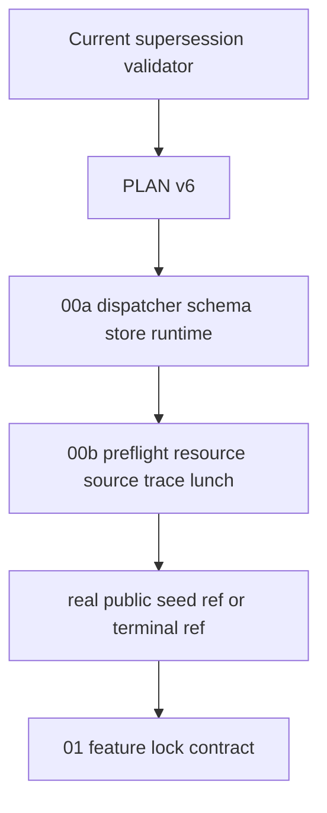
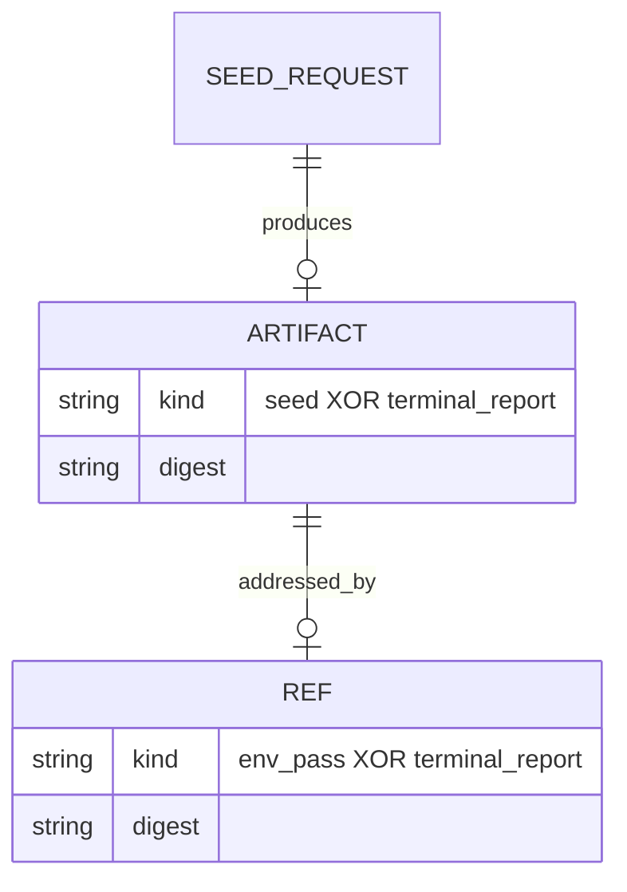
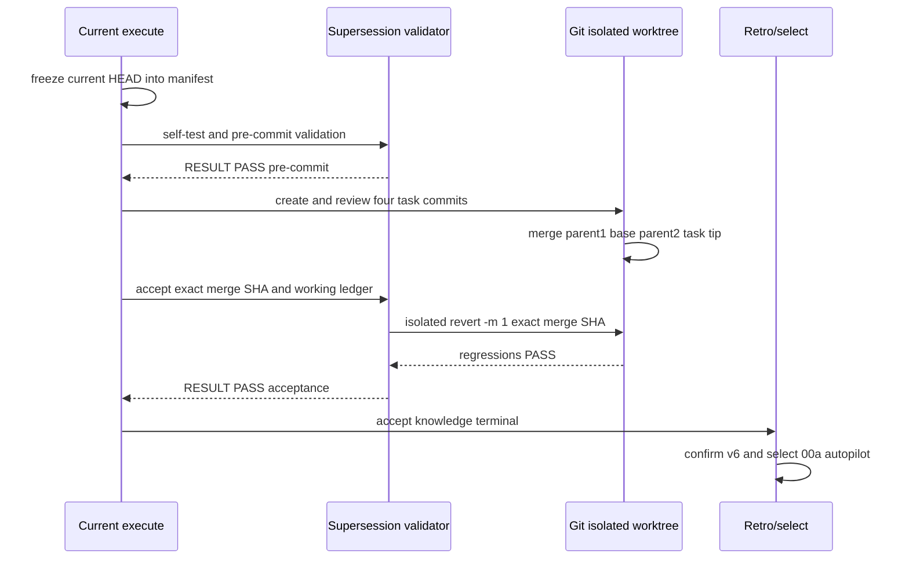

# 2026-09-01-00-environment-seed-preflight 设计终止报告

## 概述

门③ sizing 估算给出原 00 为 890–1310 行非生成 diff，因此按 R24 触发 `REPLAN REQUIRED`；本片不冒充完成 runtime/probe，而是实现一个可执行的 supersession manifest/validator，按正常状态图经过 tasks→execute→accept→retro，再选择 PLAN v6 的 00a。00a/00b actual 仍须在各自 tasks/acceptance 重算。

关键决策：

- 在 versioned schema/store runtime 后切为 00a/00b；纯 fixture runtime 与真实 environment provider 都有独立命令、知识/能力产出。放弃按文件数量均分，因为 publisher/probe 半成品不能独立验收。
- 当前终止片只交付机器可验的 sizing/PLAN supersession，不实现 `common/` 代码。放弃从design直接跳retro；终止片仍走门④、execute、门⑤，ledger以四个task completion anchors和exact two-parent merge SHA为恢复锚点。门④三轮review证明单文件密集validator不满足10分钟review，因此改为六个non-overlap deliverable files、四个顺序任务。
- execute开始时把process-baseline `git rev-parse HEAD`冻结进manifest；pre-commit只接受从base开始的linear task branch，base→prospective index path set必须是manifest paths的子集，final merge前必须exact全集。accept要求merge parent1=base、parent2=task tip。所有path/numstat都相对frozen base，避免旧candidate delta假绿和共享main历史误算，也不reset/revert他人工作。

## 需求映射

当前终止片只实现 R24；其余需求按下表迁移。`shared` 表示 00a 固定 ABI、00b 填充/调用，最终跨片验收由表中 owner 承担。

| R | 00a responsibility | 00b responsibility | cross-slice acceptance owner |
|---|---|---|---|
| R1 | — | local source input/provider | 00b |
| R2 | — | envsetup/lunch input/provider | 00b |
| R3 | descriptor schema/env precedence validation | wrapper request creation | 00b |
| R4 | OUT_DIR confinement primitive | cwd/lunch/build-variable provider | 00b |
| R5 | dispatcher owner/command grammar | no dispatcher modification | 00a |
| R6 | runtime-absence preamble contract | `commands.d/preflight` direct owner | 00b |
| R7 | schemas/verifier/store/ref owner | preflight seed producer | 00b verifies through 00a |
| R8 | no-follow state-dir/path primitive | supply scope paths | 00a |
| R9 | worktree/path validation API | enumerate AOSP worktrees | 00b |
| R10 | closed seed/evidence schemas | fill observed values | 00b verifier integration |
| R11 | public scope/evidence validator | real public probe | 00b public gate |
| R12 | local scope validator | real LK7K probe | 00b local acceptance |
| R13 | resource field/schema/formula | disk/inode provider | 00b |
| R14 | resource field/schema/formula | cgroup memory provider | 00b |
| R15 | resource field/schema/formula | online/cpuset/quota provider | 00b |
| R16 | source-state schema/per-project digest | recursive status/content provider | 00b |
| R17 | trace schema/classification validator | namespace/tracer/execution guard | 00b outer oracle |
| R18 | source/ignored-input schema | before/after/ignored provider | 00b |
| R19 | object/ref publisher and success kind | environment success decision/exact stdout | 00b end-to-end |
| R20 | terminal publisher/kind | environment failure decision/control gate | 00b end-to-end |
| R21 | validation/error ABI | provider error mapping | 00a fixture + 00b integration |
| R22 | publish lock/fault state machine | call only 00a publisher | 00a |
| R23 | dispatcher/verify-seed parity | preflight dispatcher/direct parity | 00b |
| R24 | sizing manifest/validator | successor budget reuse assertion | current terminal spec |
| R25 | 00a revert → later direct `RUNTIME_UNAVAILABLE` | 00b revert → 00a `SEED ABI PASS` | each successor post-merge gate |
| R26 | boundary formula/fixture API | measured provider fixture | 00b |
| R27 | schema invalid threshold rejection | provider never normalizes invalid input | 00a unit + 00b integration |

## 架构



当前片仅使用 Python 3 标准库和既有 `check-plan.py`；不新增最低 Python minor version。00a/00b 技术栈在各自 requirements/design 固定，本报告只锁定 CLI/schema/file owner，不提前发明公开 Python API。

生命周期固定为：design review PASS → tasks review PASS → controller提交已审process baseline → 从该HEAD创建隔离branch/worktree → 四个non-overlap task逐个execute/commit/独立diff review/completion → final cumulative gate → main以`--no-ff`创建parent1=base、parent2=task tip的merge → accept exact merge并isolated `git revert -m 1` → retro确认PLAN v6 → select/new-spec 00a autopilot。process-baseline commit不是任务完成证据，也不在terminal merge revert范围；它只让worktree获得已审输入。

## 组件与接口

### Current supersession manifest/validator

- 职责：机器证明 R24 sizing、PLAN v6 replacement/DAG/owner、DECISIONS supersession、execute-time frozen-base `common/` 零增量和 ledger completion anchor。
- 接口 1：`python3 .spec/2026-09-01-aosp-feature-minimal-checkout/specs/2026-09-01-00-environment-seed-preflight/work/verify-supersession.py self-test` → exit 0 + exact stdout `RESULT PASS environment-seed-preflight-supersession-self-test`、空 stderr。它必须覆盖 closed JSON（含 duplicate object key）、PLAN/DECISIONS/sizing、base/common scope、exact commit set、exact ledger grammar和revert/regression matrix；missing replacement、missing R27 owner、budget 801、fake ledger SHA 与 injected `common/evil` 五个承重 mutation 必须以 subprocess 穿过真实公开 mode。每个 mutation 必须 exit 1、stdout 空且 stderr 精确为 tasks matrix 指定一行，不能只断言非零。
- 接口 2：同一脚本 `pre-commit --project-root ABS_ROOT --base-commit FROZEN_HEAD_SHA --manifest ABS_MANIFEST [--require-complete]` → exit 0 + exact stdout `RESULT PASS environment-seed-preflight-supersession-pre-commit`、空stderr；参数SHA必须等于manifest base，当前HEAD必须位于从base起无merge的linear task branch，base→prospective index paths必须是manifest exact paths的子集且`common/`增量/未跟踪均为空。`--require-complete`进一步要求六路径全集、累计non-generated≤800；该mode不读ledger/merge SHA。每个task fix只在下一个task开始前amend当前tip，并统一用`git diff --cached "$base_sha"`检查prospective tree。
- 接口 3：同一脚本 `accept --project-root ABS_ROOT --base-commit FROZEN_HEAD_SHA --manifest ABS_MANIFEST --merge-commit MERGE_SHA --ledger ABS_LEDGER` → exit 0 + exact stdout `RESULT PASS environment-seed-preflight-supersession-acceptance`、空stderr；要求merge恰有两个parents，parent1=base、parent2=ledger中四任务linear tip，parent1→merge path set等于manifest六路径，working ledger精确含四个task completion与同一merge SHA。随后在临时worktree执行`git revert -m 1 --no-edit MERGE_SHA`，验六paths撤回、process baseline仍存在、old harness三项PASS。

### Successor 00a exact frontmatter/interface

- `依赖: []`
- `消费: deterministic seed/evidence fixtures；无 upstream artifact`
- `产出: feature-closure dispatcher；commands.d/verify-seed (FILE | --ref REF --artifact-store STORE [--require-public-real]) -> exit 0/30；seed-contract-runtime/v1 schema/digest/path/store/ref API`
- 与 PLAN v6 一致：fixture command exact `./common/.harness/bin/feature-closure verify-seed common/tests/fixtures/aosp17-services/seed.golden.json`，stdout exact `SEED ABI PASS`；public ref success stdout exact `SEED ABI PASS public_aosp17_cuttlefish`。
- 00a owns `common/.harness/bin/feature-closure`、`closure/v1/schemas/`、`closure/v1/lib/00a-seed-contract-runtime/`、`commands.d/verify-seed`；later specs never modify these files.

### Successor 00b exact frontmatter/interface

- `依赖: [2026-09-01-00a-seed-contract-runtime]`
- `消费: feature-closure dispatcher；seed-contract-runtime/v1 schema/digest/path/store/ref API`
- `产出: commands.d/preflight --descriptor FILE --state-dir ABS_DIR --out-ref ABS_REF -> exit 0/20/30；fixed public/local env_pass or terminal_report ref`
- direct path exact `common/.harness/closure/v1/commands.d/preflight --descriptor FILE --state-dir ABS_DIR --out-ref ABS_REF`；dispatcher form only prepends `./common/.harness/bin/feature-closure preflight`.
- 00b owns `closure/v1/lib/00b-environment-seed-probe/`、`commands.d/preflight`、`common/tests/test-environment-seed-preflight.sh` and provider fixtures；it does not modify 00a files.

`seed-request/v1` is external operator/test input rather than 00a artifact. The original frontmatter output `feature-closure dispatcher、preflight direct recovery ABI、seed/v1 与 terminal-report/v1 内容寻址 artifact/ref、public AOSP17 和 local LK7K 两类 seed 契约` is distributed exactly: dispatcher/schema/runtime to 00a; preflight/provider/artifact/ref to 00b.

## 数据模型

Current `supersession/v1` manifest has this closed shape (JSON object key order is insignificant; array order is significant):

```json
{
  "schema_version": 1,
  "kind": "spec_supersession",
  "base_commit": "execute-time lowercase 40-hex HEAD",
  "plan_version": 6,
  "superseded_spec": "2026-09-01-00-environment-seed-preflight",
  "replacements": [
    {"id": "2026-09-01-00a-seed-contract-runtime", "depends_on": []},
    {"id": "2026-09-01-00b-environment-seed-probe", "depends_on": ["2026-09-01-00a-seed-contract-runtime"]}
  ],
  "requirement_owners": [
    {"requirement": "R1", "owners": ["00b"]},
    {"requirement": "R2", "owners": ["00b"]},
    {"requirement": "R3", "owners": ["00b"]},
    {"requirement": "R4", "owners": ["00b"]},
    {"requirement": "R5", "owners": ["00a"]},
    {"requirement": "R6", "owners": ["00b"]},
    {"requirement": "R7", "owners": ["00b"]},
    {"requirement": "R8", "owners": ["00a"]},
    {"requirement": "R9", "owners": ["00b"]},
    {"requirement": "R10", "owners": ["00b"]},
    {"requirement": "R11", "owners": ["00b"]},
    {"requirement": "R12", "owners": ["00b"]},
    {"requirement": "R13", "owners": ["00b"]},
    {"requirement": "R14", "owners": ["00b"]},
    {"requirement": "R15", "owners": ["00b"]},
    {"requirement": "R16", "owners": ["00b"]},
    {"requirement": "R17", "owners": ["00b"]},
    {"requirement": "R18", "owners": ["00b"]},
    {"requirement": "R19", "owners": ["00b"]},
    {"requirement": "R20", "owners": ["00b"]},
    {"requirement": "R21", "owners": ["00a", "00b"]},
    {"requirement": "R22", "owners": ["00a"]},
    {"requirement": "R23", "owners": ["00a", "00b"]},
    {"requirement": "R24", "owners": ["current"]},
    {"requirement": "R25", "owners": ["00a", "00b"]},
    {"requirement": "R26", "owners": ["00b"]},
    {"requirement": "R27", "owners": ["00a", "00b"]}
  ],
  "line_budgets": {
    "combined_original": {"non_generated_min": 890, "non_generated_max": 1310},
    "successors": [
      {"id": "2026-09-01-00a-seed-contract-runtime", "non_generated_min": 610, "non_generated_max": 730, "review_summary_max": 140},
      {"id": "2026-09-01-00b-environment-seed-probe", "non_generated_min": 470, "non_generated_max": 630, "review_summary_max": 160}
    ]
  },
  "commit_paths": [
    ".spec/2026-09-01-aosp-feature-minimal-checkout/specs/2026-09-01-00-environment-seed-preflight/supersession.json",
    ".spec/2026-09-01-aosp-feature-minimal-checkout/specs/2026-09-01-00-environment-seed-preflight/work/modes/accept.py",
    ".spec/2026-09-01-aosp-feature-minimal-checkout/specs/2026-09-01-00-environment-seed-preflight/work/modes/pre_commit.py",
    ".spec/2026-09-01-aosp-feature-minimal-checkout/specs/2026-09-01-00-environment-seed-preflight/work/modes/self_test.py",
    ".spec/2026-09-01-aosp-feature-minimal-checkout/specs/2026-09-01-00-environment-seed-preflight/work/supersession_lib.py",
    ".spec/2026-09-01-aosp-feature-minimal-checkout/specs/2026-09-01-00-environment-seed-preflight/work/verify-supersession.py"
  ]
}
```

JSON parsing uses `object_pairs_hook` so duplicate object keys are rejected rather than last-value-wins. Every object rejects missing or unknown keys; every array rejects duplicate/out-of-order items. Integers reject booleans and must be unsigned; each min must be `<=` its max, each successor `non_generated_max <= 800`, and each `review_summary_max <= 160`. `base_commit` must match `^[0-9a-f]{40}$`; `owners` is a non-empty sorted subset of the closed enum `{current,00a,00b}` and `current` is valid only for R24. `commit_paths` contains exactly the six literal normalized repo-relative regular-file paths above, already bytewise sorted; any empty/absolute/`.`/`..` component, glob metacharacter, ellipsis, duplicate, other path, or `common/` prefix is rejected.

00a owns the original requirements’ seed/evidence schemas. Artifact/ref uses a discriminator and XOR relation:



Invariant: request produces exactly one semantic result when publication succeeds; each ref resolves to exactly one artifact whose kind matches the ref discriminator, never both kinds.

## 数据流



Successor flow remains 00a `SEED ABI PASS` before 00b. Preflight stdout is only `ENV PASS SCOPE_ID` or `ENV NOT-AVAILABLE CODE`; control plane separately runs 00a `verify-seed --ref ... --require-public-real`, and only its exit 0 records `GATE CONTINUE_PUBLIC` in ledger.

## 错误处理

| 错误场景 | 恢复策略 | 校验位置 | 日志 | 用户可见 |
|---|---|---|---|---|
| replacement `00b` missing | stop current execute; repair manifest and rerun all validation | real pre-commit path from self-test | stderr exact one line | exit 1, `RESULT FAIL supersession MISSING_REPLACEMENT` |
| R27 owner row missing | same | real pre-commit path from self-test | stderr exact one line | exit 1, `RESULT FAIL supersession REQUIREMENT_OWNER_MISSING` |
| successor budget mutated to 801 | same | real pre-commit path from self-test | stderr exact one line | exit 1, `RESULT FAIL supersession BUDGET_LIMIT_EXCEEDED` |
| temporary accept ledger contains a fake SHA | reject completion anchor | real accept path from self-test | stderr exact one line | exit 1, `RESULT FAIL supersession LEDGER_SHA_MISMATCH` |
| temporary merge adds `common/evil` | reject merge scope | real accept path from self-test | stderr exact one line | exit 1, `RESULT FAIL supersession COMMIT_SCOPE_MISMATCH` |
| PLAN v6 invalid or old 00 remains selectable | no accept/retro | validator + `check-plan.py` | checker output | `PLAN_INVALID` |
| DECISIONS supersession/exception missing or sizing values drift | no candidate | pre-commit/self-test | exact source mismatch | `DECISIONS_INVALID` / `SIZING_INVALID` |
| HEAD history is not a linear descendant of frozen base or prospective paths exceed allowed subset | do not reset/revert; for main drift rebuild branch from new baseline and re-review tasks | pre-commit | ancestry/path set | `BASE_HEAD_MISMATCH` |
| current worktree changes `common/` vs frozen base | reject knowledge-only claim | tracked base→worktree plus untracked list | changed paths | `COMMON_SCOPE_VIOLATION` |
| acceptance ledger lacks/duplicates four task/merge completions, has malformed fields, or mismatches SHA | no accept; pre-commit mode is unaffected | exact-line parser in accept | anchor bytes | `LEDGER_INCOMPLETE` / `LEDGER_FORMAT_INVALID` / `LEDGER_SHA_MISMATCH` |
| delivery SHA is not exact two-parent merge, parents/tip/path set differ | no accept | accept mode commit-tree inspection | parents/paths | `COMMIT_TYPE_INVALID` / `COMMIT_SCOPE_MISMATCH` |
| isolated revert does not remove exact manifest paths | keep temp worktree for evidence; reject accept | accept mode | revert/diff output | `ROLLBACK_MISMATCH` |
| reverted baseline regression exits nonzero or has wrong last line | reject accept | accept mode | exact command output | `REGRESSION_FAILED` |
| 00a runtime absent after later modules exist | no object/ref write | every later direct wrapper preamble | stderr one line | exit 30 `CONTRACT RUNTIME_UNAVAILABLE` |
| 00b environment unavailable | publish terminal through 00a runtime, stop before 01 | 00b | terminal artifact/ref | exit 20 `ENV NOT-AVAILABLE CODE` |
| 00a validation/publish failure | fail closed per original state machine | 00a | evidence/code | exit 30 `CONTRACT CODE` |

## 测试策略

| 层 | 测什么 | 用什么工具 |
|---|---|---|
| 单元 | closed manifest/duplicate-key、R1–R27 owner、PLAN/DECISIONS/sizing、path/base/ledger/revert classes；五个承重 mutation以subprocess穿过真实公开mode，全部逐字断言exit/stdout/stderr | `verify-supersession.py self-test` |
| 集成 | PLAN v6 rows/DAG/owners/public gate、DECISIONS supersession、working tracked+untracked common scope、`check-plan.py` exit 0 | validator `pre-commit` mode |
| 端到端 | four-task linear chain、two-parent merge `parent1=BASE,parent2=TIP`、working ledger SHA、isolated `revert -m 1`、old harness三项PASS | validator `accept` mode |
| 性能 | current validator <10 seconds excluding rollback regressions；00a/00b line/review budgets | monotonic timer + sizing manifest |

At execute start, set `FROZEN_HEAD_SHA=$(git rev-parse HEAD)` and write that exact value into the manifest. Each task runs the available targeted module test and pre-commit subset gate; after task 4, run dispatcher `self-test` and `pre-commit ... --require-complete`. Expected stdout consists of the respective exact self-test/pre-commit PASS line and stderr is empty.

Acceptance command: same script with `accept --project-root /home/zzh0838/CareerDevelop/AI2D/aosp-harness-demo --base-commit "$FROZEN_HEAD_SHA" --manifest /home/zzh0838/CareerDevelop/AI2D/aosp-harness-demo/.spec/2026-09-01-aosp-feature-minimal-checkout/specs/2026-09-01-00-environment-seed-preflight/supersession.json --merge-commit MERGE_SHA_FROM_LEDGER --ledger /home/zzh0838/CareerDevelop/AI2D/aosp-harness-demo/.spec/2026-09-01-aosp-feature-minimal-checkout/specs/2026-09-01-00-environment-seed-preflight/ledger.md`. Expected exit 0, exact stdout `RESULT PASS environment-seed-preflight-supersession-acceptance`, and empty stderr. Its isolated reverted worktree runs exact commands `bash ./common/tests/test-harness.sh` (last line `RESULT PASS  shared Harness regression suite`), `bash ./common/.harness/bin/check-parity.sh` (last line `PARITY PASS  Claude/Codex 共享同一公共契约`) and `bash ./common/.harness/features/dev-sidebar/verify-sidebar.sh --demo` (last line `RESULT PASS`), each with exit 0.

## 文件清单

### Current terminal spec

| file | create/modify | owner/responsibility |
|---|---|---|
| `.spec/2026-09-01-aosp-feature-minimal-checkout/specs/2026-09-01-00-environment-seed-preflight/supersession.json` | create in execute | machine-readable replacement/owner/budget/commit-path contract |
| `.spec/2026-09-01-aosp-feature-minimal-checkout/specs/2026-09-01-00-environment-seed-preflight/work/supersession_lib.py` | create in task 1 | closed schema/PLAN/shared error core |
| `.spec/2026-09-01-aosp-feature-minimal-checkout/specs/2026-09-01-00-environment-seed-preflight/work/verify-supersession.py` | create in task 1 | three-mode fail-closed dispatcher |
| `.spec/2026-09-01-aosp-feature-minimal-checkout/specs/2026-09-01-00-environment-seed-preflight/work/modes/pre_commit.py` | create in task 2 | base-relative prospective scope gate |
| `.spec/2026-09-01-aosp-feature-minimal-checkout/specs/2026-09-01-00-environment-seed-preflight/work/modes/accept.py` | create in task 3 | ledger/merge/revert/regression gate |
| `.spec/2026-09-01-aosp-feature-minimal-checkout/specs/2026-09-01-00-environment-seed-preflight/work/modes/self_test.py` | create in task 4 | complete mutation matrix |

The six rows above are the terminal merge's complete path set and appear verbatim, bytewise sorted, in `supersession.json.commit_paths`; each path has one creating task and no later task modifies it. Before isolated execution, the controller commits all then-existing project files as inspected process baseline while explicitly excluding these not-yet-created paths and `evidence/`; the resulting commit is frozen parent1. PLAN/research/requirements/design/tasks/ledger/reviews are readable inside the task worktree but are not merge diff or isolated-revert scope. No wildcard/ellipsis participates in validation.

### Successor implementation owners

| file family | owner | forbidden co-owner |
|---|---|---|
| `common/.harness/bin/feature-closure` | 00a | 00b–05 |
| `common/.harness/closure/v1/schemas/**` | 00a | 00b–05 modify; later versions add under own lib only |
| `common/.harness/closure/v1/lib/00a-seed-contract-runtime/**` | 00a | all others |
| `common/.harness/closure/v1/commands.d/verify-seed` | 00a | all others |
| `common/tests/test-seed-contract-runtime.*` + golden fixtures | 00a | 00b |
| `common/.harness/closure/v1/lib/00b-environment-seed-probe/**` | 00b | all others |
| `common/.harness/closure/v1/commands.d/preflight` | 00b | all others |
| `common/tests/test-environment-seed-preflight.sh` + provider fixtures | 00b | 00a |

Current execute must not create or modify any `common/` path and must not run AOSP lunch/build/sync/download.
