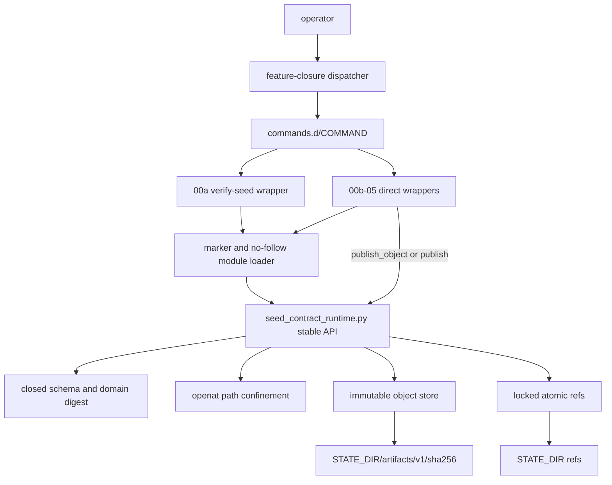
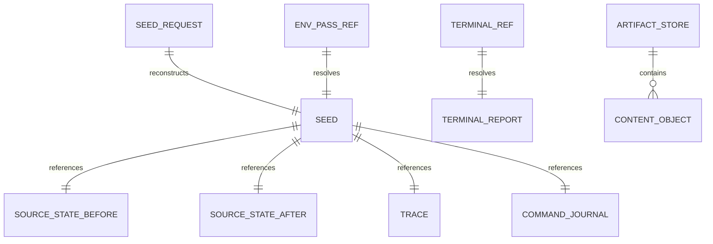
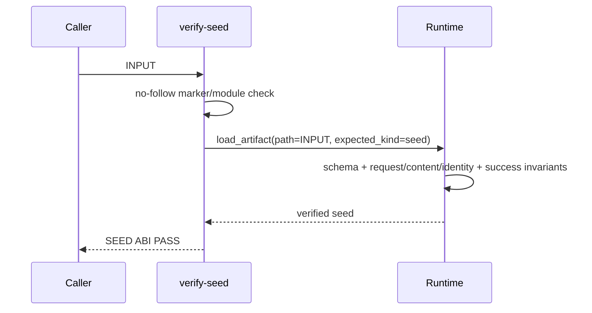
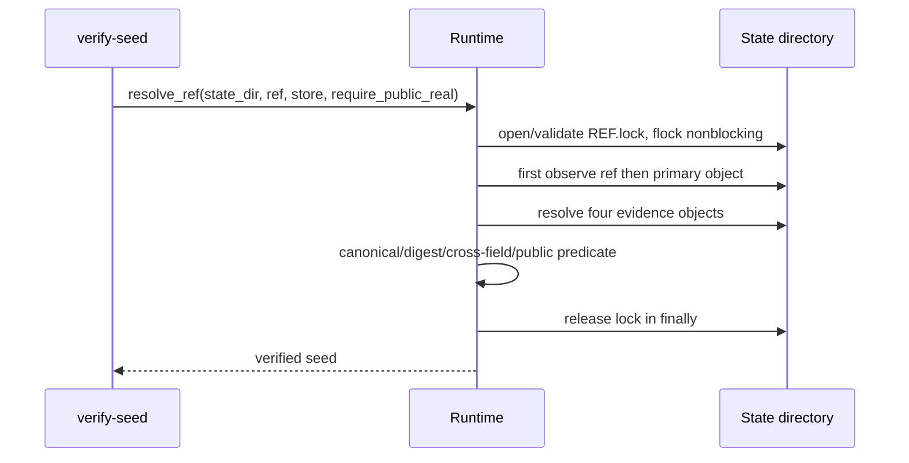
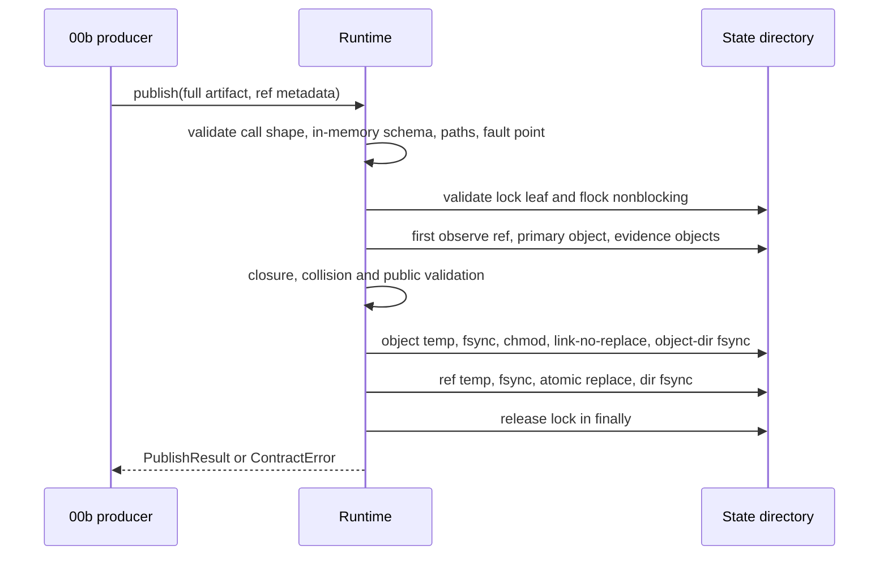

# 2026-09-01-00a-seed-contract-runtime 设计

## 概述

方案是在 `common/.harness/closure/v1` 下增加一个版本化 Python runtime，以一个极薄的 Bash dispatcher 和 Python `verify-seed` direct command 暴露稳定 ABI；runtime 集中拥有 schema、digest、路径、object/ref 与错误状态机，00b 只负责采集并调用它。

关键决策：

1. 选择 Python 3.10+ 标准库实现 schema/JCS 子集、SHA-256、`openat` 路径遍历、`flock` 和 durable publish，因为现有 harness 已依赖 Python 且 AOSP host 环境稳定具备它；放弃 shell 内实现 JSON/digest/原子发布，后者无法可靠拒绝 duplicate key、bool-as-int 与 nested contract。
2. 选择“完整 artifact dict 入参 + runtime 写 canonical bytes”的 producer ABI，使 consumer/producer 共享同一 validator 和 domain table；放弃由 producer 拼 envelope 或直接提交 caller bytes，避免 00b 重造 schema 和错误优先级。
3. 选择一个 executable direct command 自行完成 marker/module pre-import check，dispatcher 只校验 command name/regular executable 并 `exec`；放弃把 recovery 依赖放入 dispatcher，确保 00a 被 revert 后后序 wrapper 能独立 fail closed。
4. 选择内容寻址 object 与 ref 分离、object hard-link no-replace、ref lock 后 atomic replace；放弃单文件可变状态和“故障时删除已提交 object”，因为 orphan object 可安全重算，而 dangling ref 不可接受。

## 需求映射

| 组件 | 实现的需求 |
|---|---|
| dispatcher `feature-closure` | R1, R2, R13 |
| direct command `verify-seed` | R2, R10, R11, R12, R13, R14 |
| marker + runtime loader contract | R14, R16 |
| runtime schema/canonical/digest layer | R3, R4, R10, R11, R12 |
| runtime path/store/ref layer | R5, R6, R7, R8, R9, R12, R15 |
| runtime public/evidence-closure validator | R10, R11, R12 |
| contract fixtures + acceptance suite | R3–R18 |
| tasks/review/rollback process | R16, R17, R18 |

## 架构

分层边界如下：CLI 层只解析两个 grammar 并翻译 `ContractError.code`；runtime 的纯数据层不访问 filesystem，存储层只接受已验证的完整 artifact；path 层返回固定 `StatePaths`，所有写入都使用其 directory fd。现有 `.claude`/`.codex` adapter、feature manifest 与 session-state foundation 不被修改。

技术栈固定为 Bash 4+（dispatcher/test entry）与 Python 3.10+ 标准库。Canonical JSON 只处理 closed schema 的 ASCII keys、无 lone-surrogate UTF-8 strings、null/bool 与 I-JSON safe integers，拒绝 float；在此输入域，`json.dumps(ensure_ascii=False,sort_keys=True,separators=(",",":"))` 产生 RFC 8785 相同 bytes。Parser 先用 `object_pairs_hook` 拒绝 duplicate key，再递归拒绝 lone surrogate 和超出 `±(2^53-1)` 的整数；golden 包含 max/min safe integer、越界相邻值、escaped surrogate 和 Unicode string vectors。

## 组件与接口

### Exact upstream/downstream contract

- 消费（逐字）：2026-09-01-00-environment-seed-preflight 的 supersession/v1 replacement、R1-R27 owner 与预算合同，并以 DECISIONS 2026-09-02 canonical numeric ABI supersession 替代原 signed/unsigned-64 JSON number 接受域
- 产出（逐字）：seed-contract-runtime/v1 marker+Python module API；`./common/.harness/bin/feature-closure verify-seed INPUT` 或 `verify-seed --ref REF --artifact-store STORE [--require-public-real]`；同 grammar 的 `common/.harness/closure/v1/commands.d/verify-seed` direct recovery ABI
- Dispatcher productions：`./common/.harness/bin/feature-closure verify-seed INPUT`；`./common/.harness/bin/feature-closure verify-seed --ref REF --artifact-store STORE [--require-public-real]`。
- Direct productions：`common/.harness/closure/v1/commands.d/verify-seed INPUT`；`common/.harness/closure/v1/commands.d/verify-seed --ref REF --artifact-store STORE [--require-public-real]`。

### Dispatcher

- 职责：校验唯一 subcommand 并从自身 realpath 定位 direct executable。
- 对外接口：`./common/.harness/bin/feature-closure SUBCOMMAND [ARGS...]`；本 spec 新增 `verify-seed`。
- 依赖：Bash、`readlink`、`commands.d/SUBCOMMAND`。

### Verify-seed direct command

- 职责：在 runtime 可用性检查后解析互斥 grammar、调用 runtime、输出 exact channel contract。
- 对外接口：上方四个完整 production；dispatcher 与 direct 的参数 grammar 完全相同，只替换 executable prefix。
- 依赖：marker、runtime module、Python 3.10+。

### Runtime availability contract

- 职责：让后序 direct wrapper 在导入前确定 00a ABI 是否存在。
- 对外接口：regular file `common/.harness/closure/v1/runtime/seed-contract-runtime.version` 的 exact bytes `seed-contract-runtime/v1\n`；module `common/.harness/closure/v1/lib/seed_contract_runtime.py`。
- 依赖：`os.open(...,O_NOFOLLOW)`、`stat.S_ISREG`、Python compile/exec loader。

### Stable runtime API

- 职责：唯一拥有 artifact schema、digest、路径、resolve 与 publish 行为。
- 对外接口：
  - `ContractError(code: str)`，只读 `.code: str`。
  - `RUNTIME_ABI == "seed-contract-runtime/v1"`。
  - `load_artifact(*, path: str, expected_kind: str) -> dict`。
  - `canonical_bytes(*, value: object) -> bytes`。
  - `domain_digest(*, domain_ascii: str, value: object) -> str`。
  - `validate_state_paths(*, state_dir: str, out_ref: str | None, artifact_store: str, forbidden_roots: tuple[str, ...]) -> StatePaths`。
  - `resolve_ref(*, state_dir: str, ref: str, artifact_store: str, forbidden_roots: tuple[str, ...], require_public_real: bool = False) -> dict`。
  - `publish_object(*, state_dir: str, artifact_store: str, object_kind: str, payload: dict, forbidden_roots: tuple[str, ...], fault_point: str | None = None) -> ObjectResult`。
  - `publish(*, state_dir: str, out_ref: str, artifact_store: str, object_kind: str, payload: dict, ref_kind: str, semantic_exit: int, forbidden_roots: tuple[str, ...], fault_point: str | None = None) -> PublishResult`。
- 依赖：Python `json/hashlib/os/stat/fcntl/secrets`；无第三方 package。

`StatePaths` 是 `MappingProxyType` 包裹 exact dict 的 runtime read-only `Mapping[str, str | None]`；`ObjectResult`/`PublishResult` 是 exact-key ordinary dict。所有 public callable 使用 `*` 强制 keyword-only；wrapper 只构造合法 call shape。成功绑定后的 value/combination invalid 由 runtime 抛 `ContractError("ARGUMENT_ERROR")`；unknown/missing/positional call-shape 的 Python `TypeError` 属于 caller programmer error，和其他非 `ContractError` 一样在 CLI boundary fail closed 为 `RUNTIME_INTERNAL`。

### Internal validators and store primitives

- 职责：按 kind dispatch `_validate_*`，重建 seed request/identity，检查 success/evidence closure，并以 directory fd 完成 object/ref commit。
- 对外接口：无稳定外部接口；测试允许直接调用 `_validate_public_real(payload, evidence)` pure seam，但 00b 不得依赖下划线符号。
- 依赖：Stable runtime API 的输入/错误合同。

## 数据模型

持久化模型由六类完整 artifact、两个只参与 digest 的内部 payload、immutable object 和 mutable ref 组成。字段/enum/nullability/order 的唯一规范是 `requirements.md` 的 Stable data ABI；实现以 per-kind validator table 表达，不能在 wrapper 复制。

Domain→payload table 固定为：

| domain separator | payload |
|---|---|
| `aosp-harness/seed-request/v1\0` | 完整 `seed_request` artifact |
| `aosp-harness/project-source-state/v1\0` | 单个 source-state project item |
| `aosp-harness/source-state/v1\0` | 完整 `source_state` artifact |
| `aosp-harness/trace/v1\0` | 完整 `trace` artifact |
| `aosp-harness/command-journal/v1\0` | 完整 `command_journal` artifact |
| `aosp-harness/seed-content/v1\0` | exact seed-content internal payload |
| `aosp-harness/seed-identity/v1\0` | exact seed-identity internal payload |
| `aosp-harness/seed-artifact/v1\0` | 完整 `seed` artifact |
| `aosp-harness/terminal-report/v1\0` | 完整 `terminal_report` artifact |

Object bytes 是 canonical JSON + LF，文件名 digest 对不含 LF 的 canonical payload 加对应 domain 求 SHA-256。

Filesystem state：`ARTIFACT_STORE=STATE_DIR/artifacts/v1`，object directory 是其 `sha256` child；ref 是 state-dir 内任意通过约束的 absolute descendant，lock 是 adjacent `REF.lock`。Object mode 0444、temp/lock mode 0600。Ref bytes只有 `{schema_version,kind,digest}` canonical JSON + LF。

## 数据流

### Fixture/direct verification

### Locked ref resolution and public gate

### Durable publication

`publish_object` 走独立 object-only 分支：完成 call/in-memory schema/path validation 后直接观察同 digest object，再执行 object temp/link/fsync；它不读取 ref/evidence、不创建 ref lock，每次只清除自己创建的 temp。

### Filesystem threat boundary

路径层以逐分量 dirfd + `O_NOFOLLOW` 阻断 static symlink/non-regular/containment escape，并在稳定目录拓扑下支持受 lock 协调的并发 publisher。Linux/POSIX 的 `mkdirat` 不返回新目录 fd，`openat(O_CREAT|O_DIRECTORY)` 也不可用，因此 post-`mkdirat`/pre-open 的同 UID hostile rename 无法同时满足 moved-inode discovery 与 guaranteed cleanup；该主动拓扑攻击显式排除。实现仍检测可见的 dev/inode/path identity 变化，fail closed 并 best-effort cleanup；正常静态失败的 state-dir 外 entry 数必须为零。

## 错误处理

State machine 由 dispatcher/direct/runtime 三层串成单一 staged coordinator，stop-at-first：

1. Dispatcher：missing subcommand `ARGUMENT_ERROR` → invalid name `INVALID_COMMAND` → invalid target contract `COMMAND_UNAVAILABLE`；不解析 child argv。
2. Direct startup：marker/module/import `RUNTIME_UNAVAILABLE` → command grammar `ARGUMENT_ERROR`。因此 unavailable target/runtime 分别遮蔽 invalid child argv。
3. Runtime pre-lock：bound-value `ARGUMENT_ERROR → DESCRIPTOR_NOT_FOUND → DESCRIPTOR_INVALID_UTF8 → DUPLICATE_JSON_KEY → UNSUPPORTED_SCHEMA_VERSION → DESCRIPTOR_SCHEMA_INVALID → SOURCE_ROOT_CONTRACT → STATE_DIR_CONTRACT → OUT_REF_CONTRACT → WORKTREE_MISMATCH`；不适用当前 production 的状态跳过。
4. Lock：symlink/non-regular/wrong owner/mode/open error `OUT_REF_CONTRACT` → 合法 fd contention `REF_BUSY`。
5. 持锁后首次观察 filesystem：resolver 为 `ARTIFACT_MISSING(ref) → REF_CORRUPT(ref) → ARTIFACT_MISSING(primary/evidence object) → REF_CORRUPT(object/closure) → PUBLIC_SCOPE_REQUIRED`；publisher 跳过 missing-ref error、允许 create，其余顺序相同。
6. Commit：`DIGEST_CHECK → OBJECT_TEMP → OBJECT_LINK → OBJECT_DIR_FSYNC → REF_TEMP → REF_RENAME → REF_DIR_FSYNC`。Validation code 遮蔽 fault；collision、precommit、orphan、durability-uncertain 分别按 requirements matrix 返回。
7. 所有持锁路径用 `finally` 释放 lock；受控 fault 同样清除本 invocation temp。只有 `REF_RENAME` 后失败不尝试猜测回滚。

| 错误场景 | 恢复策略 | 校验位置 | 日志 | 用户可见 |
|---|---|---|---|---|
| CLI/command/runtime 不可用 | 写入前终止 | dispatcher/direct loader | 无内部日志 | exit 30，`CONTRACT CODE` |
| descriptor/schema/nested invariant invalid | 写入前终止 | data validator | 无内部日志 | exit 30，priority code |
| state/store/ref parent/lock leaf unsafe | 不跟随 symlink、不创建越界 leaf | path/lock layer | 无内部日志 | `STATE_DIR_CONTRACT`/`OUT_REF_CONTRACT` |
| 合法 lock 正被持有 | nonblocking fail，caller 可稍后重放 | ref layer | 无内部日志 | `REF_BUSY` |
| ref 或 evidence object missing | 不修改状态 | resolver | 无内部日志 | `ARTIFACT_MISSING` |
| ref/object bytes、kind、digest、closure corrupt | 不修复、不覆盖 | resolver/publisher preflight | 无内部日志 | `REF_CORRUPT` |
| public identity 不匹配 | 不提升 fixture/local/vendor | public validator | 无内部日志 | `PUBLIC_SCOPE_REQUIRED` |
| digest path 已有不同 bytes | 保留 existing object/ref | object commit | 无内部日志 | `DIGEST_COLLISION` |
| object link 前 fault | 清除本次 temp | object commit | 无内部日志 | `PUBLISH_PRECOMMIT_FAILED` |
| object link 后、ref rename 前 fault | orphan object 可留存，旧 ref 不变 | publish state machine | 无内部日志 | `PUBLISH_OBJECT_ORPHANED` |
| ref rename 后 fsync fault | 不猜测回滚，重放解析 | ref commit | 无内部日志 | `REF_DURABILITY_UNCERTAIN` |
| 非 `ContractError` | fail closed | direct CLI boundary | 无 traceback | `RUNTIME_INTERNAL` |

所有可预期错误 stdout 为空、stderr exact 一行。测试 fault seam 只接受 requirements 固定的 stage name；未知 fault point 是写入前 `ARGUMENT_ERROR`。Direct wrapper 另有不公开的 test-only env seam `AOSP_HARNESS_TEST_UNEXPECTED=call-shape-type-error`：它在完成 runtime import 后故意用 positional call 调用一个 stable keyword-only callable，让真实 binding `TypeError` 穿过同一 CLI boundary 并验证 exact `RUNTIME_INTERNAL`；生产路径不设置该变量。

## 测试策略

| 层 | 测什么 | 用什么工具 |
|---|---|---|
| 单元 | 六 artifact schema、semantic/sorted arrays、canonical/digest、request/identity/success/public predicate、错误优先级 | Python stdlib test driver，table-driven mutation |
| 集成 | no-follow path、forbidden roots、稳定拓扑下 object idempotence/collision、lock/ref、evidence closure、fault matrix、temp/sentinel 不变量；hostile same-UID rename 仅验 fail closed/best-effort | 临时目录 + Python subprocess/fcntl |
| 端到端 | dispatcher/direct exact parity、fixture/ref CLI channel、runtime unavailable、旧 harness 三项 regression | `bash common/tests/test-seed-contract-runtime.sh` |
| 性能 | 不设时延目标；只在 final review 机械统计 non-generated diff ≤730、review summary ≤140 | `git diff --numstat` + `wc -l` |

主命令 `bash common/tests/test-seed-contract-runtime.sh` 捕获所有子进程 channel，成功时自身 stdout 只输出 `RESULT PASS seed-contract-runtime`、stderr 为空。四个 case entry 分别实现 requirements 的 digest immutability、path confinement、failure ref rules、public real gate；rollback case 只在 merge SHA 已写 ledger 的 isolated worktree 执行。实现阶段不运行 AOSP 命令。

Rollback topology 固定为：从 ledger 读取 00a exact two-parent merge SHA并验证 parent count；以该 merge 为 base 创建 isolated worktree；先提交一个 descendant commit，唯一新增 mode 0755 的 `commands.d/recovery-fixture`，其 pre-import check 与 R14 相同；再执行 `git revert -m 1 --no-edit MERGE_SHA`。Oracle 要求 descendant wrapper 仍为 regular executable，dispatcher/marker/module/verify-seed 都不存在，wrapper exact 返回 `CONTRACT RUNTIME_UNAVAILABLE`，随后三个旧 harness 命令逐字匹配 requirements 的 PASS 行。Descendant/revert commit 都不合入主线。

行预算在 tasks 前锁定为 high estimate 725（低于 730 ceiling），且不以省略 matrix 换预算：

| 文件 | high non-generated lines |
|---|---:|
| dispatcher | 18 |
| verify-seed direct command | 60 |
| version marker | 1 |
| runtime | 360 |
| golden JSON | 1 |
| Python test driver | 260 |
| Bash acceptance entry | 25 |
| **总计** | **725** |

实现通过 declarative exact-key/type/domain tables与 table-driven mutation 控制重复；若 tasks estimate 任何调整使 high >730，立即回 PLAN 而不是进入 implementation。Acceptance 的 schema/test review summary hard cap 140 行。

## 文件清单

| 文件 | 创建/修改 | 职责（一句话） |
|---|---|---|
| `common/.harness/bin/feature-closure` | 创建，mode 0755 | 唯一 closure command dispatcher |
| `common/.harness/closure/v1/commands.d/verify-seed` | 创建，mode 0755 | runtime availability check、CLI grammar 与 exact channel adapter |
| `common/.harness/closure/v1/runtime/seed-contract-runtime.version` | 创建 | direct wrapper 消费的 ABI marker |
| `common/.harness/closure/v1/lib/seed_contract_runtime.py` | 创建 | closed schema/digest/path/object/ref stable runtime |
| `common/tests/fixtures/aosp17-services/seed.golden.json` | 创建 | schema-valid fixture_only positional ABI golden |
| `common/tests/test_seed_contract_runtime.py` | 创建 | table-driven unit/integration/CLI/fault assertions |
| `common/tests/test-seed-contract-runtime.sh` | 创建，mode 0755 | 单一验收入口与 case/rollback routing |

验收资产（不纳入源码文件清单）：`evidence/pre-implementation.txt` 的真实 red；implementation/acceptance reports；isolated rollback worktree、descendant fixture commit 和 revert commit（均不合入主线）。
