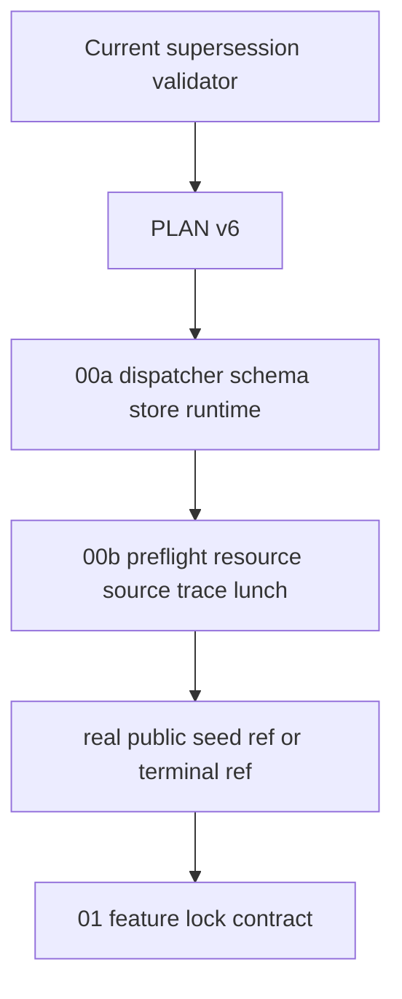
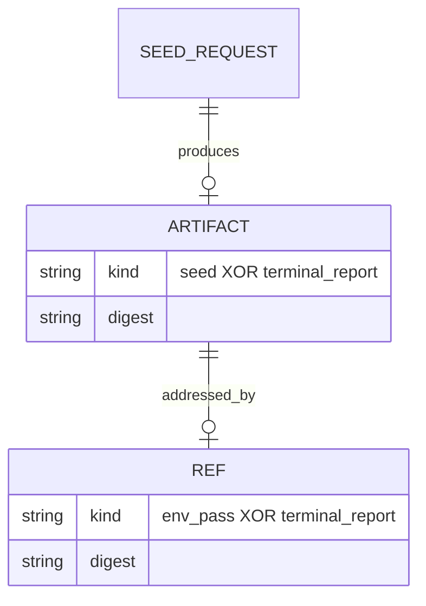
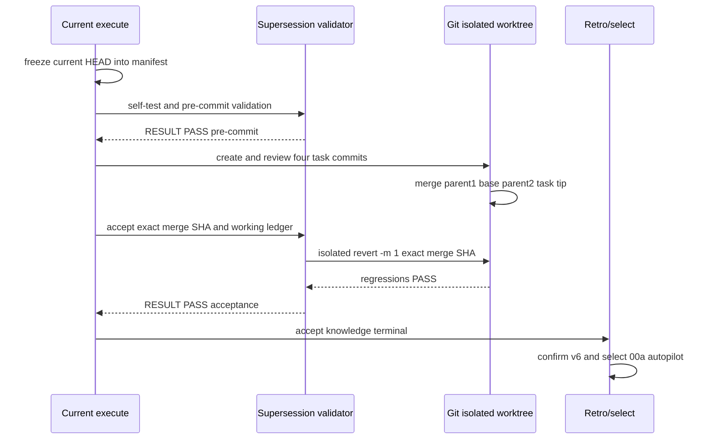

# 任务 4: 实现完整 mutation self-test 与 cumulative gate

> 这是你的需求。数值、签名、命令一律照抄，不要自己发挥。
> 你只做这一个任务，不要顺手做别的。不要派 subagent。

---

## 完整上下文

下面是整个 spec 的三个文件，让你了解整体需求、设计和任务分解。
**但你只执行「你的任务」那一节，不要去做别的任务。**

### Requirements

> 用户原话：
> “可以用 `~/Project/lk7k-a17/system` 本地代码来做验证。”
>
> “`source build/envsetup.sh`”
>
> “`lunch sys_mssi_64_64only_cn_armv82-fooding-userdebug`”
>
> 上游计划：`PLAN.md` v4 的 `00-environment-seed-preflight`。

> Supersession applicability：门③ R24 已证明本原片 890–1310 行并由 PLAN v6 的 00a/00b 替代；下列 R1–R23、R25–R27 是 successor 的迁移合同，不冒充当前知识终止片实现。当前片只实现 R24 的 machine-readable supersession，以四个non-overlap task commits和exact two-parent merge交付；R25 的真实environment implementation recovery oracle仍由00a/00b各自requirements重新固定。

## 目标

由 `seed-request/v1` 驱动 `feature-closure preflight`，在 worktree 外的 `state-dir` 与 `OUT_DIR` 中产出可供后序直接消费的 `seed/v1` 或 `terminal-report/v1`。本片同时固化 public AOSP17 Cuttlefish 与 local LK7K product 两种 `source_scope`，以及 `AOSP_SOURCE_ROOT`、`AOSP_LUNCH_TARGET`、`AOSP_HARNESS_STATE_DIR`、`sys_mssi_64_64only_cn_armv82`、`fooding`、`userdebug`、`f_bavail`、`f_frsize`、`f_favail`、`MemAvailable`、`openat`、`mkdirat`、`O_NOFOLLOW`、`schema_version`、`kind`、`digest`、`evidence_class`、`fixture_only`、`COMMAND_UNAVAILABLE` 等稳定标识；通过固定 dispatcher/direct ABI、内容寻址发布、network namespace、syscall trace、源码状态和执行器审计，使后序能区分公共 baseline 与本地 vendor 证明。

## 需求

R1. [原话] 当执行本机 LK7K 验收时，系统必须使用调用侧已展开为 `/home/zzh0838/Project/lk7k-a17/system` 的用户指定源码路径。

R2. [原话] 当执行本机 LK7K 构建环境探针时，系统必须使用用户指定的 `source build/envsetup.sh` 与 `lunch sys_mssi_64_64only_cn_armv82-fooding-userdebug`。

R3. [计划] 当调用侧生成 descriptor 时，系统必须把源码绝对 realpath 写入输入；通用 CLI 不展开字面量 `~`、不硬编码用户路径，也不从 `AOSP_SOURCE_ROOT`、`AOSP_LUNCH_TARGET` 或 `AOSP_HARNESS_STATE_DIR` 覆盖 descriptor/CLI 参数。

R4. [计划] 当运行 envsetup/lunch 时，系统必须先切换到 descriptor 指定源码根，在 state-dir 后代临时 `OUT_DIR` 中记录封闭 build-variable 集与 exit code，不运行模块、整机、打包或刷机 goal。

R5. [计划] 系统必须把 `./common/.harness/bin/feature-closure SUBCOMMAND` 固化为唯一 dispatcher ABI，把合法 command name 限定为 ASCII regex `^[a-z][a-z0-9-]{0,31}$`，并从 dispatcher 自身 realpath 的 parent 固定解析 `../closure/v1/commands.d/SUBCOMMAND` 后仅 exec 该可执行 regular file。

R6. [计划] 系统必须把 `common/.harness/closure/v1/commands.d/preflight --descriptor FILE --state-dir ABS_DIR --out-ref ABS_REF` 固化为 direct recovery ABI；dispatcher 形式只在该 argv 前增加 `preflight`，两种形式不得改变其余参数。

R7. [计划] 当 CLI 读取输入时，系统必须把 descriptor 只解释为不可变 `seed-request/v1`，把 state-dir/out-ref 只解释为运行时位置，把成功输出解释为 `seed/v1`；00 是两类 seed schema/producer/fixture 与固定 public/local ref 的唯一 owner，后序只通过 ref 重算 object。

R8. [计划] 凡具备 state-dir 消费能力，系统必须要求 state-dir 是已存在、可写、无 symlink 分量且 normalized absolute path 等于 realpath 的目录，并以逐分量 `openat`/`mkdirat` 加 `O_NOFOLLOW` 创建 store、OUT_DIR 和 ref parent，拒绝 symlink/non-directory leaf。

R9. [计划] 当校验路径隔离时，系统必须枚举 harness repo、`.repo/manifests`、`.repo/repo` 和 locked manifest 中每个现存 project 的 `git worktree list --porcelain`，按 path-component containment 拒绝 state-dir/store/OUT_DIR/out-ref 与任一 worktree 相等或位于其后代；尚不存在的 leaf 按已解析 parent 加 lexical basename 判定。

R10. [计划] 当 seed 工作区可读时，系统必须按下文 closed schema 记录 manifest/Repo commits、launcher digest、locked manifest digest、去凭据 URL、Repo/Git/Python identity、project/host/container/resource/lunch/source-state/guard evidence 与 seed content digest。

R11. [计划] 当 source scope 为 public AOSP17 Cuttlefish 时，系统必须要求 `role=public_aosp17_cuttlefish`、`public_aosp_baseline=true`、`vendor_context=false` 和 `platform_family=aosp-17`；00 只有在 real public invocation exit 0、固定 public ref 可重算且 `evidence_class=real_source` 时输出 `GATE CONTINUE_PUBLIC`，否则输出 `GATE PLAN_REVIEW` 并停止进入 01，02/verify-proof 只消费该 public ref。

R12. [计划] 当 source scope 为 local LK7K product 时，系统必须要求 `role=local_lk7k_product`、`public_aosp_baseline=false`、`vendor_context=true`、product=`sys_mssi_64_64only_cn_armv82`、release=`fooding` 和 variant=`userdebug`；后序不得用它替代 public baseline。

R13. [默认] 在检查磁盘资源期间，系统必须以 unsigned-64 饱和乘法计算 `f_bavail * f_frsize` available bytes，以 `f_favail` 计 available inodes，拒绝 descriptor 中 available-bytes 小于 214748364800 或 inode 小于 1000000 的 threshold，并分别比较 available inodes 与 available bytes 是否不小于 threshold、estimated disk upper bound 两者中的对应要求。

R14. [默认] 在检查内存资源期间，系统必须拒绝 descriptor 中 effective-memory threshold 小于 34359738368，优先在存在 `cgroup.controllers` 时读取完整 v2 pair，否则读取完整 v1 pair；v2 用 `memory.max-memory.current`，v1 用 `memory.limit_in_bytes-memory.usage_in_bytes`，`max` 或不小于 2^60 的 limit 视为无限，负 remaining 截为 0，所选 pair 不完整则 remaining=null，并以 host `MemAvailable` 与非 null remaining 的较小值比较 request threshold。

R15. [默认] 在检查 CPU 资源期间，系统必须拒绝 descriptor 中 effective-CPU threshold 小于 8，优先选择完整 v2 provider、否则完整 v1 provider；cpuset 不可读时取 online set，quota 不可读/`max`/非正时取无限，online 与 cpuset intersection cardinality 再与 quota/period rational 取较小值，并以交叉乘法判断该 rational 是否不小于 request threshold。

R16. [默认] 当 Repo workspace 含 tracked change 或 recursive untracked entry 时，系统必须保持环境可继续，写入 `source_state=dirty`、按 manifest project path 去重的 affected count、`clean_source_proof=false` 与可重算 source-state digest；clean 时 count=0 且 flag=true。

R17. [计划] 在 preflight 执行期间，系统必须以 unprivileged user+network namespace 运行 envsetup/lunch，以 trace 收集全部 descendant process/file/network syscall；非 loopback external network 成功、源码 mutation、sync/download、ninja/compiler、模块/整机 goal 和打包入口的成功计数必须均为 0，仅 `soong_ui --dumpvars-mode` 且不含 `--make-mode` 的配置查询属于有效 lunch probe。

R18. [计划] 当重算源码状态时，系统必须在 probe 前后使用 locked manifest 和每个 project 的 HEAD、`git status --porcelain=v2 -z --untracked-files=all`、下文 entry digest 生成 source-state；任何 probe 实际读取的 ignored regular/symlink input 必须由 trace 枚举并加入 seed content，任何 ignored write 必须计作源码 mutation。

R19. [计划] 当全部 contract、environment、lunch、guard 和 before/after digest 检查通过时，系统必须 exit 0，stdout 精确一行 `ENV PASS SCOPE_ID`，stderr 为空，先发布 evidence objects 与 `seed/v1`，最后在独占 ref lock 下发布 scope 对应的 `kind=env_pass` ref。

R20. [计划] 如果发生有效请求下的源码/Repo/envsetup/tool/worktree-enumeration/resource/namespace/trace/lunch/guard/source-stability 不可用，系统必须 exit 20，stdout 精确一行 `ENV NOT-AVAILABLE REASON_CODE`，stderr 为空，先发布不超过 120 行的 terminal artifact，最后在独占 ref lock 下发布 `kind=terminal_report` ref，并使控制平面输出 `GATE PLAN_REVIEW`、停止进入 01。

R21. [计划] 如果发生下文 validation priority 中的 argument/command/descriptor/path/ref/digest contract error，系统必须在任何 publish commit point 前 exit 30，stdout 为空，stderr 精确一行 `CONTRACT ERROR_CODE`，且 existing object/ref sentinel bytes 不变。

R22. [计划] 如果发生 output digest collision、existing ref corruption、ref lock conflict 或 object/ref publish fault，系统必须以 exit 30、空 stdout 和精确一行 `CONTRACT ERROR_CODE` 按下文 post-observation matrix 返回；允许留下可重算且无 ref 的 orphan content object，任何可见 ref 必须指向 matching object，不声称 post-commit fault能全量回滚。

R23. [计划] 当 dispatcher/direct ABI 使用同一 deterministic fixture 时，系统必须得到相同 exit/stdout/stderr/artifact digest/ref bytes；dispatcher 缺席不影响 direct module，command 缺失或不可执行时 dispatcher 必须 exit 30 并返回 `COMMAND_UNAVAILABLE`。

R24. [计划] 当 tasks estimate 预测 non-generated diff 超过 800 行或 human-review test/descriptor summary 超过 160 行时，系统必须在 implementation 前回 PLAN 拆为 00a/00b；当 actual 值超限时，系统必须在 implementation acceptance 前执行同一拆分，不以超预算实现通过 00。

R25. [计划] 当 00 exact merge commit 已写入 ledger 时，系统必须在 isolated worktree revert 该 commit，确认 dispatcher path 不存在，再由 rollback test 安装 `commands.d/recovery-fixture` 并直接执行得到 exit 0、stdout 精确 `RECOVERY PASS recovery-fixture`、stderr 为空，同时现有 harness test/parity/dev-sidebar demo verifier 分别输出其精确 PASS 行。

R26. [默认] 当 resource threshold 等于 measured value 或比 measured value 大 1 时，系统必须分别通过该资源项或按 exit 20 处理。

R27. [默认] 如果发生任一 threshold 缺失、为负、为 float 或超过 unsigned-64，系统必须按 validation priority 以 exit 30 处理。

## Stable data ABI

所有 JSON 拒绝 duplicate key、float、非 UTF-8、unknown/missing field；除 trace syscall `result`/`dirfd` 是 signed-64 外，integer 均为 0..2^64-1，array 保持下文排序。payload 使用 RFC 8785 UTF-8 bytes；artifact object 位于 `STATE_DIR/artifacts/v1/sha256/<64-lower-hex-digest>`，mode 0444。fixture/golden bytes 只验证本节，不创造字段。

### seed-request/v1 input

| field | type/value |
|---|---|
| `schema_version` / `kind` | integer `1` / string `seed_request` |
| `source_root` / `envsetup_relpath` | absolute realpath string / normalized relative string `build/envsetup.sh` |
| `lunch` | object exactly `{target,product,release,variant}`，all nonempty strings |
| `source_scope` | object exactly `{role,public_aosp_baseline,vendor_context,platform_family}`，values obey R11 or R12 |
| `resource_minimums` | object exactly `{available_bytes,available_inodes,effective_memory_bytes,effective_cpus}`，unsigned integers |
| `estimated_disk_upper_bound_bytes` | unsigned integer |

request digest is `SHA-256("aosp-harness/seed-request/v1\0" + RFC8785(payload))`; input bytes stay unchanged. Orchestration requires an existing absolute `AOSP17_SEED_REQUEST` file supplied by the public-source owner and passes it as `--descriptor`; CLI never reads that environment variable. Public out-ref is exactly `STATE_DIR/refs/aosp-feature-minimal-checkout/aosp17-services-env.json`. Local test generates its request from the three local `AOSP_*` wrapper variables and uses exactly `STATE_DIR/refs/aosp-feature-minimal-checkout/lk7k-a17-env.json`. Out-ref must equal the scope-derived absolute normalized path, its existing parent components must resolve under state-dir without symlink, and adjacent `OUT_REF.lock` is held exclusively from pre-observation ref validation through ref-dir fsync; nonblocking lock failure is `REF_BUSY`.

### source-state/v1 evidence

Payload top-level is exactly `{schema_version:1,kind:"source_state",manifest_sha256,projects}`. `projects` sorts by UTF-8 manifest path and each item is exactly `{path,head,status_sha256,entries}`; HEAD is 40/64 lower hex, status digest hashes the exact porcelain NUL bytes. `entries` sorts by decoded raw path bytes and each item is exactly `{path_b64,status_record_b64,entry_kind,mode,content_sha256,symlink_target_sha256}`; kind is `regular|symlink|missing`, mode is unsigned integer, and inapplicable digests are null. Rename/copy records contribute both raw paths; untracked directories are never folded. Per-project digest is `SHA-256("aosp-harness/project-source-state/v1\0" + RFC8785(project item))`; workspace digest is `SHA-256("aosp-harness/source-state/v1\0" + RFC8785(top-level payload))`.

### trace/v1 evidence

Payload is exactly `{schema_version:1,kind:"trace",records,counts}`. Capture uses one tracer stream, assigns process ordinal by first-seen PID and monotonic sequence by observed syscall order; records remain sequence ordered and each is exactly `{sequence,process_ordinal,syscall,result,errno,exec_argv_b64,paths,address_family,classification}`. `result` is signed-64, `errno` is null on result >=0 or stable errno name on failure, `exec_argv_b64` is an ordered array of raw argument byte strings only for execve/execveat and null otherwise. `paths` is an ordered array whose item is exactly `{role,dirfd,raw_b64,resolved_b64}`; role is `path|oldpath|newpath|target|linkpath|source_fd|destination_fd`, dirfd is signed-64 or null, and every path-bearing syscall records all operands. Resolution tracks each process cwd/root/fd table across chdir/chroot/open/dup/close/fork, resolves dirfd through proc fd links, resolves every existing symlink prefix, and resolves a missing leaf against its no-follow real parent.

`classification` is one of `other|external_network|source_mutation|sync_download|config_query|module_build|package`; counts has exactly these classes as unsigned integers and counts only result >=0. External network means successful connect/sendto/sendmsg to non-loopback AF_INET/AF_INET6. Source mutation covers successful write/pwrite/writev/pwritev, writable shared mmap/msync, open/creat with create/truncate/write/append, truncate/ftruncate/fallocate, copy_file_range/sendfile/splice destination, rename/unlink/mkdir/rmdir/link/symlink/mknod, chmod/chown/utime, setxattr/removexattr families when any resolved target/fd is under source root. Digest is `SHA-256("aosp-harness/trace/v1\0" + RFC8785(payload))`. Real trace digest is run audit evidence and is not part of stable seed identity.

### command-journal/v1 evidence

Payload is exactly `{schema_version:1,kind:"command_journal",records}`. Records are ordered and each is exactly `{stage,argv_b64,cwd_b64,exit_code,trace_first_sequence,trace_last_sequence}`; stage enum/order is `manifest_before,source_state_before,namespace_probe,envsetup_lunch,manifest_after,source_state_after` and every stage occurs exactly once. Digest is `SHA-256("aosp-harness/command-journal/v1\0" + RFC8785(payload))`; empty/missing/reordered stages are invalid.

### seed/v1 success output

Top-level is exactly `{schema_version:1,kind:"seed",evidence_class,request_digest,source_scope,source,manifest,tools,execution,resources,lunch,source_state,guard,seed_content_digest,seed_identity_digest}`. `evidence_class` is `real_source|fixture_only`; CLI real invocations always emit `real_source`, only deterministic golden generation emits `fixture_only`.

| object | exact children and types |
|---|---|
| `source_scope` | same four fields/values as request |
| `source` | `{root,envsetup_relpath}` strings |
| `manifest` | `{repository_commit,locked_xml_sha256,project_count,remotes,projects}`；commits/digests strings，count uint；remotes sort by name and contain `{name,fetch_url,review_url,mirror_url}` nullable credential-free strings；projects sort by path and contain `{path,name,remote,revision,head,source_state_digest}` strings，last digest is the project-source-state digest defined above |
| `tools` | `{repo_checkout_commit,repo_launcher_path,repo_launcher_sha256,repo_version,git_version,python_version}` strings or explicit null only for unavailable checkout commit |
| `execution` | `{host_arch,kernel_release,kind,container_digest}`；kind `host|container`，digest null iff host |
| `resources` | `{estimated_disk_upper_bound_bytes,minimums,measured,passed}`；minimums repeats request；measured exactly `{available_bytes,available_inodes,host_mem_available_bytes,cgroup_mem_remaining_bytes,effective_memory_bytes,online_cpu_count,cpuset_cpu_count,effective_cpu_numerator,effective_cpu_denominator}` with only cgroup/cpuset nullable；passed.disk iff available bytes ≥ max(request bytes, estimate)，inodes iff available inodes ≥ request inodes，memory iff effective bytes ≥ request memory，cpu iff rational ≥ request CPU |
| `lunch` | `{target,product,release,variant,variables,out_dir_relative,envsetup_exit,lunch_exit}`；variables exactly has `TARGET_PRODUCT,TARGET_RELEASE,TARGET_BUILD_VARIANT,TARGET_ARCH,TARGET_2ND_ARCH,HOST_OS,HOST_ARCH` as string/null；relative path is under `tmp/preflight`；exits uint |
| `source_state` | `{state,clean_source_proof,affected_project_count,before_digest,after_digest,observed_ignored_inputs}`；state `clean|dirty`；ignored inputs sort by logical raw path and each is exactly `{path_b64,resolved_path_b64,entry_kind,mode,content_sha256,symlink_target_sha256,target_content_sha256}` with kind `regular|symlink` and inapplicable digest null；a read symlink always hashes both target string and resolved target content |
| `guard` | `{parent_netns_inode,probe_netns_inode,trace_digest,command_journal_digest,external_network_count,source_mutation_count,sync_download_count,module_build_count,package_count}` integers/digests，namespace inode values differ |

Seed content payload is exactly `{locked_xml_sha256,projects,observed_ignored_inputs}` reusing the sorted manifest projects and ignored entries above; digest is `SHA-256("aosp-harness/seed-content/v1\0" + RFC8785(payload))`. Stable seed identity payload is exactly `{source_scope,manifest,tools,execution_identity,lunch_identity,source_state_identity,seed_content_digest}` where execution identity is host arch/kind/container digest, lunch identity excludes exits/OUT_DIR, source-state identity excludes trace/journal and uses before=after digest plus ignored inputs; digest is `SHA-256("aosp-harness/seed-identity/v1\0" + RFC8785(payload))`. Seed artifact digest is `SHA-256("aosp-harness/seed-artifact/v1\0" + RFC8785(full seed payload))`; downstream “seed digest” means `seed_identity_digest`, while run-varying resources/trace/journal only affect artifact digest. Two real runs with unchanged source/request must have equal seed content/identity digests even if artifact digests differ. `common/tests/fixtures/aosp17-services/seed.golden.json` is schema-valid public `fixture_only`;后序只消费固定 public ref 的 `real_source` object，不再消费 repo 内 `seed.json`。

### terminal-report/v1 output

Payload is exactly `{schema_version:1,kind:"terminal_report",request_digest,primary_reason,failed_checks,completed_observation_digests,summary_lines}`. `failed_checks` is unique and priority-sorted; completed digests is an object with exactly `{source_state,trace,command_journal}` nullable digest fields; summary lines is an array of at most 120 strings with no timestamp, username, credential or source content. Digest is `SHA-256("aosp-harness/terminal-report/v1\0" + RFC8785(payload))`.

### ref bytes

Ref bytes are exactly RFC 8785 of `{schema_version:1,kind,digest}` plus one LF. Kind is only `env_pass` for seed or `terminal_report` for terminal; digest always resolves to a matching object before ref commit.

## Deterministic state machine

Validation evaluates in this priority and stops at first error: `ARGUMENT_ERROR,INVALID_COMMAND,COMMAND_UNAVAILABLE,DESCRIPTOR_NOT_FOUND,DESCRIPTOR_INVALID_UTF8,DUPLICATE_JSON_KEY,UNSUPPORTED_SCHEMA_VERSION,DESCRIPTOR_SCHEMA_INVALID,SOURCE_ROOT_CONTRACT,STATE_DIR_CONTRACT,OUT_REF_CONTRACT,WORKTREE_MISMATCH,REF_BUSY,REF_CORRUPT`. All return exit 30, stdout empty, stderr exactly `CONTRACT CODE`; they precede observation/publication and create no object/ref. Existing ref is `REF_CORRUPT` unless it is exact three-field bytes resolving to a matching object.

For a valid contract, environment checks evaluate in this priority: `SOURCE_ROOT_UNAVAILABLE,REPO_METADATA_UNAVAILABLE,ENVSETUP_UNAVAILABLE,REPO_CLIENT_UNAVAILABLE,WORKTREE_ENUM_UNAVAILABLE,RESOURCE_DISK,RESOURCE_INODE,RESOURCE_MEMORY,RESOURCE_CPU,NETWORK_NAMESPACE_UNAVAILABLE,TRACE_UNAVAILABLE,LUNCH_FAILED,FORBIDDEN_EXECUTION,SOURCE_MUTATION,SOURCE_CHANGED`. Safe pre-lunch failures stop before lunch; otherwise all evaluated failures enter `failed_checks` in this order and the first is `primary_reason`. Exit is 20 with terminal artifact/ref.

After observation produces the intended output bytes, collision check and publish stages run in this order: `DIGEST_CHECK,OBJECT_TEMP,OBJECT_LINK,OBJECT_DIR_FSYNC,REF_TEMP,REF_RENAME,REF_DIR_FSYNC`. The producer holds the scope ref lock throughout; all conforming producers are single-writer for that ref.

| fault point | exit/code | permitted durable/visible state |
|---|---|---|
| `DIGEST_CHECK` finds same path/different bytes | 30 `DIGEST_COLLISION` | no object/ref change; this overrides original semantic exit 0/20 |
| before `OBJECT_LINK` | 30 `PUBLISH_PRECOMMIT_FAILED` | no new object/ref; old ref unchanged |
| after object link, before `REF_RENAME` | 30 `PUBLISH_OBJECT_ORPHANED` | intended immutable object may remain orphan; no new/dangling ref; old ref unchanged |
| after `REF_RENAME`, including ref dir fsync fault | 30 `REF_DURABILITY_UNCERTAIN` | ref may be old or exact intended bytes; if intended it resolves to matching object; replay is idempotent and any other bytes are `REF_CORRUPT` on next locked invocation |
| no fault | original 0 or 20 | object durable first, then exact ref durable |

Every exit-30 row above has empty stdout and stderr exactly `CONTRACT CODE`. Object uses same-directory temp+file fsync+chmod 0444+hard-link no-replace+object-dir fsync; same digest/same bytes reuses object, same digest/different bytes is collision. Ref uses same-directory temp+file fsync+atomic replace+ref-dir fsync. Temp files are removed best-effort and are never treated as objects/refs.

## Autopilot decisions

- Questions are 0/15 and rounds 0/2. User confirmed source path, lunch, PLAN v4 and autopilot; remaining choices are technical consistency decisions.
- 00 owns both seed scopes. Local LK7K is the real local verification input; public golden verifies ABI only. A real public seed is still mandatory before 02, so no vendor result is generalized.
- state-dir/path/schema errors are exit 30; valid-request environment shortages are exit 20. Post-commit faults follow the recoverable matrix instead of claiming impossible rollback.
- Defaults are 200 GiB, 1,000,000 inodes, 32 GiB and 8 CPUs; dirty source continues with non-clean proof. Local state-dir default is `/home/zzh0838/Project/.aosp-harness-state/aosp-feature-minimal-checkout`, never hardcoded in CLI.
- Guessing these ABI boundaries incorrectly would invalidate all downstream digests; they are therefore fixed here, recorded in DECISIONS and independently reviewed before design.

## 验收标准

Current R24-only terminal deliverables: `supersession/v1` manifest plus `supersession-validator/v1` modular dispatcher/core/pre-commit/accept/self-test and the three exact public PASS modes. They must prove PLAN v6 replacement/owner/budget, an execute-time frozen process baseline with zero `common/` increment, four non-overlap task commits, an exact six-path two-parent merge and isolated `git revert -m 1` before retro selects 00a; cumulative actual non-generated diff must remain `<=800` lines and every task review summary `<=160` lines. The implementation-oriented commands below remain migration criteria for successor 00a/00b and are not executed by this terminal.

主验证命令: bash -lc 'AOSP_SOURCE_ROOT="$HOME/Project/lk7k-a17/system" AOSP_HARNESS_STATE_DIR="$HOME/Project/.aosp-harness-state/aosp-feature-minimal-checkout" AOSP_LUNCH_TARGET="sys_mssi_64_64only_cn_armv82-fooding-userdebug" bash common/tests/test-environment-seed-preflight.sh --case pre-merge'
期望输出: fixture/local checks emit RESULT PASS environment-seed-preflight-local；then orchestration invokes `preflight --descriptor "$AOSP17_SEED_REQUEST" --state-dir "$AOSP_HARNESS_STATE_DIR" --out-ref "$AOSP_HARNESS_STATE_DIR/refs/aosp-feature-minimal-checkout/aosp17-services-env.json"`；inner public exit 0 emits ENV PASS public_aosp17_cuttlefish and GATE CONTINUE_PUBLIC, wrapper exit 0 ends RESULT PASS environment-seed-preflight；inner public exit 20 emits ENV NOT-AVAILABLE REASON_CODE and GATE PLAN_REVIEW, wrapper exit 20 ends RESULT TERMINAL environment-seed-preflight and autopilot stops before 01

Post-merge rollback command: bash common/tests/test-environment-seed-preflight.sh --case rollback --merge-commit COMMIT_SHA_FROM_LEDGER
Post-merge expected output: exit 0；last stdout line exactly RESULT PASS environment-seed-preflight-rollback；after revert `test ! -e common/.harness/bin/feature-closure` passes；the rollback test creates only `common/.harness/closure/v1/commands.d/recovery-fixture`, direct execution exits 0 with stdout exactly RECOVERY PASS recovery-fixture and empty stderr；`bash common/tests/test-harness.sh` ends `RESULT PASS  shared Harness regression suite`；`bash common/.harness/bin/check-parity.sh` prints `PARITY PASS  Claude/Codex 共享同一公共契约`；`bash common/.harness/features/dev-sidebar/verify-sidebar.sh --demo` ends `RESULT PASS`

Acceptance checklist:
- [ ] Real dispatcher/direct module and independent outer `unshare -Urn`/`strace -ff`/poison PATH are invoked; request/seed/source-state/trace/journal/ref digests are independently recomputed, and empty journal/constant digest/fixed PASS mutations fail.
- [ ] Public ABI golden and local real request use the same closed schema; public golden is rejected as real proof, local seed is machine-labeled non-public, and only the fixed public ref resolving to real-source seed can emit GATE CONTINUE_PUBLIC and unlock 01/02.
- [ ] Success/terminal/validation/publish-fault fixtures assert exact exit/stdout/stderr/code/object/ref bytes for every priority and commit point, including orphan object and ref durability-uncertain replay.
- [ ] Path matrix covers literal tilde, relative/missing/unwritable/symlink state-dir, harness/manifests/repo/project worktrees, nonexistent leaf and out-ref symlink/escape.
- [ ] Source matrix covers clean, tracked, recursive untracked, rename, delete, symlink and actually-read ignored/target content plus every listed fd/path mutation family; outer trace independently resolves all path operands and proves external network, source mutation, sync/download, module build and package successful counts all zero.
- [ ] Resource provider fixtures cover disk multiplication, cgroup v1/v2/unlimited/unreadable, cpuset/rational quota, equality/plus-one and invalid/missing/negative/float/overflow thresholds.
- [ ] Two unchanged real invocations have equal seed-content and seed-identity digests despite scheduling/resource variance; only public inner exit 0 emits `GATE CONTINUE_PUBLIC`, while public exit 20 makes wrapper exit 20 with `GATE PLAN_REVIEW`. Successor 00a/00b post-merge gates consume only their ledger exact merge SHA and their re-fixed recovery fixtures; current R24-only terminal also records its exact merge SHA but runs only supersession rollback.
- [ ] Tasks estimate and final review report show non-generated diff ≤ 800 lines and generated summary ≤ 160 lines; over either threshold returns to PLAN for 00a/00b split before implementation acceptance.

Invariants (must not regress, 2-4):
- source mutation syscall and before/after manifest/source-state digest delta = 0（≤ 0），验证: bash common/tests/test-environment-seed-preflight.sh --case source-unchanged
- collision/validation failure changes to existing object/ref sentinel bytes = 0（≤ 0），验证: bash common/tests/test-environment-seed-preflight.sh --case digest-immutability
- external network plus sync/download/module-build/package successful execution count = 0（≤ 0），验证: bash common/tests/test-environment-seed-preflight.sh --case offline-command-guard
- visible dangling ref count after every publish fault = 0（≤ 0），验证: bash common/tests/test-environment-seed-preflight.sh --case failure-ref-rules

## 超出范围

- No `m services`, `m`, `mm`, `mmm`, ninja goal, whole build, package, flash or device validation; `soong_ui --dumpvars-mode` is configuration-only.
- No `repo sync`, Git fetch/clone, download or mirror/cache maintenance.
- No closure extraction, materialization, proof or build command from specs 01-05.
- No writes to tracked, untracked or ignored AOSP source; temporary output/evidence stays in external state-dir.
- No claim that local LK7K/vendor evidence is a public AOSP dependency baseline.

### Design

# 2026-09-01-00-environment-seed-preflight 设计终止报告

## 概述

门③ sizing 估算给出原 00 为 890–1310 行非生成 diff，因此按 R24 触发 `REPLAN REQUIRED`；本片不冒充完成 runtime/probe，而是实现一个可执行的 supersession manifest/validator，按正常状态图经过 tasks→execute→accept→retro，再选择 PLAN v6 的 00a。00a/00b actual 仍须在各自 tasks/acceptance 重算。

关键决策：

- 在 versioned schema/store runtime 后切为 00a/00b；纯 fixture runtime 与真实 environment provider 都有独立命令、知识/能力产出。放弃按文件数量均分，因为 publisher/probe 半成品不能独立验收。
- 当前终止片只交付机器可验的 sizing/PLAN supersession，不实现 `common/` 代码。放弃从design直接跳retro；终止片仍走门④、execute、门⑤，ledger以四个task completion anchors和exact two-parent merge SHA为恢复锚点。门④三轮review证明单文件密集validator不满足10分钟review，因此改为六个non-overlap deliverable files、四个顺序任务。
- execute开始时把process-baseline `git rev-parse HEAD`冻结进manifest；pre-commit只接受从base开始的linear task branch，base→prospective index path set必须是manifest paths的子集，final merge前必须exact全集。accept要求merge parent1=base、parent2=task tip。所有path/numstat都相对frozen base，避免旧candidate delta假绿和共享main历史误算，也不reset/revert他人工作。

## 需求映射

当前终止片只实现 R24；其余需求按下表迁移。`shared` 表示 00a 固定 ABI、00b 填充/调用，最终跨片验收由表中 owner 承担。

| R | 00a responsibility | 00b responsibility | cross-slice acceptance owner |
|---|---|---|---|
| R1 | — | local source input/provider | 00b |
| R2 | — | envsetup/lunch input/provider | 00b |
| R3 | descriptor schema/env precedence validation | wrapper request creation | 00b |
| R4 | OUT_DIR confinement primitive | cwd/lunch/build-variable provider | 00b |
| R5 | dispatcher owner/command grammar | no dispatcher modification | 00a |
| R6 | runtime-absence preamble contract | `commands.d/preflight` direct owner | 00b |
| R7 | schemas/verifier/store/ref owner | preflight seed producer | 00b verifies through 00a |
| R8 | no-follow state-dir/path primitive | supply scope paths | 00a |
| R9 | worktree/path validation API | enumerate AOSP worktrees | 00b |
| R10 | closed seed/evidence schemas | fill observed values | 00b verifier integration |
| R11 | public scope/evidence validator | real public probe | 00b public gate |
| R12 | local scope validator | real LK7K probe | 00b local acceptance |
| R13 | resource field/schema/formula | disk/inode provider | 00b |
| R14 | resource field/schema/formula | cgroup memory provider | 00b |
| R15 | resource field/schema/formula | online/cpuset/quota provider | 00b |
| R16 | source-state schema/per-project digest | recursive status/content provider | 00b |
| R17 | trace schema/classification validator | namespace/tracer/execution guard | 00b outer oracle |
| R18 | source/ignored-input schema | before/after/ignored provider | 00b |
| R19 | object/ref publisher and success kind | environment success decision/exact stdout | 00b end-to-end |
| R20 | terminal publisher/kind | environment failure decision/control gate | 00b end-to-end |
| R21 | validation/error ABI | provider error mapping | 00a fixture + 00b integration |
| R22 | publish lock/fault state machine | call only 00a publisher | 00a |
| R23 | dispatcher/verify-seed parity | preflight dispatcher/direct parity | 00b |
| R24 | sizing manifest/validator | successor budget reuse assertion | current terminal spec |
| R25 | 00a revert → later direct `RUNTIME_UNAVAILABLE` | 00b revert → 00a `SEED ABI PASS` | each successor post-merge gate |
| R26 | boundary formula/fixture API | measured provider fixture | 00b |
| R27 | schema invalid threshold rejection | provider never normalizes invalid input | 00a unit + 00b integration |

## 架构



当前片仅使用 Python 3 标准库和既有 `check-plan.py`；不新增最低 Python minor version。00a/00b 技术栈在各自 requirements/design 固定，本报告只锁定 CLI/schema/file owner，不提前发明公开 Python API。

生命周期固定为：design review PASS → tasks review PASS → controller提交已审process baseline → 从该HEAD创建隔离branch/worktree → 四个non-overlap task逐个execute/commit/独立diff review/completion → final cumulative gate → main以`--no-ff`创建parent1=base、parent2=task tip的merge → accept exact merge并isolated `git revert -m 1` → retro确认PLAN v6 → select/new-spec 00a autopilot。process-baseline commit不是任务完成证据，也不在terminal merge revert范围；它只让worktree获得已审输入。

## 组件与接口

### Current supersession manifest/validator

- 职责：机器证明 R24 sizing、PLAN v6 replacement/DAG/owner、DECISIONS supersession、execute-time frozen-base `common/` 零增量和 ledger completion anchor。
- 接口 1：`python3 .spec/2026-09-01-aosp-feature-minimal-checkout/specs/2026-09-01-00-environment-seed-preflight/work/verify-supersession.py self-test` → exit 0 + exact stdout `RESULT PASS environment-seed-preflight-supersession-self-test`、空 stderr。它必须覆盖 closed JSON（含 duplicate object key）、PLAN/DECISIONS/sizing、base/common scope、exact commit set、exact ledger grammar和revert/regression matrix；missing replacement、missing R27 owner、budget 801、fake ledger SHA 与 injected `common/evil` 五个承重 mutation 必须以 subprocess 穿过真实公开 mode。每个 mutation 必须 exit 1、stdout 空且 stderr 精确为 tasks matrix 指定一行，不能只断言非零。
- 接口 2：同一脚本 `pre-commit --project-root ABS_ROOT --base-commit FROZEN_HEAD_SHA --manifest ABS_MANIFEST [--require-complete]` → exit 0 + exact stdout `RESULT PASS environment-seed-preflight-supersession-pre-commit`、空stderr；参数SHA必须等于manifest base，当前HEAD必须位于从base起无merge的linear task branch，base→prospective index paths必须是manifest exact paths的子集且`common/`增量/未跟踪均为空。`--require-complete`进一步要求六路径全集、累计non-generated≤800；该mode不读ledger/merge SHA。每个task fix只在下一个task开始前amend当前tip，并统一用`git diff --cached "$base_sha"`检查prospective tree。
- 接口 3：同一脚本 `accept --project-root ABS_ROOT --base-commit FROZEN_HEAD_SHA --manifest ABS_MANIFEST --merge-commit MERGE_SHA --ledger ABS_LEDGER` → exit 0 + exact stdout `RESULT PASS environment-seed-preflight-supersession-acceptance`、空stderr；要求merge恰有两个parents，parent1=base、parent2=ledger中四任务linear tip，parent1→merge path set等于manifest六路径，working ledger精确含四个task completion与同一merge SHA。随后在临时worktree执行`git revert -m 1 --no-edit MERGE_SHA`，验六paths撤回、process baseline仍存在、old harness三项PASS。

### Successor 00a exact frontmatter/interface

- `依赖: []`
- `消费: deterministic seed/evidence fixtures；无 upstream artifact`
- `产出: feature-closure dispatcher；commands.d/verify-seed (FILE | --ref REF --artifact-store STORE [--require-public-real]) -> exit 0/30；seed-contract-runtime/v1 schema/digest/path/store/ref API`
- 与 PLAN v6 一致：fixture command exact `./common/.harness/bin/feature-closure verify-seed common/tests/fixtures/aosp17-services/seed.golden.json`，stdout exact `SEED ABI PASS`；public ref success stdout exact `SEED ABI PASS public_aosp17_cuttlefish`。
- 00a owns `common/.harness/bin/feature-closure`、`closure/v1/schemas/`、`closure/v1/lib/00a-seed-contract-runtime/`、`commands.d/verify-seed`；later specs never modify these files.

### Successor 00b exact frontmatter/interface

- `依赖: [2026-09-01-00a-seed-contract-runtime]`
- `消费: feature-closure dispatcher；seed-contract-runtime/v1 schema/digest/path/store/ref API`
- `产出: commands.d/preflight --descriptor FILE --state-dir ABS_DIR --out-ref ABS_REF -> exit 0/20/30；fixed public/local env_pass or terminal_report ref`
- direct path exact `common/.harness/closure/v1/commands.d/preflight --descriptor FILE --state-dir ABS_DIR --out-ref ABS_REF`；dispatcher form only prepends `./common/.harness/bin/feature-closure preflight`.
- 00b owns `closure/v1/lib/00b-environment-seed-probe/`、`commands.d/preflight`、`common/tests/test-environment-seed-preflight.sh` and provider fixtures；it does not modify 00a files.

`seed-request/v1` is external operator/test input rather than 00a artifact. The original frontmatter output `feature-closure dispatcher、preflight direct recovery ABI、seed/v1 与 terminal-report/v1 内容寻址 artifact/ref、public AOSP17 和 local LK7K 两类 seed 契约` is distributed exactly: dispatcher/schema/runtime to 00a; preflight/provider/artifact/ref to 00b.

## 数据模型

Current `supersession/v1` manifest has this closed shape (JSON object key order is insignificant; array order is significant):

```json
{
  "schema_version": 1,
  "kind": "spec_supersession",
  "base_commit": "execute-time lowercase 40-hex HEAD",
  "plan_version": 6,
  "superseded_spec": "2026-09-01-00-environment-seed-preflight",
  "replacements": [
    {"id": "2026-09-01-00a-seed-contract-runtime", "depends_on": []},
    {"id": "2026-09-01-00b-environment-seed-probe", "depends_on": ["2026-09-01-00a-seed-contract-runtime"]}
  ],
  "requirement_owners": [
    {"requirement": "R1", "owners": ["00b"]},
    {"requirement": "R2", "owners": ["00b"]},
    {"requirement": "R3", "owners": ["00b"]},
    {"requirement": "R4", "owners": ["00b"]},
    {"requirement": "R5", "owners": ["00a"]},
    {"requirement": "R6", "owners": ["00b"]},
    {"requirement": "R7", "owners": ["00b"]},
    {"requirement": "R8", "owners": ["00a"]},
    {"requirement": "R9", "owners": ["00b"]},
    {"requirement": "R10", "owners": ["00b"]},
    {"requirement": "R11", "owners": ["00b"]},
    {"requirement": "R12", "owners": ["00b"]},
    {"requirement": "R13", "owners": ["00b"]},
    {"requirement": "R14", "owners": ["00b"]},
    {"requirement": "R15", "owners": ["00b"]},
    {"requirement": "R16", "owners": ["00b"]},
    {"requirement": "R17", "owners": ["00b"]},
    {"requirement": "R18", "owners": ["00b"]},
    {"requirement": "R19", "owners": ["00b"]},
    {"requirement": "R20", "owners": ["00b"]},
    {"requirement": "R21", "owners": ["00a", "00b"]},
    {"requirement": "R22", "owners": ["00a"]},
    {"requirement": "R23", "owners": ["00a", "00b"]},
    {"requirement": "R24", "owners": ["current"]},
    {"requirement": "R25", "owners": ["00a", "00b"]},
    {"requirement": "R26", "owners": ["00b"]},
    {"requirement": "R27", "owners": ["00a", "00b"]}
  ],
  "line_budgets": {
    "combined_original": {"non_generated_min": 890, "non_generated_max": 1310},
    "successors": [
      {"id": "2026-09-01-00a-seed-contract-runtime", "non_generated_min": 610, "non_generated_max": 730, "review_summary_max": 140},
      {"id": "2026-09-01-00b-environment-seed-probe", "non_generated_min": 470, "non_generated_max": 630, "review_summary_max": 160}
    ]
  },
  "commit_paths": [
    ".spec/2026-09-01-aosp-feature-minimal-checkout/specs/2026-09-01-00-environment-seed-preflight/supersession.json",
    ".spec/2026-09-01-aosp-feature-minimal-checkout/specs/2026-09-01-00-environment-seed-preflight/work/modes/accept.py",
    ".spec/2026-09-01-aosp-feature-minimal-checkout/specs/2026-09-01-00-environment-seed-preflight/work/modes/pre_commit.py",
    ".spec/2026-09-01-aosp-feature-minimal-checkout/specs/2026-09-01-00-environment-seed-preflight/work/modes/self_test.py",
    ".spec/2026-09-01-aosp-feature-minimal-checkout/specs/2026-09-01-00-environment-seed-preflight/work/supersession_lib.py",
    ".spec/2026-09-01-aosp-feature-minimal-checkout/specs/2026-09-01-00-environment-seed-preflight/work/verify-supersession.py"
  ]
}
```

JSON parsing uses `object_pairs_hook` so duplicate object keys are rejected rather than last-value-wins. Every object rejects missing or unknown keys; every array rejects duplicate/out-of-order items. Integers reject booleans and must be unsigned; each min must be `<=` its max, each successor `non_generated_max <= 800`, and each `review_summary_max <= 160`. `base_commit` must match `^[0-9a-f]{40}$`; `owners` is a non-empty sorted subset of the closed enum `{current,00a,00b}` and `current` is valid only for R24. `commit_paths` contains exactly the six literal normalized repo-relative regular-file paths above, already bytewise sorted; any empty/absolute/`.`/`..` component, glob metacharacter, ellipsis, duplicate, other path, or `common/` prefix is rejected.

00a owns the original requirements’ seed/evidence schemas. Artifact/ref uses a discriminator and XOR relation:



Invariant: request produces exactly one semantic result when publication succeeds; each ref resolves to exactly one artifact whose kind matches the ref discriminator, never both kinds.

## 数据流



Successor flow remains 00a `SEED ABI PASS` before 00b. Preflight stdout is only `ENV PASS SCOPE_ID` or `ENV NOT-AVAILABLE CODE`; control plane separately runs 00a `verify-seed --ref ... --require-public-real`, and only its exit 0 records `GATE CONTINUE_PUBLIC` in ledger.

## 错误处理

| 错误场景 | 恢复策略 | 校验位置 | 日志 | 用户可见 |
|---|---|---|---|---|
| replacement `00b` missing | stop current execute; repair manifest and rerun all validation | real pre-commit path from self-test | stderr exact one line | exit 1, `RESULT FAIL supersession MISSING_REPLACEMENT` |
| R27 owner row missing | same | real pre-commit path from self-test | stderr exact one line | exit 1, `RESULT FAIL supersession REQUIREMENT_OWNER_MISSING` |
| successor budget mutated to 801 | same | real pre-commit path from self-test | stderr exact one line | exit 1, `RESULT FAIL supersession BUDGET_LIMIT_EXCEEDED` |
| temporary accept ledger contains a fake SHA | reject completion anchor | real accept path from self-test | stderr exact one line | exit 1, `RESULT FAIL supersession LEDGER_SHA_MISMATCH` |
| temporary merge adds `common/evil` | reject merge scope | real accept path from self-test | stderr exact one line | exit 1, `RESULT FAIL supersession COMMIT_SCOPE_MISMATCH` |
| PLAN v6 invalid or old 00 remains selectable | no accept/retro | validator + `check-plan.py` | checker output | `PLAN_INVALID` |
| DECISIONS supersession/exception missing or sizing values drift | no candidate | pre-commit/self-test | exact source mismatch | `DECISIONS_INVALID` / `SIZING_INVALID` |
| HEAD history is not a linear descendant of frozen base or prospective paths exceed allowed subset | do not reset/revert; for main drift rebuild branch from new baseline and re-review tasks | pre-commit | ancestry/path set | `BASE_HEAD_MISMATCH` |
| current worktree changes `common/` vs frozen base | reject knowledge-only claim | tracked base→worktree plus untracked list | changed paths | `COMMON_SCOPE_VIOLATION` |
| acceptance ledger lacks/duplicates four task/merge completions, has malformed fields, or mismatches SHA | no accept; pre-commit mode is unaffected | exact-line parser in accept | anchor bytes | `LEDGER_INCOMPLETE` / `LEDGER_FORMAT_INVALID` / `LEDGER_SHA_MISMATCH` |
| delivery SHA is not exact two-parent merge, parents/tip/path set differ | no accept | accept mode commit-tree inspection | parents/paths | `COMMIT_TYPE_INVALID` / `COMMIT_SCOPE_MISMATCH` |
| isolated revert does not remove exact manifest paths | keep temp worktree for evidence; reject accept | accept mode | revert/diff output | `ROLLBACK_MISMATCH` |
| reverted baseline regression exits nonzero or has wrong last line | reject accept | accept mode | exact command output | `REGRESSION_FAILED` |
| 00a runtime absent after later modules exist | no object/ref write | every later direct wrapper preamble | stderr one line | exit 30 `CONTRACT RUNTIME_UNAVAILABLE` |
| 00b environment unavailable | publish terminal through 00a runtime, stop before 01 | 00b | terminal artifact/ref | exit 20 `ENV NOT-AVAILABLE CODE` |
| 00a validation/publish failure | fail closed per original state machine | 00a | evidence/code | exit 30 `CONTRACT CODE` |

## 测试策略

| 层 | 测什么 | 用什么工具 |
|---|---|---|
| 单元 | closed manifest/duplicate-key、R1–R27 owner、PLAN/DECISIONS/sizing、path/base/ledger/revert classes；五个承重 mutation以subprocess穿过真实公开mode，全部逐字断言exit/stdout/stderr | `verify-supersession.py self-test` |
| 集成 | PLAN v6 rows/DAG/owners/public gate、DECISIONS supersession、working tracked+untracked common scope、`check-plan.py` exit 0 | validator `pre-commit` mode |
| 端到端 | four-task linear chain、two-parent merge `parent1=BASE,parent2=TIP`、working ledger SHA、isolated `revert -m 1`、old harness三项PASS | validator `accept` mode |
| 性能 | current validator <10 seconds excluding rollback regressions；00a/00b line/review budgets | monotonic timer + sizing manifest |

At execute start, set `FROZEN_HEAD_SHA=$(git rev-parse HEAD)` and write that exact value into the manifest. Each task runs the available targeted module test and pre-commit subset gate; after task 4, run dispatcher `self-test` and `pre-commit ... --require-complete`. Expected stdout consists of the respective exact self-test/pre-commit PASS line and stderr is empty.

Acceptance command: same script with `accept --project-root /home/zzh0838/CareerDevelop/AI2D/aosp-harness-demo --base-commit "$FROZEN_HEAD_SHA" --manifest /home/zzh0838/CareerDevelop/AI2D/aosp-harness-demo/.spec/2026-09-01-aosp-feature-minimal-checkout/specs/2026-09-01-00-environment-seed-preflight/supersession.json --merge-commit MERGE_SHA_FROM_LEDGER --ledger /home/zzh0838/CareerDevelop/AI2D/aosp-harness-demo/.spec/2026-09-01-aosp-feature-minimal-checkout/specs/2026-09-01-00-environment-seed-preflight/ledger.md`. Expected exit 0, exact stdout `RESULT PASS environment-seed-preflight-supersession-acceptance`, and empty stderr. Its isolated reverted worktree runs exact commands `bash ./common/tests/test-harness.sh` (last line `RESULT PASS  shared Harness regression suite`), `bash ./common/.harness/bin/check-parity.sh` (last line `PARITY PASS  Claude/Codex 共享同一公共契约`) and `bash ./common/.harness/features/dev-sidebar/verify-sidebar.sh --demo` (last line `RESULT PASS`), each with exit 0.

## 文件清单

### Current terminal spec

| file | create/modify | owner/responsibility |
|---|---|---|
| `.spec/2026-09-01-aosp-feature-minimal-checkout/specs/2026-09-01-00-environment-seed-preflight/supersession.json` | create in execute | machine-readable replacement/owner/budget/commit-path contract |
| `.spec/2026-09-01-aosp-feature-minimal-checkout/specs/2026-09-01-00-environment-seed-preflight/work/supersession_lib.py` | create in task 1 | closed schema/PLAN/shared error core |
| `.spec/2026-09-01-aosp-feature-minimal-checkout/specs/2026-09-01-00-environment-seed-preflight/work/verify-supersession.py` | create in task 1 | three-mode fail-closed dispatcher |
| `.spec/2026-09-01-aosp-feature-minimal-checkout/specs/2026-09-01-00-environment-seed-preflight/work/modes/pre_commit.py` | create in task 2 | base-relative prospective scope gate |
| `.spec/2026-09-01-aosp-feature-minimal-checkout/specs/2026-09-01-00-environment-seed-preflight/work/modes/accept.py` | create in task 3 | ledger/merge/revert/regression gate |
| `.spec/2026-09-01-aosp-feature-minimal-checkout/specs/2026-09-01-00-environment-seed-preflight/work/modes/self_test.py` | create in task 4 | complete mutation matrix |

The six rows above are the terminal merge's complete path set and appear verbatim, bytewise sorted, in `supersession.json.commit_paths`; each path has one creating task and no later task modifies it. Before isolated execution, the controller commits all then-existing project files as inspected process baseline while explicitly excluding these not-yet-created paths and `evidence/`; the resulting commit is frozen parent1. PLAN/research/requirements/design/tasks/ledger/reviews are readable inside the task worktree but are not merge diff or isolated-revert scope. No wildcard/ellipsis participates in validation.

### Successor implementation owners

| file family | owner | forbidden co-owner |
|---|---|---|
| `common/.harness/bin/feature-closure` | 00a | 00b–05 |
| `common/.harness/closure/v1/schemas/**` | 00a | 00b–05 modify; later versions add under own lib only |
| `common/.harness/closure/v1/lib/00a-seed-contract-runtime/**` | 00a | all others |
| `common/.harness/closure/v1/commands.d/verify-seed` | 00a | all others |
| `common/tests/test-seed-contract-runtime.*` + golden fixtures | 00a | 00b |
| `common/.harness/closure/v1/lib/00b-environment-seed-probe/**` | 00b | all others |
| `common/.harness/closure/v1/commands.d/preflight` | 00b | all others |
| `common/tests/test-environment-seed-preflight.sh` + provider fixtures | 00b | 00a |

Current execute must not create or modify any `common/` path and must not run AOSP lunch/build/sync/download.

### 所有任务

# 2026-09-01-00-environment-seed-preflight 终止片实现计划

## Sizing 与 review slices

| task | owned files | estimate | summary high | review budget |
|---|---:|---:|---:|---:|
| 1 manifest/core/dispatcher | 3 | 260–320 | 100 | 9 min |
| 2 pre-commit mode | 1 | 60–85 | 80 | 3 min |
| 3 accept mode | 1 | 105–140 | 100 | 5 min |
| 4 self-test mode | 1 | 160–210 | 120 | 7 min |
| cumulative | 6 | 585–755 | each ≤120 | each <10 min |

Tasks-time high `755 <= 800`，每份summary high `<=120 <=160`。四任务文件不重叠；每个任务只实现一个稳定接口slice，并在下一个任务开始前完成独立diff review和修复。

## Controller protocol

门④通过后，controller只stage当前项目process documents/reviews，确认六个implementation paths与`evidence/`尚不存在、cached index此前为空，再创建process baseline commit。随后从exact base创建唯一owned worktree/branch，并断言clean：

```bash
set -euo pipefail
root=$(git rev-parse --show-toplevel)
project=.spec/2026-09-01-aosp-feature-minimal-checkout
test -z "$(git diff --cached --name-only)"
mapfile -t baseline_paths < <(rg --files "$project" | LC_ALL=C sort)
((${#baseline_paths[@]} > 0))
for path in "${baseline_paths[@]}"; do
  [[ "$path" == "$project/"* && "$path" != */evidence/* && "$path" != common/* ]]
done
git add -- "${baseline_paths[@]}"
git diff --cached --check -- . ':(exclude).spec/2026-09-01-aosp-feature-minimal-checkout/research/raw/**'
test "$(git diff --cached --name-only | LC_ALL=C sort)" = "$(printf '%s\n' "${baseline_paths[@]}")"
git commit -m 'docs(spec): freeze aosp minimal-checkout process baseline'
base_sha=$(git rev-parse HEAD)
task_worktree=$(mktemp -d /tmp/aosp-minimal-terminal.XXXXXX)
rmdir "$task_worktree"
task_branch="spec/aosp-minimal-terminal-${base_sha:0:12}"
git worktree add -b "$task_branch" "$task_worktree" "$base_sha"
test "$(git -C "$task_worktree" rev-parse HEAD)" = "$base_sha"
test -z "$(git -C "$task_worktree" status --porcelain)"
```

所有red/green/report/review acceptance assets由controller写到main worktree的同名project目录，不进入task branch/source diff。以下helper对public mode逐字断言rc0、one-line stdout和empty stderr；失败输出留在显式temp files供报告引用：

```bash
run_exact() {
  local expected="$1"
  shift
  local out err
  out=$(mktemp /tmp/aosp-terminal-out.XXXXXX)
  err=$(mktemp /tmp/aosp-terminal-err.XXXXXX)
  "$@" >"$out" 2>"$err"
  test ! -s "$err"
  test "$(wc -l <"$out")" -eq 1
  test "$(sed -n '1p' "$out")" = "$expected"
  rm -f -- "$out" "$err"
}
```

每个任务在`$task_worktree`中记录`task_parent=$(git rev-parse HEAD)`；实现/修复后都用下列base-relative prospective block。review fix只amend当前tip，PASS前不开始下一任务，因此不会重写已消费的reviewed commit。所有path/whitespace/numstat从task parent或frozen base到prospective index计算，不使用隐式`HEAD..index`：

```bash
set -euo pipefail
commit_task() {
  local task_parent="$1" subject="$2" base_sha="$3"
  shift 3
  local -a owned_paths=("$@")
  git add -- "${owned_paths[@]}"
  git diff --cached "$task_parent" --check
  test "$(git diff --cached "$task_parent" --name-only | LC_ALL=C sort)" = "$(printf '%s\n' "${owned_paths[@]}")"
  git diff --cached "$base_sha" --check
  git diff --cached "$base_sha" --numstat | awk 'NF!=3 || $1 !~ /^[0-9]+$/ || $2 !~ /^[0-9]+$/ {bad=1} {n+=$1+$2} END {exit bad || n>800}'
  if [[ "$(git rev-parse HEAD)" == "$task_parent" ]]; then
    git commit -m "$subject"
  else
    test "$(git rev-parse HEAD^)" = "$task_parent"
    git commit --amend --no-edit
  fi
}
```

每个candidate由fresh independent reviewer审`task_parent..task_sha`；FAIL时只改当前owned paths、重跑该任务全部oracle和上块、amend、重新生成`<=160`行report并派fresh reviewer。PASS后controller运行`mark-task-done.py`并用`apply_patch`追加唯一`- 任务 N: 完成 commits=[40-lower-hex] report=.spec/2026-09-01-aosp-feature-minimal-checkout/work/2026-09-01-00-environment-seed-preflight/task-N-report.md review=.spec/2026-09-01-aosp-feature-minimal-checkout/work/2026-09-01-00-environment-seed-preflight/review-task-N-PARENT12-SHA12.md`，再用`sync-ledger.py`只读核对。

四任务PASS后，final gate以`pre-commit --require-complete`验证base→tip六路径/≤800，再要求main HEAD仍等于base；main执行`git merge --no-ff "$task_branch" -m 'merge(spec): environment seed supersession validator'`。controller向working ledger追加唯一`- merge: 完成 commits=[MERGE_SHA] parent1=[BASE_SHA] parent2=[TIP_SHA]`，逐字检查四task/merge anchors及report files，然后运行accept。若main漂移则fail closed为`BASE_HEAD_MISMATCH`：保留旧branch证据，从新main重复baseline→四task replay/review，不amend/reparent旧commits。成功accept与retro落盘后，controller执行`git worktree remove "$task_worktree"`和`git branch -d "$task_branch"`；失败时保留该唯一owned worktree，不创建同名重试。

Final exact shape如下。merge前在task worktree运行前两条`run_exact`；merge后从main解析linear task SHAs。controller用`mark-task-done.py`标四个状态并用`apply_patch`写五条由这些变量展开的exact ledger lines，随后每条`grep -Fxc`必须等于1、每个report/review path必须存在，再运行sync/accept：

```bash
run_exact 'RESULT PASS environment-seed-preflight-supersession-self-test' python3 "$task_worktree/.spec/2026-09-01-aosp-feature-minimal-checkout/specs/2026-09-01-00-environment-seed-preflight/work/verify-supersession.py" self-test
run_exact 'RESULT PASS environment-seed-preflight-supersession-pre-commit' python3 "$task_worktree/.spec/2026-09-01-aosp-feature-minimal-checkout/specs/2026-09-01-00-environment-seed-preflight/work/verify-supersession.py" pre-commit --project-root "$task_worktree" --base-commit "$base_sha" --manifest "$task_worktree/.spec/2026-09-01-aosp-feature-minimal-checkout/specs/2026-09-01-00-environment-seed-preflight/supersession.json" --require-complete
test "$(git rev-parse HEAD)" = "$base_sha"
git merge --no-ff "$task_branch" -m 'merge(spec): environment seed supersession validator'
merge_sha=$(git rev-parse HEAD)
tip_sha=$(git rev-parse "$task_branch")
task4_sha="$tip_sha"
task3_sha=$(git rev-parse "$task4_sha^")
task2_sha=$(git rev-parse "$task3_sha^")
task1_sha=$(git rev-parse "$task2_sha^")
test "$(git rev-parse "$task1_sha^")" = "$base_sha"
spec="$PWD/.spec/2026-09-01-aosp-feature-minimal-checkout/specs/2026-09-01-00-environment-seed-preflight"
for task_id in 1 2 3 4; do
  python3 /home/zzh0838/.agents/skills/spec/scripts/mark-task-done.py "$spec/tasks.md" "$task_id"
done
# controller apply_patch appends exact task lines derived from task1_sha..task4_sha and their parents,
# then exact: - merge: 完成 commits=[$merge_sha] parent1=[$base_sha] parent2=[$tip_sha]
task_shas=("$task1_sha" "$task2_sha" "$task3_sha" "$task4_sha")
task_parents=("$base_sha" "$task1_sha" "$task2_sha" "$task3_sha")
for index in 0 1 2 3; do
  task_id=$((index + 1))
  sha=${task_shas[$index]}
  parent=${task_parents[$index]}
  report=".spec/2026-09-01-aosp-feature-minimal-checkout/work/2026-09-01-00-environment-seed-preflight/task-$task_id-report.md"
  review=".spec/2026-09-01-aosp-feature-minimal-checkout/work/2026-09-01-00-environment-seed-preflight/review-task-$task_id-${parent:0:12}-${sha:0:12}.md"
  line="- 任务 $task_id: 完成 commits=[$sha] report=$report review=$review"
  test "$(grep -Fxc -- "$line" "$spec/ledger.md")" -eq 1
  test -f "$PWD/$report"
  test -f "$PWD/$review"
done
merge_line="- merge: 完成 commits=[$merge_sha] parent1=[$base_sha] parent2=[$tip_sha]"
test "$(grep -Fxc -- "$merge_line" "$spec/ledger.md")" -eq 1
python3 /home/zzh0838/.agents/skills/spec/scripts/sync-ledger.py "$spec/ledger.md" --repo "$PWD"
run_exact 'RESULT PASS environment-seed-preflight-supersession-acceptance' python3 "$spec/work/verify-supersession.py" accept --project-root "$PWD" --base-commit "$base_sha" --manifest "$spec/supersession.json" --merge-commit "$merge_sha" --ledger "$spec/ledger.md"
```

### 任务 1: 固化 manifest、closed core 与 dispatcher

文件: 创建 `.spec/2026-09-01-aosp-feature-minimal-checkout/specs/2026-09-01-00-environment-seed-preflight/supersession.json`, `.spec/2026-09-01-aosp-feature-minimal-checkout/specs/2026-09-01-00-environment-seed-preflight/work/supersession_lib.py`, `.spec/2026-09-01-aosp-feature-minimal-checkout/specs/2026-09-01-00-environment-seed-preflight/work/verify-supersession.py`
验收资产（不纳入源码文件清单）: 创建 `.spec/2026-09-01-aosp-feature-minimal-checkout/work/2026-09-01-00-environment-seed-preflight/task-1-red.txt`, `.spec/2026-09-01-aosp-feature-minimal-checkout/work/2026-09-01-00-environment-seed-preflight/task-1-report.md`
消费: 无
产出: `supersession/v1` manifest, `supersession-core/v1` closed loader/PLAN validator
需求: R1, R2, R3, R4, R5, R6, R7, R8, R9, R10, R11, R12, R13, R14, R15, R16, R17, R18, R19, R20, R21, R22, R23, R24, R25, R26, R27
必需: 是
状态: 完成

- [ ] 步骤 1: 跑 `python3 .spec/2026-09-01-aosp-feature-minimal-checkout/specs/2026-09-01-00-environment-seed-preflight/work/verify-supersession.py self-test`，确认红阶段rc nonzero/Python cannot-open-file/无PASS，并逐字记录`.spec/2026-09-01-aosp-feature-minimal-checkout/work/2026-09-01-00-environment-seed-preflight/task-1-red.txt`。
- [ ] 步骤 2: 创建canonical `supersession.json`，写process base、ordered replacements、R1–R27 owners、exact budgets和design中bytewise-sorted六路径。
- [ ] 步骤 3: 创建`supersession_lib.py`的`ContractError`与duplicate-aware JSON loader，拒绝missing/unknown/duplicate keys、array order/duplicate、bool/negative、owner/DAG/budget/base/path错误并映射design exact codes。
- [ ] 步骤 4: 在`supersession_lib.py`实现`validate_plan`，独立校验PLAN v6、DECISIONS merge裁定、sizing exact values及`check-plan.py` exit0。
- [ ] 步骤 5: 创建`verify-supersession.py` argparse dispatcher，只允许`self-test`、`pre-commit [--require-complete]`、`accept --merge-commit`，按mode exact路径动态加载`work/modes/*.py`；module缺席精确exit1/empty stdout/`RESULT FAIL supersession CAPABILITY_UNAVAILABLE`。
- [ ] 步骤 6: 跑 `python3 -c 'import pathlib,sys; sys.path.insert(0,sys.argv[1]); import supersession_lib as s; m=s.load_and_validate_manifest(pathlib.Path(sys.argv[2])); s.validate_plan(pathlib.Path(sys.argv[3]),m); print("RESULT PASS supersession-core")' "$PWD/.spec/2026-09-01-aosp-feature-minimal-checkout/specs/2026-09-01-00-environment-seed-preflight/work" "$PWD/.spec/2026-09-01-aosp-feature-minimal-checkout/specs/2026-09-01-00-environment-seed-preflight/supersession.json" "$PWD"`，确认exact PASS/empty stderr。
- [ ] 步骤 7: 在同一shell定义`commit_task`后运行 `commit_task "$task_parent" 'docs(spec): add supersession manifest core' "$base_sha" "$manifest_path" "$core_path" "$dispatcher_path"`，写`<=100`行report并交fresh diff review。

### 任务 2: 实现 base-relative pre-commit mode

文件: 创建 `.spec/2026-09-01-aosp-feature-minimal-checkout/specs/2026-09-01-00-environment-seed-preflight/work/modes/pre_commit.py`
验收资产（不纳入源码文件清单）: 创建 `.spec/2026-09-01-aosp-feature-minimal-checkout/work/2026-09-01-00-environment-seed-preflight/task-2-red.txt`, `.spec/2026-09-01-aosp-feature-minimal-checkout/work/2026-09-01-00-environment-seed-preflight/task-2-report.md`
消费: `supersession-core/v1` closed loader/PLAN validator
产出: `pre-commit-mode/v1` linear ancestry/prospective scope gate
需求: R24
必需: 是
状态: 完成

- [ ] 步骤 1: 从manifest读取`base_sha`后跑 `python3 "$PWD/.spec/2026-09-01-aosp-feature-minimal-checkout/specs/2026-09-01-00-environment-seed-preflight/work/verify-supersession.py" pre-commit --project-root "$PWD" --base-commit "$base_sha" --manifest "$PWD/.spec/2026-09-01-aosp-feature-minimal-checkout/specs/2026-09-01-00-environment-seed-preflight/supersession.json"`，确认红阶段exit1/empty stdout/exact stderr `RESULT FAIL supersession CAPABILITY_UNAVAILABLE`并记录evidence。
- [ ] 步骤 2: 创建`modes/pre_commit.py`的`run(args,context)`，要求base=manifest、HEAD为base的linear no-merge descendant、base→prospective index paths为六路径子集、tracked/untracked common为空；`--require-complete`要求六路径全集和cumulative numstat≤800。
- [ ] 步骤 3: 用temp Git fixture逐项验证base mismatch、merge ancestry、extra path、tracked/untracked common分别精确返回`BASE_HEAD_MISMATCH`/`COMMIT_SCOPE_MISMATCH`/`COMMON_SCOPE_VIOLATION`，合法subset stdout exact pre-commit PASS且stderr empty。
- [ ] 步骤 4: 在同一shell定义`commit_task`后运行 `commit_task "$task_parent" 'feat(spec): add supersession pre-commit mode' "$base_sha" "$precommit_path"`，写`<=80`行report并交fresh diff review。

### 任务 3: 实现 merge acceptance 与 isolated rollback

文件: 创建 `.spec/2026-09-01-aosp-feature-minimal-checkout/specs/2026-09-01-00-environment-seed-preflight/work/modes/accept.py`
验收资产（不纳入源码文件清单）: 创建 `.spec/2026-09-01-aosp-feature-minimal-checkout/work/2026-09-01-00-environment-seed-preflight/task-3-red.txt`, `.spec/2026-09-01-aosp-feature-minimal-checkout/work/2026-09-01-00-environment-seed-preflight/task-3-report.md` / 验证 `common/tests/test-harness.sh`, `common/.harness/bin/check-parity.sh`, `common/.harness/features/dev-sidebar/verify-sidebar.sh`
消费: `supersession-core/v1` closed loader/PLAN validator
产出: `accept-mode/v1` exact ledger/two-parent merge/revert gate
需求: R24, R25
必需: 是
状态: 完成

- [ ] 步骤 1: 从manifest读取`base_sha`后跑 `python3 "$PWD/.spec/2026-09-01-aosp-feature-minimal-checkout/specs/2026-09-01-00-environment-seed-preflight/work/verify-supersession.py" accept --project-root "$PWD" --base-commit "$base_sha" --manifest "$PWD/.spec/2026-09-01-aosp-feature-minimal-checkout/specs/2026-09-01-00-environment-seed-preflight/supersession.json" --merge-commit 0000000000000000000000000000000000000000 --ledger "$PWD/.spec/2026-09-01-aosp-feature-minimal-checkout/specs/2026-09-01-00-environment-seed-preflight/ledger.md"`，确认module缺席红阶段exact `CAPABILITY_UNAVAILABLE`并记录evidence。
- [ ] 步骤 2: 创建`modes/accept.py` exact-line ledger parser，要求四条task anchors与一条merge anchor唯一、lower-hex且SHA/parent/tip一致；missing/duplicate/malformed/wrong分别固定ledger codes。
- [ ] 步骤 3: 实现two-parent merge验证：parent1=base、parent2=task4 tip、parent1→merge path set=manifest六路径、task chain linear且四task commits各只创建其owned paths。
- [ ] 步骤 4: 实现`validate_reverted_paths`与temp worktree `git revert -m 1 --no-edit`，验六路径消失/process baseline仍在；运行三条old harness regression并精确核对rc/末行，finally可靠移除temp worktree。
- [ ] 步骤 5: 运行 `python3 "$PWD/.spec/2026-09-01-aosp-feature-minimal-checkout/specs/2026-09-01-00-environment-seed-preflight/work/modes/accept.py" self-test`，用synthetic two-parent merge/ledger fixture确认exact `RESULT PASS supersession-accept-mode-self-test`/empty stderr，并覆盖merge parent/scope、ledger grammar、leftover与regression failure codes。
- [ ] 步骤 6: 在同一shell定义`commit_task`后运行 `commit_task "$task_parent" 'feat(spec): add supersession accept mode' "$base_sha" "$accept_path"`，写`<=100`行report并交fresh diff review。

### 任务 4: 实现完整 mutation self-test 与 cumulative gate

文件: 创建 `.spec/2026-09-01-aosp-feature-minimal-checkout/specs/2026-09-01-00-environment-seed-preflight/work/modes/self_test.py`
验收资产（不纳入源码文件清单）: 创建 `.spec/2026-09-01-aosp-feature-minimal-checkout/work/2026-09-01-00-environment-seed-preflight/task-4-red.txt`, `.spec/2026-09-01-aosp-feature-minimal-checkout/work/2026-09-01-00-environment-seed-preflight/task-4-report.md`
消费: `supersession-core/v1` closed loader/PLAN validator, `pre-commit-mode/v1` linear ancestry/prospective scope gate, `accept-mode/v1` exact ledger/two-parent merge/revert gate
产出: `supersession-validator/v1` complete mutation oracle and final six-path gate
需求: R24
必需: 是

- [ ] 步骤 1: 跑dispatcher `self-test`，确认module缺席红阶段exact `CAPABILITY_UNAVAILABLE`并记录evidence。
- [ ] 步骤 2: 创建table-driven manifest/document mutations，独立覆盖duplicate/missing/unknown/type/order、replacement/DAG、owner、budget、path、PLAN、DECISIONS、sizing，每例断言rc1/empty stdout/exact design code stderr。
- [ ] 步骤 3: 创建table-driven Git/accept mutations，独立覆盖base/ancestry/common、merge parent/path、task owned path、ledger exact grammar、post-revert leftover和regression failure；五个承重case必须subprocess穿过真实public mode。
- [ ] 步骤 4: 跑dispatcher `self-test`，用临时stdout/stderr文件逐字确认rc0、stdout只含`RESULT PASS environment-seed-preflight-supersession-self-test`一行、stderr empty。
- [ ] 步骤 5: 在同一shell定义`commit_task`后运行 `commit_task "$task_parent" 'test(spec): cover supersession validator matrix' "$base_sha" "$selftest_path"`，写`<=120`行report并交fresh diff review。
- [ ] 步骤 6: 四任务review PASS后从manifest重读base，跑dispatcher `pre-commit ... --require-complete`并逐字确认rc0/exact one-line pre-commit PASS/empty stderr；以`git diff "$base_sha"..HEAD --numstat`确认六路径cumulative non-generated≤800，才允许controller创建final merge。

---

## 你的任务

文件: 创建 `.spec/2026-09-01-aosp-feature-minimal-checkout/specs/2026-09-01-00-environment-seed-preflight/work/modes/self_test.py`
验收资产（不纳入源码文件清单）: 创建 `.spec/2026-09-01-aosp-feature-minimal-checkout/work/2026-09-01-00-environment-seed-preflight/task-4-red.txt`, `.spec/2026-09-01-aosp-feature-minimal-checkout/work/2026-09-01-00-environment-seed-preflight/task-4-report.md`
消费: `supersession-core/v1` closed loader/PLAN validator, `pre-commit-mode/v1` linear ancestry/prospective scope gate, `accept-mode/v1` exact ledger/two-parent merge/revert gate
产出: `supersession-validator/v1` complete mutation oracle and final six-path gate
需求: R24
必需: 是

- [ ] 步骤 1: 跑dispatcher `self-test`，确认module缺席红阶段exact `CAPABILITY_UNAVAILABLE`并记录evidence。
- [ ] 步骤 2: 创建table-driven manifest/document mutations，独立覆盖duplicate/missing/unknown/type/order、replacement/DAG、owner、budget、path、PLAN、DECISIONS、sizing，每例断言rc1/empty stdout/exact design code stderr。
- [ ] 步骤 3: 创建table-driven Git/accept mutations，独立覆盖base/ancestry/common、merge parent/path、task owned path、ledger exact grammar、post-revert leftover和regression failure；五个承重case必须subprocess穿过真实public mode。
- [ ] 步骤 4: 跑dispatcher `self-test`，用临时stdout/stderr文件逐字确认rc0、stdout只含`RESULT PASS environment-seed-preflight-supersession-self-test`一行、stderr empty。
- [ ] 步骤 5: 在同一shell定义`commit_task`后运行 `commit_task "$task_parent" 'test(spec): cover supersession validator matrix' "$base_sha" "$selftest_path"`，写`<=120`行report并交fresh diff review。
- [ ] 步骤 6: 四任务review PASS后从manifest重读base，跑dispatcher `pre-commit ... --require-complete`并逐字确认rc0/exact one-line pre-commit PASS/empty stderr；以`git diff "$base_sha"..HEAD --numstat`确认六路径cumulative non-generated≤800，才允许controller创建final merge。

## 报告契约

完整报告写进控制器指定的 `task-N-report.md`（路径由控制器给出）。

返回控制器的只有：
- **Status**：`DONE` / `DONE_WITH_CONCERNS` / `NEEDS_CONTEXT` / `BLOCKED`
- **Commits**：本任务产生的 commit 列表
- **一行测试摘要**：例如 `Ran 12 tests, OK`
- **顾虑**：如有


