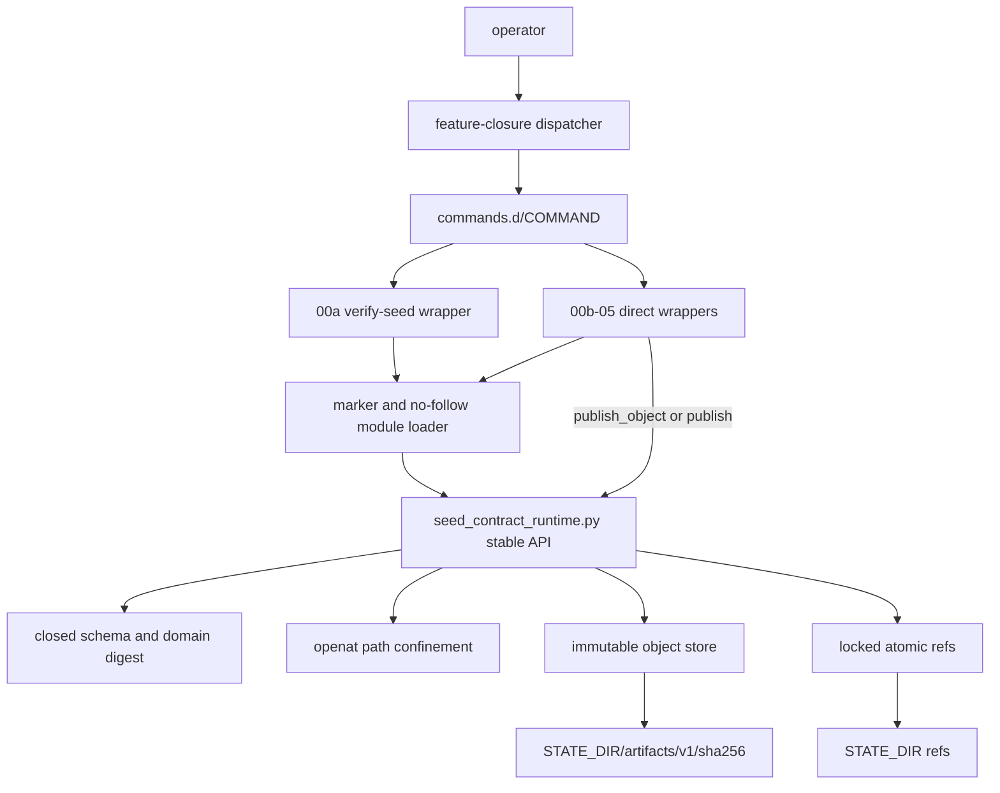
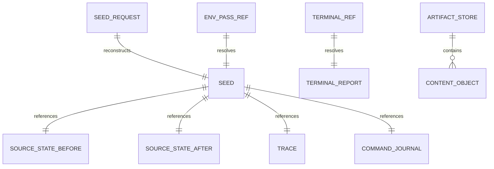
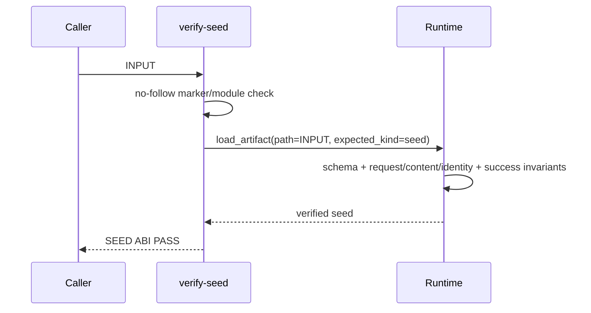
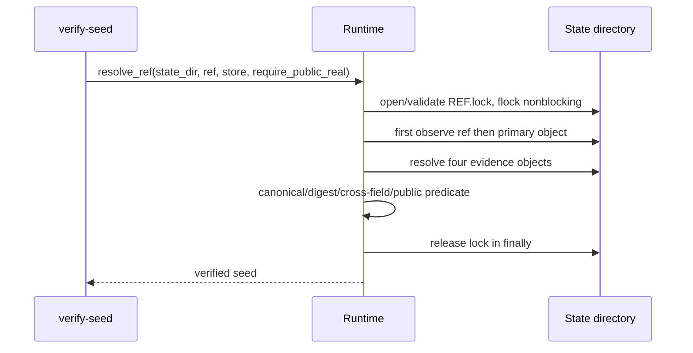
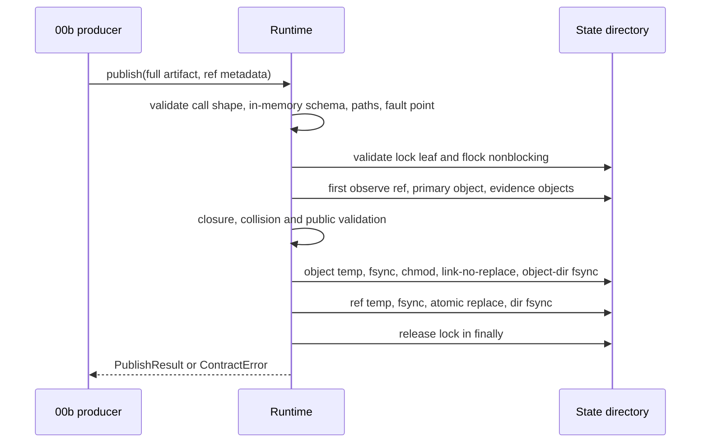

# 任务 2.1: 实现 no-follow state path confinement

> 这是你的需求。数值、签名、命令一律照抄，不要自己发挥。
> 你只做这一个任务，不要顺手做别的。不要派 subagent。

---

## 完整上下文

下面是整个 spec 的三个文件，让你了解整体需求、设计和任务分解。
**但你只执行「你的任务」那一节，不要去做别的任务。**

### Requirements

> 用户原话：
> “批准 plan v4”
>
> “ok，后续走 autopilot 流程”
>
> 上游口径：`PLAN.md` v6 的 `2026-09-01-00a-seed-contract-runtime` 与 `DECISIONS.md`。

## 目标

在不读取真实 AOSP、不中断现有 harness 的前提下，交付后序 00b–05 共同消费的只读 dispatcher、closed seed/evidence schema、canonical digest、受限 state-dir、内容寻址 object store、原子 ref publisher、`verify-seed` 与独立 direct recovery ABI。路径实现固定使用 `openat`、`mkdirat`、`O_NOFOLLOW` 与 `forbidden_roots`；runtime exports 固定覆盖 `ContractError`、`RUNTIME_ABI`、`load_artifact`、`canonical_bytes`、`domain_digest`、`validate_state_paths`、`resolve_ref`、`publish_object`、`publish`；错误与 commit-point 标识固定覆盖 `ARGUMENT_ERROR`、`OUT_REF_CONTRACT`、`DIGEST_COLLISION`、`REF_BUSY`、`REF_DURABILITY_UNCERTAIN`、`OBJECT_LINK`、`PUBLISH_PRECOMMIT_FAILED`、`PUBLISH_OBJECT_ORPHANED`；schema 固定覆盖 `schema_version`、`kind`、`seed_content`、`seed_identity`、`real_source`、`env_pass`、`envsetup`、`lunch`。00a 只证明契约和持久化机制，不把 fixture 伪装成 real-source public seed。

## 需求

R1. [计划] 系统必须把 `./common/.harness/bin/feature-closure SUBCOMMAND` 固化为唯一 dispatcher ABI，把合法 command name 限定为 ASCII regex `^[a-z][a-z0-9-]{0,31}$`，并从 dispatcher 自身 realpath 的 parent 固定解析 `../closure/v1/commands.d/SUBCOMMAND` 后仅 exec 该可执行 regular file。

R2. [计划] 系统必须把 `common/.harness/closure/v1/commands.d/verify-seed INPUT` 与 `common/.harness/closure/v1/commands.d/verify-seed --ref REF --artifact-store STORE [--require-public-real]` 固化为两个互斥 production；dispatcher 形式只增加 `verify-seed` 子命令，positional form 不得带 ref/store/public-real option，ref form 不得带 positional input，missing/repeated/reordered/extra option 必须 `ARGUMENT_ERROR`，direct command 在 dispatcher 缺席时仍可独立执行。

R3. [计划] 当 runtime 读取 JSON artifact 时，系统必须拒绝非 UTF-8、duplicate/unknown/missing key、float、bool-as-integer、越界 integer与非法 enum，并只接受本节 artifact 的 `schema_version=1` 与 kind；只有本节显式声明 sorted/unique 的 array 才拒绝重复或乱序，argv/path/summary 等 semantic-order array 必须保留输入顺序且允许重复；`seed_content` 与 `seed_identity` 仅为内部 digest payload，不得要求 `schema_version`/`kind`，也不得独立发布。

R4. [计划] 当 runtime canonicalize payload 时，系统必须使用 RFC 8785 UTF-8 bytes 与本节固定 ASCII domain separator 求 SHA-256；JSON key 输入顺序变化不得改变 digest，任一承重字段变化必须改变对应 digest。

R5. [计划] 凡具备 state-dir 写入能力，系统必须要求 state-dir 是已存在、可写、无 symlink 分量且 normalized absolute path 等于 realpath 的目录，并以逐分量 `openat`/`mkdirat` 加 `O_NOFOLLOW` 创建 artifact/ref parent；artifact-store 参数必须精确等于 `STATE_DIR/artifacts/v1`，object directory 固定为 `ARTIFACT_STORE/sha256`，out-ref 必须是 state-dir 后代且 existing object/ref/parent 均以 no-follow regular-file/directory 规则读取，拒绝 literal tilde、relative、missing、non-directory、unwritable、escape 与 symlink path。

R6. [计划] 当校验 state-dir 隔离时，系统必须让调用者通过 runtime API 的 `forbidden_roots` 传入 harness repo、`.repo/manifests`、`.repo/repo` 与所有 source/project worktree realpath，并按 path-component containment 拒绝 state-dir/store/out-ref 与任一 root 相等或位于其后代；尚不存在的 leaf 必须按已解析 parent 加 lexical basename 判定。

R5/R6 的 filesystem threat model 固定为：state-dir 目录拓扑在一次 runtime invocation 内稳定；static symlink、non-regular leaf、containment escape，以及稳定拓扑下由 runtime lock 协调的并发 publisher 均在范围内。同一 effective UID 的外部对手在调用期间主动 rename/move/delete 已验证或刚由 `mkdirat` 创建的目录分量不在范围内，因为 Linux/POSIX 没有 atomic create-directory-and-return-fd primitive；若实现检测到此类拓扑变化，必须 fail closed 并 best-effort 清理，但不对该排除场景声明能定位已被移走且名称未知的 inode。此边界不得放宽 symlink/no-follow、forbidden-root 或正常 failure 的零越界写入判据。

R7. [计划] 当发布 object 时，系统必须把 bytes 写入 `STATE_DIR/artifacts/v1/sha256/<64-lower-hex-digest>`，使用同目录 temp、file fsync、mode 0444、hard-link no-replace 与 object-dir fsync；同 digest 同 bytes 幂等复用，同 digest 不同 bytes 必须 `DIGEST_COLLISION`。

R8. [计划] 当发布或解析 ref 时，系统必须在首次观察 existing ref/object 前取得 adjacent `OUT_REF.lock` 排他锁并持有至 ref-dir fsync 或解析完成；lock parent 必须是已验证的 ref parent，existing lock 必须以 `openat(...,O_NOFOLLOW)` 打开且为 effective uid owner、owner-only mode 0600 regular file，missing leaf 只能在该 parent 以 lexical basename、`O_CREAT|O_NOFOLLOW`、0600 创建；lock symlink/non-regular/wrong owner/wrong mode/open error 是 `OUT_REF_CONTRACT`，只有合法 lock fd 的 nonblocking contention 是 `REF_BUSY`。发布时必须先保证 matching object durable，再以同目录 temp、file fsync、atomic replace 与 ref-dir fsync 发布精确 ref bytes。

R9. [计划] 如果发生 object commit 后 ref commit 前故障，系统必须允许保留无 ref 的 immutable orphan object；如果发生 ref rename 后或 ref-dir fsync 故障，系统必须返回 `REF_DURABILITY_UNCERTAIN`，且可见 ref 只能是旧 bytes 或解析到 matching object 的 intended bytes，重放必须幂等。

R10. [计划] 当 `verify-seed` 接收 fixture file 时，系统必须完整重算 schema、domain digest、nested digest、cross-field success invariant 与 canonical object bytes；合法 public ABI golden 只输出 `SEED ABI PASS`，不得产生 `real_source` 证明。Positional fixture 没有 store 参数，因而只验证 embedded contract、不声称 external evidence closure；ref-mode 和 producer 必须验证下文 evidence closure。

R11. [计划] 当 `verify-seed --ref REF --artifact-store STORE --require-public-real` 成功时，系统必须要求 ref kind 为 `env_pass`、object kind 为 `seed`、`evidence_class=real_source`、`source_scope.role=public_aosp17_cuttlefish`、`public_aosp_baseline=true`、`vendor_context=false`、`platform_family=aosp-17`，并要求 success invariants 与四个 referenced evidence objects 全部通过；stdout 精确一行 `SEED ABI PASS public_aosp17_cuttlefish` 且 stderr 为空。00a 只以不写 production ref 的 pure predicate/evidence-closure seam 验成功分支并以 fixture/local/vendor ref 验负分支，真实 positive ref integration 归 00b。

R12. [计划] 如果发生 pre-publish argument/command/schema/path/ref/digest contract error，系统必须按 Deterministic state machine 的 exact code 全序 exit 30、stdout 为空、stderr 精确一行 `CONTRACT ERROR_CODE`，且 object/ref/temp/sentinel byte changes 为 0；只有成功完成 observation、取得 lock 并进入 publish stages 后的 fault 才可进入 R9/R15 状态。

R13. [计划] 当 dispatcher 与 direct ABI 使用同一 deterministic fixture/ref 时，系统必须得到相同 exit/stdout/stderr、canonical object/ref bytes、artifact/nested digest 与 public predicate 结果；command 缺失、symlink 或不可执行时 dispatcher 必须 exit 30、stdout 为空、stderr 精确 `CONTRACT COMMAND_UNAVAILABLE`。

R14. [计划] 当 00b–05 的 direct wrapper 启动时，系统必须先读取 regular file `common/.harness/closure/v1/runtime/seed-contract-runtime.version` 的精确 bytes `seed-contract-runtime/v1\n`，再从 `common/.harness/closure/v1/lib/seed_contract_runtime.py` import `ContractError`、`RUNTIME_ABI`、`load_artifact`、`canonical_bytes`、`domain_digest`、`validate_state_paths`、`resolve_ref`、`publish_object` 与 `publish`；marker/module/export 缺席、symlink、bytes/version 不符或 import 失败必须在调用 API 前 exit 30、stdout 为空、stderr 精确 `CONTRACT RUNTIME_UNAVAILABLE`，不得产生 object/ref 写入。

R15. [计划] 当 fault injection 位于 `OBJECT_LINK` 前、object link 后 ref rename 前、ref rename 后 fsync 前或无 fault 时，系统必须分别满足 `PUBLISH_PRECOMMIT_FAILED`、`PUBLISH_OBJECT_ORPHANED`、`REF_DURABILITY_UNCERTAIN` 或原始成功状态；受控 fault injection 返回前必须清除本 invocation 创建的全部 temp。意外终止遗留的 `.*.tmp.<pid>.<nonce>` 必须 mode 0600 且不可被 resolver 识别为 object/ref；ref-dir stale temp 仅由持有同一 ref lock 的后续 invocation best-effort 清理，object-dir stale temp 不被并发 publisher 自动清理且其 maintenance 不属于 00a。

R16. [计划] 当 00a exact merge SHA 写入 ledger 时，系统必须从该 merge 在 isolated worktree 先创建一个 descendant fixture commit，唯一新增 executable `common/.harness/closure/v1/commands.d/recovery-fixture` 且该 wrapper 实现 R14 pre-import check；随后 `git revert -m 1 --no-edit MERGE_SHA`，证明 wrapper 仍为 regular executable、dispatcher/marker/module/verify-seed 均消失，wrapper exit 30、stdout 为空、stderr 精确 `CONTRACT RUNTIME_UNAVAILABLE`，并逐字核对旧 harness test/parity/dev-sidebar demo 的三个 PASS 行。fixture commit 与 revert 只存在于隔离 worktree。

R17. [计划] 当 tasks estimate 超过 supersession ceiling 730 行或 schema/test review summary estimate 超过 140 行时，系统必须在 implementation 开始前回 PLAN 拆分；当 actual non-generated diff 超过 730 行或 actual summary 超过 140 行时，必须在 implementation acceptance 前回 PLAN 拆分。项目级 800/160 是不可放宽的外层绝对上限，不得把 731–800 或 141–160 当作 00a 可接受区间。

R18. [计划] 在 00a 实现与验收期间，系统必须不执行 AOSP `envsetup`、`lunch`、`m/mm/mmm`、ninja、package、flash、`repo sync`、Git fetch/clone 或下载；fixtures 不得读取 `/home/zzh0838/Project/lk7k-a17/system` 并宣称真实环境证明。

## Runtime API

`seed_contract_runtime.py` 的 stable imports 与 keyword-only signatures 固定为：

- `RUNTIME_ABI == "seed-contract-runtime/v1"`；`ContractError` 是唯一 expected failure carrier，构造参数和只读 `.code` 均为 exact error-code string；wrapper 只捕获 `ContractError` 并翻译为 `CONTRACT CODE`，其他 exception（包括 Python call-shape binding `TypeError`）统一 `CONTRACT RUNTIME_INTERNAL`。
- `load_artifact(*, path: str, expected_kind: str) -> dict`；`canonical_bytes(*, value: object) -> bytes`；`domain_digest(*, domain_ascii: str, value: object) -> str`，最后一个返回值必须是 64-lower-hex。
- `validate_state_paths(*, state_dir: str, out_ref: str | None, artifact_store: str, forbidden_roots: tuple[str, ...]) -> StatePaths`；`StatePaths` 是只读 mapping，exact keys 为 `{state_dir,artifact_store,object_dir,out_ref,ref_parent,lock_path}`，value 是 normalized absolute string，只有 out-ref absent 时后三项为 null。
- `resolve_ref(*, state_dir: str, ref: str, artifact_store: str, forbidden_roots: tuple[str, ...], require_public_real: bool = False) -> dict`；取得 R8 lock 后解析并返回 verified object dict。
- `publish_object(*, state_dir: str, artifact_store: str, object_kind: str, payload: dict, forbidden_roots: tuple[str, ...], fault_point: str | None = None) -> ObjectResult`；仅接受 `source_state|trace|command_journal`，`ObjectResult` exact keys `{digest,object_path}`，用于 00b 的无 ref evidence object。
- `publish(*, state_dir: str, out_ref: str, artifact_store: str, object_kind: str, payload: dict, ref_kind: str, semantic_exit: int, forbidden_roots: tuple[str, ...], fault_point: str | None = None) -> PublishResult`；`PublishResult` exact keys `{digest,object_path,ref_path,semantic_exit}`。

所有 path result 均为 normalized absolute string。CLI production 的 unknown/missing/repeated/positional option 与成功绑定后的 runtime value type/combination invalid 统一 `ARGUMENT_ERROR`；stable Python callable 的 unknown keyword、missing keyword 或 positional call-shape 由解释器抛 `TypeError`，属于 caller programmer error，不是 expected contract failure，CLI boundary 按上一条映射 `RUNTIME_INTERNAL`。两个 publisher 的 `payload` 都必须是 caller 提供的完整 artifact dict，包含 exact `schema_version:1` 与 `kind`，runtime 不增删 envelope，且 `object_kind == payload.kind`。任何 temp/object/ref 写入前，runtime 必须按 object_kind 唯一 dispatch 本节 closed schema、nested/cross-field digest 与 domain；错误为 `DESCRIPTOR_SCHEMA_INVALID`，object bytes exact 为 `RFC8785(payload)+LF`，object path digest 对不含 LF 的 RFC8785 bytes 使用对应 domain。`publish_object` 只接受并验证 `source_state|trace|command_journal`，先校验 state-dir/full forbidden-roots/store，再执行 R7 的 temp/fsync/link/collision 合同但不创建 lock/ref；object link 前 fault 是 `PUBLISH_PRECOMMIT_FAILED`，link 后 object-dir fsync fault 是 `PUBLISH_OBJECT_ORPHANED`。`publish` 只接受 `semantic_exit in {0,20}`、`seed/env_pass` 或 `terminal_report/terminal_report` 映射：seed 发布前验证四-object evidence closure，terminal-report 发布前验证每个 non-null completed digest 指向 matching kind object，再按 R7–R9/R15 执行。CLI ref form 必须从 exact `STATE_DIR/artifacts/v1` 的 STORE 以 `parent.parent` 推导 state-dir，要求 REF 是同一 state-dir 后代，并以 harness repo realpath 作为 verifier 的 forbidden root；该 verifier 路径不接受 source/project roots，00b 发布调用必须传入 R6 的完整 forbidden-roots 集合。

## Stable data ABI

所有 JSON artifact 拒绝 duplicate key、float、非 UTF-8、escaped/raw lone surrogate、unknown/missing field；signed integer 必须在 I-JSON safe range `-(2^53-1)..2^53-1`，其余 integer 均为 `0..2^53-1`，boolean 不算 integer。payload 使用 RFC 8785 UTF-8 bytes；fixture/golden bytes 只验证本节，不创造字段。Object key 输入顺序变化必须 canonicalize 为相同 bytes/digest；只有明确声明 sorted/unique 的 array 才要求严格递增并对重复/乱序报 schema invalid，semantic-order array 原样保序且允许重复。

### seed-request/v1 input

Top-level exactly `{schema_version,kind,source_root,envsetup_relpath,lunch,source_scope,resource_minimums,estimated_disk_upper_bound_bytes}`。

| field | type/value |
|---|---|
| `schema_version` / `kind` | integer `1` / string `seed_request` |
| `source_root` / `envsetup_relpath` | absolute realpath string / normalized relative string `build/envsetup.sh` |
| `lunch` | object exactly `{target,product,release,variant}`，all nonempty strings |
| `source_scope` | object exactly `{role,public_aosp_baseline,vendor_context,platform_family}`；public is `public_aosp17_cuttlefish,true,false,aosp-17`，local is `local_lk7k_product,false,true,aosp-17` |
| `resource_minimums` | object exactly `{available_bytes,available_inodes,effective_memory_bytes,effective_cpus}`，I-JSON safe unsigned integers；threshold missing/negative/float/bool/>`2^53-1` is `DESCRIPTOR_SCHEMA_INVALID` |
| `estimated_disk_upper_bound_bytes` | I-JSON safe unsigned integer |

Request digest is `SHA-256("aosp-harness/seed-request/v1\0" + RFC8785(payload))`; input bytes stay unchanged.

### source-state/v1 evidence

Payload top-level is exactly `{schema_version:1,kind:"source_state",manifest_sha256,projects}`；`manifest_sha256` 是 64-lower-hex。`projects` 按 UTF-8 `path` strictly sorted/unique，每项 exactly `{path,head,status_sha256,entries}`：`path` 是 nonempty normalized relative UTF-8 string，`head` 是 40/64-lower-hex，`status_sha256` 是 exact porcelain-v2 NUL bytes 的 64-lower-hex SHA-256。`entries` 按 decoded `path_b64` raw bytes strictly sorted/unique，每项 exactly `{path_b64,status_record_b64,entry_kind,mode,content_sha256,symlink_target_sha256}`；两个 `*_b64` 都是 canonical RFC 4648 base64 string，`entry_kind` 是 `regular|symlink|missing`，`mode` 是 uint。`regular` 要求 `content_sha256` 为 64-lower-hex、`symlink_target_sha256=null`；`symlink` 要求前者 null、后者 64-lower-hex；`missing` 要求 `mode=0` 且两 digest 均 null。Rename/copy records contribute both raw paths；untracked directories are never folded. Per-project digest is `SHA-256("aosp-harness/project-source-state/v1\0" + RFC8785(project item))`; workspace digest is `SHA-256("aosp-harness/source-state/v1\0" + RFC8785(top-level payload))`.

### trace/v1 evidence

Payload is exactly `{schema_version:1,kind:"trace",records,counts}`。`records` 按 `sequence` strictly increasing/unique，每项 exactly `{sequence,process_ordinal,syscall,result,errno,exec_argv_b64,paths,address_family,classification}`；`sequence`/`process_ordinal` 是 safe uint，`syscall` 是 nonempty ASCII string，`result` 是 I-JSON safe signed integer，`errno` 在 result nonnegative 时必须 null、negative 时必须是 nonempty stable errno ASCII name。`exec_argv_b64` 对 execve/execveat 是 canonical base64 string array，保留 argv 顺序并允许重复；其他 syscall 必须 null。`paths` 是 semantic operand-order array、允许重复，每项 exactly `{role,dirfd,raw_b64,resolved_b64}`；role 是 `path|oldpath|newpath|target|linkpath|source_fd|destination_fd`，dirfd 是 I-JSON safe signed integer 或 null，raw/resolved 都是 canonical base64 string。`address_family` 是 null 或 `AF_INET|AF_INET6|AF_UNIX|AF_OTHER`。

`classification` is record enum `other|external_network|source_mutation|sync_download|config_query|module_build|package`; top-level `counts` has exactly those keys as unsigned integers and counts only nonnegative syscall results. Digest is `SHA-256("aosp-harness/trace/v1\0" + RFC8785(payload))`; trace digest is run audit evidence and is excluded from stable seed identity.

### command-journal/v1 evidence

Payload is exactly `{schema_version:1,kind:"command_journal",records}`。Records 每项 exactly `{stage,argv_b64,cwd_b64,exit_code,trace_first_sequence,trace_last_sequence}`；stage enum/order 是 `manifest_before,source_state_before,namespace_probe,envsetup_lunch,manifest_after,source_state_after` 且每 stage 恰好一次；`argv_b64` 是 canonical base64 string array，按 argv 语义保序且允许重复；`cwd_b64` 是 canonical base64 string；exit/sequence 三字段均是 uint 且 `trace_first_sequence <= trace_last_sequence`。Digest is `SHA-256("aosp-harness/command-journal/v1\0" + RFC8785(payload))`; empty/missing/reordered stages are invalid.

### seed/v1 success output

Top-level is exactly `{schema_version:1,kind:"seed",evidence_class,request_digest,source_scope,source,manifest,tools,execution,resources,lunch,source_state,guard,seed_content_digest,seed_identity_digest}`. `evidence_class` is `real_source|fixture_only`.

| object | exact children and types |
|---|---|
| `source_scope` | same four fields/values as request |
| `source` | `{root,envsetup_relpath}`；root 是 normalized absolute realpath string，envsetup 是 normalized relative exact `build/envsetup.sh` |
| `manifest` | `{repository_commit,locked_xml_sha256,project_count,remotes,projects}`；commit 为 40/64-lower-hex、digest 为 64-lower-hex、count uint 且等于 projects length；remotes 按 name strictly sorted/unique，item `{name,fetch_url,review_url,mirror_url}`，name nonempty string，后三者为 credential-free string/null；projects 按 path strictly sorted/unique，item `{path,name,remote,revision,head,source_state_digest}`，path normalized relative，head 40/64-lower-hex，digest 64-lower-hex，其余 nonempty strings |
| `tools` | `{repo_checkout_commit,repo_launcher_path,repo_launcher_sha256,repo_version,git_version,python_version}`；checkout commit 为 40/64-lower-hex 或 null，launcher path normalized absolute，launcher digest 64-lower-hex，其余 nonempty strings |
| `execution` | `{host_arch,kernel_release,kind,container_digest}`；arch/kernel 是 nonempty strings，kind `host|container`；host 要求 digest null，container 要求 digest 为 64-lower-hex |
| `resources` | `{estimated_disk_upper_bound_bytes,minimums,measured,passed}`；estimate/minimums 复用 request；measured exact `{available_bytes,available_inodes,host_mem_available_bytes,cgroup_mem_remaining_bytes,effective_memory_bytes,online_cpu_count,cpuset_cpu_count,effective_cpu_numerator,effective_cpu_denominator}`，除 cgroup/cpuset 为 uint/null 外均为 uint，online/numerator/denominator >0，非空 cpuset >0，fraction 必须 reduced 且 denominator >0，effective memory 等于 host 与 non-null cgroup 的 min；passed exact `{disk,inodes,memory,cpu}` booleans，disk iff available bytes ≥ max(minimum bytes,estimate)，inodes iff available inodes ≥ minimum，memory iff effective memory ≥ minimum，cpu iff numerator ≥ minimum CPUs × denominator |
| `lunch` | `{target,product,release,variant,variables,out_dir_relative,envsetup_exit,lunch_exit}`；前四项 nonempty strings；variables exact `{TARGET_PRODUCT,TARGET_RELEASE,TARGET_BUILD_VARIANT,TARGET_ARCH,TARGET_2ND_ARCH,HOST_OS,HOST_ARCH}` string/null；out dir 是无 `.`/`..` 的 normalized relative UTF-8 path 且按 component 位于 `tmp/preflight` 后代；exits uint |
| `source_state` | `{state,clean_source_proof,affected_project_count,before_digest,after_digest,observed_ignored_inputs}`；state `clean|dirty`，proof bool，count uint，before/after 64-lower-hex；clean iff proof=true 且 count=0，dirty iff proof=false 且 count>0；ignored inputs 按 decoded logical raw path strictly sorted/unique，每项 exactly `{path_b64,resolved_path_b64,entry_kind,mode,content_sha256,symlink_target_sha256,target_content_sha256}`，path 为 canonical base64，kind `regular|symlink`，mode uint；regular 要求 content 64-lower-hex 且 symlink/target null，symlink 要求 content null 且 symlink/target 都为 64-lower-hex |
| `guard` | `{parent_netns_inode,probe_netns_inode,trace_digest,command_journal_digest,external_network_count,source_mutation_count,sync_download_count,module_build_count,package_count}`；inode/count uint，digest 64-lower-hex |

Seed content digest payload is exactly `{locked_xml_sha256,projects,observed_ignored_inputs}`，复用上述 manifest projects 与 ignored-input schemas 且无 schema/kind；domain 是 `aosp-harness/seed-content/v1\0`。Seed identity digest payload is exactly `{source_scope,manifest,tools,execution_identity,lunch_identity,source_state_identity,seed_content_digest}` 且无 schema/kind，其中：`execution_identity` exactly `{host_arch,kind,container_digest}` 并复用 execution 类型/host-null 规则；`lunch_identity` exactly `{target,product,release,variant,variables}` 并复用 lunch 类型；`source_state_identity` exactly `{state,clean_source_proof,affected_project_count,before_digest,after_digest,observed_ignored_inputs}` 并复用 source-state 类型。其 domain 是 `aosp-harness/seed-identity/v1\0`。Seed artifact domain 是 `aosp-harness/seed-artifact/v1\0` over full seed payload。Resource values、kernel、trace/journal、lunch exits/OUT_DIR 与 scheduling 可改变 artifact digest，但 unchanged source/request 时不得改变 seed content/identity digest。

`verify-seed INPUT` 必须从 seed 重建 exact seed-request：`source.root -> source_root`、`source.envsetup_relpath`、lunch 的 target/product/release/variant、`source_scope`、`resources.minimums -> resource_minimums`、`resources.estimated_disk_upper_bound_bytes`，重算并等于 `request_digest`；同时要求上述重复字段逐值相等，再重算 source-state/content/identity/artifact digests。Positional INPUT 的任一 nested/cross-field/digest mismatch 为 `DESCRIPTOR_SCHEMA_INVALID`；ref-resolved object 的同类 mismatch 为 `REF_CORRUPT`。

所有 `seed`（包括 fixture_only）必须满足 success cross-field invariants：四个 `resources.passed` 全 true；`envsetup_exit=lunch_exit=0`；`guard.parent_netns_inode != guard.probe_netns_inode`；guard 的 `external_network_count,source_mutation_count,sync_download_count,module_build_count,package_count` 全为 0；`source_state.before_digest == source_state.after_digest`；以及 manifest count/source-state consistency。Ref resolution 和 seed publish 还必须在同一 ARTIFACT_STORE 中闭合四个 content-addressed evidence objects：before/after digest 各指向 canonical `source_state` object，guard digest 各指向 canonical `trace`/`command_journal` object，path digest 等于各自 domain digest且 kind matching；两个 source-state 的 `manifest_sha256` 都必须等于 seed `manifest.locked_xml_sha256`，projects path set 必须等于 manifest projects path set，每个 project item 重算的 project digest必须等于对应 manifest `source_state_digest`；trace counts 必须等于 guard 五类 count；journal 六个 stage exit 全为 0、每个 first/last sequence 都存在于 trace records，且 `envsetup_lunch.exit_code == lunch.lunch_exit`。任一 required evidence object missing 为 `ARTIFACT_MISSING`；kind/bytes/path/content/cross-field mismatch 在 ref/producer mode 为 `REF_CORRUPT`，positional embedded invariant mismatch 为 `DESCRIPTOR_SCHEMA_INVALID`。上述检查先于 `PUBLIC_SCOPE_REQUIRED`；后者只表示 structurally successful seed 的 evidence_class/source_scope 不满足 public identity predicate。

### terminal-report/v1 output

Payload is exactly `{schema_version:1,kind:"terminal_report",request_digest,primary_reason,failed_checks,completed_observation_digests,summary_lines}`；request digest 是 64-lower-hex。Environment reason 全序和值域 exact 为 `SOURCE_ROOT_UNAVAILABLE,REPO_METADATA_UNAVAILABLE,ENVSETUP_UNAVAILABLE,REPO_CLIENT_UNAVAILABLE,WORKTREE_ENUM_UNAVAILABLE,RESOURCE_DISK,RESOURCE_INODE,RESOURCE_MEMORY,RESOURCE_CPU,NETWORK_NAMESPACE_UNAVAILABLE,TRACE_UNAVAILABLE,LUNCH_FAILED,FORBIDDEN_EXECUTION,SOURCE_MUTATION,SOURCE_CHANGED`。`failed_checks` 必须 nonempty、strictly unique 且是该全序的 ordered subsequence；`primary_reason` 必须等于第一项。completed digests exactly `{source_state,trace,command_journal}`，各 value 为 64-lower-hex 或 null；`summary_lines` 是最多 120 个 UTF-8 string 的 semantic-order array，允许重复且不得含 timestamp、username、credential 或 source content。Digest domain is `aosp-harness/terminal-report/v1\0`.

### ref bytes

Ref bytes are exactly RFC 8785 of `{schema_version:1,kind,digest}` plus one LF. Kind mapping is exact `env_pass -> seed` and `terminal_report -> terminal_report`; digest is 64 lower hex. Under lock，resolver 的 ref leaf missing 是 `ARTIFACT_MISSING`；ref symlink/non-regular/open error 或 noncanonical bytes/type/kind/digest 是 `REF_CORRUPT`；publisher 允许 missing ref 并创建它，但 existing ref 服从同一 `REF_CORRUPT` 规则。合法 ref 指向的 object missing 或 seed evidence closure object missing 是 `ARTIFACT_MISSING`；existing object 的 symlink/non-regular/open error/noncanonical bytes、wrong kind、path digest/content digest/nested/cross-field mismatch 均为 `REF_CORRUPT`；最后 `--require-public-real` predicate false 为 `PUBLIC_SCOPE_REQUIRED`。

## Error priority 与 publish matrix

不读取 ref/object 的 validation 按 entry stage 分层 stop-at-first。Dispatcher stage 只判：missing subcommand → `ARGUMENT_ERROR`，present name 不匹配 regex → `INVALID_COMMAND`，合法 name 的 target missing/symlink/non-regular/non-executable → `COMMAND_UNAVAILABLE`；它不得解析 command-specific argv，所以 target unavailable 与 invalid child argv 同时发生时必须是 `COMMAND_UNAVAILABLE`。成功 exec 后，direct wrapper 启动 stage 必须先做 R14 marker/module/import preamble，失败 `RUNTIME_UNAVAILABLE`；只有 preamble 成功才解析自身 grammar，invalid argv → `ARGUMENT_ERROR`，因此 direct runtime unavailable 与 invalid argv 同时发生时必须是 `RUNTIME_UNAVAILABLE`。随后 runtime stage 全序为：bound-value/combination `ARGUMENT_ERROR` → `DESCRIPTOR_NOT_FOUND` → `DESCRIPTOR_INVALID_UTF8` → `DUPLICATE_JSON_KEY` → `UNSUPPORTED_SCHEMA_VERSION` → `DESCRIPTOR_SCHEMA_INVALID`（含 positional nested mismatch 与 threshold missing/negative/float/bool/overflow）→ `SOURCE_ROOT_CONTRACT` → `STATE_DIR_CONTRACT` → `OUT_REF_CONTRACT` → `WORKTREE_MISMATCH`。不适用于当前 production 的 code 跳过；这些错误在 lock/publish 前 exit 30、stdout empty、stderr exact `CONTRACT CODE`，object/ref/temp/sentinel byte changes 为 0。

Valid pre-lock contract 后先打开/验证 lock leaf：contract failure 为 `OUT_REF_CONTRACT`；合法 fd 的 nonblocking contention 才为 `REF_BUSY`。取得 lock 后才首次观察 ref/object，resolver 错误全序为 `ARTIFACT_MISSING`（ref missing）→ `REF_CORRUPT`（ref leaf/type/bytes）→ `ARTIFACT_MISSING`（primary/evidence object missing）→ `REF_CORRUPT`（object leaf/bytes/kind/path/content/nested/cross-field）→ `PUBLIC_SCOPE_REQUIRED`；均 exit 30 且无 object/ref/temp/sentinel byte change。Publisher 的 missing ref 是合法 create case，其余 existing ref 顺序相同；发布 stage 全序为 `DIGEST_CHECK,OBJECT_TEMP,OBJECT_LINK,OBJECT_DIR_FSYNC,REF_TEMP,REF_RENAME,REF_DIR_FSYNC`。高优先级 validation 必须屏蔽低优先级 fault injection；同一阶段只能产生下表唯一 code。

| commit point | exit/code | durable state |
|---|---|---|
| `DIGEST_CHECK` same path/different bytes | 30 `DIGEST_COLLISION` | no object/ref change；overrides semantic 0/20 |
| before `OBJECT_LINK` | 30 `PUBLISH_PRECOMMIT_FAILED` | no new object/ref；old ref unchanged |
| after object link, before `REF_RENAME` | 30 `PUBLISH_OBJECT_ORPHANED` | intended immutable object may remain orphan；no dangling ref；old ref unchanged |
| after `REF_RENAME`, including ref-dir fsync | 30 `REF_DURABILITY_UNCERTAIN` | ref is old or exact intended bytes；intended ref resolves matching object |
| no fault | original 0/20 | object durable first，then exact ref durable |

## Autopilot decisions

- Questions 0/15，rounds 0/2。用户已批准 PLAN 与后续 autopilot；没有待用户回答的问题，numeric ABI 由 autopilot 按本节及 DECISIONS 的显式 supersession 裁定。
- 验收方式保持“混合判定”：机器判 exact bytes/digest/exit/channel/path/fault/rollback，人只检查 schema 是否覆盖 PLAN 的共享 runtime 边界。
- public golden 只验 ABI；00a 对 `require_public_real` 只做 pure predicate seam 与负例，不创建伪 `real_source` production ref，也不输出 `GATE CONTINUE_PUBLIC`。
- design review 暴露 RFC 8785 与 full 64-bit JSON number 不可兼得后，autopilot 明确选择 I-JSON safe-integer supersession；禁止 00b 对越界 observation 静默截断/舍入。
- 已定：实现不得读取真实 AOSP；00b 才负责 environment/source/trace/resource/lunch evidence。

## 验收标准

主验证命令: bash common/tests/test-seed-contract-runtime.sh
期望输出: exit 0；完整 stdout 精确一行 `RESULT PASS seed-contract-runtime` 加 LF；stderr 为空；dispatcher/direct 子进程输出均由测试捕获并逐字断言，不泄漏到主命令 stdout

验收清单:
- [ ] dispatcher/direct parity matrix 覆盖 valid fixture、invalid command、missing/symlink/non-executable command，逐例断言 exit、完整 stdout、完整 stderr。
- [ ] schema/digest matrix 对六种 artifact kind 与两个内部 digest payload 的每个顶层/nested field 覆盖 missing/unknown/duplicate/type/boundary；sorted/unique array 逐项验 duplicate/out-of-order，semantic-order array 验顺序保留与合法重复，object key reorder 验 canonical bytes/digest 相等，run-evidence mutation 只改变 artifact digest而不改变 identity digest。
- [ ] canonical numeric/string matrix 逐字覆盖 `2^53-1` accept、`2^53` reject、`-(2^53-1)` accept、`-2^53` reject、escaped high/low lone surrogate reject、合法 surrogate pair/raw Unicode accept，并核对 exact canonical bytes 与 digest。
- [ ] argument carrier matrix 逐字覆盖 CLI unknown/missing/repeated/reordered/positional option → exact `ARGUMENT_ERROR`；成功绑定后的 runtime value/type/combination invalid → `ContractError("ARGUMENT_ERROR")`；Python API unknown/missing/positional call-shape → 原生 `TypeError`；CLI boundary 必须至少注入一次由 stable callable unknown/missing/positional call-shape 产生的 binding `TypeError`，并断言 exit 30、stdout empty、stderr exact `CONTRACT RUNTIME_INTERNAL` 且无 traceback，其他 unexpected exception 不能替代此 case。
- [ ] staged mixed-fault matrix 逐字覆盖 invalid subcommand+invalid child argv → `INVALID_COMMAND`；missing/symlink/non-executable target+invalid child argv → `COMMAND_UNAVAILABLE`；direct runtime unavailable+invalid argv → `RUNTIME_UNAVAILABLE`；runtime available+invalid argv → `ARGUMENT_ERROR`。
- [ ] path/store/ref matrix 覆盖 literal tilde、relative/missing/unwritable/symlink/containment、missing/ref-symlink/nonregular ref、invalid/contended lock、collision、corrupt ref 与四个 publish commit point，逐例核对 exact code 和 sentinel/object/ref/temp 状态。
- [ ] public golden 被标为 `evidence_class=fixture_only`；`--require-public-real` 的 unit seam 验 matching public predicate/evidence closure，CLI/ref integration 覆盖 fixture/local/vendor/malformed、failed-resource/lunch/guard/source-stability 与 missing/wrong-kind/corrupt evidence 负例，真实 positive integration 明确留给 00b。
- [ ] final review 证明 non-generated diff ≤730、schema/test summary ≤140；rollback 从唯一 ledger merge SHA 创建 descendant wrapper fixture 后 isolated revert，wrapper 保留并 exact `RUNTIME_UNAVAILABLE`，旧 harness 三项精确 PASS。

不变量（不许劣化，5 项）:
- validation/collision failure 对 existing object/ref sentinel byte changes = 0（≤ 0），验证: bash common/tests/test-seed-contract-runtime.sh --case digest-immutability
- 在稳定目录拓扑下，path/symlink/containment failure 在 state-dir 外创建的 filesystem entries = 0（≤ 0）；同 UID 主动目录 rename/move/delete 排除项只验证 fail closed + best-effort cleanup，验证: bash common/tests/test-seed-contract-runtime.sh --case path-confinement
- 每个 publish fault 后 visible dangling ref count = 0（≤ 0），验证: bash common/tests/test-seed-contract-runtime.sh --case failure-ref-rules
- `--require-public-real` 接受 failed success-invariant/evidence-closure 的 seed 数 = 0（≤ 0），验证: bash common/tests/test-seed-contract-runtime.sh --case public-real-gate
- 00a rollback 后 retained-wrapper/旧 harness regression failures = 0（≤ 0），验证: bash common/tests/test-seed-contract-runtime.sh --case rollback --ledger .spec/2026-09-01-aosp-feature-minimal-checkout/specs/2026-09-01-00a-seed-contract-runtime/ledger.md

Rollback 的三个旧 harness oracle 固定为：`bash common/tests/test-harness.sh` 末行 `RESULT PASS  shared Harness regression suite`；`bash common/.harness/bin/check-parity.sh` 完整 stdout `PARITY PASS  Claude/Codex 共享同一公共契约`；`bash common/.harness/features/dev-sidebar/verify-sidebar.sh --demo` 末行 `RESULT PASS`，三者均 exit 0。

## 超出范围

- 不执行或验证真实 AOSP source、manifest、Repo、resource、namespace、trace、envsetup/lunch；这些属于 00b。
- 不创建 real-source public/local seed，不把 fixture digest 写入固定 public/local production ref。
- 不实现 feature lock、closure extraction/materialization/proof、repo-unit build 或 feature integration。
- 不运行 sync/download/module build/package/flash/device validation，不修改用户 AOSP 工作区。
- 不修改 00b–05 尚未创建的 direct command；只固定其 runtime marker/version failure contract。

### Design

# 2026-09-01-00a-seed-contract-runtime 设计

## 概述

方案是在 `common/.harness/closure/v1` 下增加一个版本化 Python runtime，以一个极薄的 Bash dispatcher 和 Python `verify-seed` direct command 暴露稳定 ABI；runtime 集中拥有 schema、digest、路径、object/ref 与错误状态机，00b 只负责采集并调用它。

关键决策：

1. 选择 Python 3.10+ 标准库实现 schema/JCS 子集、SHA-256、`openat` 路径遍历、`flock` 和 durable publish，因为现有 harness 已依赖 Python 且 AOSP host 环境稳定具备它；放弃 shell 内实现 JSON/digest/原子发布，后者无法可靠拒绝 duplicate key、bool-as-int 与 nested contract。
2. 选择“完整 artifact dict 入参 + runtime 写 canonical bytes”的 producer ABI，使 consumer/producer 共享同一 validator 和 domain table；放弃由 producer 拼 envelope 或直接提交 caller bytes，避免 00b 重造 schema 和错误优先级。
3. 选择一个 executable direct command 自行完成 marker/module pre-import check，dispatcher 只校验 command name/regular executable 并 `exec`；放弃把 recovery 依赖放入 dispatcher，确保 00a 被 revert 后后序 wrapper 能独立 fail closed。
4. 选择内容寻址 object 与 ref 分离、object hard-link no-replace、ref lock 后 atomic replace；放弃单文件可变状态和“故障时删除已提交 object”，因为 orphan object 可安全重算，而 dangling ref 不可接受。

## 需求映射

| 组件 | 实现的需求 |
|---|---|
| dispatcher `feature-closure` | R1, R2, R13 |
| direct command `verify-seed` | R2, R10, R11, R12, R13, R14 |
| marker + runtime loader contract | R14, R16 |
| runtime schema/canonical/digest layer | R3, R4, R10, R11, R12 |
| runtime path/store/ref layer | R5, R6, R7, R8, R9, R12, R15 |
| runtime public/evidence-closure validator | R10, R11, R12 |
| contract fixtures + acceptance suite | R3–R18 |
| tasks/review/rollback process | R16, R17, R18 |

## 架构

分层边界如下：CLI 层只解析两个 grammar 并翻译 `ContractError.code`；runtime 的纯数据层不访问 filesystem，存储层只接受已验证的完整 artifact；path 层返回固定 `StatePaths`，所有写入都使用其 directory fd。现有 `.claude`/`.codex` adapter、feature manifest 与 session-state foundation 不被修改。

技术栈固定为 Bash 4+（dispatcher/test entry）与 Python 3.10+ 标准库。Canonical JSON 只处理 closed schema 的 ASCII keys、无 lone-surrogate UTF-8 strings、null/bool 与 I-JSON safe integers，拒绝 float；在此输入域，`json.dumps(ensure_ascii=False,sort_keys=True,separators=(",",":"))` 产生 RFC 8785 相同 bytes。Parser 先用 `object_pairs_hook` 拒绝 duplicate key，再递归拒绝 lone surrogate 和超出 `±(2^53-1)` 的整数；golden 包含 max/min safe integer、越界相邻值、escaped surrogate 和 Unicode string vectors。

## 组件与接口

### Exact upstream/downstream contract

- 消费（逐字）：2026-09-01-00-environment-seed-preflight 的 supersession/v1 replacement、R1-R27 owner 与预算合同，并以 DECISIONS 2026-09-02 canonical numeric ABI supersession 替代原 signed/unsigned-64 JSON number 接受域
- 产出（逐字）：seed-contract-runtime/v1 marker+Python module API；`./common/.harness/bin/feature-closure verify-seed INPUT` 或 `verify-seed --ref REF --artifact-store STORE [--require-public-real]`；同 grammar 的 `common/.harness/closure/v1/commands.d/verify-seed` direct recovery ABI
- Dispatcher productions：`./common/.harness/bin/feature-closure verify-seed INPUT`；`./common/.harness/bin/feature-closure verify-seed --ref REF --artifact-store STORE [--require-public-real]`。
- Direct productions：`common/.harness/closure/v1/commands.d/verify-seed INPUT`；`common/.harness/closure/v1/commands.d/verify-seed --ref REF --artifact-store STORE [--require-public-real]`。

### Dispatcher

- 职责：校验唯一 subcommand 并从自身 realpath 定位 direct executable。
- 对外接口：`./common/.harness/bin/feature-closure SUBCOMMAND [ARGS...]`；本 spec 新增 `verify-seed`。
- 依赖：Bash、`readlink`、`commands.d/SUBCOMMAND`。

### Verify-seed direct command

- 职责：在 runtime 可用性检查后解析互斥 grammar、调用 runtime、输出 exact channel contract。
- 对外接口：上方四个完整 production；dispatcher 与 direct 的参数 grammar 完全相同，只替换 executable prefix。
- 依赖：marker、runtime module、Python 3.10+。

### Runtime availability contract

- 职责：让后序 direct wrapper 在导入前确定 00a ABI 是否存在。
- 对外接口：regular file `common/.harness/closure/v1/runtime/seed-contract-runtime.version` 的 exact bytes `seed-contract-runtime/v1\n`；module `common/.harness/closure/v1/lib/seed_contract_runtime.py`。
- 依赖：`os.open(...,O_NOFOLLOW)`、`stat.S_ISREG`、Python compile/exec loader。

### Stable runtime API

- 职责：唯一拥有 artifact schema、digest、路径、resolve 与 publish 行为。
- 对外接口：
  - `ContractError(code: str)`，只读 `.code: str`。
  - `RUNTIME_ABI == "seed-contract-runtime/v1"`。
  - `load_artifact(*, path: str, expected_kind: str) -> dict`。
  - `canonical_bytes(*, value: object) -> bytes`。
  - `domain_digest(*, domain_ascii: str, value: object) -> str`。
  - `validate_state_paths(*, state_dir: str, out_ref: str | None, artifact_store: str, forbidden_roots: tuple[str, ...]) -> StatePaths`。
  - `resolve_ref(*, state_dir: str, ref: str, artifact_store: str, forbidden_roots: tuple[str, ...], require_public_real: bool = False) -> dict`。
  - `publish_object(*, state_dir: str, artifact_store: str, object_kind: str, payload: dict, forbidden_roots: tuple[str, ...], fault_point: str | None = None) -> ObjectResult`。
  - `publish(*, state_dir: str, out_ref: str, artifact_store: str, object_kind: str, payload: dict, ref_kind: str, semantic_exit: int, forbidden_roots: tuple[str, ...], fault_point: str | None = None) -> PublishResult`。
- 依赖：Python `json/hashlib/os/stat/fcntl/secrets`；无第三方 package。

`StatePaths` 是 `MappingProxyType` 包裹 exact dict 的 runtime read-only `Mapping[str, str | None]`；`ObjectResult`/`PublishResult` 是 exact-key ordinary dict。所有 public callable 使用 `*` 强制 keyword-only；wrapper 只构造合法 call shape。成功绑定后的 value/combination invalid 由 runtime 抛 `ContractError("ARGUMENT_ERROR")`；unknown/missing/positional call-shape 的 Python `TypeError` 属于 caller programmer error，和其他非 `ContractError` 一样在 CLI boundary fail closed 为 `RUNTIME_INTERNAL`。

### Internal validators and store primitives

- 职责：按 kind dispatch `_validate_*`，重建 seed request/identity，检查 success/evidence closure，并以 directory fd 完成 object/ref commit。
- 对外接口：无稳定外部接口；测试允许直接调用 `_validate_public_real(payload, evidence)` pure seam，但 00b 不得依赖下划线符号。
- 依赖：Stable runtime API 的输入/错误合同。

## 数据模型

持久化模型由六类完整 artifact、两个只参与 digest 的内部 payload、immutable object 和 mutable ref 组成。字段/enum/nullability/order 的唯一规范是 `requirements.md` 的 Stable data ABI；实现以 per-kind validator table 表达，不能在 wrapper 复制。

Domain→payload table 固定为：

| domain separator | payload |
|---|---|
| `aosp-harness/seed-request/v1\0` | 完整 `seed_request` artifact |
| `aosp-harness/project-source-state/v1\0` | 单个 source-state project item |
| `aosp-harness/source-state/v1\0` | 完整 `source_state` artifact |
| `aosp-harness/trace/v1\0` | 完整 `trace` artifact |
| `aosp-harness/command-journal/v1\0` | 完整 `command_journal` artifact |
| `aosp-harness/seed-content/v1\0` | exact seed-content internal payload |
| `aosp-harness/seed-identity/v1\0` | exact seed-identity internal payload |
| `aosp-harness/seed-artifact/v1\0` | 完整 `seed` artifact |
| `aosp-harness/terminal-report/v1\0` | 完整 `terminal_report` artifact |

Object bytes 是 canonical JSON + LF，文件名 digest 对不含 LF 的 canonical payload 加对应 domain 求 SHA-256。

Filesystem state：`ARTIFACT_STORE=STATE_DIR/artifacts/v1`，object directory 是其 `sha256` child；ref 是 state-dir 内任意通过约束的 absolute descendant，lock 是 adjacent `REF.lock`。Object mode 0444、temp/lock mode 0600。Ref bytes只有 `{schema_version,kind,digest}` canonical JSON + LF。

## 数据流

### Fixture/direct verification

### Locked ref resolution and public gate

### Durable publication

`publish_object` 走独立 object-only 分支：完成 call/in-memory schema/path validation 后直接观察同 digest object，再执行 object temp/link/fsync；它不读取 ref/evidence、不创建 ref lock，每次只清除自己创建的 temp。

### Filesystem threat boundary

路径层以逐分量 dirfd + `O_NOFOLLOW` 阻断 static symlink/non-regular/containment escape，并在稳定目录拓扑下支持受 lock 协调的并发 publisher。Linux/POSIX 的 `mkdirat` 不返回新目录 fd，`openat(O_CREAT|O_DIRECTORY)` 也不可用，因此 post-`mkdirat`/pre-open 的同 UID hostile rename 无法同时满足 moved-inode discovery 与 guaranteed cleanup；该主动拓扑攻击显式排除。实现仍检测可见的 dev/inode/path identity 变化，fail closed 并 best-effort cleanup；正常静态失败的 state-dir 外 entry 数必须为零。

## 错误处理

State machine 由 dispatcher/direct/runtime 三层串成单一 staged coordinator，stop-at-first：

1. Dispatcher：missing subcommand `ARGUMENT_ERROR` → invalid name `INVALID_COMMAND` → invalid target contract `COMMAND_UNAVAILABLE`；不解析 child argv。
2. Direct startup：marker/module/import `RUNTIME_UNAVAILABLE` → command grammar `ARGUMENT_ERROR`。因此 unavailable target/runtime 分别遮蔽 invalid child argv。
3. Runtime pre-lock：bound-value `ARGUMENT_ERROR → DESCRIPTOR_NOT_FOUND → DESCRIPTOR_INVALID_UTF8 → DUPLICATE_JSON_KEY → UNSUPPORTED_SCHEMA_VERSION → DESCRIPTOR_SCHEMA_INVALID → SOURCE_ROOT_CONTRACT → STATE_DIR_CONTRACT → OUT_REF_CONTRACT → WORKTREE_MISMATCH`；不适用当前 production 的状态跳过。
4. Lock：symlink/non-regular/wrong owner/mode/open error `OUT_REF_CONTRACT` → 合法 fd contention `REF_BUSY`。
5. 持锁后首次观察 filesystem：resolver 为 `ARTIFACT_MISSING(ref) → REF_CORRUPT(ref) → ARTIFACT_MISSING(primary/evidence object) → REF_CORRUPT(object/closure) → PUBLIC_SCOPE_REQUIRED`；publisher 跳过 missing-ref error、允许 create，其余顺序相同。
6. Commit：`DIGEST_CHECK → OBJECT_TEMP → OBJECT_LINK → OBJECT_DIR_FSYNC → REF_TEMP → REF_RENAME → REF_DIR_FSYNC`。Validation code 遮蔽 fault；collision、precommit、orphan、durability-uncertain 分别按 requirements matrix 返回。
7. 所有持锁路径用 `finally` 释放 lock；受控 fault 同样清除本 invocation temp。只有 `REF_RENAME` 后失败不尝试猜测回滚。

| 错误场景 | 恢复策略 | 校验位置 | 日志 | 用户可见 |
|---|---|---|---|---|
| CLI/command/runtime 不可用 | 写入前终止 | dispatcher/direct loader | 无内部日志 | exit 30，`CONTRACT CODE` |
| descriptor/schema/nested invariant invalid | 写入前终止 | data validator | 无内部日志 | exit 30，priority code |
| state/store/ref parent/lock leaf unsafe | 不跟随 symlink、不创建越界 leaf | path/lock layer | 无内部日志 | `STATE_DIR_CONTRACT`/`OUT_REF_CONTRACT` |
| 合法 lock 正被持有 | nonblocking fail，caller 可稍后重放 | ref layer | 无内部日志 | `REF_BUSY` |
| ref 或 evidence object missing | 不修改状态 | resolver | 无内部日志 | `ARTIFACT_MISSING` |
| ref/object bytes、kind、digest、closure corrupt | 不修复、不覆盖 | resolver/publisher preflight | 无内部日志 | `REF_CORRUPT` |
| public identity 不匹配 | 不提升 fixture/local/vendor | public validator | 无内部日志 | `PUBLIC_SCOPE_REQUIRED` |
| digest path 已有不同 bytes | 保留 existing object/ref | object commit | 无内部日志 | `DIGEST_COLLISION` |
| object link 前 fault | 清除本次 temp | object commit | 无内部日志 | `PUBLISH_PRECOMMIT_FAILED` |
| object link 后、ref rename 前 fault | orphan object 可留存，旧 ref 不变 | publish state machine | 无内部日志 | `PUBLISH_OBJECT_ORPHANED` |
| ref rename 后 fsync fault | 不猜测回滚，重放解析 | ref commit | 无内部日志 | `REF_DURABILITY_UNCERTAIN` |
| 非 `ContractError` | fail closed | direct CLI boundary | 无 traceback | `RUNTIME_INTERNAL` |

所有可预期错误 stdout 为空、stderr exact 一行。测试 fault seam 只接受 requirements 固定的 stage name；未知 fault point 是写入前 `ARGUMENT_ERROR`。Direct wrapper 另有不公开的 test-only env seam `AOSP_HARNESS_TEST_UNEXPECTED=call-shape-type-error`：它在完成 runtime import 后故意用 positional call 调用一个 stable keyword-only callable，让真实 binding `TypeError` 穿过同一 CLI boundary 并验证 exact `RUNTIME_INTERNAL`；生产路径不设置该变量。

## 测试策略

| 层 | 测什么 | 用什么工具 |
|---|---|---|
| 单元 | 六 artifact schema、semantic/sorted arrays、canonical/digest、request/identity/success/public predicate、错误优先级 | Python stdlib test driver，table-driven mutation |
| 集成 | no-follow path、forbidden roots、稳定拓扑下 object idempotence/collision、lock/ref、evidence closure、fault matrix、temp/sentinel 不变量；hostile same-UID rename 仅验 fail closed/best-effort | 临时目录 + Python subprocess/fcntl |
| 端到端 | dispatcher/direct exact parity、fixture/ref CLI channel、runtime unavailable、旧 harness 三项 regression | `bash common/tests/test-seed-contract-runtime.sh` |
| 性能 | 不设时延目标；只在 final review 机械统计 non-generated diff ≤730、review summary ≤140 | `git diff --numstat` + `wc -l` |

主命令 `bash common/tests/test-seed-contract-runtime.sh` 捕获所有子进程 channel，成功时自身 stdout 只输出 `RESULT PASS seed-contract-runtime`、stderr 为空。四个 case entry 分别实现 requirements 的 digest immutability、path confinement、failure ref rules、public real gate；rollback case 只在 merge SHA 已写 ledger 的 isolated worktree 执行。实现阶段不运行 AOSP 命令。

Rollback topology 固定为：从 ledger 读取 00a exact two-parent merge SHA并验证 parent count；以该 merge 为 base 创建 isolated worktree；先提交一个 descendant commit，唯一新增 mode 0755 的 `commands.d/recovery-fixture`，其 pre-import check 与 R14 相同；再执行 `git revert -m 1 --no-edit MERGE_SHA`。Oracle 要求 descendant wrapper 仍为 regular executable，dispatcher/marker/module/verify-seed 都不存在，wrapper exact 返回 `CONTRACT RUNTIME_UNAVAILABLE`，随后三个旧 harness 命令逐字匹配 requirements 的 PASS 行。Descendant/revert commit 都不合入主线。

行预算在 tasks 前锁定为 high estimate 725（低于 730 ceiling），且不以省略 matrix 换预算：

| 文件 | high non-generated lines |
|---|---:|
| dispatcher | 18 |
| verify-seed direct command | 60 |
| version marker | 1 |
| runtime | 360 |
| golden JSON | 1 |
| Python test driver | 260 |
| Bash acceptance entry | 25 |
| **总计** | **725** |

实现通过 declarative exact-key/type/domain tables与 table-driven mutation 控制重复；若 tasks estimate 任何调整使 high >730，立即回 PLAN 而不是进入 implementation。Acceptance 的 schema/test review summary hard cap 140 行。

## 文件清单

| 文件 | 创建/修改 | 职责（一句话） |
|---|---|---|
| `common/.harness/bin/feature-closure` | 创建，mode 0755 | 唯一 closure command dispatcher |
| `common/.harness/closure/v1/commands.d/verify-seed` | 创建，mode 0755 | runtime availability check、CLI grammar 与 exact channel adapter |
| `common/.harness/closure/v1/runtime/seed-contract-runtime.version` | 创建 | direct wrapper 消费的 ABI marker |
| `common/.harness/closure/v1/lib/seed_contract_runtime.py` | 创建 | closed schema/digest/path/object/ref stable runtime |
| `common/tests/fixtures/aosp17-services/seed.golden.json` | 创建 | schema-valid fixture_only positional ABI golden |
| `common/tests/test_seed_contract_runtime.py` | 创建 | table-driven unit/integration/CLI/fault assertions |
| `common/tests/test-seed-contract-runtime.sh` | 创建，mode 0755 | 单一验收入口与 case/rollback routing |

验收资产（不纳入源码文件清单）：`evidence/pre-implementation.txt` 的真实 red；implementation/acceptance reports；isolated rollback worktree、descendant fixture commit 和 revert commit（均不合入主线）。

### 所有任务

# 2026-09-01-00a-seed-contract-runtime 实现计划

十个任务均为必需、严格串行；每个 task commit 只含本任务源码变化。High estimate 为 70/75/100/55/65/80/80/75/80/45 non-generated lines，总计 725；任一调整使 high >730 时，在实现开始前返回 PLAN。

## Schema 与稳定 identity

### 任务 1.1: 建立 canonical parser 与 domain digest

文件: 创建 `common/.harness/closure/v1/lib/seed_contract_runtime.py` / 创建并测试 `common/tests/test_seed_contract_runtime.py`
验收资产（不纳入源码文件清单）: 创建 `.spec/2026-09-01-aosp-feature-minimal-checkout/specs/2026-09-01-00a-seed-contract-runtime/evidence/task-1.1-red.txt`
消费: 无
产出: canonical-core/v1 capability
需求: R3, R4, R12, R17, R18
必需: 是
状态: 完成

接口明细：`ContractError(code: str)`；`RUNTIME_ABI == "seed-contract-runtime/v1"`；`load_artifact(*, path: str, expected_kind: str) -> dict`；`canonical_bytes(*, value: object) -> bytes`；`domain_digest(*, domain_ascii: str, value: object) -> str`。

- [ ] 步骤 1: 写 `canonical-core` case，覆盖 duplicate key、safe integer 四边界、escaped/raw lone surrogate、合法 Unicode 与 object-key reorder。
- [ ] 步骤 2: 跑 `python3 common/tests/test_seed_contract_runtime.py canonical-core`，确认失败且原因为 runtime/API missing。
- [ ] 步骤 3: 将步骤 2 的完整 command/exit/stdout/stderr 写入 task-1.1-red.txt。
- [ ] 步骤 4: 最小实现 parser、recursive scalar guard、RFC 8785 safe subset、error carrier 与 digest primitive。
- [ ] 步骤 5: 跑 `python3 common/tests/test_seed_contract_runtime.py canonical-core`，确认 exit 0、stdout exact `PASS canonical-core`、stderr empty。
- [ ] 步骤 6: 跑 `git diff --check`，确认 exit 0、stdout/stderr empty。
- [ ] 步骤 7: 只提交本任务两个源码文件，实际增量必须 ≤70。

### 任务 1.2: 闭合 request 与三类 evidence schema

文件: 修改 `common/.harness/closure/v1/lib/seed_contract_runtime.py` / 修改并测试 `common/tests/test_seed_contract_runtime.py`
验收资产（不纳入源码文件清单）: 创建 `.spec/2026-09-01-aosp-feature-minimal-checkout/specs/2026-09-01-00a-seed-contract-runtime/evidence/task-1.2-red.txt`
消费: canonical-core/v1 capability
产出: evidence-validation/v1 capability
需求: R3, R4, R12, R17, R18
必需: 是
状态: 完成

接口明细：`seed_request|source_state|trace|command_journal` exact-key/type/nullability/order validators 与 request/project/workspace/trace/journal domain dispatch。

- [ ] 步骤 1: 写 `evidence-schema` case，逐字段覆盖四 kinds、sorted/semantic arrays、base64、enum、signed/unsigned safe bounds 与 domain digest。
- [ ] 步骤 2: 跑 `python3 common/tests/test_seed_contract_runtime.py evidence-schema`，确认失败且原因为 evidence validators missing。
- [ ] 步骤 3: 将步骤 2 的完整 command/exit/stdout/stderr 写入 task-1.2-red.txt。
- [ ] 步骤 4: 最小实现四类 closed validator 与对应 domain dispatch。
- [ ] 步骤 5: 跑 `python3 common/tests/test_seed_contract_runtime.py canonical-core evidence-schema`，确认 exit 0、stderr empty、stdout exact 两行 `PASS canonical-core`、`PASS evidence-schema`。
- [ ] 步骤 6: 只提交本任务两个文件变化，实际增量必须 ≤75。

### 任务 1.3: 实现 seed reconstruction、identity 与 public predicate

文件: 修改 `common/.harness/closure/v1/lib/seed_contract_runtime.py` / 修改并测试 `common/tests/test_seed_contract_runtime.py`
验收资产（不纳入源码文件清单）: 创建 `.spec/2026-09-01-aosp-feature-minimal-checkout/specs/2026-09-01-00a-seed-contract-runtime/evidence/task-1.3-red.txt`
消费: evidence-validation/v1 capability
产出: seed-validation/v1 capability
需求: R3, R4, R10, R11, R12, R17, R18
必需: 是
状态: 完成

接口明细：seed request/content/identity reconstruction、success invariants、project relations 与 `_validate_public_real(payload, evidence)` pure seam。

- [ ] 步骤 1: 写 `seed-schema` case，逐字段 mutation seed/nested payload，覆盖 repeated-field relation、identity exclusions、success invariant、public fixture/local/vendor 与 evidence summary。
- [ ] 步骤 2: 跑 `python3 common/tests/test_seed_contract_runtime.py seed-schema`，确认失败且原因为 seed validator missing。
- [ ] 步骤 3: 将步骤 2 的完整 command/exit/stdout/stderr 写入 task-1.3-red.txt。
- [ ] 步骤 4: 最小实现 seed closed validator、三个 nested reconstruction/domain 与 pure public predicate。
- [ ] 步骤 5: 跑 `python3 common/tests/test_seed_contract_runtime.py evidence-schema seed-schema`，确认 exit 0、stderr empty、stdout exact 两行 `PASS evidence-schema`、`PASS seed-schema`。
- [ ] 步骤 6: 只提交本任务两个文件变化，实际增量必须 ≤100。

### 任务 1.4: 闭合 terminal report 与 fixture golden

文件: 修改 `common/.harness/closure/v1/lib/seed_contract_runtime.py` / 修改并测试 `common/tests/test_seed_contract_runtime.py` / 创建 `common/tests/fixtures/aosp17-services/seed.golden.json`
验收资产（不纳入源码文件清单）: 创建 `.spec/2026-09-01-aosp-feature-minimal-checkout/specs/2026-09-01-00a-seed-contract-runtime/evidence/task-1.4-red.txt`
消费: canonical-core/v1 capability；seed-validation/v1 capability
产出: artifact-validation/v1 capability；schema-valid `fixture_only` positional golden
需求: R3, R4, R10, R11, R12, R17, R18
必需: 是
状态: 完成

接口明细：六 artifact/two internal-payload kind dispatch、terminal reason/order/completed-digest validator 与 canonical object bytes。

- [ ] 步骤 1: 写 `terminal-golden` case，覆盖 terminal exact schema/reason priority、golden digest、run-evidence mutation只改 artifact digest 与六-kind dispatch。
- [ ] 步骤 2: 跑 `python3 common/tests/test_seed_contract_runtime.py terminal-golden`，确认失败且原因为 terminal validator/golden missing。
- [ ] 步骤 3: 将步骤 2 的完整 command/exit/stdout/stderr 写入 task-1.4-red.txt。
- [ ] 步骤 4: 最小实现 terminal validator、all-kind dispatch 与 one-line golden。
- [ ] 步骤 5: 跑 `python3 common/tests/test_seed_contract_runtime.py seed-schema terminal-golden`，确认 exit 0、stderr empty、stdout exact 两行 `PASS seed-schema`、`PASS terminal-golden`。
- [ ] 步骤 6: 只提交本任务三文件变化，实际增量必须 ≤55。

## 安全 state 与 publication

### 任务 2.1: 实现 no-follow state path confinement

文件: 修改 `common/.harness/closure/v1/lib/seed_contract_runtime.py` / 修改并测试 `common/tests/test_seed_contract_runtime.py`
验收资产（不纳入源码文件清单）: 创建 `.spec/2026-09-01-aosp-feature-minimal-checkout/specs/2026-09-01-00a-seed-contract-runtime/evidence/task-2.1-red.txt`
消费: artifact-validation/v1 capability
产出: state-paths/v1 capability
需求: R5, R6, R12, R17, R18
必需: 是

接口明细：`validate_state_paths(*, state_dir: str, out_ref: str | None, artifact_store: str, forbidden_roots: tuple[str, ...]) -> StatePaths`，返回 runtime read-only MappingProxy。

- [ ] 步骤 1: 写 `state-paths` case，覆盖 tilde/relative/missing/unwritable/symlink/containment、missing leaf、exact store/out-ref derivation 与 immutable exact keys；稳定目录拓扑下 failure 验零越界 entry，同 UID hostile rename 排除项只验 fail closed 与 best-effort cleanup。
- [ ] 步骤 2: 跑 `python3 common/tests/test_seed_contract_runtime.py state-paths`，确认失败且原因为 StatePaths API missing。
- [ ] 步骤 3: 将步骤 2 的完整 command/exit/stdout/stderr 写入 task-2.1-red.txt。
- [ ] 步骤 4: 最小实现逐分量 directory-fd openat/mkdirat/O_NOFOLLOW、forbidden-root component containment 与可见拓扑变化的 fail-closed/best-effort cleanup；不宣称消除 DECISIONS 已排除的 post-mkdir hostile rename gap。
- [ ] 步骤 5: 跑 `python3 common/tests/test_seed_contract_runtime.py state-paths`，确认 exit 0、stdout exact `PASS state-paths`、stderr empty。
- [ ] 步骤 6: 只提交本任务两个文件变化，实际增量必须 ≤65。

### 任务 2.2: 实现 immutable object publisher

文件: 修改 `common/.harness/closure/v1/lib/seed_contract_runtime.py` / 修改并测试 `common/tests/test_seed_contract_runtime.py`
验收资产（不纳入源码文件清单）: 创建 `.spec/2026-09-01-aosp-feature-minimal-checkout/specs/2026-09-01-00a-seed-contract-runtime/evidence/task-2.2-red.txt`
消费: state-paths/v1 capability；artifact-validation/v1 capability
产出: object-store/v1 capability
需求: R5, R6, R7, R9, R12, R15, R17, R18
必需: 是

接口明细：`publish_object(*, state_dir: str, artifact_store: str, object_kind: str, payload: dict, forbidden_roots: tuple[str, ...], fault_point: str | None = None) -> ObjectResult`。

- [ ] 步骤 1: 写 `store-object` case，覆盖 same/different digest、0600 temp、file fsync、0444、link-no-replace、dir fsync、prelink/orphan faults 与 stale-temp non-consumption。
- [ ] 步骤 2: 跑 `python3 common/tests/test_seed_contract_runtime.py store-object`，确认失败且原因为 object publisher missing。
- [ ] 步骤 3: 将步骤 2 的完整 command/exit/stdout/stderr 写入 task-2.2-red.txt。
- [ ] 步骤 4: 最小实现 canonical object commit/collision/fault/cleanup state machine。
- [ ] 步骤 5: 跑 `python3 common/tests/test_seed_contract_runtime.py store-object`，确认 exit 0、stdout exact `PASS store-object`、stderr empty；该 PASS 必须内部断言 external sentinel delta=0 和 controlled temp count=0。
- [ ] 步骤 6: 只提交本任务两个文件变化，实际增量必须 ≤80。

### 任务 2.3: 实现 locked resolver 与 evidence closure

文件: 修改 `common/.harness/closure/v1/lib/seed_contract_runtime.py` / 修改并测试 `common/tests/test_seed_contract_runtime.py`
验收资产（不纳入源码文件清单）: 创建 `.spec/2026-09-01-aosp-feature-minimal-checkout/specs/2026-09-01-00a-seed-contract-runtime/evidence/task-2.3-red.txt`
消费: state-paths/v1 capability；object-store/v1 capability；artifact-validation/v1 capability
产出: locked-resolver/v1 capability
需求: R5, R6, R8, R11, R12, R17, R18
必需: 是

接口明细：`resolve_ref(*, state_dir: str, ref: str, artifact_store: str, forbidden_roots: tuple[str, ...], require_public_real: bool = False) -> dict`。

- [ ] 步骤 1: 写 `ref-resolve` case，覆盖 lock owner/mode/nofollow/contention、lock-before-observation、ref/object leaf errors、四-object closure、project/count/sequence/public relations。
- [ ] 步骤 2: 跑 `python3 common/tests/test_seed_contract_runtime.py ref-resolve`，确认失败且原因为 resolver missing。
- [ ] 步骤 3: 将步骤 2 的完整 command/exit/stdout/stderr 写入 task-2.3-red.txt。
- [ ] 步骤 4: 最小实现 lock/finally、持锁 resolver、closure/public gate 与 exact post-lock priority。
- [ ] 步骤 5: 跑 `python3 common/tests/test_seed_contract_runtime.py ref-resolve`，确认 exit 0、stdout exact `PASS ref-resolve`、stderr empty；该 PASS 必须内部断言 failure byte changes=0。
- [ ] 步骤 6: 只提交本任务两个文件变化，实际增量必须 ≤80。

### 任务 2.4: 实现 atomic ref publication

文件: 修改 `common/.harness/closure/v1/lib/seed_contract_runtime.py` / 修改并测试 `common/tests/test_seed_contract_runtime.py`
验收资产（不纳入源码文件清单）: 创建 `.spec/2026-09-01-aosp-feature-minimal-checkout/specs/2026-09-01-00a-seed-contract-runtime/evidence/task-2.4-red.txt`
消费: locked-resolver/v1 capability；object-store/v1 capability
产出: stable-runtime/v1 complete API
需求: R5, R6, R7, R8, R9, R12, R15, R17, R18
必需: 是

接口明细：`publish(*, state_dir: str, out_ref: str, artifact_store: str, object_kind: str, payload: dict, ref_kind: str, semantic_exit: int, forbidden_roots: tuple[str, ...], fault_point: str | None = None) -> PublishResult`。

- [ ] 步骤 1: 写 `ref-publish` case，覆盖 missing/existing ref、object-first/ref-second bytes、prelink/orphan/rename/fsync faults、replay与 dangling-ref invariant。
- [ ] 步骤 2: 跑 `python3 common/tests/test_seed_contract_runtime.py ref-publish`，确认失败且原因为 ref publisher missing。
- [ ] 步骤 3: 将步骤 2 的完整 command/exit/stdout/stderr 写入 task-2.4-red.txt。
- [ ] 步骤 4: 最小实现持锁 publish coordinator、atomic ref replace、durability codes 与 exact result。
- [ ] 步骤 5: 跑 `python3 common/tests/test_seed_contract_runtime.py ref-publish`，确认 exit 0、stdout exact `PASS ref-publish`、stderr empty；该 PASS 必须内部断言 dangling ref=0 和 controlled temp=0。
- [ ] 步骤 6: 只提交本任务两个文件变化，实际增量必须 ≤75。

## CLI、回归与 rollback

### 任务 3.1: 接通 dispatcher、direct recovery ABI 与 channels

文件: 创建 `common/.harness/bin/feature-closure` / 创建 `common/.harness/closure/v1/commands.d/verify-seed` / 创建 `common/.harness/closure/v1/runtime/seed-contract-runtime.version` / 创建 `common/tests/test-seed-contract-runtime.sh` / 修改并测试 `common/tests/test_seed_contract_runtime.py`
验收资产（不纳入源码文件清单）: 创建 `.spec/2026-09-01-aosp-feature-minimal-checkout/specs/2026-09-01-00a-seed-contract-runtime/evidence/task-3.1-red.txt`
消费: stable-runtime/v1 complete API；schema-valid `fixture_only` positional golden
产出: closure-cli/v1 deliverable；main-acceptance-entry/v1
需求: R1, R2, R10, R11, R12, R13, R14, R17, R18
必需: 是

接口明细：mode 0755 dispatcher/direct；marker exact `seed-contract-runtime/v1\n`；两组 positional/ref productions。

- [ ] 步骤 1: 写 `cli` case 与 shell route，覆盖 command target、runtime preamble、grammar、fixture/ref parity、mixed faults 与 binding-TypeError seam。
- [ ] 步骤 2: 跑 `bash common/tests/test-seed-contract-runtime.sh --case cli`，确认失败且原因为 dispatcher/direct/marker missing。
- [ ] 步骤 3: 将步骤 2 的完整 command/exit/stdout/stderr 写入 task-3.1-red.txt。
- [ ] 步骤 4: 最小实现 generic dispatcher、direct pre-import loader、CLI adapter、marker 与 shell route，并设置三个 executable mode 0755。
- [ ] 步骤 5: 跑 `bash common/tests/test-seed-contract-runtime.sh --case cli`，确认 exit 0、stdout exact `RESULT PASS seed-contract-runtime`、stderr empty。
- [ ] 步骤 6: 跑 `bash common/tests/test-harness.sh`，确认 exit 0、stderr empty、stdout 末行 exact `RESULT PASS  shared Harness regression suite`。
- [ ] 步骤 7: 只提交本任务五文件变化，实际增量必须 ≤80。

### 任务 3.2: 完成 named invariants、delivery 与 descendant rollback

文件: 修改 `common/tests/test-seed-contract-runtime.sh` / 修改并测试 `common/tests/test_seed_contract_runtime.py`
验收资产（不纳入源码文件清单）: 创建 `.spec/2026-09-01-aosp-feature-minimal-checkout/specs/2026-09-01-00a-seed-contract-runtime/evidence/task-3.2-red.txt` / 验证 `/home/zzh0838/CareerDevelop/AI2D/aosp-harness-demo/.spec/2026-09-01-aosp-feature-minimal-checkout/specs/2026-09-01-00a-seed-contract-runtime/ledger.md`
消费: closure-cli/v1 deliverable；main-acceptance-entry/v1
产出: `bash common/tests/test-seed-contract-runtime.sh` exact `RESULT PASS seed-contract-runtime`；四个 named invariant case；ledger merge-SHA 驱动的 isolated descendant-wrapper rollback oracle
需求: R3, R4, R5, R6, R7, R8, R9, R10, R11, R12, R13, R14, R15, R16, R17, R18
必需: 是

控制器失败规则：candidate gate 失败先追加同 SHA `status=superseded`，随后 task fix→new commit→fresh review→new merge；修复窗口 0 active 时 parser fail closed；禁止修补已审 merge。

- [ ] 步骤 1: 写 four named routes、`ledger-candidate` fold case 与 rollback route。
- [ ] 步骤 2: 以 cwd=task worktree root 跑 `bash common/tests/test-seed-contract-runtime.sh --case rollback --ledger /home/zzh0838/CareerDevelop/AI2D/aosp-harness-demo/.spec/2026-09-01-aosp-feature-minimal-checkout/specs/2026-09-01-00a-seed-contract-runtime/ledger.md`，确认现在失败、live ledger 存在、exit 非 0、stdout empty、stderr exact `ROLLBACK ERROR active delivery candidate unavailable`。
- [ ] 步骤 3: 将步骤 2 的完整 command/exit/stdout/stderr 写入 task-3.2-red.txt。
- [ ] 步骤 4: 最小实现 named aggregation、candidate fold、rollback topology 与 stdout suppression。
- [ ] 步骤 5: 跑 `python3 common/tests/test_seed_contract_runtime.py canonical-core evidence-schema seed-schema terminal-golden state-paths store-object ref-resolve ref-publish cli`，确认 exit 0、stderr empty、stdout 依序 exact 九行 `PASS canonical-core`、`PASS evidence-schema`、`PASS seed-schema`、`PASS terminal-golden`、`PASS state-paths`、`PASS store-object`、`PASS ref-resolve`、`PASS ref-publish`、`PASS cli`。
- [ ] 步骤 6: 跑 `bash common/tests/test-seed-contract-runtime.sh --case digest-immutability`，确认 exit 0、stdout exact `RESULT PASS seed-contract-runtime`、stderr empty。
- [ ] 步骤 7: 跑 `bash common/tests/test-seed-contract-runtime.sh --case path-confinement`，确认 exit 0、stdout exact `RESULT PASS seed-contract-runtime`、stderr empty。
- [ ] 步骤 8: 跑 `bash common/tests/test-seed-contract-runtime.sh --case failure-ref-rules`，确认 exit 0、stdout exact `RESULT PASS seed-contract-runtime`、stderr empty。
- [ ] 步骤 9: 跑 `bash common/tests/test-seed-contract-runtime.sh --case public-real-gate`，确认 exit 0、stdout exact `RESULT PASS seed-contract-runtime`、stderr empty。
- [ ] 步骤 10: 只提交本任务两文件变化，实际增量必须 ≤45。
- [ ] 步骤 11: 实现者按 execute 协议报告 `DONE`；不得写任务完成锚点。
- [ ] 步骤 12: 控制器运行 `review-package.sh` 生成 exact parent/task diff package。
- [ ] 步骤 13: 控制器派 fresh independent reviewer 并等待 PASS。
- [ ] 步骤 14: 控制器从 frozen base 与 reviewed task tip 创建 two-parent delivery merge。
- [ ] 步骤 15: 控制器运行 `git rev-list --parents -n 1 MERGE_SHA`，确认 stdout 有且仅有 commit+两个 parent、stderr empty。
- [ ] 步骤 16: 控制器向 live ledger 追加 `delivery-candidate sha=MERGE_SHA status=active`。
- [ ] 步骤 17: 跑 `python3 common/tests/test_seed_contract_runtime.py ledger-candidate --ledger /home/zzh0838/CareerDevelop/AI2D/aosp-harness-demo/.spec/2026-09-01-aosp-feature-minimal-checkout/specs/2026-09-01-00a-seed-contract-runtime/ledger.md`，确认 exit 0、stdout exact `PASS ledger-candidate active MERGE_SHA`、stderr empty。
- [ ] 步骤 18: 以 cwd=isolated delivery worktree root 跑 `bash common/tests/test-seed-contract-runtime.sh`，确认 exit 0、stdout exact `RESULT PASS seed-contract-runtime`、stderr empty。
- [ ] 步骤 19: 在同一 cwd 跑 `bash common/tests/test-seed-contract-runtime.sh --case digest-immutability`，确认 exit 0、stdout exact `RESULT PASS seed-contract-runtime`、stderr empty。
- [ ] 步骤 20: 在同一 cwd 跑 `bash common/tests/test-seed-contract-runtime.sh --case path-confinement`，确认 exit 0、stdout exact `RESULT PASS seed-contract-runtime`、stderr empty。
- [ ] 步骤 21: 在同一 cwd 跑 `bash common/tests/test-seed-contract-runtime.sh --case failure-ref-rules`，确认 exit 0、stdout exact `RESULT PASS seed-contract-runtime`、stderr empty。
- [ ] 步骤 22: 在同一 cwd 跑 `bash common/tests/test-seed-contract-runtime.sh --case public-real-gate`，确认 exit 0、stdout exact `RESULT PASS seed-contract-runtime`、stderr empty。
- [ ] 步骤 23: 在同一 cwd 跑 `bash common/tests/test-seed-contract-runtime.sh --case rollback --ledger /home/zzh0838/CareerDevelop/AI2D/aosp-harness-demo/.spec/2026-09-01-aosp-feature-minimal-checkout/specs/2026-09-01-00a-seed-contract-runtime/ledger.md`，确认 exit 0、stdout exact `RESULT PASS seed-contract-runtime`、stderr empty。
- [ ] 步骤 24: 在同一 cwd 跑 `bash common/tests/test-harness.sh`，确认 exit 0、stderr empty、stdout 末行 exact `RESULT PASS  shared Harness regression suite`。
- [ ] 步骤 25: 在同一 cwd 跑 `bash common/.harness/bin/check-parity.sh`，确认 exit 0、stderr empty、完整 stdout exact `PARITY PASS  Claude/Codex 共享同一公共契约`。
- [ ] 步骤 26: 在同一 cwd 跑 `bash common/.harness/features/dev-sidebar/verify-sidebar.sh --demo`，确认 exit 0/empty stderr/末行 exact `RESULT PASS`。
- [ ] 步骤 27: 控制器运行 `git diff --numstat FROZEN_BASE..TASK_TIP -- common`，确认 non-generated additions+deletions ≤730。
- [ ] 步骤 28: 控制器运行 `wc -l REVIEW_SUMMARY`，确认输出行数 ≤140。
- [ ] 步骤 29: 控制器向 live ledger 追加 `delivery-candidate sha=MERGE_SHA status=accepted`。
- [ ] 步骤 30: 重跑步骤 17 的 ledger-candidate 命令，确认 stdout exact `PASS ledger-candidate accepted MERGE_SHA`。
- [ ] 步骤 31: 控制器运行 `python3 /home/zzh0838/.agents/skills/spec/scripts/mark-task-done.py .spec/2026-09-01-aosp-feature-minimal-checkout/specs/2026-09-01-00a-seed-contract-runtime/tasks.md 3.2` 标记任务完成。
- [ ] 步骤 32: 控制器运行 `python3 /home/zzh0838/.agents/skills/spec/scripts/sync-ledger.py .spec/2026-09-01-aosp-feature-minimal-checkout/specs/2026-09-01-00a-seed-contract-runtime/ledger.md`，确认 exit 0。

---

## 你的任务

文件: 修改 `common/.harness/closure/v1/lib/seed_contract_runtime.py` / 修改并测试 `common/tests/test_seed_contract_runtime.py`
验收资产（不纳入源码文件清单）: 创建 `.spec/2026-09-01-aosp-feature-minimal-checkout/specs/2026-09-01-00a-seed-contract-runtime/evidence/task-2.1-red.txt`
消费: artifact-validation/v1 capability
产出: state-paths/v1 capability
需求: R5, R6, R12, R17, R18
必需: 是

接口明细：`validate_state_paths(*, state_dir: str, out_ref: str | None, artifact_store: str, forbidden_roots: tuple[str, ...]) -> StatePaths`，返回 runtime read-only MappingProxy。

- [ ] 步骤 1: 写 `state-paths` case，覆盖 tilde/relative/missing/unwritable/symlink/containment、missing leaf、exact store/out-ref derivation 与 immutable exact keys；稳定目录拓扑下 failure 验零越界 entry，同 UID hostile rename 排除项只验 fail closed 与 best-effort cleanup。
- [ ] 步骤 2: 跑 `python3 common/tests/test_seed_contract_runtime.py state-paths`，确认失败且原因为 StatePaths API missing。
- [ ] 步骤 3: 将步骤 2 的完整 command/exit/stdout/stderr 写入 task-2.1-red.txt。
- [ ] 步骤 4: 最小实现逐分量 directory-fd openat/mkdirat/O_NOFOLLOW、forbidden-root component containment 与可见拓扑变化的 fail-closed/best-effort cleanup；不宣称消除 DECISIONS 已排除的 post-mkdir hostile rename gap。
- [ ] 步骤 5: 跑 `python3 common/tests/test_seed_contract_runtime.py state-paths`，确认 exit 0、stdout exact `PASS state-paths`、stderr empty。
- [ ] 步骤 6: 只提交本任务两个文件变化，实际增量必须 ≤65。

## 报告契约

完整报告写进控制器指定的 `task-N-report.md`（路径由控制器给出）。

返回控制器的只有：
- **Status**：`DONE` / `DONE_WITH_CONCERNS` / `NEEDS_CONTEXT` / `BLOCKED`
- **Commits**：本任务产生的 commit 列表
- **一行测试摘要**：例如 `Ran 12 tests, OK`
- **顾虑**：如有

