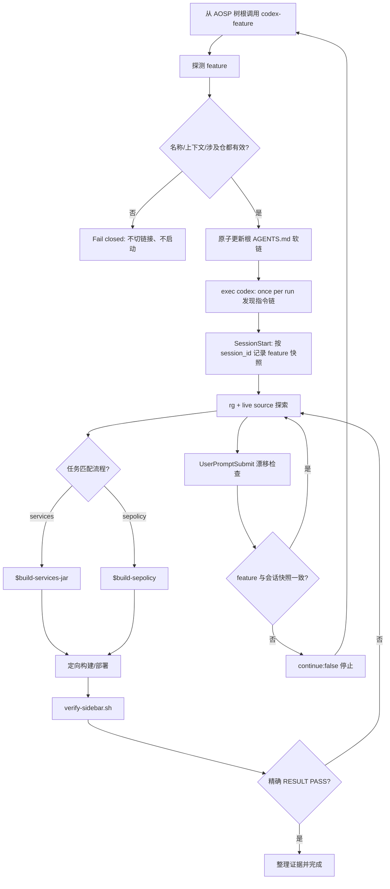

# AOSP 整机源码 Codex Harness 工程探索

> 本文讨论的不是“怎样让 Codex 记住更多文字”，而是怎样把一棵 AOSP 整机源码树布置成一个可操作、可约束、可验证的工程环境。示例目标是 AOSP 17、Cuttlefish `aosp_cf_x86_64_phone` 和 `dev-sidebar` feature；可运行代码位于本文同目录，入口见 [README](README.md)。

在小仓库里，给 coding agent 一段需求、让它改代码并跑测试，往往已经够用。整机 AOSP 不一样：树根通常是 `repo` 工作区而不是单一 Git 仓；下面有上千个 project；Java、Kotlin、C++、Rust、AIDL、Soong、SELinux policy 和产品配置共同决定最终行为；一次完整构建与起机验证可能跨越几十分钟甚至数小时。此时，单纯“把模型换强”不能消除工程边界不清、流程易丢和验证证据不足的问题。

这里把解决方案称为 **Codex Harness**：使用 Codex 已文档化的 `AGENTS.md`、repository skills、project hooks、subagents、配置与权限边界，再加上仓库自己实现的 wrapper、分支清单和严格验证器，把一次工作组织成三层：

1. 上下文层先回答“当前 feature 是谁、允许动什么、硬约束是什么”；
2. 流程层回答“改到这类代码时怎样构建、部署、恢复”；
3. 验证闭环回答“什么证据足以宣布完成”。

本文会持续区分三种性质：**官方保证**是当前 Codex 文档明确建立的契约；**Demo 选择**是本仓为了把契约落地而做的实现；**真实 AOSP 建议**是迁移到生产树时应进一步采用的工程做法。三者不能互相冒充。

## 一、问题：为什么 Codex 在整机源码树上仍需要 Harness

### 1.1 一棵树，多个尺度同时存在

AOSP 的第一个难点不是代码行数本身，而是尺度混合。一个“新增系统服务”的需求，表面上可能只是一份 Java 实现，真正交付却会穿过：

- `frameworks/base`：AIDL、framework API、`SystemServer` 注册和 `services.jar`；
- `system/sepolicy`：`service_contexts`、service type、客户端 `find` 权限；
- `build/make` 或产品仓：模块进产品、镜像组成；
- `packages/apps`：客户端安装、平台签名、privapp 权限；
- Cuttlefish 与 ADB：镜像部署、设备选择、起机和运行时断言。

这些目录又属于不同 Git project。树根的分支名没有代表性；某个锚点仓处于 `dev-sidebar`，不代表 `system/sepolicy` 也在同一分支。Agent 如果只看到了局部代码，很容易生成“语法上合理、整机上不闭环”的改动。

### 1.2 语言和构建系统让导航成本变成上下文成本

Java 调用可能经 AIDL 进入 Binder，再由 JNI 注册名跨到 native；一个 C++ 方法名可能在多个服务里重复；Soong 通过 `Android.bp`、产品变量和生成代码建立边。若一开始用 `onTransact` 这类泛词扫全树，海量命中会把真正需要的事实淹没。

本 Harness 的导航选择是 **`rg` + live source**：先用仓库和路径缩小范围，再用 JNI 注册名、全限定 `Class::method`、唯一服务名等高信息量锚点搜索，最后读当前工作树里的源码确认调用关系。它的价值是零准备、结果对应当前 checkout，也适合教学 demo。

但这只是本方案的工程选择，不是“Codex 从不索引”的产品断言。Codex 的不同表面可以拥有不同的搜索或上下文能力；本文也不会把一次 `rg` 命中包装成完整引用图。对影响面仍未确认的地方，应明确列出源码路径、关键符号和未知边界。

### 1.3 长构建把“命令已提交”伪装成“构建已完成”

AOSP 构建常见的错误并非命令写错，而是监督方式写错：

- 在一个短生命周期 shell 里后台启动构建，下一次工具调用已经拿不到子进程退出码；
- 只看到日志末尾一段正常输出，就默认构建成功；
- 复用固定 `/tmp/build.log`，两个任务互相覆盖；
- 只检查命令退出，没有检查成功标记与预期产物；
- 单编通过后直接宣布完成，忽略完整镜像、部署与运行时行为。

因此流程必须显式保留子进程、唯一日志、成功标记和产物证据。长构建不是“多等一会儿”就能解决的问题，它需要稳定协议。

### 1.4 上下文很贵，而且噪声会持续积累

整机源码探索会产生大量中间输出：搜索结果、构建日志、堆栈、SELinux denial、设备状态。把所有内容都留在主会话，会让需求、决定与未确认项逐渐被噪声掩埋。子代理适合隔离只读探索、测试和日志分析，但子代理本身也会消耗额外 token；若任务边界不清，反而增加协调成本。

所以 Harness 不追求“把整棵树都塞进上下文”，而是追求：在正确时间披露最少但足够的上下文，并让机器可执行的脚本保存确定性事实。

### 1.5 Harness 文件不能污染 manifest、Gerrit 和构建输入

真实 AOSP 项目通常有严格的 Gerrit project 边界。若把 agent 指引、feature 清单、临时状态或验证脚本随手落进 `frameworks/base`，它们可能被误提交；某些隐藏文件还可能被构建 glob 捕获。Harness 的知识管理需求与产品源码的版本管理需求并不相同。

本方案因此把 `features/` 设计成 **manifest 之外的独立 Git 仓**：它位于 AOSP 树根，但不进入 repo manifest，不属于任何产品 Gerrit project，也不作为 Soong 输入。feature 上下文仍可单独提交到团队私有 remote，同时不污染上游代码审查。

### 1.6 “编过”不等于“改对”

`m services` 成功只能证明某个目标编译完成，不能证明：

- 设备确实完成启动；
- 新的 `system_server` 没有崩溃；
- `sidebar` 服务已经注册；
- 客户端 APK 已安装并能找到服务；
- 本次部署之后没有新的 crash-buffer 记录；
- SELinux 策略与实际访问路径一致。

如果完成标准只是“build pass”，agent 最容易停在看似顺利、实际不可用的中间态。Harness 的第三层就是要斩断这种 build-pass illusion。

## 二、官方能力边界：Codex 提供了哪些承载面

下面先不谈本 demo 怎样实现，只看当前官方文档明确给出的承载面。

| 能力面 | 官方保证 | Demo 选择 | 真实 AOSP 建议 |
|---|---|---|---|
| `AGENTS.md` | 启动时构建指令链，**once per run**；先 global，再从 project root 走到 current working directory | wrapper 在启动 Codex 前把根链接指到当前 feature | 所有入口都经过 wrapper，不依赖会话内热切换 |
| project config | 受信任项目可加载根到 cwd 的 `.codex/config.toml` 层，近处优先 | demo 没有增加项目 config，hooks 单独放在 JSON | 用户或管理员配置 root markers；项目设置最小化并审查 |
| repository skills | 从 `.agents/skills` 发现；先 metadata，使用时再读完整 `SKILL.md` | 两个窄 skill，feature `AGENTS.md` 显式路由 | 按稳定流程拆分，避免把 feature 事实复制进 skill |
| hooks | `hooks.json` 或 inline config；项目 hook 需要信任，`/hooks` 可审查 | `SessionStart` 记录快照，`UserPromptSubmit` 查漂移 | hook 做机械 guardrail，不承担首次上下文选择 |
| subagents | 可把独立、嘈杂工作隔离并汇总，代价是额外 token | 使用子代理任务卡传递局部接口 | 读多写少优先并行；写冲突和共享设备操作串行化 |
| approvals / sandbox | sandbox 定义技术边界，approval 决定何时暂停或请求越界 | 文档与脚本都不假设拥有设备或树外权限 | 使用最小写范围和最窄批准；指导不是授权 |

### 2.1 AGENTS.md：每次运行只发现一次

官方 `AGENTS.md` 文档的核心句是：Codex 启动时构建 instruction chain，**once per run**；在 TUI 中通常对应一次启动的 session。发现顺序分两段：

1. **global**：先在 Codex home 中找 `AGENTS.override.md`，没有时再找 `AGENTS.md`，这一层只取第一个非空文件；
2. **project**：从 **project root** 向下走到 **current working directory**，每级依次检查 `AGENTS.override.md`、`AGENTS.md` 和可配置 fallback 名称，每级至多取一个文件。

合并顺序从根到近处，越靠近 cwd 的指引越晚出现，因此拥有更高的实际优先级。空文件跳过；合并内容受到 `project_doc_max_bytes` 限制，默认是 **32 KiB**。这意味着“大而全的总手册”不仅浪费上下文，也可能挤掉更近处真正重要的约束。

默认情况下，包含 `.git` 的目录被视为 **Git 根**，也就是典型 project root。若找不到 project root，官方行为是：**找不到 project root 时只检查当前目录**，不会无限向上猜测一个 AOSP 树根。这一点对非 Git 的 repo 工作区尤其关键。

### 2.2 project root 与配置层：可配置不等于可随意猜

Codex 允许通过 `project_root_markers` 调整 project root 识别，例如把 `.hg` 或其他组织标记加入列表；空列表则让当前目录直接成为 root。该设置更适合作为用户或管理员层的环境配置，因为项目根发现发生在项目层加载之前，不能把“某个尚未发现的项目配置会先帮助发现自己”当成可靠前提。

项目内 `.codex/config.toml` 只有在项目受信任时才加载。配置优先级高层次上是：CLI 覆盖 > 从 project root 到 cwd 的项目 config（近处优先，trusted only）> profile > user > system > built-in defaults。不受信任项目会跳过项目 `.codex/` 层，包括项目 config、hooks 和 rules。

本 demo 因此不把 `project_root_markers` 当正确性依赖；**wrapper 固定树根 cwd** 才是 demo 的 correctness boundary。wrapper `cd` 到 AOSP 树根再 `exec codex`，同时给相对 hook 命令一个稳定工作目录。真实环境仍可在用户/管理员配置中声明 root marker，但它是易用性增强，不替代入口约束。

### 2.3 Repository skills：先 metadata，后完整流程

官方 skills 文档把这种加载方式称为**渐进式披露**。Codex 初始上下文只放每个 skill 的 **name、description 和文件路径**；决定使用某项 skill 后，才读取完整 `SKILL.md`。repository skill 从当前目录向上到 repo root 的 `.agents/skills` 中发现。

skill 有两种选择方式：

- 显式：提示中写 `$skill-name`，或在 CLI / IDE 使用 `/skills`；
- 隐式：任务与 skill 的 `description` 匹配时，Codex可以选择它。

这也说明 `description` 是隐式路由的公开接口，应该写清触发条件与边界。当前官方文档**没有已文档化的 `paths:` 路径触发契约**。本仓 Claude Code demo 的 skill frontmatter 虽然含 `paths`，迁移到 Codex 时不能假定“读到某个 glob 就必然激活”。Codex demo 改为标准 `name`/`description`，再由 feature `AGENTS.md` 对关键路径写显式 `$build-services-jar` 和 `$build-sepolicy` 路由。

### 2.4 Hooks：生命周期 guardrail，不是指令链热更新器

Codex 可从 `hooks.json` 或 `config.toml` 的 **inline `[hooks]`** 表加载 hook。结构是“事件 → matcher group → command handler”。多个来源的匹配 hook 会一起运行；同一事件的多个 command hook 可能并发启动，所以不能依赖 hook A 阻止 hook B 开始。

项目 hook 有两道信任边界：

1. 项目 `.codex/` 层本身必须处于受信任项目；
2. 非 managed command hook 必须审查并信任精确定义，Codex 按当前 hash 记录信任。

CLI 的 `/hooks` 用于查看来源、审查新定义、在变更后重新信任或禁用 hook。因而“文件已经放到 `.codex/hooks.json`”并不等于“它一定运行”。

command hook 从标准输入接收 JSON。常用公共字段包括 `session_id`、`cwd`、`hook_event_name`，还有模型、权限模式等信息。某些事件支持结构化输出；例如 `UserPromptSubmit` 可以返回：

```json
{
  "continue": false,
  "stopReason": "feature drift",
  "systemMessage": "restart through the wrapper"
}
```

`SessionStart` 是 thread start 事件，可以记录状态或补充上下文，但 **SessionStart 不会追溯性地替换本次运行的 AGENTS.md**。因为 `AGENTS.md` 指令链已经在启动时建立，hook 内改软链不能证明同一次运行重新发现了指引。正确做法是启动前选择；检测到漂移后停止并新开运行。

### 2.5 Subagents：隔离噪声，但任务 prompt 才是稳定接口

官方文档建议把代码探索、测试、triage、日志分析等独立工作交给 subagents，让主线程保留需求、决策和最终输出。它同样明确：每个子代理都会做自己的模型和工具工作，因此消耗比单代理更多；并行写操作还可能产生冲突与协调开销。

文档建立了 subagent workflow、agent thread、sandbox 继承等行为，但没有建立“所有子代理自动拿到当前 feature 全部上下文”的普遍契约。这个 demo 的工程规则是：子代理**不会自动继承当前 feature 的全部上下文**，派发 prompt 中的**子代理任务卡**才是稳定接口。任务卡明确目标、路径、关键事实、约束与证据，避免把整份上下文广播给只需要局部事实的探索任务。

### 2.6 Approvals 与 sandbox：文字约束不是权限升级

官方把两者分得很清楚：**sandbox** 决定命令能访问哪些文件和网络资源，**approval** 决定需要越界时何时暂停以及由谁审查。子代理继承当前 sandbox；本地命令及其子进程也仍在同一边界内。

这对 AOSP 很重要。`AGENTS.md` 可以写“push 前固定设备”，skill 可以给出 `adb root`，但它们没有因此获得访问 USB、网络、树外目录或真实设备的权限。**指导不是授权**。合理顺序始终是：先选择明确目标，再在最小 sandbox 边界内执行；确实需要越界时请求最窄 approval，而不是把 `danger-full-access` 当默认补丁。

## 三、方案总览：Codex 原生三层 Harness

### 3.1 目录结构

本仓的可运行 demo 是一个微缩 AOSP 树：

```text
codex/
├── README.md
├── AOSP整机源码Codex-Harness工程探索.md
├── CURRENT_FEATURE
├── AGENTS.md -> features/dev-sidebar/AGENTS.md
├── run-demo.sh
├── .codex/
│   ├── bin/
│   │   ├── codex-feature
│   │   └── check-process-layer
│   ├── hooks.json
│   └── hooks/
│       ├── feature-common.sh
│       ├── session-start.sh
│       └── check-branch-drift.sh
├── .agents/skills/
│   ├── build-services-jar/SKILL.md
│   └── build-sepolicy/SKILL.md
├── features/dev-sidebar/
│   ├── AGENTS.md
│   ├── repos.tsv
│   ├── check-branch.sh
│   └── verify-sidebar.sh
└── tests/test-harness.sh
```

### 3.2 三层职责

| 层 | 核心问题 | 机器可执行落点 | 失败时的行为 |
|---|---|---|---|
| ① 上下文 | 当前是哪条 feature、哪些仓可动、有哪些硬约束 | `CURRENT_FEATURE`、根 `AGENTS.md` 软链、`.codex/bin/codex-feature`、hooks | 启动前 fail closed；会话中漂移要求重启 |
| ② 流程 | 这类改动怎样构建、部署、恢复和联动 | `.agents/skills/*/SKILL.md`、`check-process-layer` | 缺流程证据时不进入完成态 |
| ③ 验证闭环 | 设备行为是否真的符合需求 | `features/dev-sidebar/verify-sidebar.sh` | 只接受 `RESULT PASS` |

导航没有单列第四层。这个 Harness 直接用 `rg` 与源码阅读，不要求预建索引；同时明确承认它不是完整语义索引，不能把文本搜索的整洁输出误认为完整影响面。

### 3.3 为什么是 wrapper + skills + verifier

三个组件分别控制三个不同时间尺度：

- wrapper 在运行开始前执行，解决“第一次看到什么”的问题；
- skills 在任务进行中按需披露，解决“走什么流程”的问题；
- verifier 在交付前执行，解决“凭什么完成”的问题。

只用 `AGENTS.md`，流程细节会膨胀并触及 32 KiB 限制；只用 skills，Codex 可能在错误 feature 上走完正确流程；只用 verifier，则会在工作末尾才发现前面所有假设都错了。三层互补，不互相代替。

### 3.4 为什么第一版不做 plugin，也不依赖索引

plugin 适合分发多个 skills、hooks、MCP 配置和资产，但这个 demo 首先要证明的是仓内协议本身。第一版直接使用 Codex 原生文件位置，便于阅读、审计和测试；等多个团队需要安装、升级、统一版本时，再把稳定部分打包。

同理，索引可以是未来增强，却不应成为首次运行前置条件。AOSP checkout、分支和生成状态经常变化；零准备的 live-source 路径更适合作为保底导航。若未来接入语义索引，应把索引 freshness 和覆盖率也纳入验证，不能静默替换当前事实来源。

## 四、第①层 上下文：启动前选对 AGENTS.md

### 4.1 feature 仓为何独立于 manifest

真实部署建议在 AOSP 根放一个 `features/` 独立仓：

```text
<AOSP_ROOT>/features/dev-sidebar/
├── AGENTS.md
├── repos.tsv
├── check-branch.sh
└── verify-sidebar.sh
```

它保存团队自己的 feature 知识与验证入口，却不进入 repo manifest、Gerrit project 或 Soong 输入。根 `AGENTS.md` 是相对软链：

```text
AGENTS.md -> features/dev-sidebar/AGENTS.md
```

相对链接让整棵树移动到另一台机器后仍有效，也让编辑根文件直接落到 feature 独立仓。wrapper 只替换自己管理的软链；若根 `AGENTS.md` 是普通文件，它拒绝覆盖，避免破坏用户已有指引。

### 4.2 feature 探测与保守命名

`.codex/bin/codex-feature` 先查看几个稳定锚点仓：`frameworks/base`、`frameworks/native`、`frameworks/av`、`system/core`。找到合法 Git 仓并处于 symbolic branch 时，取其分支名；否则读取 `CURRENT_FEATURE`。

demo 对 feature 名故意保守，只接受**单行 ASCII 单组件**：

```text
[A-Za-z0-9][A-Za-z0-9._-]*
```

所以 `dev-sidebar` 合法，`feature/dev-sidebar`、`../escape`、绝对路径、空值、换行和 NUL 都被拒绝。这里牺牲了 slash 分支名的便利，换来路径组成与状态文件命名的可证明性。真实团队若必须支持 slash，应先设计编码规则与完整测试，不能直接放宽 regex。

### 4.3 repos.tsv 是涉及仓单一事实源

`features/dev-sidebar/repos.tsv` 每行三个非空字段：仓路径、期望 feature、说明。例如：

```text
frameworks/base	dev-sidebar	SidebarService、SystemServer 注册和 public/System API
system/sepolicy	dev-sidebar	新系统服务的 SELinux 策略
```

`check-branch.sh` 对每个条目给出机器稳定的分类：

- `OK`：合法 Git 仓且 symbolic branch 正确；
- `MISSING`：预期仓不存在；
- `DRIFT`：分支不同或 `DETACHED`；
- `INVALID`：仓元数据、manifest 行或 feature 名无效。

wrapper 只有在树根存在 `.repo/` 目录时才把它视为真实 repo 树，并要求 checker 可执行。分支验证先于软链切换；任何缺仓或漂移都 fail closed，保留原链接且不启动 Codex。这样“进入错误 feature 后再提醒”被提前成“根本不开始”。

### 4.4 wrapper 的顺序就是正确性协议

核心顺序可以浓缩为：

```bash
feature="$(detect_feature "$ROOT")"
target="features/$feature/AGENTS.md"
HARNESS_ROOT="$ROOT" FEATURE_NAME="$feature" \
  "$ROOT/features/$feature/check-branch.sh"
sync_feature_link "$ROOT" "$target"
cd "$ROOT"
exec codex "$@"
```

真实脚本还处理非法 feature、缺失上下文、普通文件冲突、原子软链替换和 dry-run。关键不是代码行数，而是顺序不可交换：

1. 先探测并校验 feature；
2. 在 repo 树中先校验涉及仓；
3. 再安全更新根 `AGENTS.md`；
4. 最后从树根启动新的 Codex run。

常用命令：

```bash
# 只验证与同步，不启动 Codex
./.codex/bin/codex-feature --dry-run

# 正常入口，参数原样传给 codex
./.codex/bin/codex-feature
```

预期 dry-run 输出类似：

```text
[codex-feature] AGENTS.md -> features/dev-sidebar/AGENTS.md
```

### 4.5 为什么非 Git 树根必须固定 cwd

在普通 Git 仓中，Codex 默认能以 Git 根作为 project root。AOSP repo 工作区根常常没有 `.git`，子仓各自有 `.git`。如果从 `frameworks/base/services` 直接启动，project root 与 skills 发现边界可能落在 `frameworks/base`，树根的 `AGENTS.md`、`.agents/skills` 和 `.codex/` 都不再是自然祖先。

如果整个路径又找不到 project root，官方规则只检查 current working directory。于是本 demo 的 wrapper 必须 `cd` 到树根：它既让根 `AGENTS.md` 成为当前目录指引，也让 `.agents/skills` 与 `.codex/hooks.json` 位于稳定位置。可选的 `project_root_markers` 能改善环境，但不会替代 wrapper-root cwd 这个 demo correctness boundary。

### 4.6 Hooks 快照会话，而不是热换上下文

`.codex/hooks.json` 注册两个事件：

```json
{
  "hooks": {
    "SessionStart": [{
      "matcher": "startup",
      "hooks": [{"type": "command", "command": "./.codex/hooks/session-start.sh"}]
    }],
    "UserPromptSubmit": [{
      "hooks": [{"type": "command", "command": "./.codex/hooks/check-branch-drift.sh"}]
    }]
  }
}
```

项目 hooks 必须先在受信任项目中加载，再通过 `/hooks` 审查精确命令。demo 使用相对命令，是因为 wrapper 已固定 cwd；官方对一般 Git 项目更推荐从 Git 根解析路径，避免子目录启动造成漂移。

`session-start.sh` 从 JSON 读取 `session_id`，重新探测 feature，并写入私有状态目录：

```text
${TMPDIR:-/tmp}/aosp-codex-harness-$UID/<session_id>.feature
```

目录权限被收紧为 `0700`，快照为 `0600`。`check-branch-drift.sh` 在每次 `UserPromptSubmit` 比较快照与当前 feature；相同则退出 0 且零输出，不同则返回 `"continue": false`、`stopReason` 和重启提示。

可手工演示：

```bash
session_payload='{"session_id":"manual-demo","cwd":".","hook_event_name":"SessionStart"}'
prompt_payload='{"session_id":"manual-demo","cwd":".","hook_event_name":"UserPromptSubmit"}'
printf '%s\n' "$session_payload" | ./.codex/hooks/session-start.sh
printf '%s\n' "$prompt_payload" | ./.codex/hooks/check-branch-drift.sh
```

第一条记录“本会话从哪里开始”，第二条只检测漂移。若 `CURRENT_FEATURE` 已改变，正确响应不是在同一 run 中换 `AGENTS.md`，而是停止工作、保存未提交状态、通过 `.codex/bin/codex-feature` 新建运行。

### 4.7 Feature AGENTS.md 应写什么

`features/dev-sidebar/AGENTS.md` 由三类内容组成：

- 树级硬约束：Bash envsetup、禁止手改 `out/`、API 与 SELinux 联动、ART 风险；
- feature 事实：目标、允许修改仓、导航锚点、验证入口；
- 流程路由：特定路径变化必须使用哪个 repository skill。

它不复制完整构建脚本。构建脚本留在 skill，设备断言留在 verifier，涉及仓留在 `repos.tsv`。这种“一个事实只在一个机器可执行位置维护”的原则，比把同一命令粘贴到多份 markdown 更抗漂移。

## 五、第②层 流程：用 repository skills 渐进披露

### 5.1 两个 skills，各自只做一件事

demo 只有两个 repository skills：

| Skill | 触发语义 | 负责内容 |
|---|---|---|
| `$build-services-jar` | 修改 `frameworks/base/services` 或 `SystemServer` 服务 | `m services`、产物、ADB push、ART 风险、全镜像恢复、最终 verifier |
| `$build-sepolicy` | 修改 `system/sepolicy` 或新增系统服务策略 | service type、`m selinux_policy`、完整镜像、denial 与注册验证 |

两个 `SKILL.md` frontmatter 都只有标准 `name` 与 `description`。Codex 初始只看到 metadata，真正选中后再读完整正文，这就是渐进式披露。

feature `AGENTS.md` 把关键路径写成显式路由：

```markdown
- 修改 `frameworks/base/services/**` 前必须使用 `$build-services-jar`。
- 修改 `system/sepolicy/**` 前必须使用 `$build-sepolicy`。
```

隐式选择仍可由 `description` 发生，但它是模型选择，不是强制执行。必须流程用显式 route，机械违规再交给测试或 hook；不要把“skill 可能被选中”误当成 enforcement。

### 5.2 监督式定向构建

`build-services-jar` 的代表性协议如下，正文不需要复制完整脚本，但每个关键信号都不能省：

```bash
bash -c '
set -u
build_log="$(mktemp "${TMPDIR:-/tmp}/build-services.XXXXXX.log")"
artifact="out/target/product/vsoc_x86_64/system/framework/services.jar"
(
  source build/envsetup.sh >/dev/null 2>&1 &&
  lunch aosp_cf_x86_64_phone-trunk_staging-userdebug >/dev/null 2>&1 &&
  m services
) >"$build_log" 2>&1 &
build_pid=$!
while kill -0 "$build_pid" 2>/dev/null; do
  tail -n 20 "$build_log"
  sleep 10
done
wait "$build_pid"
build_rc=$?
[[ "$build_rc" -eq 0 ]]
grep -Fq "#### build completed successfully ####" "$build_log"
[[ -f "$artifact" ]]
'
```

这里有四重证据：子进程退出码、唯一 `mktemp` 日志、`build completed successfully` 标记、预期 artifact。构建必须留在**同一个 exec session**；开始后应持续轮询同一会话，直到 `wait` 返回。若另起 shell 猜测进程状态，就丢失了最重要的完成证据。

SELinux skill 使用同样协议，但目标是：

```text
m selinux_policy
out/target/product/vsoc_x86_64/system/etc/selinux/plat_sepolicy.cil
```

若 AIDL 进入 public 或 System API，还要运行 `m update-api`。这些依赖不是 verifier 能替代的；验证运行时行为之前，构建层必须先证明输入和产物自洽。

### 5.3 快环与稳环必须明确区分

`services.jar` 可以形成较快部署环：确认设备、root、remount、push、reboot。但 jar 与 dexpreopt、boot image、ART 缓存不一致时，设备可能慢启甚至起不来。这时需要完整镜像稳环，而不是反复 push 猜测。

完整构建也必须从自己的 Bash 环境开始，采用唯一日志、retained child、成功标记和 `system.img` 产物检查。之后先查看 fleet，再固定组：

```bash
cvd fleet
cvd_group="${CVD_GROUP:?Set CVD_GROUP after explicit confirmation}"
cvd --group_name="$cvd_group" stop
cvd --group_name="$cvd_group" start
```

`cvd --group_name` 的 selector 位于 command 前。不能在可能存在多个实例时直接 `cvd stop`，也不能从上一次会话猜 group。

### 5.4 每条 ADB 命令都要钉住同一个设备

真实设备路径先要求：

```bash
device_serial="${ANDROID_SERIAL:?Set ANDROID_SERIAL to the explicitly confirmed target serial}"
adb -s "$device_serial" get-state
```

随后所有 `root`、`remount`、`push`、`reboot`、`dmesg`、`service list` 都保留 `-s "$device_serial"`。`ANDROID_SERIAL` 不是随手的默认值，而是用户明确确认目标之后形成的会话输入。尤其在 Cuttlefish 多实例和 USB 真机并存时，一条未固定的 `adb reboot` 就可能改变错误设备。

### 5.5 SELinux 规则要使用 AOSP 的规范属性

新增由 SystemServer 注册的服务时，demo skill 推荐：

```te
type sidebar_service, system_server_service, service_manager_type;
allow sidebar_app sidebar_service:service_manager find;
```

`system_server_service` 属性由 AOSP 的 `add_service(system_server, system_server_service)` 宏消费；宏为 SystemServer 提供 `{ add find }` 并建立相应 neverallow。因而不应再写一条裸的 per-service SystemServer allow 来绕开 canonical policy。客户端只获得需要的 `find`，而不是扩大注册权限。

这也是“流程 skill 比 feature 文本更适合承载稳定知识”的例子：feature 只说本服务叫 `sidebar`、客户端是谁；AOSP 规范 policy 模式由 `$build-sepolicy` 单一维护。

### 5.6 流程自检防止文档慢慢腐烂

`.codex/bin/check-process-layer` 不运行 AOSP 构建，而是静态检查两个 skills 是否仍包含关键协议：Bash envsetup、lunch 目标、构建命令、retained wait、唯一日志、成功标记、artifact、设备 pin、CVD group、SELinux canonical pattern 和最终 `RESULT PASS`。

```bash
./.codex/bin/check-process-layer
```

预期输出：

```text
PASS  build-services-jar skill 工件完整
PASS  build-sepolicy skill 工件完整
RESULT PASS
```

它不是“skill 一定被 Codex 自动选择”的测试，而是流程工件本身的可回归契约。

## 六、第③层 验证闭环：只有 RESULT PASS 才算完成

### 6.1 五项断言覆盖从起机到功能可见性

`features/dev-sidebar/verify-sidebar.sh` 在 demo 中固定执行**五项断言**：

1. `sys.boot_completed` 必须等于 `1`；
2. `pidof system_server` 必须查询成功且 PID 非空；
3. 专用 `crash buffer` 自基线以来不能出现 timestamped record；
4. `service list` 必须包含 `sidebar:`；
5. `pm list packages` 必须包含 `com.android.sidebar`，否则按策略记 SKIP。

真实模式下所有查询经同一个 `ANDROID_SERIAL`：

```bash
adb -s "$ANDROID_SERIAL" shell getprop sys.boot_completed
adb -s "$ANDROID_SERIAL" shell pidof system_server
adb -s "$ANDROID_SERIAL" logcat -b crash -d -v epoch,nsec -T "$baseline"
adb -s "$ANDROID_SERIAL" shell service list
adb -s "$ANDROID_SERIAL" shell pm list packages
```

### 6.2 查询失败与“对象不存在”必须分开

空输出并不总是业务事实。ADB 断开、权限不足、命令失败和真正没有对象是不同状态：

| 检查 | 查询失败 | 查询成功但对象缺失 |
|---|---|---|
| boot property | `FAIL  sys.boot_completed 查询失败` | `FAIL  sys.boot_completed != 1` |
| system_server | `FAIL  system_server 查询失败` | `FAIL  system_server pid 为空` |
| service | `FAIL  service list 查询失败` | `FAIL  sidebar 服务未注册` |
| package | `FAIL  package list 查询失败` | `SKIP  com.android.sidebar 未安装` |
| crash | `FAIL  crash buffer 查询失败` | 空记录才可能 PASS |

特别是 crash 查询，命令失败绝不能解释成“没有崩溃”。这种错误会制造最危险的假阳性。

### 6.3 SKIP 默认是不完整，不是成功

verifier 最终只有三种严格结论：

- `RESULT PASS`：没有 FAIL，也没有 SKIP，退出 0；
- `RESULT FAIL`：至少一个 FAIL，退出非零；
- `RESULT INCOMPLETE`：没有 FAIL 但存在 SKIP，默认退出非零。

`--allow-skip` 只服务于探索。它会输出 `RESULT PASS (SKIP allowed)`，但不能作为交付证据。收工标准仍是精确的 `RESULT PASS`。

### 6.4 基线必须显式或可解释

crash 检查需要时间窗口。脚本支持两种来源：

- `--since EPOCH`：调用方在部署前记录的显式 epoch 基线；
- 未传 `--since`：从设备 `/proc/stat` 解析 `btime`，覆盖本次启动以来的 crash。

两者语义不同。部署基线适合排除早于本次改动的历史 crash；默认 `btime` 更保守，适合确认本次起机全过程没有崩溃。若 `btime` 查询或解析失败，验证直接 FAIL。

### 6.5 为什么使用 epoch,nsec 与整数纳秒比较

脚本请求 `logcat -b crash -d -v epoch,nsec`，把时间戳规范成 `seconds.fraction`，fraction 右补到九位，再转成整数**纳秒**：

```text
epoch_ns = seconds * 1_000_000_000 + nanoseconds
```

然后使用 `timestamp >= baseline` 的精确比较。这样 `200.500499999` 小于 `200.500500000`，`200.500500001` 大于它；不会因为 shell 浮点、字符串字典序或毫秒截断而错误分类。以数字开头但不能解析的 crash 记录也会触发解析 FAIL，而不是被静默跳过。

使用专用 crash buffer 还有一个策略优势：只要在窗口内出现合法 timestamped record 就失败，不依赖某几个 `FATAL EXCEPTION` 关键词。关键词过滤可能漏掉 native tombstone、libc abort 或新的格式。

### 6.6 确定性 demo 让闭环离线可跑

不接设备也可以运行：

```bash
./features/dev-sidebar/verify-sidebar.sh --demo
```

预期结果：

```text
PASS  sys.boot_completed = 1
PASS  system_server pid = 1423
PASS  crash buffer 自 100 起无崩溃
PASS  sidebar 服务已注册
PASS  com.android.sidebar 已安装
SUMMARY PASS=5 FAIL=0 SKIP=0
RESULT PASS
```

环境变量可以构造确定性失败，例如：

```bash
DEMO_CRASH_QUERY_FAIL=1 \
  ./features/dev-sidebar/verify-sidebar.sh --demo
```

它必须产生 `FAIL  crash buffer 查询失败` 和 `RESULT FAIL`。demo mode 的价值不是模拟 Android 全部行为，而是让状态机、退出码、时间边界和失败语义进入普通回归测试。

## 七、串起来：一个 Codex 会话的完整生命周期

下面这张图把三层与失败重启路径连起来：



一次理想会话按以下节奏运行：

1. 开发者从树根运行 `.codex/bin/codex-feature`；
2. wrapper 探测锚点仓分支或 `CURRENT_FEATURE`，再校验 feature 上下文和 `repos.tsv`；
3. 根软链就绪后才启动 Codex，AGENTS 指令链建立；
4. `SessionStart` 以 `session_id` 保存 feature 快照；
5. 主代理用 `rg` 与 live source 探索，必要时派出带任务卡的只读 subagent；
6. 改 services 或 sepolicy 时显式采用对应 skill；
7. 构建与部署保留完整证据；
8. verifier 必须得到精确 `RESULT PASS`；
9. 若中途 feature 漂移，`UserPromptSubmit` 阻断，回到 wrapper 开新运行。

这条链中没有任何一步可以由“模型说看起来没问题”替代。模型负责推理和操作，脚本负责不可含糊的状态转换。

## 八、从 Claude Code 版迁移时不能直接照搬什么

本节只比较仓库内的两个教学实现，不把本仓 Claude 行为描述外推为任一产品的普遍契约。

| 维度 | 本仓库 Claude Code demo | Codex demo | 迁移动作 |
|---|---|---|---|
| 根指引 | 根 `CLAUDE.md` 指向 feature `CLAUDE.md` | 根 `AGENTS.md` 指向 feature `AGENTS.md`，启动发现 once per run | 重写指引发现与优先级说明，不做字符串替换 |
| skill 目录 | `.claude/skills` | `.agents/skills` | 将流程迁到 Codex repository skill 位置 |
| skill 路径假设 | 示例 frontmatter 使用 `paths` 并声称 glob 激活 | 当前公开契约按显式 `$skill` 或 `description` 隐式选择 | 删除 `paths` 依赖，在 AGENTS 中显式 route 关键流程 |
| hook 配置 | `.claude/settings.json`，命令引用 `${CLAUDE_PROJECT_DIR}` | `.codex/hooks.json` 或 inline `[hooks]`，使用 Codex 事件 schema | 按 Codex 字段重写并通过 `/hooks` 信任审查 |
| 启动 hook | SessionStart 做软链检查/fallback | SessionStart 只记录 feature snapshot | 首次上下文选择留在 wrapper 之前 |
| 漂移输出 | demo 自己定义告警行为 | `UserPromptSubmit` 返回 Codex 支持的 `continue:false` 结构 | 按事件输出契约实现停止与重启提示 |
| wrapper | `.claude/bin/claude-feature`，最后 `exec claude` | `.codex/bin/codex-feature`，最后 `exec codex` | 保留先校验、后链接、再启动的顺序，替换产品入口 |
| 环境变量 | Claude demo hook 使用 Claude 项目变量 | Codex command hook常用输入是 `session_id`、`cwd`、`hook_event_name` | 不假设存在 Claude 专用环境变量 |
| 子代理上下文 | README 对 Explore/Plan 有该 demo 自己的假设 | 任务卡是稳定接口，不假设完整 feature 自动继承 | 在派发 prompt 显式写目标、范围、约束、证据 |
| 信任与权限 | 使用该 demo 自己的配置说明 | 项目 `.codex/` trust、hook hash trust、sandbox/approval 分层 | 把信任审查作为安装步骤，不把指引当授权 |

迁移的结论很直接：不要为 Codex 创建 `.claude/`；不要为 Codex 创建 `CLAUDE.md`。保留可以复用的工程思想——启动前选择、单一事实源、严格验证——但把承载面改写成 Codex 的 `AGENTS.md`、`.agents/skills`、`.codex/hooks.json` 和 Codex 权限模型。

## 九、工程化加固与测试

### 9.1 文档与脚本都要先写契约测试

本 demo 的 `tests/test-harness.sh` 不只测试“happy path”，还把文章、README、skills、hooks 和 verifier 当成工程接口。长文采用同样的 TDD 顺序：先追加标题、章节、官方链接、关键事实、禁写断言与本地链接解析测试；观察文章缺失导致 RED；再写文章直到 GREEN。

这样做可以防止文档在后续重构中悄悄重新引入错误产品 claim，例如把路径命中写成必然选择、把 SessionStart 写成同 run 热换 AGENTS、忽略 hook trust，或把子代理描述成全上下文复制。

### 9.2 回归类别

现有测试大致分成七组：

1. feature 输入：路径穿越、slash、空值、换行、NUL、非法锚点分支；
2. 涉及仓：缺仓、实际 DRIFT、DETACHED、损坏 Git metadata、TSV 格式；
3. 软链：普通文件保护、stale/broken link、分支失败保留旧链接、原子替换；
4. hooks：配置 schema、`session_id` 边界、独立会话快照、缺失快照 fail closed、漂移 JSON；
5. 状态安全：私有权限、相对路径、符号链接拒绝、`O_NOFOLLOW`、编码干扰；
6. 流程层：skill metadata、保留构建、产物、ADB pin、CVD group、canonical SELinux；
7. 验证层：五态查询语义、严格 SKIP、`btime`、`epoch,nsec` 纳秒边界、真实 ADB 全量 pin、demo 隔离。

### 9.3 失败驱动的加固

这些防线都对应过一种具体的错误模式：

- **路径穿越 / NUL**：feature 名不再经过宽松 shell 清洗，而是按原始 bytes 做全匹配；
- **no-follow hook state**：状态目录逐级 `lstat`，用 `O_NOFOLLOW` 打开，拒绝 symlink 与 `.`/`..` 组件；
- **ADB pinning**：真实模式在执行任何 ADB 前先校验 `ANDROID_SERIAL`，之后每条查询都带 `-s`；
- **retained builds**：构建、轮询、`wait` 和结果判断处于同一个 exec session；
- **canonical SELinux**：测试拒绝旧的裸 SystemServer allow，要求 `system_server_service` 属性；
- **exact crash timestamps**：比较整数纳秒，覆盖等于基线、前一纳秒、后一纳秒与大 epoch；
- **demo state isolation**：集成 demo 在私有临时树制造漂移，不写真实 `CURRENT_FEATURE`，异常退出也恢复原 `AGENTS.md`。

测试不能证明同 UID 下所有并发攻击都已消失；对教学 demo 来说，防止常见路径替换、符号链接和误操作已覆盖主要风险。更严格的 same-UID 对手模型需要目录句柄贯穿、锁、原子协议或进程隔离，属于后续安全设计，而不是一段 shell 的顺手承诺。

### 9.4 Evidence before completion

Harness 的最后一条纪律是**证据先于完成声明**。至少应保留：

- wrapper 选择的 feature 与涉及仓检查结果；
- 修改文件和 Git diff；
- 构建子进程退出、成功标记、artifact 路径和唯一日志；
- 明确的设备 serial / CVD group；
- verifier 的完整 summary 与精确 `RESULT PASS`；
- 回归测试、demo、Markdown link check 和 `git diff --check`。

若任一验证未运行，就不能把“应该通过”写成“已经通过”。如果结果是 `RESULT INCOMPLETE`，报告缺口；如果设备或权限不可用，报告边界；如果文档和实现不一致，先修正事实来源，而不是静默改变无关代码。

### 9.5 一键演示

从仓库根运行：

```bash
./codex/run-demo.sh
```

或：

```bash
cd codex
./run-demo.sh
```

它依次展示上下文选择、会话漂移、涉及仓一致性、流程 skills、严格验证和回归。脚本不会启动真实 Codex、ADB、CVD 或 AOSP build；测试还会在 `PATH` 放入禁止命令 stub，确保教学 demo 不越过这个边界。最后一行应为：

```text
Codex 三层 Harness 演示完毕
```

## 十、边界与下一步

### 10.1 当前边界

这套 demo 有意保持有限：

- 一次只管理一棵树和一个 active feature；没有跨树协调器；
- feature 名不支持 slash，换取安全的单组件路径；
- project hook 必须完成项目 trust 与 `/hooks` 定义信任，否则漂移保护不会运行；
- skill 的隐式选择依赖 `description` 与模型判断，不是 enforcement；
- 本地 demo 可以读写工作区并运行 shell，Codex cloud 是否能访问本地 AOSP 树、设备和私有网络是另一个部署问题；
- `rg` 导航不提供完整语义索引，生成代码、反射、动态注册和 build graph 仍需专门确认；
- subagent 会增加 token 成本，写任务共享工作树和设备时还会带来冲突；
- hook state 对常见 symlink/path 风险做了防护，但完整 same-UID race 防御不在教学范围；
- verifier 只覆盖示例 feature 的五项结果，不替代 CTS、VTS、GTS、性能和长期稳定性测试。

### 10.2 下一步演化

真实团队可以沿四条路线演进：

1. **plugin 分发**：当多个项目复用同一组 skills、hooks 和工具时，建立版本化安装与升级；
2. **handoff**：把 feature 事实、当前 diff、构建产物、验证证据生成标准交接包，减少跨班次上下文丢失；
3. **reflection**：从失败日志中提取“是否应升级为 skill、AGENTS 规则或 verifier 断言”，但仍由人审查后入库；
4. **review gates**：把 `repos.tsv`、process checker、verifier、链接检查和事实扫描接入 CI 或提交前检查。

还可以为不同 feature 生成 task card 模板，为只读探索建立低成本 subagent role，为设备操作建立串行队列。但每项增强都应保持同一个原则：可选智能能力可以提高效率，交付正确性必须由清晰协议和可复现证据兜底。

## 结语

在 AOSP 整机源码树上，Harness 的价值不是替 Codex 思考，而是把思考发生的环境布置正确：启动之前选中 feature，工作过程中按需披露流程，构建时保留真实子进程证据，部署时钉住设备，收工前只认严格 verifier。

`AGENTS.md`、skills、hooks、subagents 与 sandbox 各有官方边界。工程实现只有尊重这些边界，才不会把“方便的假设”写成“产品保证”。本 demo 最重要的产物也不是某个 shell 技巧，而是一条可以审计的链：**正确上下文 → 正确流程 → 正确验证 → 证据充分后完成**。

## 参考资料

- [Custom instructions with AGENTS.md](https://learn.chatgpt.com/docs/agent-configuration/agents-md)
- [Build skills](https://learn.chatgpt.com/docs/build-skills)
- [Hooks](https://learn.chatgpt.com/docs/hooks)
- [Advanced configuration](https://learn.chatgpt.com/docs/config-file/config-advanced)
- [Subagents](https://learn.chatgpt.com/docs/agent-configuration/subagents)
- [Developer commands](https://learn.chatgpt.com/docs/developer-commands)
