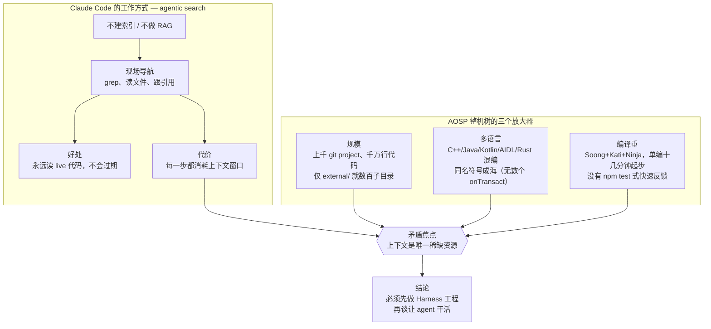
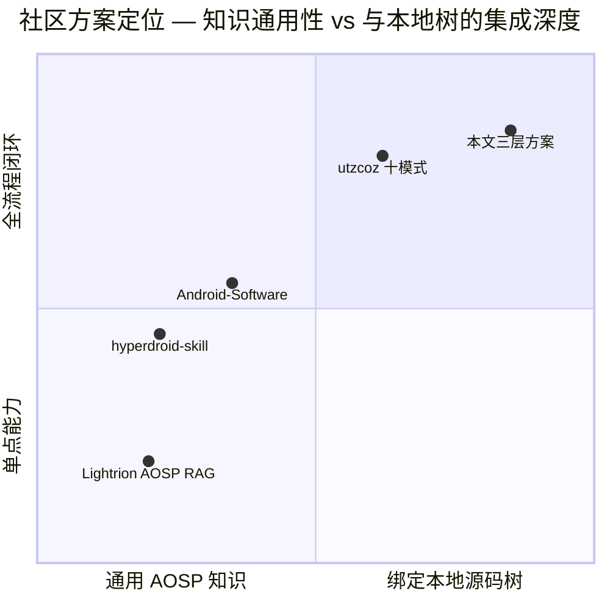
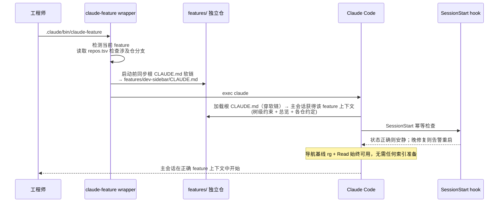
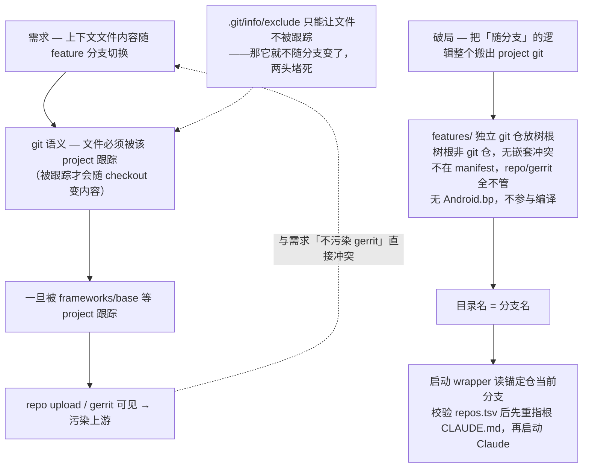
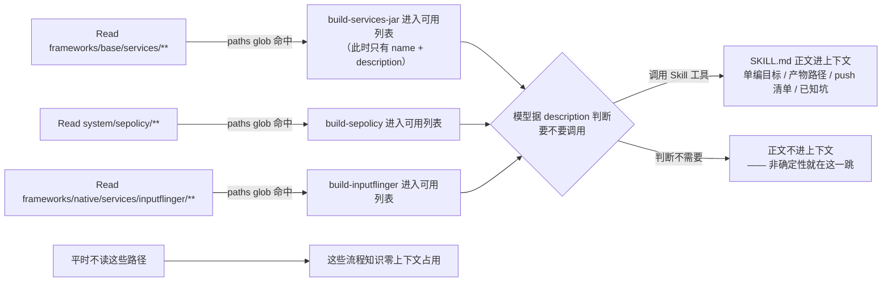
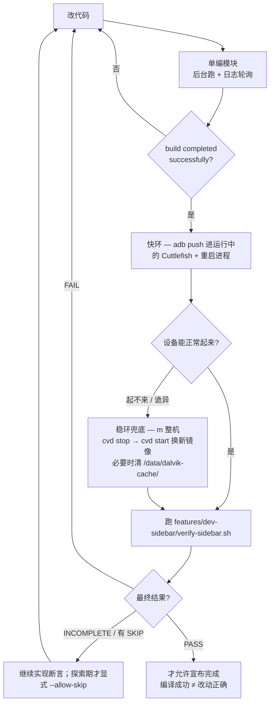
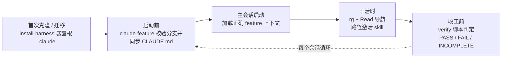
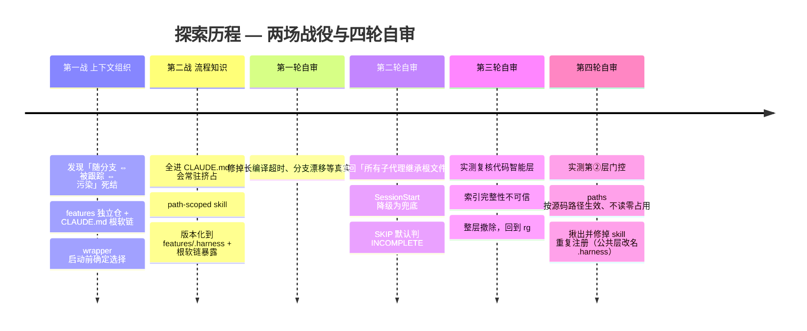

# AOSP 整机源码 Harness 工程探索

> 我们在一棵纯 AOSP 17（`android-17.0.0_r1`）整机源码树上，围绕 Claude Code 搭建了一套三层 harness 工程，让 coding agent 能够在上千个 git project、千万行量级的 repo 工程里稳定地**导航、编译、部署、验证**，目标设备是 Cuttlefish 虚拟机（`aosp_cf_x86_64_phone`）。本文先分析 coding agent 在整机源码树上应用的困难，再梳理 Anthropic 官方博客给出的大库通用要点，接着盘点网络上已有的同类方案，最后介绍我们的三层解决方案——每层解决什么问题、如何协同运转，以及一路探索踩过的坑。

---

## 一、问题：为什么 coding agent 在整机源码树上"开箱不可用"

Claude Code 这类 agent 不给代码库建索引（不做 RAG），而是用 **agentic search** 现场导航——grep、读文件、跟引用，像一个新来的工程师翻代码。这个设计有一个巨大的好处和一个巨大的代价：

- **好处：永不过期。** 它永远读的是 live 代码，不会像向量索引那样"返回两周前已改名的函数、或引用一个已删除的模块，却不告诉你它过期了"。
- **代价：上下文窗口是唯一稀缺资源。** 导航的每一步（grep 结果、读过的文件）都在消耗上下文；导航质量完全取决于你把代码库"布置"得多好。

AOSP 整机源码树把这个矛盾推到极端，有三个放大器：



不搭 harness，直接在整机树上用 coding agent 会反复撞上这些墙（均为实际遇到或验证过的）：

| 痛点 | 现象 |
| --- | --- |
| 导航失效 | 全树 grep 一次就吞光上下文；文本匹配跳到错误的同名符号 |
| 上下文盲区 | 每个新会话都不知道"当前在做哪个 feature、哪些仓能动、有哪些硬约束" |
| 流程知识丢失 | 每次都要重新教它怎么编译、产物在哪、push 哪些文件 |
| "编过 = 改对"幻觉 | 编译成功就认为功能正确，会话心满意足地结束，设备一跑就崩 |
| 知识污染 | 上下文文档混进 gerrit project 的提交 |
| 隐性经验反复付学费 | "改了这个类布局必须连某个 so 一起重编"这类血泪知识，不固化下来每次重新踩 |

**核心论断：模型不是瓶颈，环境才是。** 社区先行者 utzcoz 用 Claude Code 做成 4 个 AOSP 级项目后的结论也是如此：这类工作 coding agent 开箱做不好，能做成靠的是围绕 agent 搭的 **harness engineering**——"harness 诚实，产出就诚实"。

---

## 二、官方参照：Anthropic《How Claude Code works in large codebases》的要点

上一节的困境不是 AOSP 独有的。Anthropic 官方博客《How Claude Code works in large codebases》归纳了 Claude Code 在大型代码库（百万行 monorepo、几十年遗留系统、几十个仓的分布式架构）落地成功的共性模式——它不是为 AOSP 写的，但几乎每一条都能对上整机树的处境，是我们方案的通用理论底座。这里先把它的要点提炼出来；后文第四节起的三层，本质就是把这些通用原则一条条落到整机树上的具体形态。

### 2.1 Claude Code 怎么在大库里导航：agentic search，而非 RAG

博客把第一节我们已经点到的机制说得更透：

- **agentic search**：像工程师一样遍历文件系统、读文件、用 grep 精确定位、跟着引用跨库跳转；**本地运行、不需要建立/维护/上传任何索引**。
- **RAG 在大规模下会失效**：embedding 管线追不上活跃的工程团队——开发者查询时，索引反映的是几周/几天/几小时前的代码，于是**返回一个两周前已改名的函数、或引用一个上个 sprint 已删除的模块，却完全不提示它已过期**。
- **代价与甜区**：agentic search 反过来要求**足够的起始上下文**才知道去哪找；导航质量取决于代码库被"布置"得多好（用 CLAUDE.md + skills 分层）。若向一个十亿行的库问一个模糊 pattern，会在开工前就撞上上下文窗口墙。**在代码库布置上投入的团队，效果明显更好。**

### 2.2 harness 与模型同等重要：五个扩展点 + 两项能力

博客点名一个最常见的误解——以为 Claude Code 的能力只由所用模型决定。实际上**围绕模型的生态（harness）比模型本身更决定表现**。harness 由五个扩展点构成，外加两项能力，且**叠加有顺序——每一层都建立在前一层之上**：

| 组件 | 是什么 | 何时加载 | 最适合 | 常见误用 |
| --- | --- | --- | --- | --- |
| **CLAUDE.md** | 自动读取的上下文文件 | 每个会话 | 项目约定、代码库知识（根=全局、子目录=局部） | 把该进 skill 的可复用经验塞进来 |
| **hooks** | 关键时刻运行的脚本 | 事件触发 | 自动化一致行为、**捕获会话经验（自我改进）** | 用 prompt 去做本应自动跑的事 |
| **skills** | 针对特定任务打包的指令 | 按需、相关时 | 跨会话/项目的可复用专长（渐进式披露、可按 path scope） | 全塞进 CLAUDE.md |
| **plugins** | 打包 skills/hooks/MCP | 配好后常驻可用 | 把一套可用配置分发到全组织 | 让好做法停留在部落知识 |
| **MCP servers** | 连接外部工具与数据 | 配好后常驻可用 | 让 Claude 够到本来够不到的内部工具 | 基础没跑通就先建 MCP |
| **LSP**（能力，非扩展点） | 语言服务器提供的符号级导航 | 配好后常驻可用 | 精确的定义/引用跳转，比文本搜索省上下文 | 在索引建不完的规模上信任它的完整性（本文第四节末「不采纳一」即栽在这里） |
| **subagents**（能力，非扩展点） | 独立上下文的隔离实例 | 被调用时 | **把探索与编辑分离**、并行 | 在同一会话里既探索又编辑 |

其中几条博客特别强调的：**hooks 最有价值的用法不是防错，而是让配置自我改进**（stop hook 会话末反思→提议改 CLAUDE.md）；**skills 可 path-scoped**，只在相关目录激活；**subagents 的典型用法是只读子代理测绘子系统、主代理再带全貌编辑**。这里必须补一个当前 Claude Code 的行为边界：大多数自定义子代理启动时会加载 memory hierarchy，但它们仍是隔离上下文；内建 **Explore/Plan 明确跳过 `CLAUDE.md` 与 git status**。所以不能把“所有子代理继承根 `CLAUDE.md`”当成契约，更不应该给每个子代理复制整份 feature 文件；派发 prompt 才是稳定接口，应只放目标、范围、会改变结论的关键事实、约束和输出格式。

### 2.3 三个配置模式

博客从成功部署里提炼出三个反复出现的模式：

1. **让大库对 Claude 可读**：CLAUDE.md 精简且分层（根只放指针 + 关键坑）；**在子目录而非仓根初始化**（Claude 会自动向上加载沿途每个 CLAUDE.md，根上下文不丢）；按子目录 scope test/lint 命令（跑全套会超时、烧上下文）；用 `.ignore` / 版本化的 `permissions.deny` 排除生成物、构建产物、三方码；目录结构不给力时写一份轻量 **codebase map**；以 grep/文件阅读建立可工作的导航基线。
2. **随模型演进主动维护 CLAUDE.md**：为旧模型缺陷写的规则会拖累新模型（如"每次重构拆成单文件改动"会阻止新模型做它本已擅长的协调跨文件编辑）；为补模型/工具缺陷写的 skill/hook 一旦缺陷消失就成负担。**每 3–6 个月、或模型换代后感觉见顶时**做一次配置重审。
3. **指派 owner**：技术配置本身不驱动采纳；铺开最快的组织在放开前就有专人/小队把工具接进工作流，出现 **agent manager**（PM/工程混合角色）或至少一个 **DRI**，并尽早对齐治理（谁管 skill/plugin、避免重复造轮子、AI 代码走同样的 review）。

### 2.4 适用边界

博客最后划了适用范围：Claude Code 面向**常规软件工程环境**——工程师是主要贡献者、用 Git、标准目录结构。非常规设置（游戏引擎的大二进制资产、非常规版本控制、非工程师贡献代码）需要额外的配置工作。

> 这些都是通用结论；而整机树把每一条的难度都放大了（第一节的三个放大器）。后文第四节起，就是我们把这套通用原则逐条落到 AOSP 整机树上的具体形态——并在两处（子目录初始化、plugin 分发）因 repo 工程的现实做了有意背离（见第四节末）。

---

## 三、他山之石：网络上已有的类似方案

动手自建之前，我们先调研了社区在"AOSP + coding agent"这个方向上已有的探索（调研时间 2026-07）。有代表性的四个方案，恰好各占一个生态位：

| 方案 | 形态 | 一句话定位 |
| --- | --- | --- |
| [Lightrion AOSP RAG](https://lightrion.com/docs) | 托管 MCP 服务（SaaS） | 对公开 AOSP 各版本做语义检索，agent 即插即查 |
| [utzcoz《Using Claude Code on AOSP-scale projects》](https://utzcoz.github.io/2026/04/26/using-claude-code-on-aosp-scale-projects.html) | 方法论（博客） | 4 个已交付 AOSP 级项目沉淀的 harness engineering 十模式 |
| [hyperb1iss/hyperdroid-skill](https://github.com/hyperb1iss/hyperdroid-skill) | Claude Code 插件 | Android 通用领域技能包（adb/fastboot/构建/LineageOS）+ crash 分析 agent |
| [jonaschen/Android-Software](https://github.com/jonaschen/Android-Software) | 分层 skill 知识包 | L1 路由 → L2 子系统专家，防幻觉路径与跨域错配 |

### Lightrion AOSP RAG：托管的 AOSP 语义检索

一个商业 MCP 服务：把 AOSP 13–17 各发布版预先建好索引，暴露 `search_code` / `get_chunk` / `get_file` / `list_versions` / `diff_versions` 五个工具，任何 MCP 客户端加一个 bearer token 就能用自然语言检索 AOSP 源码，还能按 minor release 钉住版本、跨版本 diff。

- **优点**：零本地成本——不需要本地源码树、不需要自己建索引；多版本覆盖 + 跨版本 diff 是独有能力（"这个函数在 15→17 之间改了什么"一问即得）；接入是标准 MCP，五分钟配完。
- **局限**：它索引的是**公开 AOSP 发布版**，而整机开发的工作对象是**自己的本地树**——你刚改过的代码、本地 feature 分支、树上的任何 delta 它都不知道。这正是 Anthropic 官方博客点名的 RAG 死穴（"返回已改名的函数却不告诉你它过期了"）在 fork 场景下的极端形态。此外代码问题出网查询有保密性顾虑；且它只覆盖"读与查"这一层，编译、部署、验证全不涉及。
- **我们的取舍**：不能作为本地树的主导航——live 树的基线是 `rg` + 直接阅读当前源码。它作为"查上游基线/跨版本差异"的补充通道仍有真实价值。

### utzcoz 十模式：被四个交付项目验证过的方法论

作者用 Claude Code 做成并发布了 4 个 AOSP 级项目（ARM64→x86_64 二进制翻译器、AOSP 14 多窗口补丁集、Chromium WebXR 移植、64 章 AOSP 内核书），沉淀出十条 harness engineering 模式，分三组：跨会话保存状态（CLAUDE.md 行为契约、handoff 交接文档）、验证（模拟器基座、verify 脚本只编码一次、红条 TDD、读截图判对错）、输出可信（结论带源码路径行号、冷启动对抗 review）。

- **优点**：唯一经过"真的交付了东西"检验的完整方法论；对"编过 = 改对"幻觉、"似是而非 ≠ 正确"这两个 agent 根性问题给出了系统解法；多条模式可直接照抄（CLAUDE.md 只写 agent 默认会犯的错、verify 脚本单入口确定性输出）。
- **局限**：它是方法论而非可安装工件，每个项目都要自己重新落地；其项目形态是"单仓 fork + 模拟器"，没有处理 repo 千仓工程特有的问题——上下文文件会污染 gerrit project、上下文如何随 feature 分支切换。
- **我们的取舍**：十模式是本文方案在理念层的最大来源——CLAUDE.md 行为契约、verify 确定性脚本、"harness 诚实产出就诚实"都直接进入了设计；repo 工程特有的部分（第五、六节）则是我们补上的。

### hyperdroid-skill：插件化的 Android 通用技能包

LineageOS 社区开发者的 Claude Code 插件（MIT）：四个按触发词自动激活的 skill（`android` 设备/adb、`android-fastboot` 刷机/分区/防砖、`android-build` Gradle+AOSP 构建、`lineageos` repo/Gerrit 工作流）加一个受限工具的 `crash-analyzer` 子代理（自主收集 logcat/tombstone/ANR 后给诊断）。

- **优点**：**工程骨架是四家里最值得抄的**——单仓分发多 skill + agent（plugin.json/marketplace 一键装）、渐进式披露（SKILL.md 速查 + `references/` 深度页按需加载）、触发词自动激活、受限工具 + 固定工作流的子代理模板、仓库自校验 Makefile（CI 强制每个 skill 结构合规）。
- **局限**：内容是**参考手册级的通用知识**（adb/fastboot/构建命令速查），视角偏三方 ROM 玩机而非整机平台开发；不绑定任何具体源码树——不知道你的 feature、你的编译产物、你的验证脚本；对树内导航、上下文经济、gerrit 污染等核心矛盾不涉及。
- **我们的取舍**：抄骨架、自己填肉——渐进式披露和触发激活的思想直接体现在我们的 path-scoped skill 设计里（`paths` glob 替代触发词，粒度更准）。

### Android-Software：分层专家路由的知识包

面向 Android Software Owner / BSP 工程师的分层 skill 集（Beta，对 Android 15 验证）：所有任务先过 L1 路由器（意图 → 已验证的 AOSP 路径映射），再加载对应的 L2 子系统专家（build/SELinux/HAL/framework/init/内核 GKI/bootloader/ATF/pKVM 等 12 个），每个专家带子系统知识、禁止动作和工具链；另有 hindsight notes 机制沉淀跨会话经验。

- **优点**：直击 agent 在 AOSP 上的三大失败模式（幻觉路径、跨域错配——把 bootloader 问题路由给 init、版本知识漂移）；"MMU 式按需加载"与我们的上下文经济诉求同源；子系统覆盖面最广（连 LK/ATF/pKVM 这类 vendor 层都有路由位）；没有本地源码也能回答问题。
- **局限**：本质是**静态知识包**——与"你这棵树"零绑定，答案来自预写的知识而非现场读码，版本演进要人工维护（对 A15 验证，用在 17 上就有漂移窗口，恰是它自己要解决的问题）；无 symbol 级导航；无编译→部署→验证闭环；单人 Beta 项目，成熟度有限。
- **我们的取舍**：分层按需加载的思想与我们"索引粒度注入、详情按需加载"殊途同归；但我们把"知识从哪来"反过来了——不预写知识，让 agent 现场读真代码，harness 只负责把它引到对的地方。

### 四方案对照与我们的位置

用整机树内开发需要的三类能力——上下文、流程、验证闭环，这也正是下文我们方案的三层框架——给它们做覆盖度体检（● 深度覆盖 ◐ 部分/通用级 ○ 基本不涉及）：

| 方案 | ① 上下文 | ② 流程 | ③ 验证闭环 |
| --- | --- | --- | --- |
| Lightrion AOSP RAG | ○ | ○ | ○ |
| utzcoz 十模式 | ◐ CLAUDE.md 契约 + handoff | ◐ 脚本化约定 | ● verify/红条 TDD/对抗 review |
| hyperdroid-skill | ○ | ◐ 通用命令速查 | ◐ crash-analyzer |
| Android-Software | ◐ 分层按需加载 | ◐ 子系统流程知识 | ○ |
| **本文方案** | ● 启动前随 feature 分支切换（单文件软链） | ● path-scoped skill | ● verify 闭环 |



结论一目了然：四个方案分别解决了检索、方法论、通用领域知识、知识路由，**但没有一个解决"这一棵树"的问题**——repo/gerrit 布局下不污染上游的上下文组织、随 feature 分支确定切换的工作状态、绑定本树目标设备的确定性验证环。这块空白，就是下文三层 harness 的主体；而各家的长处（utzcoz 的验证纪律、hyperdroid 的渐进披露骨架、Android-Software 的按需分层思想）都被吸收进了对应层的设计。

---

## 四、方案总览：三层 Harness

### 4.1 一个业务前提与三个术语

展开三层之前，先厘清本方案赖以成立的一个业务前提和几个反复出现的术语——它们决定了这套 harness 为什么可行、三层各自靠什么落地。

**业务前提：一个专项 = 一个 feature = 一个本地分支 = 3–8 个单仓。** 真实的手机厂商以**专项**的形式推进 OS 特性开发（一个专项就是一次成体系的特性迭代）。我们把一个专项对应成一个 **feature**，并约定 **一个 feature 独占一个 repo 本地分支**（`repo start <feature> --all`），该 feature 的全部改动只在这个分支上进行——这样 harness 才有一个稳定的"当前在做什么"的锚点。一个 feature 通常只触及 **3–8 个 git 单仓**（例如"新增一个系统服务 + 一个边栏应用"，落在 `frameworks/base`、`frameworks/native`、新建 app 仓、`build/make`、`system/sepolicy` 上）。正是"**涉及仓有限、且随分支固定**"这个业务事实，让后文所有"随 feature 组织、随分支自动切换、按仓精简"的机制得以成立。

**三个术语（三层各自的关键落地物，正文表格里会直接用到）：**

- **启动前 feature wrapper + SessionStart 兜底**：真实树中的 `.claude/bin/claude-feature` 先读当前分支、校验 `repos.tsv` 中的涉及仓、再把树根 `CLAUDE.md` 软链指向 `features/<分支>/CLAUDE.md`，最后才 `exec claude`。这样 Claude 读取 project memory 前，目标就已经确定。SessionStart hook 只做幂等检查、恢复与诊断，不能承担“本次启动一定已重新读取 memory”的正确性保证（第①层，详见第五节）。配套 demo 使用相同的 `.claude/bin/claude-feature` 路径。
- **path-scoped skill**：skill 是**按需加载**的打包指令；带 `paths` glob 的 skill 只在 agent 读到匹配路径的代码时才**进入可用列表**（此时进入上下文的只是它的名字与描述，正文仍要等模型决定调用）。我们用它承载"改到这片代码怎么编译 / push / 验证"这类过程性知识——不读到就零上下文占用（第②层，详见第六节）。
- **`features/<分支>/verify-*.sh` 确定性脚本**：每个 feature 自带的验证脚本，就是这个 feature 的"测试"。单项输出 **PASS/FAIL/SKIP**，最终状态是 **PASS/FAIL/INCOMPLETE**；默认任何 SKIP 都是未完成并返回非零，只有探索阶段显式传 `--allow-skip` 才允许带 SKIP 通过（第③层验证闭环，详见第七节）。

### 4.2 三层总览

我们把「上下文、流程、验证闭环」三件事做成工程化的基础设施，让 agent 在这棵树上的每次会话都站在同一套地基上：

| 层 | 解决什么 | 落地物 |
| --- | --- | --- |
| ① 上下文 | 每个会话确定知道"在哪、做什么、什么不能碰" | `features/.harness/bin/claude-feature`（经根 `.claude` 暴露）启动前把根 `CLAUDE.md` 软链到 `features/<分支>/CLAUDE.md`；SessionStart 只兜底/诊断 |
| ② 流程 | 动到哪片代码就知道怎么编译/push/验证 | `features/.harness/skills/` 中若干 path-scoped skill，经根 `.claude/skills/` 使用 |
| ③ 验证闭环 | 斩断"编过=改对" | `features/<分支>/verify-*.sh` 确定性脚本 |

> **与官方博客扩展点框架的对应关系**（博客要点见第二节）：博客把 harness 拆成五个扩展点（CLAUDE.md、hooks、skills、plugins、MCP servers）外加两项能力（LSP、subagents）。我们这张"三类能力"表是同一套东西按"解决什么问题"重排的：① 上下文 = **CLAUDE.md + 启动 wrapper + hooks**，其中 wrapper 是正确性边界，hook 是兜底；② 流程 = **skills**（path-scoped）；③ 验证闭环 = **verify 脚本**。**博客两项能力里的 LSP 我们最终不采纳**——理由见本节末「不采纳一」；导航因此不单独成层，而是贯穿三层的基线动作：`rg` 缩小范围 + 直接读当前源码。

三层的**版本化源文件全部落在 `features/` 独立 Git 仓**：公共 wrapper、hooks、skills、settings 与回归测试在 `features/.harness/`，每个专项的上下文与验证工件在 `features/<分支>/`。AOSP 树根不是 Git 仓（只有 `.repo/`，没有 `.git/`），因此 `features/` 不属于任何 Gerrit project、也不在 manifest 中；树根只保留两个暴露入口：安装时创建的 `.claude -> features/.harness`，以及 wrapper 随 feature 重指的 `CLAUDE.md -> features/<分支>/CLAUDE.md`。这样既不污染上游，又能通过 `features/` remote 真正跨机分发和审计 Harness。

```
<AOSP_ROOT>/                          # repo 工程根（非 Git 仓）
├── .claude -> features/.harness     # 安装脚本创建的公共 Harness 暴露入口
├── CLAUDE.md -> features/<分支>/CLAUDE.md
│                                      # wrapper 启动前按当前 feature 同步
└── features/                         # 独立 Git 仓（不在 manifest，Gerrit/Soong 不可见）
    ├── install-harness.sh            # 安全、幂等地安装根 .claude 软链
    ├── .harness/                     # 公共 Harness 的版本化来源
    │   ├── bin/claude-feature        # ① 校验分支、同步 CLAUDE.md、再 exec claude
    │   ├── settings.json             # ① hooks 注册；settings.local.json 本机忽略
    │   ├── hooks/                    # ① feature 检测、SessionStart 兜底、漂移告警
    │   ├── skills/                   # ② path-scoped 编译/验证 skill
    │   └── tests/                    # Harness 自身回归测试
    └── dev-sidebar/                  # 目录名 = repo 分支名 = feature 名
        ├── CLAUDE.md                 # ① 单文件全部上下文：树级约束 + 总览 + 各仓约定
        ├── repos.tsv                 # ① 涉及仓单一事实源（分支一致性检查消费）
        ├── check-branch.sh           # ① 涉及仓分支一致性检查
        └── verify-sidebar.sh         # ③ 确定性验证脚本
```

**公共层的物理目录为什么叫 `.harness` 而不是 `.claude`。** 这是实测踩出来的，不是审美：树根暴露名必须是 `.claude`（Claude Code 只认这个），但 `features/` 里的**物理目录如果也叫 `.claude`，它会被当成第二个 skills 根独立发现一遍**——一次是我们要的、经根软链暴露的项目级注册（由 `paths` glob 门控），一次是子目录级注册（scope 到 `features/`）。结果是每个 skill 在可用列表里出现两次：`build-inputflinger` 和 `features:build-inputflinger`，后者还附带一条方向反了的提示——"改 `features/` 下的文件时用这个"，而 `features/` 里一行 C++ 都没有，那条规则永远不该触发。判据很干净：**两条注册同时存在**，说明是两条独立的发现路径；若只是根软链被解析成真实路径，就只会有一条。改掉物理目录名，第二条随即消失（实测见第六节）。

名字带前导点同样不是随手写的：git 的 `check-ref-format` 拒绝任何以 `.` 开头的 ref 组件，而 feature 目录名 = 分支名，所以 `.harness` **不可能**和某个 feature 撞名。这是原来叫 `.claude` 时白拿的一个性质，改名时不该丢掉。

> **📦 可跑 Demo**：本节目录结构的最小可运行复刻见同级 [CODE0](https://github.com/yuandaimaahao/aosp-harness-demo)——三层落地物一应俱全：wrapper 提供 `--dry-run`，分支检查与 verify 脚本提供 `--demo`，流程层提供离线工件检查；无需真实 AOSP 树，`./run-demo.sh` 即可一键演示三层如何协同。Demo 自身是普通单 Git 仓，所以把 `.claude/` 实体目录留在仓根；真实部署才使用 `features/.harness/` + 根软链。下文五~七节每节开头的「▶ Demo」标注，就指向它对应的文件。

**对博客扩展点与能力的四点取舍（都是被 repo/整机树的现实逼出来的，不是遗漏）：**

- **背离一：博客建议"在子目录而非仓根初始化"**（让 agent scope 到与任务相关的部分，Claude 会自动向上加载沿途每个 CLAUDE.md，根上下文不丢）。这条建议的**两半我们最终都不采纳**，各有原因：
  - **"从哪启动"这一半**——我们的 cwd **必须是树根**（envsetup / lunch / m / adb 全都要求树根 cwd），所以反其道而行。
  - **"把 CLAUDE.md 放到子目录、按需加载"这一半**——我们曾用 hook 在涉及仓物化子目录 `CLAUDE.md`，后来收敛成单个 `features/<分支>/CLAUDE.md` 并让树根软链指向它。原因是 main session 的 feature 上下文本来每次都需要，集中后更易审计，也不必向各 Gerrit project 写入 harness 文件。但这只保证**主会话**从根 project memory 拿到一致上下文，不推出“所有子代理都继承”：普通自定义子代理通常加载 memory hierarchy，内建 Explore/Plan 却明确跳过 `CLAUDE.md`。派发时统一使用最小任务卡，不复制整份 feature 文件（详见第五节）。
- **背离二：博客把 plugins 当作"分发可复用配置、防止好做法停留在部落知识"的手段**（打包 skills/hooks/MCP，marketplace 一键装）。我们**刻意不把这套项目专用 Harness 做成 plugin**：它仍放在 Gerrit projects 之外，但现在不是不可追踪的树根文件，而是由 `features/` 独立 Git 仓同时版本化 feature 工件与 `features/.harness/` 公共 Harness。跨机分发来自该仓的私有 remote；树根 `.claude` / `CLAUDE.md` 只是安装或启动阶段创建的暴露软链，不是事实源。
- **不采纳一：LSP**。博客把 LSP 列为两项能力之一，我们一度按它落地了 C++ 侧的 clangd + 两段式 compdb，**最终整层撤除**。撤的理由不是配不起来（它能跑，单次查询 0.001s，比 `rg` 的 0.2s 快两个数量级，返回的结构化结果也比 `rg` 动辄几十上百 KB 的原始行省得多），而是**在整机树规模上它给不出可信的完整性**：后台索引要覆盖近十万个翻译单元，实测跑三分钟后 `findReferences` 对一个散布在 50 个文件里的类只认到 4 处，而且**不会提示结果不完整**。对"改这个类的成员布局要连带重编哪些模块"这类问题，一个自信的、干净的、错的答案，比 `rg` 吵闹但完整的几百行危险得多——前者会让人漏编，直接换来运行期的野指针崩溃。于是导航退回全语言统一的 `rg` + 源码阅读：慢两个数量级但完整，且没有索引时效、没有跨树串台、没有 Java 侧那套会写坏源码树的工具链。
- **暂缓一：MCP servers**。博客点名一个常见错误——"基础还没跑通就先建 MCP 连接"。我们目前只在"查上游基线 / 跨版本 diff"这类**读侧**场景把 Lightrion 这类 MCP 当补充通道（第三节）；"把结构化检索暴露成 agent 可直接调用的工具"是后续可演进项，而非当前地基。

> 下文以一个真实工作中的 feature 为例（记作 `dev-sidebar`）：在 AOSP 17 上新增一个系统服务 + 一个常驻边栏应用，涉及 `frameworks/base`、`frameworks/native`、新建 app 仓、`build/make`、`system/sepolicy` 五个仓。

---

## 五、第①层 上下文：每个会话睁眼就知道"在哪、做什么、什么不能碰"

> ▶ **Demo**：[CODE0](https://github.com/yuandaimaahao/aosp-harness-demo) 里对应 `.claude/bin/claude-feature`、`CLAUDE.md`（软链）、`.claude/settings.json`、`.claude/hooks/{feature-common,load-feature,check-branch-drift}.sh`、`features/dev-sidebar/{CLAUDE.md,repos.tsv,check-branch.sh}`。Demo 用树根 `CURRENT_FEATURE` 模拟“锚定仓当前分支”；wrapper 在 Claude 启动前同步软链，SessionStart 只做兜底检查。Demo 是普通单 Git 仓，因此 `.claude/` 是根下实体目录；真实树的同一路径来自 `features/.harness/` 软链暴露。

**这一层做的事一句话说清：先把版本化 Harness 安全暴露到树根，再在 Claude 进程启动前选定当前 feature，让主会话读到正确的项目上下文。** 公共 Harness 集中在 `features/.harness/`，安装脚本只需一次把树根 `.claude` 链过去；一个 feature 的上下文集中在 `features/<分支>/CLAUDE.md`（树级约束 + feature 总览 + 各仓约定），树根 `CLAUDE.md` 是 wrapper 动态维护的另一条软链。关键不在“有一条 SessionStart hook”，而在启动顺序：先由 `.claude/bin/claude-feature` 检测分支、检查涉及仓、同步 `CLAUDE.md`，再启动 Claude。hook 内才改软链无法证明同一次启动已经重新读取 project memory，因此只能作为恢复与诊断。

承接 4.1 的前提（一个 feature = 一个 repo 本地分支 = 3–8 个单仓），本层的四条需求是：**按 feature 组织、随分支自动切换、不污染 gerrit、上下文持久不丢**。下文先给出方案的**具体构成与端到端流程**（5.1），再解释那个逼出整套设计的 git 语义死结与破局（5.2），最后讲几个关键设计决策、以及从"物化各仓 CLAUDE.md"到"单文件软链"的演进（5.3）。

### 5.1 方案概览：由哪些文件构成、启动时怎么跑

先看**具体由哪些东西构成**：版本化源文件都在树根下的 `features/` 独立仓，不进任何 Gerrit project；根 `.claude` / `CLAUDE.md` 只是暴露入口。

- **`features/` —— 放在树根的独立 Git 仓**：公共 Harness 与各 feature 工件共用一个可跨机同步的版本边界；每个 feature 一个子目录，**目录名就等于该 feature 的 repo 分支名**。以 `dev-sidebar` 为例：

```
features/
├── install-harness.sh          # 安装根 .claude -> features/.harness
├── .harness/                   # wrapper / hooks / skills / settings / tests
└── dev-sidebar/                # 目录名 = 分支名 = feature 名
    ├── CLAUDE.md               # 【该 feature 的全部上下文，单文件】：树级约束 + 总览 + 各仓约定；树根 CLAUDE.md 软链到它
    ├── repos.tsv               # 涉及仓单一事实源（check-branch.sh / wrapper 消费）
    ├── check-branch.sh         # 涉及仓分支一致性检查
    └── verify-sidebar.sh       # 确定性验证脚本
```

- **`repos.tsv` —— 涉及仓的单一事实源**：一行一个涉及仓，四列——仓路径、单仓约定文件（保留作说明/历史）、标签（当前留空，作扩展位）、说明。`check-branch.sh` 与启动 wrapper 读取全部仓，确保它们都在当前 feature 分支。上下文正文不从 TSV 拼装，仍由单文件 `CLAUDE.md` 承载。

```
frameworks/base           -                     -  SidebarService + SystemServer 注册
frameworks/native         -                     -  SidebarFlinger（native 合成侧）
packages/apps/SidebarApp  -                     -  常驻边栏 app（编译/push 走 skill）
build/make                -                     -       产品配置接入新模块
system/sepolicy           -                     -       新服务 SELinux 策略
```

- **`CLAUDE.md` —— 主会话的单文件 feature 上下文**（树根软链目标）：一份手写文件，含树级约束、feature 总览与各仓约定。集中为单文件是为了让主会话的 project memory 一致、可审计，不是为了向所有子代理灌入全文。加/减涉及仓时，同时校对 `CLAUDE.md` 的人类可读说明和 `repos.tsv` 的机器可读边界。

- **`features/install-harness.sh` —— 根 Harness 暴露安装器**：验证 `features/.harness/` 存在后创建相对软链 `.claude -> features/.harness`。重复安装幂等；若根 `.claude` 是真实目录或指向别处的软链，安装器直接失败并要求人工合并，绝不静默覆盖。

- **`.claude/bin/claude-feature` —— 真实树中推荐且 fail-closed 的启动入口**：这是 `features/.harness/bin/claude-feature` 的树根逻辑路径；它调用共用函数检测 feature，确认目标 `CLAUDE.md` 存在，运行涉及仓分支检查，同步根软链，然后 `exec claude`。缺上下文或仓分支漂移时拒绝启动，避免带错 memory 开工。配套 Demo 使用相同逻辑路径。

- **`.claude/hooks/feature-common.sh` —— wrapper 与 hooks 的共用实现**：集中提供 feature 检测、上下文路径解析与可回滚的软链同步，避免启动入口、SessionStart 和漂移检查各写一份逻辑。

- **`.claude/hooks/load-feature.sh` —— SessionStart 兜底**：检查根软链是否已正确；若不得不在 hook 阶段修复，明确告警“本次会话可能已读到旧上下文”，要求退出后通过 wrapper 重启。它不再被视为正确性边界。

- **`.claude/settings.local.json` —— 本机例外配置**：物理位置在 `features/.harness/settings.local.json`，但被 `features/.gitignore` 忽略；公共 `settings.json`、hooks、skills、wrapper 与测试才随仓分发。

#### 安装并正确启动 Claude Code

首次克隆 `features/`、或从旧的根实体目录迁移后，先从真实 AOSP 树根安装 `.claude` 暴露软链，再执行 wrapper：

```bash
cd /home/zzh0838/Project/aosp
./features/install-harness.sh
./.claude/bin/claude-feature
```

以后只需执行 wrapper；安装脚本重复运行会确认已有正确软链。若根 `.claude` 有真实目录或无关软链，它会返回非零而不是删除、移动或重指，迁移内容需人工确认。

wrapper 会把后续参数原样传给 Claude Code，因此继续会话、恢复会话和选择模型仍按原 CLI 用法书写：

```bash
./.claude/bin/claude-feature --continue
./.claude/bin/claude-feature --resume
./.claude/bin/claude-feature --model opus
```

只想检查 feature 检测、涉及仓分支和根软链，不真正启动 Claude 时，使用：

```bash
./.claude/bin/claude-feature --dry-run
```

直接执行 `claude` **不会自动调用项目里的 wrapper**；它只会启动 Claude Code，然后按 `.claude/settings.json` 执行 SessionStart hook。如果根 `CLAUDE.md` 已经指向当前 feature，裸启动通常看不出差异；但刚切换分支时，它可能先读取旧上下文，随后 hook 才修正软链并告警。因此裸 `claude` 不能作为可靠的日常启动入口。

wrapper **不需要移动到 PATH 目录**。多棵 AOSP 树并存时，最清楚的做法是在 `~/.zshrc` 为每棵树定义独立命令：

```bash
alias claude-a16='/home/zzh0838/Project/a16/.claude/bin/claude-feature'
```

重新加载配置后，可以从任意目录启动，参数同样会透传：

```bash
source ~/.zshrc
claude-a16
claude-a16 --continue
```

也可以把 wrapper 的**原目录**加入 PATH，然后使用 `claude-feature`：

```bash
export PATH="/home/zzh0838/Project/a16.2-x6891/.claude/bin:$PATH"
claude-feature
```

不过，多棵树都会有同名 `claude-feature`，PATH 顺序容易让命令串树，所以更推荐带树名的 alias。不要移动当前脚本，也不建议把它直接软链到 `~/.local/bin`：当前实现根据脚本自身目录计算 AOSP 根路径，改变入口位置可能把项目根解析错。也不建议把 alias 直接命名为 `claude`，以免遮蔽官方命令并让问题排查变得困难。

**完成一次性安装后，每次启动跑这么一条链**（工程师在树根执行 `.claude/bin/claude-feature`）：



一步步拆开：

1. 一次性安装阶段，`features/install-harness.sh` 确认源目录后创建 `.claude -> features/.harness`；危险的已有目标会让安装失败。
2. wrapper 从锚定仓链读出当前分支名（如 `dev-sidebar`），解析 `features/dev-sidebar/`。
3. 它用 `repos.tsv` 检查全部涉及仓是否都在该分支；任何缺失或漂移都 fail closed。
4. 它幂等同步树根 `CLAUDE.md` 软链（根若还是真实文件则先保护性备份），随后才 `exec claude`。
5. Claude Code 加载树根 project memory；SessionStart 再检查一次，正常时无需修复。
6. 主会话由此确定拿到当前 feature 上下文。导航无需任何额外准备——`rg` + Read 即刻可用。

几个容易踩的细节都已加固：

- **SessionStart 覆盖 startup / resume / clear / compact，但只负责诊断与恢复**。若它发现 wrapper 没有提前同步，修复后也会要求重启，因为不能假定 Claude 会在同一次启动里重读刚变化的 memory。
- **每条 prompt 跑一次分支漂移检测**（UserPromptSubmit hook `check-branch-drift.sh`）：比对当前分支与会话快照。会话中途切分支后持续告警，直到退出并通过 `.claude/bin/claude-feature` 建立新会话；没切则零输出。
- **锚定仓做成链**：feature 不一定碰 frameworks/base，按 base → native → 下一候选的顺序找到第一个能读出分支的仓。
- **两类软链都 fail-safe**：根 `.claude` 只由安装器创建，遇到真实目录或无关软链立即拒绝；根 `CLAUDE.md` 重指幂等，若迁移前仍是真实文件，则必须先成功备份、再移走原文件，建链失败还会从备份回滚。正常迁移保留备份，任何失败都要显式报错。**树根只维护暴露软链，不往任何 Gerrit project 写字节。**

> **博客视角的一个补白**：hooks 很适合捕获事件、提醒漂移和推动配置自我改进，但“在 Claude 已开始加载项目 memory 后再改变 memory 文件”存在时序不确定性。这里把确定选择前移到启动 wrapper，hooks 回到它们更擅长的角色：SessionStart 诊断、UserPromptSubmit 分支漂移告警。会话末反思 hook 仍是下一步方向。

### 5.2 命门矛盾与破局：为什么 features/ 是"树根上的独立 git 仓"

上面这套结构里最不显然的一步，是"为什么 `features/` 要单独做成一个**放在树根的 git 仓**，而不是就放进 `frameworks/base` 里、让它跟着分支走"。因为这里藏着一个 git 语义层面的死结：



即：「随分支变」与「不进 gerrit」在同一个 project 仓内**不可兼得**，必须把"随分支"这件事从 git 跟踪机制里拿出来，由树根启动 wrapper 在 Claude 进程出现前把 `CLAUDE.md` 软链指向对应 feature（这正是 5.1 那条链）。

> **为什么 `features/` 用独立仓，而不是 `.git/info/exclude`？** exclude 只让文件不被跟踪、内容并不随 `checkout` 变，而 feature 上下文与公共 Harness 都需要独立版本化并跨机同步——所以它们一起活在树根的 `features/` 独立仓中。安装器暴露 `.claude`，wrapper 再按源码分支选择 `CLAUDE.md` 目标；两条根软链都不属于任何 Gerrit project。早期方案曾在各涉及仓物化子目录 `CLAUDE.md`，当前方案不再往这些 project 写字节。

方案推演最终走到七版：

| 版本 | 方案 | 结局 |
| --- | --- | --- |
| v1 | feature 目录与源码树同级，在 feature 目录启动 | ✗ CLAUDE.md 只沿 cwd 树向上加载，同级源码树的上下文完全加载不到 |
| v2 | `features/` 放树内、独立 git 仓 | ✓ 部分成立，但深层单仓的约定仍进不来 |
| v3 | 根 CLAUDE.md 随分支切换 | 根不是 git 仓、"分支"是 per-project 的——要么建瘦仓手动同步（两套分支），要么 hook 动态注入 |
| v4 | **SessionStart hook 按分支注入** | 找到单一分支源，但 hook 时序不能保证本次启动已经重读变化后的 memory |
| v5 | 大单仓约定也进 `features/`，**物化成各仓 CLAUDE.md 按需加载** | 上下文分两条路径送达，机制复杂、各类代理的加载语义也不统一 |
| v6 | **砍掉 stdout 注入 + 子目录 CLAUDE.md，全部内联进单个 `features/<分支>/CLAUDE.md`，树根软链指向它** | 主会话上下文集中、可审计；但仍错误地把“所有子代理都继承根文件”当成保证 |
| v7 | **启动前 wrapper + SessionStart 兜底 + 最小子代理任务卡** | ✓ 主会话上下文选择确定；Explore/Plan 等例外被显式处理；不向子代理复制整份 feature 文件 |

最终形态 = v7。v5→v6 解决的是**主会话上下文组织**：不再靠 hook stdout 和分散的仓内文件拼装，而是让根 project memory 指向一个 feature 单文件。v6→v7 又修正了两个不该依赖的假设：第一，SessionStart 内改变软链不等于同一次启动已重新加载；第二，子代理并非统一继承根 `CLAUDE.md`，内建 Explore/Plan 明确跳过它。于是上下文选择前移到 wrapper，子代理信息交付则收敛为任务卡。

### 5.3 四个设计决策

**为什么主会话仍使用单个 feature `CLAUDE.md`？** 一个 feature 通常只涉及 3–8 个仓，目标、边界、硬约束和验证入口是主会话全程都要用的信息。集中在一个文件里更容易审阅、版本化和随 feature 切换，也避免向 Gerrit project 物化上下文文件。它服务的是主会话的一致性，不是子代理广播机制。

**为什么必须在启动前选定，而不是交给 SessionStart？** Claude 何时扫描并加载 project memory 与 SessionStart hook 的执行顺序不能被“hook 已执行”反推出。wrapper 先同步、后 `exec claude`，顺序可验证；SessionStart 若发现不一致，只能修复文件并告警重启，不能宣称当前会话已经自动变正确。

**子代理到底要不要注入 `CLAUDE.md`？** 不注入整份文件。普通自定义子代理通常会加载 memory hierarchy，此时再复制全文既浪费上下文又可能制造两份不一致；内建 Explore/Plan 又明确跳过 `CLAUDE.md`，复制全文仍然过量。统一做法是给一张最小任务卡：

1. 目标：要回答什么；
2. 范围：允许搜索哪些目录/文件；
3. 关键事实：哪些已知信息会改变结论；
4. 约束：只读，或与修改/构建/部署相关的必要硬约束；
5. 输出：源码路径、证据、未确认项和建议下一步。

只读测绘不携带整份 feature 背景；承担修改、构建或部署的代理，才在任务卡中补上与其操作相关的风险约束。派发 prompt 是稳定接口，不能把“它大概会继承到根文件”当成省略关键信息的理由。

**什么内容值得留在根 `CLAUDE.md`？** 只放主会话普遍需要、且 agent 默认容易犯错的契约，不把长篇知识和一次性步骤塞进去。本树的硬约束示例如下：

| 硬约束 | 防的是什么 |
| --- | --- |
| 不向任何 gerrit project 提交 harness/上下文文件 | 知识污染上游 |
| 不配任何 LSP、禁生成 Eclipse 工程文件 | 吃内存 + 写坏树（Eclipse 残留的 `.aconfig` 被 soong glob 到，会在零本地提交的仓上把构建挂掉，且 `git status` 看不见） |
| 改 public/System API 后必须 `m update-api` | checkapi 挂构建 |
| 新增系统服务必须同步 `system/sepolicy` | 服务起不来（avc denied） |
| push framework.jar/services.jar 后注意 ART 缓存 | dexpreopt/boot image 校验不一致拖慢甚至起不来 |
| 不手改 `out/` 下任何生成物 | 增量构建被破坏 |

同理，编译约定只保留那些 agent 默认容易做错、且影响面大的规则：envsetup 必须用 bash（工具默认 shell 可能是 zsh），`source` 后不能接 pipe（函数会进子 shell）；长编译后台跑并轮询日志，看到明确成功标记才算完成。

```bash
bash -c 'source build/envsetup.sh >/dev/null 2>&1 \
  && lunch aosp_cf_x86_64_phone-trunk_staging-userdebug >/dev/null 2>&1 \
  && m services' > /tmp/build.log 2>&1 &     # 后台 + 日志轮询，
                                             # 看到 build completed successfully 才算完
```

（顺带一个 Android 17 的新变化：lunch 目标是三段式 product-release-variant，release 段如 `trunk_staging`，可从 `out/soong.log` 的 `TARGET_RELEASE=` 反查。）

---

## 六、第②层 流程：动到哪片代码，就知道怎么编译验证

> ▶ **Demo**：[CODE0](https://github.com/yuandaimaahao/aosp-harness-demo) 里对应 `.claude/skills/build-services-jar/SKILL.md` 与 `build-sepolicy/SKILL.md`，配合 `features/dev-sidebar/CLAUDE.md` 中对应仓小节“一句话指回 skill”的单一事实源写法。`run-demo.sh` 会调用 `.claude/bin/check-process-layer`，离线检查两个 skill 的结构和关键流程内容；它不启动 Claude，也不把工件检查冒充成自动触发测试。真实树中相同逻辑路径的物理来源是 `features/.harness/skills/`。

**这一层做什么。** 一句话：让 agent 一动某片代码，就自动知道这片代码"怎么编译、产物在哪、要 push 哪些文件、怎么验证"——不用人每次交代，平时也不占上下文。这类"改了这片代码该怎么走完编译到验证"的知识是**过程性知识**（区别于第①层"在哪、做什么"那种背景知识）。

**怎么做到的。** 难点在于：把它全塞进根 CLAUDE.md，会每个会话常驻、白白挤占上下文。解法是 **skill 按需加载 + `paths` glob 按路径限定**——把每一类代码的编译验证流程各写成一个 skill，并在 frontmatter 里用 `paths` 标注它作用的代码路径；只有当 agent 真的 Read 到匹配路径的文件时，对应 skill 才**出现在可用 skill 列表里**，其余时间零占用。

这里要精确区分两段，别把它想成"命中即注入"：**命中 → skill 的名字与描述进入上下文（很廉价）；模型据描述判断该不该调用 → 调用后 SKILL.md 正文才进上下文**。所以 `paths` 提供的是**作用域门控**（不命中就完全不可见），而不是执行保证——最后那一跳仍是模型判断。

**这套门控在真实整机树上实测确认过**（不是照着文档推的）。同一个会话里，只做 Read、不做任何编辑，观察可用 skill 列表怎么变：

| 时刻 | 可用列表里的 `build-*` |
| --- | --- |
| 会话刚开，什么都没读 | **一个都没有** |
| Read `frameworks/native/services/inputflinger/InputThread.cpp` | 只出现 `build-inputflinger` |
| Read `frameworks/native/libs/gui/Surface.cpp` | 只出现 `build-libgui` |
| Read `frameworks/base/services/.../InputManagerService.java` | 只出现 `build-services-jar` |

三件事因此从"设计意图"变成"已验证"：门控确实按**被读文件的源码路径**生效；不读就是**零上下文占用**（第一行）；而且只有匹配的那一个进来，其余四个保持沉默——五个 skill 的描述加起来并不便宜，这个差别正是第②层立身的理由。

顺带一提，这张表第一次跑出来时是错的：每个 skill 都出现了**两次**（`build-inputflinger` 和 `features:build-inputflinger`），根因是公共层的物理目录当时叫 `features/.claude/`，被当成第二个 skills 根独立发现了一遍（详见第四节末的目录命名说明）。改名为 `features/.harness/` 后重测，才得到上表。**"配上了"和"量过了"之间隔着一次真实观测**——这条教训在本文里已经出现过第二次了（第一次是代码智能层的完整性，见第四节「不采纳一」）。



```yaml
# 逻辑路径 .claude/skills/build-services-jar/SKILL.md
# 真实树物理来源 features/.harness/skills/build-services-jar/SKILL.md
---
name: build-services-jar
description: 编译/部署 services.jar——改 frameworks/base/services 下代码时用
paths:
  - "frameworks/base/services/**"
---
```

这里的 **glob** 就是文件路径的通配符匹配（和 shell 里 `ls *.c` 的 `*` 同源）：`*` 匹配单层路径内的任意字符，`**` 跨目录递归匹配任意层级。所以 `frameworks/base/services/**` 的意思是"`frameworks/base/services/` 目录下任意深度的任意文件"。skill frontmatter 里的 `paths` 字段就是给这个 skill 挂一组这样的路径模式；agent 每 Read 一个文件，Claude Code 就拿该文件路径逐条比对这些模式，**命中则把该 skill 的名字与描述放进可用列表，不命中就当它不存在**。这就是它按"你正在动的代码落在哪个目录"来决定哪些 skill 可见——比 hyperdroid 那种按关键词触发的粒度更准（路径是确定的，关键词会误触），也正是官方博客说的 skill "可 path-scoped、只在相关目录激活"。

**但"可见"不等于"必被执行"**，这是设计这一层时必须认下的边界。`paths` 在 skill 与 rule 上都支持，两者命中后的行为却不同：

| 机制 | 命中后进入上下文的是 | 是否需要模型判断 | 适合承载 |
| --- | --- | --- | --- |
| `.claude/skills/<name>/SKILL.md` + `paths`（源：`features/.harness/skills/`） | 只有 **name + description** | ✔ 需要——由模型据 description 决定是否调用 | 篇幅长、按需展开的**流程知识**（编译命令、产物、push 清单） |
| `.claude/rules/*.md` + `paths`（若新增，源也在 `features/.harness/rules/`） | **规则正文全文** | ✘ 不需要——命中即注入 | 短小、漏了就出事的**硬约束** |

（官方 frontmatter 文档对 skill 的 `paths` 措辞是 "Claude loads the skill automatically only when working with files matching the patterns… Uses the same format as path-specific rules"——**门控是确定的，调用不是**。）

这个差异决定了两者的分工：**流程知识放 skill**（正文动辄上百行，常驻不划算，且漏调用最坏只是"没按最优流程走"）；**"漏了就崩真机"的硬约束放 rule**（例如改 `frameworks/native/libs/gui/**` 的 BBQ 成员布局必须连带重编 `libandroid_runtime.so`，否则对象布局不一致直接 SIGSEGV——这种事不能押在模型判断上）。把两者都塞进 skill，是把安全约束建在了概率上；把两者都塞进 rule，则又回到了"常驻挤占上下文"的老问题。

repo 工程有个特殊决策点：skill 放哪。嵌套进 `frameworks/base/.claude/skills/` 会被该 Gerrit project 跟踪——又是污染问题。结论与 feature 工作流同构：**物理上集中版本化到 `features/.harness/skills/`，逻辑上通过树根 `.claude/skills/` 暴露，再用 `paths` glob 做作用域**。`features/` 不属于 manifest 中的任何 project，而 Claude 仍从树根标准路径发现 skills；编译/adb 本来也要求树根 cwd，天然满足。

另一条重要纪律是**单一事实源**：初版曾在 skill 和 feature 单仓约定里把编译/push 流程写了两遍，评审时判定必然漂移。最终分工——`features/.harness/skills/` 承载不随 feature 变的通用流程（编译命令、产物、push 清单、已知坑）；`features/<分支>/CLAUDE.md` 的对应仓小节只写 feature 特有内容，流程一句话指回 skill。两者虽然都在 `features/` 仓里版本化，职责仍分开。Demo 保留 services.jar 与 sepolicy 两个代表性 skill；真实树可按 framework.jar、services.jar、native 库、应用、sepolicy 等模块继续拆分，每个都写明“后台编译 + 日志轮询、产物与 push 清单、快环稳环、编过≠改对指向 verify 脚本”。

---

## 七、第③层 验证闭环：斩断"编过 = 改对"

> ▶ **Demo**：[CODE0](https://github.com/yuandaimaahao/aosp-harness-demo) 里对应 `features/dev-sidebar/verify-sidebar.sh --demo`。默认 `FAIL>0` 得到 `RESULT FAIL`，`SKIP>0` 得到 `RESULT INCOMPLETE`，两者都非零；只有显式 `--allow-skip` 才允许探索性通过。

**这一层做什么。** 一句话：在 agent **收工宣布完成前**，别让它把"编译通过"当成"改动正确"。前两层帮 agent 把事做顺，这一层专门防它自我误判。

**怎么做到的。** 一道不依赖模型记性的**确定性验证脚本**（verify 脚本）：把"改对了没有"编码成单项 PASS/FAIL/SKIP、最终 PASS/FAIL/INCOMPLETE 的机器判定，堵死 agent 拿模糊输出自我安慰的路。

AOSP 没有"改完跑一下"的现成测试套，**verify 脚本就是这个 feature 的测试**。utzcoz 的原话："没有这个，会话结尾 agent 会因为 build 成功就确信改动生效了。" 验证环编码成脚本、只编码一次；关键是不能让 SKIP 冒充成功。



以 `dev-sidebar` 的 verify 脚本为例，它做四步确定性断言：

1. `sys.boot_completed=1`（设备真的起来了）；
2. `system_server` 存活；
3. crash buffer 扫描（默认以设备启动时间 `/proc/stat` 的 `btime` 为起点；也可用 `--since <epoch-seconds>` 指定本次部署基线；查询失败直接判 FAIL）;
4. 新增系统服务与边栏应用存在性（`service list` / `pm list packages` 命中）。

crash 断言必须带明确的时间窗口，否则设备上早于本次开发/部署的历史崩溃会制造假失败。脚本默认读取设备 `/proc/stat` 的 `btime`，只检查本次开机后的 crash；需要把窗口收窄到本次部署时，调用者显式传 `--since <epoch-seconds>`。同时，`adb logcat -b crash` 的非零退出不能解释成“输出为空、所以没有崩溃”，查询失败本身就是 FAIL。

feature 早期可以保留 SKIP，随开发推进逐项转为硬断言——这本身就是一种可执行的进度表；但**默认只要有一个 SKIP，最终就是 `RESULT INCOMPLETE` 并返回非零**。需要展示尚未完成的探索流程时，调用者必须显式加 `--allow-skip`，让“这是探索性通过”成为可见选择。Cuttlefish 作为目标设备在这里显出独特价值：虚拟机的"稳环"（整机镜像 + `cvd stop/start`）是真机没有的兜底手段，push 出诡异状态时可以低成本回到干净基线。

---

## 八、串起来：一个会话的完整生命周期

三层不是三个孤立的配置，而是按时间协同的一条流水线：



| 层 | 触发时机 | 管什么 |
| --- | --- | --- |
| ① 上下文 | 首次安装 + Claude 启动前 + 每条 prompt | installer 暴露公共 Harness；wrapper 选定 feature；hook 检查分支漂移 |
| ② 流程 | Read 到匹配路径 | 动到哪片代码就知道怎么编/push/验证 |
| ③ 验证闭环 | 收工前 | 斩断"编过=改对" |

**换 feature 的成本很低**：`repo start dev-next --all` + 建 `features/dev-next/`（含 `CLAUDE.md`、`repos.tsv`、分支检查与 verify 脚本）+ 用 `.claude/bin/claude-feature` 启动新会话。根 `.claude` 安装软链不随 feature 变化，无需重装；wrapper 先按 `repos.tsv` fail-closed 校验涉及仓，再同步根 `CLAUDE.md`。skills 不随 feature 改动（`paths` 按源码路径作用）。

一句话总结这套工作流：

> **安装时暴露版本化 Harness，启动前 wrapper 选对上下文，干活时 `rg` / Read 导航并按路径激活 skill，收工前 verify 区分 PASS、FAIL 与 INCOMPLETE。**

---

## 九、这条路是怎么探索出来的

前面八节呈现的是**结果**——三层各就各位、彼此咬合，读起来像是一开始就照着蓝图搭的。真实过程要曲折得多：这套 harness 不是自顶向下设计出来的架构，而是被一个个具体的失败逼出来的。每一层的定型几乎都走同一条轨迹——**先撞上一个具体故障 → 挖到根因 → 才沉淀出对应的设计决策**，顺序恰恰和成品的呈现顺序相反。

回头看，整个探索大致是**两场"战役"加四轮自审**：第一场解开"随分支 ⇔ 被跟踪 ⇔ 污染 gerrit"的上下文组织死结；第二场把流程知识从"全塞 CLAUDE.md"改造成 path-scoped skill。四轮自审分别修掉真实运行缺陷、两个假设错误（SessionStart 时序不等于启动前选择、子代理也不统一继承根 `CLAUDE.md`）、对代码智能层的实测复核——**结论是整层撤除**，导航退回 `rg` + 源码阅读——以及最后一轮对第②层门控的实测：这一轮结论是**正面的**（`paths` 确实按源码路径生效、不读零占用），但同一次观测顺带揪出了公共层目录名导致的 skill 重复注册。

下面这张时间线先给全局，随后的「元教训」收束这段历程真正的收获。



### 一个反复出现的教训

**harness 自身也要用工程标准对待**——设计完要评审、加固、实测，而不是"配上了"就算完。代码智能层就是最贵的一课：它配起来了、能跑、单点指标还很漂亮，直到有人去量它的**完整性**才发现不能用。尤其要把“观察到过”与“平台契约保证”分开：根文件在某类自定义子代理里加载过，不代表 Explore/Plan 也加载；SessionStart 能改软链，不代表本次启动已重读。可测试的 wrapper、持续漂移告警和严格 SKIP 语义，都是把隐含假设改成显式接口。

第四轮自审给这条教训补了一个**反向**的样本，同样有用：第②层的门控实测下来是**成立的**——照着文档推的行为和真实观测一致。但同一次观测里冒出了一个纯靠读文档永远发现不了的东西：公共层目录当时叫 `features/.claude/`，于是每个 skill 被注册两次，多出来的那条还带着一句方向反了的选择提示。**它不会让任何东西报错**，只是悄悄多占上下文、并在做 harness 维护时给出错误的推荐——恰好是第②层最该守住的那两件事。所以"去量一次"的价值不在于总能推翻什么，而在于**它是唯一能把"我以为"和"实际是"分开的动作**；量完成立，收获的是可以放心往上叠的地基，以及顺路捡到的那个只有现场才看得见的缺陷。

---

## 十、边界与下一步

**已知边界**（都是明确认下的取舍，不是遗漏）：

| 边界 | 说明 |
| --- | --- |
| 无符号级索引，全文本导航 | 同名符号密集时要靠路径收窄 + 高信息量锚点（JNI 注册名、`Class::method` 全限定名）压住命中数；换来的是零时效维护与结果完整 |
| 单树单分支 | repo 树没有 git worktree 等价物，并行两个 feature 需要两棵树 |
| 子代理上下文不统一 | 普通自定义子代理通常加载 memory hierarchy；内建 Explore/Plan 跳过 `CLAUDE.md`。不注入全文，派发时始终给最小任务卡 |
| skill 的 `paths` 只门控可见性，不保证被调用 | 门控部分已在整机树上实测确认（第六节那张表：不读零占用、只有匹配的那个进来）；但命中只让 name+description 进入可用列表，正文要模型决定调用才进上下文。因此第②层是"把对的流程摆到手边"，不是"强制执行"；需要强制力的硬约束应下沉到 `features/.harness/rules/*.md`（经根 `.claude/rules/` 暴露）+ `paths`（命中即注入正文） |
| 公共层的物理目录名是有约束的，不能随手改 | 叫 `.claude` 会触发 skill 重复注册（第四节末），叫不带前导点的名字会和 feature 分支名有撞名风险。改名前先想清楚这两条 |

**何时重审**：每 3–6 个月、或新一代模型发布后感觉规则见顶时，删过期/矛盾的规则——"为迁就某代模型缺陷写的规则，下一代模型上来就变成束缚"。另加两条我们自己的信号：**依赖的工具链出现弃用声明时立即重审**；**任何"看起来配好了"的能力，要定期量一次它的完整性而不只是延迟**。

**可演进方向**（按杠杆排序）：

1. **五段式 handoff 交接文档**（What Was Done / How Verified / Files Modified / Blocker / Next）——跨会话 bug hunt 的最高杠杆，新会话读最新 handoff 即可冷启动续上；
2. **会话末反思 hook**——提议更新 CLAUDE.md，形成持续改进闭环；
3. **冷启动 review 子代理对抗审查**——作者 agent 偏 "ship it"，无历史包袱的 reviewer 偏 "explain this"；任务卡只给评审目标、范围、关键约束和证据格式。
4. **只读子代理测绘、主代理编辑**——整机树上"探索"很烧上下文，可派只读 subagent 测绘某个子系统（跟调用链、读 dumpsys、定位改动点），把路径、证据和未确认项返回给主代理。无论该代理是否自动加载某级 `CLAUDE.md`，都不复制全文；真正影响该局部结论的事实必须写进任务卡。

---

## 结语

这套 harness 工程没有任何一处依赖"更聪明的模型"：它把一位 AOSP 老工程师带新人时会做的三件事翻译成基础设施——**启动前给对地图（上下文），动到哪片代码就给对应流程（skills），改完必须接受 PASS/FAIL/INCOMPLETE 的机器验证（闭环）**。这些工件统一版本化在 Gerrit projects 之外的 `features/` 仓，并通过两条根软链暴露；跨机同步不再依赖手工复制游离文件。找路本身不需要基础设施：`rg` + 直接读当前源码，全语言通用、零维护、结果完整。索引不是入场券，完整 `CLAUDE.md` 也不是子代理广播包；稳定接口是可验证的安装/启动顺序、单一事实源、最小任务卡和严格验证。

## 参考资料

- 本文配套可跑 Demo：[yuandaimaahao/aosp-harness-demo](https://github.com/yuandaimaahao/aosp-harness-demo)（三层方案的最小可运行复刻：wrapper `--dry-run`、分支/验证 `--demo`、流程层离线工件检查、根 `CLAUDE.md` 迁移回滚测试；无需真实 AOSP 树，`./run-demo.sh` 一键演示。Demo 是单 Git 仓，故根 `.claude/` 为实体目录；真实部署使用 `features/.harness/` + 安装软链）
- Anthropic 官方博客：*How Claude Code works in large codebases*（agentic search 的代价与甜区、"上下文是唯一稀缺资源"、五扩展点 CLAUDE.md/hooks/skills/plugins/MCP + subagents、hooks 的"自我改进"用法、subagents"探索与编辑分离"、"子目录初始化"建议、plugins 分发反部落化、每 3–6 个月重审）
- utzcoz：*Using Claude Code on AOSP-scale projects*（harness engineering 十模式，https://utzcoz.github.io/2026/04/26/using-claude-code-on-aosp-scale-projects.html）
- Claude Code 官方文档：hooks / skills / memory / large-codebases；[Subagents — What loads at startup](https://code.claude.com/docs/en/sub-agents#what-loads-at-startup)（普通子代理的隔离上下文、内建 Explore/Plan 跳过 `CLAUDE.md` 与 git status）
- 社区同类方案（见第三节）：Lightrion AOSP RAG（https://lightrion.com/docs）、hyperb1iss/hyperdroid-skill（https://github.com/hyperb1iss/hyperdroid-skill）、jonaschen/Android-Software（https://github.com/jonaschen/Android-Software）
